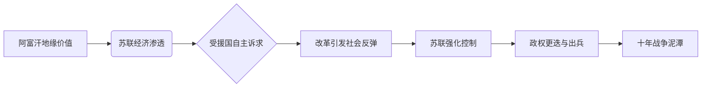

# 勋宗能不能做阿富汗的 sugar daddy？【奇葩小国20】

> **UP主**: 小约翰可汗  
> **时长**: 14:07  
> **发布时间**: 2021-05-21 11:30:07  
> **链接**: https://www.bilibili.com/video/BV1v54y1L7zf
> **封面图**: http://i1.hdslb.com/bfs/archive/5f60a1974134e263ee3bcb81d0415dc9d52a7f2c.jpg

---

# 阿富汗：帝国坟场背后的地缘悲剧与苏联干预的失败——小约翰可汗《奇葩小国20》深度摘要报告

## 1. 视频概述（387字）

**核心主题**：本集聚焦阿富汗成为“帝国坟场”的历史逻辑，重点剖析苏联入侵阿富汗（1979-1989）的深层动因与失败根源。视频通过解构阿富汗独特的地缘位置、社会结构及苏联的“sugar daddy式干预”（经济援助→政治控制→军事入侵），揭示超级大国在复杂小国博弈中的战略误判。

**作者立场**：  
- **批判性视角**：讽刺苏联以意识形态输出替代本土化策略的霸权逻辑，强调“勋宗”（勃列日涅夫）的“舔狗式援助”终致反噬。  
- **人文关怀**：指出“帝国坟场”对阿富汗民众是血泪史，而非荣耀标签（“耗走超级大国的是阿富汗人的生命”）。  
- **历史辩证观**：承认阿富汗领导层（如达乌德、塔拉基）改革意图的合理性，但批判其脱离国情的激进实践。

**叙事结构**：  
1. **背景铺垫**：阿富汗地理/经济劣势与地缘价值矛盾（“海淀学区房摇到京A888”类比）；  
2. **历史脉络**：英国殖民失败→苏联渗透→达乌德改革→塔拉基激进社会主义实验；  
3. **关键转折**：苏联从“援助者”到“侵略者”的决策链条（1978-1979政变序列）；  
4. **深层归因**：文化错位（“人均胎教肄业的阿富汗不懂社会主义”）与大国傲慢。

---

## 2. 核心论点与关键概念

### 2.1 核心论点  
**论点1：阿富汗的“帝国坟场”属性源于地理劣势与地缘价值的悖论**  
- **地理劣势**：山地占80%、无出海口、基础设施匮乏、资源开发成本极高（“与索马里争垫底”）。  
- **地缘价值**：亚洲十字路口（南亚/西亚/中亚交汇），任何区域强权扩张必经之地（“匹夫无罪，怀璧其罪”）。  
- **悖论解析**：侵略者无法“以战养战”，游击战天然温床（案例：英军三次入侵均惨败，仅1名军医生还）。

**论点2：苏联的“sugar daddy式干预”注定失败**  
- **援助逻辑**：通过经济绑定实现政治控制（1954年起援建坎大哈公路耗资8000万美元，承担阿富汗一五计划60%资金）。  
- **控制失效**：受援国（阿富汗）利用美苏博弈争取自主性（达乌德“用苏联火柴点美国香烟”）。  
- **本质矛盾**：苏联要求“绝对忠诚”（勃列日涅夫：“忠诚不绝对=绝对不忠诚”），与阿富汗主权诉求不可调和。

**论点3：脱离国情的激进改革引爆社会危机**  
- **达乌德改革（1953-1963）**：世俗化/土改/妇女解放触动宗教与部族利益，上层与底层割裂（“奶盖奶茶式社会”）。  
- **塔拉基加速（1978-1979）**：试图“5年完成苏联60年事业”，暴力镇压保守势力（“阿富汗周天子玩大清洗”）。  
- **改革悖论**：良好目标（免除债务、反高利贷）因执行腐败与忽视传统结构（高利贷=民间银行）反致经济崩溃。

**论点4：苏联出兵决策是情报失误与领袖偏执的产物**  
- **理性评估**：1979年3月苏共中央全会明确反对出兵（安德罗波夫：“刺刀挽救革命不可接受”）。  
- **决策逆转**：塔拉基被亲美派阿明刺杀（1979.9），勃列日涅夫担忧阿富汗倒向美国（“物理上人头落地”）。  
- **认知偏差**：低估阿富汗抵抗意志（格鲁米科：“我们将成为侵略者”），高估军事实力速胜可能。

### 2.2 关键概念  
- **帝国坟场（Empire Graveyard）**：超级大国军事干预阿富汗均遭失败的地缘政治标签，实为阿富汗民众用血泪耗走侵略者的结果。  
- **勋宗（Хозяин）**：勃列日涅夫戏称，指其对“社会主义大家庭”家长式掌控的野心。  
- **红色亲王（Red Prince）**：达乌德（1953首相）的绰号，象征封建贵族推动亲苏改革的矛盾性。  
- **四月革命（1978.4.27）**：阿富汗人民民主党（PDPA）政变，非苏联策划但被其利用。

### 2.3 论点逻辑链  

---

## 3. 详细内容梳理

### 3.1 阿富汗的自然条件与历史宿命（1945-1953）  
- **地理困境**：64.7万平方公里国土中可用地不足20%，交通依赖苏联援建的**兴都库什山脉公路网**。  
- **殖民伤痕**：1839-1919年英国三次入侵失败，最惨一役仅1人生还（“我就是全部队伍”军医梗）。  
- **冷战前夜**：查希尔国王维持亲美路线，但苏联视阿富汗为“中亚宗教渗透防火墙”（类比马岛于阿根廷）。

### 3.2 达乌德时期：改革尝试与美苏博弈（1953-1978）  
- **第一次执政（1953-1963）**：  
  - 推动世俗化改革（妇女教育权、限制宗教法庭），遭保守派抵制。  
  - 在美苏间骑墙：接受苏联基建援助（坎大哈公路）与美国粮食（数十万吨小麦），获双倍援助。  
  - 被国王罢免：1963年因权力膨胀及改革失控下台。  
- **第二次执政（1973-1978）**：  
  - 政变上位：借苏联支持的PDPA力量推翻君主制，成立阿富汗共和国。  
  - 激进改革：土地国有化、禁止高利贷、工业国有化，导致经济瘫痪（“民间金融系统崩溃”）。  
  - 外交转向：加入不结盟运动，触怒勃列日涅夫（1977年天然气涨价事件）。

### 3.3 塔拉基时期：社会主义实验与苏联介入（1978-1979）  
- **四月革命（1978.4.27）**：PDPA推翻达乌德，塔拉基上台，改国号为**阿富汗民主共和国**。  
- **加速改革**：  
  - 口号：“五年完成苏维埃六十年事业”。  
  - 手段：镇压宗教领袖（连苏联劝其“温和”未果），土改激化部族矛盾。  
  - 后果：1978年6月东南部叛乱，难民潮→叛军扩大的恶性循环。  
- **苏联犹豫**：1979年3月拒绝出兵请求，仅提供**十万吨小麦+军事顾问**（科西金总理面告塔拉基）。

### 3.4 阿明政变与苏联出兵（1979.9-12）  
- **权力更迭**：1979年9月阿明刺杀塔拉基，转向美国寻求援助（CIA接触记录）。  
- **苏联误判**：勃列日涅夫担忧阿富汗倒美，推翻此前决议。  
- **入侵逻辑**：以“保卫革命”为名，实则维护中亚战略缓冲区（格鲁米科警告沦为“侵略者”无效）。

---

## 4. 重要引用与案例

### 4.1 关键引用  
- **地缘价值**：“阿富汗就像摇到京A888车牌却买不起车的人，怀璧其罪。”（隐喻其位置价值与国力落差）  
- **苏联控制逻辑**：“勋宗的原则：忠诚不绝对=绝对不忠诚。”（批判勃列日涅夫霸权思维）  
- **改革荒诞**：“塔拉基在阿富汗搞清洗？慈父有地表最强武力，你一个周天子也配？”（讽刺脱离国情的暴力改革）  

### 4.2 核心案例  
- **达乌德外交平衡术**：中情局评价“最快乐的事是用苏联火柴点美国香烟”，凸显小国在大国博弈中的生存策略。  
- **坎大哈公路象征**：苏联耗资8000万美元（1960年代币值）援建，却成反苏武装运输通道，隐喻援助反噬。  
- **四月革命乌龙**：克格勃报告“情况就是这么个情况”，反映苏联对代理人失控的茫然。

### 4.3 关键数据  
- 苏联援助规模：1954-1978年累计**12亿美元**（含1973年后突击援助），占阿富汗一五计划总资金60%。  
- 社会结构矛盾：改革前**宗教与部族势力**控制90%农村，与西化政府完全割裂。  
- 战争代价预估：1979年苏共全会已预见“所有不结盟国家反对”（后成现实）。

---

## 5. 深度分析与思考

### 5.1 深层含义  
- **“帝国坟场”的本质**：非阿富汗强大，而是侵略者陷入“文明认知陷阱”——用现代国家治理工具（社会主义/资本主义）强行改造部落社会，必遭传统结构反噬。  
- **大国干预的悖论**：经济援助若伴随政治控制（sugar daddy模式），将激发民族主义反弹（达乌德→阿明的去苏化）。  

### 5.2 历史与现实映照  
- **苏联教训与当代启示**：对比美国在阿富汗的失败（2001-2021），凸显外部势力无法用武力重构传统社会。  
- **文化适配性批判**：安德罗波夫指出“群众文盲+宗教强大”是社会主义革命根本障碍，对任何意识形态输出具有普适警示。  

### 5.3 争议视角  
- **改革者是否无辜？**  
  - **肯定派**：达乌德/塔拉基意图打破贫困循环（如土地改革）。  
  - **批判派**：无视渐进性（“五年完成六十年事业”），用城市精英思维绑架农村社会。  
- **苏联是否必然入侵？**  
  - **必然性**：地缘安全焦虑（阿富汗倒美=中亚失守）。  
  - **偶然性**：若非阿明刺杀塔拉基，苏联或延续顾问模式。

---

## 6. 结论与启示

### 6.1 核心结论  
- 阿富汗成为“帝国坟场”非因其强大，而源于侵略者对其**社会结构复杂性的低估**与**地缘价值的高估**。  
- 苏联的失败证明：经济援助无法替代本土化政治解决方案，“sugar daddy式干预”终将滑向军事泥潭。  

### 6.2 行动建议  
- **对政策制定者**：介入传统社会需尊重文化惯性（如宗教/部族），避免“一刀切”改革。  
- **对历史学习者**：警惕“帝国坟场浪漫化”，关注小国民众在霸权博弈中的真实代价。  

### 6.3 延伸思考  
- **假如苏联不出兵**：阿富汗是否会成“亚洲版智利”（美国扶持军政府）？  
- **传统社会现代化路径**：是否存在比激进改革更可行的中间方案？（参考视频未提及的伊朗巴列维改革对比）  
