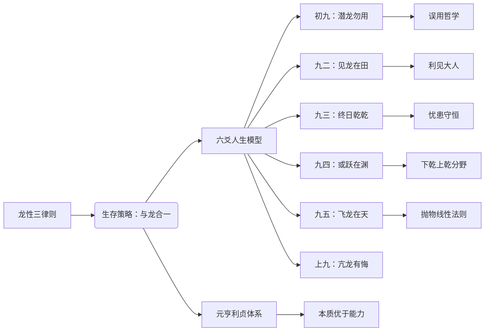

# 曾仕强解读《易经六十四卦》

> **UP主**: 道統華夏  
> **时长**: 53:38:42  
> **发布时间**: 2023-03-16 14:40:41  
> **链接**: https://www.bilibili.com/video/BV14o4y1z7wE
> **封面图**: http://i1.hdslb.com/bfs/archive/c98567b2d42903755aa5f94e3241b2b6280b0059.jpg

---

# 曾仕强解读《易经六十四卦》之乾卦深度分析报告

## 1. 视频概述
本视频由UP主“道統華夏”发布，标题为《曾仕强解读《易经六十四卦》》，聚焦**乾卦的哲学内涵与人生实践智慧**。曾仕强教授以**文化人类学视角**解析中国人“龙的传人”身份认同，并系统阐释乾卦六爻对应的人生发展阶段。视频全长约40分钟，采用**案例驱动型叙事结构**，通过三国诸葛亮案例贯穿始终，结合物理学原理（如抛物线理论）和职场现实，构建了“理论-隐喻-实践”三层解读框架。

视频核心主题在于揭示**《易经》作为行为决策系统**的本质：乾卦六爻（潜龙勿用、见龙在田、终日乾乾、或跃在渊、飞龙在天、亢龙有悔）不仅象征人生进阶，更是组织发展、商业决策的动态模型。曾仕强强调**阴阳辩证思维**，指出乾卦虽全为阳爻，但必须关注“看不见的阴”（如人际关系、环境适配），颠覆了传统对“自强不息”的片面理解。

## 2. 核心论点与关键概念

### 2.1 核心论点
1. **龙性三律则**：中国人自认龙的传人源于龙三大特性——变化多端（应对无常）、难缠（不可控性）、神通广大（突破限制），由此导出“与龙合一”的生存智慧  
2. **六爻人生模型**：乾卦六爻构成完整人生进阶路径，每阶段需遵循不同法则（如初九“潜龙勿用”强调积累，九五“飞龙在天”警惕脱离群众）  
3. **元亨利贞操作体系**：卦辞“元亨利贞”是动态决策框架：“元”重动机纯正，“亨”重过程谨慎，“利”重利益分配公平，“贞”重结果校正  
4. **本质优于能力**：中国社会评价标准非单纯能力，而是“本质=能力×环境适配度×群众接受度”的复合函数  
5. **忧患守恒定律**：人生成就与忧患意识正相关（九三“夕惕若厉”），无人视为对手才是最大危机  

### 2.2 关键概念
- **误用哲学**：“勿用≠不用”，而是“站在不用的立场来用”的辩证策略（00:12:30）  
- **利见大人**：二爻与五爻的镜像关系，揭示上下级相互成就的动力学（00:25:44）  
- **下乾上乾分野**：三爻前为“实力积累阶段”，四爻后为“风险决策阶段”（00:35:18）  
- **抛物线性法则**：亢龙有悔的物理学隐喻，揭示物极必反的必然性（00:08:22）  
- **贞操现代解**：“固正的操守”，超越性别范畴的伦理准则（00:51:07）  

### 2.3 逻辑关系

## 3. 详细内容梳理

### 3.1 文化根源与乾卦总论（00:00-00:12）
- **龙的传人深层逻辑**：龙三特性引出的生存智慧——对抗则痛苦，融合则借力（案例：黄河治水隐喻）  
- **天行健本质**：天空“空无所有”却能“云行雨施”，揭示“无之为用”的哲学（00:07:15）  
- **六爻基本定位**：初九潜龙→九二见龙→九三惕龙→九四跃龙→九五飞龙→上九亢龙  

### 3.2 初九到九三实践智慧（00:12-00:30）
- **潜龙勿用三重困境**：环境未知、自我不确定、未来难料（00:13:50）  
- **诸葛亮案例解析**：27年潜伏期的关键点——三顾茅庐时以“天下苍生”测试刘备诚意（00:17:33）  
- **见龙在田风险**：表现即树敌，九二至九三过渡需“制造敌人”以避免价值贬值（00:22:07）  
- **职场映射**：新入职场“路径问数”法则，反对盲目表现（孔子“每事问”案例）  

### 3.3 九四到上九进阶策略（00:30-00:42）
- **或跃在渊决策树**：  
  - 成功概率评估（“七八个副总仅一人晋升”现实数据）  
  - 轿子理论：被捧高位者实受抬轿者操控（00:33:40）  
- **飞龙在天平衡术**：  
  - 风筝隐喻：群众基础如牵绳（00:38:11）  
  - “双见大人”悖论：九五需九二支撑，但两者皆阳爻暗示完全自主责任  
- **亢龙有悔物理学**：抛物线顶点后必然下坠，对应“高而无位”困境  

### 3.4 元亨利贞操作体系（00:42-00:52）
- **四维决策模型**：  
  | 维度 | 要义 | 现代转化 |  
  |---|---|---|  
  | 元 | 谋定后动 | 项目前置期（如安全验收） |  
  | 亨 | 互通有无 | 资源整合与环境保护 |  
  | 利 | 公利分配 | 股权设计合理性 |  
  | 贞 | 结果校正 | KPI伦理审查 |  
- **贞操本质**：跨性别伦理准则，如企业家坚守商业底线（00:51:30）  

### 3.5 乾卦应用方法论（00:52-结束）
- **六爻定位法**：人生/企业阶段自测表  
- **阴阳显隐观**：乾卦变既济卦的危机预示（六阳爻中隐伏六阴爻）  
- **本质修炼三要素**：能力×环境适配度×群众接受度  

## 4. 重要引用与案例

### 4.1 经典引用
> “勿用是要用，但要站在不用的立场来用”——误用哲学核心（00:14:20）  
> “无人把他当对手的人，才是最没有价值的人”——忧患意识价值论（00:23:05）  
> “风筝飞得越高，越需要那条线”——群众基础论（00:38:30）  

### 4.2 关键案例
**诸葛亮决策链分析**  
- **潜伏期**：27年拒绝曹操/孙权，等待“三顾茅庐”形式验证  
- **表现期**：提出《隆中对》后以“另请高明”测试刘备责任感  
- **惕龙期**：被曹操锁定为靶标后“终日乾乾”平衡蜀汉内政  
- **失误点**：九二爻“过现”导致刘备权力危机感  

**创业抛物线模型**  
- 地摊→小店→连锁→崩盘：违反“下乾上乾分野”法则  
- 关键数据：小老板满足于下乾（三爻内）的成功率＞盲目扩张者  

## 5. 深度分析与思考

### 5.1 哲学深意
乾卦揭示**动态平衡智慧**：  
- “自强不息”需配合“忧患守恒”（九三爻）  
- “飞龙在天”必须绑定“利见大人”（二五呼应）  
- 全阳爻中隐含阴爻危机（亢龙脱离群众）  

### 5.2 历史镜鉴
**帝王生命周期验证**：  
- 汉文帝（潜龙勿用）→ 汉武帝（飞龙在天）→ 汉昭帝（亢龙有悔）  
- 组织学映射：新创企业（初九）→ 上市（九五）→ 官僚化（上九）  

### 5.3 争议视角
1. **消极性争议**：“潜龙勿用”可能被误解为保守主义  
   - 反驳：27年潜伏本质是精准定位（刘备集团最优解）  
2. **本质论局限**：过度强调环境适配或导致创新压抑  
   - 平衡点：特斯拉案例（环境不适配仍突破）需结合坤卦解读  

## 6. 结论与启示

### 6.1 核心结论
- 乾卦是**动态风险控制系统**，六爻对应人生/组织六阶段风险点  
- 成功=龙性认知（应变力）× 爻位适配 × 元亨利贞执行  

### 6.2 实践启示
1. **阶段诊断**：用六爻模型评估自身/企业当前定位  
2. **误用策略**：重要决策前设置“勿用期”（如项目冷静期）  
3. **大人网络**：关键节点构建“双见大人”支撑体系  
4. **贞操审计**：定期检验“利益分配公正性”与“结果伦理性”  

### 6.3 延伸思考
- **坤乾互补**：乾卦自主性需结合坤卦包容性（视频预告）  
- **现代转化**：  
  - 职场：OKR系统需植入“夕惕若厉”风险模块  
  - 创业：融资阶段匹配爻位策略（A轮=九二现龙）  

> 曾氏箴言：“读通六十四卦者，不必占卜；知爻位者，自见吉凶”（00:45:17）  

**附录：乾卦六爻行动指南**  
| 爻位 | 状态 | 核心策略 | 风险预警 |  
|---|---|---|---|  
| 初九 | 潜龙 | 路径问数 | 温室花朵 |  
| 九二 | 见龙 | 利见大人 | 过现树敌 |  
| 九三 | 惕龙 | 夕惕若厉 | 价值贬值 |  
| 九四 | 跃龙 | 轿子测试 | 进退失据 |  
| 九五 | 飞龙 | 握线守中 | 脱离群众 |  
| 上九 | 亢龙 | 知止戒悔 | 抛物线坠 |