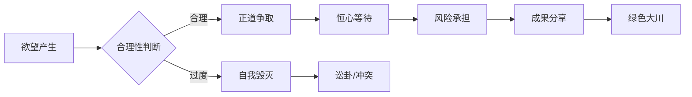

# 曾仕强解读《易经六十四卦》

> **UP主**: 道統華夏  
> **时长**: 53:38:42  
> **发布时间**: 2023-03-16 14:40:41  
> **链接**: https://www.bilibili.com/video/BV14o4y1z7wE
> **封面图**: http://i1.hdslb.com/bfs/archive/c98567b2d42903755aa5f94e3241b2b6280b0059.jpg

---

```markdown
# 曾仕强解读《易经六十四卦》视频摘要报告  
## 视频概述  
本视频由UP主"道統華夏"发布，内容为曾仕强教授对《易经》需卦（第五卦）的深度解读。视频聚焦**需卦的哲学内涵与现实应用**，核心主题包括：  
- **欲望的双重性**：合理需求是发展驱动力，过度欲望导致痛苦与冲突  
- **等待的智慧**："守时待命"是应对需求的核心策略  
- **卦象的现实映射**：通过卦爻结构分析人生各阶段的需求管理  

曾仕强采用**儒家伦理视角**，结合历史案例与现代社会现象，强调：  
1. 需卦与蒙卦（第四卦）的辩证关系：知识启蒙需与智慧培养同步  
2. 卦序逻辑：卦象排列反映事物发展规律（如激烈变革后需缓和过渡）  
3. **批判现代消费主义**：直指"想要就要"的即时满足文化弊端  

视频结构分为三部分：  
1. **卦象释义**（0-10min）：需卦象征意义（水天需→云在天上）  
2. **六爻逐层解析**（10-30min）：从初九到上六的人生阶段隐喻  
3. **现实应用**（30-45min）：李政道案例、家庭教育、财富伦理  

---

## 核心论点与关键概念  
### 一、需卦三重内涵  
1. **需要（Necessity）**  
   - 定义：人类生存发展的基本驱动力  
   - 合理性边界：衣食住行→自我实现需"节制"而非"禁欲"  
   - 反例：日本企业垄断案例（标志泛滥引发员工炸厂）  

2. **等待（Waiting）**  
   - 时间哲学："过程认知"教育（如婴儿喂食需感受等待过程）  
   - 李政道案例：诺贝尔奖评审期占得需卦→平和心态应对延迟  

3. **必须（Must）**  
   - 责任维度：男性乾卦象征家庭责任担当  
   - 社会义务：富人需"富而仁"（避免财富垄断引发仇视）  

### 二、欲望管理模型  


### 三、卦爻结构哲学  
1. **坎（水）乾（天）互动**  
   - 下乾上坎：君子进取需面对风险（5/6爻当位）  
   - 坎为云：高位需求如云聚散需自然规律  

2. **六爻人生映射**  
   | 爻位 | 阶段         | 关键风险               |  
   |------|--------------|------------------------|  
   | 初九 | 郊外（起步） | 好高骛远               |  
   | 九二 | 沙地（竞争） | 闲言碎语（"小有言"）   |  
   | 九三 | 泥泞（近险） | 强求导致"自寇"         |  
   | 六四 | 血穴（得利） | 代价认知（"出自穴"）   |  
   | 九五 | 宴饮（成就） | 独享引发危机           |  
   | 上六 | 陷落（巅峰） | 不速之客（三类侵扰者） |  

---

## 详细内容梳理  
### 第一部分：需卦本质（0-15min）  
- **卦象矛盾解析**：  
  - 水在天上→云聚降雨需时间积累（02:30）  
  - 对比坤卦激烈变革：需卦强调渐进满足（04:15）  

- **欲望伦理批判**：  
  - 纵欲（资源枯竭）vs禁欲（发展停滞）→主张"节欲"（07:20）  
  - 案例：冲动消费（拍卖抢购无用商品）导致"自寻烦恼"（12:40）  

### 第二部分：爻辞实践智慧（15-30min）  
1. **初九：利用恒**  
   - 年轻人需认知发展漫长性（郊外缓行隐喻）  
   - 反例：年轻创业者跳楼（急功近利后果）（18:10）  

2. **九二：小有言**  
   - 阳居阴位→竞争环境谣言应对（22:05）  
   - 管理启示：职位晋升"公正非公平"（资源稀缺性决定）（25:30）  

3. **上六：不速之客**  
   - 三类侵扰者：税务稽查/绑架勒索/亲友索求（28:15）  
   - 延伸问题：富二代"塑胶卡片依赖症"（财富传承陷阱）（29:50）  

### 第三部分：现实应用（30-45min）  
- **家庭教育模型**：  
  - 错误案例：婴儿即刻满足→成年急躁性格（32:20）  
  - 正向实践：无电视家庭→子女考取交大（延迟满足训练）（40:10）  

- **社会财富伦理**：  
  - 仓廪实而知礼节：富人需维护社区安宁（如控制车马喧嚣）（35:40）  
  - 历史警示：富不过三代→因"福分不可一次享光"（37:25）  

---

## 重要引用与案例  
### 核心观点引用  
> "所有需要都要承担风险，这就是坎卦'险在前'的意义"（05:50）  
> "欲望太多的人不可能满足，一不满足就开始抱怨争夺"（08:15）  
> "李政道占得需卦不问吉凶，但问如何安度等待"（34:30）  

### 关键案例详述  
1. **李政道等待诺奖**  
   - 背景：论文评审期占得需卦  
   - 实践：以茶会友消解焦虑→获诺奖印证"守时待命"  
   - 深层逻辑：审查越久反证价值越高（33:10）  

2. **日本企业爆炸事件**  
   - 经过：员工因企业标志无处不在（毛巾/火车/洗手盆）而炸厂  
   - 分析：垄断引发"如来佛掌心"窒息感→需卦反面警示（26:40）  

3. **维他命中毒隐喻**  
   - 原理：过量补充导致中毒→类比欲望硬吞"蛇吞象"  
   - 延伸：特殊需求管制（如鸦片医疗用途限制）（43:20）  

---

## 深度分析与思考  
### 文化哲学深层含义  
1. **儒家责任伦理**  
   - 需卦"必须"维度呼应《孟子》"思诚者人之道"  
   - 批判现代个人主义：知识分子的社会义务（37:00）  

2. **时间观东西对比**  
   - 西方线性时间观→需卦循环等待观（降雨隐喻）  
   - 现实意义：缓解当代人"速度焦虑症"  

### 争议点探讨  
1. **性别角色固化**  
   - 乾卦男性责任论可能强化传统性别分工  
   - 反驳视角：卦象可解读为"主动担当"非性别限定  

2. **欲望积极性弱化**  
   - 潜在问题：过度强调节制可能抑制创新动力  
   - 平衡点：视频主张"合理需求驱动发展"（需卦正面意义）  

### 现代适用性  
- **企业管理**：  
  - 资源分配"公正非公平"（九二爻竞争管理）  
  - 高管"九五宴饮"需成果分享（避免团队分裂）  
- **心理健康**：  
  - 延迟满足训练（初九恒心培养）  
  - 财富焦虑化解（上六不速之客预防）  

---

## 结论与启示  
### 核心结论  
1. **需求本质三重性**：生存需要→过程等待→责任必须  
2. **发展核心矛盾**：欲望驱动力与毁灭力共存  
3. **终极解决方案**：守正（诚信）+ 待时（忍耐）+ 分享（消弭嫉妒）  

### 行动建议  
- 个人层面：  
  - 建立"需求合理性评估清单"（是否必需/是否可延迟/是否伤及他人）  
  - 实践"十分钟法则"：冲动消费前强制等待  
- 社会层面：  
  - 教育系统强化过程认知（如项目式学习替代即时考试反馈）  
  - 财富伦理建设："富而仁"社区公约（如噪音控制/资源共享）  

### 延伸问题  
1. **数字化时代需求异化**：  
   - 即时满足（网购/短视频）如何破坏需卦智慧？  
2. **生态维度解读**：  
   - 人类发展需求与自然承载力的"需卦平衡点"何在？  
3. **卦序现代重构**：  
   - 在AI革命背景下，坤卦（剧烈变革）与需卦（调适等待）如何重新排序？  

> **曾氏箴言总结**："所有好东西不能硬吞、独吞、见吞，节制才是最大幸福"（45:00）
```