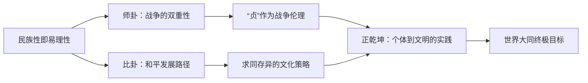

# 曾仕强解读《易经六十四卦》

> **UP主**: 道統華夏  
> **时长**: 53:38:42  
> **发布时间**: 2023-03-16 14:40:41  
> **链接**: https://www.bilibili.com/video/BV14o4y1z7wE
> **封面图**: http://i1.hdslb.com/bfs/archive/c98567b2d42903755aa5f94e3241b2b6280b0059.jpg

---

```markdown
# 曾仕强解读《易经六十四卦》视频摘要报告

## 1. 视频概述
**核心主题**：本视频由曾仕强教授通过《易经》的讼卦、师卦、比卦，深入剖析中华民族的文化基因、行为逻辑及社会治理智慧，揭示《易经》对现代社会的启示意义。  
**背景**：视频基于《易经》六十四卦的哲学体系，结合历史案例、社会现象和国际关系，阐释中国人“阴阳之道”的行为特征，重点探讨战争（师卦）与和平（比卦）的辩证关系。  
**作者立场**：曾仕强强调《易经》是“中华民族的DNA”，主张以东方智慧（如“不求胜而求不败”“以不战为主”）化解现代冲突，批判西方霸权思维，呼吁回归“王道”。  
**叙事结构**：  
1. **文化基因层**：从民族性切入，以“一阴一阳之谓道”解释中国人行为矛盾；  
2. **卦象解析层**：逐层分析讼卦（争端）、师卦（战争）、比卦（和谐）的卦辞、爻象与现实映射；  
3. **现代启示层**：将卦象延伸至国际关系、教育危机、企业管理等当代议题；  
4. **文明愿景层**：以“大同世界”为终极目标，提出“正乾坤”的行动框架。

---

## 2. 核心论点与关键概念
### 核心论点
1. **民族性即易理性**  
   - **逻辑链**：中华民族行为矛盾（如“无关利益时讲道理，涉及利益时不讲理”）本质是“一阴一阳之谓道”的体现 → 需以《易经》思维理解中国人“同意即不同意”的沟通逻辑（例：先说“同意”再提修改，避免情绪对抗）。  
   - **深层含义**：批判简单否定民族特性的观点，主张接纳矛盾性并引导向善。

2. **师卦：战争的双重性**  
   - **逻辑链**：战争本质无好坏（“看你怎么打”） → 正义战争需满足“除暴安良”“为和平而战”条件 → 统帅“贞”（忠贞、正义、节制）是核心 → 滥用武力必致“凶”。  
   - **深层含义**：现代战争需避免“恶性竞争”，军事行动必须符合“王道”（如保全敌国民生）。

3. **比卦：和平发展的唯一路径**  
   - **逻辑链**：人类冲突从“斗力”（动物性）转向“斗志”（人性） → 比卦（互助）取代师卦（斗争）是文明进阶 → “求同存异”是中华文化核心 → 21世纪需以“文化吸引力”替代武力扩张。  
   - **深层含义**：核武器时代“共同毁灭”风险下，比卦是人类唯一生路。

### 关键概念
- **一阴一阳之谓道**：矛盾统一律，解释中国人理性与情绪化并存的行为逻辑。  
- **贞**（师卦核心）：含三重维度——忠贞（对领导者）、正义（战争目的）、节制（适可而止）。  
- **师忧比乐**：战争带来忧患，互助带来安乐，主张将“竞争”转化为“互助”。  
- **正乾坤**：回归《易经》根本，通过端正自身（品德修养）影响世界秩序。

### 论点逻辑关系


---

## 3. 详细内容梳理
### 第一部分：文化基因与讼卦（0:00–15:00）
- **核心内容**：  
  1. **民族性分析**：以“利关己则变脸”案例，说明《易经》已内化为民族DNA，需用“阴阳思维”理解行为矛盾。  
  2. **讼卦宗旨**：化解争端需“站在不讼的立场来讼”（例：孔子写《春秋》批判诸侯，实为“不得已而讼”）。  
  3. **争端演化**：人类从“斗力”（原始暴力）到“斗志”（智谋），需以教化引导向善。

### 第二部分：师卦的战争哲学（15:01–38:00）
- **核心内容**：  
  1. **卦象解析**：  
     - 地中有水（坎下坤上） → 水静藏于地，喻战争潜藏风险与必要性（如饮水有毒可致死）。  
     - “贞”为统帅第一要义：岳飞、关羽为例，忠贞与节制避免后患。  
  2. **战争伦理**：  
     - **正义性**：“除暴安良”才符合王道（反例：西方殖民侵略属霸道）。  
     - **节制性**：关羽释黄忠、孙子兵法“全国为上”保全敌国。  
  3. **现代映射**：  
     - 企业军事化管理危险（军人可枪毙，员工不可）；  
     - 教师“传道”责任缺失，沦为“考试引导者”。

### 第三部分：比卦与文明进阶（38:01–55:00）
- **核心内容**：  
  1. **卦象对比**：师卦“地中有水”（静）→ 比卦“地上有水”（动），水流动象征互助共生。  
  2. **中日对比**：  
     - 日本“必胜”（被迫团结） → 中国“不败”（弹性团结），后者更智慧。  
  3. **历史案例**：  
     - 郑和下西洋不殖民（反例西方质疑“为何不占马来西亚”）；  
     - 二战中国收留犹太人同化（比卦“不安宁者自来”）。  
  4. **地球村路径**：经济互通需升级为文化互助（奥运竞争无助于地球村）。

### 第四部分：终极目标——世界大同（55:01–结束）
- **核心内容**：  
  1. **卦象终点**：同人卦（求同）→ 大有卦（共享），对应《礼记》“天下为公”。  
  2. **实践前提**：  
     - 个体“正乾坤”（端正品德）；  
     - 国家“走比卦”（放弃军备竞赛）。  
  3. **警示**：核按钮时代“共同毁灭”风险，人类必须选择比卦。

---

## 4. 重要引用与案例
### 关键引用
> “战争有什么好？战争有什么不好？他没有好坏，看你怎么打。”  
> “赢的人要装没赢，输的人要硬撑装没输，那才是最高境界。”  
> “易经为君子谋，不为小人谋——你本身不重视品德，读易经反而更糟糕。”

### 经典案例
1. **关羽释黄忠**：  
   - 关羽不杀落马黄忠 → 黄忠感恩，次日战场射箭故意偏离 → 体现“贞”的智慧（胜而不辱）。  
2. **郑和下西洋**：  
   - 明朝厚待朝贡使团（反被诟病“人越多越亏”） → 对比西方殖民逻辑，诠释“王道”与“霸道”差异。  
3. **二战犹太人**：  
   - 中国收留犹太人使其认同为“中国人” → 比卦“方来”精神的实践（包容不安宁者）。

### 数据与统计
- 据视频：人类文明史上5000年发生战争超15000次，数十亿人丧生（注：数据为视频引用，未标注具体来源）。

---

## 5. 深度分析与思考
### 深层含义
- **易理的现代性**：将卦象转化为“竞争vs互助”“专业vs全人”等当代命题，揭示传统文化解决现代冲突的潜力。  
- **王道叙事的重构**：通过“不殖民”“收留难民”等案例，挑战西方中心视角的历史评价体系。

### 现实意义
- **国际关系**：批判北约东扩等“师卦思维”，呼吁大国以文化吸引力（比卦）替代军事威慑。  
- **教育危机**：现代教育培养“专人”而非“全人”，背离《大学》教化目标。

### 争议点
1. **民族性争议**：  
   - 曾仕强将行为矛盾归因“易理”可能弱化制度批判，忽视权力结构对民族性的塑造。  
2. **战争伦理简化**：  
   - “除暴安良”标准模糊（例：如何定义“暴”？），易为干涉主义提供借口。

---

## 6. 结论与启示
### 核心结论
1. 中华民族行为逻辑根植《易经》，需以“阴阳思维”理解而非否定其矛盾性。  
2. 战争必须受“贞”（正义、忠贞、节制）约束，否则必致凶祸。  
3. 比卦的“求同存异”是人类避免核毁灭的唯一路径，需从“竞争”转向“互助”。

### 行动建议
- **个体层面**：正心修身（“正乾坤”），避免“小人读易”。  
- **国家层面**：以文化输出替代武力扩张（例：推广“不败”哲学，放弃“必胜”执念）。  
- **文明层面**：推动“地球村”从经济共同体转向价值共同体（超越奥运式竞争）。

### 延伸思考
- 若“比卦”要求接纳不安宁者（如难民），发达国家如何平衡人道与安全？  
- “仁者无敌”在AI战争时代是否失效？如何重新定义“贞”的统帅伦理？
```