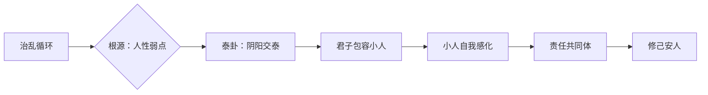

# 曾仕强解读《易经六十四卦》

> **UP主**: 道統華夏  
> **时长**: 53:38:42  
> **发布时间**: 2023-03-16 14:40:41  
> **链接**: https://www.bilibili.com/video/BV14o4y1z7wE
> **封面图**: http://i1.hdslb.com/bfs/archive/c98567b2d42903755aa5f94e3241b2b6280b0059.jpg

---

```markdown
# 曾仕强解读《易经六十四卦》视频摘要报告

## 1. 视频概述（核心主题与背景）
- **核心主题**：通过《易经》泰卦（䷊）与否卦（䷋）的辩证关系，探讨人类社会“治乱循环”的根源，提出“天下太平是所有人共同责任”的核心命题。重点分析君子与小人的相处之道，揭示“修己安人”的实践哲学。
- **背景**：基于人类群居后物质积累引发的社会矛盾（“储蓄越多问题越大”），溯源至天道与人心的关系（“天道即人心”），以历史治乱循环为实证场景。
- **作者立场**：曾仕强以新儒家视角解读，主张：
  - 反对“消灭小人”的对抗思维，强调感化与包容；
  - 批判君子“自命清高”导致的社会割裂；
  - 提出“合理的不公平”是社会常态的颠覆性观点。
- **叙事结构**：采用“问题—卦象分析—历史印证—现代转化”四段式：
  1. 从历史治乱现象引出泰否二卦的哲学隐喻；
  2. 拆解泰卦卦象（乾下坤上）的物理象征（冷热气对流）；
  3. 通过六爻爻辞分层解构君子责任；
  4. 关联现代管理、家庭伦理等实践场景。

## 2. 核心论点与关键概念
### 2.1 核心论点
1. **泰否循环的本质**  
   - 太平（泰）→松懈→否塞（否）→警醒→太平，是人类社会的必然律动。
   - **关键论据**：  
     - 物理隐喻：冷气下沉、热气上升形成对流（空调安装原理），类比阴阳交泰（䷊）；反之则天地不交（䷋）。
     - 历史实证：“一治一乱，乱多治少”源于人性弱点（太则骄，否则奋）。

2. **君子与小人的共生关系**  
   - 小人存在价值：为君子提供“自我证明的参照系”，无小人则君子无意义。
   - **颠覆性观点**：  
     - 君子逼压小人反致其团结反抗（“小人笑道：君子团结置我于死地，故我更团结”）；
     - 标榜君子者实已沦为小人（“凡欲置人于死地者皆小人”）。

3. **责任共同体理论**  
   - 天下太平须君子小人共担责任：
     - 君子责任：修己感化（非征服）、包容异己（“包荒”）、放弃绝对公平幻想；
     - 小人责任：自我觉醒（“小人能自变”）、逆取顺守（以正道巩固既得利益）。

### 2.2 关键概念
| 概念         | 定义                                                                 | 现代转化案例                     |
|--------------|----------------------------------------------------------------------|----------------------------------|
| **小往大来** | 阴（小）上行、阳（大）下行形成能量对流                              | 企业决策：高层（阳）倾听基层（阴） |
| **修己安人** | 君子通过自我修养安定他人（含小人）                                  | 管理者包容“问题员工”             |
| **合理的不公平** | 社会必然存在差异（如长子继承制），追求绝对公平反致混乱          | 绩效分配中的梯度设计             |

### 2.3 论点逻辑链


## 3. 详细内容梳理（分段分析）
### 3.1 泰卦的物理与哲学隐喻（0:00-12:30）
- **卦象科学解**：
  - 乾（天）在下、坤（地）在上违反直观，实指“气”的运动：
    - 冷气下沉：空调需装顶部（阴气下行）；
    - 热气上升：暖气需装底部（阳气上行）。
  - **结论**：位置颠倒反促能量交换，隐喻“君子居下位反能感化小人”。
- **历史警示**：
  - 案例：周朝“成康之治”后昭王骄奢致衰（“公司赚大钱后三月倒闭”）。

### 3.2 六爻责任分层论（12:31-38:20）
| 爻位   | 角色         | 核心诫命                     | 实践场景                     |
|--------|--------------|------------------------------|------------------------------|
| **初九** | 基层新人     | 拔茅茹，汇通志（团结同志）   | 年轻人反求诸己，拒推卸责任   |
| **九二** | 中层骨干     | 包荒，朋亡（包容异己弃党争） | 管理者用“问题员工”所长       |
| **九三** | 高层领导     | 无平不陂，艰贞无咎           | 警惕“合理不公平”，守初心     |
| **六四** | 觉悟者       | 翩翩不富，诚心归附           | 小人主动靠拢君子（如企业改革）|
| **六五** | 权力核心     | 帝乙归妹，选贤举能           | 领袖开放职位纳君子（逆取顺守）|
| **上六** | 守成者       | 城复于隍，勿用师             | 避免清算引发动荡             |

### 3.3 现代转化启示（38:21-结尾）
- **家庭伦理**：亲人互骗则亲情消亡（“你骗我我骗你，不成家”）；
- **组织管理**：  
  - 正面案例：冷气机安装原理应用于上下级沟通（上倾听下）；
  - 反面警示：标榜“公平”致员工内斗（“文人相轻是君子最大问题”）。

## 4. 重要引用与案例
### 4.1 核心引述
> “君子只要有置小人于死地之心，则已非君子。”  
> “天下太平不是理想，而是所有人的责任——包括小人。”  
> “冷气往下、热气往上，这是天道对我们最直接的启示。”

### 4.2 关键案例
- **航空特权现象**：  
  - 场景：乘客以“飞机即将起飞”为由插队通关；  
  - 分析：表面违反公平，实为“合理的不公平”（全局效率考量）。
- **兄弟穿衣矛盾**：  
  - 场景：弟弟抱怨总穿旧衣；  
  - 解决：“谁叫你晚出生”道破天然差异，非人力可平。

## 5. 深度分析与思考
### 5.1 深层含义
- **责任伦理的颠覆**：将社会矛盾归因于君子排他性（非小人破坏性），要求强者主动“下潜”（如天居乾下）。
- **循环史观的重构**：治乱非线性进步，而是“履带式”循环（泰→否→泰），警示盛世危机。

### 5.2 现实意义
- **组织管理**：包容“小人”（问题员工）可减少对抗，感化优于淘汰；
- **社会治理**：追求“合理差异”（如梯度税率）比绝对公平更可持续。

### 5.3 争议点
- **小人责任论可行性**：要求既得利益者（小人）自我觉醒是否理想化？
- **公平观挑战**：“合理不公平”可能沦为特权辩护（如插队案例的滥用风险）。

## 6. 结论与启示
### 6.1 核心结论
- 天下太平的根基在于 **“责任共同体意识”** ，君子需以 **“修己安人”** 代替道德优越感，小人需走 **“逆取顺守”** 之路。
- 泰卦的真正启示是 **“下潜的智慧”** ：强势者居下位促成能量交换（如领导倾听员工）。

### 6.2 行动建议
- **个人层面**：  
  - 君子：每日自问“是否在逼小人团结对抗？”；  
  - 小人：检视所得是否合道（逆取者须顺守）。
- **组织层面**：  
  - 建立“包荒”机制（如问题员工转化计划）；  
  - 放弃绝对公平幻想，接受梯度差异。

### 6.3 延伸思考
- 若将“泰否循环”应用于气候变化：人类发展（泰）→环境崩溃（否）→能否回归新平衡？
- 数字时代中的“阴阳交泰”：数据（阳）与隐私（阴）如何对流共生？
```