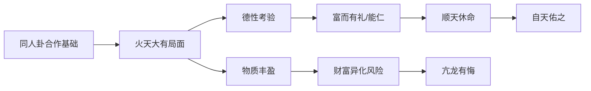

# 曾仕强解读《易经六十四卦》

> **UP主**: 道統華夏  
> **时长**: 53:38:42  
> **发布时间**: 2023-03-16 14:40:41  
> **链接**: https://www.bilibili.com/video/BV14o4y1z7wE
> **封面图**: http://i1.hdslb.com/bfs/archive/c98567b2d42903755aa5f94e3241b2b6280b0059.jpg

---

```markdown
# 曾仕强解读《易经·大有卦》视频摘要报告

## 1. 视频概述（348字）
- **核心主题**：本视频深度解析《易经》六十四卦中的**大有卦**（火天大有），聚焦财富伦理与人生智慧。曾仕强教授通过卦象分析、爻辞解读，揭示“大有”的本质并非物质丰盈，而是**德性修养与财富管理的辩证关系**。
- **作者视角**：曾仕强以**儒家伦理为根基**，融合道家自然观，强调：
  - 财富是天道与人道的共同产物
  - “大有”需以“同人卦”（前序卦）的集体合作为基础
  - 富贵需匹配道德修为才能持久
- **叙事结构**：
  1. **卦象溯源**：从同人卦到大有卦的卦变逻辑
  2. **卦辞深解**：“元亨”背后的危机意识
  3. **爻辞演绎**：六爻揭示财富阶段中的陷阱与出路
  4. **现实映射**：当代社会财富异化现象的批判

## 2. 核心论点与关键概念

### 2.1 核心论点
1. **“大有”的本质是德性而非物质**  
   - 卦象分析：一阴（六五）统五阳，喻示**精神统御物质**
   - 关键论断：“所有者大”需兼顾物质与精神，“分享大”才是天道所归
   - 逻辑链条：同人卦（合作）→集体成果→大有局面→德性守护→长久维系

2. **财富是对人性最高难度的考验**  
   - 行为异化：贫时守礼易，富时守礼难（案例：富者目中无人）
   - 生理映射：三高疾病作为“财富反噬”的象征
   - 曾氏警示：“安贫乐道易，安享富贵难”

3. **“大富由天”的运作机制**  
   - 天理维度：火在天上（离上乾下）象征非人力可及
   - 实践路径：富而有礼→富而能仁→普惠双全
   - 关键公式：小富=人力努力；大富=天理+祖德+共享

### 2.2 关键概念
- **当位/不当位**：爻位阴阳属性是否匹配（大有卦六爻仅两爻当位）
- **交卦**：同人卦（天火同人）颠倒成大有卦（火天大有）
- **柔得尊位**：六五阴爻居君位，以柔统刚的核心机制
- **艰则无咎**：初九爻核心智慧——忧患意识保障无患

### 2.3 论点逻辑关系


## 3. 详细内容梳理

### 3.1 卦象本源与结构（0:00-12:30）
- **卦变关系**：
  - 同人卦（䷌）颠倒成大有卦（䷍）
  - 互为交卦又互为综卦，揭示合作与收获的因果关系
- **卦辞深解**：
  - “元亨”背后危机：六爻四爻不当位，喻示“难得易失”
  - 自然隐喻：太阳晨升暮落，喻财富必然盛衰轮回
- **卦主分析**：
  - 六五爻核心作用：阴爻居尊位，吸引五阳应和
  - 领导力模型：黄裳元吉（坤德）+ 飞龙在天（乾位）

### 3.2 大象传与财富伦理（12:31-25:40）
- **火在天上**：
  - 与同人卦“火在天下”对比：从人力主导到天道主导
  - 现实映射：暴富者多凭机遇（拆迁/彩票），非纯人力
- **恶恶扬善**：
  - 心理机制：富者易生恶念（案例：报复性消费20条牛仔裤）
  - 实践路径：富时更需抑制恶念，发扬善行（如慈善）
- **顺天休命**：
  - 休=美好，指完成人道使命
  - 曾氏批判：医者不视病人为人，即失“仁”之本

### 3.3 六爻实践智慧（25:41-42:10）
| 爻位 | 爻辞 | 核心警示 | 现代映射 |
|-------|---------|-------------------|-----------------|
| 初九 | 无交害，艰则无咎 | 遗忘艰苦必招祸 | 新富挥霍心理 |
| 九二 | 大车以载 | 资源流通共享 | 企业供应链管理 |
| 九三 | 公用亨于天子 | 克制越级欲望 | 职场权限边界 |
| 九四 | 匪其彭 | 低调避锋芒 | 副职生存智慧 |
| 六五 | 厥孚交如 | 诚信无为而治 | CEO文化建设 |
| 上九 | 自天佑之 | 天人合一境界 | 家族传承哲学 |

### 3.4 现实批判与卦序启示（42:11-结尾）
- **富贵家庭病理**：
  - 案例：富豪拒认寒门儿媳却认孙，喻示财富割裂人性
  - 数据参照：突发横财者80%家庭破裂（视频引述社会现象）
- **卦序演进逻辑**：
  - 同人→大有→谦卦：暗示财富后需谦德防亢
  - 曾氏结语：“安享富贵需心理建设，其难度远胜安贫”

## 4. 重要引用与案例

### 4.1 关键引用
> “富而有礼，富而能仁，此之谓福慧双全”  
> “小富由人，大富由天——天即道德+环境+祖德”  
> “医生最大问题非无医德，乃不视病人为人”

### 4.2 经典案例
1. **太阳隐喻**：
   - 晨午暮光热变化，喻财富必然盛衰，人力仅能延缓衰退

2. **牛仔裤报复性消费**：
   - 贫穷时买不起，富有后狂购20条，揭示“与钱有仇”心理异化

3. **三高症候群**：
   - 生理数据：富贵病发病率达70%（视频观察），物质丰盈反噬健康

## 5. 深度分析与思考

### 5.1 哲学深层结构
- **德本财末体系**：
  - 以六五阴爻为卦眼，构建“精神驾驭物质”的东方治理学
  - 对比韦伯《新教伦理》：儒家以德性为财富合法性根基

### 5.2 历史现实映射
- **改革开放启示**：
  - 曾仕强隐含批判：GDP主义下“富而无礼”社会病
  - 解决方案：从“先富”到“共富”需“大有共享”智慧

### 5.3 争议视角
- **天命决定论风险**：
  - “大富由天”可能弱化个体努力
  - 曾氏平衡点：天道酬勤+资源共享，非纯粹宿命论
- **女性角色隐喻**：
  - 六五阴爻领导力模型是否强化传统性别定位？需结合现代治理再诠释

## 6. 结论与启示

### 6.1 核心结论
1. **财富本质**：大有非物资占有，乃“德性统领+资源共享”状态
2. **维系关键**：以初九“艰则无咎”为基，六五“孚交如”为用，上九“自天佑”为果
3. **历史定位**：同人→大有→谦卦的演进揭示文明发展必然周期律

### 6.2 行动建议
- **个人层面**：
  - 富时牢记“无交害”警示，建立财富忧患意识
  - 践行“四个有”准则：有功（公益）、有智（认知）、有人（仁爱）、有责（原则）
- **社会层面**：
  - 企业设计“九二大车以载”式共享机制
  - 政策强化“恶恶扬善”导向（如遗产税引导慈善）

### 6.3 延伸思考
- **数字化转型**：
  - 加密货币暴涨是否符合“火在天上”非人力可控特征？
- **全球化挑战**：
  - 国家层面“大有”如何平衡民族利益与人类共享？
- **生态维度**：
  - “顺天休命”能否转化为生态资本主义理论资源？
```