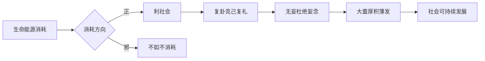

# 曾仕强解读《易经六十四卦》

> **UP主**: 道統華夏  
> **时长**: 53:38:42  
> **发布时间**: 2023-03-16 14:40:41  
> **链接**: https://www.bilibili.com/video/BV14o4y1z7wE
> **封面图**: http://i1.hdslb.com/bfs/archive/c98567b2d42903755aa5f94e3241b2b6280b0059.jpg

---

# 曾仕强解读《易经·无妄卦》视频摘要报告

## 1. 视频概述
- **核心主题**：本视频聚焦《易经》第25卦“无妄卦”（䷘）的哲学解读，深入探讨“无妄”在现代生活中的实践意义。曾仕强以“避免无妄之灾”为主线，结合儒家修身理念与当代社会问题，揭示“守正去妄”的生命智慧。
- **作者立场**：曾仕强采用“经世致用”视角，主张《易经》是动态的生活指南，强调：
  1. 自我约束为修身核心
  2. “无妄”需通过理性克制情感实现
  3. 科技时代更需敬畏天道
- **叙事结构**：视频采用“卦象解析→爻辞演绎→现实映射”三层递进：
  1. 卦辞总纲：定义“无妄”为“无妄念、无妄行、无妄语”
  2. 六爻分述：通过初九至上九的爻变案例说明实践路径
  3. 时代启示：关联网络社会、消费主义等现代议题

## 2. 核心论点与关键概念

### 2.1 核心论点
1. **生命本质是能源消耗过程**  
   - 人类存在即能源消耗，唯有“守正”才能使消耗产生价值
   - 邪道消耗不如不消耗：“合乎正道则利社会，邪道消耗徒增熵增”
2. **无妄卦是复卦与大蓄卦的枢纽**  
   - 逻辑链条：复卦（克己复礼）→ 无妄卦（杜绝妄念）→ 大蓄卦（厚积薄发）
   - 关键作用：培育人才需在“无妄期”完成
3. **无妄之灾源于系统关联性疏忽**  
   - 案例：六三爻“顺手牵牛”事件揭示环境责任（当地人未守望相助）
   - 现代映射：网络时代言行皆被记录，微小疏忽引发连锁反应
4. **“元亨利贞”有条件性**  
   - 与乾卦对比：乾卦四德无条件，无妄卦需满足“其匪正有眚”前提
   - 核心条件：行为守正、动机纯良、语言谨慎

### 2.2 关键概念
| 概念       | 定义                          | 现代转化                |
|------------|-------------------------------|-------------------------|
| **无妄**   | 无妄念/无妄行/无妄语         | 信息时代的数字自律      |
| **正**     | 合乎天道规律与社会伦理       | 可持续发展价值观        |
| **眚**     | 人为祸患（原指眼疾）         | 系统性风险              |
| **不远复** | 及时反省修正（颜回实践）     | 每日复盘机制            |
| **刚中外来**| 外部约束内化为自律（卦象解） | 法律→道德→习惯的转化    |

### 2.3 论点逻辑关系

## 3. 详细内容梳理

### 3.1 卦象本源（0:00-22:30）
- **天下雷行象**：天（乾）雷（震）组合象征自然律无处不在
  - 古代：雷区隐喻危机四伏
  - 现代：摄像头/大数据构成数字雷区
- **颜回案例**：孔子门生中唯颜回称“复圣”，因其“不远复”实践：
  - 犯错立即反省 → 及时修正 → 自然入无妄境
- **曾国藩实证**：每日“自讼”（自我审判）实现无妄
  - 关键细节：拒推翻清廷非因无能，实因“无妄念”

### 3.2 爻辞实践（22:31-48:15）
| 爻位 | 爻辞          | 实践要点                      | 现代警示                |
|------|---------------|-------------------------------|-------------------------|
| 初九 | 无妄往吉      | 纯阳不杂时行动可心想事成      | 动机纯净者不惧算法监控  |
| 六二 | 不耕获，不菑畬| 只问耕耘不问收获              | 反内卷：专注过程非KPI   |
| 六三 | 无妄之灾      | 环境责任缺失招灾（牛案详解）  | 数字时代需“道德冗余设计”|
| 九四 | 可贞无咎      | 外在不利时坚守本性            | 经济下行期的职业操守    |
| 九五 | 无妄之疾      | 守正者小过自愈                | 信任社会减少解释成本    |
| 上九 | 无妄行有眚    | 极端无妄反招灾                | 生存需求与道德平衡      |

### 3.3 现代转化（48:16-结尾）
- **网络无妄三原则**：
  1. 言为雷区：任何发言可能永久留存（“电梯对话泄露项目”案例）
  2. 行有熵增：行为产生不可逆影响（信用卡透支与大蓄卦断裂）
  3. 念即痕迹：思想通过数据具象化（推荐算法暴露欲望模式）
- **科技悖论**：便利性↔隐私丧失的辩证关系
  - 曾氏断言：“科技越发达，人类越需回归敬畏”

## 4. 重要引用与案例

### 4.1 核心引用
> “人的生命就是消耗能源的过程...同样消耗能量，合乎正道则利社会，邪道消耗不如不消耗”（5:22）  
> “无妄才能避免无妄之灾...最要紧是修口德”（18:14）  
> “网络时代的无妄卦就是为官之道...随时随地会把你上网”（50:07）

### 4.2 关键案例
**① 顺手牵牛案（六三爻实证）**  
- 事件链：外来者A拴牛 → B顺手牵牛 → 当地人C蒙冤  
- 责任分析：  
  - A责：过度信任环境（未托管）  
  - B责：机会主义行为  
  - C责：缺乏社区守望（“反求诸己”逻辑）  
- 现代映射：数据泄露事件中的三方责任  

**② 电梯危机（网络无妄案例）**  
- 场景：电梯内议论客户 → 客户亲属在场 → 商务谈判失败  
- 曾氏点评：“你以为同车即散，实则天下雷行”（52:33）

## 5. 深度分析与思考

### 5.1 哲学深意
- **动态平衡观**：无妄非绝对禁欲，而是“生存需求与道德律的弹性平衡”（上九爻解）  
- **责任外延**：个体需承担环境系统责任（牛案中的社区责任）  

### 5.2 现实争议
1. **保守性批判**：  
   - 反创新嫌疑（对“奇装异服/发型创新”的否定）  
   - 曾氏辩护：“从品德学问创新可，形式创新即妄”  
2. **天命论风险**：  
   - “天命不佑”可能弱化主观能动性  
   - 视频补充：“天命即先天条件+后天规划的结合”  

### 5.3 历史脉络
- 颜回“不远复”与王阳明“省察克治”的承袭  
- 曾国藩“自讼”日记对爻辞的实证价值  

## 6. 结论与启示

### 6.1 核心结论
1. 无妄卦本质是**能源管理哲学**：以最小熵增实现生命价值  
2. 现代践行三层次：  
   - 念层：减少算法喂养的欲望数据  
   - 言层：建立数字发言审核机制  
   - 行层：在系统关联中预设责任冗余  

### 6.2 行动建议
- **个人**：日行“三问”  
  1. 此念是否必要？  
  2. 此言是否利他？  
  3. 此行是否增熵？  
- **社会**：构建“无妄型创新”评价体系（品德创新＞形式创新）  

### 6.3 延伸思考
- 量子纠缠视角：“天下雷行”是否隐喻量子关联性？  
- AI伦理场景：算法训练如何实践“不耕获”原则（过程正义＞结果优化）  