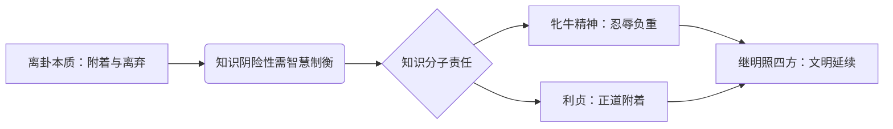

# 曾仕强解读《易经六十四卦》

> **UP主**: 道統華夏  
> **时长**: 53:38:42  
> **发布时间**: 2023-03-16 14:40:41  
> **链接**: https://www.bilibili.com/video/BV14o4y1z7wE
> **封面图**: http://i1.hdslb.com/bfs/archive/c98567b2d42903755aa5f94e3241b2b6280b0059.jpg

---

```markdown
# 曾仕强解读《易经六十四卦》之离卦深度摘要报告

## 1. 视频概述（核心主题与背景）
- **主题定位**：视频聚焦《易经》离卦（䷝）的哲学解读，以“知识文明的双刃剑效应”为核心命题，探讨知识、光明与道德伦理的辩证关系。曾仕强基于儒学传统视角，将离卦定位为“文明之卦”，同时警示知识脱离道德后的社会危害。
- **作者立场**：作为新儒家代表，曾仕强坚持“德本知末”的立场，批判现代知识功利化倾向，强调知识分子的社会责任（如“忍辱负重”“无成有终”）。其解读融合历史案例（如姜太公择主）、社会观察（教育异化）及自然隐喻（火与土的依存）。
- **叙事结构**：采用“卦辞→爻辞→象传”的经学解析框架，结合现实批判：
  1. 离卦本体论（卦象与卦辞）
  2. 六爻演进隐喻知识发展史（初九至九四：知识积累的陷阱；六五至上九：知识权威的异化与责任）
  3. 象传的文明延续之道（“大人以继明照于四方”）

## 2. 核心论点与关键概念
### 2.1 核心论点
**论点1：离卦的本质是“附着与离弃”的辩证统一**  
- 离卦（☲）象征火与光明，其核心矛盾在于：人类需附着知识以脱离蒙昧（如船渡河），但成功后常离弃道德根基（如弃船）。曾仕强以“坎陷需绳，出阱弃绳”类比，指出知识工具化导致伦理疏离。
- **深层逻辑**：知识若脱离“利贞”（守正）的德行附着，则如无根之火，终将焚尽文明资源（石油隐喻）。

**论点2：知识是危险的阴性能量，需阳刚智慧制衡**  
- 卦象分析：离卦两阳夹一阴（⚌☲⚌），属阴卦，喻指知识隐含“阴险性”（如智谋滥用）；坎卦（☵）两阴夹一阳，属阳卦，代表“澄澈智慧”。二者需互补：智慧为体（如水之恒定），知识为用（如火之变易）。
- **现实映射**：“智慧型犯罪”概念被斥为谬误——真正智慧者不会犯罪，因智慧含道德自觉。

**论点3：知识分子必须“牝牛式忍辱负重”**  
- “畜牝牛吉”卦辞解读：牝牛（母牛）象征知识分子应有的“负重不认主”精神：
  - 拒绝对权力/资本的依附（“不认主人认工作”）
  - 以百姓赋税为良知起点（“名校生需感恩未考生”）
  - 实践“无成有终”：不求个人功名，但求文明传承

**论点4：光明持续性的根基是“利贞”与“继明”**  
- “利贞”即光明需附着正道（如路灯指引车道），否则成妖魔之光；
- “继明照于四方”要求领导者以德行为能源，持续普照社会，避免“日仄之离”的文明衰颓。

### 2.2 关键概念
| **概念**       | **定义**                                                                 | **隐喻延伸**                     |
|----------------|--------------------------------------------------------------------------|----------------------------------|
| **离**         | 附着（脱离蒙昧）与离弃（道德剥离）的双重性                               | 知识工具化陷阱                   |
| **利贞**       | 知识需“合适地附着正道”                                                   | 批判盲目师承与知识滥用           |
| **畜牝牛**     | 知识分子如母牛忍辱负重，拒绝对权力/资本的依附                            | 对比“认主之马”的功利学术         |
| **继明**       | 光明持续性（如日月轮回），依赖德行能源                                   | 文明可持续发展观                 |
| **黄离**       | 中正和谐的知识应用（农业社会互助范式）                                   | 批判现代知识垄断                 |

### 2.3 论点逻辑链


## 3. 详细内容梳理（按爻辞结构）
### 3.1 离卦本体论（0:00-18:30）
- **卦象解码**：离为火（☲），外明内阴，喻知识表面光明内藏风险。对比坎卦（☵）为水，外柔内刚，喻智慧。
- **卦辞精要**：
  - “利贞”：知识需择善而附（如辨师言真伪）
  - “畜牝牛吉”：知识分子当如母牛负重，拒做“认主之马”
- **文明批判**：能源危机（石油枯竭）即“火焚尽附着物”的现实映照。

### 3.2 初九爻：知识摸索期的谨慎（18:30-25:10）
- **爻辞**：“履错然，敬之无咎”
- **解读**：知识初探如幼儿学步，需“敬”（慎重尝试）避陷阱。狩猎时代类比：无系统知识但谨慎，反少大错。
- **案例**：化学实验疏忽致爆→“敬之”即严谨治学。

### 3.3 六二爻：知识中道的黄金期（25:10-32:40）
- **爻辞**：“黄离，元吉”
- **解读**：农业社会为典范——知识应用中正互助（如共治虫害、水源共享），得因“顺天守中”。
- **对比**：工业革命后知识脱离“中道”，导致过度生产与生态崩溃。

### 3.4 九三爻至九四爻：知识异化危机（32:40-45:20）
- **九三爻**：“日昃之离，不鼓缶而歌则大耋之嗟”（黄昏时不知顺应而哀叹）
  - 批判：知识爆炸导致急功近利（学前教育狂热），违背“日起日落”自然律。
- **九四爻**：“突如其来如，焚如，死如，弃如”（知识突进如野火焚身）
  - 案例：现代人“心无所容”——24小时照明扰乱生理节律，隐喻知识膨胀反噬人类。

### 3.5 六五爻：知识权威的虚名陷阱（45:20-53:00）
- **爻辞**：“出涕沱若，戚嗟若，吉”（泪流哀叹却因位中得吉）
- **解读**：学者成名后陷入会议、作序等虚务（“附着王公”），知识停滞反被虚名保护。
- **警示**：地位越高越需谦虚，否则成“开眼瞎子”（徒有知识之名）。

### 3.6 上九爻：知识泰斗的终极责任（53:00-结尾）
- **爻辞**：“王用出征，有嘉折首，获匪其丑，无咎”
- **解读**：泰斗须以声望“正邦”——铲除邪恶知识（折首），教化同类（获匪其丑）。
- **案例**：诸葛亮七擒孟获显“知识风范”；某学者拒读晦涩著作因“真知应普世”。

## 4. 重要引用与案例
### 4.1 关键引用
> “知识是很重要的，但是知识是很可怕的…文明也要有相当的合理的限制。”  
> “学校花的是全体老百姓的钱…你越是读名校，越要感谢那些没考取的人。”  
> “凡有功劳者皆被忽略，才需忍辱负重…成就感是害自己失眠的毒药。”  

### 4.2 核心案例
- **姜太公择主**（40:15）：拒为纣王服务，因“所利不正”，喻知识分子需择正道而附。  
- **农业社会互助**（28:20）：水源共享与害虫共治，展“黄离”范式。  
- **现代教育批判**（36:50）：学前教育狂热致“四多惧”，违背知识渐进律。  

## 5. 深度分析与思考
### 5.1 深层含义
- **知识伦理学**：离卦实为“知识责任论”，将知识视为需德性约束的社会公器，挑战现代“价值中立”科学观。
- **文明周期律**：“日昃之离→继明”揭示文明盛衰取决于知识是否“附着正道”，暗合汤因比挑战应战理论。

### 5.2 现实意义
- **教育反思**：名校资源源于全民赋税，精英需以“牝牛精神”回馈社会。
- **科技伦理**：人工智能等知识爆炸领域需“利贞”约束，避免“焚如死如”。

### 5.3 争议点
- **知识阴险论**：将知识归为“阴卦”可能强化反智主义，忽略知识中性本质。
- **农业社会浪漫化**：对前工业时代的美化或淡化其知识局限性（如疫病认知）。

## 6. 结论与启示
### 6.1 核心结论
- 离卦揭示知识的根本矛盾：脱离道德附着则成文明之火，反之则焚毁自身。文明延续取决于知识分子能否以“牝牛精神”忍辱负重，坚守“继明照四方”的使命。

### 6.2 行动建议
- **个体层面**：知识学习需“敬慎择正”，警惕功利化；精英需感恩社会并回馈。
- **社会层面**：建立知识伦理框架，约束无德性创新（如基因编辑滥用）。

### 6.3 延伸思考
- **AI时代离卦新解**：当算法成为新“知识主体”，如何确保其“附着正道”？
- **全球化语境**：“继明照四方”是否可转化为文明互鉴范式？
```