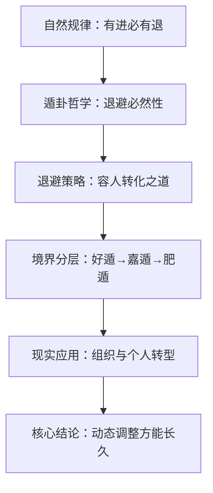

# 曾仕强解读《易经六十四卦》

> **UP主**: 道統華夏  
> **时长**: 53:38:42  
> **发布时间**: 2023-03-16 14:40:41  
> **链接**: https://www.bilibili.com/video/BV14o4y1z7wE
> **封面图**: http://i1.hdslb.com/bfs/archive/c98567b2d42903755aa5f94e3241b2b6280b0059.jpg

---

```markdown
# 曾仕强解读《易经·遁卦》视频摘要报告

## 1. 视频概述（核心主题与背景）
- **核心主题**：  
  视频深度解析《易经》第三十三卦"遁卦"（天山遁），聚焦"退避之道"的哲学内涵与现实应用。曾仕强教授从自然规律切入，指出"有起必有落，有进必有退"是人力不可抗的循环法则，批判现代人"要得不要失"的执念，强调遁卦的核心价值在于"适时退避以图长远发展"。

- **作者立场**：  
  曾仕强以"道统华夏"的文化传承视角，结合历史案例与管理学原理，主张"退避非消极逃避，而是战略性转进"。其核心立场可概括为三点：  
  ① 退避是顺应天道的智慧；  
  ② 君子退让需为小人留转化空间；  
  ③ 个人、组织均需建立动态转型机制。

- **叙事结构**：  
  采用"卦象解析→爻辞演绎→历史印证→现实应用"的四阶逻辑：  
  1. 以"云雾遮山，天退显真"喻卦象（乾上艮下）；  
  2. 逐爻分析退避策略的层次（初六至上九）；  
  3. 借刘备脱曹、唐太宗容魏征等案例深化论证；  
  4. 延伸至企业转型、家庭沟通、个人职业规划等现代场景。

## 2. 核心论点与关键概念

### 2.1 核心论点
**论点1：退避是自然法则的必然要求**  
- **逻辑链条**：  
  天地恒久 vs 人事短暂（例：树木千年更替 vs 人类百年寿命）→ 物不可久居其位（例：王朝周期律）→ 遁卦"不可久居"的警示 → 抗拒退避等于自寻苦恼。  
- **深层含义**：  
  将王朝衰亡归责于君子纵容小人，颠覆"小人祸国"传统认知，强调君子未及时退避导致系统僵化。

**论点2：退避是君子容人之道的实践**  
- **关键机制**：  
  "天退显山"隐喻：君子退让使小人暴露真实水平 → 予其改过舞台 → 转化成功则共存，失败则君子复位。  
- **战略本质**：  
  "不恶而严"原则（不露厌恶，保持威严）：避免激化矛盾，通过距离施加道德压力促小人自省。

**论点3：遁卦三级境界揭示退避艺术**  
- **境界分层**：  
  - 好遁（九四）：主动接受转型必要性；  
  - 嘉遁（九五）：退得漂亮且安排接班；  
  - 肥遁（上九）：退后无把柄可抓，逍遥无碍。  
- **现实映射**：  
  对比企业CEO"五年战略规划" vs "明年业绩焦虑"，强调高位者需提前布局退路。

### 2.2 关键概念
| 概念         | 定义                                                                 | 现实映射                     |
|--------------|----------------------------------------------------------------------|------------------------------|
| **不恶而严** | 远离小人但不显露厌恶，保持庄重以施加道德影响                         | 职场中与对手保持专业距离     |
| **功成不必在我** | 治理成效不限于个人掌控，退位让贤亦可成就系统健康                     | 企业接班人计划               |
| **时义**     | 退避时机与形势需求的精准匹配（"该退则退，不该退不退"）               | 行业转型窗口期判断           |
| **系遁**     | 心有挂碍的退避（九三爻），因贪恋权位陷入危险                         | 企业家恋权导致公司僵化       |

### 2.3 论点逻辑关系


## 3. 详细内容梳理

### 3.1 遁卦哲学基础（0:00-10:22）
- **卦象解析**：  
  - 乾（天）上艮（山）下：云雾遮山时天主动退避，实为揭示山矮天高的真相 → 喻君子退让使小人现形。  
  - 四阳爻压二阴爻：君子本可压制小人，但主动退避是为系统留转化空间。

- **历史警示**：  
  - 帝王终身执政导致"昏庸老皇帝拖垮王朝"（例：明朝万历怠政）；  
  - 对比唐太宗重用政敌魏征，论证"退避容人"的治理效能。

### 3.2 爻辞战略演绎（10:23-25:41）
| 爻位 | 爻辞          | 策略要点                                                                 | 案例                     |
|------|---------------|--------------------------------------------------------------------------|--------------------------|
| 初六 | 遁尾，厉      | 退避滞后则危险（例：伞业转型滞后，终以工艺品形式重生）                   | 传统行业转型窗口期       |
| 六二 | 执用黄牛之革  | 与九五绑定共守正道（"小人转化可能论"）                                   | 企业中层与CEO协同改革    |
| 九三 | 系遁，有疾厉  | 贪恋权位致身心俱损（刘备在曹营的隐忍）                                   | 职场人士离职犹豫期       |
| 九四 | 好遁，君子吉  | 主动接受转型（"转型爱好者"心态建设）                                     | 高管主动让位             |
| 九五 | 嘉遁，贞吉    | 完美退避+接班安排（"功成不必在我"心态）                                  | 柳宗元山水之乐           |
| 上九 | 肥遁，无不利  | 退后无把柄可抓（对比现代贪官外逃被引渡）                                 | 清廉退休者的逍遥         |

### 3.3 现实应用体系（25:42-结尾）
- **组织管理**：  
  - 企业转型：诺基亚手机业务衰败 vs 伞业工艺品化重生，证"早转易，晚转危"；  
  - 权力交接：CEO需思考"五年后公司吃什么"，而非仅盯明年业绩。

- **家庭与个人**：  
  - 亲子教育：引导儿童辩证观影（破除非黑即白思维）→ 培养动态世界观；  
  - 个人转型：13岁少女给未来写信自省 → 建立阶段性自我调整机制。

## 4. 重要引用与案例

### 4.1 核心观点引用
> **"君子看到小人出现，要让他去表现。若能改邪归正，何必定要你把持？"**  
> **"上台靠机会，下台靠智慧。很多人当到总经理后，下台不是坐牢就是丧命。"**  
> **"路是人走出来的，不是老天安排的。要自问：三年后我会怎样？"**

### 4.2 关键案例详述
**案例1：刘备在曹营的"系遁"智慧**  
- **背景**：刘备依附曹操时被严密监控；  
- **策略**：  
  - 表面行为：种菜不问政事（降低戒心）；  
  - 实质准备：夜间密访联络反曹势力（"小事渐进"）；  
- **结果**：借"煮酒论英雄"之机全身而退，奠定蜀汉根基。

**案例2：唐太宗容魏征的"不恶而严"**  
- **背景**：魏征原为太子李建成谋士；  
- **策略**：  
  - 不追究前嫌（"容杂"）；  
  - 委以谏官要职（"施加道德压力"）；  
- **效果**：成就贞观之治，反面论证纵容小人非君子之责。

## 5. 深度分析与思考

### 5.1 深层含义
- **东方治理学悖论**：  
  将王朝衰亡归因君子"未及时退"而非小人当道，颠覆传统认知，揭示系统责任主体错位问题。  
- **现代性映射**：  
  "肥遁无不利"实为对现代退休制度的隐喻：清廉退休者逍遥 vs 贪腐者外逃被捕。

### 5.2 现实争议
- **实操性质疑**：  
  "不恶而严"在职场政治中是否乌托邦？曾氏未解答当小人恶意攻击时如何坚守此原则。  
- **历史局限性**：  
  过度强调君主退位（如建议皇帝早禅让），忽视封建体制权力世袭的本质矛盾。

### 5.3 比较视角
- **与西方管理学对比**：  
  "遁卦转型观" vs 科特变革理论：  
  | 维度       | 遁卦思想               | 科特理论               |  
  |------------|------------------------|------------------------|  
  | 动力来源   | 天道循环（外部）       | 竞争压力（外部）       |  
  | 核心焦点   | 退让时机（when）       | 变革步骤（how）        |  
  | 人性假设   | 小人可转化（性善论）   | 利益驱动（理性人）     |  

## 6. 结论与启示

### 6.1 核心结论
1. **退避本质**：非消极逃避，而是"以退为进"的系统维护策略；  
2. **操作原则**：需兼顾"时义"（时机）、"不恶而严"（方法）、"功成不必在我"（心态）；  
3. **终极境界**：从好遁（接受）→嘉遁（安排）→肥遁（无咎）的三阶跃升。

### 6.2 行动建议
- **个人层面**：  
  - 建立"13岁信"式阶段性自省机制；  
  - 高位者提前规划"五年退路"而非恋栈权位。  
- **组织层面**：  
  - 企业需设置"行业转型预警指标"；  
  - 权力交接制度化（例：华为轮值CEO制）。  

### 6.3 延伸思考
- **隐退哲学再诠释**：  
  驳"隐退山林"传统观念，倡"大隐隐于市"——在人群中实践进退之道，呼应现代社会的无处可逃。  
- **易经时序逻辑**：  
  恒卦（持久）→遁卦（退避）的卦序排列，揭示"久居必变"的深层规律，为后续大壮卦（冲突）埋下伏笔。
```