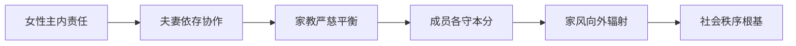

# 曾仕强解读《易经六十四卦》

> **UP主**: 道統華夏  
> **时长**: 53:38:42  
> **发布时间**: 2023-03-16 14:40:41  
> **链接**: https://www.bilibili.com/video/BV14o4y1z7wE
> **封面图**: http://i1.hdslb.com/bfs/archive/c98567b2d42903755aa5f94e3241b2b6280b0059.jpg

---

# 《曾仕强解读〈易经·家人卦〉》视频摘要报告

## 1. 视频概述（核心主题与背景）
- **核心主题**：视频深入解读《易经》第三十七卦“家人卦”（䷤），聚焦**家庭伦理、女性角色、家道治理**三大核心，揭示古代智慧对现代家庭建设的启示。曾仕强教授以历史传说（尧嫁二女于舜）为切入点，论证“家庭是社会治理基础”的哲学观。
- **作者立场**：主张“男主外女主内”是**功能性分工而非地位高低**，强调“母教为家道根本”，批判现代教育忽视性别特质差异。视角融合历史考据（卦象分析）、社会学（家庭功能）及伦理学（责任本位）。
- **叙事结构**：采用“卦象解析→爻辞演绎→现实映射”三层递进：
  1. **卦象层**：上巽（风）下离（火）的互依关系象征夫妻协作；
  2. **爻辞层**：逐爻分析初九至上九的治家逻辑；
  3. **实践层**：对比古今案例，提出“言有物行有恒”的修身准则。

## 2. 核心论点与关键概念
### 2.1 核心论点
1. **女性是家道兴衰的关键**  
   - 卦辞“利女贞”非贬低女性，而是赋予“主妇”**治理内务的核心责任**。曾仕强指出：“家道兴衰在于主妇贤惠与否，贤妇能安家宁邻，反之则祸及邻里。”
   - **深层逻辑**：离卦（火）象征内务主持者，巽卦（风）代表外部支持，二者共生（火旺风助）构成家庭稳定基础。

2. **责任本位高于情感本位**  
   - 批判现代家庭追求“表面和气”（如溺爱子女），主张“严慈并济”：  
     - **严父**：九三爻“家人嗃嗃”说明适度严厉可守家教，避免“嘻嘻失节”；  
     - **慈母**：六二爻“无攸遂”强调主妇柔顺守中，以“无成有终”的地道精神持家。  
   - **辩证关系**：情感需以责任为根基（如子女孝悌是诚信之本），否则“一团和气可致万事顺成，亦可致一事无成”。

3. **家道正则天下定**  
   - 从“正家→正邻→正国→正天下”的推演逻辑：  
     - 大象传“风自火出”喻示**家风影响社会风气**；  
     - “正家而天下定”呼应《大学》“修身齐家治国平天下”的儒家脉络。  

### 2.2 关键概念
| 术语         | 定义                                                                 | 现实映射                     |
|--------------|----------------------------------------------------------------------|------------------------------|
| **利女贞**   | 主妇守正道则家兴，非性别歧视而是责任分配                            | 主妇价值=隐性社会生产力      |
| **风火相生** | 火（内务）需风（外务）助燃，风因火生热，喻夫妻依存                   | 内外责任协同                 |
| **言有物**   | 说话有事实依据（反虚拟空谈）                                        | 家庭教育需诚信示范           |
| **行有恒**   | 行为有恒定原则（反反复无常）                                        | 家长需以身作则               |
| **交相爱**   | 由亲及疏的差序之爱（反西方博爱）                                    | 老吾老以及人之老的实践路径   |

### 2.3 论点逻辑链

## 3. 详细内容梳理（按卦爻结构）
### 3.1 卦象总论（0:00-12:30）
- **核心案例**：尧嫁二女于舜非鼓励一夫多妻，而是**测试治家能力**——若二女和睦则证明舜德性深厚。
- **卦象解析**：  
  - 上巽为风（长女）、下离为火（中女），破除“双女不能成家”误解；  
  - 风火互依：火旺生风（家风影响社会），风助火势（社会支持家庭）。  
- **关键洞见**：序卦传“伤于外者必反其家”说明家庭是抵御外部伤害的缓冲器。

### 3.2 下卦三爻：治家基础（12:31-32:50）
1. **初九：闲有家，悔亡**  
   - 建立家规防线（如围墙象征界限），防微杜渐：“小恶不惩则大恶难改”。  
   - **案例**：现代父母纵容“第一次犯错”，致子女养成恶习。  

2. **六二：无攸遂，在中馈，贞吉**  
   - 主妇守中持家，“无成有终”如大地承载万物：  
     - 批判“主妇无收入”谬论：曾举“女儿误认父亲零钱为日薪”案例，说明**母职价值被低估**；  
     - 呼应“妻贤夫祸少”古谚。  

3. **九三：家人嗃嗃，悔厉吉**  
   - 适度严厉优于放纵：“严伤和气但守家教，宽失家教难修复”。  
   - **对比案例**：  
     - 中式家庭：父严促子察言观色（适应社会）；  
     - 西式家庭：过度亲密致子女抗挫力弱。  

### 3.3 上卦三爻：家道升华（32:51-46:20）
1. **六四：富家，大吉**  
   - 主妇承上启下（居二阳爻间），以柔顺调和矛盾。  
   - **准则**：“不犯上不淩下”，如不在子女前与夫争执。  

2. **九五：王假有家，勿恤吉**  
   - 家道成典范感化邻里：举“邻居对比”案例——  
     - 和睦家庭自认“皆有过”（如丢自行车争相担责）；  
     - 争执家庭自认“皆有理”（推诿责任）。  

3. **上九：有孚威如，终吉**  
   - 维持敬畏心：“子女畏父母非恐惧，乃敬畏——耻于辱没门风”。  
   - **关键句**：“反身之谓”强调家长终身自省（言有物行有恒）。  

## 4. 重要引用与案例
### 4.1 原话摘录
- “家道的兴衰，主要责任在主妇贤惠与否。贤妇安家宁邻，不贤则祸及邻里。”  
- “一团和气可万事顺成，亦可一事无成，根基在诚信而非表象。”  
- “女权是智慧象征：重实质（责任）而非表面（形式），如中国妻不恃宠而骄。”  

### 4.2 关键案例
1. **舜治家测试**  
   - 尧以二女嫁舜非为多妻，实为考察其**协调家庭关系能力**，印证“家人利女贞”内核。  

2. **父薪误解**  
   - 父亲向女儿夸耀职场辛苦，致女儿误认“日薪=口袋零钱”，暴露**母职价值教育缺失**。  

3. **邻居感化**  
   - 和睦家庭以“我家皆罪人”（争担责）感化邻家“皆好人”（争功），实践“王假有家”。  

## 5. 深度分析与思考
### 5.1 深层含义
- **责任伦理现代化**：将“男主外女主内”重构为**功能分工模型**，回应女权争议——主妇非附庸而是“家风工程师”。  
- **教育批判**：现代男女同质化教育催生“非女非男”角色混乱，呼吁**性别特质差异化培养**（如女子教育重柔德）。  

### 5.2 历史与现实意义
- **历史脉络**：承袭《礼记》“内和理治”思想，但颠覆“男尊女卑”刻板解读，强调**责任平等**。  
- **现代价值**：为“家庭原子化”（如少子化、离婚率升）提供解决路径——**重塑家教敬畏感**。  

### 5.3 争议点
- **严父必要性**：九三爻主张“伤和气守家教”，可能被误读为**家长威权合理化**，需平衡“敬畏”与“压迫”。  
- **女权实质论**：强调“主妇实权”易被诟病**回避结构性性别不平等**，需结合社会制度改良。  

## 6. 结论与启示
### 6.1 核心结论
- 家人卦揭示**家庭为天下治乱根基**，核心在“各正其位”：  
  1. 主妇以柔德持家（六二爻）；  
  2. 丈夫以严义立教（九三爻）；  
  3. 成员以诚信相待（言有物行有恒）。  

### 6.2 行动建议
- **个体层**：家长以身作则，践履“言有据、行有恒”；  
- **社会层**：重估家务劳动价值（如纳入GDP核算），复兴母教传统。  

### 6.3 延伸思考
- **卦爻普适性**：家人卦六爻皆吉（同于谦卦），是否暗示**家庭伦理为永恒幸福法则**？  
- **现代适配**：如何将“风火互依”转化为双职工家庭协作模型？  