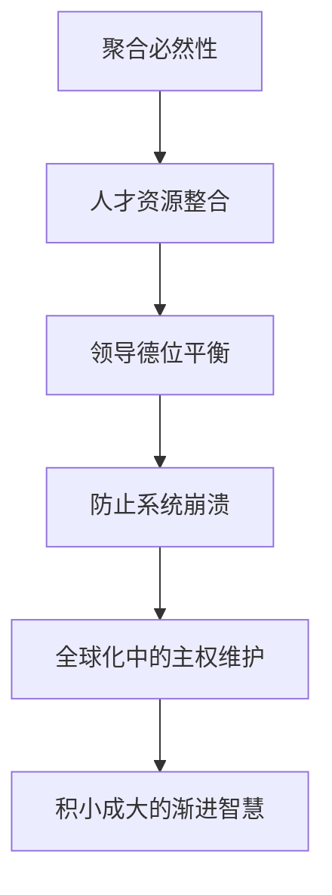

# 曾仕强解读《易经六十四卦》

> **UP主**: 道統華夏  
> **时长**: 53:38:42  
> **发布时间**: 2023-03-16 14:40:41  
> **链接**: https://www.bilibili.com/video/BV14o4y1z7wE
> **封面图**: http://i1.hdslb.com/bfs/archive/c98567b2d42903755aa5f94e3241b2b6280b0059.jpg

---

```markdown
# 曾仕强解读《易经·萃卦》视频摘要报告

## 1. 视频概述
- **核心主题**：视频深度解析《易经》第四十五卦"萃卦"（䷬）的哲学内涵，探讨"聚合之道"在人才管理、组织治理及国际关系中的现代应用。曾仕强以"萃"（聚集）为核心，揭示聚合的辩证关系——人才聚集既是发展的必要条件，也暗藏分裂危机。
- **作者立场**：曾仕强作为新儒家学派代表，主张"中西合璧"的管理哲学，强调以《易经》智慧解决现代问题。其视角兼具传统伦理（如孝道、仁政）与现代组织动力学，批判盲目国际化，呼吁坚守文化根本。
- **叙事结构**：采用"卦象解析→现实映射→爻辞应用"的三段式：
  1. **卦象总览**：通过阴阳爻分布分析聚合的本质矛盾；
  2. **现实映射**：关联企业人才管理、国家主权与国际组织困境；
  3. **分爻详解**：以六爻象征职场中的不同角色定位与策略。

## 2. 核心论点与关键概念
### 2.1 核心论点
**论点1：聚合的辩证性**  
- **精华**：萃卦（䷬）上兑下坤，两阳爻居上（九四、九五），四阴爻聚下，象征"精英领导层"与"基层群体"的结构。聚合的悖论在于：  
  - *利*：突破孤立（"不聚则孤"），整合资源（"利有攸往"）；  
  - *弊*：派系斗争（"分派相斗"）、领导力挑战（"管得了谁？"）。  
- **逻辑链条**：阴阳失衡（如全阳变夬卦䷪）→沟通断绝→系统崩溃。需通过"刚中而应"（九五应六二）实现层级联动。

**论点2：领导力的德位平衡**  
- **九五爻关键**：君主位（九五）需"萃有位"（凭德非位），防止权力腐化：  
  - *德业光大*：以无形感召力（如正道、孝道）替代权力控制；  
  - *风险控制*：警惕九四功高震主（"大吉无咎"实含警示）。  
- **现实映射**：企业CEO需通过"王假有庙"（宗庙象征文化根基）强化组织认同，避免人才叛离。

**论点3：全球化与国家主权的张力**  
- **批判联合国/WTO**：视为"无德之聚"，大国规则压制小国（"不利小国"）。主张：  
  - *国家优先*：反对"地球村虚化国家"，强调自保（"刚柔自聚"）；  
  - *德政基础*：国际协作需"利见大人"（才德兼备的领导者）。

### 2.2 关键概念
| **术语**       | **释义**                                                                 |
|----------------|--------------------------------------------------------------------------|
| **刚中而应**   | 九五（刚中）与六二（柔中）相应，象征领导与基层领袖的良性互动                  |
| **王假有庙**   | 宗庙祭祀隐喻文化根基与集体认同（"不忘根本"）                                |
| **用大牲**     | 丰盛祭祀→资源充足时需大方投入以显诚意（反例：财力不足时铺张=虚荣）             |
| **柔乘刚**     | 上六阴爻凌驾九五阳爻（䷮），喻权臣僭越或基层失控                             |
| **物以类聚**   | 阴阳爻分区（上阳下阴）揭示聚合的自然规律，否定强制融合                        |

### 2.3 论点逻辑关系


## 3. 详细内容梳理
### 3.1 萃卦本体论（00:00-05:22）
- **卦象结构**：  
  - 六爻分布：⭘⭘⭘（坤）| — —（兑）  
  - 核心矛盾：阴爻聚下易生派系（"七嘴八舌"），阳爻居上需防孤立（如变夬卦䷪则全阳独裁）。  
- **卦辞解码**：  
  - "亨"：聚合是通达前提；  
  - "王假有庙"：借祭祀强化文化凝聚力（案例：北京天坛象征"泰山祭天"）；  
  - "用大牲"：资源充足时需投资于认同建设。

### 3.2 现实应用：组织与国际治理（05:23-15:18）
- **企业人才管理**：  
  - 痛点：精英扎堆导致内耗（"全是大将，管得了谁？"）；  
  - 解法：九五爻"刚中而应"→通过六二（基层领袖）缓冲矛盾，避免直接干预。  
- **国际关系批判**：  
  - 联合国困境：大国把持规则（"不利小国"）；  
  - 主权必要性：国家是"自保单元"，反对"去国家化"（"国家不强盛，何谈国际化？"）。

### 3.3 六爻职场启示（15:19-结尾）
| **爻位** | **象征角色** | **核心策略**                          | **风险**                  |
|----------|--------------|---------------------------------------|--------------------------|
| **初六** | 基层新人     | 坚定目标防"乱萃"（病急乱投医）          | 自卑焦虑（"一握为笑"）    |
| **六二** | 潜力骨干     | 待机而动（"引吉"），以薄礼表诚（孔明案例） | 急于求成                  |
| **六三** | 中层孤立者   | 联合上六（柔柔相济）                   | 怀才不遇（"嗟如"）        |
| **九四** | 副手        | 大功避忌（让功于九五）                 | 功高震主（"大吉"含危机）  |
| **九五** | 领袖        | 永贞守德（防权力腐化）                 | 失德则众叛（"匪孚"）      |
| **上六** | 退休元老     | 安分维稳（"未安上"则涕泣）             | 干政招祸（"赍咨涕洟"）    |

## 4. 重要引用与案例
### 4.1 原话摘录
> **"萃卦的厉害：观其所聚，而天地万物之情可见矣。"**  
> —— 通过观察个体所聚群体，即可洞悉其本质（如棋手风格、老板水平）。

> **"天下万事万物，所有情况都瞒不了你。"**  
> —— 强调萃卦作为观察工具的普适性。

> **"刚跟刚在一起，柔跟柔在一起，这是自保！"**  
> —— 批判全球化中的强制融合，主张分层聚合。

### 4.2 关键案例
- **孔明出山**（六二爻应用）：  
  隐居待主（"引吉"），三顾茅庐方显刘备诚意，避免"急萃"导致的信任不足。  
- **企业精英陷阱**：  
  老总自诩"精英团队"实为自我欺骗，因精英互斥需中间层（六二）缓冲。  
- **WTO小国困境**：  
  规则被大国操控，小国"加入则受损，孤立则更危"，印证聚合需德政基础。

## 5. 深度分析与思考
### 5.1 深层含义
- **管理的阴阳哲学**：将科层制转化为"阳领导-阴执行"的动态平衡，否定西方扁平化崇拜。  
- **孝道的组织隐喻**："不忘根本"（宗庙）实为文化DNA传承，类比企业价值观建设。

### 5.2 历史背景
- **宗庙破立**：引用周代"灭国不灭祀"（破敌宗庙立己庙），象征文化征服的柔性权力。  
- **兵法比较**：推崇《孙子》"防为主"（"除戎器"即备战避战），批判西方攻击性战略。

### 5.3 争议点
- **国家主义倾向**：否定全球化虚化国家，可能低估跨国协作的必然性。  
- **精英分层争议**：阴阳爻固化的阶层观，与现代流动性社会存在张力。

## 6. 结论与启示
### 6.1 核心结论
- 萃卦本质是"聚合的危机管理"：人才聚集是起点，德位平衡（九五）、层级缓冲（六二）、文化根基（庙）才是可持续关键。  
- 现代启示：组织扩张需警惕"脆性聚合"，国家主权是国际参与的基石。

### 6.2 行动建议
- **领导者**：以德聚人（非权聚），投资文化认同（"用大牲"式投入）。  
- **个体**：初六防焦虑，六二待时机，九四避功高。  
- **国家**：主权优先于全球化（"先自保后合作"）。

### 6.3 延伸思考
- **萃卦与网络社群**：虚拟聚集是否颠覆"物以类聚"规律？  
- **阴阳动态性**：在敏捷组织中，爻位是否可变（如基层创新者变"九四"）？
```