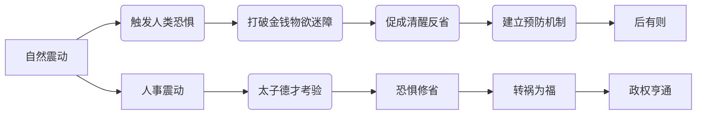

# 曾仕强解读《易经六十四卦》

> **UP主**: 道統華夏  
> **时长**: 53:38:42  
> **发布时间**: 2023-03-16 14:40:41  
> **链接**: https://www.bilibili.com/video/BV14o4y1z7wE
> **封面图**: http://i1.hdslb.com/bfs/archive/c98567b2d42903755aa5f94e3241b2b6280b0059.jpg

---

# 曾仕强解读《易经六十四卦》之震卦深度分析报告

## 1. 视频概述
**核心主题**：本视频聚焦《易经》第五十一卦"震卦"的哲学解读，由国学大师曾仕强阐释其"震动"概念的双重内涵——既指自然现象（雷电、地震），更隐喻人事变革（权力更迭、危机应对）。视频以"太子培养"为切入点，揭示震卦作为"继承人卦"的特殊意义。

**背景与视角**：UP主"道統華夏"选取曾仕强生前讲座片段，延续其"生活化解易"风格。曾仕强立足儒家伦理，强调震卦的"警醒功能"：自然震动是上天对人类的警示，人事震动则是修身契机。其核心立场可概括为："恐惧是美德，震动即亨通"。

**叙事结构**：视频采用"卦象解析→爻辞演绎→现实映射"三层递进结构：
- 前20分钟：释读卦辞与彖传，建立"震动亨通"的认知框架
- 中段30分钟：逐爻分析六爻情境，对应太子成长阶段
- 后15分钟：引申至现代人危机应对智慧，强调"敬畏心"价值

## 2. 核心论点与关键概念
### 2.1 核心论点
**论点一：震动即亨通（震亨）**  
- **深层逻辑**：震动通过触发恐惧使人清醒（"熙熙恐惧"），打破庸常麻木状态。案例：大地震时无人抢救保险箱，印证"钱无用"的顿悟。
- **反常识解析**：自然灾害表面造成破坏，实为地球能量释放机制（"偶尔地震对人类是好的"），符合《易经》"祸福相倚"思想。

**论点二：恐惧修省乃生存智慧**  
- **德才培养机制**：震卦要求太子具备双重素养：
  - **德**：临危不惧（"人家恐惧你不能恐惧"）
  - **才**：保鼎安民（"震惊百里不丧匕鬯"）
- **现代转化**：企业顺境中需保持危机意识（"多少企业家一上去很快下来"），恐惧感预防骄纵。

**论点三：天人感应下的权力制衡**  
- **宇宙观基础**：天灾是"阴阳二气相搏"的自然结果（科学印证），但被赋予伦理意义：
  - 天震→警告帝王（"你不要以为你是天子"）
  - 帝震→威慑诸侯（"帝王叫做天威"）
- **现实意义**：强调"恩威并济"管理哲学的宇宙论依据。

### 2.2 关键概念
| 术语       | 定义                          | 象徵意义                     |
|------------|-------------------------------|------------------------------|
| 定鼎       | 革命成功后的政权确立          | 权力传承的起点               |
| 主器者     | 宗庙祭祀主持人                | 继承人的合法性象征           |
| 恐致福     | 恐惧带来福分                  | 危机意识的积极价值           |
| 后有则     | 前车之鉴形成制度              | 灾难经验的制度化转化         |
| 不丧匕鬯   | 保全祭祀器具                  | 核心价值体系的守护           |

### 2.3 论点逻辑链

## 3. 详细内容梳理
### 第一部分：卦象本源（00:00-20:35）
- **震卦结构**：☳（震下震上）代表双重震动
  - 天震：无形之声（雷）
  - 地震：有形之动（板块运动）
- **卦辞精解**： 
  - "震来虩虩"：突发动荡引发集体恐慌
  - "笑言哑哑"：危机后从容态度的形成条件
- **关键转折**（15:42）：从自然现象转向人事隐喻——"震即长子，主器者莫若长子"

### 第二部分：六爻实践智慧（20:36-50:17）
1. **初九：震来虩虩，后笑言哑哑**（太子启蒙期）
   - 恐惧黄金时间论："越震越怕可能就来不及"
   - 修心方法：日常"谨言慎行"积累福报

2. **六三：震苏苏，震行无眚**（权力过渡期）
   - 畏位心理建设："你永远位不当，不要以为是法定继承人"
   - 案例类比：企业接班人面临元老挑战

3. **上六：震索索，视矍矍**（危机爆发期）
   - 决策原则："一动不如一静"
   - 现代映射：股市暴跌时的观望策略

### 第三部分：现代启示（50:18-65:02）
- **恐惧教育批判**：对比古今父子关系：
  - 传统："父严母慈"制造敬畏心
  - 现代："爸爸不威严"导致无所畏惧
- **科学辩证观**：承认地震能量释放必要性，但强调"适度恐惧"的生存价值

## 4. 重要引用与案例
### 4.1 核心观点引用
> "所有的天灾都是让你很痛的...但震卦卦辞却说这些是为了让我们亨通。为什么？因为人没有惊天动地的事情不会醒过来。"（12:18）  
> "教子不言父之过。父亲一定要让小孩怕你，现在人不这样想，结果孩子长大后反而恨你。"（58:44）

### 4.2 关键案例
**地震价值观实验**（25:31）  
- 场景：强震来袭时的本能反应
- 现象：无人优先抢救财物（"没看到有人跑去开保险箱"）
- 结论：灾难暴露人类真实价值观序列（生命＞财产）

**太子登基困境**（42:05）  
- 两难处境：畏惧老臣（六五"震往来厉"）vs 刚愎自用
- 解决方案："执中守正"——既保持敬畏，又坚持合理主张

## 5. 深度分析与思考
### 5.1 哲学深层结构
震卦构建了"宇宙-权力-个人"三级响应系统：
- **宇宙层**：阴阳二气相搏→能量释放
- **权力层**：天震警示帝王→帝震威慑诸侯
- **个人层**：外震触发内省→恐惧修心

### 5.2 历史现实映射
- **鼎革之道**：商周鼎器文化印证"定鼎→震继"权力逻辑
- **东亚模式**：日本"地震文化"与"恐惧修省"的当代实践

### 5.3 争议点分析
**科学性与神秘主义张力**  
- 进步性：承认地震能量释放的科学机制
- 局限性：将自然灾害伦理化为"天谴"，忽视地质客观性

**恐惧教育的现代适用性**  
- 积极面：填补当代"敬畏教育"缺失
- 风险点：可能助长威权人格形成

## 6. 结论与启示
### 6.1 核心结论
- 震卦本质是"危机转化系统"：通过外部震动触发内在修省，实现"恐致福"的辩证转化
- 权力传承核心：继承者需兼具"德（临危不惧）"与"才（保鼎安民）"

### 6.2 行动建议
1. **个人层面**：建立"日常修心-危机静气"响应机制（"心中有数"）
2. **组织层面**：权力交接中设计"震动测试"（如压力情境模拟）
3. **社会层面**：灾难教育应强化"价值观澄清"而非单纯避险训练

### 6.3 延伸思考
- 西方危机管理（如黑天鹅理论）与东方"震亨"哲学的比较
- 数字化时代如何重构"敬畏心"（如AI伦理中的预防原则）
- "后有则"在现代制度设计中的应用（新冠后公共卫生体系改进）