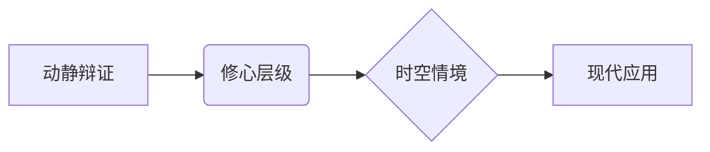

# 曾仕强解读《易经六十四卦》

> **UP主**: 道統華夏  
> **时长**: 53:38:42  
> **发布时间**: 2023-03-16 14:40:41  
> **链接**: https://www.bilibili.com/video/BV14o4y1z7wE
> **封面图**: http://i1.hdslb.com/bfs/archive/c98567b2d42903755aa5f94e3241b2b6280b0059.jpg

---

# 曾仕强解读《易经·艮卦》视频摘要报告

## 1. 视频概述（核心主题与背景）
- **主题**：深度解析《易经》艮卦（☶）的哲学内涵与实践智慧，聚焦"动静平衡"的修心之道。
- **背景**：艮卦卦象为"山上有山"，象征止而不止的辩证关系。曾仕强教授结合现代人"能进不能止"的生存困境，揭示艮卦对修心养性的指导价值。
- **立场**：
  - 批判性视角：现代人过度追求"动"而丧失"静"的能力，导致心灵浮躁。
  - 儒家本位：以《大学》"知止而后有定"为理论框架，融合道家"无欲则刚"思想。
- **叙事结构**：
  - **逻辑链条**：卦象释义 → 卦辞解码 → 爻辞分层解析 → 修心实践 → 现代启示
  - **叙事特色**：用生活化案例（如戒烟、职场沟通）解构抽象卦理，强调"一字一太极"的汉字哲学。

## 2. 核心论点与关键概念
### 2.1 核心论点
1. **动静辩证论**  
   - 艮非单纯静止，而是"风雨中的宁静"，强调在动态中保持内心定力。
   - **逻辑支撑**：震卦（动）与艮卦（静）互为综卦，如同自然界的春生夏长需冬藏支撑。

2. **修心层级论**  
   - 从"艮其趾"（控制本能）到"敦艮"（随心所欲不逾矩），揭示六爻代表修心的六个进阶阶段。
   - **关键洞见**：初爻控脚趾易，六爻控全身难，映射习惯养成的边际成本递增规律。

3. **时空情境论**  
   - "时止则止，时行则行"强调根据具体情境调整动静策略，批判现代人违背自然节律（如午时运动）。

### 2.2 关键概念
| 概念 | 定义 | 深层隐喻 |
|-------|-------|-----------|
| **艮其背** | 观察他人背影而非正面 | 避免情绪干扰的修心法门 |
| **不获其身** | 不执着于表象 | 破除"我执"的观照智慧 |
| **思不出其位** | 思想不越界 | 儒家"知天命"的责任伦理 |
| **敦艮** | 厚重而止 | 道德自律的最高境界 |

### 2.3 论点逻辑关系

## 3. 详细内容梳理
### 3.1 卦象本源（0:00-10:23）
- **核心隐喻**：山不仅是物理存在，更是"心如山不动"的精神象征
  - 案例：登山者忽略身体承受力体现"心狠"，与"仁者乐山"的真义相悖
- **卦辞解码**：
  - "艮其背，不获其身"：背对他人可避免情绪扰动（如不察言观色）
  - "行其庭，不见其人"：同处一室却视而不见，训练心念专注力

### 3.2 爻辞精析（10:24-32:17）
| 爻位 | 爻辞 | 身体部位 | 修心要义 | 现代映射 |
|-------|-------|-----------|-----------|-----------|
| **初六** | 艮其趾 | 脚趾 | 遏恶于萌芽 | 戒烟初期易，复吸难戒 |
| **六二** | 艮其腓 | 小腿 | 习惯固化之痛 | 减肥者"知其当止而不能止" |
| **九三** | 艮其限 | 腰部 | 上下交煎 | 中层管理的决策焦虑 |
| **六四** | 艮其身 | 躯干 | 独善其身 | 出家修行者的自我隔绝 |
| **六五** | 艮其辅 | 口唇 | 慎言之道 | 领导者"祸从口出"的危机 |
| **上九** | 敦艮 | 整体 | 止于至善 | 圣人"不思而得"的境界 |

### 3.3 实践智慧（32:18-45:02）
- **动静法则**：
  - 自然参照：春生夏长秋收冬藏，冬藏支撑三季活动
  - 现代警示：午时慢跑违背"动静不失其时"，损伤元气
- **修心方法**：
  - 眼不见为净：君子远庖厨的当代解读（避免信息过载）
  - 良心在背论：修行即是将背面良心转至正面

## 4. 重要引用与案例
### 4.1 核心引述
> **"现代人最大的毛病就是能挣不能止，知进不知退"**  
> ——直指消费社会中的欲望失控问题

> **"休息才能走更远的路"**  
> ——用艮卦重新定义"躺平"的积极意义

> **"眼不见为净其实是蛮有道理的"**  
> ——为数字时代的注意力管理提供古法参照

### 4.2 关键案例
- **戒烟模型**：
  - 初爻：首次戒烟轻松（利永贞）
  - 六二：复吸后更难戒（其心不快）
  - 九三：理性与欲望拉锯（厉薰心）
- **职场沟通**：
  - 六五爻映射：高管发言需"言有序"（逻辑清晰），否则"悔亡"（威信丧失）

## 5. 深度分析与思考
### 5.1 哲学深意
- **动静宇宙观**：将物理运动（车轮摩擦减速）与心性修炼（动久必静）统一
- **儒家心学**：以《大学》"知止→定→静→安→虑→得"六步验证艮卦修心路径

### 5.2 现实批判
- **教育异化**：现代家长"买几十个玩具给小孩"导致心乱，违背"不获其身"原则
- **成功学解构**："征服高山"实为自虐，呼应老子"不争故天下莫能与之争"

### 5.3 争议点
- **文化保守主义**：主张"午休是很好的习惯"隐含对西方作息模式的批判
- **修行极端化**：六四爻"独善其身"可能导向社会逃避主义

## 6. 结论与启示
### 6.1 核心结论
- **修心本质**：从动物性（狠）到人性（良）的转化过程
- **终极境界**：达到"敦艮"时，心念自动归正无需强制（如孔子"知天命"）

### 6.2 行动启示
1. **微观层面**：  
   - 培养"艮其趾"意识：及时遏制不良起心动念
   - 践行"言有序"：重要场合发言前静坐三分钟

2. **宏观层面**：  
   - 社会设计：保留"眼不见为净"的信息过滤机制
   - 教育重构：用"冬藏"理念尊重成长节律

### 6.3 延伸思考
- 在算法推荐时代，"艮其背"原则可否发展为数字戒律？
- "知止"哲学与Deep Work深度工作理论有何相通？
- 企业组织如何运用六爻模型构建管理层心性训练体系？