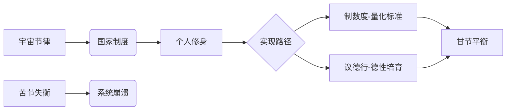

# 曾仕强解读《易经六十四卦》

> **UP主**: 道統華夏  
> **时长**: 53:38:42  
> **发布时间**: 2023-03-16 14:40:41  
> **链接**: https://www.bilibili.com/video/BV14o4y1z7wE
> **封面图**: http://i1.hdslb.com/bfs/archive/c98567b2d42903755aa5f94e3241b2b6280b0059.jpg

---

# 曾仕强解读《易经·节卦》视频摘要报告

## 1. 视频概述（时长约30分钟）

**核心主题**：  
视频深度解析《易经》第六十卦"节卦"的哲学内涵与实践意义，通过卦象结构、爻辞阐释及历史案例，系统论述"节制"作为宇宙规律、治国原则与修身智慧的三重维度。曾仕强以"天人合一"视角，揭示合理节制的本质是动态平衡而非机械约束。

**作者立场**：  
- 立足中华道统，批判现代社会的"量化迷信"与形式化制度  
- 强调"德性"与"制度"并重，主张礼法结合的节制观  
- 警示过度节制（苦节）的危害，倡导弹性适度的"甘节"之道  

**叙事结构**：  
采用"卦象解构→治国应用→个人修养"的递进框架：  
1. 以人体关节为喻解析卦象阴阳爻的象征意义（0:00-8:22）  
2. 结合历史政治案例论述国家制度设计原则（8:23-20:15）  
3. 通过生活场景阐释个人节制智慧（20:16-28:40）  
4. 六爻逐层分析在不同阶段的实践策略（28:41-结尾）  

## 2. 核心论点与关键概念

### 2.1 核心论点

**论点一：节制是宇宙根本法则**  
- **依据**：卦辞"节，亨"与天地四时规律印证（"天地节而四时成"）  
- **逻辑链**：人体关节（踝/膝为阳→胯/腰为阴→背为阳→颈为阴）体现刚柔相济→自然节气循环体现张弛有度→证明节制是维持系统稳定的核心机制  
- **深层含义**：失去合理节制将导致系统崩溃（如身体瘫痪、社会涣散）  

**论点二：制度设计需"不伤财不害民"**  
- **关键辨析**：  
  - **干节**：合理节制（如弹性限速政策）→民众"悦以犯险"  
  - **苦节**：过度节制（如僵化量化指标）→"其道穷也"  
- **案例支撑**：新加坡政令宣导机制（全域协同→避免"不教而诛"）  

**论点三：德性是不可量化的节制维度**  
- **批判点**：现代管理"制数度"（量化制度）的局限性  
- **核心论断**："道之以政，齐之以刑，民免而无耻；道之以德，齐之以礼，有耻且格"（引孔子）  
- **实践意义**：制度需与"议德行"（德性评议）结合，培养羞耻心而非仅守法底线  

### 2.2 关键概念定义

| 概念         | 定义                                                                 | 反义概念       |
|--------------|----------------------------------------------------------------------|----------------|
| **节**       | 动态平衡的约束系统，含"限度"与"节奏"双重维度                        | 涣（系统失序）|
| **甘节**     | 合理节制（如九五爻"甘节"），民众心甘情愿配合                        | 苦节           |
| **苦节**     | 过度节制（如上六爻"苦节"），违背基本生存需求                        | 甘节           |
| **制数度**   | 建立量化标准与制度警戒线（如法律条文）                              | 议德行         |
| **议德行**   | 对德性修养的弹性评议（如人才品质评估）                              | 制数度         |

### 2.3 论点逻辑关系

## 3. 详细内容梳理

### 3.1 卦象本体论解构（0:00-8:22）

**核心隐喻**：人体关节系统  
- **初九/九二**：踝关节+膝关节（阳爻）→ 刚性支撑  
- **六三/六四**：胯关节+腰椎（阴爻）→ 柔性缓冲  
- **九五**：背脊（阳爻）→ 关键时刻刚性  
- **上六**：脖颈（阴爻）→ 日常柔性应变  

**卦辞深解**：  
- "苦节不可贞"：超越合理限度的节制不可常态化（如苦行僧模式不可持续）  
- "节以制度"：典章制度本质是"不伤财不害民"的双底线原则  

### 3.2 治国理政应用（8:23-20:15）

**制度设计辩证法**：  
1. **时机把握**  
   - 初九爻"不出户庭"：政策酝酿期需严格保密（反例：土地征收消息泄露导致抢建）  
   - 九二爻"不出门庭凶"：实施期必须广泛宣导（例：新加坡政府全域协同宣导机制）  

2. **层级责任**  
   - 六四爻"安节"：执行者以身作则（如官吏先守节制）  
   - 九五爻"甘节"：政策合理使民众甘之如饴（如弹性限速政策）  

**历史镜鉴**：  
- 节度使制度：中央节制与地方弹性的平衡尝试  
- "政通人和"理想：政策通行度与民众接受度的动态平衡  

### 3.3 个人修养实践（20:16-28:40）

**生活场景化论证**：  
- **消费观**："当省不用，当用不省"（例：适度点菜与打包文化）  
- **欲望管理**：  
  - 婚姻制度：对"好色本性"的社会化节制  
  - 娱乐边界：批判极限运动（如蹦极）为"不节若则嗟若"（六三爻）  

**修养方法论**：  
- "君子以制数度，议德行"：  
  - 外在：建立生活量化标准（如储蓄率）  
  - 内在：培育德性弹性（如"富能俭，穷能安"的心态）  

### 3.4 六爻实践策略（28:41-结尾）

| 爻位   | 策略                          | 警示案例                     |
|--------|-------------------------------|------------------------------|
| 初九   | 严守机密（政策酝酿期）        | 土地征收信息泄露             |
| 九二   | 广泛宣导（政策实施期）        | "不教而诛谓之虐"            |
| 六三   | 自觉节制（个体自律）          | 极限运动风险                 |
| 六四   | 安然守节（执行者示范）        | 官吏腐败破坏制度公信         |
| 九五   | 刚柔得中（政策合理）          | 新加坡政民协同               |
| 上六   | 防过犹不及（警惕苦节）        | 僵化限速政策                 |

## 4. 重要引用与案例

### 4.1 核心观点原话

> "制度好坏的标准只有六个字：不伤财，不害民。伤财害民的法令，必然'悦而不行'"  
> "完全量化就是苦节不可贞，德行评议看似不精确，却是培养羞耻心的关键"  
> "政通民和的本质：政策能通行，民众甘愿配合，而非被迫服从"  

### 4.2 关键案例详述

**新加坡政令宣导机制**  
- **背景**：九二爻"失时凶"的现实映射  
- **操作**：政府命令全域协同宣导（非仅主管单位负责）  
- **效果**：避免民众以"不知法"为借口，提升政策接受度  

**高速公路限速辩证**  
- **甘节范例**：弯道/岔口合理限速→民众主动遵守  
- **苦节反例**：全路段僵化限速30公里→民众伺机违规  

**历史周期律启示**  
- 明君实践：朱元璋"节制官吏俸禄但保障基本生存"  
- 暴君教训：隋炀帝苛政（苦节）引发民变  

## 5. 深度分析与思考

### 5.1 哲学深层含义

**动态平衡宇宙观**：  
节卦揭示"约束≠压制"，而是通过阴阳爻交替（刚柔互济）实现系统韧性。对比西方"节制"（temperance）概念，易经更强调情境适应性，如脖颈柔软（上六）与背脊刚强（九五）的辩证统一。

### 5.2 历史现实意义

**制度设计启示**：  
- **预防双失灵**：既要防百姓失序（涣卦），也要防官吏腐败（六三爻）  
- **弹性执行**：政策需如节气循环（"立春立冬明明白白"），给民众稳定预期  

**现代性批判**：  
- **量化迷信**：GDP主义、KPI考核等"制数度"泛滥，忽视"议德行"维度  
- **权利误区**："自由无限扩张"违背"天地非仅你一人"的系统观  

### 5.3 争议点辨析

**德治与法治之争**：  
- **质疑点**："议德行"可能导致人治随意性  
- **曾氏回应**：德性是制度效力的根基（引孔子"民免而无耻"警示）  
- **平衡建议**：制度设底线，德性提上限（如法律禁偷盗+礼教培育廉耻）  

## 6. 结论与启示

### 6.1 核心结论

1. **节制本质**：是宇宙万物存续的根本法则，合理节制（甘节）实现系统韧性  
2. **治国关键**：制度设计需守住"不伤财不害民"底线，配合时机策略（初九保密→九二宣导）  
3. **修身要义**：通过"制数度"（量化标准）与"议德行"（德性修养）实现动态平衡  

### 6.2 行动建议

**个人层面**：  
- 建立生活量化基准（如储蓄率≥20%）  
- 培育情境弹性（如"富能俭，穷能安"心态）  

**社会治理**：  
- 政策设计预留缓冲空间（如"宣导期→执行期"过渡）  
- 考核机制纳入德性评议（如公务员廉洁度评估）  

### 6.3 延伸思考

1. **数字化转型**：算法治理如何避免"数字苦节"（如过度数据监控）？  
2. **全球治理**：气候变化等议题如何实践"天地节"智慧（碳排放在合理限度内）？  
3. **教育创新**：如何将"议德行"融入现代教育评估体系？  

---

**报告结语**：  
节卦智慧在当代的价值，恰如曾仕强所言："制度与德性如鸟之双翼，量化标准与弹性修养缺一不可。" 其本质是引导人类在约束与自由间找到动态平衡点，这既是对抗系统熵增的古老智慧，亦是应对现代复杂性的永恒法则。