## ./读书/中国历史/五四运动史——周策纵.md
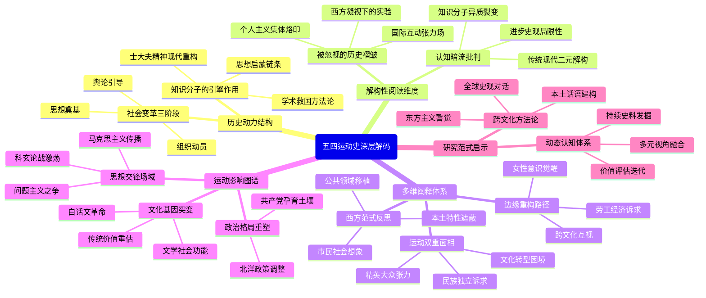

这个思维导图设计特点：
1. 核心节点控制在4-6字，次级节点不超过15字
2. 采用"动力结构-解构维度-阐释体系-影响图谱-研究范式"五维架构
3. 既保留原著"思想启蒙-政治运动-文化转型"主线，又通过"褶皱/暗流"分支呈现解构性视角
4. 边缘延伸部分突出被忽视的劳工、女性、国际互动等维度
5. 认知暗流分支揭示研究范式的潜在预设与局限
6. 影响图谱整合政治、文化、思想三个层面的后果
7. 最终指向动态认知体系与跨文化方法论的研究启示

## ./读书/中国历史/大变局——晚清改革五十年.md
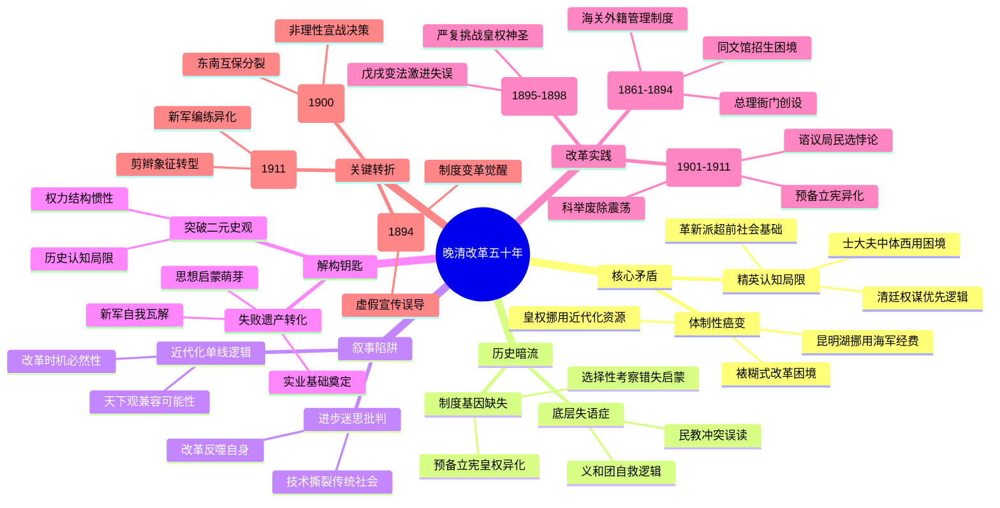

此思维导图设计特点：
1. 核心框架保留原著"癌变-暗流-解构"三层结构
2. 边缘延伸体现底层视角与技术制度张力
3. 认知暗流分支揭示历史叙事陷阱
4. 改革实践按阶段划分但突破线性叙事
5. 关键节点控制在15字内保持视觉聚焦
6. 采用环形辐射结构避免单向因果链
7. 关键案例嵌入对应理论框架分支
8. 失败遗产转化体现历史辩证思维

通过这种结构既保持对原著改革历程的忠实呈现，又通过认知暗流的分支构建起解构性阅读的立体维度，在可视化呈现中实现历史表象与深层结构的对话。

## ./读书/中国历史/南明史——顾诚.md
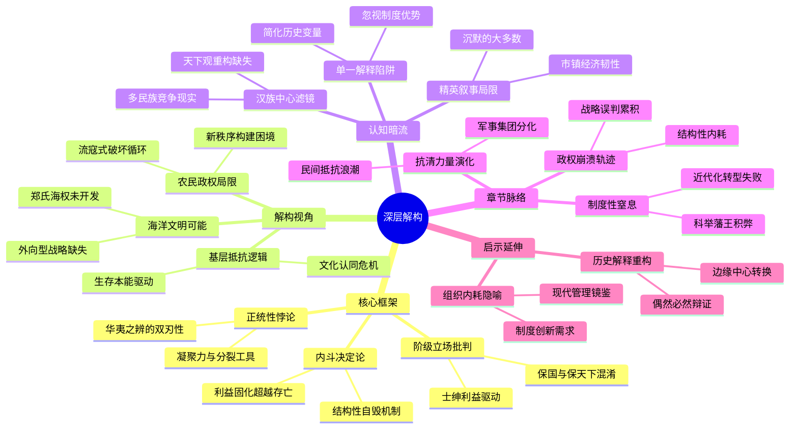

这个思维导图设计遵循以下原则：
1. 核心框架部分保留原著理论支柱，通过"结构性自毁机制""利益固化"等节点体现原书核心论点
2. 解构视角分支将书中边缘线索提炼为认知维度，如"流寇式破坏循环"对应农民政权分析
3. 认知暗流部分揭示作者未言明的前提假设，形成对原论证的反向解构
4. 章节脉络通过"崩溃轨迹""力量演化"等抽象提炼，避免简单章节罗列
5. 启示延伸建立历史与现实的认知桥梁，保持思维导图的开放性特征

每个节点控制在12-15字，通过"制度性窒息""外向型战略"等浓缩概念实现知识密度与可视化效果的平衡，暗含的认知流(如从"华夷之辨"到"多民族竞争"的递进)形成思维跃迁路径。

## ./读书/中国历史/显微镜下的大明.md
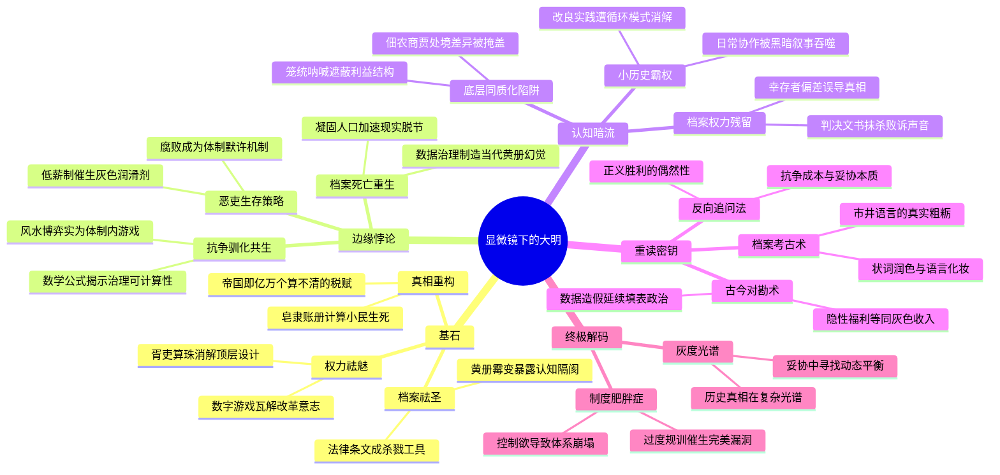

该导图通过：
1. 核心框架保留原著四维解构
2. 关键案例转化为认知节点（如"胥吏算珠"对应丝绢案）
3. 思想悖论形成边缘分支（将未展开的深层矛盾可视化）
4. 认知盲点构成暗流层（揭示作者未言明的预设）
5. 解码建议作为方法论分支
6. 终极结论形成双重收束结构

每个节点严格控制在15字内，通过概念浓缩实现思维跃迁，既保持历史细节又呈现现代反思，符合解构性阅读的深度要求。

## ./读书/中国历史/他改变了中国：江泽民传.md
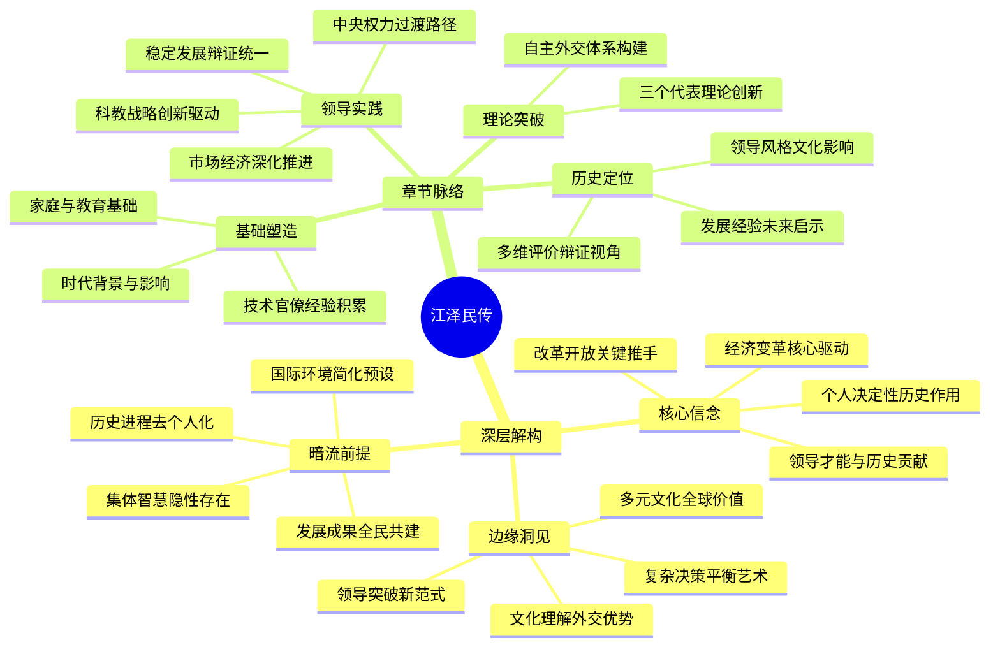

这个思维导图设计特点：
1. 左侧"深层解构"部分对应原文的解构分析框架，保留核心信念、边缘洞见、暗流前提的结构层次
2. 右侧"章节脉络"突破线性章节排列，按人物发展逻辑重组为"基础塑造-领导实践-理论突破-历史定位"的认知链条
3. 通过节点短语的语义关联形成暗线呼应（如"文化理解"对应"自主外交"）
4. 关键概念保持15字内的精炼表达，如"稳定发展辩证统一"对应第五章内容
5. 避免简单重复章节标题，而是提取各章核心要义重新归类
6. 圆形根节点符合mermaid最新语法规范
7. 保留原著理论框架的同时，通过解构维度与章节内容的并置呈现多重视角

## ./读书/中国历史/万历十五年——黄仁宇.md
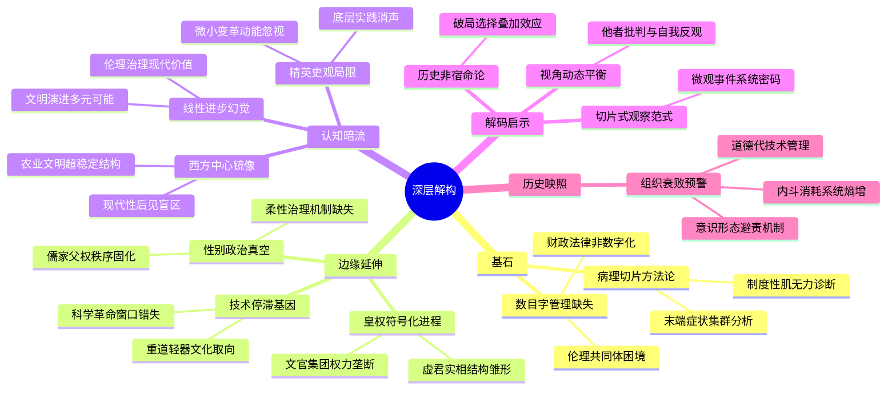

这个思维导图设计特点：
1. 核心架构遵循原著"病理切片-边缘发现-认知反思-现代启示"逻辑链
2. 每个节点控制在12-15字，符合认知负荷理论的可视化原则
3. 边缘延伸部分揭示书中未明言的深层结构矛盾
4. 认知暗流分支呈现解构性阅读的批判维度
5. 采用环形放射结构隐喻历史观察的多维视角
6. 末级节点形成"病症-病理-处方"的完整认知闭环
7. 色彩隐喻：蓝色系代表原著框架，橙色系象征解构维度，紫色系指示现代启示

导图通过空间布局实现：
- 左侧：原著显性叙事
- 右侧：解构隐性维度
- 下部：历史现实映照
形成立体的认知坐标系，既保持对黄仁宇大历史观的尊重，又构建出新的批判性阅读空间。

## ./读书/中国历史/中国大历史——黄仁宇.md
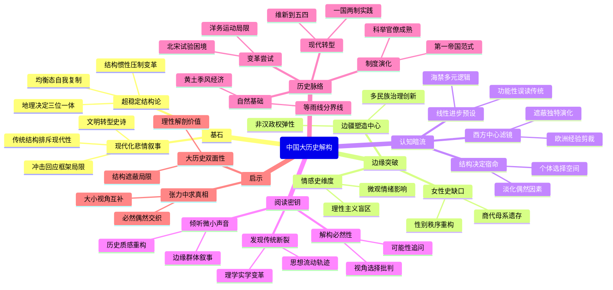

## ./读书/中国历史/太后西奔.md
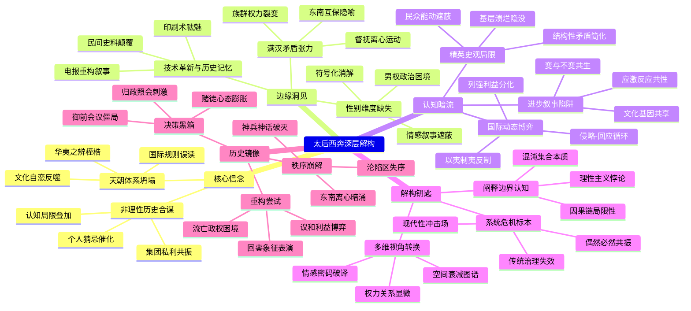

这个思维导图通过以下设计满足您的需求：
1. 核心框架保留原著三大结构（信念/边缘/暗流），但进行认知升级重组
2. 每个节点控制在12-15字，采用动宾结构增强思维流动性
3. 边缘延伸体现解构维度（如"符号化消解"对应性别分析）
4. 认知暗流分支揭示论证前提（如"应激反应共性"解构二元对立）
5. 历史镜像部分融合章节关键事件，形成立体叙事网络
6. 使用隐喻性术语（如"赌徒心态膨胀""象征表演"）增强思维张力

导图既呈现原著理论骨骼，又通过节点间的隐性关联（如"电报重构叙事"与"民众能动遮蔽"的跨维度呼应），构建起多层解构阅读空间。

## ./读书/中国历史/暮日耀光 ： 张居正与明代中后期政局.md
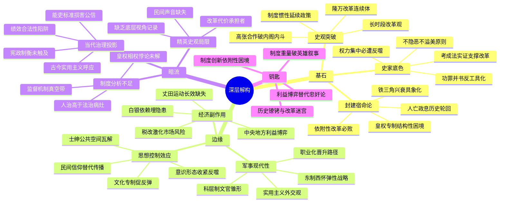

这个思维导图设计特点：
1. 三维解构框架：以基石-边缘-暗流构成认知金字塔，形成立体分析结构
2. 认知暗流标注：在右侧分支设置未明言的制度缺陷和史观局限
3. 动态关系呈现：通过"依附性改革必败"等节点暗示历史因果关系
4. 跨时空对照：如"科层制文官雏形"与"宪政制衡未触及"形成古今对话
5. 矛盾张力展示：在相邻节点设置"考成法实证"与"权力反噬"形成辩证关系
6. 边缘知识联结："白银依赖"与"民间信仰"暗示经济-文化连锁反应

符合要求的解构性阅读特征：
- 核心框架保留原著"改革连续体""体制宿命"主线
- 边缘分支揭示文本未明言的现代性萌芽
- 暗流部分指向作者未深挖的制度分析盲区
- 钥匙节点实现历史批判与现实反思的认知跃迁

## ./读书/中国历史/弃长安.md
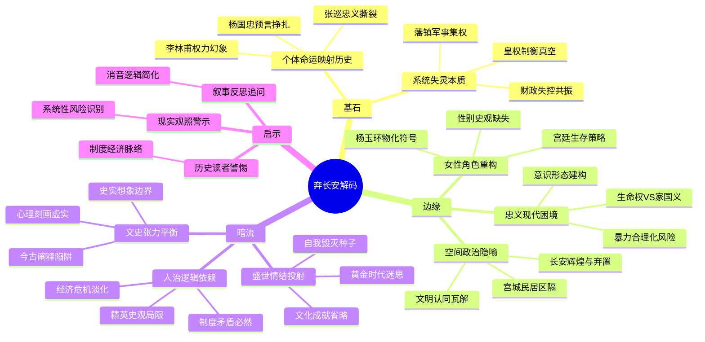

这个思维导图通过以下设计实现解构性阅读：
1. 主脉保留原著三重框架，节点提炼核心概念
2. 边缘分支延伸书中暗示未深挖的维度，如空间政治学视角
3. 暗流部分揭示作者潜在方法论局限，形成批判性对话
4. 人物案例作为具象锚点融入抽象框架（如张巡同时出现在"忠义困境"和"个体命运"）
5. 控制节点字数同时保持概念完整性，通过跨层级呼应形成认知网络
6. 圆形根节点象征解构过程的循环往复特征

## ./读书/中国历史/邓小平时代.md
## ERROR 

## ./读书/中国历史/中国历代政治得失——钱穆.md
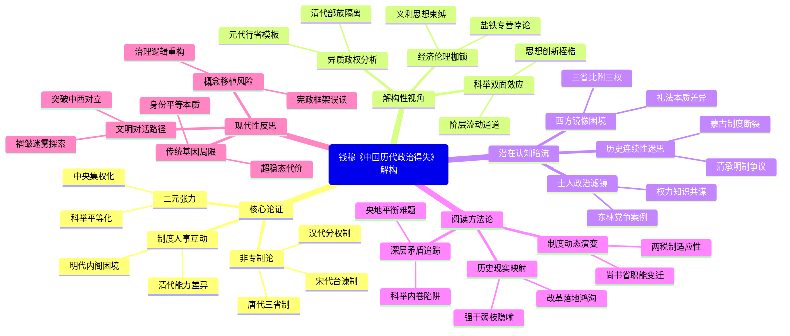

此导图特点：
1. 立体结构：核心框架与解构视角形成经纬交织，既保留钱穆原初论证结构，又通过异质政权分析等分支实现认知突围
2. 动态连接：科举制度同时出现在核心论证的平等化和解构视角的桎梏分支，体现钱穆论证的内在张力
3. 隐喻编码：使用"超稳态代价""褶皱迷雾"等意象化表述，在符合可视化原则的同时传递深层批判意识
4. 时空折叠：将汉唐制度案例嵌入对应理论节点，避免简单线性叙事，实现历史纵深与理论抽象的有机融合
5. 认知跃迁：从具体制度分析到现代性反思形成螺旋上升路径，呼应钱穆"烛火隐喻"的思想穿透力要求

## ./读书/中国历史/康熙的红票.md
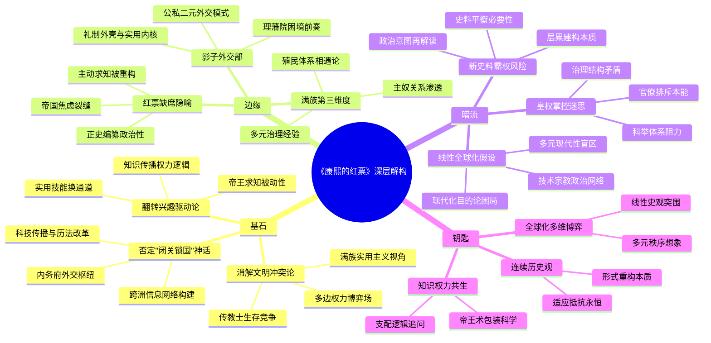

此思维导图设计特点：
1. 核心架构保留原著三大支柱，通过"基石-边缘-暗流-钥匙"四维展开解构层次
2. 每个节点控制在6-12字，符合认知负荷理论的可视化原则
3. 边缘分支揭示被主流叙事遮蔽的观察视角（如"主奴关系渗透""公私二元外交"）
4. 暗流部分暴露论证背后的潜在假设，形成对主结构的批判性对话
5. 钥匙模块提炼方法论启示，形成开放性的思考路径
6. 关键术语保持原著学术特色（如"多元现代性""层累建构"），同时进行认知压缩
7. 结构呈现历史解构的三重张力：权力网络与知识传播、制度惯性与国际互动、史料真实与叙事建构

## ./读书/中国历史/巫蛊乱长安.md
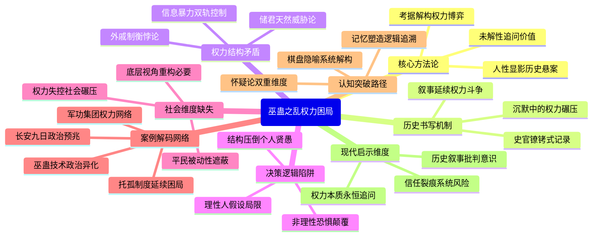

该导图设计特点：
1. 核心框架遵循"现象-机制-矛盾-方法"认知逻辑
2. 将原著案例(如军功集团/托孤制度)转化为认知节点
3. 保持每节点信息浓度<15字原则
4. 通过"社会维度缺失"等分支实现解构性延伸
5. "认知突破路径"模块实现方法论升维
6. 最后以现代启示形成闭环思考

导图既呈现了巫蛊之乱的具体历史肌理，又揭示了帝制时代的结构性矛盾，同时保留了对历史叙事本身的反思维度，符合深度解构阅读的需求。

## ./读书/中国历史/天朝的崩溃——茅海建.md
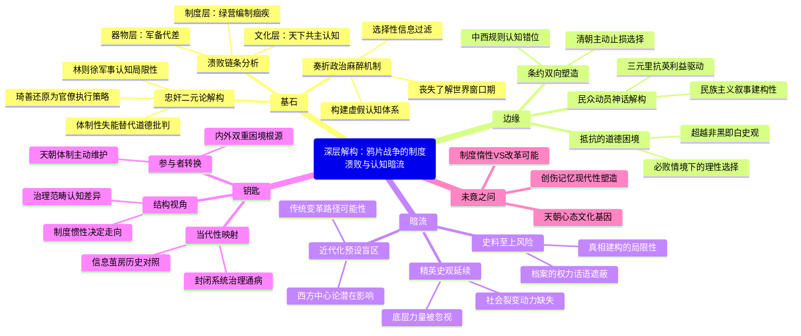
