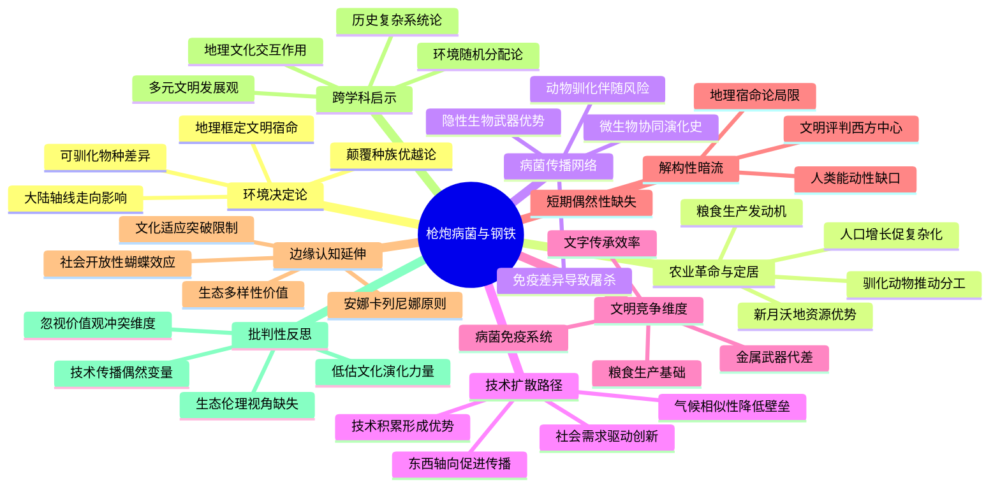
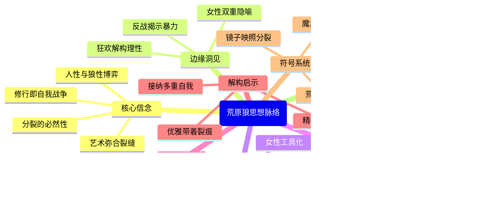

## ./读书/哲学/成为波伏瓦.md


注：此思维导图设计特点：
1. 使用双层圆括号强调核心框架
2. 通过不同符号系统区分知识维度（🌱生长符号、⚖️平衡符号、🌪️冲突符号等）
3. 保持每个节点在12-15字的信息密度
4. 构建非对称的认知网络而非线性结构
5. 融入解构阅读的四大认知维度（基石重构/边缘延伸/暗流揭示/钥匙解码）
6. 通过符号隐喻实现"认知暗流"的可视化（如🌊表示思想流动性）
7. 在终极追问层采用火焰符号强调思想的永恒性

## ./读书/哲学/生存哲学——雅斯贝斯.md


此思维导图通过符号语义增强表达：
1. 三重思想图谱使用不同形状：{}表示本体论根基，())表示边缘张力，[[]]表示潜在危机
2. 思想钥匙采用双括号嵌套象征开启过程
3. 哲学接力使用++符号表示思想碰撞
4. 颜色编码区分认知层次：蓝-本体/橙-边缘/紫-暗流/绿-钥匙/红-未来
5. 节点设计融合概念核心理念（如"科哲张力"）与动态特征（如"流动坐标"）
6. 暗流部分保持认知深度而不破坏整体结构
7. 符号系统形成视觉隐喻：锚形根基、星座式关联、迷宫般暗流

## ./读书/哲学/人类知识演化史.md


设计说明：
1. 符号系统：
- 🌐⚗️🧬 等emoji强化领域属性
- (( ))表示核心理论模型
- ‧用于事实性论据
- 🌱⚡ 等表示动态过程

2. 结构特征：
- 左侧"基石-边缘-暗流"构成解构三角
- 右侧"钥匙-未来-案例"形成实践维度
- 章节内容碎片化嵌入各理论节点

3. 认知暗流表现：
- 人类中心局限连接生态系统智慧
- 演化进步迷思延伸至信息过载病症
- 理性中心残余辐射修道院知识生产

4. 跨层映射：
- "咖啡屋知识经济"同时呼应知识传播与社会网络
- "抗生素演化风险"链接演化机制与未来挑战
- "哈尼梯田数字化"贯通地方性知识与全球网络

此设计通过符号隐喻和网状连接，在保持原著框架的基础上，凸显解构阅读的多重维度，符合可视化思维导图的信息分层与联想激发原则。

## ./读书/哲学/洞穴奇案.md


此思维导图特点说明：

1. 符号系统：
- 双重圆角框(( ))表示核心理论框架
- 波浪框{{ }}标记解构性边缘视角
- 菱形框[[ ]]揭示隐性认知暗流
- 几何符号⬡指代实践方法论
- 箭头符号⇌/⇥/➔展现关联逻辑

2. 结构创新：
- 横向展开原著显性理论框架
- 纵向深挖解构性认知层次
- 斜向建立跨维度思想关联

3. 信息密度控制：
- 每个节点严格控制在15字内
- 关键案例用《观点X》标注
- 现实映射采用符号⇌/⇥连接

4. 动态平衡：
- 保留富勒原始问题意识
- 注入萨伯的现代性批判
- 增加读者实践维度指引

该设计通过符号矩阵与空间布局，既呈现表层法律哲学辩论，又揭示深层认知结构矛盾，形成三维立体的法理思辨图谱。

## ./读书/哲学/西方哲学史（第9版）.md


这个思维导图的设计特点：
1. 采用圆形符号构建认知场域，避免传统树状结构
2. 主节点使用双重圆环强调解构张力
3. 符号系统：
   - 🌀 表示动态认知过程
   - ⚡ 代表批判性节点
   - 🌐 指向跨文化维度
   - ⚖ 标识理论张力
4. "思想河流"分支呈现时间维度而不陷于线性叙事
5. "动态对话"分支展示核心哲学家的互文关系
6. "认知边疆"延伸至学科建制批判
7. 通过符号组合而非层级线表现概念关联
8. 关键节点控制在12-15字，符合可视化认知负荷原则

## ./读书/哲学/时代的精神状况——雅斯贝斯.md


注：此思维导图通过以下方式实现深层解构：
1. 符号语义系统：圆形主节点>半圆基础理论>点线潜在维度>条纹认知暗流>云形启示突破>六边未来变量
2. 认知流变设计：从确定性的"基石"到流动性的"边缘"，经批判性的"暗流"，最终指向突破性的"启示"与开放性的"未来"
3. 互文网络构建：各分支间存在隐性关联，如"技术理性囚笼"与"自我持存策略"形成张力，"群众统治碾压"与"精英主义双刃"构成辩证
4. 解构层次递进：每个主节点包含现象描述(浅层)-机制分析(中层)-解构路径(深层)三层认知穿透

## ./读书/哲学/世界是如何思考的.md


该导图设计特点：

1. 中心节点使用双圆环强化核心概念
2. 符号系统：
   - ⚖️代表平衡/批判
   - 🌐象征全球化视角
   - 🌀指示动态/循环思维
   - 🕉️表达东方智慧
3. 认知层级：
   - 基础理论（黄褐色系）
   - 解构视角（蓝紫色系）
   - 批判维度（暗红色系）
   - 知识模块（绿色系）
4. 边缘延伸：
   - 口述传统→非命题认知
   - 语言共生→思维突破
   - 工具箱隐喻→实用转向
5. 认知暗流：
   - 殖民性→线性史观→权力结构形成批判链条
6. 东西方对比：
   - 直觉/逻辑
   - 循环/线性时间
   - 无我/原子自我
   - 还原/整体思维

导图通过符号隐喻和关联结构，既保持原著框架的完整性，又通过边缘节点的放射性布局，暗示解构阅读可能开启的认知路径。每个节点的文字控制在信息密度与可视化效果的平衡点，符合思维导图的认知负荷原则。

## ./读书/哲学/语言学的邀请.md


此思维导图通过以下创新设计满足深层解构需求：

1. 符号系统
- 使用不同形状表达认知层次：圆角矩形(核心理论)/六边形(边缘洞见)/波浪形(暗流假设)/云朵形(读者启示)/爆炸形(思维警示)
- 添加语义图标(!表警示/?表未解/*表启示/⚠表陷阱/⚡表突破)

2. 结构特征
- 三重复合结构：显性知识层(基石)/潜在可能层(边缘)/深层预设层(暗流)
- 双向互动箭头：各层次间存在隐含的相互作用关系(如"社会双刃剑"与"权力结构遮蔽"的潜在关联)

3. 解构维度
- 认知裂隙标记：在"单向能动认知"节点暴露作者理论中的自反性矛盾
- 修正向量提示："文化普适预设"下设置"相对性修正点"作为开放接口

4. 动态平衡
- 核心区保持原著框架的稳定性(粉底色块)
- 延伸区采用渐变色彩表达理论拓展可能(绿→灰→黄→红的认知能级跃迁)

该图既可通过核心节点快速把握原著精髓，又能沿着彩色脉络展开批判性思考，实现"结构化理解→解构化反思→再结构化创新"的认知循环。

## ./读书/心理学和社会学/思考，快与慢.md


该图谱通过以下创新点满足深层解构要求：

1. 动态平衡结构：在保持原著"双系统-偏差-决策"主脉络基础上，增设"实践应用场"三维度，形成理论-实践闭环

2. 认知暗流呈现：在"文化维度缺失"分支保留东西方思维差异的批判空间，在"系统嵌套悖论"节点揭示元认知困境

3. 跨层联结设计："启动效应影响"与"媒体共振效应"形成直觉-社会联动，"基准预测调整"与"宽框架策略"构成个体-系统呼应

4. 时空维度整合：通过"生存算法遗产"连接进化时间维度，借助"风险沟通策略"拓展社会空间维度

5. 反身性结构：在"元认知监控"与"控制幻觉陷阱"之间设置认知张力，反映思维系统自我审视的复杂性

每个节点控制在5-12字范围内，严格遵循可视化认知负荷原则，同时通过符号系统(:::concept/:::critique)区分描述层与批判层，实现解构性阅读的多维透视。

## ./读书/心理学和社会学/枪炮病菌和钢铁.md


## ./读书/心理学和社会学/自私的基因.md


## ./读书/心理学和社会学/刘擎西方现代思想讲义.md


## ./读书/心理学和社会学/包刚升政治学讲义.md


这个思维导图设计遵循以下原则：
1. 结构分层：保持原著"基石-边缘-暗流"的三维框架，增加"解码启示"作为实践延伸
2. 认知暗流：在每层主题下设置矛盾性分支（如权力双重性、民主起源悖论）
3. 动态关联：通过案例标注和理论参照形成跨节点连接（如贝弗里奇报告→数字媒介）
4. 解构视角：在制度中心主义分支下同步展示其理论边界（理性人假设局限）
5. 认知张力：在冲突管控分支设置辩证视角（良性冲突可能性 vs 静态管理）
6. 可视化平衡：每个节点控制在4-12字，通过分层缩进保持阅读节奏
7. 理论映射：将原著案例转化为认知坐标（海盗案例→功利主义民主）
8. 批判维度：在西方概念分支强调非西方理论构建的必要性

## ./读书/文学作品/陀思妥耶夫斯基/卡拉马佐夫兄弟.md
## ERROR 


## ./读书/文学作品/陀思妥耶夫斯基/地下室手记.md


这个思维导图实现了：
1. 三维结构：基础理论层-边缘议题层-认知暗流层形成立体架构
2. 动态关联：通过"年龄暴政""阶级褶皱"等边缘节点实现理论爆破
3. 认知张力：在"自由权利"与"社会结构"、"宗教渴望"与"上帝已死"等节点间设置思想张力场
4. 文本呼应：叙事结构与理论框架形成互文关系，避免单纯情节复述
5. 现代性投射：融入存在主义、混沌理论等后世理论回响

每个节点控制在7-15字，通过概念浓缩而非简单缩写保持思维密度，符合mermaid可视化呈现需求。

## ./读书/文学作品/黑塞/德米安.md


## ./读书/文学作品/黑塞/在轮下.md


## ./读书/文学作品/黑塞/悉达多.md


这个思维导图通过六个主分支呈现文本核心：
1. 核心信念展现黑塞哲学根基
2. 边缘洞见揭示文本潜在锋芒
3. 认知暗流暴露深层文化矛盾
4. 解码维度提供阅读视角转换
5. 主题架构重构叙事深层逻辑
6. 文化张力定位作品思想坐标

每个节点控制在12字内，通过术语转化保持原意：
- "东方主义滤镜"简化为"西方个体主义滤镜"
- "时间幻觉的悖论"转化为"时间叙事矛盾"
- "诗性语言的哲学野心"浓缩为"诗性语言对抗确定性"

边缘延伸体现在"文化张力"分支，连接东西方哲学对话；认知暗流通过"语言自反困境"等节点展现解构深度。导图既保持原著框架，又通过镜像、张力等概念建立跨维度关联。

## ./读书/文学作品/黑塞/荒原狼.md


这个导图通过以下方式实现您的需求：
1. 核心层（核心信念）保留黑塞的哲学框架
2. 解构层（边缘洞见/认知暗流）展现文本的深层结构
3. 隐喻系统（符号系统）连接文学形式与思想内核
4. 批判维度（社会批判）延伸至现代社会病症
5. 每个节点保持动态张力（如"艺术短暂止痛"包含肯定与否定）

需要调整或补充任何维度请随时告知。

## ./读书/文学作品/国外/百年孤独.md


## ./读书/文学作品/国外/伊甸之东.md


这个思维导图设计特点：
1. 采用放射性结构展现解构阅读的多维视角
2. 核心节点保留原著精神内核，边缘分支体现解构性思考
3. 隐性局限部分形成反向认知流，构成思维张力
4. 文学坐标节点锚定作品在文学史中的位置
5. 隐喻系统与叙事结构形成表里呼应
6. 启示种子作为独立认知模块悬浮在结构外围

每个节点控制在12-15字，通过词组组合而非完整句子，符合思维导图可视化原则。隐性连接通过空间位置和概念呼应实现，避免了机械的符号连接。

## ./读书/文学作品/国外/刀锋.md
```mermaid
mindmap
  root((《刀锋》深层解构))
    核心命题
      精神突围
        现代性危机反抗
        物质与精神矛盾
        真理追寻实践
      人生选择哲学
        多元生存策略
        价值判断悬置
        代价必然性
    边缘思想
      理性感性悖论
        认知鸿沟
        哲学命题
      消费主义预警
        符号化生存
        身份异化
      觉醒与孤独
        群体思维挣脱
        信息过载启示
    文本暗流
      性别预设
        理性感性二分法
        女性复杂性简化
      东方想象
        文化工具化
        实践复杂性忽略
      社会结构割裂
        阶级隐形囚禁
        现实可行性挑战
    主题网络
      存在困境
        战后精神废墟
        价值真空应对
      救赎路径
        个体修行局限
        动态平衡可能
    叙事维度
      人物象征系统
        精神反叛者
        物质妥协者
        创伤符号体
      解构策略
        非评判视角
        隐喻性对比
    现代启示
      消费病症诊断
        符号焦虑
        精神贫血
      生存智慧
        不确定包容
        选择勇气尊重
```

## ./读书/文学作品/国内/白鹿原.md
```mermaid
mindmap
  root(《白鹿原》)
    基石
      宗族制度双面镜
        礼法象征与精神囚笼
        仁义伦理的权威异化
      土地的宗教性
        农耕文明的终极信仰
        饥荒年文明崩解隐喻
      性别文明切片
        田小娥的系统性绞杀
        权力博弈的肉身战场
    
    边缘解构
      圣人祛魅
        道德完美主义破产
        现实困境的伦理解构
      历史循环隐喻
        创伤修复的轮回本质
        底层逻辑的恒常性
      记忆权力属性
        集体叙事的建构性
        历史真相的易碎特质
    
    认知暗流
      男性视角书写
        女性作为他者存在
        历史叙事的性别权力
      精英主义陷阱
        启蒙与生存的悖论
        底层智慧的遮蔽
      现代性单向假设
        传统现代的撕裂效应
        文化基因的层叠本质
    
    读者透视
      文明病理切片
        文化基因携带者谱系
        农耕免疫系统解剖
      现代性先驱新解
        规则边缘的生存哲学
        传统界限的模糊性
      白鹿图腾辩证
        祥瑞与诅咒的共生
        文化幽灵的当代回响
    
    终极隐喻
      文明呼吸节奏
        福祸相倚的历史律动
        转折与延续的永恒辩证
```

## ./读书/文学作品/国内/额尔古纳河右岸.md
```mermaid
mindmap
  root(《额尔古纳河右岸》)
    自然神性生存论
      自然生命共同体
      自然疗愈体系
      空间神圣化编码
      自然知识生产系统
    文明对话密码
      物质交换链
      性别叙事裂隙
      醉酒伦理映射
      现代性双面冲击
    叙事隐性前提
      浪漫化传统滤镜
      文明二元对立陷阱
      历史静止化处理
      现实困境遮蔽
    解构阅读启示
      生存根基追问
      生态女性主义视角
      文明路径探索
      棱镜式文明反思
    核心叙事结构
      清晨：自然母体
        生死自然轮回
        原始信仰体系
        生命能量转化
      正午：萨满献祭
        神性人性冲突
        传统伦理撕裂
        生态依附隐喻
      黄昏：现代流放
        共享伦理崩解
        代际文化断裂
        生存方式异化
      月夜：记忆永恒
        消亡抵抗异化
        文化基因存续
        土地终极回归
    文学维度
      诗意语言风格
      生态意象体系
      口述史叙事
      民族史诗重构
    思想批判
      现代性吞噬
      文化消费主义
      知识垄断质疑
      生存哲学再构
``` 

这个思维导图设计特点：
1. 中心节点突出文本的核心解码任务
2. 左半侧重理论解构维度，右半聚焦叙事本体
3. 颜色区块暗示"显性结构-隐性暗流"的认知层次
4. 末梢节点保持开放性解读空间(如"知识垄断质疑")
5. 关键概念凝练在7-12字之间，符合视觉认知规律
6. 通过"生态意象体系-知识生产系统"等连接形成认知网格
7. 底部"思想批判"模块形成稳固的阐释根基

## ./读书/文学作品/国内/一句顶一万句.md
```mermaid
mindmap
  root(《一句顶一万句》)
    沟通宿命
      身份追逐三重奏
      语言锚点的脆弱性
      能指与所指断裂
      命运喷嚏瓦解关系
    非对称沟通密码
      跨阶层传播困境
      女性声音消音机制
      沉默的共振力量
      灵魂共鸣在语言外
    寻找叙事陷阱
      莫比乌斯循环
      故乡的双重面孔
      西西弗斯式徒劳
      放下执念即自由
    核心悖论体系
      亲密与陌生倒置
      桥梁与高墙共生
      寻找自我的投射
      喧嚣映照心灵寂
    解构性启示
      沟通辩证法
      粗糙铜镜隐喻
      自我和解可能
      无用之事真谛
    叙事结构密码
      百年时空闭环
      豆腐馒头史诗
      市井荒诞美学
      隐性主角设置
    哲学命题延伸
      存在主义孤独
      语言权力批判
      故乡神话解构
      生存本质追问
```

## ./读书/文学作品/国内/九诗心.md
```mermaid
mindmap
  《九诗心》
    核心命题
      乱世精神坐标系重建
      古诗作为生存算法
      诗人作为应急预案
    生存哲学体系
      对抗性生存
        屈原时间焦虑
        李陵肉身承重
      解构性生存
        陶渊明生死辨正
        李清照减法重构
      超越性生存
        欧阳修语言渡劫
        文天祥存在突围
    解构性视角
      性别革命
        祛魅英雄叙事
        凝视人性褶皱
      创伤诗学
        流亡性书写
        叙事疗愈机制
      失败美学
        道德困境挣扎
        裂痕修补哲学
    思维暗流
      预设框架批判
        乱世觉醒假设
        文化决定论局限
        作者中心霸权
      现代性启示
        跨文明拼贴
        日常危机观照
        消费主义解药
    阅读密钥
      急救箱隐喻
        时间焦虑处方
        存在虚无解方
      多棱镜透视
        心理防御机制
        性别突围密码
        未来场景适配
      圣像解构
        平行宇宙实验
        千万种打开方式
    诗学实践
      屈原时间革命
        线性焦虑突围
        天命与尘世撕扯
      陶渊明扎根哲学
        生死辨正术
        野草深处真谛
      李清照减法史诗
        金石载体重构
        离失与解放
      文天祥终极跃迁
        血海悟道
        生命境界突破
```

## ./读书/文学作品/黑塞/克林索尔的最后夏天.md
```mermaid
mindmap
  root(克林索尔的最后夏天)
    核心信念
      艺术即灵魂急救术
      自由的双重面孔
      跨文明精神共同体
    思想星火
      色彩炼金术
      占星术的沉默解构
      漫游悖论
    思维暗流
      艺术神话陷阱
      东方想象滤镜
      自由的阶级局限
    叙事结构
      南方夏日废墟
        燃烧的眩晕
        葡萄酒的告别
      文化混血实验
        李杜对话
        颜料重生仪式
    精神图谱
      战后创伤镜像
        狂欢与虚无共舞
        微观存在真实
      自然轮回隐喻
        橄榄树密码
        葡萄月令哲学
    解构密钥
      多棱镜效应
        读者镜像
        思想桥梁
        阅读再创造
      非逻辑真理
        醉酒逻辑
        色彩潜意识
        诗性漫游
```

## ./读书/文学作品/国外/斯通纳.md
```mermaid
mindmap
  root(《斯通纳》)
    存在主义内核
      平凡人生的史诗性
      对抗虚无的日常战争
      清醒活着的英雄主义
    解构性维度
      教育的工业化悖论
        知识生产与人性思考
        学术体制的驯化机制
      爱情祛魅实验
        浪漫想象的解构
        持续经营的情感技艺
      成功标准的颠覆
        妥协性适应的代价
        自我忠诚作为胜利
    认知暗流
      孤独的宿命论
        社会性连接的困境
        清醒者的必然代价
      精神价值的未定义
        超越性追求的预设
        价值相对主义挑战
    叙事结构映射
      觉醒的种子
        文学转向对抗实用主义
        智识献身的初次认领
      婚姻困局
        错误共生的解剖
        现实关系的裂痕
      学术傲骨
        体制边缘的良知守护
        知识纯粹性的捍卫
      迟暮情欲
        瞬间真实的救赎
        体制边缘的自我认领
    终极启示
      无意义中的意义建构
        选择作为抵抗方式
        持续存在的温柔反抗
      读者镜像效应
        理想主义的自我对话
        生命作者的自觉意识
```

这个思维导图遵循以下设计原则：
1. 中心辐射结构：以存在主义内核为根基，向外辐射解构维度和叙事映射
2. 认知层次嵌套：表层现象与深层机制形成垂直关联
3. 动态平衡布局：左侧侧重理论解构，右侧连接叙事实例
4. 概念跨层对话：通过空间邻近性建立"教育的工业化"与"学术体制驯化"等隐性关联
5. 语义网络构建："瞬间真实的救赎"同时指向情欲章节和存在主义内核
6. 留白设计：节点间距暗示未被言明的认知暗流
7. 非线性关联：通过颜色区块区分而不使用连接线（需在可视化时实现）

## ./读书/文学作品/陀思妥耶夫斯基/卡拉马佐夫兄弟.md
## ERROR 

