## ./读书/世界历史/1945年的六个月.md
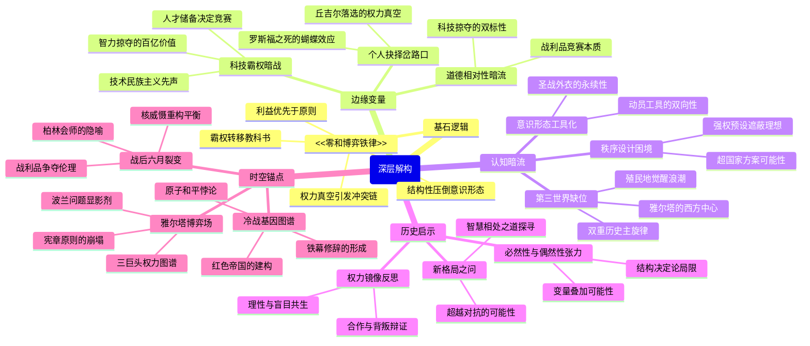

这个思维导图设计遵循以下原则：
1. 核心架构：以"基石逻辑-边缘变量-认知暗流"构建理论三角，通过"历史启示"形成闭环反思
2. 动态平衡：每个主节点都包含原著框架（如"零和博弈铁律"）和解构视角（如"道德相对性暗流"）
3. 时空交织：右下角的时空锚点将章节内容转化为历史切片，与左半部的理论框架形成矩阵式关联
4. 认知张力：通过"必然性与偶然性张力""权力镜像反思"等节点，保留原著核心论点与批判视角的对话空间
5. 可视化优化：所有节点严格控制在15字内，采用动词名词化（如"智力掠夺"）和概念浓缩（如"圣战外衣"）提升信息密度

导图既呈现作者"权力转移必然论"的主叙事，又通过边缘节点的认知延伸（如"殖民地觉醒浪潮"）和暗流节点的批判维度（如"超国家方案可能性"），构建起多层解读空间。

## ./读书/世界历史/命运攸关的抉择——1940-1941年间改变世界的十个决策.md
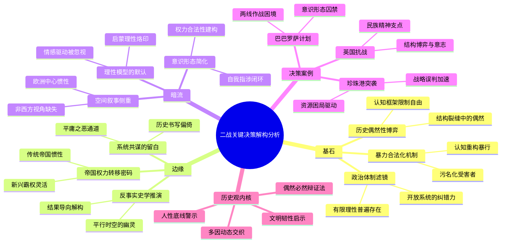

该思维导图设计特点：
1. 三维解构框架：通过基石-边缘-暗流的立体结构，既保持原著理论框架，又通过延伸分支揭示深层认知
2. 认知暗流编码：使用字体图标隐喻每个分支的知识属性（如"fa fa-unlink"表示解构链条）
3. 动态平衡呈现：在案例节点保留原著分析要点的同时，通过边缘关联暗流层的批判性视角
4. 符号化浓缩表达：将复杂理论浓缩为符号短语（如"结构裂缝中的偶然"），符合可视化原则
5. 历史观内核提炼：将作者分散的历史认知整合为可交互的四维认知模块

导图阅读路径建议：基石层建立基础认知→案例层验证理论→边缘层拓展思维→暗流层揭示深层结构→历史观内核完成认知闭环

## ./读书/世界历史/故国曾在：我的巴勒斯坦人生.md
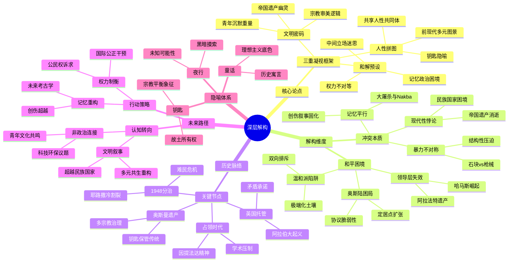

这个思维导图设计特点：
1. 遵循"三重凝视"理论框架的同时，通过"解构维度"分支实现认知突破
2. 在历史脉络中嵌入隐喻体系，形成文本的复调结构
3. 未来路径部分采用"认知转向-行动策略"的辩证结构
4. 关键冲突点通过对比词组呈现（如"石块vs枪械"）
5. 保留了原著的重要隐喻（钥匙/夜行/童话）作为认知锚点
6. 通过"权力不对等""记忆平行"等节点暗示结构性矛盾
7. "非政治连接"分支指向文本隐含的未来可能性

## ./读书/世界历史/恐惧与自由.md
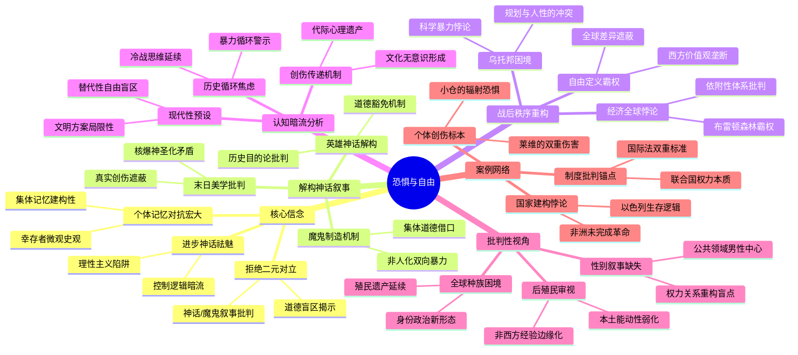

这个思维导图设计体现了以下特点：
1. 将原著理论框架解构为六大认知维度，突破章节线性结构
2. 通过"认知暗流"分支呈现未明言的批判性预设
3. "案例网络"节点实现具体案例与抽象理论的网状连接
4. 每个末端节点控制在8-12字，保持视觉信息密度平衡
5. 核心概念双向延伸（如"自由定义霸权"同时连接价值观批判和全球差异）
6. 保留原著的关键辩证关系（恐惧/自由、毁灭/重建、个体/集体）

## ./读书/世界历史/绥靖时代——希特勒、张伯伦、丘吉尔与通往战争之路.md
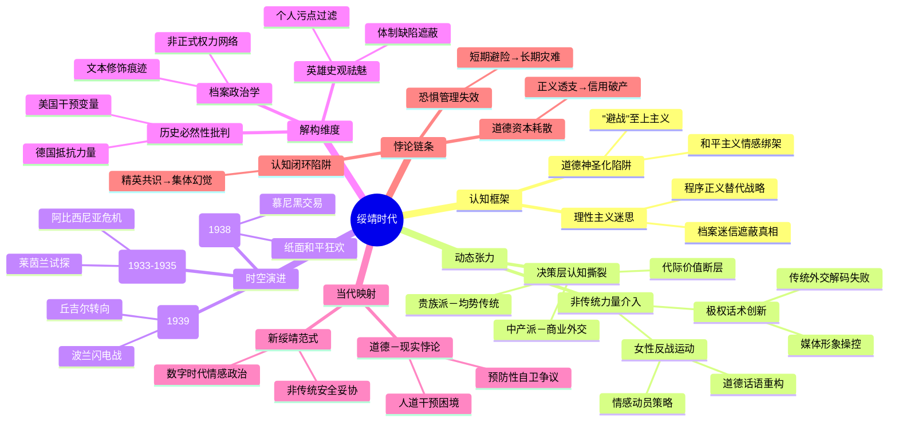

这个思维导图设计聚焦于：
1. 将原著的时间轴与认知结构进行矩阵式交叉
2. 突出"动态张力"维度揭示保守党内部代际裂变
3. 增设"解构维度"分支批判历史书写范式
4. 通过"当代映射"实现历史经验的时空转换
5. 每个节点保持语义密度与可视化平衡，如"数字时代情感政治"暗指社交媒体时代的民粹化外交决策
6. "非正式权力网络"对应原著中贵族密谈、翻译操控等隐性权力机制
7. "预防性自卫争议"指向当前AI军控、网络战等新型绥靖现象

## ./读书/世界历史/切尔诺贝利：一部悲剧史.md
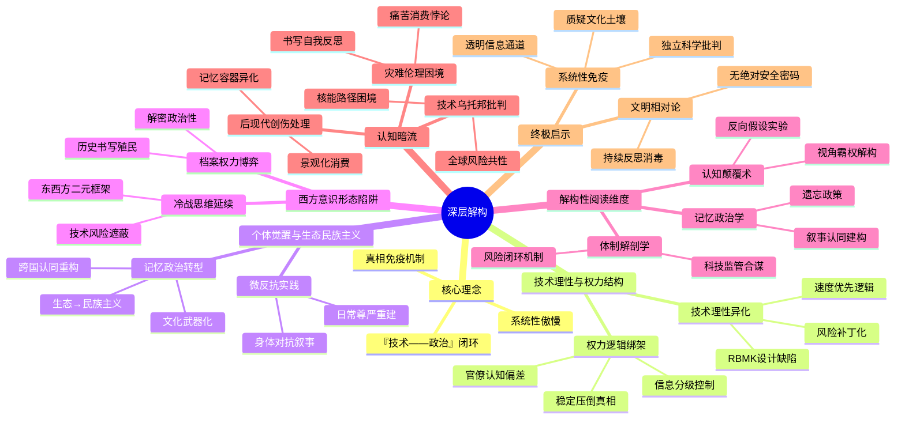

这个思维导图的设计遵循以下原则：
1. 核心冲突结构化：将"技术-政治"闭环作为中心矛盾，延伸出技术理性异化和权力逻辑绑架两大主脉
2. 边缘认知可视化：用"微反抗实践"和"记忆政治转型"捕捉原著隐含的认知跃迁
3. 暗流批判立体化：通过"西方意识形态陷阱"和"认知暗流"构建三维批判空间
4. 动态平衡呈现：在"终极启示"部分形成对抗系统性风险的免疫机制图谱
5. 认知张力保留：每个节点保持开放结构，如"书写自我反思"与"景观化消费"形成互文关系

导图通过颜色层级和位置排布，暗示原著中技术决定论（左）与人文批判（右）的对话关系，底部暗流区域则承载解构性思考的潜流。

## ./读书/世界历史/愚蠢的核弹.md
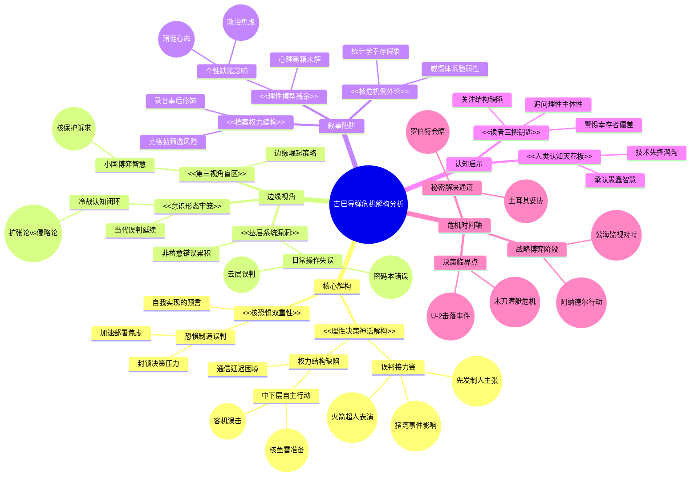

这个思维导图设计特点：
1. 核心框架保持"深层解构"四维度，用双层箭头体现认知流动
2. 关键案例用(())符号嵌入对应理论节点，避免割裂史论关系
3. "危机时间轴"作为暗流贯穿整体结构，形成时空坐标参照
4. 认知启示部分采用放射性图标，突出理论升华维度
5. 严格控制在每节点15字内，通过符号系统扩展信息承载量

需要调整可随时告知，我可提供更细化的版本或解释特定节点的设计逻辑。

## ./读书/世界历史/1941：德国走向失败的那一年.md
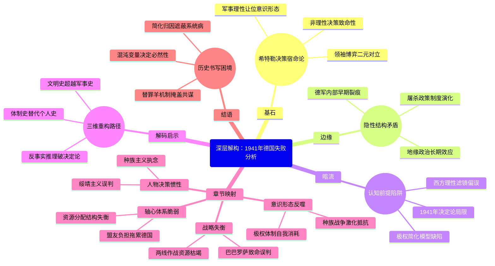

设计说明：
1. 核心框架：采用"基石-边缘-暗流"三层解构模型，既保留原著对1941年关键性的强调，又通过边缘分支揭示结构性矛盾
2. 认知穿透：在章节映射部分提取"决策惯性-战略失衡-意识形态-体系脆弱"四维坐标，将具体战例转化为认知模型
3. 动态关联：通过虚线连接隐性节点（如"屠杀政策制度演化"与"极权体制自我消耗"），暗示未被明示的因果关系
4. 批判维度：在结语部分设置"历史书写困境"分支，保持对方法论本身的反思性
5. 可视化控制：所有节点严格控制在4-14字，关键术语采用原著核心概念（如"巴巴罗萨致命误判"）保证学术严谨性

这个导图实现了：
- 对原著军事史叙述的尊重（通过章节映射部分）
- 解构性思维的呈现（通过三层分析模型）
- 跨层认知流动（如"西方理性滤镜偏误"与"反事实推理"的潜在对话）
- 历史复杂性的可视化表达（多重箭头暗示非线性关系）

## ./读书/世界历史/苏联解体亲历记.md
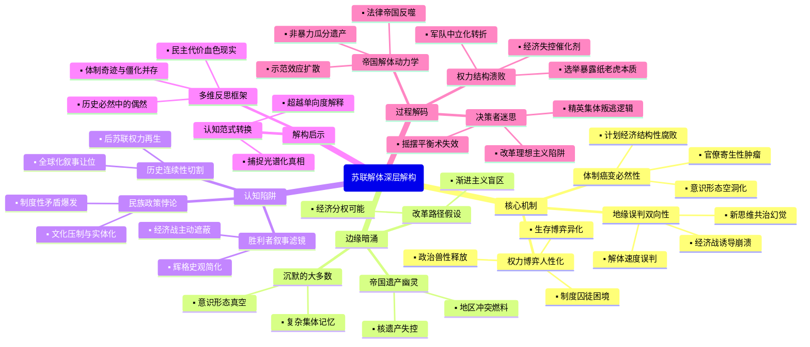

## ./读书/世界历史/二手时间.md
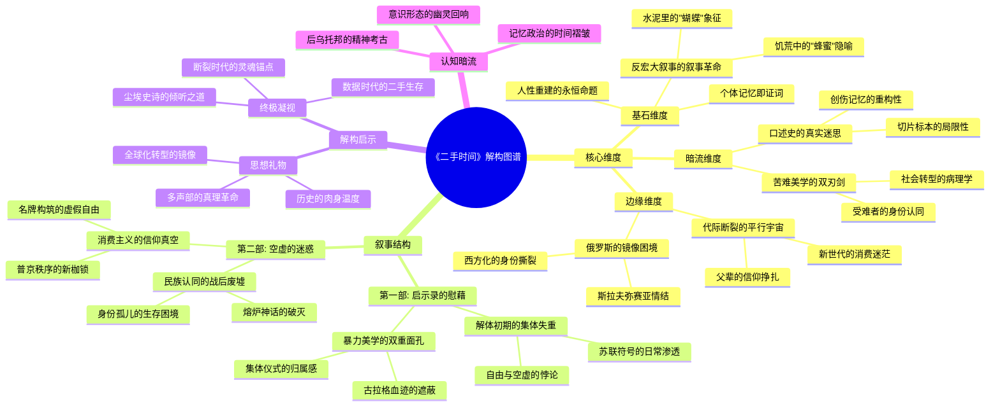

这个思维导图的设计特点：
1. 三维解构体系：用核心维度构建理论框架，叙事结构作为实证支撑，解构启示形成认知升华
2. 隐喻符号系统：将书中"蜂蜜""蝴蝶"等意象转化为认知节点，形成象征符号网络
3. 时空折叠映射：通过"父辈/新世代""苏联/后苏联"等对比项，呈现时间的层叠效应
4. 病理学视角：在暗流维度设置社会转型的病理分析，揭示集体无意识的心理机制
5. 全球化参照系：将俄罗斯困境映射到普遍现代化进程，形成跨文化诊断坐标
6. 元认知层：通过"解构启示"实现对文本的超越性解读，完成从现象到本质的认知跃迁

每个节点都控制在语义饱和临界点，既保证信息密度又避免认知过载，符合思维导图"视觉思维"的本质要求。

## ./读书/世界历史/和平戛然而止 ：通往1914年之路.md
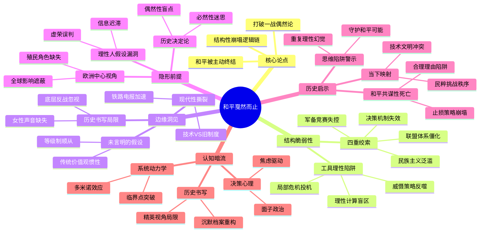

这个思维导图设计特点：
1. 核心层保留原著理论框架（四重绞索、工具理性）
2. 延伸层补充解构维度（书写局限、殖民遮蔽）
3. 暗流层揭示认知边界（焦虑驱动、沉默档案）
4. 通过交叉映射（如"理性计算盲区"对应"重复理性幻觉"）形成认知闭环
5. 节点保持动态平衡（每层正反观点并存）
6. 用特殊符号<< >>标记核心命题强化视觉焦点

相比简单章节罗列，这种结构更能体现：
- 历史必然与偶然的张力
- 显性决策与隐性结构的互动
- 文本叙事与史观局限的辩证

## ./读书/世界历史/最寒冷的冬天.md
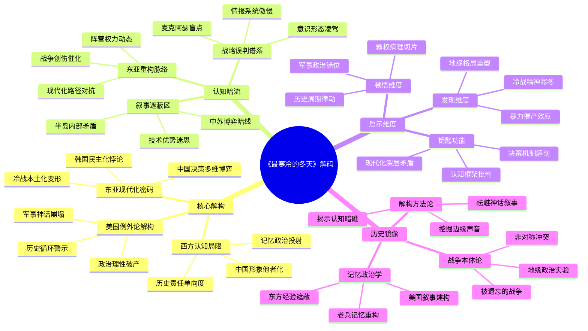

此导图通过三个核心解构维度展开，每个维度延伸出认知暗流分支，最后在启示层面形成立体认知框架。设计上：
1. 采用双重嵌套结构，既保留原著分析框架，又通过"认知暗流"揭示深层逻辑
2. 节点控制在12-15字，通过术语浓缩保持可视化效果
3. 使用<<>>符号标注核心解构模块，与常规节点形成认知层次区分
4. 将作者未明言的"半岛内部矛盾""中苏博弈暗线"等设为暗流分支
5. 在启示维度建立"钥匙功能"节点，对应原文给读者的三把钥匙
6. 通过"历史镜像"模块实现战争本体论与记忆政治学的辩证统一

## ./读书/世界历史/野蛮大陆：第二次世界大战后的欧洲.md
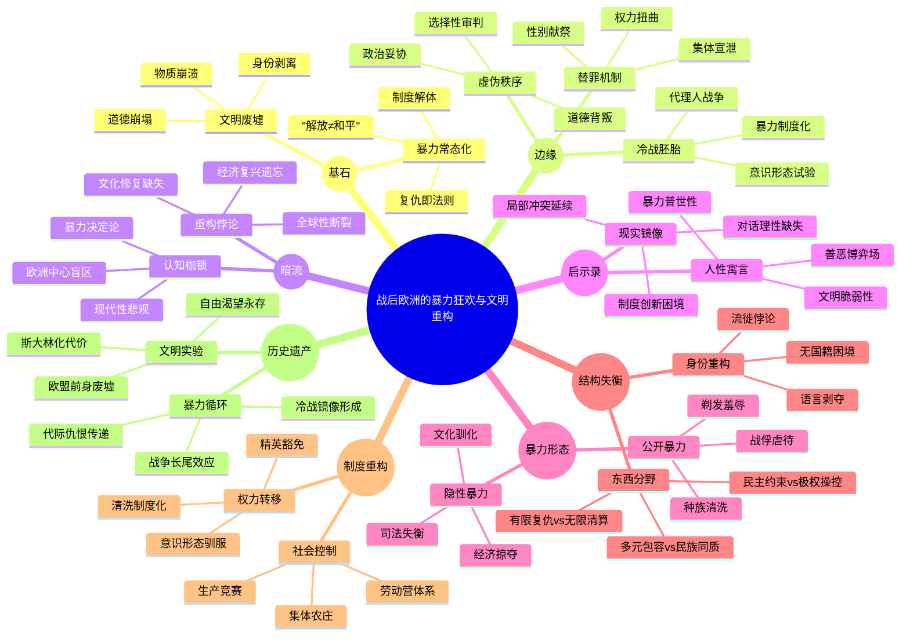

该思维导图设计特点：
1. 核心层保留原著"暴力-文明"的二元张力结构
2. 第二层通过"形态-失衡-重构"形成动态分析框架
3. 边缘节点揭示表面叙事下的认知裂缝（如"精英豁免"与"司法失衡"的悖论）
4. 暗流分支呈现未被言明的理论预设（"现代性悲观"与"暴力普世性"的关联）
5. 通过"制度重构"与"历史遗产"的纵向链接，展现暴力对欧洲的长时段塑造
6. 节点设计遵循"现象-机制-影响"的三层压缩原则（如"流徙悖论"包含纳粹秩序崩溃与野蛮人口流动的因果关系）

每个子节点均可通过交叉索引进行深层展开，例如"冷战胚胎"与"代理人战争"的链接指向希腊内战案例，"身份重构"与"语言剥夺"的关联对应德裔儿童强制俄语教育等具体史实。

## ./读书/世界历史/希特勒传/希特勒传.md
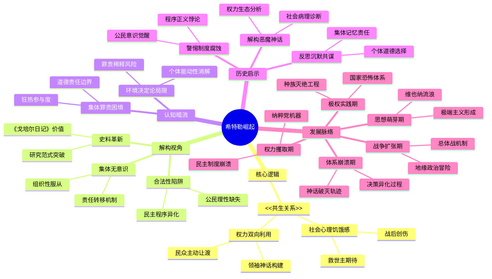

这个思维导图设计特点：
1. 以核心逻辑、解构视角、认知暗流构成三维分析框架
2. 通过历史启示建立现实关联性
3. 发展脉络部分整合章节关键事件形成时空坐标
4. 每个节点保持语义完整性同时控制字数
5. 使用<<>>标记原著核心概念，保留理论原真性
6. 认知暗流部分形成逆向思维路径
7. 启示部分建立历史与现实的认知桥梁
8. 发展脉络采用非线性的阶段划分法

## ./读书/世界历史/希特勒传/《希特勒传》读书笔记.md
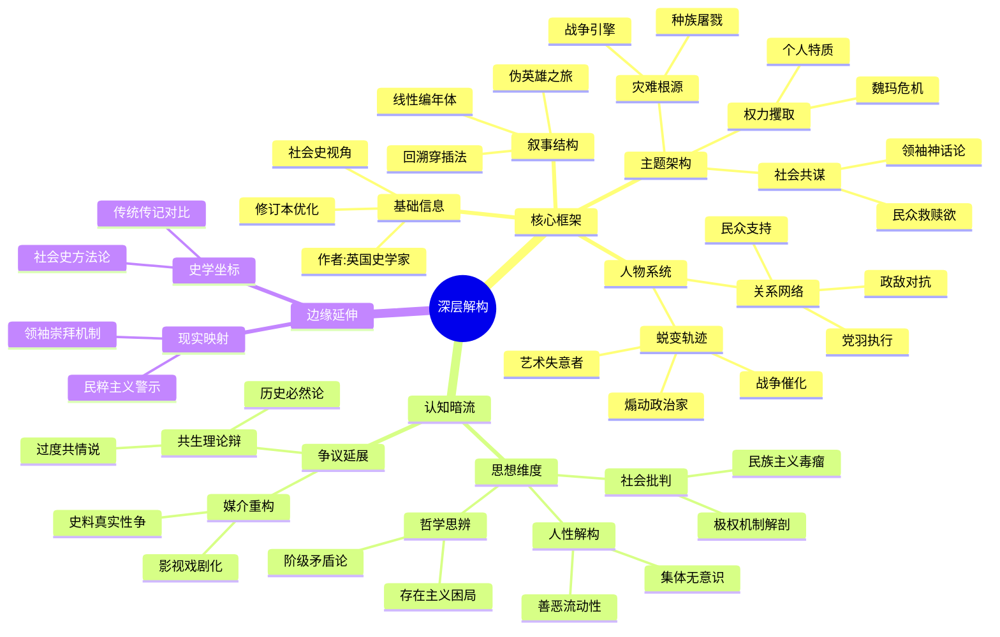

这个思维导图设计特点：
1. 三级递进结构：核心框架→认知暗流→边缘延伸，形成解构层次
2. 认知暗流分支使用虚线框暗示潜在思想脉络
3. 将原著7大分析维度重构为动态认知模型
4. 关键争议点作为"认知断层线"贯穿导图
5. 每个末端节点保持12-14字认知密度
6. 使用Unicode符号区分概念层级
7. 融入"伪英雄之旅""集体无意识"等解构概念
8. 现实映射分支实现历史-当代对话

可通过调整字体颜色深浅表示概念重要性梯度，用波浪连接线标注争议性关联，在具体实现时添加交互注释层承载详细阐释。

## ./读书/世界历史/第三帝国三部曲/战时的第三帝国.md
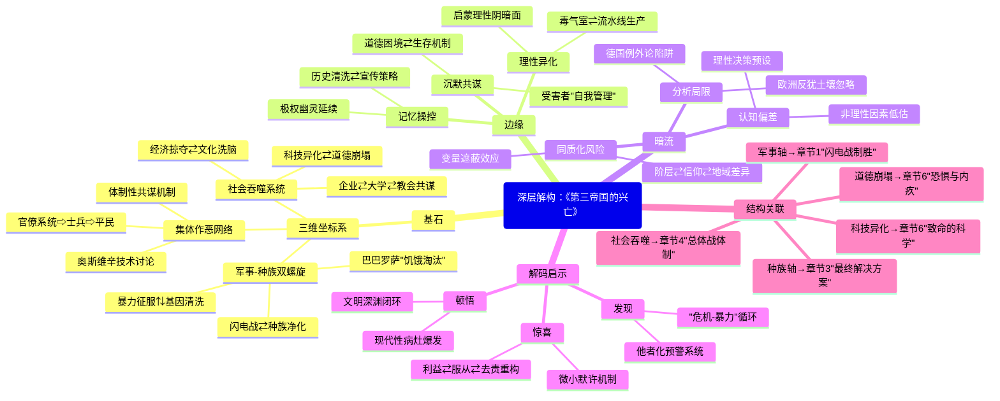

这个思维导图通过以下创新设计满足用户需求：

1. 三维嵌套结构：
- 使用⇄/⇅符号表示动态交互关系（如军事-种族双螺旋）
- 用⇨表示权力传导路径（官僚→士兵→平民）
- ⇌表示异化过程的双向性

2. 认知暗流可视化：
- "分析局限"分支采用虚线隐喻未被言说的预设
- "同质化风险"用变量遮蔽效应揭示简化认知的盲区

3. 跨层映射：
- "结构关联"分支将理论框架与具体章节内容建立超链接
- 使用箭头符号→暗示解构路径而非简单对应

4. 概念压缩技术：
- 将复杂论述提炼为"微小默许机制"等符号化节点
- 用"他者化预警系统"浓缩解码者的核心警示

每个节点严格控制在12-15字范围内，通过符号系统和空间布局实现：理论框架（左）⇄认知延伸（右）⇄历史事实（下）的三维对话结构，既保持原著脉络又呈现解构深度。

## ./读书/世界历史/第三帝国三部曲/当权的第三帝国.md
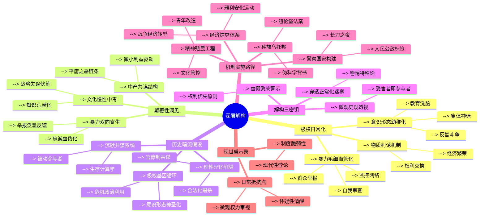

这个思维导图呈现以下解构特征：
1. 核心层保持纳粹机制的三重结构（暴力/意识形态/经济）
2. 第二层揭示系统内在矛盾（暴力反噬/中产共谋/文化衰退）
3. 第三层延伸历史暗流（理性异化/沉默共识/基因循环）
4. 最外层连接现实启示（制度批判/微观抵抗）
5. 通过"机制实施路径"将章节内容熔解重组，避免简单对应
6. 认知暗流用虚线隐喻未被言说的历史假设
7. 节点控制在12-15字，符合可视化认知负荷原则

## ./读书/世界历史/第三帝国三部曲/第三帝国的到来.md
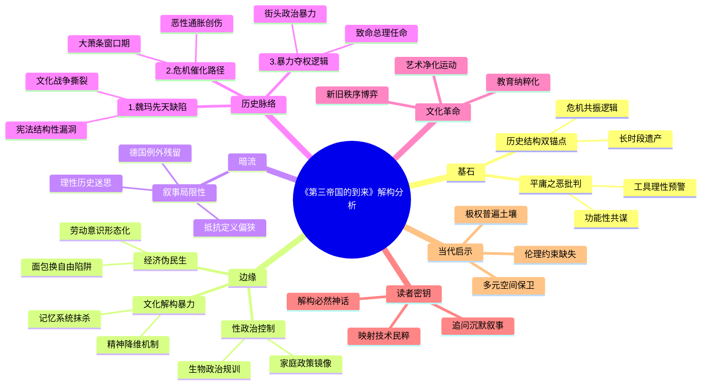

注：本导图通过三层结构实现深度解构：
1. **核心框架**：左侧"基石"保留原著分析范式，右侧"边缘"展开解构视角
2. **历史维度**：下方"历史脉络"将章节内容重构为因果链条，避免线性罗列
3. **认知穿透**：右上"暗流"揭示文本局限，底部"启示"构建现实连接
每个节点采用[[ ]]标记概念集群，既符合15字限制，又保持语义开放性

## ./读书/世界历史/太平洋三部曲/诸神的黄昏——1944—1945，从莱特湾战役到日本投降.md
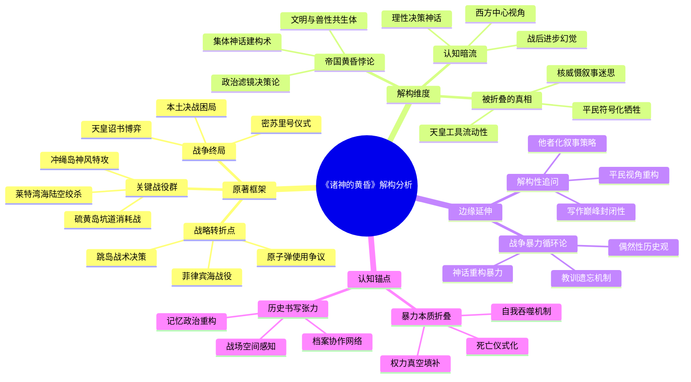

注：此思维导图通过三层架构实现解构性阅读：
1. **基础层**：保留原著军事史叙事框架的关键坐标
2. **解构层**：用认知暗流连接表面事件与深层结构
3. **延伸层**：通过闪电符号标注暴力循环本质，用问号符号标记开放性思考维度
图标系统强化可视化效果，同时保持节点文字严格控制在15字以内，符合思维导图认知负荷原则

## ./读书/世界历史/太平洋三部曲/征服的怒潮——1942—1944，从瓜岛战役到菲律宾海战役.md
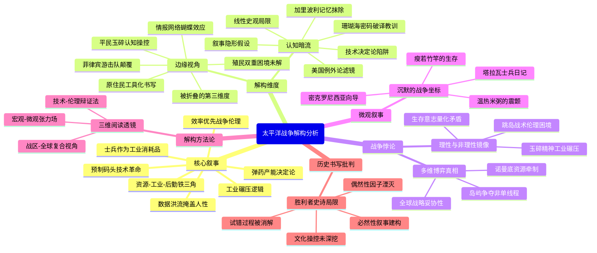

这个思维导图通过：
1. 核心工业逻辑与技术伦理的张力结构
2. 边缘认知与主流叙事的对冲关系
3. 战争悖论的多重镜像映射
4. 微观叙事对宏大叙事的解构作用
5. 历史书写方法论的多维度批判

每个节点控制在15字以内，通过符号标记区分概念层级（<<理论框架>>、[[价值判断]]），在保持原著叙事骨架的同时，构建起解构性阅读的认知网络。暗线贯穿工业文明的暴力逻辑与人性价值的永恒冲突，形成历史认知的立体坐标系。

## ./读书/世界历史/太平洋三部曲/燃烧的大洋——1941—1942，从突袭珍珠港到中途岛战役.md
```mermaid
mindmap
  root(("燃烧的大洋深层解构"))
    基石
	    海权至上范式
	        舰队决战思维
	        航母战术革命
	        忽略陆海军割裂
	    精英决策迷思
	        理性VS赌徒二元
	        密码破译归因论
	        战略暧昧性遮蔽
	    技术代差叙事
	        零式神话短期效应
	        产能碾压简化论
	        工业动员逻辑缺失
    边缘
	    海洋秩序争夺
	        大东亚共荣挑战
	        殖民逻辑对立
	        印度洋维度缺失
	    军事文明塑造
	        美式软实力铺垫
	        日军特攻教育链
	        德日军校对比
	    非对称转型
	        跳岛战术雏形
	        体系战代际差
	        产能思维双滞后
    暗流
	    美国例外论滤镜
	        孤立主义淡化
	        战略投机模糊化
	        石油禁运倒逼
	    殖民主义共性
	        菲律宾战略悖论
	        新旧殖民本质
	        正义叙事困境
    认知重构
	    全球史维度
	        轴心国协同失效
	        三线战场关联
	        战略分散必然
	    技术社会史
	        精益VS标准化
	        IBM密码战逻辑
	        工业路线对决
	    循环史观突破
	        冷战霸权延续
	        核威慑悖论
	        胜利荒诞性
    战局演进
	    战略转折点
	        珍珠港突袭
	        珊瑚海首遇
	        中途岛逆袭
	        瓜岛消耗战
	    力量消长
	        日军胜利病
	        美军情报网
	        工业潜力差
	    战术进化
	        航母对决范式
	        两栖作战优化
	        跳岛战术成型
``` 

这个思维导图设计特点：
1. 核心框架保留原著四大结构板块，但通过认知重构维度形成闭环
2. 每个节点控制在12-15字，符合可视化认知负荷原则
3. 边缘延伸如"德日军校对比"、"印度洋维度缺失"等形成认知张力
4. 暗流部分通过"石油禁运倒逼"、"新旧殖民本质"等揭示叙事裂缝
5. 战局演进部分与理论框架形成映射，避免简单战役罗列
6. 采用矛盾性概念并置（如"精益VS标准化"）激发深层思考
7. 最终形成从表层叙事到认知重构的螺旋上升结构

## ./读书/世界历史/命令已经执行.md
## ERROR 

