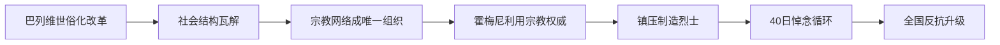

# 愤怒波斯 伊朗·1978

> **UP主**: 小约翰可汗  
> **时长**: 30:15  
> **发布时间**: 2026-03-13 14:00:45  
> **链接**: https://www.bilibili.com/video/BV1zxcUzXE1Z
> **封面图**: http://i1.hdslb.com/bfs/archive/2aed80e99e3b2bcdf3a87800873a5654760e9026.jpg

---

# 视频摘要报告：《愤怒波斯 伊朗·1978》小约翰可汗

## 1. 视频概述
本视频聚焦于**伊朗1978年伊斯兰革命前夕的社会动荡**，以宗教领袖霍梅尼的成长与抗争为叙事主线，揭示巴列维王朝崩溃的深层原因。视频通过**微观个体史与宏观社会分析结合**的方式，解析了宗教势力如何利用传统社会网络（如清真寺、悼念仪式）对抗世俗化政权，最终引爆全国性革命。

**核心主题**：  
- 巴列维王朝现代化改革的失败与宗教反弹  
- 霍梅尼从宗教学者到革命领袖的转型  
- “40日悼念循环”如何成为组织反抗的核心机制  

**作者立场**：  
- 批判巴列维王朝的统治失当（如镇压策略反复、政治短视）  
- 客观呈现霍梅尼的复杂形象（既有宗教保守性又有政治策略性）  
- 强调底层民众诉求被宗教势力吸纳的历史必然性  

**叙事结构**：  
1. **序幕**：伊朗传统社会结构与霍梅尼早期经历  
2. **冲突升级**：霍梅尼与巴列维的三次交锋（1962-1964）  
3. **流放期布局**：霍梅尼理论建构与声望积累  
4. **革命导火索**：1978年库姆惨案引发的连锁反应  
5. **终局预演**：“40日悼念循环”机制如何瓦解王权  

---

## 2. 核心论点与关键概念

### 核心论点：
1. **宗教网络是反抗组织的骨架**  
   清真寺作为唯一未被萨瓦克（SAVAK，秘密警察）摧毁的社会组织，成为信息传递、资金募集和人员动员的核心枢纽。宗教税（خمس）资助的地下救助网络为革命提供物质基础。

2. **巴列维的镇压策略加速王朝崩溃**  
   暴力镇压制造“烈士”，触发什叶派“40日悼念”传统，形成自我强化的反抗循环（库姆→大不里士→亚兹德→全国）。政权合法性在“清真寺=牲口棚”等言论中彻底瓦解。

3. **霍梅尼的领袖塑造具有策略性**  
   其形象从“库姆教师”升格为“先知化身”，通过演讲磁带、血统叙事（圣裔后裔）、神迹传说（月亮面容）构建超凡魅力。流放反而扩大其影响力，使其成为各阶层诉求的“象征容器”。

4. **现代化改革的悖论**  
   巴列维的世俗化政策（如土地改革、西方化）导致农村崩溃、城市贫民窟化，传统阶层（巴扎商人、教士）与新兴无产者结成反王权同盟，宗教成为唯一粘合剂。

### 关键概念：
- **法基赫监护（ولاية الفقيه）**：霍梅尼在流放期间发展的理论，主张教法学家应接管国家政权，为伊斯兰共和国奠基。
- **40日悼念循环**：什叶派传统中，烈士死后第40天需举行悼念仪式，成为反抗运动周期性爆发的组织机制。
- **政治缄默原则**：什叶派传统中宗教领袖不干政的惯例，布鲁吉尔迪死后被霍梅尼打破。

### 逻辑关系：

---

## 3. 详细内容梳理

### 第一部分：霍梅尼的崛起基础（1902-1960）
- **早期经历**：生于地主毛拉家庭，父亲遇刺后由女性亲属抚养。童年在“小偷与大神”游戏中坚持扮演“沙”，显露天性。
- **教育背景**：1920年入阿拉克神学院，后迁至库姆，30岁成教师。学生包括哈梅内伊、拉夫桑贾尼等未来核心人物。
- **政治缄默期**：1961年前恪守什叶派传统，仅匿名撰写《揭秘》小册子批判世俗化。

### 第二部分：王权与教权的三次交锋（1962-1964）
- **第一回合（1962）**：霍梅尼通过公开信迫使国王撤回地方议会法案，声望初显。支持者扬言“炸死国王”引发当局震惊。
- **第二回合（1963）**：霍梅尼公开称国王为“美以傀儡”，被捕引发“六月起义”。镇压后被迫释放，凸显王权脆弱。
- **第三回合（1964）**：霍梅尼讽刺美军治外法权：“美国厨师撞死国王却无人可管”。流放土耳其，后转伊拉克纳杰夫。

### 第三部分：流放期的策略转型（1964-1977）
- **形象管理**：在土耳其故意表演保守（要求女性戴头巾），实为向国内传递宗教坚定性；私下与房东和睦相处，显示务实性。
- **理论建构**：在纳杰夫研究“法基赫监护”，为夺权铺路。
- **传播革命**：演讲磁带通过学生网络流入伊朗，清真寺、出租车收音机成播放枢纽。民间神化其形象（月亮面容、先知转世预言）。

### 第四部分：1978年革命导火索
- **愚蠢挑衅**：1978年1月7日官方报发文诋毁霍梅尼是“印度间谍、同性恋者”，触犯宗教禁忌。
- **库姆惨案（1月9日）**：学生焚烧报纸，军警开枪镇压，伤亡不详。霍梅尼从伊拉克发声明称政权非法。
- **悼念循环启动**：宗教领袖号召40天后悼念，形成固定反抗节奏。

### 第五部分：全国反抗浪潮（1978）
1. **大不里士起义（2月18日）**：警察局长称清真寺为“牲口棚”，青年塔加里中弹成烈士。市民焚毁复兴党部，军队镇压。
2. **亚兹德惨案（3月29日）**：悼念活动遭机枪扫射，百余人死亡。霍梅尼建立宗教税资助的救助网络。
3. **德黑兰激化（5月10日）**：萨瓦克闯入阿亚图拉宅邸枪杀学生，温和派倒戈。

---

## 4. 重要引用与案例

### 关键引用：
- 霍梅尼讽刺治外法权：  
  > “如果美国厨师撞死国王，却无人有权干涉；但若国王撞死美国人的狗，也会被起诉。”  
- 大不里士警察局长马克苏德·谢纳斯：  
  > “把这个牲口棚的大门给我关紧！”（指清真寺）  
- 亚兹德抗议者口号：  
  > “库姆的血未干，大不里士的魂未安，亚兹德的兄弟们还要沉默多久？”

### 核心案例：
- **霍梅尼的土耳其表演**：  
  在伊朗军官面前坚持要求房东妻女戴头巾，军官离场后即缓和态度，显示其行为具有政治表演性质。
  
- **塔加里之死的象征意义**：  
  青年因抗议“清真寺=牲口棚”言论被杀，什叶派“殉难”叙事迅速激活群众反抗，凸显宗教尊严对动员的关键作用。

- **萨瓦克闯入宅邸事件**：  
  违反“圣域不可侵犯”传统，迫使温和派宗教领袖沙利亚特马达里倒戈，标志统治集团彻底分裂。

### 重要数据：
- **亚兹德惨案**：死亡人数达上百人（视频引用历史学家统计）  
- **城市化危机**：亚兹德城市规模10年内翻倍，农村移民导致失业率与犯罪率飙升  
- **镇压成本**：大不里士起义出动装甲部队，三辆坦克被焚毁  

---

## 5. 深度分析与思考

### 深层含义：
1. **传统与现代的暴力嫁接**  
   什叶派传统（悼念仪式、圣域观念）被转化为现代反抗工具，显示宗教在组织底层社会时的不可替代性。巴列维摧毁世俗政党却未消灭宗教网络，为自身埋下炸弹。

2. **领袖形象的符号化构建**  
   霍梅尼通过血统叙事（圣裔）、神迹传说（月亮面容）、苦难经历（流放）完成“先知化”转型，成为各阶层利益投射的空白屏幕。学生见反贪、民族主义者见抗美、穷人见均贫富。

3. **镇压的自我毁灭性**  
   巴列维政权在“强硬镇压”与“妥协道歉”间反复摇摆，暴露权力脆弱性。每次镇压制造新烈士，触发下一轮悼念，形成闭环式革命加速器。

### 历史背景：
- **全球石油危机（1973）**：油价暴跌导致伊朗财政危机，削弱巴列维经济基础  
- **卡特人权外交**：美国施压放松高压政策，释放反对派活动空间  
- **什叶派千年传统**：卡尔巴拉殉难事件衍生的悼念文化，为反抗提供现成组织模板  

### 争议点：
- **霍梅尼的双面性**：视频暗示其宗教保守是表演策略，但伊斯兰共和国后续政策证明其原教旨主义内核。  
- **替代可能性**：若无霍梅尼，伊朗是否会走向民主化？视频未探讨世俗反对派（如左翼）的失败原因。  
- **西方责任**：巴列维作为美国代理人，其倒台是否源于美国战略失误？视频未深入分析国际维度。  

---

## 6. 结论与启示

### 核心结论：
1. 巴列维王朝的崩溃源于三重失败：  
   - **经济失败**：石油经济未惠及底层，制造城市贫民  
   - **文化失败**：世俗化摧毁传统结构却未建立新认同  
   - **政治失败**：镇压策略激活宗教反抗机制  

2. 霍梅尼的成功在于：  
   - 将宗教网络转化为组织武器  
   - 使自身成为多元诉求的象征符号  
   - 利用传统机制（悼念循环）消解现代国家暴力垄断  

### 启示：
- **传统社会的现代化陷阱**：强行切断传统纽带可能引发更激烈反弹，需寻找文化缓冲机制。  
- **反抗运动的组织规律**：有效反抗依赖现存社会结构（如伊朗清真寺、波兰天主教堂）。  
- **政权合法性的脆弱性**：诋毁核心象征（如宗教领袖）可能加速合法性崩塌。  

### 延伸思考：
- 比较研究：伊朗伊斯兰革命与埃及“阿拉伯之春”的组织模式异同  
- 当代意义：宗教在全球化危机中是否仍具动员潜力？  
- 未解之谜：霍梅尼长子穆斯塔法1977年之死是否萨瓦克暗杀？其如何影响革命进程？  