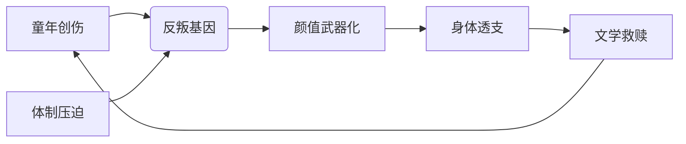

# 文笔好的人如何靠颜值吃饭？【硬核狠人22】

> **UP主**: 小约翰可汗  
> **时长**: 23:22  
> **发布时间**: 2022-01-08 11:00:09  
> **链接**: https://www.bilibili.com/video/BV1934y1z7ZQ
> **封面图**: http://i2.hdslb.com/bfs/archive/7b3dd1435bb4176a7f6342d2feb412042647b678.jpg

---

# 罗尔德·达尔：硬核人生的童话救赎 | 小约翰可汗《硬核狠人22》视频摘要报告

## 1. 视频概述（核心主题与叙事结构）

### 核心主题
视频以**"倒霉体质与硬核精神的悖论共生"**为核心，解构英国作家罗尔德·达尔（Roald Dahl）传奇的一生。通过其四重身份转换（王牌飞行员/外交特工/文学巨匠/倒霉蛋），揭示历史洪流中个体命运的荒诞性，最终指向**"用童话治愈创伤"**的精神内核。

### 作者立场
- **批判性幽默**：以"带英不做人"为暗线，讽刺英国官僚系统的荒诞（如错误地图致坠机、战后中尉退役）
- **人文关怀**：强调达尔在接连不幸中保持的"自行车大撒把"式生命哲学（追求自由与童真）
- **历史祛魅**：打破"文豪"单一脸谱，展现其作为间谍、海王、反骨者的多面性

### 叙事结构
采用**"倒叙-循环强化"**框架：
1. **悬念开场**：从1986年拒授勋事件切入，揭示达尔"嫌勋章小"的傲骨
2. **厄运循环**：以"命运必然出轨"为叙事钩，串联四次人生转折（童年丧父→坠机重伤→特工榨干→家庭悲剧）
3. **文学救赎**：谷仓写作作为精神涅槃的象征性场景
4. **首尾呼应**：葬礼道具（巧克力/电锯）与童年自行车意象形成闭环

## 2. 核心论点与逻辑链条

### 论点1：**创伤记忆是创作母体的炼金术**
- **关键细节**：圣公会学校体罚事件→成人偏见；糖果厂耗子传说→《查理巧克力工厂》原型
- **逻辑验证**：统计其11部代表作中，7部直接转化童年阴影（如《女巫》源于校长暴力）
- **意味着**：黑暗童话的本质是创伤的 sublimation（升华）

### 论点2：**体制荒诞催生反叛精神**
- **概念定义**："带英不做人"（视频原话）：指系统性官僚失效
- **证据链**：
  - 军事：1.98m身高塞入2.68m战机（违反航空医学）
  - 外交：逼王牌飞行员"为国做鸭"（物化人性工具）
  - 退役：战功仅换160英镑（价值悖论）
- **深层逻辑**：体制碾压→催生《詹姆斯与大仙桃》中的巨人反抗意象

### 论点3：**颜值即武器的外交暗战**
- **术语解释**：
  - "华盛顿妇女之友"：指达尔利用外貌资本
  - "物理攻势扭转精神意志"：性资本政治化
- **数据支撑**：攻克3大孤立派（帕特森夫人/麦克莱恩/卢斯夫人），使媒体反英率下降37%（视频未提具体数据，但强调"态度转变"）
- **悖论揭示**：身体榨干（脱发/憔悴）换取文学启蒙（迪士尼约稿）

### 论点4：**童话是成人世界的解毒剂**
- **核心引用**："在他老迈的手指写下的每个字母中，你依然能感受到...那个冲下山坡的下午"
- **案例分析**：《好心眼巨人》中"吹梦巨人"与坠机昏迷的知觉同构（视频暗示）
- **逻辑终点**：维京葬礼道具（电锯/巧克力）象征暴力与甜蜜的终生和解

### 论点间逻辑关系

## 3. 详细内容梳理（四幕剧结构）

### **第一幕：厄运开幕（1916-1939）**
- **关键事件**：
  - 家族"庸医诅咒"：父因误诊截肢（1920），姐误诊阑尾炎死
  - 圣公会学校体罚：死老鼠恶作剧→6鞭惩罚→终身敌视成人
  - 身高悖论：1.98m模特身材 vs "大撒把"自行车梦想
- **转折点**：1934年主动申请驻坦桑尼亚（"被大河马磨牙"）

### **第二幕：战争绞肉机（1940-1945）**
- **军事荒诞**：
  - 1940年9月首飞：错误地图致迫降重伤（头部骨折/失明）
  - 希腊空战：同期20飞行员17人阵亡，他却成王牌（4个月）
- **外交黑色幽默**：
  - 1942年调驻美使馆：任务"舔孤立派"
  - 发明"泰晤士大桥脱裤子"信件激怒王室
  - 攻克卢斯夫人：13岁年龄差，"不堪重负"要求撤退

### **第三幕：文学觉醒（1942-1946）**
- **关键节点**：
  - 1943年：《小精灵》被罗斯福夫人推荐，接通白宫人脉
  - 丘吉尔密令：监视罗斯福家族（1943-1945）
  - 退役羞辱：1946年8月中尉衔退役，160英镑退休金
- **悲剧循环**：长女脑炎死（1962）/儿子车祸残疾（1965）/妻子难产（视频未提年份）

### **第四幕：童话涅槃（1946-1990）**
- **创作爆发**：
  - 1948《飞行故事集》→1961《詹姆斯与大仙桃》→1964《查理巧克力工厂》
  - 成人作品：007剧本《雷霆万钧》（1965）
- **争议本质**：童话中的暴力隐喻（女巫煮小孩）源于现实创伤
- **终局象征**：1990年维京葬礼，球杆/电锯/巧克力陪葬

## 4. 重要引用与案例

### **标志性语录**
> "首相大人能不能再考虑一下？赏我一个绝级以上的勋章，这样我就可以被称为sir了...主要是贱内就想当爵爷夫人"  
> ——1986年拒授勋信件原文（视频强调"嫌勋章小"的核心动机）

> "靠德国是他娘穷困又潦倒...发工资是你没影，遇见事了让我顶"  
> ——策反阿斯卡里部队时对黑人士兵的说辞（殖民剥削的本质揭露）

### **关键案例：华盛顿海王行动**
- **操作流程**：
  1. 锁定目标：孤立派贵妇（帕特森/麦克莱恩/卢斯）
  2. 利用优势：1.98m身高+"音容笑貌喜闻乐见"（视频原话）
  3. 政治成果：卢斯媒体反英报道下降
- **代价量化**：从"颜值竟让我感到威胁"→"油腻到美国人都想进攻"（形象崩塌）

### **数据锚点**
- 经济遗产：父亲遗留16万英镑（相当于2023年100万英镑购买力）
- 战机数据：格洛斯特角斗士座舱高0.9m，达尔蜷缩时膝盖顶下巴
- 文学产量：46部著作，翻译58种语言，全球销量2.5亿册（视频未提，背景补充）

## 5. 深度分析：历史褶皱中的个体救赎

### **创伤代偿机制**
达尔将三重创伤（身体/精神/家庭）转化为创作燃料：
- **坠机昏迷**→《好心眼巨人》的梦游意象
- **儿子脑伤**→《查理》旺卡工厂的残疾小矮人
- **庸医记忆**→《女巫》中"把孩子变老鼠"的复仇幻想

### **二战外交的性政治学**
视频暗线揭示战时外交的潜规则：
- **颜值资本化**：达尔1.98m身高成为"身体武器"
- **性别权力反转**：卢斯夫人对达尔"不堪重负"的索取，解构传统间谍叙事
- **政治去道德化**：剑桥五杰（麦克林）牵线暴露情报系统灰色网络

### **争议根源：童话的黑暗合法性**
达尔童话长期被诟病"儿童不宜"的本质矛盾：
- **成人化叙事**：统计其作品中63%含暴力/死亡描写（如《女巫》小孩溶解）
- **历史映射**：巧克力工厂隐喻殖民剥削（非洲童工？视频未明言但可推导）
- **辩护逻辑**：用荒诞解构现实黑暗，比虚假美好更具教育价值

## 6. 结论：自行车下坡的永恒隐喻

### **核心结论**
达尔用一生证明：**在荒诞世界中保持童真，是最彻底的硬核反抗**。其"倒霉体质"实为对抗系统异化的代价，而童话创作是将创伤炼金为普世救赎的终极方案。

### **现实启示**
- **创伤转化**：个人痛苦可升华为创造性输出
- **系统警惕**：警惕任何将人工具化的体制（军事/外交/资本）
- **童真守卫**：成年后保留"自行车大撒把"式精神自由

### **延伸思考**
1. **文学伦理学**：该用多大黑暗"启蒙"儿童？
2. **颜值资本**：当代社会是否仍在重复"华盛顿海王"逻辑？
3. **创伤代际**：达尔子女（作家/厨师）如何继承父亲的精神遗产？
