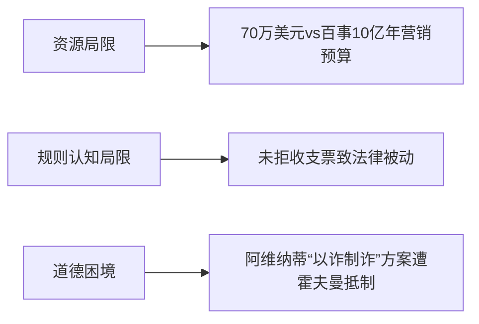

# 喝可乐可以送战斗机吗？【硬核狠人72】

> **UP主**: 小约翰可汗  
> **时长**: 35:52  
> **发布时间**: 2024-10-31 11:00:00  
> **链接**: https://www.bilibili.com/video/BV1mzStY9E3q
> **封面图**: http://i1.hdslb.com/bfs/archive/f195b54e75e5da05a03e271ffa01bb80648621b5.jpg

---

# 小约翰可汗《硬核狠人72：喝可乐可以送战斗机吗？》视频摘要报告

## 1. 视频概述
**核心主题**：本视频通过1995年百事可乐“积分兑战斗机”广告事件，深入剖析企业营销伦理、法律契约精神与个体抗争的博弈。以美国青年约翰·伦纳德试图用700万积分兑换AV-8B鹞式战斗机的真实案例为主线，揭示商业广告的法律边界、巨头企业的危机公关策略，以及普通人在系统性权力结构中的抗争逻辑。

**作者立场**：小约翰可汗采用“通辽宇宙”标志性叙事风格，以戏谑语言解构严肃议题：
- 批判百事可乐营销漏洞与危机处理中的霸权逻辑
- 褒扬伦纳德与霍夫曼“挑战不可能”的冒险精神
- 揭露法律体系对大企业的倾斜性保护
- 最终升华至“过程重于结果”的人文价值观

**叙事结构**：
时间轴叙事（1995-2022） + 主题嵌套
├─ 荒诞开局：广告漏洞引发蝴蝶效应
├─ 双线推进：伦纳德筹谋 vs 百事内部应对
├─ 三重博弈：法律诉讼/舆论攻防/道德审判
└─ 哲学收尾：登山隐喻解构功利主义

## 2. 核心论点与关键概念

### 2.1 核心论点
**论点1：广告内容构成法律要约的关键条件**  
- **核心逻辑**：当广告明确标注兑换条件（700万积分）、具体奖品（AV-8B战斗机）且无免责声明时，构成《统一商法典》规定的“明确、具体、可执行”要约
- **法律悖论**：法官以“理性人不会信”驳回诉求，却忽视百事曾真实出售潜艇（1954年）和坦克（1961年）的历史

**论点2：企业危机公关的“权力不对称”策略**  
- **系统性操作**：
  - 法律层面：选择主场法院（纽约）、组建豪华律师团
  - 舆论层面：污名化伦纳德（类比麦当劳咖啡案）、媒体封杀令
  - 行政资源：施压五角大楼修改战斗机持有解释
- **实质**：资本通过制度设计将个案转化为系统压制

**论点3：普通人抗争的“三重局限”**  

### 2.2 关键概念
**Pepsi Stuff**  
百事1995年推出的积分兑换计划，规则设计存在致命漏洞：
- 积分获取：1瓶=1分，12瓶=5分（诱导批量购买）
- 现金补分：10美分/分（直接规避可乐实体）

**鹞式战斗机法律困境**  
- 军转民技术矛盾：拆除武器系统仍保留垂直起降专利
- 美国武器贸易条例（ITAR）变相禁止民间持有

**通辽宇宙定律**  
UP主提出的叙事范式：  
**“不出意外必出意外”** → **“小人物撼大系统”** → **“过程即胜利”**

## 3. 详细内容梳理

### 3.1 事件导火索（1995.5-1996.3）
**广告制作事故链**：
1. 创意总监迈克尔·帕蒂借鉴商场促销手册（含$3200潜艇）
2. 剪辑误将7亿分改为700万分（删除两个零）
3. 未添加“最终解释权”免责声明（违反FTC广告准则）

**伦纳德行动路径**：
```mermaid
gantt
    title 伦纳德筹谋时间线
    dateFormat  YYYY-MM-DD
    section 发现漏洞
    录广告重审   ：1996-03-01, 3d
    成本核算     ：1996-03-05, 2d
    section 资源整合
    霍夫曼投资   ：1996-03-20, 1d
    支票寄出     ：1996-03-28, 1d

### 3.2 百事危机响应（1996.5-1996.7）
**内部决策矩阵**：
| 方案 | 支持者 | 风险 | 结果 |
|------|--------|------|------|
| 交付模型 | 达涅利 | 欺诈诉讼 | 否决 |
| 百万和解 | 帕蒂 | 示范效应 | 提出 |
| 司法先制 | 法务部 | 舆论反弹 | 执行 |

**关键操作**：
- 1996.5.7：寄出带两张可乐券的侮辱性回信
- 1996.6：在纽约联邦法院发起确认之诉（制造主场优势）
- 1996.7：谈判时设置“75万-100万”心理锚点

### 3.3 全面对抗阶段（1996.7-1999）
**法律战关键证据**：
- 百事方：美国广告联邦法规（CFR）第16章“夸张修辞豁免”
- 伦纳德方：百事菲律宾事件（1992年瓶盖数字错误致暴动）

**舆论战经典策略**：
- 百事：关联麦当劳咖啡案塑造“碰瓷”形象
- 阿维纳蒂：三阶段海报计划（因涉及敲诈被霍夫曼否决）

### 3.4 终局与余波（1999-2022）
**司法判决要点**：
- 法官金巴·伍德裁决：“理性消费者不会相信广告承诺”
- 但默示承认百事存在“重大疏忽”（未追偿诉讼费）

**历史涟漪效应**：
- 百事：营销部门重组，五年内禁用高价值奖品
- 阿维纳蒂：成为“反财阀律师”，2019年因敲诈耐克入狱
- 伦纳德：2010年创立户外装备公司，2022年与霍夫曼共登文森峰

## 4. 重要引用与案例

### 4.1 关键引述
- **广告原声**：  
  “Beat the bus? Harrier fighter jet, 7 million points.”  
  （法庭认定该表述具明确兑换指令性）

- **伦纳德法庭陈词**：  
  “我完成了契约要求，他们却说这是个玩笑——这才是真正的欺骗”

### 4.2 对照案例
**百事菲律宾事件（1992）**  
- 同质错误：瓶盖数字349误报（实际应为134）
- 灾难后果：  
  - 80万“中奖者”冲击百事工厂  
  - 5人死亡（燃烧瓶袭击）  
  - 百事最终赔付$20/人（原承诺$4万/人）

**麦当劳咖啡案（1994）**  
- 百事污名化类比对象  
- 实质差异：  
  | 维度 | 伦纳德案 | 麦当劳案 |  
  |---|---|---|  
  | 主观故意 | 主动履约 | 被动受害 |  
  | 损害证明 | 机会成本 | 三级烫伤 |  

## 5. 深度分析与思考

### 5.1 法律技术主义困境
**要约认定的双重标准**：
- 形式审查：严格要求消费者提供“完整履约证明”
- 实质认定：允许企业以“常识”否定契约有效性
- 折射问题：UCC第2-204条在资本倾斜下的解释权失衡

### 5.2 企业伦理光谱
**百事决策的马斯洛模型**：
```mermaid
graph TB
    生存需求-->危机压制
    安全需求-->司法先制
    尊重需求-->舆论操控
    自我实现需求-->行业地位维护
讽刺的是，最终因拒绝“自我实现”层面的道德担当，导致声誉实质受损。

### 5.3 争议焦点
**“合理人标准”是否过时？**  
- 数字时代悖论：  
  - 消费者：Z世代对“荒诞营销”接受度更高（例：NFT虚拟岛）  
  - 司法体系：仍沿用1980年代商业认知框架  

## 6. 结论与启示

### 6.1 核心结论
1. **法律层面**：广告契约效力取决于系统解释权，非文本本身  
2. **商业层面**：激进营销需匹配同等危机管理能力  
3. **人文层面**：个体抗争价值存于过程而非结果（登山隐喻）  

### 6.2 现实启示
**企业端**：  
- 营销活动应进行“极端履约测试”  
- 危机响应避免“霸权式公关”（参考后续可口可乐印度水危机处理）  

**消费者端**：  
- 保留广告原始载体（录像/印刷品）  
- 履约行动符合《合同法》第45条“实质性信赖”要件  

### 6.3 延伸思考
- **数字资产启示**：当前NFT项目“白皮书承诺”是否构成新世代“鹞式战斗机”？  
- **立法前瞻**：是否需要设立“营销夸张系数”分级管理制度？  

> 视频用荒诞外壳包裹严肃命题：当商业承诺遇见人性执念，制度的天平永远需要道德的砝码。伦纳德虽败，但其抗争迫使价值3000万的“玩笑”载入商法教材，恰如鹞式战机垂直起降的物理悖论——有些上升，本就源于对抗重力。
