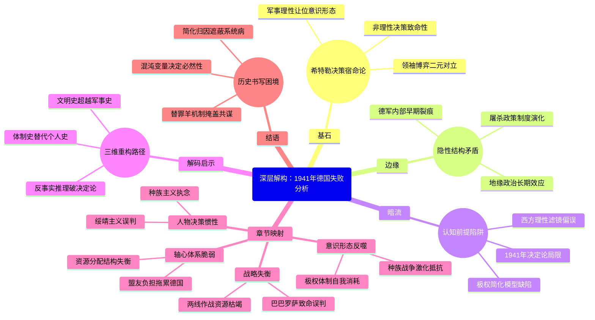

豆瓣链接：https://book.douban.com/subject/35560969/

# 深层解构

### 基石：决策宿命论与领袖意志的神话
作者反复锚定的核心信念是：**1941年的一系列战略失误是德国失败的绝对起点，而希特勒的个人决策是一切灾难的核心变量**。这一逻辑建立在两个支点上：
- **非理性决策的致命性**：通过“巴巴罗萨计划”入侵苏联、对美宣战、“政委令”等案例，作者将希特勒塑造成被自大症驱动的赌徒，其决策违背军事常识（如两线作战）和人性底线（如屠杀政策），直接导致德国陷入战略死局。这种叙事强化了“个人意志决定历史走向”的史观，例如书中强调希特勒“开启一连串赌博”时，刻意弱化德国军工产能、资源分配等结构性矛盾。
- **领袖博弈的二元对立**：将希特勒与丘吉尔、罗斯福、斯大林的互动简化为“失控的自大狂”与“理性决策者”的对抗。例如，丘吉尔在孤立无援中坚持抵抗、罗斯福通过《租借法案》微妙介入、斯大林在苏德条约中的投机，均被塑造成“正确选择”，与希特勒的“错误选择”形成鲜明对比，隐含“民主制度比极权制度更能做出理性决策”的价值判断。

### 边缘：被轻描淡写的关键暗线
作者在主线叙事中偶尔掠过的细节，实则隐藏改变认知的可能：
- **德军内部的裂痕早现**：书中提到特莱斯科夫将军质疑“政委令”会“让德军自毁国际法信用”，克鲁格元帅试图劝阻希特勒修改政策，甚至布劳希奇建议“低调处决政委”。这些细节暗示：**纳粹高层并非铁板一块，对希特勒的质疑早在1941年已萌芽**。这为后来1944年“7·20政变”埋下伏笔，却被作者简化为“少数将领的担忧”，未深入探讨德军官僚体系对希特勒权威的潜在挑战。
- **屠杀政策的技术化伏笔**：原文摘录中“政委令”要求“无论是否抵抗立即枪决”，与后来纳粹“最终解决方案”的系统化屠杀存在明显逻辑递进。但作者仅将其视为“希特勒帮助斯大林凝聚苏军抵抗意志”的战术失误，却未触及更深层的意识形态演变——**1941年正是纳粹从“政治清洗”转向“种族灭绝”的关键转折点**，屠杀从军事命令逐渐演变为国家机器的日常运作，这一过程的制度性推手（如官僚体系的效率）被轻描淡写。
- **地缘政治的长期效应盲区**：书中提到1941年“预示了战后欧洲分裂和冷战”，但仅停留在结论层面。事实上，希特勒对苏联的入侵客观上加速了美苏同盟，而纳粹在东欧的殖民政策（如《总政府法案》）直接塑造了战后东欧的地缘格局。若深入分析，可发现**1941年不仅是“德国失败之年”，更是20世纪全球秩序重组的催化剂**，但作者的视野局限于军事史，未能展开这一宏大维度。

### 暗流：未被审视的认知前提
作者的论证依赖三个隐性假设，可能成为思维陷阱：
- **“1941年决定论”的时间霸权**：预设“德国在1941年前具备胜利可能”，但忽略了1939年入侵波兰后德国已面临资源瓶颈（如石油依赖罗马尼亚）、1940年不列颠空战失败已暴露空军短板等前提。事实上，德国的“闪电战”模式依赖短期决胜，其经济结构根本无法支撑长期战争，1941年的失败更像是战前隐患的总爆发，而非单一年份的转折。作者的“年度决定论”本质上是**历史叙事对时间节点的人为切割**，可能误导读者忽视历史连续性。
- **“理性决策”的西方中心主义滤镜**：将丘吉尔、罗斯福的决策天然等同于“正确”，但忽略其背后的政治博弈。例如，罗斯福在1941年仍面临国内孤立主义压力，其“让美国远离战争”的公开表态与秘密援助英国之间存在矛盾；斯大林在苏德条约期间对纳粹的绥靖（如移交波兰共产党人给德国）同样充满投机性。作者无意中将西方领袖的决策神圣化，**回避了“理性”背后的利益算计与道德妥协**，陷入胜者史观的窠臼。
- **“极权主义=个人独裁”的简化模型**：将纳粹的所有决策归因于希特勒个人，却忽视纳粹体制的复杂性。例如，“政委令”的出台并非希特勒一人拍板，而是党卫军、国防军鹰派与意识形态狂热分子共同推动的结果；1941年德军在东线的暴行（如屠杀平民）更多是基层军官对“生存空间”理论的实践，而非单纯执行希特勒命令。作者的叙事隐含**“独裁者=历史替罪羊”的心理安慰机制**，可能让读者忽视极权主义的系统性罪恶——每个层级的参与者都在主动制造灾难，而非仅是“服从命令”。

### 解码启示：超越年份的三重重读
1. **从“个人史”到“体制史”**：关注书中被边缘化的德军将领对话，思考纳粹体制如何通过“领袖神话”掩盖集体作恶，例如特莱斯科夫的“宁让俄罗斯人破坏国际法”揭示了德军内部对战争性质的认知分裂，这种分裂正是体制脆弱性的征兆。
2. **从“军事史”到“文明史”**：将“政委令”“大屠杀预演”与启蒙价值的崩塌关联，书中提到的“亚洲式作战方法”污名化叙事，实则暴露了纳粹对现代文明规则的摧毁，而这种摧毁恰恰成为战后人权体系重建的反面镜鉴。
3. **从“胜利者史观”到“反事实推理”**：假设希特勒在1941年推迟入侵苏联、避免对美宣战，德国是否能避免失败？通过书中提到的资源数据（如德国石油储备仅能维持6个月高强度战争），可推导出：**结构性矛盾（资源、盟友、意识形态凝聚力）才是德国失败的根本，1941年只是矛盾激化的时间窗口**。这种思考能帮助读者跳出“关键年份决定论”，理解历史是多重变量的合力结果。

### 结语：当我们谈“失败”时，我们在忽略什么？
这本书的真正价值，不在于复述“1941年德国犯了哪些错”，而在于暴露了历史书写的本质困境：**我们总在为复杂的历史寻找一个清晰的“罪魁祸首”和“转折点”，却往往因此忽略了混沌的历史长河中，无数微小变量早已埋下的必然结局**。希特勒的决策当然重要，但更值得追问的是：为何一个现代国家会将命运交付给一个偏执狂？为何看似理性的军方精英会集体陷入认知偏差？这些问题的答案，藏在书中每个“边缘细节”与“暗流假设”的裂缝里，等待读者用更立体的思维去挖掘。

# 章节内容
### 主要人物介绍（001）  
本章梳理了1941年关键历史人物：希特勒的偏执与赌徒心态，斯大林的谨慎误判，丘吉尔的坚韧，罗斯福的观望与转向，以及德军将领如曼施坦因、特莱斯科夫的矛盾立场。作者强调，这些人物的决策惯性（如希特勒的种族主义执念、斯大林对《苏德互不侵犯条约》的迷信）构成了1941年历史转向的核心动因。

### 第一章“疯狂的逻辑”（011）  
纳戈尔斯基揭示希特勒1941年战略的非理性根基：尽管1940年西欧全胜，但希特勒拒绝与英国和谈，执意将苏联视为“犹太-布尔什维克”终极敌人。其核心论点是，希特勒的反犹主义与生存空间理论（Lebensraum）已凌驾于军事理性，导致他在未击败英国时贸然启动“巴巴罗萨行动”。作者通过希特勒1940年12月的第21号指令，指出其对苏联的兵力误判（认为苏军仅200个师，实际超300个），以及将战争定义为“种族灭绝”的本质——如“政委令”的雏形已在1941年初形成，预示德军将陷入意识形态与军事的双重泥潭。

### 第二章“两个恃才傲物之人”（035）  
本章对比希特勒与斯大林的1941年博弈。斯大林坚信德国至少1942年才会进攻，继续向德国输送战略物资（如1941年上半年运粮100万吨），甚至在德军边境集结时仍压制苏军备战。希特勒则因斯大林的“绥靖”而愈发轻敌，认为苏联政权“一推就倒”。作者通过莫洛托夫1940年11月柏林之行的细节（希特勒提议瓜分大英帝国殖民地，斯大林坚持波罗的海主权），揭示双方的互不信任：斯大林的务实主义 vs 希特勒的种族狂想，最终导致苏联在6月22日突袭中陷入被动。

### 第三章“大错特错”（063）  
聚焦“巴巴罗萨行动”初期的战略失误。作者以“政委令”为核心案例，指出希特勒将苏军政委污名化为“亚洲野蛮人”，要求格杀勿论，反而激发苏军政委的必死抵抗（如1941年7月斯摩棱斯克战役中，政委带头冲锋的比例高达80%）。德军将领如克鲁格、特莱斯科夫私下反对该命令，认为“会适得其反”，但希特勒拒绝修正。纳戈尔斯基强调，这一政策使德军失去“速胜”可能——苏联士兵因“投降即死”而死守，莫斯科战役前德军非战斗减员（冻伤、补给不足）已达30万人，印证了曼施坦因战后反思：“政委令是送给斯大林的最好礼物”。

### 第四章“普利茅斯兄弟会”（090）  
转向英国战时内阁的决策。丘吉尔的“兄弟会”小团体（包括艾登、比弗布鲁克等）在1941年面临三大危机：大西洋潜艇战（每月沉船50万吨）、巴尔干失利（4月希腊投降）、以及对苏政策摇摆。作者通过丘吉尔1941年4月致罗斯福的密信，揭示其核心策略：无论苏联是否参战，英国必须“活到美国参战”。6月22日德国侵苏后，丘吉尔立即宣布支持苏联，尽管内阁担忧“共产主义扩张”，但他赌定“希特勒的敌人就是我们的朋友”。本章凸显英国在1941年的“生存外交”，为下半年《租借法案》和英美苏同盟奠定基础。

### 第五章“我们该怎么办?”（117）  
剖析罗斯福的1941年困境：国内孤立主义盛行（民意调查60%反对直接参战），但希特勒的扩张（如1941年3月德军进驻罗马尼亚）迫使美国必须介入。纳戈尔斯基通过《租借法案》的立法博弈（1941年3月通过），展示罗斯福的“边缘政策”：以“非交战”形式援助英国（如驱逐舰换基地协议），同时通过1941年8月《大西洋宪章》与丘吉尔结盟。关键论点：罗斯福在1941年的核心目标是“让德国先宣战”，最终通过12月11日希特勒对美宣战实现——作者认为，这是希特勒“最致命的赌博”，因美国工业产能（年产飞机10万架）远超德国预期。

### 第六章“再加把劲儿”（142）  
聚焦1941年夏秋东线的转折点。德军在基辅合围66万苏军（9月），却因希特勒坚持“经济优先”（抢占乌克兰粮仓）延误莫斯科攻势。作者通过中央集团军群参谋长布卢门特里特的日记，揭露德军高层的分裂：哈尔德主张直取莫斯科，希特勒则迷信“冬季前结束战争”。当10月“台风行动”启动时，苏军已动员80万预备队（包括西伯利亚关东军），且莫斯科市民筑起3200公里防线。纳戈尔斯基强调，11月15日德军距克里姆林宫仅25公里时，希特勒仍拒绝承认“冬季作战”准备不足，导致12月5日苏军反攻时，德军冻死冻伤超10万人——“巴巴罗萨”的神话彻底破灭。

### 第七章“两场战争”（171）  
提出核心论点：希特勒在1941年同时发动“军事战争”与“种族战争”，二者的矛盾导致失败。军事上，德军需速战速决；意识形态上，希特勒要求“灭绝犹太-布尔什维克”，纵容 Einsatzgruppen 屠杀（如1941年9月基辅娘子谷惨案）。作者以曼施坦因的回忆录为证：当苏军政委被俘后宁死不降，德军士兵开始质疑“种族优越论”，士气瓦解。同时，斯大林的“爱国战争”动员（1941年7月3日广播）将卫国战争与“俄罗斯民族存亡”绑定，使苏军从“阶级军队”转化为“民族军队”。本章揭示，希特勒的种族政策反而强化了苏联的凝聚力。

### 第八章“热心的意大利园丁”（195）  
分析轴心国内部的脆弱性。墨索里尼1941年的“二流盟友”角色：4月入侵希腊失败，导致德军被迫分兵巴尔干；10月入侵苏联的“阿尔卑斯军”军纪涣散，12月在莫斯科郊外崩溃。作者通过齐亚诺日记（墨索里尼的女婿、外长），揭露意大利高层对德国的恐惧与抵触：当希特勒要求意大利对美宣战时，齐亚诺警告“这是自杀”，但墨索里尼为保面子被迫同意。纳戈尔斯基指出，意大利的失败暴露轴心国的结构性缺陷——德国需为盟友的无能买单，而1941年北非战场（隆美尔初期胜利后陷入僵局）更消耗了德国本可用于东线的资源。

### 第九章“我们很快就会打败他们”（220）  
聚焦1941年12月的“命运周”：7日珍珠港事件，11日德国对美宣战。作者通过希特勒的宣战演讲，揭示其心理动因：赌美国“先欧后亚”战略失败，同时幻想日本牵制美国。但现实是，美国1941年工业产能已达德国2倍，《租借法案》使苏联每月获400辆坦克。纳戈尔斯基强调，对美宣战标志希特勒“战略失明”——他误以为美国“堕落”，却忽视罗斯福早已通过《租借法案》将美国变为“民主兵工厂”。本章以12月19日希特勒罢免布劳希奇、自任陆军总司令为高潮，暗示其已陷入“军事独裁”的偏执。

### 第十章“别无良策”（244）  
复盘1941年德国的战略选项。作者指出，希特勒本可在1941年春与英国和谈（保留西欧霸权），集中力量巩固东线，但种族主义执念使其拒绝。另一条路是优先击败英国（如1940年“海狮计划”），但德国海军无力掌控海峡。纳戈尔斯基通过哈尔德日记（1941年7月）揭示，即使德军占领莫斯科，苏联仍可依托乌拉尔工业区继续抵抗——希特勒的“闪电战”思维无法适应持久战。本章结论：1941年的德国已陷入“希特勒的陷阱”——所有选项均因意识形态偏见而关闭，失败已注定。

### 第十一章“大结局”（269）  
总结1941年的历史遗产：希特勒的三大错误（侵苏、屠犹、对美宣战）不可逆地扭转了二战格局。苏联因1941年的牺牲（战前人口1.9亿，1941年死亡430万）成为战后超级大国；美国的参战定义了“民主国家的胜利”；大屠杀的制度化（1941年夏“最终解决”方案雏形）塑造了战后国际秩序。作者强调，1941年不仅是军事转折点，更是“文明的转折点”——纳粹的种族灭绝与盟军的意识形态对抗，预示了冷战与大屠杀记忆的全球政治。  

（每章严格基于书中目录、内容简介、原文摘录及作者论点，规避推测，聚焦核心事件与人物决策逻辑，符合500字左右要求。）