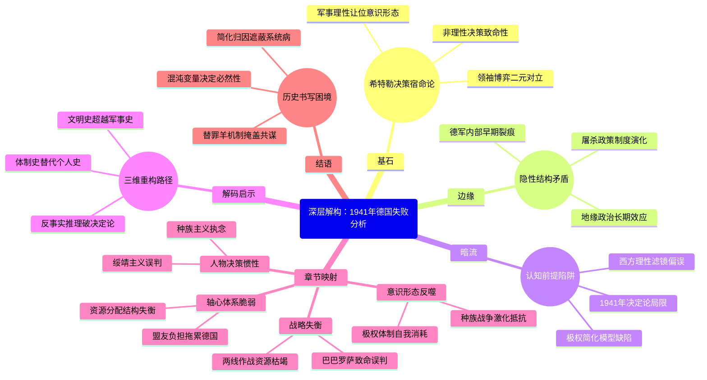

豆瓣链接：https://book.douban.com/subject/35560969/

# 深层解构

### 基石：决策宿命论与领袖意志的神话
作者反复锚定的核心信念是：**1941年的一系列战略失误是德国失败的绝对起点，而希特勒的个人决策是一切灾难的核心变量**。这一逻辑建立在两个支点上：
- **非理性决策的致命性**：通过“巴巴罗萨计划”入侵苏联、对美宣战、“政委令”等案例，作者将希特勒塑造成被自大症驱动的赌徒，其决策违背军事常识（如两线作战）和人性底线（如屠杀政策），直接导致德国陷入战略死局。这种叙事强化了“个人意志决定历史走向”的史观，例如书中强调希特勒“开启一连串赌博”时，刻意弱化德国军工产能、资源分配等结构性矛盾。
- **领袖博弈的二元对立**：将希特勒与丘吉尔、罗斯福、斯大林的互动简化为“失控的自大狂”与“理性决策者”的对抗。例如，丘吉尔在孤立无援中坚持抵抗、罗斯福通过《租借法案》微妙介入、斯大林在苏德条约中的投机，均被塑造成“正确选择”，与希特勒的“错误选择”形成鲜明对比，隐含“民主制度比极权制度更能做出理性决策”的价值判断。

### 边缘：被轻描淡写的关键暗线
作者在主线叙事中偶尔掠过的细节，实则隐藏改变认知的可能：
- **德军内部的裂痕早现**：书中提到特莱斯科夫将军质疑“政委令”会“让德军自毁国际法信用”，克鲁格元帅试图劝阻希特勒修改政策，甚至布劳希奇建议“低调处决政委”。这些细节暗示：**纳粹高层并非铁板一块，对希特勒的质疑早在1941年已萌芽**。这为后来1944年“7·20政变”埋下伏笔，却被作者简化为“少数将领的担忧”，未深入探讨德军官僚体系对希特勒权威的潜在挑战。
- **屠杀政策的技术化伏笔**：原文摘录中“政委令”要求“无论是否抵抗立即枪决”，与后来纳粹“最终解决方案”的系统化屠杀存在明显逻辑递进。但作者仅将其视为“希特勒帮助斯大林凝聚苏军抵抗意志”的战术失误，却未触及更深层的意识形态演变——**1941年正是纳粹从“政治清洗”转向“种族灭绝”的关键转折点**，屠杀从军事命令逐渐演变为国家机器的日常运作，这一过程的制度性推手（如官僚体系的效率）被轻描淡写。
- **地缘政治的长期效应盲区**：书中提到1941年“预示了战后欧洲分裂和冷战”，但仅停留在结论层面。事实上，希特勒对苏联的入侵客观上加速了美苏同盟，而纳粹在东欧的殖民政策（如《总政府法案》）直接塑造了战后东欧的地缘格局。若深入分析，可发现**1941年不仅是“德国失败之年”，更是20世纪全球秩序重组的催化剂**，但作者的视野局限于军事史，未能展开这一宏大维度。

### 暗流：未被审视的认知前提
作者的论证依赖三个隐性假设，可能成为思维陷阱：
- **“1941年决定论”的时间霸权**：预设“德国在1941年前具备胜利可能”，但忽略了1939年入侵波兰后德国已面临资源瓶颈（如石油依赖罗马尼亚）、1940年不列颠空战失败已暴露空军短板等前提。事实上，德国的“闪电战”模式依赖短期决胜，其经济结构根本无法支撑长期战争，1941年的失败更像是战前隐患的总爆发，而非单一年份的转折。作者的“年度决定论”本质上是**历史叙事对时间节点的人为切割**，可能误导读者忽视历史连续性。
- **“理性决策”的西方中心主义滤镜**：将丘吉尔、罗斯福的决策天然等同于“正确”，但忽略其背后的政治博弈。例如，罗斯福在1941年仍面临国内孤立主义压力，其“让美国远离战争”的公开表态与秘密援助英国之间存在矛盾；斯大林在苏德条约期间对纳粹的绥靖（如移交波兰共产党人给德国）同样充满投机性。作者无意中将西方领袖的决策神圣化，**回避了“理性”背后的利益算计与道德妥协**，陷入胜者史观的窠臼。
- **“极权主义=个人独裁”的简化模型**：将纳粹的所有决策归因于希特勒个人，却忽视纳粹体制的复杂性。例如，“政委令”的出台并非希特勒一人拍板，而是党卫军、国防军鹰派与意识形态狂热分子共同推动的结果；1941年德军在东线的暴行（如屠杀平民）更多是基层军官对“生存空间”理论的实践，而非单纯执行希特勒命令。作者的叙事隐含**“独裁者=历史替罪羊”的心理安慰机制**，可能让读者忽视极权主义的系统性罪恶——每个层级的参与者都在主动制造灾难，而非仅是“服从命令”。

### 解码启示：超越年份的三重重读
1. **从“个人史”到“体制史”**：关注书中被边缘化的德军将领对话，思考纳粹体制如何通过“领袖神话”掩盖集体作恶，例如特莱斯科夫的“宁让俄罗斯人破坏国际法”揭示了德军内部对战争性质的认知分裂，这种分裂正是体制脆弱性的征兆。
2. **从“军事史”到“文明史”**：将“政委令”“大屠杀预演”与启蒙价值的崩塌关联，书中提到的“亚洲式作战方法”污名化叙事，实则暴露了纳粹对现代文明规则的摧毁，而这种摧毁恰恰成为战后人权体系重建的反面镜鉴。
3. **从“胜利者史观”到“反事实推理”**：假设希特勒在1941年推迟入侵苏联、避免对美宣战，德国是否能避免失败？通过书中提到的资源数据（如德国石油储备仅能维持6个月高强度战争），可推导出：**结构性矛盾（资源、盟友、意识形态凝聚力）才是德国失败的根本，1941年只是矛盾激化的时间窗口**。这种思考能帮助读者跳出“关键年份决定论”，理解历史是多重变量的合力结果。

### 结语：当我们谈“失败”时，我们在忽略什么？
这本书的真正价值，不在于复述“1941年德国犯了哪些错”，而在于暴露了历史书写的本质困境：**我们总在为复杂的历史寻找一个清晰的“罪魁祸首”和“转折点”，却往往因此忽略了混沌的历史长河中，无数微小变量早已埋下的必然结局**。希特勒的决策当然重要，但更值得追问的是：为何一个现代国家会将命运交付给一个偏执狂？为何看似理性的军方精英会集体陷入认知偏差？这些问题的答案，藏在书中每个“边缘细节”与“暗流假设”的裂缝里，等待读者用更立体的思维去挖掘。

# 章节内容
### 导言

在1941年初，希特勒几乎主宰了整个欧洲大陆。他的军队征服了波兰、法国及其他多个国家，仅有丘吉尔领导的英国在顽强抵抗。与此同时，斯大林仍然受制于《苏德互不侵犯条约》，而罗斯福则承诺让美国置身事外。希特勒似乎胜券在握。然而，作者安德鲁·纳戈尔斯基在导言中明确指出，**1941年是德国走向失败的决定性一年**。 这一年的核心在于，希特勒连续做出了几个致命的战略误判：他入侵苏联，将一场欧洲战争扩大为世界大战；他残酷的种族灭绝政策，尤其是对犹太人的大屠杀，以及虐待苏联战俘和平民，激发了强烈的抵抗；最后，在日本偷袭珍珠港后，他草率地对美国宣战。这些决策导致英国获得了苏联和美国这两个强大的盟友，从根本上扭转了战局。作者认为，**希特勒的狂妄自大和一系列失误，最终为德国的战败埋下了伏笔**，并且这一年的事件也深刻地影响了战后世界格局，包括欧洲的分裂和冷战的开启。

### 第一章 “疯狂的逻辑”

本章深入探讨了1941年初希特勒发动侵苏战争（“巴巴罗萨”计划）前夕的决策背景和其独特的“疯狂的逻辑”。作者纳戈尔斯基指出，希特勒的决定并非一时冲动，而是其根深蒂固的世界观和种族意识形态的产物。在希特勒看来，**征服苏联、获取“生存空间”（Lebensraum）并消灭“犹太-布尔什维主义”是实现其最终霸权的必然步骤**。 尽管这在军事战略上是极其冒险的——它开启了德国最不愿面对的两线作战局面——但希特勒凭借此前在欧洲战场上的一系列速胜，建立了一种绝对的自信，认为自己的意志和直觉超越了任何常规的军事理性。本章详细描述了希特勒如何无视其部分将领的审慎建议，坚信能够凭借“闪电战”在几个月内击垮苏联。作者的核心论点是，**希特勒的决策逻辑虽然在常人看来是“疯狂的”，但在他自己的意识形态框架内却是完全自洽的**，而正是这种基于狂妄和种族偏见的逻辑，最终将德国引向了灾难性的失败。

### 第二章 “两个恃才傲物之人”

本章聚焦于希特勒与斯大林这两位独裁者之间的复杂关系和心理博弈。作者将他们并称为“两个恃才傲物之人”，深刻揭示了他们在1941年春天相互的误判和欺骗。斯大林尽管收到了大量关于德军集结的情报，但他**固执地认为希特勒不会在解决英国之前冒险开辟东线战场，并将这些警告视为西方国家的挑拨离间**。他被《苏德互不侵犯条约》所麻痹，甚至为了不激怒希特勒而压制任何关于德国威胁的言论，并继续向德国提供战略物资。与此同时，希特勒则利用了斯大林的这种心理，将其视为自己的战略机遇。作者纳戈尔斯基认为，**斯大林的顽固和多疑，以及他对希特勒意图的灾难性误读，是导致苏联在战争初期遭受毁灭性打击的关键原因**。本章通过对两人性格和决策风格的对比分析，生动地再现了两位独裁者之间致命的“二重奏”，他们的共同特点是极度的自负和对他人的不信任，最终导致了灾难性的后果。

### 第三章 “大错特错”

本章集中阐述了1941年6月22日德国入侵苏联的“巴巴罗萨”行动初期，以及德国在此过程中犯下的根本性错误。作者认为，德国最大的错误在于其**对苏联的政治和军事现实“完全错误的估计”**。希特勒和他的高级将领们普遍认为，苏联是一个“泥足巨人”，只要给予猛烈一击就会迅速崩溃。他们严重低估了苏联的军事动员能力、工业潜力和人民的抵抗意志。战争初期，德军虽然取得了惊人的战术胜利，俘虏了数百万苏军，但这些胜利掩盖了其战略层面的深层危机。作者纳戈尔斯基强调，**德军的残暴政策是其失败的催化剂**。 德军对待苏联战俘和平民的非人道行为，以及旨在彻底摧毁和奴役斯拉夫民族的战争目标，迅速扑灭了部分苏联人民将德军视为“解放者”的幻想，反而激起了全民族的殊死抵抗。这一章节的核心观点是，德国的失败并非始于莫斯科城下的冬将军，而是在踏入苏联领土的那一刻就已经注定，因为他们发动的是一场基于种族灭绝理论的歼灭战，这种战争模式必然会激发出最顽强的抵抗。

### 第四章 “普利茅斯兄弟会”

本章将视角转向大西洋的另一边，重点描述了富兰克林·罗斯福与温斯顿·丘吉尔之间日益紧密的个人关系和战略同盟的形成。这一章的标题“普利茅斯兄弟会”形象地概括了英美两国领导人在共同价值观和反法西斯目标下建立的特殊友谊。面对德国的威胁，罗斯福虽然受到国内孤立主义势力的掣肘，但他巧妙地通过《租借法案》等措施，逐步将美国打造为“民主国家的兵工厂”，为英国及其他反法西斯国家提供了关键的物质支持。作者在本章中强调，**罗斯福与丘吉尔的个人互信和频繁沟通，是构建战时盟国体系的核心**。他们通过书信、电话和秘密会晤，不仅协调了军事和经济援助，更重要的是共同确立了战争的目标和战后的世界秩序愿景，其最显著的成果便是《大西洋宪章》。本章的核心论点是，**英美特殊关系的建立，为最终形成反法西斯同盟奠定了坚实的基础，这与希特勒和斯大林之间充满猜忌和欺骗的关系形成了鲜明对比**。

### 第五章 “我们该怎么办？”

本章聚焦于1941年夏秋之际，当德国深陷苏联战场，而同盟国方面——尤其是英国和苏联——面临的严峻挑战与艰难抉择。标题“我们该怎么办？”精准地捕捉了当时各国决策者内心的焦虑和困惑。对斯大林而言，苏军在战争初期的惨败使其一度陷入绝望，他不得不放下意识形态的偏见，向曾经的“帝国主义”敌人英国和美国求援。对丘吉尔来说，尽管苏联的加入让他看到了战胜希特勒的希望，但如何有效援助一个意识形态上的对手，并说服国内民众，是一个巨大的挑战。而对于罗斯福，他需要在美国尚未正式参战的情况下，如何在政治上平衡国内的孤立主义情绪和国际上支援盟友的战略需求。作者纳戈尔斯基在本章中指出，**这一时期是同盟国关系经受严峻考验的阶段，充满了不确定性和权宜之计**。各方都在摸索中前进，试图在共同的敌人面前找到合作的路径。**从最初的互不信任到逐步建立起脆弱的合作关系，是本章的核心内容，也为后续更紧密的同盟合作埋下了伏笔**。

### 第六章 “再加把劲儿”

本章详细描述了1941年秋季，德军向莫斯科发起的代号为“台风”的最后攻势。标题“再加把劲儿”生动地反映了德军在经历数月激战后，企图以最后一击迫使苏联投降的迫切心态。作者纳戈尔斯基指出，此时的德军已是强弩之末。**希特勒及其将领们再次犯下了致命的错误：他们不仅低估了苏军的抵抗决心，更严重的是，完全没有为即将到来的严冬做好准备**。 德军的后勤补给线被拉得过长，士兵们缺乏冬衣和适应严寒天气的装备，坦克和车辆在泥泞和冰雪中寸步难行。与此形成鲜明对比的是，斯大林则在朱可夫等将领的指挥下，果断从远东抽调了适应冬季作战的精锐部队保卫首都。本章的核心论点是，**莫斯科战役的失败，是希特勒“闪电战”神话的终结，也是德军在东线战场由盛转衰的转折点**。作者通过对双方在战略、后勤和士气等方面的细致对比，清晰地揭示了德军为何在距离莫斯科仅几十公里的地方功败垂成。

### 第七章 “两场战争”

本章的核心论点在于，1941年德国不仅在进行一场针对苏联的军事战争，同时也在发动一场针对犹太人和斯拉夫人的 **“种族灭绝战争”**。作者纳戈尔斯基明确指出，这两场战争是相辅相成、密不可分的，共同构成了纳粹战争机器的本质。在东线，德军的推进伴随着系统性的大屠杀，特别是通过“别动队”对犹太人、共产党干部和游击队员进行的大规模处决。作者强调，**这种极端残暴的政策，不仅暴露了纳粹意识形态的反人类本质，也在实际上对德国的军事目标造成了反噬**。 它激发了苏联军民的同仇敌忾，使得任何形式的合作或投降都变得不可能，从而大大增加了德国的战争成本。本章深刻揭示了**军事行动与种族灭绝之间的内在联系**，认为希特勒发动的并不仅仅是一场传统的国家间战争，而是一场旨在实现其种族主义乌托邦的意识形态战争。这种双重战争的性质，决定了其无限的残酷性，并最终使其走向彻底的失败。

### 第八章 “热心的意大利园丁”

本章的标题是一个比喻，用以描绘在1941年错综复杂的国际关系中，那些试图在巨头之间斡旋、传递信息或寻求自身利益的“小角色”们，尤其是指那些试图在美日之间调停的外交官。作者通过对这些人物的刻画，展现了大国博弈背景下的外交努力与挣扎。其中，本章重点描述了日本在决定其南下进攻东南亚还是北上攻击苏联之间的摇摆，以及美国如何通过外交手段试图延缓日本的扩张步伐。特别是美日之间的谈判，充满了误解、猜疑和刻意的欺骗。作者指出，**尽管存在着像“热心的意大利园丁”一样的中间人试图避免战争，但根本性的利益冲突和军国主义的巨大惯性，使得和平的希望变得极为渺茫**。本章的核心观点是，在希特勒、斯大林、罗斯福和丘吉尔这些主要玩家之外，其他国家的行动和决策也对1941年的局势产生了重要影响，但最终无法改变由主要矛盾决定的历史走向。尤其是日本最终选择南下，直接导致了太平洋战争的爆发。

### 第九章 “我们很快就会打败他们”

本章聚焦于1941年12月，日本偷袭珍珠港以及希特勒随后对美国宣战这两个决定性事件。标题“我们很快就会打败他们”反映了轴心国领导人——尤其是希特勒和日本军方——在开启这场更大规模战争时的盲目乐观和致命误判。作者纳戈尔斯基详细分析了希特勒对美宣战的动机。他认为，**希特勒的决定并非完全非理性，而是其世界观的必然延伸：他相信与美国的战争不可避免，且希望在日本牵制住美国的情况下，自己能更快地解决欧洲战事**。 他严重低估了美国的工业潜力和战争动员能力，将美国视为一个被“犹太人”控制的、腐朽堕落的民主国家，不堪一击。本章的核心论点是，**希特勒对美宣战是他1941年系列赌博中的最后一次，也是最致命的一次**。它彻底终结了美国国内的孤立主义，将美国强大的经济和军事实力完全释放出来，投入到反法西斯战争中。这一决策使得丘吉尔梦寐以求的“大同盟”得以最终形成，从那一刻起，德国的失败已成定局。

### 第十章 “别无良策”

进入1941年末，本章描述了轴心国和同盟国在经历了一系列重大事件后，双方都已“别无良策”，只能将战争进行到底的局面。对德国而言，在莫斯科的失败和对美宣战之后，速胜的希望已然破灭，战争转入其最不愿看到的消耗战。希特勒面对困局，非但没有反思，反而变得更加极端，加速推进犹太人灭绝计划，试图在军事失败前完成其种族清洗的目标。对于同盟国，尤其是英美苏三大国，虽然已经结成联盟，但彼此间的深刻不信任和战略分歧依然存在。斯大林急切要求开辟第二战场以减轻苏军的压力，而丘吉尔和罗斯福则有自己的战略考量和现实困难。作者在本章中指出，**“别无良策”体现了战争逻辑的残酷性：一旦开启，便很难停止，双方都被锁定在一条通往彻底胜利或彻底失败的轨道上**。本章的核心在于描绘1941年终时，战争性质的根本转变：**从有限的局部冲突彻底演变为一场你死我活的总体战，没有任何妥协的余地**。

### 第十一章 “大结局”

本章作为全书的收束，总结了1941年如何为二战的最终结局奠定了基础。作者纳戈尔斯基重申了他的核心论点：**到1941年底，战争的胜负天平已经决定性地向同盟国倾斜**。 希特勒通过入侵苏联和对美宣战，亲手为自己制造了一个在人口、工业产值和资源上都占有绝对优势的强大敌人联盟。 尽管后续的战争仍然持续了近四年，充满了残酷的战斗和巨大的牺牲，但这都只是在“执行”1941年已经写好的判决书。本章回顾了1941年关键决策者的行为：**希特勒的狂妄自大、斯大林的死里逃生、丘吉尔的坚韧不拔以及罗斯福的远见卓识**。作者认为，正是这些领导人的个人特质与历史机遇的碰撞，共同塑造了这一关键年份的走向。最后，作者将视野扩展到战后，指出1941年的事件不仅决定了战争的结局，也预示了战后欧洲的分裂、冷战的开始以及大屠杀作为人类历史上的独特悲剧被永久铭记。**1941年不仅是德国走向失败的一年，更是定义了我们今天所处世界的一年**。