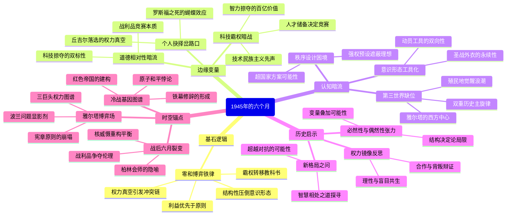

豆瓣链接：https://book.douban.com/subject/35232623/

# 深层解构

### 基石：权力结构的铁律——当旧秩序崩塌时，对抗是大国的宿命
 
 作者反复叩击的核心支点，是**地缘政治的"零和博弈"逻辑**。他以希特勒临终前的预言（"美苏必因力量抗衡走向冲突"）为楔子，贯穿雅尔塔会议上三巨头对势力范围的争夺、柏林战役后的科技掠夺、原子弹爆炸后的战略威慑等关键事件，构建起"权力真空→利益碰撞→联盟破裂"的叙事链条。
 
 这里藏着作者的根本信念：**在缺乏超国家权威的国际体系中，当旧霸权（英国）衰落、新霸权（美国）与崛起国（苏联）相遇时，结构性矛盾必然压倒意识形态共识**。书中用丘吉尔对《大西洋宪章》的双重标准（允许西方划分势力范围，却反对苏联在东欧的扩张）、美苏对德国科学家的争夺（"曲别针行动"与"战利品旅"）等细节，反复印证"利益优先于原则"的现实主义逻辑。
 
 这种基石性判断，让全书成为一部**20世纪中叶的权力转移教科书**，揭示冷战并非偶然的误判，而是现代国际体系先天缺陷的必然产物。
 
### 边缘：被轻拭的微光——偶然、道德与科技的蝴蝶翅膀
 
 1. **个人命运的历史权重**  
 作者用简练笔触提到罗斯福的离世（1945年4月12日）和丘吉尔的落选（1945年7月26日），却未深入探讨这两个偶然事件如何改变历史走向。试想：若罗斯福未在波茨坦会议前去世，美国对苏政策是否会更温和？若丘吉尔连任，英国在冷战初期的角色是否会更强势？这些"历史岔路口"的存在，暗示**结构性力量之外，个体抉择仍可能在关键时刻扭转齿轮**。
 
 2. **道德相对主义的阴影**  
 书中记录朱可夫对西方掠夺德国科技的控诉（"你们拆走实验室，我们拆走纺织机"），以及美国官员波利的辩解（"我们只要战时技术"）。作者虽未直接评判，但字里行间透出**大国行为的道德等价性**：所谓"正义盟军"与"红色帝国"，在争夺战利品时并无本质区别。这种边缘性观察，实则挑战了"冷战是善恶对抗"的传统叙事，暗示其本质是**强权对资源的瓜分竞赛**。
 
 3. **科技霸权的隐形战争**  
 对"曲别针行动"的轻描淡写（"未记录在案的智力赔偿价值100亿美元"），实则隐藏着**战后科技竞赛的最初硝烟**。当美苏把数千德国科学家纳入麾下时，他们不仅抢到了火箭图纸，更奠定了冷战军备竞赛的人才基础。这提示我们：**现代大国竞争的核心战场，早已从领土转向科技制高点**，而1945年的这场"智力掠夺"，正是全球化时代技术民族主义的预演。
 
### 暗流：未被审视的前提——被简化的意识形态与被忽略的第三世界
 
 1. **意识形态的工具化假设**  
 作者默认"美苏对抗主要是权力之争"，却低估了意识形态作为**战略动员工具**的独立价值。事实上，斯大林将东欧纳入势力范围，既为地缘安全，也为输出共产主义意识形态；杜鲁门推行马歇尔计划，既为遏制苏联，也为建立资本主义经济秩序。意识形态不仅是遮羞布，更是凝聚国内共识、争取国际盟友的武器。这种忽略，导致书中对冷战长期化的解释略显单薄——**当权力争夺披上意识形态圣战的外衣，对抗便获得了自我永续的动能**。
 
 2. **非西方世界的缺位**  
 全书聚焦欧美苏"三巨头"，但1945年的亚洲（中国抗战即将胜利、印度独立运动兴起）、非洲（民族解放运动萌芽）同样在孕育新秩序。作者未意识到，**大国在雅尔塔划定的"欧洲分裂线"，与殖民地半殖民地的觉醒浪潮，共同构成了20世纪后半叶的双重主旋律**。这种"西方中心主义"的叙事框架，遮蔽了冷战之外的另一股历史洪流——第三世界对旧霸权体系的持续冲击。
 
 3. **和平秩序的设计困境**  
 书中隐含一个前提：大国主导的战后秩序是唯一可能的选择。但1945年的世界并非没有其他选项：比如对德国的非军事化能否更彻底？联合国能否拥有超越主权国家的强制力？作者未探讨这些可能性，实则默认了**"强权即秩序"的现实主义预设**，却忽略了理想主义方案曾闪现的微光。这种暗流中的保守主义，让我们错失了对"另一种战后世界"的想象空间。
 
### 解码者的启示：当我们重读1945
 
 这本书真正在说：**任何看似偶然的历史转折，背后都有权力结构的必然逻辑在推动**，但这并不意味着个人选择、道德伦理或边缘力量失去意义。
 
 若换个角度看：假如我们把丘吉尔的愤怒、罗斯福的理想主义残章、广岛幸存者的眼泪都视为历史的变量，或许会发现——**冷战不是注定的结局，而是无数选择层层叠加的结果**。
 
 作者可能没意识到：他笔下的"六个月裂变"，既是大国的角斗场，也是一面镜子——映照着人类在巨大权力面前的理性与盲目，合作与背叛。而我们今天重读这段历史，或许不该只记住铁幕如何落下，更该思考：**当新的权力格局出现时，我们能否找到比对抗更智慧的相处之道？**

# 章节内容
### 上篇“尽我所能”
- **罗斯福·2月3日**：1945年2月3日，罗斯福抵达雅尔塔会议现场。此时希特勒大军溃败，盟军胜利在望，但战后世界秩序的构建迫在眉睫。罗斯福怀揣着对持久和平的期望，希望通过会议确立新的国际秩序框架，然而，各方利益诉求不同，注定会议不会一帆风顺。作者借此展现了罗斯福在复杂国际局势下，为实现美国及世界和平稳定所做的努力，凸显了美国在战后世界格局塑造中的重要地位与罗斯福面临的艰巨任务。
- **斯大林·2月4日**：2月4日斯大林出席雅尔塔会议。苏联在战争中付出巨大牺牲，斯大林期望在东欧地区建立缓冲地带，保障苏联安全。他在会议上坚持苏联对东欧的影响力，与其他巨头的利益诉求产生冲突。作者通过这一章节揭示了苏联的地缘政治考量，表明苏联不会在涉及自身核心安全利益的问题上轻易让步，这种强硬态度对战后欧洲格局的形成有着关键影响。
- **丘吉尔·2月5日**：2月5日丘吉尔参与雅尔塔会议。英国作为老牌帝国，在战争中实力受损，但丘吉尔仍试图维护大英帝国的殖民体系与在欧洲的传统地位。他在会议上与罗斯福、斯大林围绕诸多议题展开博弈，例如在波兰问题上，各方意见分歧明显。作者借此呈现了英国在二战后国际地位的变化，以及丘吉尔为维持英国影响力所进行的挣扎与努力。
- **波兰·2月6日**：雅尔塔会议上，波兰问题成为焦点。根据《大西洋宪章》，民族有选择政府形式的权利，但美英苏在波兰政府组建、边界划分等问题上矛盾重重。美英希望波兰建立亲西方政权，苏联则倾向于扶持亲苏势力，斯大林认为美英在波兰问题上的伪善，为自己在东欧划分势力范围找到了理由。作者借此强调了大国利益博弈对弱小国家命运的影响，凸显了国际关系中实力与利益至上的现实。
- **大规划·2月10日**：会议期间，各国围绕战后世界秩序展开大规划。美英苏在势力范围划分、德国处置、联合国组建等方面各有盘算。丘吉尔的爆发让斯大林开心，因为美英在践行《大西洋宪章》时存在伪善行为，这也为苏联在东欧划分势力范围增添了借口。作者认为，这种大国间的利益博弈与矛盾，为日后欧洲分裂埋下伏笔。
- **欢愉·2月13日**：在紧张的会议间隙，与会人员有一些社交活动，表面上呈现出欢愉氛围。但实际上，这种欢愉之下掩盖着各国之间的利益冲突和战略分歧。作者通过描写这些场景，展现出外交场合的复杂性，各方在轻松氛围下仍暗藏机锋，为各自国家利益不断试探与周旋。 

### 中篇“一道铁幕正在落下。”
- **维辛斯基同志·2月27日**：2月27日后，苏联与西方在诸多问题上的分歧愈发明显。维辛斯基在一些外交场合的表态，反映出苏联对西方的警惕与强硬态度。苏联在东欧的行动引起西方担忧，西方对苏联的扩张意图充满疑虑，双方矛盾逐渐加深。作者通过维辛斯基的视角，展现了苏联与西方关系的变化，预示着东西方阵营的裂痕正在扩大。
- **“看不透的面纱”·3月7日**：3月7日前后，国际形势愈发复杂，各国之间的意图如同“看不透的面纱”。美英苏之间的沟通变得困难，相互猜忌增加。在德国占领区划分、对德政策等问题上，各方行动背后的真实目的难以捉摸，局势逐渐朝着紧张的方向发展。作者借此强调了战后初期国际局势的不确定性，以及大国间缺乏信任所带来的潜在危机。
- **总统之死·4月12日**：4月12日罗斯福总统离世，这一事件对美国乃至世界局势产生重大影响。罗斯福在任内对国际事务有着重要影响力，他的去世使美国政策面临调整。新总统杜鲁门上台后面临诸多挑战，在处理与苏联关系等国际事务上，需要重新摸索方向。作者通过这一事件，展现了领导人变动对国际关系的冲击，凸显了历史发展中的不确定性因素。
- **新总统和人民委员·4月23日**：4月23日，杜鲁门与苏联人民委员在一些问题上进行交流，但双方在东欧、德国等问题上难以达成共识。杜鲁门对苏联态度相对强硬，苏联也坚守自身立场，双方矛盾进一步激化。作者认为，这一时期美苏联在国际事务中的对立态势逐渐清晰，为冷战的形成奠定了基础。
- **会师·4月25日**：4月25日，美苏军队在欧洲心脏地带会师，这原本是反法西斯战争胜利的标志，但背后却隐藏着矛盾。双方在会师后，对占领区的管理、势力范围的划分等问题存在分歧，这种分歧反映出美苏在欧洲的利益争夺，预示着合作关系开始出现裂痕。作者借此事件，展现了大国在胜利后的利益博弈，揭示了战争胜利背后的复杂国际关系。
- **胜利·5月8日**：5月8日德国投降，欧洲战场战争胜利结束。但在庆祝胜利的背后，美英苏之间的矛盾并未因战争结束而消除，反而在战后利益分配问题上更加凸显。各国都想在战后欧洲获得更多利益，这种利益冲突使得欧洲局势变得更加复杂，和平的表象下暗潮涌动。作者强调，战争胜利只是新的利益博弈的开始，而非矛盾的终结。
- **“拯救世界”·5月26日**：5月26日前后，各国虽声称要“拯救世界”，构建和平，但实际行动却朝着相反方向发展。美英苏在处理德国问题、划分势力范围等方面各执一词，无法形成统一的方案。作者认为，这种口头上的和平与实际行动的背离，反映出大国在战后的真实意图，即追求自身利益最大化，而非真正为了世界和平。
- **核武器牌·6月1日**：6月1日，美国在核武器方面的进展成为影响国际关系的重要因素。美国试图凭借核武器在与苏联的博弈中占据优势，核武器的出现改变了国际关系的力量对比，让美苏之间的对抗更加复杂和危险。作者借此展现了核武器在冷战初期的关键作用，以及它对世界和平带来的潜在威胁。
- **红色帝国·6月24日**：6月24日，西方对苏联的疑虑加深，“红色帝国”这一称呼反映出西方对苏联的恐惧与敌意。苏联在东欧的影响力不断扩大，西方担心苏联的共产主义意识形态扩张，双方在意识形态领域的对立加剧，这进一步推动了冷战的形成。作者通过这一章节，揭示了意识形态因素在美苏关系恶化过程中的重要作用。

### 下篇“没有和平的和平”
- **柏林·7月4日**：7月4日，柏林局势成为各方关注焦点。美英苏在柏林的占领与管理问题上矛盾尖锐，柏林处于美苏势力交汇点，其归属和管理直接关系到双方利益。各方在柏林的行动都旨在扩大自身影响力，这种竞争加剧了柏林的紧张局势，也成为冷战的前沿阵地。作者借此展现了冷战初期美苏在关键地区的直接对抗。
- **终点·7月16日**：7月16日，一些事件标志着战后初期局势发展到一个节点，但这并非真正的终点，而是新对抗的开始。美英苏之间的矛盾仍在持续发酵，在诸多问题上无法达成一致，欧洲分裂的趋势愈发明显，和平并未真正到来。作者强调，此时的国际局势看似有了阶段性结果，但实际上是冷战格局逐渐形成的重要阶段。
- **战利品·7月23日**：7月23日，各国在瓜分德国科技遗产等“战利品”问题上产生严重分歧。朱可夫指责美英的掠夺行为，美国则辩称自己的征收行为仅限于战时所需。事实上，美国通过“曲别针行动”诱拐大量德国科学家，这种行为与苏联的“战利品旅”掠夺行动类似。作者借此揭示了大国在战后对利益的追逐，以及这种行为对国际关系的破坏。
- **“终结”·7月26日**：7月26日相关事件看似是对一些问题的“终结”，但实际上只是各方暂时的妥协。美英苏在诸多核心问题上的矛盾依旧存在，战后世界秩序仍未真正稳定，随时可能因利益冲突再次引发危机。作者认为，这种表面的“终结”无法掩盖深层次的矛盾，为后续冷战的发展埋下隐患。
- **广岛·8月6日**：8月6日美国向广岛投放原子弹，这一事件不仅改变了对日战争局势，也对国际关系产生深远影响。美国使用原子弹展示了其军事力量，加剧了苏联的警惕，同时也引发了国际社会对核武器的关注与担忧。作者借此展现了核武器对国际关系的巨大冲击，以及它在冷战背景下的战略意义。
- **原子弹之后**：投放原子弹后，世界局势更加复杂。各国对核武器的态度、美苏之间的核竞赛以及国际社会对和平的渴望与担忧等问题交织在一起。这一时期，国际关系进入新的阶段，核武器成为影响各国决策和国际格局的关键因素。作者通过这部分内容，强调了原子弹在塑造战后国际关系中的重要作用以及带来的诸多问题。 