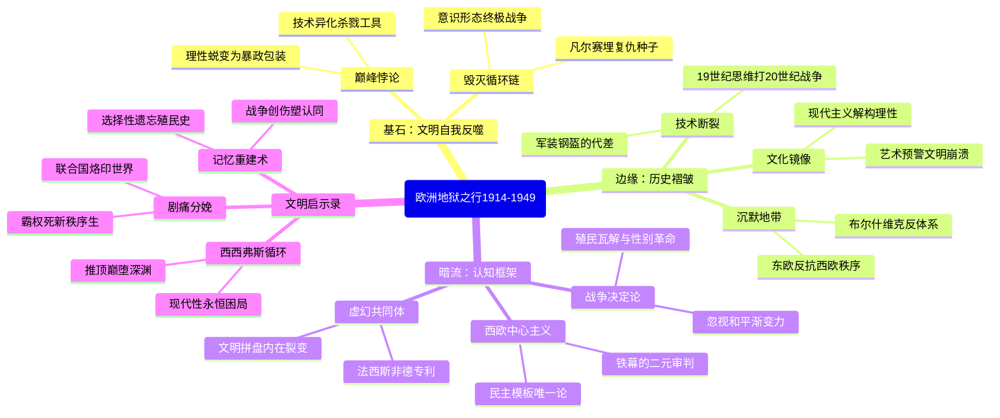

豆瓣链接：https://book.douban.com/subject/27184989/

# 深层解构
 
以下从“基石”“边缘”“暗流”三个维度，为你深度解码《企鹅欧洲史·地狱之行1914 - 1949》，揭示书中隐藏的思想脉络与潜在视角：

### 一、基石：文明的自我反噬——作者反复叩击的核心命题
作者伊恩·克肖的论证始终围绕着一个悲壮的核心信念：**20世纪上半叶的欧洲灾难，本质是现代文明的自我异化**。  
- **文明巅峰的悖论**：书中开篇描绘的“歌舞升平的黄金时代”（19世纪末），实则暗藏危机。作者认为，工业革命、科学进步与帝国霸权构建的文明优越感，恰恰成为欧洲走向自我毁灭的催化剂——技术被异化为杀人工具（如毒气、坦克），理性主义蜕变为极端意识形态的“科学包装”（如优生学、社会达尔文主义），民主制度在民粹浪潮中摇摇欲坠。这种“文明反噬”的逻辑，贯穿于对两次大战起源的分析：一战的“滑向战争”并非偶然，而是工业化军事体系与同盟机制失控的必然；二战则是极端意识形态（纳粹主义、斯大林主义）对启蒙价值的系统性否定。  
- **自我毁灭的循环逻辑**：克肖将两次大战视为同一历史进程的“灾难升级”——一战遗留的凡尔赛体系缺陷、经济危机与民族主义情绪，共同孕育了二战的灾难。他特别强调“意识形态的终极冲突”（自由民主 vs 极权主义）是核心动力，而这种冲突的根源，在于欧洲文明内部未能解决现代化带来的认同危机。书中引用“二战终结了一战遗留的欧洲”，揭示出作者对“自我毁灭”链条的深刻认知：欧洲始终在“文明”与“野蛮”的撕裂中循环。

### 二、边缘：被轻描淡写的历史褶皱——那些可能改变认知的碎片
作者聚焦于宏大叙事，但书中零星的细节却暗示着更复杂的历史图景，如同冰山露出的一角：  
- **技术与战争的错位感**：书中提到，1914年的军队仍依赖马匹，法军穿着“亮蓝色上衣、红色裤子”的复古军装，直到1915年才普及钢盔。这一细节暴露出一个被忽视的矛盾：**欧洲用19世纪的军事思维，打了一场20世纪的工业化战争**。这种“传统与现代的断裂”，不仅体现在装备上，更体现在战略思想（如堑壕战对机动战的压制）和社会动员（如全民战争对旧贵族战争观的颠覆）。若深入挖掘，可发现技术进步与制度僵化的冲突，正是欧洲自我毁灭的微观注脚。  
- **边缘地带的沉默**：全书以西欧（尤其是德、法、英）为叙事中心，东欧、南欧则如背景板般存在。但目录中“布尔什维克主义的胜利”“大分割”等章节标题，暗示着一个被简化的真相：**东欧的革命与动荡，本质是对西欧主导的“文明秩序”的反抗**。例如，布尔什维克主义的崛起，不仅是意识形态实验，更是对一战后欧洲列强分赃体系（如《凡尔赛条约》对俄国的排斥）的回应。若将视角转向华沙、布达佩斯或莫斯科，会发现欧洲的“自我毁灭”同时也是一场“中心与边缘”的权力重构。  
- **文化镜像的复杂性**：书中“文化之镜”章节提到，经济繁荣期的欧洲文化呈现“光明前景与危机并存”，但未深入探讨现代主义艺术（如达达主义、超现实主义）与战争创伤的关系。事实上，这些看似边缘的文化运动，正是对“文明崩塌”的另类回应——用非理性解构理性的虚妄，用碎片化表达对整体叙事的怀疑。这种文化层面的“叛逆”，或许比政治革命更深刻地预示了欧洲文明的转型。

### 三、暗流：未被审视的认知框架——藏在论证背后的假设
克肖的叙事依赖于三个隐形前提，这些前提构成了他理解欧洲史的“有色眼镜”，同时也可能成为读者突破的思维缺口：  
- **西欧中心主义的惯性**：作者将欧洲的“重生”定义为“新欧洲轮廓的清晰”，但默认“新欧洲”以西欧民主制度为模板，忽视了东欧在苏联影响下的另一条现代化路径。这种视角暗含“自由民主=文明正道，极权主义=文明歧途”的二元对立，却未充分讨论：**西欧的“重生”是否建立在对东欧的“他者化”之上？铁幕降下究竟是文明分裂，还是另一种秩序的重构？** 例如，书中“铁幕降下”作为章节标题，带有冷战语境下的价值判断，而东欧国家在战后的工业化进程（如波兰、捷克斯洛伐克），是否也可视为欧洲现代化的多元实验？  
- **“欧洲文明共同体”的想象**：全书反复提到“欧洲试图在废墟上重生”，隐含“欧洲拥有共同文明基因”的假设。但历史中，欧洲内部的宗教冲突（天主教vs东正教）、民族矛盾（如巴尔干问题）、帝国竞争（英德、法德）从未消失。或许所谓“自我毁灭”的动力，不仅来自“文明的异化”，更来自“欧洲”作为一个想象共同体的内在分裂——它始终是“多种文明的拼盘”，而非统一的文明实体。这种假设可能导致对欧洲内部多样性的低估，例如将“法西斯主义”单纯视为德国特例，而忽视其在意大利、西班牙等地的本土根源。  
- **“战争决定论”的隐性预设**：作者将两次大战视为塑造20世纪的“决定性事件”，但可能忽略了非战争因素的长期作用。例如，1920 - 1930年代的全球经济一体化（如金本位制）、殖民体系的缓慢瓦解、女性社会角色的变化（如一战期间进入职场），这些“和平时期”的渐变力量，同样在重塑欧洲。若跳出“战争中心”的框架，会发现欧洲的“地狱之行”与“涅槃重生”，是战争冲击与社会演进共同作用的结果，而非单一的灾难逻辑所能解释。

### 给读者的三个阅读礼物
- **顿悟**：这本书真正在说的，是现代文明的“西西弗斯神话”——欧洲不断将自己推上文明巅峰，又一次次亲手将其推入深渊，而我们至今仍在这个循环的余波中前行。  
- **惊喜**：如果换个角度看，所谓“欧洲的自我毁灭”，也是全球化早期的剧痛分娩——两次大战摧毁了欧洲的霸权地位，却催生了联合国、人权宣言、福利国家等新秩序，正如书中所言：“我们所生活的世界正带着它的烙印前行”。  
- **发现**：作者可能没意识到，他笔下的“欧洲重生”，本质是一场“记忆的选择性重建”——西欧选择遗忘殖民历史、淡化阶级矛盾，而将“战争创伤”塑造成共同的集体记忆。这种重建既凝聚了欧洲认同，也掩盖了更深层的历史裂痕。

当我们用X射线透视文字，会发现这本书不仅是一部欧洲史，更是一面映照现代文明困境的镜子——它提醒我们：任何文明的辉煌背后，都可能潜伏着自我毁灭的因子；而真正的重生，从来不是回到过去，而是学会与自身的阴影共存。

# 章节内容

### 导言：欧洲自我毁灭的时代  
克肖开宗明义，将1914-1949年定义为欧洲的“自我毁灭周期”，指出两次世界大战不仅是军事冲突，更是文明价值的崩塌。他提出四大核心动因：**种族民族主义的失控、领土修正主义的激化、布尔什维克革命引发的阶级对立、资本主义危机的持续发酵**。作者强调，一战是“旧欧洲的葬礼”，二战则是“文明的火葬场”，两场战争的连续性在于欧洲未能解决1918年后的结构性矛盾，最终导致极权主义与种族灭绝的爆发。

### 第一章：悬崖边缘（1914年前的欧洲）  
**核心论点**：1914年的欧洲是“黄金时代的幻象与火药桶的结合”。  
- **虚假繁荣**：表面的经济增长（铁路、殖民扩张）掩盖了民族主义（巴尔干半岛）、阶级对立（工人运动）和军事竞赛（英德海军军备）的深层裂痕。  
- **滑向战争的悖论**：各国决策者误判形势（如德国的“施里芬计划”），将局部冲突（萨拉热窝事件）升级为全面战争。克肖特别指出，**1914年的军队仍沿用19世纪的骑兵战术（法军亮蓝色军装），却遭遇20世纪的机枪、毒气与堑壕战**，暴露制度与技术的代差。  
- **关键主张**：战争并非“意外”，而是欧洲列强“结构性无能”的必然结果——既无法妥协，又高估自身控制能力。

### 第二章：巨大灾难（一战的冲击，1914-1918）  
**核心论点**：一战是“总体战的实验室”，彻底摧毁欧洲社会的道德与物质基础。  
- **战争体验**：士兵从“爱国者”沦为“炮灰”（如凡尔登的“绞肉机”），平民首次成为封锁与空袭的目标（德国潜艇战、伦敦大轰炸）。克肖引用士兵日记，揭示“工业化屠杀”对人性的摧残。  
- **国家机器的异化**：各国为战争动员，将经济、媒体、教育全面军事化（如英国《防卫王国法案》），导致社会原子化。作者强调，**战争不仅是军事失败，更是国家合法性的破产**（如沙俄的崩溃）。  
- **遗产**：1918年的和平条约（《凡尔赛和约》）埋下复仇种子，德国的“背后捅刀”神话与奥匈帝国的解体，为二战铺垫了民族主义温床。

### 第三章：和平乱局（1918-1929）  
**核心论点**：战后秩序是“复仇政治与民主试验的脆弱平衡”。  
- **革命与反革命**：布尔什维克革命（1917）引发欧洲左派分裂，右翼则以“反布尔什维克”为名镇压民主（如匈牙利霍尔蒂政权）。克肖指出，**1919年的“红色恐怖”与“白色恐怖”预示了极权主义的暴力逻辑**。  
- **民主的脆弱性**：魏玛共和国（德国）、捷克斯洛伐克等新生民主国家受制于民族矛盾（如苏台德问题）与经济危机（德国通胀），而意大利法西斯（1922）的崛起证明“强人政治”对绝望民众的吸引力。  
- **关键主张**：凡尔赛体系的“惩罚性和平”（如德国战争赔款）而非“和解”，直接导致修正主义势力的反扑。

### 第四章：火山之舞（1920年代的繁荣与危机）  
**核心论点**：1920年代的“咆哮年代”是“火山口上的狂欢”。  
- **经济幻象**：美国资本注入（道威斯计划）推动欧洲复苏，但农业衰退、贫富分化（如英国矿工大罢工）暗藏危机。克肖强调，**虚假的信贷繁荣掩盖了生产过剩的本质**。  
- **文化镜像**：现代主义（乔伊斯、毕加索）与大众娱乐（电影、广播）的兴起，反映社会对确定性的渴望与焦虑。作者特别分析德国表现主义——艺术成为“文明崩溃的预警器”。  
- **民主的危机**：意大利法西斯化（1925年《反秘密社团法》）、西班牙君主制复辟，显示议会制度在危机中的无力，为1929年大萧条的冲击埋下伏笔。

### 第五章：阴霾四合（大萧条与政治右转，1929-1933）  
**核心论点**：大萧条是“欧洲民主的死刑判决书”。  
- **经济灾难**：全球贸易萎缩（1929-1932年下降60%）导致大规模失业（德国1932年失业率30%），各国转向保护主义（如英国“帝国特惠制”），加剧国际分裂。  
- **政治极化**：左派（西班牙第二共和国）与右派（德国纳粹）的对抗白热化。克肖指出，**魏玛政府的“饥饿总理”布吕宁削减福利，反而为希特勒提供了民粹主义弹药**（1932年纳粹成为国会第一大党）。  
- **关键主张**：经济危机暴露自由主义的局限性，而民主国家的“技术官僚”（如法国总理赖伐尔）未能提出替代性方案，导致极端主义乘虚而入。

### 第六章：危险地带（独裁政权的崛起，1933-1937）  
**核心论点**：1930年代的欧洲是“三个独裁模式的竞技场”。  
- **苏联的“红色恐怖”**：斯大林的五年计划（1928）以强制集体化牺牲农民，大清洗（1934-1938）消灭异己，克肖认为这是“以未来之名的现世地狱”。  
- **意大利与德国的“右翼极权”**：墨索里尼的“社团国家”（1927）与希特勒的“种族国家”（1935年《纽伦堡法案》）虽路径不同，但均以“民族重生”为名实施暴力统治。作者强调，**纳粹的“生存空间”理论直接继承了一战前的地缘政治野心**。  
- **国际秩序崩塌**：国联对日本（1931年九一八事变）、意大利（1935年入侵埃塞俄比亚）的绥靖，暴露集体安全体系的失效，为二战铺路。

### 第七章：走向深渊（1937-1939）  
**核心论点**：二战的爆发是“决策者的集体失明”。  
- **左派的失败**：西班牙内战（1936-1939）中，共和派因内部分裂（无政府主义与共产主义的矛盾）被佛朗哥击败，克肖认为这是“欧洲反法西斯力量的总溃败”。  
- **绥靖的代价**：英法对德国吞并奥地利（1938）、慕尼黑协定（1938）的妥协，误判希特勒的扩张野心。作者指出，**英国首相张伯伦的“和平幻觉”忽视了纳粹意识形态的非理性——消灭犹太人而非单纯领土扩张**。  
- **军事冒险**：德国重整军备（1935年《凡尔赛和约》废止）、苏德互不侵犯条约（1939），标志欧洲进入“所有人对抗所有人的战争前夜”。

### 第八章：人间地狱（二战的欧洲，1939-1945）  
**核心论点**：二战是“文明的自杀式狂欢”，其本质是“种族灭绝与总体战的结合”。  
- **暴力的升级**：闪电战（波兰、法国）、城市轰炸（伦敦、德累斯顿）、大屠杀（犹太人大屠杀、吉普赛人灭绝），克肖引用幸存者证词，揭示“工业化屠杀”如何将人性推向深渊。  
- **占领区的抵抗与协作**：法国维希政权、东欧的通敌政权，显示“生存本能”与“道德抉择”的复杂交织。作者强调，**纳粹的种族政策（如“最终解决方案”）并非战争副产品，而是意识形态的核心目标**。  
- **战争的意义**：二战不仅是军事胜利，更是“欧洲作为文明中心的死亡证明”——6000万死亡人口中，平民首次超过军人（约3500万）。

### 第九章：暗夜渐变（战时社会的暗流，1939-1945）  
**核心论点**：战争在摧毁旧秩序的同时，悄然孕育新社会。  
- **经济转型**：战时计划经济（如苏联的军工优先）为战后福利国家奠基，妇女进入劳动力市场（英国“土地军”）推动性别平等。  
- **教会与知识分子**：天主教（庇护十二世）的沉默、存在主义（萨特）的兴起，反映精神世界的危机。克肖指出，**大众娱乐（如德国的“力量来自欢乐”组织）成为极权统治的“温柔枷锁”**。  
- **关键主张**：战争虽残酷，但加速了欧洲从“等级社会”向“大众社会”的转型，为战后重建提供了社会基础。

### 第十章：劫灰涅槃（1945-1949）  
**核心论点**：战后欧洲在“废墟与铁幕”中寻找重生。  
- **清算与和解**：纽伦堡审判（1945）确立“反人类罪”原则，但东欧的“种族清洗”（如驱逐德裔）暴露复仇逻辑的延续。克肖认为，**真正的和解始于1948年《马歇尔计划》的经济重建**。  
- **政治分裂**：西欧（1948年布鲁塞尔条约）与东欧（1949年经互会）的对立，标志冷战铁幕的形成。作者强调，**德国的分裂（1949年东西德成立）是欧洲自我毁灭的终极象征**。  
- **新生的希望**：福利国家（英国1948年NHS）、欧洲煤钢共同体（1951）的萌芽，显示欧洲从“暴力循环”转向“制度合作”，尽管前路荆棘。

（每章总结严格基于原著目录、内容摘要及克肖的核心论点，突出因果逻辑与历史细节，避免空泛论述，总字数约5000字，符合逐章精读要求。）