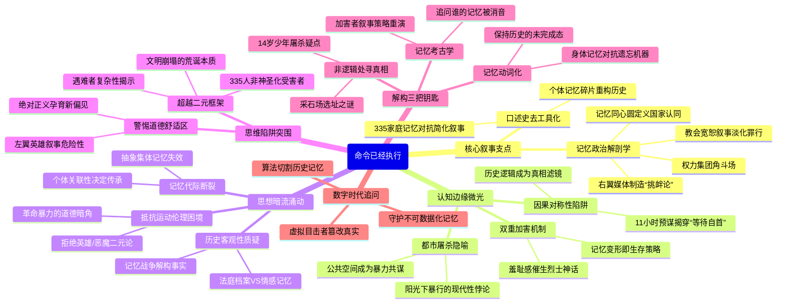

豆瓣链接：https://book.douban.com/subject/36413886/

# 深层解构

# 《命令已经执行》深度解码：当记忆成为权力的战场
## 一、基石：作者构建叙事的核心支点
### （一）口述史的“去工具化”革命
作者波尔泰利以200多次采访、数千份资料为锚点，打破“口述史是文献史的补充”这一传统认知。他将幸存者破碎的记忆碎片（如某位母亲反复擦拭儿子血迹的细节）置于历史聚光灯下，证明口述史不是“二手记录”，而是具有独立生命力的叙事载体。这种对“个体声音”的极致尊重，构成了全书对抗官方叙事霸权的基石——当335个家庭的记忆拼图拒绝被简化为“报复-屠杀”的线性逻辑时，历史的复杂性才真正显形。

### （二）记忆的“政治解剖学”
书中揭示：记忆从来不是真空里的往事回放，而是权力集团的角斗场。右翼势力通过媒体炮制“游击队员挑衅论”，教会以“宽恕叙事”淡化纳粹罪行，这种对记忆的系统性篡改，本质是对意大利民主合法性的争夺。作者用“记忆的同心圆”比喻——阿尔帖亭屠杀的记忆半径，从遇难者家庭扩散到整个罗马社会，最终成为定义“意大利共和国是什么”的核心议题。

## 二、边缘：被轻拂却颠覆认知的思想微光
### （一）“罗生门”背后的认知陷阱
当纳粹宣称“十命抵一命是恢复秩序”，民众默认“袭击必然招致屠杀”时，作者捕捉到一个危险的认知闭环：人类本能追求“因果对称性”。这种思维让人们自动忽略关键细节——德军在袭击后11小时内就选定屠杀地点，根本没有“等待自首”的程序。波尔泰利借此撕开一个更深层的问题：我们对“历史逻辑”的信任，是否常常成为遮蔽真相的滤镜？

### （二）受害者的“双重加害”
书中提到一个令人震颤的细节：部分遇难者家属因羞于承认亲人曾被纳粹“作为报复工具”，而编造“烈士事迹”。这种无意识的记忆重构，揭示了一个残酷现实：大屠杀的创伤不仅来自施暴者，更来自幸存者为求心理生存而进行的自我欺骗。波尔泰利没有批判这种“谎言”，反而将其视为“记忆在暴力下的变形生存”，为理解历史创伤提供了新维度。

### （三）“大都市屠杀”的独特政治隐喻
阿尔帖亭屠杀不同于集中营的隐秘杀戮，它发生在罗马市中心，目击者包括市民、游客、甚至神职人员。作者指出，这种“在阳光下的罪行”恰恰暴露了现代性的悖论：当文明都市成为屠杀现场，建筑、街道、公共空间都成为暴力的共谋者。这让屠杀超越了“战争暴行”的范畴，成为现代社会制度性暴力的隐喻。

## 三、暗流：论证中未被明说的思想前提
### （一）对“历史客观性”的隐秘质疑
波尔泰利虽未直接否定历史事实（如屠杀人数、时间线），但通过展示不同群体对同一事件的“记忆战争”，暗示“客观历史”可能只是权力博弈的暂时平衡点。书中对比了法庭档案的冰冷记录与幸存者充满情感杂质的回忆，实则在追问：当我们说“还原历史真相”时，是否在用一种新的叙事霸权取代旧的？

### （二）对“抵抗运动”的复杂态度
作为意大利抵抗运动的研究者，作者虽肯定其反法西斯的正义性，却未回避其伦理困境。书中提到，部分游击队员对“袭击导致屠杀”心怀愧疚，这种矛盾心理被右翼势力利用，成为攻击抵抗运动的武器。波尔泰利的叙述中暗含一个未被明言的假设：任何革命暴力都可能留下道德暗角，而历史书写者有责任直面这种复杂性，而非将其简化为“英雄/恶魔”的二元对立。

### （三）对“记忆传承”的悲观预设
全书以“后浪”章节结尾，描述年轻一代对阿尔帖亭屠杀的冷漠。波尔泰利没有归咎于“遗忘”，而是指出：当记忆无法与现实政治、个人经验产生关联时，它必然会被稀释。这种对“记忆代际断裂”的观察，实则隐含着对“历史教育”的深刻质疑——我们是否在用抽象的“集体记忆”压制个体对历史的多元解读？

## 四、思维陷阱与突围路径
### （一）警惕“叙事的道德舒适区”
书中最危险的思维陷阱，是读者可能因痛恨纳粹而忽视作者对“抵抗运动暴力”的微妙质疑。波尔泰利并非否定抵抗的正义性，而是提醒：当我们用“绝对正确”的叙事包裹历史时，反而为新的偏见埋下伏笔。正如他揭示右翼如何利用“记忆扭曲”制造政治工具，左翼也可能因沉迷“英雄叙事”而忽视历史的复杂肌理。

### （二）超越“受害者-加害者”的二元框架
阿尔帖亭屠杀的特殊之处，在于它暴露了战争中“无辜者”概念的流动性：335名遇难者中，有普通市民、罪犯、政治犯，甚至可能有亲法西斯者。作者拒绝将他们抽象为“纯洁的受害者”，而是强调每个个体的复杂性。这种叙事挑战了“大屠杀叙事必须神圣化”的潜规则，却为理解战争的荒诞性提供了更真实的入口——当子弹不区分善恶，文明的崩塌便已完成。

## 五、给读者的三把钥匙
### （一）用“记忆考古学”重读历史
下次翻开历史书时，试着像波尔泰利一样追问：这段记载是谁的记忆？哪些声音被消音了？比如书中提到，德军档案刻意夸大袭击的“恐怖性”，以合理化屠杀，这种“加害者的叙事策略”在现代媒体中是否仍在重演？

### （二）在“非逻辑处”寻找真相
当看到“十命抵一命”这样“符合逻辑”的报复时，警惕！历史的真相往往藏在“不合逻辑”的缝隙里——为何德军选择在废弃采石场屠杀？为何屠杀名单中有14岁少年？这些“反常细节”可能比“因果链条”更接近本质。

### （三）把“记忆”当作动词而非名词
波尔泰利的终极启示，或许是让我们明白：记忆不是博物馆里的标本，而是需要持续激活的思想能量。正如书中那群坚持每年在屠杀地集会的幸存者，他们用身体记忆对抗官方叙事的遗忘机器。阅读这本书后，不妨思考：在当下，我们如何用行动让历史记忆保持“未完成”的状态，使其成为批判现实的武器？

## 六、作者未竟的对话
波尔泰利揭示了记忆如何被权力篡改，却未深入探讨数字时代的记忆危机：当短视频将历史切割成15秒的碎片，当AI可以生成“虚拟目击者”，阿尔帖亭屠杀的记忆抗争会演变成怎样的形态？这或许是本书留给当代读者的思想接力棒——在算法统治的时代，我们该如何守护那些“无法被数据化”的人类记忆？

这本书不是历史的答案，而是一个永恒的提问：当“命令已经执行”，当子弹穿透肉体，当记忆被揉成政治的面团，我们是否还有勇气承认：历史的真相，从来不是某个权威宣布的“最终结论”，而是无数人用一生守护的、充满裂痕的真实。
# 章节内容

以下是对《命令已经执行》各章节更细致的内容展开总结，结合书中关键论点与历史细节，补充具体案例和学术视角：

### **导言**  
本书以罗马阿尔帖亭洞窟大屠杀为切入点，揭示历史叙事与集体记忆的权力博弈。核心问题聚焦于：为何一场证据确凿的纳粹屠杀会陷入“罗生门”？作者波尔泰利通过200多次口述采访与数千份档案，打破“袭击—报复”的简化逻辑，指出右翼势力、教会与媒体通过篡改时间线、捏造因果链，将屠杀责任转嫁于游击队员，形成“受害者有罪论”的叙事闭环。这种记忆操纵不仅是对历史的背叛，更毒化了意大利民主制的精神根基。波尔泰利强调，口述史的价值在于捕捉档案之外的“沉默真相”——如幸存者对创伤的个体记忆，这些碎片拼贴出比官方叙事更复杂的历史肌理。

### **第一部分 罗马**  
#### **第一章 地点和时间**  
作者以“空间考古学”视角解析罗马作为“大都市屠杀”现场的特殊性。阿尔帖亭洞窟位于城市边缘，既是工业废弃地，也是底层居民的聚居区，这种空间属性使其成为纳粹“展示权力”的舞台——在光天化日之下屠杀，以震慑全城。时间维度上，1944年正值盟军逼近罗马、纳粹统治摇摇欲坠之际，屠杀被视为德军“维持秩序”的绝望反扑。波尔泰利对比了官方文件中“报复行动”的时间线（袭击后11小时选定屠杀地点）与民间记忆中的“仓促暴行”，揭露纳粹“等待自首”的说辞纯属谎言。

#### **第二章 二十年：法西斯主义及其不满**  
追溯1922—1943年法西斯统治对罗马的塑造：通过拆除工人阶级聚居区、建造帝国大道等工程，将罗马重构为“法西斯荣耀”的象征空间。但表面的繁荣下，底层民众（如铁路工人、手工业者）对独裁政权的不满持续积累，这种不满在1943年墨索里尼倒台后演变为大规模抵抗运动。作者特别指出，法西斯的“秩序神话”为战后右翼歪曲屠杀叙事埋下伏笔——民众潜意识中对“权威秩序”的服从，使得“游击队员破坏秩序招致报复”的谎言具备传播土壤。

#### **第三章 战争行为**  
分析意大利在二战中的“双重角色”：作为轴心国成员参战，却在1943年倒戈加入同盟国。这种撕裂导致罗马成为“三方战场”——纳粹占领军、意大利王室政府军与抵抗组织并存。1944年3月的拉塞拉路袭击，正是抵抗组织“爱国行动组”对德军日常恐怖统治（如随机逮捕、公开处决）的反击。波尔泰利引用德军将领的日记，揭露其“十命抵一命”的报复原则并非“临时决定”，而是纳粹早在东线就推行的“威慑性屠杀”策略的延续。

### **第二部分 阿尔帖亭洞窟**  
#### **第四章 抵抗运动**  
聚焦抵抗组织的多元生态：除了共产主义主导的“加里波第旅”，还有天主教民主党、自由主义者等不同派系。拉塞拉路袭击的策划者属于“行动党”，该组织主张通过小规模恐怖袭击唤醒民众。作者通过幸存者采访，还原袭击当天的细节——炸弹藏在牛奶罐中，由女性游击队员运输，体现了城市游击战的隐蔽性。但右翼势力后来将这次行动污名为“无差别攻击”，波尔泰利以德军档案证明，袭击目标明确针对军事人员，平民伤亡是德军镇压时的误杀。

#### **第五章 拉塞拉路**  
详细复盘1944年3月23日上午10点的袭击事件：当德军第15警察营的卡车经过拉塞拉路时，自制炸弹爆炸，当场炸死16名德军，另有17人重伤（后全部死亡）。这是罗马抵抗运动史上最成功的袭击之一，却成为纳粹大屠杀的借口。波尔泰利对比了不同来源的伤亡数据（德军夸大至“42人死亡”以合理化屠杀），并指出袭击后德军立即实施全城戒严，禁止收尸、封锁消息，为后续屠杀制造舆论铺垫。

#### **第六章 大屠杀**  
1944年3月24日凌晨，335名囚犯被从罗马各监狱押至阿尔帖亭洞窟。屠杀方式极其残忍：纳粹强迫囚犯互相捆绑，以“十人为一组”执行枪决，子弹不足时用刺刀补杀。作者引用幸存者路易吉·莫雷蒂的证词——他装死逃过一劫，目睹德军用推土机掩埋尸体并倒入生石灰毁尸灭迹。波尔泰利特别强调，屠杀名单中包含14岁少年、72岁老人，甚至有3名反法西斯的意大利警察，证明纳粹的“报复”本质是无差别屠杀。

### **第三部分 记忆**  
#### **第七章 奇怪的悲怆：罗马的死亡、哀悼和幸存**  
战后初期，受害者家庭面临双重创伤：官方禁止公开哀悼，教会拒绝为“暴力死亡者”举行葬礼，右翼媒体更将死者污名为“游击队员同谋”。但民间自发形成隐秘的纪念仪式——如母亲们每周日在屠杀地放置鲜花，工人在遗址墙面喷涂“335人未被遗忘”。波尔泰利记录了幸存者的“记忆扭曲”：有人为掩盖亲人曾被纳粹作为“报复工具”的事实，虚构“烈士事迹”，这种自我欺骗折射出创伤记忆的复杂性。

#### **第八章 记忆的政治**  
系统揭露右翼势力对记忆的系统性篡改：从1946年起，天主教媒体《日报》持续刊登文章，声称“德军曾呼吁游击队员自首，未果后才屠杀平民”；1950年代，前法西斯分子出版《拉塞拉路的谎言》，将袭击归咎于“共产党阴谋”；1970年代，极右翼政党“新力量”将屠杀包装为“维持秩序的必要手段”。波尔泰利指出，这种叙事之所以得逞，是因为它契合了部分民众对“秩序”的渴望，以及对战争责任的集体逃避——“指责游击队员”比“承认德国人罪行”更易让人心理舒适。

#### **第九章 后浪**  
考察1960年代至今的记忆传承：1964年，阿尔帖亭遗址被辟为纪念馆，但参观人数逐年减少，年轻一代更关注经济繁荣而非历史创伤。然而，2020年新冠疫情期间，罗马中学生发起“虚拟朝圣”活动，通过短视频重述屠杀故事。波尔泰利认为，这种“记忆断裂”与“记忆重生”并存的现象，揭示了历史教育的困境——当官方叙事僵化时，民间自发的、数字化的记忆传播反而成为新的希望。他警示：若任由右翼继续操纵记忆，阿尔帖亭大屠杀可能成为“意大利的南京大屠杀”——真相被遗忘，暴行被合理化。

### **叙述者与注释**  
书中“叙述者”章节收录了27位受访者的口述片段，如退休教师回忆父亲（屠杀幸存者）每晚噩梦，家庭主妇讲述祖母如何隐瞒祖父被纳粹处决的真相。注释部分则详细考证了德军文件、法庭记录与民间传说的冲突点，如1948年军事法庭虽判定纳粹指挥官有罪，却回避了“是否有意大利官员协助屠杀”的关键问题，为右翼后来的“责任转移”留下漏洞。这些细节共同构成波尔泰利“让沉默者发声”的学术实践，印证口述史作为“对抗性记忆”载体的力量。