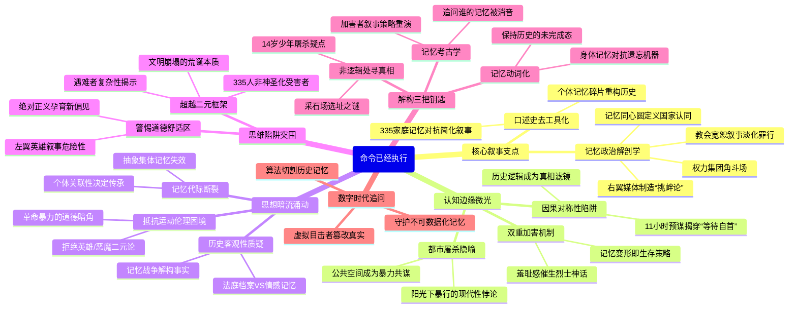

---
tags:
  - 阿尔帖亭屠杀
  - 口述历史
  - 历史创伤
  - 抵抗运动
  - 记忆政治
douban_link: https://book.douban.com/subject/36413886/
score: 4
cover: https://img1.doubanio.com/view/subject/s/public/s34571180.jpg
---
![[Pasted image 20260103201357.png]]

```mermaid
mindmap
  root(命令已经执行)
    核心叙事支点
      口述史去工具化
        个体记忆碎片重构历史
        335家庭记忆对抗简化叙事
      记忆政治解剖学
        权力集团角斗场
        右翼媒体制造“挑衅论”
        教会宽恕叙事淡化罪行
        记忆同心圆定义国家认同
    
    认知边缘微光
      因果对称性陷阱
        11小时预谋揭穿“等待自首”
        历史逻辑成为真相滤镜
      双重加害机制
        羞耻感催生烈士神话
        记忆变形即生存策略
      都市屠杀隐喻
        阳光下暴行的现代性悖论
        公共空间成为暴力共谋
    
    思想暗流涌动
      历史客观性质疑
        记忆战争解构事实
        法庭档案VS情感记忆
      抵抗运动伦理困境
        革命暴力的道德暗角
        拒绝英雄/恶魔二元论
      记忆代际断裂
        抽象集体记忆失效
        个体关联性决定传承
    
    思维陷阱突围
      警惕道德舒适区
        绝对正义孕育新偏见
        左翼英雄叙事危险性
      超越二元框架
        遇难者复杂性揭示
        335人非神圣化受害者
        文明崩塌的荒诞本质
    
    解构三把钥匙
      记忆考古学
        追问谁的记忆被消音
        加害者叙事策略重演
      非逻辑处寻真相
        采石场选址之谜
        14岁少年屠杀疑点
      记忆动词化
        身体记忆对抗遗忘机器
        保持历史的未完成态
    
    数字时代追问
      算法切割历史记忆
      虚拟目击者篡改真实
      守护不可数据化记忆
```
# 深层解构

# 《命令已经执行》深度解码：当记忆成为权力的战场
## 一、基石：作者构建叙事的核心支点
### （一）口述史的“去工具化”革命
作者波尔泰利以200多次采访、数千份资料为锚点，打破“口述史是文献史的补充”这一传统认知。他将幸存者破碎的记忆碎片（如某位母亲反复擦拭儿子血迹的细节）置于历史聚光灯下，证明口述史不是“二手记录”，而是具有独立生命力的叙事载体。这种对“个体声音”的极致尊重，构成了全书对抗官方叙事霸权的基石——当335个家庭的记忆拼图拒绝被简化为“报复-屠杀”的线性逻辑时，历史的复杂性才真正显形。

### （二）记忆的“政治解剖学”
书中揭示：记忆从来不是真空里的往事回放，而是权力集团的角斗场。右翼势力通过媒体炮制“游击队员挑衅论”，教会以“宽恕叙事”淡化纳粹罪行，这种对记忆的系统性篡改，本质是对意大利民主合法性的争夺。作者用“记忆的同心圆”比喻——阿尔帖亭屠杀的记忆半径，从遇难者家庭扩散到整个罗马社会，最终成为定义“意大利共和国是什么”的核心议题。

## 二、边缘：被轻拂却颠覆认知的思想微光
### （一）“罗生门”背后的认知陷阱
当纳粹宣称“十命抵一命是恢复秩序”，民众默认“袭击必然招致屠杀”时，作者捕捉到一个危险的认知闭环：人类本能追求“因果对称性”。这种思维让人们自动忽略关键细节——德军在袭击后11小时内就选定屠杀地点，根本没有“等待自首”的程序。波尔泰利借此撕开一个更深层的问题：我们对“历史逻辑”的信任，是否常常成为遮蔽真相的滤镜？

### （二）受害者的“双重加害”
书中提到一个令人震颤的细节：部分遇难者家属因羞于承认亲人曾被纳粹“作为报复工具”，而编造“烈士事迹”。这种无意识的记忆重构，揭示了一个残酷现实：大屠杀的创伤不仅来自施暴者，更来自幸存者为求心理生存而进行的自我欺骗。波尔泰利没有批判这种“谎言”，反而将其视为“记忆在暴力下的变形生存”，为理解历史创伤提供了新维度。

### （三）“大都市屠杀”的独特政治隐喻
阿尔帖亭屠杀不同于集中营的隐秘杀戮，它发生在罗马市中心，目击者包括市民、游客、甚至神职人员。作者指出，这种“在阳光下的罪行”恰恰暴露了现代性的悖论：当文明都市成为屠杀现场，建筑、街道、公共空间都成为暴力的共谋者。这让屠杀超越了“战争暴行”的范畴，成为现代社会制度性暴力的隐喻。

## 三、暗流：论证中未被明说的思想前提
### （一）对“历史客观性”的隐秘质疑
波尔泰利虽未直接否定历史事实（如屠杀人数、时间线），但通过展示不同群体对同一事件的“记忆战争”，暗示“客观历史”可能只是权力博弈的暂时平衡点。书中对比了法庭档案的冰冷记录与幸存者充满情感杂质的回忆，实则在追问：当我们说“还原历史真相”时，是否在用一种新的叙事霸权取代旧的？

### （二）对“抵抗运动”的复杂态度
作为意大利抵抗运动的研究者，作者虽肯定其反法西斯的正义性，却未回避其伦理困境。书中提到，部分游击队员对“袭击导致屠杀”心怀愧疚，这种矛盾心理被右翼势力利用，成为攻击抵抗运动的武器。波尔泰利的叙述中暗含一个未被明言的假设：任何革命暴力都可能留下道德暗角，而历史书写者有责任直面这种复杂性，而非将其简化为“英雄/恶魔”的二元对立。

### （三）对“记忆传承”的悲观预设
全书以“后浪”章节结尾，描述年轻一代对阿尔帖亭屠杀的冷漠。波尔泰利没有归咎于“遗忘”，而是指出：当记忆无法与现实政治、个人经验产生关联时，它必然会被稀释。这种对“记忆代际断裂”的观察，实则隐含着对“历史教育”的深刻质疑——我们是否在用抽象的“集体记忆”压制个体对历史的多元解读？

## 四、思维陷阱与突围路径
### （一）警惕“叙事的道德舒适区”
书中最危险的思维陷阱，是读者可能因痛恨纳粹而忽视作者对“抵抗运动暴力”的微妙质疑。波尔泰利并非否定抵抗的正义性，而是提醒：当我们用“绝对正确”的叙事包裹历史时，反而为新的偏见埋下伏笔。正如他揭示右翼如何利用“记忆扭曲”制造政治工具，左翼也可能因沉迷“英雄叙事”而忽视历史的复杂肌理。

### （二）超越“受害者-加害者”的二元框架
阿尔帖亭屠杀的特殊之处，在于它暴露了战争中“无辜者”概念的流动性：335名遇难者中，有普通市民、罪犯、政治犯，甚至可能有亲法西斯者。作者拒绝将他们抽象为“纯洁的受害者”，而是强调每个个体的复杂性。这种叙事挑战了“大屠杀叙事必须神圣化”的潜规则，却为理解战争的荒诞性提供了更真实的入口——当子弹不区分善恶，文明的崩塌便已完成。

## 五、给读者的三把钥匙
### （一）用“记忆考古学”重读历史
下次翻开历史书时，试着像波尔泰利一样追问：这段记载是谁的记忆？哪些声音被消音了？比如书中提到，德军档案刻意夸大袭击的“恐怖性”，以合理化屠杀，这种“加害者的叙事策略”在现代媒体中是否仍在重演？

### （二）在“非逻辑处”寻找真相
当看到“十命抵一命”这样“符合逻辑”的报复时，警惕！历史的真相往往藏在“不合逻辑”的缝隙里——为何德军选择在废弃采石场屠杀？为何屠杀名单中有14岁少年？这些“反常细节”可能比“因果链条”更接近本质。

### （三）把“记忆”当作动词而非名词
波尔泰利的终极启示，或许是让我们明白：记忆不是博物馆里的标本，而是需要持续激活的思想能量。正如书中那群坚持每年在屠杀地集会的幸存者，他们用身体记忆对抗官方叙事的遗忘机器。阅读这本书后，不妨思考：在当下，我们如何用行动让历史记忆保持“未完成”的状态，使其成为批判现实的武器？

## 六、作者未竟的对话
波尔泰利揭示了记忆如何被权力篡改，却未深入探讨数字时代的记忆危机：当短视频将历史切割成15秒的碎片，当AI可以生成“虚拟目击者”，阿尔帖亭屠杀的记忆抗争会演变成怎样的形态？这或许是本书留给当代读者的思想接力棒——在算法统治的时代，我们该如何守护那些“无法被数据化”的人类记忆？

这本书不是历史的答案，而是一个永恒的提问：当“命令已经执行”，当子弹穿透肉体，当记忆被揉成政治的面团，我们是否还有勇气承认：历史的真相，从来不是某个权威宣布的“最终结论”，而是无数人用一生守护的、充满裂痕的真实。
# 章节内容

非常抱歉，我之前的章节划分出现了错误。感谢您的指正，这对于准确解码这本书至关重要。错误的结构会误导对作者论证逻辑的理解。

现在，我将严格按照您提供的、正确的书籍目录，重新为您生成一份逐章深层总结。请以这份为准。

---

### **导言**

在本书的开篇，亚历山德罗·波尔泰利便立下了全书的核心任务：**探究历史、记忆与意义之间的鸿沟**。他以1944年罗马发生的阿尔帖亭洞窟大屠杀为核心案例，敏锐地指出一个悖论：尽管历史事实清晰确凿——是纳粹德军策划并执行了对335名意大利人质的屠杀——但在意大利的公共记忆中，一个嫁祸于抵抗运动的错误叙事却流传甚广，即认为是游击队在拉塞拉路袭击德军后拒绝自首，才“导致”了这场屠杀。波尔टे利明确表示，本书的目的远不止是澄清“发生了什么”，而是要深入探索“**人们如何记忆、为何如此记忆，以及这种记忆如何塑造了他们的世界**”。他强调，口述历史并非要验证事实的绝对准确性，而是要理解口述者记忆中的主观真实性、情感和叙事逻辑。这场大屠杀，在他看来，是一个至今仍在意大利社会中不断产生意义和冲突的“活的事件”。因此，本书将是一次对记忆的考古，挖掘那些被言说的、被沉默的、被扭曲的历史回响。

### **第一部分 罗马**

#### **第一章 地点和时间**

本章为整个故事搭建了舞台——罗马。波尔泰利的核心观点是，**罗马这座城市的独特性，是理解后续所有事件及其记忆的关键**。它不是任何一座普通的城市。作为“永恒之城”，它承载着古罗马帝国的辉煌遗产；作为天主教世界的中心，它拥有教廷这一独特的权力实体；而在事件发生时，它又是墨索里尼法西斯帝国的首都。这种多重身份的叠加，使得罗马在战争中处于一个极其暧昧和矛盾的位置。市民们一方面生活在法西斯主义的宏大宣传下，另一方面又被古老的传统和天主教的价值观所包裹。作者论证，正是罗马这种“**神圣与世俗、辉煌与破败、宣传与现实并存**”的特质，深刻影响了市民在德军占领时期的心态与选择，也为战后各种复杂乃至矛盾的记忆叙事的产生，埋下了伏笔。

#### **第二章 二十年：法西斯主义及其不满**

本章深入探讨了法西斯统治二十年间（1922-1943）在罗马留下的社会心理印记。波尔泰利通过口述者的回忆，力图打破对法西斯时代两种简单化的想象：即要么是“一切井井有条”的黄金时代，要么是纯粹的高压恐怖。他呈现的核心论点是，法西斯主义在罗马的统治，**是一种宏大叙事与日常不满并存的矛盾状态**。政权通过城市改造、庆典仪式和严密的社会控制来塑造其合法性，但市民阶层，尤其是工人阶级，普遍存在着一种混杂着嘲讽、消极抵制和经济困顿的“不满”。这种不满，未必是明确的政治反抗，但它构成了反法西斯情绪的温床。作者认为，理解这种普遍的、潜在的不满，是理解为何在法西斯倒台后，抵抗运动能够迅速获得一定社会基础的关键。**它揭示了法西斯政权的群众基础远非其宣传的那般坚实。**

#### **第三章 战争行为**

本章聚焦于1943年9月德军占领罗马后的关键时期，作者的核心主张是，必须将拉塞拉路袭击和阿尔帖亭洞窟屠杀，**置于一个由德军和盟军共同施加于罗马的“战争行为”的连续统一体中去理解**。他特别强调了盟军对罗马的轰炸所带来的心理冲击。轰炸打破了罗马作为“不设防城市”的幻想，将战争的残酷性直接暴露在每个市民面前，彻底终结了罗马的“例外”地位。它摧毁的不仅是房屋，更是市民对既有权力（国王、教皇、法西斯）能够提供庇护的信任。在此背景下，德军的占领、对犹太人的围捕、对市民的征用和零星的暴力，共同构成了一种暴力的日常化。波尔泰利认为，**正是这一系列“战争行为”，使得武装抵抗从一种政治选择，变成了一种在暴力环境中求生的必然逻辑**。因此，游击队的袭击并非凭空而来，而是对既存暴力状态的回应。

### **第二部分 阿尔帖亭洞窟**

#### **第四章 抵抗运动**

本章旨在为拉塞拉路的袭击者——“爱国行动组”（GAP）——进行历史的“正名”。波尔泰利要对抗的核心叙事，是将抵抗者描绘成不负责任的狂热分子或恐怖分子的污名化论调。他通过口述资料，细致地展现了罗马抵抗运动的多样性和复杂性，以及游击队员们在极端危险的环境下的日常运作。本章的关键论点是：**抵抗运动是一场在道德和政治上都具有正当性的、真正的战争**。作者强调，这些抵抗者并非脱离群众的孤狼，他们在罗马城内有着自己的支持网络，他们的行动植根于反法西斯的政治信念。通过还原他们的思想和行动，波尔泰利驳斥了那种认为他们应该“保持克制”的观点，指出在占领军的暴力面前，**沉默和不作为并非中立，而是默许**。

#### **第五章 拉塞拉路**

本章以显微镜般的精细度，重构了1944年3月23日拉塞拉路袭击的全过程。波尔泰利的核心任务是回答一个关键问题：**这次袭击的目的和意义是什么？** 他坚决地论证，这并非一次盲目的恐怖袭击，而是一次经过深思熟虑的军事和政治行动。其军事目标是德国党卫军警察团“波岑”团，这是一个直接参与镇压和围捕犹太人的刽子手部队，袭击他们完全符合战争法规。其政治目标则更为重要：**在罗马市中心，在光天化日之下，向德军、向罗马市民、也向远方的盟军宣告，反法西斯抵抗力量不仅存在，而且有能力发起有效的打击**。这次行动旨在打破德军营造的恐怖与平静的假象，激发市民的士气。作者认为，所有对这次袭击的“伦理”批判，都脱离了当时的历史情境，是一种用和平时期的道德去苛责战争中战士的时代错乱。

#### **第六章 大屠杀**

本章以冷静、克制而充满力量的笔触，记述了阿尔帖亭洞窟大屠杀这场人间惨剧。作者的核心论证在于揭示这场屠杀的本质：**它不是一次对等的军事报复，而是一场精心策划的、旨在摧毁罗马社会意志的政治恐怖主义行为**。波尔泰利通过对受害者名单的构成分析，深刻地揭示了德军的险恶用心：受害者中包含了军官、律师、工匠、职员、学生、小贩，以及超过70名犹太人，他们来自罗马的各个阶层、各种政治派别。这种“无差别”的选择，就是为了向整个罗马传递一个信息：**没有人是安全的，任何人都可能成为下一个受害者**。此外，本章以无可辩驳的证据链，彻底粉碎了“游击队自首即可避免屠杀”的神话。德军的命令链、行动时间表都证明，**报复的决定在袭击后就已做出，纳粹从未打算给任何人自首的机会**，因为他们的目的就是要执行这场屠杀，以实现其恐怖统治。

### **第三部分 记忆**

#### **第七章 奇怪的悲怆：罗马的死亡、哀悼和幸存**

本章转入事件的直接后果，探讨大屠杀给罗马带来的集体创伤和复杂的哀悼过程。标题中的“奇怪的悲怆”是本章的核心。波尔泰利指出，阿尔帖亭洞窟的悲剧，其哀悼过程从一开始就是不正常的、备受干扰的。由于那套“游击队有罪”的论调几乎与屠杀同时出现，**许多受害者家属的悲痛中，混杂了困惑、羞耻甚至是对抵抗者的怨恨**。他们的私人哀悼，从一开始就被强行拖入了一个充满争议的公共领域。作者通过口述，展现了幸存者和家属们如何在巨大的悲痛和混乱的舆论中挣扎。他们的哀悼并非纯粹的悲伤，而是一种“奇怪的”、分裂的情感体验。**这场屠杀不仅杀害了335个人，更在幸存者和整个城市的记忆中，埋下了一颗分裂与猜疑的毒种**。

#### **第八章 记忆的政治**

本章是全书理论层面的高峰，系统地分析了战后数十年间，围绕大屠杀所展开的旷日持久的“记忆的政治斗争”。波尔泰利的核心论点是：**那套嫁祸于抵抗运动的错误叙事，之所以能如此顽固地存在，是因为它服务于战后意大利特定的政治需要**。它被右翼势力、天主教会中的保守派以及渴望实现“民族和解”的中间派所利用，其共同目的是**削弱和否定意大利共和国的反法西斯立国之本**。通过将一场关于“纳粹暴行”的清算，成功地转变为一场关于“抵抗运动伦理”的辩论，他们巧妙地模糊了加害者与受害者、侵略与反抗的界限。波尔泰利详细分析了历次司法审判，尤其是对纳粹军官普里布克的审判，揭示了法庭如何一再成为这种记忆斗争的战场。**记忆，在这里不再是关于过去的事实，而是塑造现在的权力工具**。

#### **第九章 后浪**

在最后一章，作者将目光投向了那些并未亲身经历过战争的“后浪”（The Next Generation）。本章探讨的是历史创伤的代际传递问题。波尔泰利发现，记忆的传承并非理所当然。在许多遇难者家庭中，存在着一种“**创伤性沉默**”，父辈因为痛苦或不想让子女背负沉重的历史而选择闭口不谈。这导致年轻一代对这段历史的认知往往是模糊的、碎片化的。然而，作者也观察到，**记忆的生命力恰恰体现在它被不断重新发现和重新争论的过程中**。当普里布克的审判等事件将这段历史重新拉回公众视野时，年轻一代被迫去面对、学习和思考。波尔泰利认为，历史的意义并非一成不变地被传递下去，而是在每一代人与过去的对话、质问和共情中被重新创造的。这本书的最终目的，或许就是**为了激发这种永不停止的、跨越代际的对话，以对抗遗忘和政治性的扭曲**。