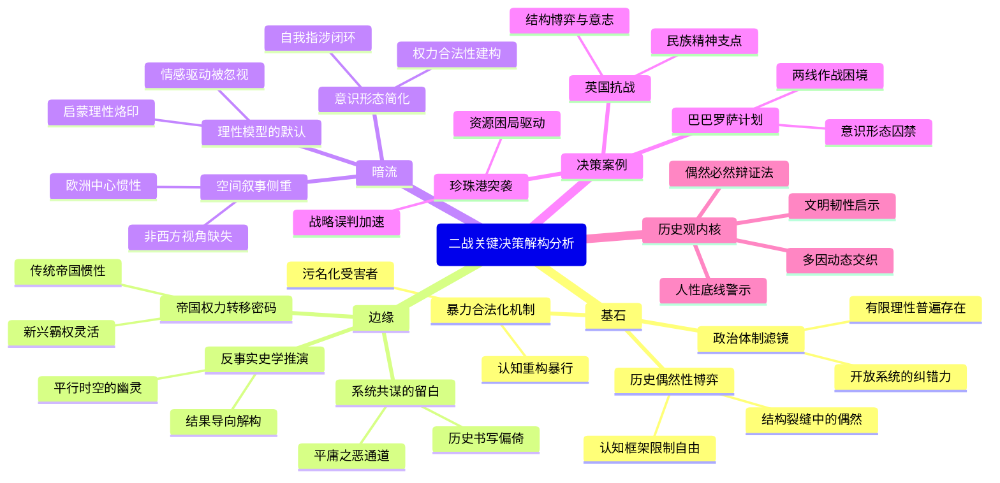

豆瓣链接：https://book.douban.com/subject/27046300/

# 深层解构

### 基石：作者构建一切的支点——核心信念的三重锚点
1. **历史偶然性的祛魅与复魅** 
    - 作者以“十个决策”为解剖刀，划破“历史必然性”的宏大叙事外壳。在分析“英国坚持抗战”时，特意强调1940年5月内阁辩论中哈利法克斯“妥协派”的真实力量，暗示若丘吉尔未能压制主和声音，欧洲权力格局可能走向“德英共治”的另一种可能。这种对“关键少数”的聚焦，本质上是对“经济基础决定论”的温和挑战，主张**结构性压力（如资源、意识形态）与个人意志的动态博弈才是历史引擎**。
    - 但作者的“偶然性”并非绝对随机：在讨论希特勒决定进攻苏联时，反复强调纳粹意识形态对“生存空间”的执念，揭示**决策自由始终被决策者的认知框架所囚禁**——这是其历史观的隐蔽平衡：偶然存在于结构裂缝中，而非真空。
2. **政治体制的决策滤镜** 
    - 全书贯穿一条隐形对比链：民主制（如罗斯福的“租借法案”决策需国会博弈）、威权制（斯大林对情报的误判源于个人崇拜）与极权制（希特勒的“种族灭绝”决策不受任何制约）的决策机制差异。在分析墨索里尼“瓜分世界”的狂想时，特别指出法西斯体制“将领袖神化、权力集中于个人”的结构性缺陷，导致决策沦为“阿谀奉承的产物”。这实质在论证**体制的开放性决定了决策的纠错能力**——一个被意识形态狂热笼罩的封闭系统，必然走向自我毁灭式的决策。
    - 这种体制批判延伸至对“理性决策模型”的质疑：即便是民主制，罗斯福在1941年“不宣而战”的决策也充满政治权衡（如避免触怒孤立主义选民），揭示**所有决策都是“有限理性”的产物，受限于信息、时间与权力博弈**。
3. **暴力的意识形态合法化机制** 
    - 在“希特勒决定屠杀犹太人”章节，作者剥离了“历史惯性”的解释迷雾，直指纳粹意识形态如何将“种族灭绝”包装为“拯救德意志民族”的“必要之恶”。这种分析揭示了一个核心命题：**大规模暴力的实施，必然伴随系统性的认知重构——将屠杀转化为“正义事业”，将受害者污名化为“文明威胁”**。这一逻辑不仅适用于纳粹，也隐约指向日本“大东亚共荣圈”、意大利“恢复罗马荣光”等意识形态对侵略的合理化。

### 边缘：思想曲线的远端——被轻拂的变革性洞见
1. **反事实推演的隐藏野心** 
    - 书中对“替代方案”的分析（如日本若选择“北进”而非“偷袭珍珠港”）看似是历史趣味的点缀，实则暗藏**反事实史学的方法论宣言**：通过假设“如果1940年法国继续抵抗”或“斯大林及时识破巴巴罗萨计划”，作者实则在质问——我们对“二战必然胜利”的认知，多大程度上是事后诸葛亮的建构？这种推演不仅是史学想象力的练习，更是对“结果导向解释”的解构：**历史的迷人之处，恰在于无数“本可能”的幽灵始终在平行时空徘徊**。
2. **帝国衰落的深层逻辑** 
    - 在对比英国1940年“独自抗战”与1941年美国“间接参战”时，作者无意中暴露了一个帝国权力转移的密码：英国决策受制于“全球殖民地包袱”（如新加坡防务对远东战略的牵制），而美国作为新兴霸权，可凭借“孤立主义传统”选择性介入。这暗示**传统帝国的决策往往被“维持现有秩序”的惯性拖累，而新兴强权更具战略灵活性**——这种对比为理解21世纪权力格局提供了历史隐喻。
3. **受害者叙事的缺席与重构** 
    - 全书聚焦于“决策者”视角，却罕见普通民众在决策链条中的作用。但在“希特勒屠杀犹太人”章节的字缝里，隐藏着一个未展开的命题：当纳粹官僚系统将屠杀制度化时，**每一个执行环节的“平庸之恶”如何成为领袖决策的毛细血管**？这种对“结构性暴力”中个体责任的留白，恰恰为读者留下了追问空间：历史书写是否总是倾向于放大“伟人”而忽略“系统共谋”？

### 暗流：未被言说的前提——论证的隐形地基
1. **对“理性行为体”的路径依赖** 
    - 作者假设决策者（如丘吉尔、罗斯福）的行为本质上是“理性计算”（如英国考量生存概率、美国评估参战成本），但忽略了决策中的非理性因素：丘吉尔对“英国荣耀”的浪漫主义执念、希特勒对“历史使命”的病态幻想，这些**情感驱动的决策冲动，可能比“理性权衡”更具决定性**。这种对“理性模型”的默认，暴露了西方史学传统中“启蒙理性”的深层烙印——即便研究非理性政权，仍不自觉地用理性框架切割历史。
2. **意识形态的工具化预设** 
    - 书中将意识形态（如纳粹主义、共产主义）视为决策的“影响因素”，但未深入探讨**意识形态本身如何成为权力合法性的建构工具**。例如，斯大林的“刚愎自用”不仅源于个人性格，更与苏联体制将“领袖正确性”作为意识形态支柱密切相关。这种将意识形态简化为“决策变量”的处理，掩盖了其作为**政权存续必要条件**的本质——当意识形态与权力存亡捆绑时，决策必然走向自我指涉的闭环。
3. **地缘政治的欧洲中心残留** 
    - 尽管纳入日本、中国战场的视角，但全书核心仍围绕“欧洲-大西洋”决策链展开。在分析日本“南进”决策时，对中国战场牵制日军的作用仅一笔带过，这种**空间叙事的侧重**，折射出西方史学界尚未完全摆脱的“欧洲中心主义”惯性——即便在全球化战争的研究中，非西方世界仍常被视为“决策的背景板”，而非主动的历史参与者。

### 给读者的三把钥匙：
- **当你看到“决策”时，追问“被消灭的选项”**：每个选择都是对其他可能性的谋杀，书中被简略的“替代方案”，可能藏着理解历史复杂性的钥匙。
- **当你看到“领袖”时，寻找“体制的阴影”**：希特勒的疯狂决策，本质是纳粹体制筛选机制的必然结果——没有哪个独裁者能脱离其权力机器独自存在。
- **当你看到“胜利”时，想象“失败的可能”**：作者暗示1941年已注定二战结局，但历史的迷人之处，恰在于那些“本可能让我们战栗的平行结局”。

# 章节内容
好的，我将以历史和文化学者的身份，根据伊恩·克肖（Ian Kershaw）的著作《命运攸关的抉择——1940-1941年间改变世界的十个决策》（Fateful Choices: Ten Decisions That Changed the World, 1940-1941），逐章节为您总结其核心内容、作者的关键论点和主张。

---

**导言：命运的枢纽 (Introduction: The Hinge of Fate)**

伊恩·克肖在导言中开宗明义地指出，**1940年至1941年底这段时间是第二次世界大战乃至20世纪历史的“命运枢纽”**。作者认为，正是在这短短的约18个月内，一系列关键决策被相继做出，这些决策不仅决定了战争的走向，也深刻地塑造了战后世界的格局。克肖强调，这些决策并非孤立存在，而是相互关联、相互影响，共同编织了历史的复杂网络。他提出的核心论点是，**这些决策并非不可避免，而是特定历史情境下，由掌握权力的个体或小团体在巨大的压力、不确定的信息和自身意识形态的驱动下做出的选择**。克肖试图探讨的是这些决策的形成过程、背后的动机、可供选择的替代方案（如果存在的话）以及它们所产生的深远后果。他指出，这些决策的做出者——无论是丘吉尔、希特勒、罗斯福、斯大林还是日本的领导层——都面临着各自的困境和机遇。作者意图通过对这些决策的深入剖析，揭示历史进程中的偶然性与必然性，以及个人在历史转折点上的作用。克肖明确表示，他的研究重点在于决策本身及其直接影响，而非对整个战争的全面叙述。他强调，理解这些“命运攸关的抉择”，对于我们理解第二次世界大战如何演变成一场全球冲突，以及它如何为后来的冷战格局奠定基础至关重要。**作者旨在通过聚焦于这些具体的、具有连锁反应的决策，来提供一种理解这段关键历史时期的新视角，强调即使在看似由宏大力量主导的时代，个体和群体的选择依然具有决定性的力量。**

---

**第一章 伦敦，1940年春：英国选择继续战斗 (London, Spring 1940: Great Britain Chooses to Fight On)**

本章聚焦于1940年5月法国溃败后，英国面临的生死抉择：是与纳粹德国媾和，还是继续孤军奋战。克肖详细描述了当时英国政坛的紧张气氛和丘吉尔刚刚上台组建战时联合政府的背景。核心论点在于，**英国继续战斗的决定并非如后世所普遍认为的那样理所当然或全票通过，而是在激烈的内部辩论和巨大的不确定性中艰难做出的。** 作者着重分析了新任首相温斯顿·丘吉尔与外交大臣哈利法克斯勋爵之间的关键分歧。哈利法克斯倾向于通过意大利作为中间人，试探与希特勒达成和平协议的可能性，他认为在法国即将投降、英国远征军在敦刻尔克面临围歼的绝望境地下，寻求“体面”的和平是务实之举，可以保全英国本土和帝国。而丘吉尔则坚决主张战斗到底，他认为与希特勒媾和无异于屈服，将使英国沦为德国的附庸，并断送欧洲自由的希望。克肖指出，**丘吉尔的强大意志、雄辩的口才以及他对纳粹本质的深刻洞察，在说服战时内阁（特别是张伯伦和艾德礼等关键人物）方面起到了决定性作用。** 作者强调，尽管丘吉尔的立场最终胜出，但哈利法克斯的观点在当时具有相当大的合理性和吸引力，如果不是丘吉尔的坚决抵制和巧妙的政治运作，英国的历史道路可能会截然不同。克肖还分析了其他因素，如对希特勒不可信任的普遍认知、维护英国荣誉和独立的决心、以及对美国最终可能参战的一线希望，这些都共同促成了英国选择继续战斗。**这一决策的直接后果是，英国成为了反法西斯抵抗的象征和未来的反攻基地，它阻止了希特勒在西欧取得完全胜利，并为后来美国的介入和最终战胜轴心国创造了前提条件。**克肖认为，这是整个战争中第一个，也是最关键的“命运攸关的抉择”。

---

**第二章 柏林，1940年夏秋：希特勒决定进攻苏联 (Berlin, Summer–Autumn 1940: Hitler Decides to Attack the Soviet Union)**

本章详细阐述了希特勒在1940年夏秋两季，即未能迫使英国屈服之后，如何以及为何做出入侵苏联这一灾难性决策的过程。克肖的核心论点是，**进攻苏联（“巴巴罗萨计划”）是希特勒长期以来意识形态执念的体现，而非仅仅是地缘政治或军事战略的权宜之计。** 他指出，希特勒在其著作《我的奋斗》中早已阐明，夺取东方的“生存空间”（Lebensraum）并摧毁“犹太-布尔什维主义”是纳粹德国的核心目标。尽管《苏德互不侵犯条约》暂时掩盖了这一意图，但在希特勒看来，与苏联的冲突是不可避免且必须进行的。作者分析了促使希特勒在此时下定决心的几个因素：首先，**他错误地判断英国之所以顽抗，是因为寄希望于苏联的介入，因此认为击败苏联就能迫使英国媾和，或者至少使其孤立无援。** 其次，他对苏联红军的实力严重低估，尤其是在苏芬战争中红军表现不佳以及斯大林大清洗削弱了其军事领导层之后。希特勒及其将领们普遍相信，苏联可以在几个月内被迅速击溃。克肖还提到，德国对苏联的石油、粮食等资源的渴求也是一个重要因素，但意识形态的驱动力更为根本。作者详细描述了希特勒与德军高级将领就入侵计划的讨论，指出虽然有一些将领对两线作战表示担忧，但无人能真正阻止希特勒的决心。**克肖强调，希特勒在做出这一决策时，表现出极大的自信甚至自负，他深信自己的历史使命感和战略直觉。** 这一决策的后果是致命的：它使德国陷入了消耗巨大的两线作战，最终导致了纳粹政权的崩溃。克肖认为，这一决定是希特勒个人意志的产物，是其世界观和种族主义狂想的逻辑延伸，也是第二次世界大战走向真正全球化和空前残酷的关键转折点。

---

**第三章 东京，1940年夏秋：日本选择南进并与德意结盟 (Tokyo, Summer–Autumn 1940: Japan Opts for the Southern Advance and the Tripartite Pact)**

本章聚焦于日本在1940年夏秋之际做出的两个相互关联的重大决策：一是确定“南进”战略，即将扩张重心从中国大陆和苏联边境转向东南亚的欧洲殖民地；二是与德国、意大利签订《三国同盟条约》。克肖认为，**这些决策是日本内部多种势力（陆军、海军、外务省、财阀）复杂博弈的结果，其核心驱动力在于确保战略资源（特别是石油、橡胶和矿产）以维持其在中国的战争，并建立所谓的“大东亚共荣圈”。** 作者指出，德国在欧洲的闪电胜利极大地鼓舞了日本的扩张野心，法国和荷兰的战败使得它们在东南亚的殖民地（法属印度支那、荷属东印度）显得唾手可得。相比之下，之前与苏联在诺门坎发生的边境冲突让日本陆军认识到“北进”的巨大风险。因此，海军主张的“南进”策略逐渐占据上风。克肖强调，**《三国同盟条约》的签订，对日本而言，主要目的是威慑美国，阻止其干预日本在亚洲的扩张行动。** 日本领导层错误地判断，与德意结盟可以迫使美国接受日本在亚太地区的“新秩序”。然而，这一举动反而加剧了美日矛盾，促使美国采取更强硬的对日政策，包括最终的石油禁运。作者分析了日本决策层内部的矛盾和短视，他们往往被眼前的战术机会所迷惑，而缺乏长远的战略眼光。**日本的决策者们普遍存在一种“机会主义”心态，试图利用欧洲战事为自身谋利，但他们严重低估了美国的决心和潜在实力。** 克肖认为，日本选择南进并与轴心国结盟，是其走向太平洋战争的关键一步，这一系列决策不仅未能实现其战略目标，反而将其拖入了与强大对手的全面冲突，并最终导致了自身的毁灭。

---

**第四章 华盛顿，1940年夏—1941年春：罗斯福决定援助英国 (Washington, D.C., Summer 1940–Spring 1941: Roosevelt Commits to Aiding Great Britain)**

本章详细考察了美国总统富兰克林·D·罗斯福在1940年夏天至1941年春天期间，如何逐步将美国从孤立主义立场转向积极援助英国，并最终成为“民主国家的兵工厂”。克肖的核心论点是，**罗斯福的决策过程是一个在国内外巨大政治压力下，审慎而巧妙地引导国家舆论和政策走向的过程，其根本目标是确保英国不致崩溃，因为他深知英国的存亡直接关系到美国自身的安全和长远利益。** 作者强调，罗斯福面临着国内强大的孤立主义势力（如“美国第一委员会”）的反对，以及1940年总统大选的压力。尽管如此，罗斯福坚信纳粹德国对世界和平和美国价值观构成根本威胁。克肖详细描述了几个关键步骤：首先是1940年9月的“驱逐舰换基地”协议，美国向英国提供了50艘老旧驱逐舰，以换取在英国海外领土上的基地使用权，这在法律和政治上都打了个擦边球。更具决定性的是1941年3月通过的《租借法案》。**克肖认为，《租借法案》是罗斯福的“政治杰作”，它绕过了《中立法案》的限制，允许美国向“其国防对美国国防至关重要”的国家提供军事物资援助，而无需对方立即付款。** 罗斯福用“邻居家着火，你把浇水软管借给他”的比喻，成功地说服了国会和民众。作者指出，罗斯福的决策不仅基于对国际形势的准确判断，也展现了他高超的政治技巧和领导力。他一方面通过“炉边谈话”等方式争取民心，另一方面在政策制定上步步为营，逐渐突破孤立主义的束缚。**这一系列援助英国的决策，标志着美国外交政策的重大转变，虽然尚未直接参战，但已明确站在反法西斯同盟一边，为日后全面介入战争奠定了物质和道义基础。** 克肖强调，罗斯福的这些选择对于维系英国的抵抗能力，并最终改变战争力量对比，起到了至关重要的作用。

---

**第五章 罗马，1940年秋：墨索里尼进攻希腊 (Rome, Autumn 1940: Mussolini Attacks Greece)**

本章聚焦于意大利独裁者贝尼托·墨索里尼在1940年10月悍然发动对希腊的入侵。克肖的核心论点是，**墨索里尼的这一决策是其个人野心、对希特勒的嫉妒以及对意大利军事实力过分高估的产物，是一次彻头彻尾的战略失误。** 作者指出，墨索里尼渴望建立一个可与纳粹德国相匹敌的地中海帝国，并进行一场独立于德国的“平行战争”。他看到希特勒在欧洲大陆接连取胜，急于证明意大利的军事价值和国际地位，不愿总是扮演“小兄弟”的角色。入侵希腊被墨索里尼视为一个相对容易实现的目标，可以扩大意大利在巴尔干地区的影响力。克肖详细描述了墨索里尼做出决策的过程，强调其决策的随意性和缺乏深思熟虑。**他不仅没有充分征求其军事将领的意见，甚至在很大程度上忽视了希特勒的保留态度（希特勒更希望巴尔干地区保持稳定，以确保罗马尼亚石油供应）。** 墨索里尼及其亲信，如外交部长齐亚诺，都对意大利军队的能力过于乐观，同时严重低估了希腊军队的抵抗意志和巴尔干地区冬季作战的艰难。作者强调，**这次入侵准备不足，情报失误，后勤堪忧，结果是意大利军队在希腊战场上迅速陷入困境，不仅未能速战速决，反而遭到了希腊军队的顽强抵抗和反击。** 这一军事冒险的直接后果是灾难性的：它不仅暴露了意大利军队的虚弱，损害了墨索里尼的声望，更重要的是，**它迫使希特勒不得不分兵介入巴尔干，以援助其陷入困境的盟友。德国对南斯拉夫和希腊的干预，虽然取得了军事胜利，却也因此推迟了原定于1941年春季发动的对苏联的“巴巴罗萨计划”数周之久。** 克肖认为，墨索里尼的这一“愚蠢的决定”不仅是意大利自身的悲剧，也对整个二战的进程产生了意想不到的连锁反应，间接为苏联争取了宝贵的备战时间。

---

**第六章 莫斯科，1941年春夏之交：斯大林信任希特勒 (Moscow, Spring–Early Summer 1941: Stalin Trusts Hitler)**

本章深入探讨了在1941年德国入侵前夕，苏联领导人约瑟夫·斯大林为何无视大量关于纳粹即将进攻的情报，坚持认为希特勒会遵守《苏德互不侵犯条约》。克肖的核心论点是，**斯大林的这种“信任”或者说误判，源于其多疑的个性和独特的政治逻辑，他固执地相信自己能够看透希特勒的意图，并认为所有关于德国入侵的警告都是西方国家企图挑拨苏德关系的阴谋。** 作者详细梳理了在1941年春季和初夏，来自苏联自身情报机构、英国甚至德国内部反纳粹人士的关于德军集结和入侵计划的警告，这些情报日益增多且具体。然而，斯大林对此置若罔闻，甚至惩罚那些传递“危言耸听”信息的人。克肖分析了斯大林心态的几个层面：首先，**他可能认为希特勒在彻底击败英国之前，不会冒险开辟东线战场。** 其次，斯大林可能将这些警告视为英国的离间计，目的是将苏联拖入与德国的战争，从而减轻英国自身的压力。再次，**斯大林对自己与希特勒签订的条约以及他个人对希特勒的“理解”抱有某种病态的自信，认为可以通过外交手段和继续履行经济协定来安抚德国，避免冲突。** 他害怕任何可能被德方解读为挑衅的军事准备，因此严格限制边境部队的戒备状态。克肖强调，斯大林的这种固执己见和对情报的错误解读，并非完全缺乏理性，而是基于其扭曲的世界观和权力运作方式。**他倾向于相信自己愿意相信的东西，并且在他一手缔造的恐怖政治氛围中，下属们不敢提供与他意愿相悖的真实信息或强烈建议。** 这一灾难性误判的直接后果是，当德军于1941年6月22日发动“巴巴罗萨”行动时，苏联红军措手不及，遭受了毁灭性的初期损失，国家一度濒临崩溃。克肖认为，斯大林的这种“信任”是二战中最令人费解且代价最为高昂的个人决策失误之一。

---

**第七章 华盛顿，1941年夏秋：罗斯福发动不宣而战的海战 (Washington, D.C., Summer–Autumn 1941: Roosevelt Wages Undeclared War)**

本章主要阐述了1941年夏秋两季，在美国尚未正式参战的情况下，罗斯福总统如何通过一系列行政命令和海军部署，实际上将美国拖入了与德国在大西洋上的“不宣而战”的海战。克肖的核心论点是，**罗斯福在努力维持官方中立与全力支持英国（及后来的苏联）之间走钢丝，他逐步升级美国海军在大西洋的介入程度，旨在确保《租借法案》下的物资能够安全运抵盟国，并以此作为向轴心国施压、同时教育美国民众认清战争威胁的手段。** 作者指出，随着德国U型潜艇对大西洋航线的威胁日益严重，罗斯福意识到仅仅提供物资是不够的，还必须确保这些物资能够运到。因此，他采取了一系列措施：扩大美国海军的巡逻范围，与冰岛达成协议派遣美军驻防，并开始为前往英国的商船队提供部分护航。克肖强调了“格里尔号事件”（USS Greer）的重要性。1941年9月，美国驱逐舰“格里尔号”遭到德国潜艇攻击（尽管是美舰先追踪德潜艇），罗斯福利用这一事件发表了著名的“开火即射”（shoot-on-sight）演说，**下令美国海军对任何在“美国认为对其国防至关重要的水域”威胁美国或悬挂美国护航旗帜船只的轴心国舰艇，可以不经警告立即开火。** 这一政策实质上标志着美国在大西洋上对德意进入了有限的战争状态。克肖认为，罗斯福的这些决策是在极其复杂的国内政治环境下做出的，他既要应对孤立主义者的强烈反对，又要避免过早地将国家全面拖入战争，以免引起民意反弹。**罗斯福的策略是渐进式的，他试图通过实际行动而非正式宣战，来逐步提升美国对战争的参与度。** 作者认为，罗斯福的这些举措虽然冒险，但对于维护大西洋生命线、支援盟国以及最终促使美国民众接受参战的必要性，都起到了关键作用。这一系列决策也使得美德之间的直接军事冲突几乎不可避免。

---

**第八章 东京，1941年秋冬：日本走向战争 (Tokyo, Autumn–Early Winter 1941: Japan Goes to War)**

本章详细分析了日本在1941年秋冬季节，最终做出对美国、英国和荷兰发动全面战争的决策过程。克肖的核心论点是，**日本的这一决策是在美国日益强硬的经济制裁（特别是石油禁运）压力下，以及国内主战派军人势力（尤其是陆军和部分海军强硬派）推动下，在一种“别无选择”的绝望感和孤注一掷的冒险心态中做出的。** 作者指出，1941年7月美国对日本实施石油禁运，这对严重依赖进口石油的日本来说是致命一击，使其战争机器面临停摆的危险。日本领导层面临两个选择：要么屈从于美国的要求（包括从中国撤军等），要么通过战争夺取东南亚的石油等战略资源。克肖强调，**日本军政领导层普遍认为，屈从于美国是不可接受的奇耻大辱，将葬送日本数十年的扩张成果和“帝国荣耀”。** 因此，尽管与美国开战风险巨大，但在他们看来，不战而降的后果更为严重。作者详细描述了日本御前会议的多次讨论，以及主和派（如近卫文麿首相）与主战派（以东条英机为代表的军方）之间的角力。最终，主战派占据上风，东条英机组阁，战争机器全面开动。克肖指出，**日本决策者们对形势存在严重误判：他们低估了美国的战争潜力和复仇决心，寄望于通过一次突袭（如珍珠港）重创美国太平洋舰队，从而迫使美国在短期内接受谈判，承认日本在亚洲的“新秩序”。** 他们相信“大和魂”可以弥补物质力量的不足。作者认为，日本的决策过程充满了非理性因素、群体思维以及对自身能力的盲目自信。**这一决定性的步骤——偷袭珍珠港并向东南亚大举进攻——将太平洋地区彻底卷入战火，也直接导致了美国全面参战，从而使欧洲战争和亚洲战争合流为一场真正的世界大战。** 这是日本军国主义走向覆灭的开始。

---

**第九章 柏林和华盛顿，1941年秋冬：希特勒对美宣战 (Berlin and Washington, D.C., Autumn–Early Winter 1941: Hitler Declares War on the United States)**

本章探讨了1941年12月珍珠港事件后，希特勒令人费解地迅速对美国宣战的决策。克肖的核心论点是，**希特勒对美宣战并非《三国同盟条约》的必然要求（条约规定仅在缔约国遭受攻击时才有义务介入），而更多是出于其意识形态偏见、对美国实力的低估、以及一种试图夺回战略主动权的冲动。** 作者指出，希特勒长期以来对美国抱有蔑视，认为美国是一个种族混杂、被犹太人控制的腐朽国家，缺乏战斗意志和军事效率。珍珠港事件的发生，以及日本在初期取得的惊人胜利，似乎印证了他的这种看法，并让他感到鼓舞。克肖分析，希特勒可能认为，既然美日已经开战，美国迟早会全面介入欧洲战场，不如先发制人，主动宣战，这样可以在道义和宣传上占据主动，并希望日本能有效牵制美国在太平洋的力量，从而减轻德国在欧洲的压力。**希特勒也可能受到其“世界犹太阴谋论”的影响，认为罗斯福是这一阴谋的代理人，对美宣战是打击这一全球敌人的必要步骤。** 作者强调，这是一个“非理性”且极具灾难性的决策。当时德国在苏联前线已经陷入困境，主动将世界上最强大的工业国——美国——完全拉入敌对阵营，无疑是雪上加霜。**克肖认为，希特勒的这一决定极大地简化了罗斯福的处境。** 尽管美国因珍珠港事件已对日宣战，但若希特勒不主动宣战，罗斯福要在国内孤立主义情绪依然存在的情况下，说服国会和民众同意优先介入欧洲战场，可能会面临更大困难。希特勒的宣战，使得美国可以名正言顺地将“德国优先”作为其全球战略。**这一决策最终将德国置于一个无法取胜的境地，面对的是苏联、英国和美国这三大工业和军事强国的联合绞杀。** 克肖将此视为希特勒在战略层面犯下的最致命错误之一，加速了纳粹德国的败亡。

---

**第十章 柏林，1941年夏秋：希特勒决定实施“最终解决方案” (Berlin, Summer–Autumn 1941: Hitler Decides on the "Final Solution")**

本章聚焦于纳粹德国在1941年夏秋之际，如何从对犹太人的迫害和零星屠杀，逐步升级到制定并开始实施系统性的、旨在灭绝整个欧洲犹太民族的“最终解决方案”（Endlösung）。克肖的核心论点是，**“最终解决方案”的决策并非单一日期、单一命令的结果，而是一个在特定历史背景下（特别是入侵苏联之后），由希特勒发出明确信号、由其核心追随者（如希姆莱、海德里希）积极推动和具体化的逐步升级过程。** 作者指出，对犹太人的仇恨是纳粹意识形态的核心，但灭绝的具体计划和实施方式是在战争进程中逐渐形成的。入侵苏联是一个关键的转折点。**随着德军向东推进，数百万苏联境内的犹太人落入纳粹之手，这使得原有的驱逐或隔离政策显得“不切实际”。同时，战争的残酷化和意识形态的狂热化，为更为极端的措施打开了大门。** 特别行动队（Einsatzgruppen）在东线已经开始了大规模的屠杀。克肖强调，虽然可能没有一份由希特勒签署的明确书面命令，但**有充分证据表明，希特勒在不同场合向其高级党羽（尤其是希姆莱）发出了消灭犹太人的明确意愿和授权。** 这些“元首的愿望”被下级积极领会和执行，并转化为具体的屠杀行动和灭绝营的建立计划（如1942年初的万湖会议）。作者分析，希特勒的决策受到多种因素影响：根深蒂固的反犹主义、战争带来的“机遇”（认为在战时更容易掩盖暴行）、以及将苏联的抵抗归咎于“犹太-布尔什维主义”的阴谋论。**克肖认为，1941年夏秋是决策的关键时期，因为正是在这段时间，零散的屠杀开始向有组织的、工业化规模的种族灭绝转变。** 这一决策的后果是人类历史上最黑暗的一页——犹太人大屠杀（Holocaust），数百万无辜者惨遭杀害。克肖将此决策视为纳粹政权反人类本质的极致体现，是其所有罪行中最令人发指的一项。

---

**结语：后果 (Epilogue: Consequences)**

在结语部分，伊恩·克肖总结了他在书中探讨的十个关键决策所产生的深远而持久的后果。他重申，**1940年至1941年间做出的这些选择，不仅决定性地塑造了第二次世界大战的进程和结局，也为战后世界的政治、经济和道德版图奠定了基础。** 克肖强调这些决策之间的相互关联性：例如，英国选择继续战斗，为罗斯福援助英国的决策提供了前提；而希特勒进攻苏联和对美宣战，则极大地改变了战争的规模和性质，并最终导致了轴心国的失败。日本的南进和对美开战，则将战火从欧洲和亚洲大陆延烧至整个太平洋。作者指出，这些决策的后果是多方面的。**最直接的是战争的全球化和空前惨烈的人员伤亡与物质破坏。** 但更长远地看，它们导致了旧殖民帝国的瓦解、美国的崛起成为超级大国、苏联的扩张及其与西方世界的冷战对峙。犹太人大屠杀作为“最终解决方案”的骇人后果，则永远改变了人类的道德认知，并促使国际社会在战后寻求建立防止此类暴行重演的机制（如联合国和国际法）。克肖再次强调了**历史的偶然性和个体选择的重要性**。他认为，尽管存在着强大的结构性因素和历史趋势，但在这些关键时刻，领导者的个人品质、判断、偏见和决心，都对历史的走向产生了不可估量的影响。**这些“命运攸关的抉择”表明，历史并非预先注定，而是充满了可能性和转折点，人类的选择——无论是明智还是愚蠢，高尚还是邪恶——都具有塑造未来的力量。** 克肖通过回顾这些决策及其后果，提醒读者深刻反思战争的根源、权力的本质以及人类在面对危机时的责任。

## 对于这些决策，作者整体有何看法，体现了怎样的历史观
作者认为这些二战时期各国的关键决策深刻地塑造了战争的走向与结局，并且反映出当时复杂的国际关系、国内政治格局、领导人的性格与理念以及各种历史偶然与必然因素的交织。

从历史观来看，作者强调决策过程并非单一因素决定，而是多种力量相互作用的结果。例如英国的独自抗战决策，不仅源于丘吉尔等领导人的坚定信念，也与英国的历史传统、地缘政治地位以及民众的抗战意愿息息相关，体现出在民族危亡时刻，国家的核心价值与民族精神能成为支撑艰难抉择的强大动力。

希特勒进攻苏联的决策则凸显了独裁者个人野心与战略误判对国家命运的巨大影响。纳粹德国在初期胜利的光环下走向了过度扩张的不归路，反映出极权统治下决策缺乏有效制衡与理性评估的风险，这种决策导致德国陷入两线作战的绝境，也从侧面说明战争的胜负不仅仅取决于军事力量，合理的战略规划与对局势的准确判断至关重要。

日本的决策体现了军国主义扩张的疯狂与短视。其在亚洲的侵略行径以及最终对美开战，是资源匮乏、军事冒险主义和对国际形势错误估计的综合结果，表明一个国家如果被极端思想主导，忽视自身实力与国际正义，必然走向失败。

墨索里尼的选择则揭示了盲目追随与不切实际的扩张幻想的危害。意大利在自身实力不足的情况下卷入战争，反映出法西斯政权内部的虚荣与混乱，以及在国际竞争中缺乏独立思考和稳健战略的严重后果。

罗斯福的决策展示了在民主政治框架内，领导人如何在复杂的国内舆论环境下，基于国家长远利益和国际道义，逐步引导国家走向战争参与。美国从孤立主义到伸出援手再到不宣而战，体现了国际关系中利益权衡、舆论引导以及战略布局的动态变化过程。

斯大林的失误则警示了过度自信与情报误判的危险。苏联在战前的准备不足，反映出在复杂的国际局势下，即使强大的国家也可能因内部政治因素和决策失误而遭受重创，但同时也体现了国家综合实力与民族韧性在战争中的重要性，苏联在经历初期挫折后能够扭转战局，显示出深厚的战争潜力与民族凝聚力。

而希特勒屠杀犹太人的决策，被作者强烈批判为反人类的暴行，这一决策将纳粹德国的邪恶本质暴露无遗，也表明违背人类基本道德和文明准则的行为最终会使一个政权在国际社会中彻底孤立，从根本上动摇其统治根基，体现出人类文明的底线与正义的力量在历史进程中不可忽视的作用。

总体而言，作者秉持一种多因素综合分析的历史观，通过对这些决策的深入剖析，揭示了历史发展是由政治、经济、文化、人物性格等多方面因素相互碰撞、相互影响而形成的复杂进程，同时也强调了正义、理性、稳健战略以及尊重人权等价值在国家兴衰和历史走向中的关键意义。 