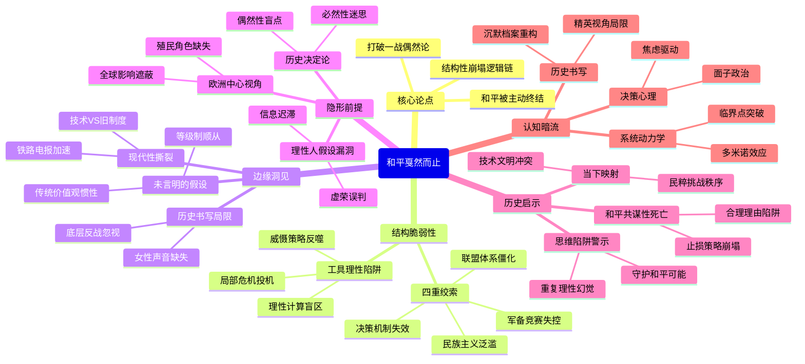

豆瓣链接：https://book.douban.com/subject/36089295/

# 深层解构

### 《和平戛然而止：通往1914年之路》深层解码

#### 一、基石：结构性崩塌的逻辑链
作者玛格丽特·麦克米伦的核心支点，是打破“一战偶然论”的迷思，构建起**“和平是被主动终结的”**这一因果网络。她反复回归的论证基石有三：
1. **决策者的“工具理性”陷阱**  
   书中揭示，从德皇威廉二世到各国政客，无人想打一场全面战争，却都在**“局部危机中投机”**——用巴尔干冲突测试联盟忠诚度，以军备竞赛威慑对手，借民族主义凝聚国内共识。这种“每次危机都踩钢丝”的策略，最终让战争从“不可想象”变成“不可避免”。如奥匈对塞尔维亚的军事冒险，初衷是“快速压制小国”，却触发多米诺骨牌。
2. **系统脆弱性的四重绞索**  
   - **联盟体系**：英法俄vs德奥意的二元对立，让地区冲突必然升级为全面战争（如萨拉热窝事件后，俄国因同盟义务卷入奥塞冲突）；  
   - **军备竞赛**：英德无畏舰竞赛不仅消耗国力，更制造“先发制人”的心理焦虑（德国担忧俄法军备扩张，试图“趁优势时决战”）；  
   - **民族主义**：巴尔干斯拉夫民族主义挑战奥匈帝国，同时激化德国“生存空间”焦虑，使“小国问题”成为大国角力场；  
   - **决策机制**：君主制下的个人意志（如德皇反复无常的外交决策）与官僚体系的信息迟滞（俄国动员令的混乱），让理性决策成为奢望。
3. **历史的“后视镜”幻觉**  
   作者反对“后人眼中的必然”，强调当时人对和平的盲目自信。如1914年前夕，欧洲仍在举办世博会、资本跨国流动，多数人认为“战争只会是局部摩擦”——这种对现状的误判，恰是和平崩塌的心理基础。

#### 二、边缘：被轻拂的颠覆性洞见
1. **“未言明的假设”的致命性**  
   书中第九章提到，1914年的欧洲人被“等级制、对权威的服从、宗教价值观”等“未被讨论的共识”支配。这暗示：**传统秩序的合法性，反而让民众更容易接受战争动员**——当皇帝宣布“保家卫国”时，底层不会质疑战争的真正目的。这种“集体无意识”的顺从，比政治家的算计更可怕。
2. **现代性与传统的撕裂**  
   作者提到“旧有农业社区与新兴工业文明并存”，但未深入：工业化带来的技术进步（如铁路加速军队调动）与传统王朝政治的碰撞，如何制造结构性矛盾？比如，电报让决策节奏加快，却使君主制难以应对突发危机；民族主义借媒体传播，冲击多民族帝国的统治合法性。
3. **女性与底层的“缺席”**  
   全书聚焦精英决策，却忽略女性反战运动（如1914年国际妇女大会）、工人罢工对战争的潜在抵制——这些“边缘声音”若被听见，是否可能改变历史？作者的“精英视角”无意中暴露了史学书写的权力结构。

#### 三、暗流：论证背后的隐形前提
1. **“理性人”假设的漏洞**  
   作者默认决策者是“权衡利弊的理性主体”，但忽略了**非理性因素**：德皇的虚荣（因面子拒绝调停）、俄国外交官的误判（误读德国动员信号）、官僚体系的“路径依赖”（法军坚持“进攻至上”的作战计划）。这些“人性弱点”与结构性因素交织，才是战争爆发的真实肌理。
2. **“欧洲中心论”的惯性**  
   尽管书中提到日本、美国的国际角色，但核心仍是欧洲列强的博弈。这背后隐藏着**“一战是欧洲内战”的预设**，却忽视了战争对殖民地的影响（如印度士兵被卷入欧洲战场，埋下反殖民火种）——这种视角限制，让读者难以看见“欧洲崩塌如何催生全球秩序重组”。
3. **“历史可解释性”的自负**  
   作者试图穷举所有因果链，但历史的吊诡在于：**某些关键转折可能源于偶然**（如斐迪南遇刺者加夫里洛·普林西普若当天迟到几分钟，可能刺杀失败）。承认偶然性的存在，并非否定结构性分析，而是让我们对“历史必然性”保持警惕——这恰是作者论证中未敢直视的“盲点”。

### 穿透文字的三重启示
- **顿悟**：这本书真正在说，**和平不是被“弄丢”的，而是被各方用“合理理由”共同杀死的**。每个决策者都在“止损”“威慑”“维护荣誉”，却共同挖空了和平的地基。  
- **惊喜**：若换个角度看，一战前的欧洲像极了今天的世界——技术进步与文明冲突并存，民粹主义挑战国际秩序，大国在“局部危机”中试探红线。作者的警示不仅是历史总结，更是对当下的预警。  
- **发现**：作者未意识到，她的“结构性分析”本身也陷入了“决定论”陷阱。或许真正的历史智慧，在于承认**必然性与偶然性的永恒博弈**——就像1914年的夏天，既是无数因果的“终点”，也是无数偶然的“起点”。

### 思想接力的下一棒
合上书时，请思考：当我们用“体系脆弱性”“利益冲突”解释国际危机时，是否也在重复书中决策者的“理性幻觉”？在算法主导信息、民粹撕裂社会的今天，我们该如何守护那些“未被言说的和平可能”？这，或许是这本书留给当代读者最珍贵的礼物。

# 章节内容
### 导论：战争还是和平？

玛格丽特·麦克米伦在本书的开篇便提出了核心问题：**欧洲是如何从一个看似和平与繁荣的时代，步入一场史无前例的毁灭性战争的？**作者明确指出，将第一次世界大战的爆发视为不可避免的宿命，是一种简单化且危险的观点。 麦克米伦的核心主张是，战争并非命中注定，而是由一系列具体的决策、误判和个人选择共同导致的。她引用其曾外祖父、英国战时首相劳合·乔治的话，形容当时的欧洲各国“在战争这口沸腾的大锅边缘游走，看不出有任何的惊慌和忧虑”，揭示了当时普遍存在的侥幸与麻痹心态。

本章旨在打破后视镜的偏见，带领读者回到1914年之前的欧洲，从当时人们的视角去理解他们的所思所想。麦克米伦强调，理解“一战”的关键在于剖析那些手握权力的决策者——国王、皇帝、外交家和将军们的思想、动机和局限性。同时，她也点出了影响决策的更广泛背景，包括日益高涨的民族主义、深刻的社会变革、僵化的军事同盟体系以及激烈的军备竞赛。作者特别提到了历史学家詹姆斯·乔尔所说的**“未言明的假设”**（unspoken assumptions），即那些被当时的欧洲人内化于心，不加讨论便接受的观念，例如对国家荣誉的执着、对战争作为解决争端最终手段的接受，以及对社会达尔文主义的信奉。

麦克米伦认为，尽管存在诸多导致紧张局势的结构性因素，但和平的可能性始终存在。在1914年之前的数十年里，欧洲曾多次成功化解了类似的危机。因此，问题的关键在于，为何在1914年夏天，和平的努力最终失败了？作者意图通过对战前几十年关键决策点的细致梳理，揭示那些逐步缩小和平选择范围的转折点，并最终回答这个核心问题：**为什么和平会戛然而止？**

### 第一章：1900年的欧洲

本章描绘了一幅1900年巴黎世博会所代表的欧洲盛世图景，一个充满了乐观主义、科技进步和文化繁荣的时代。麦克米伦以此次盛会为切入点，生动地展示了20世纪初欧洲普遍的自信与骄傲。当时的欧洲，在经济、军事和文化上都处于世界的主导地位，人们普遍相信自己正处在一个前所未有的黄金时代，未来将是更加幸福和繁荣的。**这种对进步的坚定信念，掩盖了大陆内部深刻的矛盾与不安。**

作者指出，1900年的欧洲是一个新旧交织的复杂体。一方面，工业革命带来的铁路、电报和蒸汽船等技术革新，极大地推动了全球化和经济的相互依存，使得许多人相信大规模战争已经不再可能，因为其经济代价将是毁灭性的。另一方面，**旧有的制度和价值观依然强大**。古老的帝国（如奥匈帝国、俄罗斯帝国和奥斯曼帝国）与新兴的民族国家（如德国和意大利）并存，君主制和贵族政治仍在欧洲大陆占据主导地位。这些旧制度的掌权者们，面对日益壮大的社会主义运动、工人阶级的诉求以及风起云涌的民族主义浪潮，感受到了深刻的威胁。

麦克米伦在这一章的关键论点是，**欧洲表面的和平与繁荣之下，潜藏着深刻的结构性紧张和对抗的种子**。各个大国之间充满了不信任和竞争。法国对普法战争的失败耿耿于怀，渴望复仇；德意志帝国作为一个崛起的新兴强国，急于在世界上获得“阳光下的土地”；大英帝国则以其“光荣孤立”的姿态，警惕地注视着任何可能挑战其海上霸权的对手；奥匈帝国和俄罗斯帝国则在巴尔干地区展开了激烈的争夺。作者认为，**“生活已经现代化了，但是制度还停留在过去，很多人在精神上还停留在过去”**。这种新旧之间的矛盾，现代经济与古老政治之间的脱节，为未来的冲突埋下了伏笔。因此，1900年的欧洲既是希望的顶点，也是危机的开端。

### 第二章：大不列颠与光荣孤立

在这一章中，麦克米伦将焦点对准了当时的世界第一强国——大英帝国。她深入剖析了英国在19世纪末20世纪初奉行的“光荣孤立”（Splendid Isolation）外交政策的实质、优势与日益凸显的困境。在维多利亚时代晚期，英国凭借其无人能及的海军力量、庞大的殖民帝国和领先的工业经济，得以在欧洲大陆的纷争之外保持超然地位。**“光荣孤立”的核心思想是，英国应避免与任何欧洲大国结成永久性的军事同盟，以便在国际事务中拥有最大的行动自由，并以“欧洲均势”的维持者自居。**

然而，作者指出，进入20世纪后，这一政策正面临前所未有的挑战。首先，布尔战争的巨大消耗暴露了英国军事力量的局限性，并使其在国际上陷入孤立，引来了其他欧洲列强的普遍恶感。这使得英国决策者开始质疑，“光or孤立”是否真的“光荣”，抑或只是危险的“孤立”。其次，其他大国的崛起，特别是德国海军的迅速扩张和俄罗斯在亚洲的野心，直接威胁到了英国的全球利益和本土安全。**英国人逐渐意识到，仅凭自身力量，可能无法同时应对来自欧洲和全球的多重威胁。**

麦克米伦详细探讨了英国统治精英内部关于是否应放弃“光荣孤立”的激烈辩论。以首相索尔兹伯里勋爵为代表的传统派，依然坚信结盟会带来不必要的束缚和战争风险。而另一派，如殖民地事务大臣约瑟夫·张伯伦，则积极主张与德国结盟，认为英德这两个“条顿”民族国家拥有天然的亲近感，联合起来可以共同对抗法国和俄罗斯。然而，**英德之间多次结盟谈判的失败，凸显了两国间深刻的结构性矛盾和互不信任**。德国要求英国加入其主导的“三国同盟”（德、奥、意），而英国则希望获得德国对其帝国利益的支持，双方的期望差距甚远。最终，麦克米伦认为，**“光荣孤立”政策的终结是必然的**，但英国将向何方——是与德国结盟，还是与昔日的对手法国和俄罗斯和解——将是决定未来欧洲格局的关键。这一章清晰地描绘了英国从自信的孤立主义者，转变为一个寻求盟友的积极参与者的心路历程，为后续英法协约和英俄协约的形成埋下了伏报。

### 第三章：“顽童为王，国家之祸！”

本章的标题精准地概括了作者对德意志第二帝国皇帝威廉二世的刻画。麦克米伦将威廉二世的个人性格——他那**冲动、虚荣、好斗且极度不安全的复杂个性**——视为影响德国乃至整个欧洲政治走向的一个关键变量。威廉二世于1888年即位，他罢黜了经验丰富的“铁血宰相”俾斯麦，急切地希望将德国带入一个由他主导的新时代。然而，他缺乏俾斯麦的政治远见和外交手腕，其反复无常的决策风格常常让德国的外交政策陷入混乱和自相矛盾的境地。

麦克米伦认为，威廉二世的性格缺陷深刻地影响了德国的内政外交。他一方面极度钦佩其外祖母维多利亚女王治下的英国，特别是英国强大的海军和广阔的殖民地；另一方面，他又对英国怀有强烈的嫉妒和怨恨，渴望德国能够超越英国，成为世界头号强国。这种矛盾心态的直接产物，就是他全力推动的“世界政策”（Weltpolitik）。为了实现这一目标，他痴迷于建立一支能与英国皇家海军相匹敌的强大舰队，认为这是德国获得世界性大国地位的必要标志。**威廉二世的名言“我们的未来在海上”，既是德国雄心的体现，也直接挑战了英国的海上霸权，从而开启了破坏性的英德海军竞赛。**

作者的关键论点是，**威廉二世的个人统治，极大地加剧了欧洲的紧张局势**。他的许多公开言论和外交举动，如“每日电讯报事件”和两次摩洛哥危机中的强硬姿态，往往是出于虚荣心和表现欲，却在国际上造成了灾难性的后果，疏远了潜在的盟友（如英国），并加深了对手（如法国和俄罗斯）的敌意。麦克米伦并非将战争的责任完全归咎于威廉二世一人，但她强调，这位“顽童”国王的性格与权力结合在一起，使得德国的对外政策充满了不可预测性和侵略性。他破坏了俾斯麦苦心经营的欧洲力量均势，将德国置于一个日益孤立和被包围的境地。本章通过对威廉二世生动的心理和行为分析，揭示了个人因素如何在20世纪初的欧洲政治舞台上，扮演了举足轻重的破坏性角色。

好的，我将继续为您总结《和平戛然而止：通往1914年之路》一书的后续章节。

### 第四章：德国的“世界政策”

本章聚焦于威廉二世皇帝治下，德国所推行的“世界政策”（Weltpolitik）。麦克米伦详细阐述了这一政策的动机、内涵及其对欧洲国际关系的破坏性影响。在俾斯麦时代，德国的外交重心是维持欧洲大陆的稳定与均势，以确保新生的德意志帝国的安全。然而，威廉二世和以其亲信伯恩哈德·冯·比洛（后来的首相）为代表的新一代领导人，不再满足于此。他们认为，德国作为一个在工业、经济和人口上都已成为欧洲一流的国家，**理应在全球事务中扮演更重要的角色，获得“阳光下的土地”**，即拥有与英、法等老牌帝国相称的殖民地和全球影响力。

作者的核心论点是，**德国的“世界政策”本质上是模糊、缺乏连贯性且极具挑衅性的**。它更多的是一种野心的宣示，而非经过深思熟虑的战略规划。这一政策在实践中表现为一系列机会主义的、咄咄逼人的外交行动，试图在世界各地挑战现有国际秩序，攫取利益。麦克米伦指出，无论是试图在中国划分势力范围，还是在太平洋地区争夺岛屿，亦或是在奥斯曼帝国内部扩张经济影响（如巴格达铁路项目），德国的每一次出击都不可避免地触动了其他大国的敏感神经。尤其是英国，将德国的全球野心视为对其殖民帝国和商业利益的直接威胁。

麦克米伦进一步分析，“世界政策”也是德国国内政治的产物。面对国内日益壮大的社会主义运动和工人阶级的政治诉求，德国的保守精英们希望**通过煽动民族主义情绪和追求对外扩张的荣耀，来转移国内矛盾，巩固现有统治秩序**。换言之，外交上的成功被用作凝聚国民认同、对抗国内政治变革的工具。然而，这种策略的后果是灾难性的。它不仅未能有效解决国内问题，反而使德国在国际上树敌众多，加深了英、法、俄等国对德国意图的疑虑和恐惧，促使它们最终走到了一起。德国的“世界政策”最终未能为其赢得所渴望的全球地位，反而亲手打造了一个包围自己的敌对同盟。

### 第五章：无畏战舰：英德海军竞赛

这一章是全书的关键章节之一，麦克米伦集中论述了战前最重要、也最致命的军备竞赛——英德海军竞赛。作者认为，这场竞赛不仅是两国国力与工业技术的较量，更是一场关乎国家荣誉、安全和未来命运的心理战。竞赛的导火索是德国海军上将阿尔弗雷德·冯·提尔皮茨在其“风险理论”指导下制定的庞大造舰计划。**提尔皮茨的核心主张是，德国必须建立一支足够强大的舰队，使其即使无法战胜英国皇家海军，也能对其构成严重威胁，从而迫使英国在外交上对德国做出让步，或者在与德国发生冲突时犹豫不决。**

麦克米伦深刻地指出，德国的这一逻辑存在致命缺陷。对英国而言，**强大的海军并非选项，而是其作为岛国和全球帝国的生命线**。英国的生存依赖于海上贸易和与殖民地的联系，任何对其海上霸权的实质性挑战，都将被视为对其国家存亡的直接威胁。因此，英国别无选择，只能以数倍的决心和投入来回应德国的挑战。1906年，英国“无畏号”战列舰的下水，以其革命性的设计（统一口径主炮、高航速）宣告了此前所有战舰的过时，这在客观上抹平了英德海军原有的数量差距，反而刺激了竞赛的进一步升级。

作者的核心观点是，**海军竞赛彻底摧毁了英德之间任何达成谅解的可能性，并成为将英国推向法俄阵营的决定性因素**。尽管两国在竞赛期间曾多次尝试进行谈判，试图限制造舰规模，但都因双方根深蒂固的不信任而失败。德国将削减海军建设与英国承诺在欧洲冲突中保持中立挂钩，而英国则无法接受任何会削弱其海军优势的条件。这场耗资巨大的竞赛，不仅给两国带来了沉重的财政负担，更重要的是，它在两国公众和政治精英中制造了深刻的敌意和“战争不可避免”的预期。正如温斯顿·丘吉尔所言，对德国来说，海军是一种“奢侈品”，而对英国来说，海军则是“必需品”。这场竞赛最终的结果是，英国成功维持了其海军优势，但代价是“光荣孤立”的彻底终结和一个剑拔弩张的欧洲。

### 第六章：不般配的盟友：英法协约

本章探讨了1904年英法协约（Entente Cordiale）的形成过程，麦克米伦将其描绘为欧洲外交格局的一次革命性转变。英法两国在历史上是长期的竞争对手，在全球殖民地问题上摩擦不断，尤其是在非洲。然而，到20世纪初，两国都面临着一个共同的、日益增长的威胁——德意志帝国。**作者的核心论点是，英法协约的达成，并非基于两国突然产生的友谊或共同的价值观，而是一次基于现实主义利益计算的战略选择，是双方共同应对德国挑战的必然结果。**

麦克米伦详细追溯了协约达成的关键推手。在法国方面，外交部长泰奥菲尔·德尔卡塞是主要的设计师。他清醒地认识到，在普法战争失败后，法国仅凭一己之力无法对抗德国，而其盟友俄国在远东与日本的冲突中日益陷入困境，难以指望。因此，与英国达成和解，消除双方在海外的摩擦，并将英国拉入法国的防御体系，成为法国外交的优先事项。在英国方面，国王爱德华七世的个人魅力和他对巴黎的成功访问，为两国和解营造了良好的氛围。更重要的是，英国决策者们，如外交大臣兰斯多恩勋爵，越来越清楚地看到，**德国的海军扩张和“世界政策”是对英国安全最主要的威胁**。

英法协约的直接内容是解决两国在埃及、摩洛哥、暹罗（泰国）等地的殖民地争端，其本身并非一个军事同盟。然而，麦克米伦强调，**协约的象征意义和潜在的军事含义远远超出了其字面条款**。它标志着英国“光荣孤立”政策的正式终结，并为两国未来进行军事合作铺平了道路。随后，两国总参谋部开始就一旦欧洲爆发战争，英国将如何派遣远征军支援法国进行秘密会谈。这种合作，虽然在官方层面没有形成正式的、有约束力的条约，却在两国军方和部分政客心中创造了一种“道义上的承诺”。这使得德国的被包围感日益加深，也使得欧洲两大对立阵营的轮廓——德奥同盟对阵法俄同盟（现在又有了英国的非正式支持）——变得愈发清晰。

### 第七章：熊与鲸

本章的标题形象地比喻了俄国（熊）与英国（鲸）这两个昔日的帝国竞争对手。麦克米伦在本章中阐述了1907年英俄协约的签订过程，这是继英法协约之后，构建“三国协约”（Triple Entente）的最后一步。历史上，英俄两国在广阔的亚洲大陆上展开了长达一个世纪的战略竞争，即所谓的“大博弈”（The Great Game），双方在波斯、阿富汗和中亚地区争夺影响力。英国始终担心俄国会从陆路南下，威胁其最宝贵的殖民地——印度。因此，两国能够走到一起，实属不易。

作者指出，促成这一历史性和解的关键催化剂有两个。首先是**1904-1905年的日俄战争**。俄国在这场战争中的惨败，极大地削弱了其在远东的实力和声望，使其不再被英国视为在亚洲的主要威胁。战败也迫使俄国沙皇政府将战略重心重新转向欧洲和巴尔干地区，这使其与德国和奥匈帝国的矛盾日益尖锐。其次，与英法协约一样，**德国的威胁是根本性的驱动力**。英国外交官，特别是外交部常务副大臣查尔斯·哈丁，认为与俄国达成协议是完善对德包围圈、维护欧洲均势的必要步骤。通过解决在亚洲的争端，英国可以更专注于应对来自德国的海上挑战。

麦克米伦的核心主张是，**英俄协约的签订，最终完成了对德国的战略包围，并固化了欧洲两大敌对军事集团的格局**。协约本身同样是关于划分在波斯、阿富汗和西藏的势力范围，而非军事同盟。然而，它的政治后果是深远的。对德国而言，这证实了它最深的恐惧——一个由英国、法国和俄国组成的“铁环”正在收紧。德国的“被包围”情结（encirclement complex）进一步加剧，这使得其领导层更加偏执和好斗。而对于协约国一方，这个松散的、非正式的联盟虽然增强了安全感，但也带来了新的风险。英国现在发现自己与俄国在巴尔干问题上的利益联系在了一起，而巴尔干正迅速成为“欧洲的火药桶”。英国可能会因为其盟友（法国和俄国）的利益，而被拖入一场并非由自己直接挑起的欧洲大陆战争。

### 第八章：尼伯龙根的忠诚

本章的标题源自德国史诗《尼伯龙根之歌》，比喻德国对其唯一可靠的盟友——奥匈帝国——所表现出的近乎盲目和无条件的忠诚。麦克米伦在这一章中深入分析了德奥同盟关系的本质，以及这种关系如何在战前的最后几年里，成为推动欧洲走向战争的一个关键因素。德奥同盟始于1879年，最初是俾斯麦为了在欧洲孤立法国、防范俄国而设计的防御性联盟。然而，到了20世纪初，这个同盟的性质已经发生了根本性的变化。

作者的核心论点是，**随着德国在国际上日益孤立，奥匈帝国从一个德国需要保护的伙伴，变成了德国不能失去的“唯一”盟友，这使得德国被奥匈帝国的巴尔干政策所绑架。** 奥匈帝国是一个多民族的、摇摇欲坠的古老帝国，其内部面临着日益严重的斯拉夫民族主义的挑战，尤其是在巴尔干地区，塞尔维亚被视为对帝国统一的最大威胁。维也纳的决策者，特别是总参谋长康拉德·冯·赫岑多夫，越来越倾向于通过一场对塞尔维亚的先发制人的战争，来一劳永逸地解决这个问题，并重振帝国的声威。

麦克米伦指出，德国领导层，包括威廉二世和首相贝特曼·霍尔维格，虽然清楚地看到了奥匈帝国的衰弱和其巴尔干政策的鲁莽，但他们认为，**如果不支持奥匈帝国，德国将在欧洲彻底沦为孤家寡人**。因此，德国非但没有约束其盟友，反而多次向维也纳开出“空头支票”，承诺在奥地利与俄国（塞尔维亚的保护者）发生冲突时，将提供无条件的支持。这种“尼伯龙根的忠诚”在1908年的波斯尼亚危机中表现得淋漓尽致，当时德国以战争相威胁，迫使俄国接受了奥地利对波斯尼亚和黑塞哥维那的吞并。这一行为虽然在短期内为德奥同盟赢得了一次外交胜利，但却极大地羞辱了俄国，并埋下了复仇的种子。最终，这种不计后果的支持，使得奥地利在1914年萨拉热窝事件后，敢于向塞尔维亚发出最后通牒，因为他们确信，无论后果如何，德国都会站在他们一边。

### 第九章：希望、恐惧、观念与未言明的假设

这一章，麦克米伦从宏观的结构和观念层面，探讨了弥漫在战前欧洲社会中的复杂思潮，这些思潮共同构成了一触即发的战争氛围。作者认为，理解1914年危机的关键，不仅在于分析外交事件和个人决策，还在于理解那些被当时人们视为理所当然的“未言明的假设”（unspoken assumptions）。这些假设塑造了公众舆论和政治精英的世界观，使得战争在许多人眼中成为一个可以接受，甚至是值得追求的选项。

麦克米伦探讨的第一个关键观念是**社会达尔文主义**。这种将达尔文“适者生存”理论庸俗化地应用于人类社会的思想，在当时极为盛行。许多欧洲人相信，国家和种族之间也存在着永恒的生存斗争，战争是检验一个国家生命力和价值的最终试炼场。**强者生存、弱者淘汰被视为自然法则，和平被一些人视为颓废和软弱的象征，而战争则被美化为能够净化民族、重塑活力的伟大力量。**

其次，**高涨的民族主义**是另一个核心因素。在19世纪，民族主义曾是争取民族解放和统一的进步力量，但到了20世纪初，它日益演变为一种狭隘、排外且极具攻击性的意识形态。各国的教育系统、媒体和大众文化都在不遗余力地颂扬本国的优越性，同时贬低和妖魔化其他国家。对国家“荣誉”和“威望”的执着，使得任何外交上的退让都被视为不可接受的耻辱。这种狂热的民族主义情绪，尤其在巴尔干等新兴民族国家中表现得尤为激烈，成为冲突的直接导火索。

最后，作者还分析了当时社会中存在的矛盾心态。一方面，和平主义运动、国际仲裁和经济全球化让许多人相信战争已经过时。另一方面，**对现代生活（如工业化、城市化）带来的紧张、焦虑和异化的恐惧，使得一些人渴望通过战争的极端体验来寻求某种“救赎”或英雄主义的回归**。这种复杂的社会心理，加上对战争的长期记忆已经淡漠（欧洲大陆自1871年后未发生过大规模战争），使得人们对现代战争的毁灭性缺乏真实的想象。这些观念、希望和恐惧交织在一起，构成了一个危险的文化温床，使得欧洲在1914年夏天，更容易滑向深渊。

### 第十章：和平之梦

在本章中，麦克米伦转向了光谱的另一端，探讨了在战前欧洲同样真实存在的、反对战争、追求持久和平的力量和思潮。她旨在说明，当时的欧洲并非铁板一块地走向战争，和平的力量虽然最终失败，但其存在本身就证明了战争并非不可避免。作者认为，**20世纪初是和平主义运动的黄金时代**，各种组织和思想家都在积极地探索避免武装冲突的途径。

麦克米伦首先介绍了当时主要的和平主义者及其主张。例如，英国记者诺曼·安吉尔在其畅销书《大幻觉》中提出，**在经济高度相互依存的现代世界，战争在经济上是徒劳无益的，战胜国和战败国都将遭受毁灭性的经济损失**。这一观点在商界和金融界获得了广泛认同。另一位和平主义的代表人物是奥地利女男爵贝尔塔·冯·苏特纳，她的小说《放下武器！》深刻地揭示了战争的残酷，并激励了包括阿尔弗雷德·诺贝尔在内的一大批人投身和平事业。此外，海牙和平会议的召开、常设仲裁法院的建立，以及各种国际法律和工人阶级组织的努力，都体现了通过国际合作与法律来解决争端的希望。

然而，作者也深刻地剖析了和平运动最终失败的原因。首先，**和平主义者常常被他们的对手讥讽为不切实际的理想主义者、缺乏爱国心的懦夫**。在民族主义情绪高涨的年代，他们的声音往往被淹没在主战派的喧嚣之中。其次，和平运动内部也存在分歧。一些人主张绝对的非暴力，而另一些人则认为在特定情况下，为了自卫或人道主义干预，战争是正当的。更重要的是，作者指出，**和平运动的力量始终未能渗透到真正掌握权力的决策核心**。那些主导国家外交和军事政策的国王、将军和外交官们，仍然被传统的权力政治、国家荣誉和军事威慑的逻辑所支配。最终，当1914年7月的危机来临时，有组织的和平运动显得软弱无力，无法阻止各国政府和民众在爱国主义的浪潮下，热情地拥抱战争。

### 第十一章：考虑战争

这一章，麦克米伦将视角转向了各国的军事领导层，即那些“考虑战争”的职业军人。她详细分析了战前欧洲的军事思想、战争观念以及各国总参谋部的角色，揭示了军方是如何在政治决策中发挥越来越大的影响力，并最终推动局势走向武装冲突的。作者的核心观点是，**在20世纪初，欧洲各国的军方不仅是在为“可能”的战争做准备，他们的思维方式和战争计划本身，就成为导致战争“更有可能”爆发的一个独立因素。**

麦克米伦指出，当时的军事思想普遍存在几个致命的误判。首先，**军人们普遍崇尚进攻，认为“最好的防御就是进攻”**。他们相信，在下一次战争中，速度和主动性将是取胜的关键。这种“进攻性崇拜”忽视了当时军事技术（如机关枪、速射炮和铁丝网）的发展已经极大地增强了防御方的优势。这种误判，直接导致了各国制定的战争计划都充满了冒险性和侵略性。其次，**军人们普遍认为下一场战争将是短暂而猛烈的**。他们无法想象一场持续数年、消耗巨大的总体战，因此在动员民众和说服政治家时，往往淡化了战争的潜在代价。

此外，作者强调，**各国总参谋部的权力在战前几十年里急剧膨胀**。他们逐渐演变为独立于文官政府的“国中之国”，拥有巨大的决策影响力。总参谋长们可以直接向君主汇报，绕过民选的议会和政府首脑。他们不仅负责制定战争计划，还常常就外交政策发表意见，甚至试图主导危机处理。例如，德国总参谋长小毛奇和奥匈总参谋长康拉德，都曾多次鼓动他们的君主发动“预防性战争”。这种军方权力的扩张，极大地削弱了文官政府对军队的控制，使得和平的外交解决方案更难实现。当政治家们还在犹豫和谈判时，军方已经从纯粹的军事逻辑出发，不断催促政府尽快下达动员令，以免在战争中错失先机。

### 第十二章：制订计划

本章是上一章“考虑战争”的延续和具体化，麦克米伦深入剖析了第一次世界大战爆发前，欧洲主要大国所制定的秘密战争计划，特别是德国的“施里芬计划”。作者的核心论点是，**这些战争计划一旦启动，就像一部部精密的、无法停止的机器，极大地压缩了外交斡旋的时间和空间，并因其僵化的时间表和军事逻辑，将一场局部冲突迅速升级为全面的欧洲大战。**

全章的焦点是德国的“施里芬计划”。这个由前总参谋长老毛奇的继任者阿尔弗雷德·冯·施里芬制定的计划，旨在解决德国面临的“两线作战”困境（同时对抗西边的法国和东边的俄国）。**该计划的核心是“先西后东”：集中绝对优势的兵力，在俄国完成其缓慢的总动员之前，通过侵犯中立的比利时，迅速包抄并击败法国；然后，再利用德国发达的铁路网，将部队调往东线，对付俄国。** 麦克米伦强调，这个计划有几个致命的特点：第一，它将德国的命运押在了一场速战速决的赌博上，没有任何备用方案。第二，它将侵犯比利时的中立作为计划的必要一环，这几乎注定了英国将会为了保卫比利时而参战。第三，它的成功完全依赖于一个严格到以小时计算的时间表，一旦启动总动员，就没有任何回头路。

与此同时，其他国家也在制定自己的计划。法国的“第十七号计划”同样是一个崇尚进攻的计划，主张将主力投入到对阿尔萨斯-洛林的收复性攻击中，这恰好迎合了德军的包抄意图。俄国的计划则是在德国和奥匈帝国之间分配兵力，并承诺在法国的要求下，尽快向东普鲁士发动进攻，以牵制德军。**这些计划像齿轮一样相互啮合**。法国知道自己无法单独对抗德国，因此其生存依赖于俄国能迅速在东线发动攻势；而俄国为了获得法国的资金和外交支持，也必须承诺这一点。当1914年危机爆发时，这些预设的、环环相扣的军事动员计划，使得各国领导人感觉自己几乎没有选择，只能按照军方设定的剧本走下去，最终触发了多米诺骨牌式的连锁反应。

### 第十三章：危机上演

在这一章，麦克米伦开始将镜头从宏观的背景分析，转向具体的、导致战争爆发的一系列连续危机。本章作为一个引子，概述了1914年之前十年间几次重要的国际危机，展示了欧洲大国是如何在战争的边缘“走钢丝”的。作者的观点是，**虽然这些危机最终都得以和平解决，但它们每一次都加深了各方的积怨和不信任，并使得下一次危机更难处理。每一次“成功”的化解，都可能留下了危险的后遗症。**

麦克米伦重点回顾了两次摩洛哥危机。**第一次摩洛哥危机（1905-1906年）**，是德国试图挑战和破坏刚刚形成的英法协约的一次尝试。威廉二世访问丹吉尔，宣称支持摩洛哥独立，直接挑战法国在摩洛哥的特殊利益。德国的意图是羞辱法国，并证明英国在关键时刻不会支持法国。然而，结果适得其反。在阿尔赫西拉斯会议上，除了奥匈帝国，几乎所有大国都站在法国一边，德国被外交孤立。这次危机不仅没有拆散英法协约，反而**促使英法两国开始了秘密的军事参谋会谈，使双方关系更加紧密**。

作者通过对这些危机的描绘，想要说明几个关键问题。第一，**大国之间已经形成了一种通过制造危机来进行外交博弈的危险模式**。它们试图通过展示武力或威胁使用武力，来测试对手的决心和同盟的可靠性。第二，这些危机暴露了各国国内鹰派势力的抬头，他们常常利用危机来煽动公众情绪，向政府施压，要求采取更强硬的立场。第三，每一次危机过后，虽然战争得以避免，但军备竞赛的步伐却在加快，各国都认为下一次必须以更强大的军事实力作为后盾。因此，和平的解决方式并没有真正地缓和紧张局势，反而像是**不断地为战争这口大锅添柴加火，使其水温越来越高，越来越接近沸腾的临界点**。

### 第十四章：波斯尼亚危机

本章详细分析了1908-1909年的波斯尼亚危机，麦克米伦认为这是通往1914年之路上的一个至关重要的转折点。这场危机不仅深刻地改变了巴尔干地区的力量格局，更重要的是，它**极大地羞辱了俄国，并为德奥同盟注入了一种危险的、必胜的信念**。危机由奥匈帝国外交大臣阿洛伊斯·冯·埃伦塔尔精心策划，他决定正式吞并自1878年以来就由奥地利实际管辖的波斯尼亚和黑塞哥维那两个省份。

麦克米伦揭示了这场危机复杂的背景。埃伦塔尔曾与俄国外交大臣伊兹沃尔斯基达成一项秘密的口头协议：俄国同意奥地利吞并波黑，作为交换，奥地利将支持俄国军舰自由通过土耳其的海峡。然而，埃伦塔尔在伊兹沃尔斯基还未获得英法支持的情况下，就单方面宣布了吞并行动。这使得伊兹沃尔斯基在国内外面临巨大压力，因为他看起来像是出卖了斯拉夫兄弟（波黑有大量塞尔维亚族人），却一无所获。塞尔维亚对此反应最为激烈，全国上下群情激奋，要求与奥地利开战。俄国作为塞尔维亚的传统保护者，也面临着必须采取强硬姿态的巨大压力。

作者的核心论点是，**德国在这场危机中的角色是决定性的**。当奥地利与俄国、塞尔维亚的对峙陷入僵局时，德国向俄国发出了近乎最后通牒的强硬照会，要求其无条件承认奥地利的吞并行为，否则德国将“任由事态发展”（即支持奥地利对塞尔维亚开战）。刚刚在日俄战争中战败、内部革命尚未平息的俄国，根本没有能力与德奥两国同时开战，只能屈辱地让步。**这次胜利，让维也纳的决策者们相信，只要有德国的坚定支持，他们就可以在巴尔干地区为所欲为。而对柏林来说，这次“成功的恐吓”让他们更加坚信，在未来的危机中，只要表现出足够的强硬，对手最终会退缩。** 然而，这次胜利的代价是俄国深刻的怨恨。俄国上下誓言要雪耻，并在此后大力推行军事改革和重整军备，决心在下一次危机中不再退让。

### 第十五章：纷争不断的1911年

这一章，麦克米伦聚焦于1911年发生的一系列事件，特别是第二次摩洛哥危机（又称“阿加迪尔危机”）和意土战争。她认为，1911年是紧张局势急剧升级的一年，**这一年的冲突不仅进一步固化了协约国与同盟国两大集团的对立，还直接点燃了巴尔干地区的战火，为更大规模的战争铺平了道路**。

第二次摩洛哥危机由德国挑起。当法国以保护侨民为由出兵占领摩洛哥首都非斯时，德国认为这是法国试图将摩洛哥变为其保护国的前奏。为了进行恫吓并索取补偿，德国派遣“豹”号炮舰驶入摩洛哥港口阿加迪尔。德国的意图与第一次摩洛哥危机时类似：测试英法协约的牢固程度，并试图通过威胁手段为自己攫取利益（例如，用法属刚果的一部分作为交换）。然而，结果再次事与愿违。**英国的反应比德国预想的要强硬得多**。时任财政大臣的劳合·乔治发表了著名的“大厦官邸演讲”，明确警告德国，英国绝不会为了和平而牺牲自己的国家荣誉和重大利益。

麦克米伦强调，**阿加迪尔危机最重要的后果，是彻底打消了英国政府内部亲德派的幻想，并极大地推动了英法的军事合作**。危机过后，英法两国海军达成了协议，法国海军主力将集中在地中海，而英国皇家海军则负责保卫法国的大西洋和英吉利海峡沿岸。这个协议虽然没有法律约束力，但在道义上将英国更深地捆绑在了法国的战车上。与此同时，德国的强硬姿态也未能获得太多实际利益，反而再次在国际上陷于孤立，并激起了国内民族主义者的强烈不满，他们认为政府过于软弱。更具灾难性的是，当协约国忙于在北非与德国对峙时，意大利趁机发动了对奥斯曼帝国属地的黎波里（今利比亚）的战争。**意土战争暴露了奥斯曼帝国的虚弱，直接刺激了巴尔干各国，让他们相信，从衰弱的土耳其手中夺取领土的时机已经到来。**

### 第十六章：第一次巴尔干战争

本章详细描述了1912-1913年爆发的第一次巴尔干战争，麦克米伦将其视为通往世界大战的“序幕”或“彩排”。这场战争深刻地改变了巴尔干地区的政治版图，并使得大国之间的紧张关系达到了一个新的高度。在俄国的秘密支持和撮合下，四个巴尔干国家——塞尔维亚、保加利亚、希腊和黑山——组成了“巴尔干同盟”，联合向他们共同的宿敌奥斯曼帝国宣战。他们的目标是将土耳其势力彻底逐出欧洲。

作者指出，**巴尔干同盟在军事上取得的惊人胜利，完全超出了欧洲大国的预料**。在短短几周内，同盟军队就击溃了奥斯曼帝国在欧洲的军队，占领了几乎所有土耳其在欧洲的领土（君士坦丁堡除外）。这场战争带来了几个关键的后果。首先，**塞尔维亚的实力和声望急剧膨胀**。它不仅夺取了大量领土，人口也翻了一番，这使其成为南斯拉夫民族统一运动无可争议的核心，对奥匈帝国构成了更直接、更严重的威胁。维也纳的鹰派势力更加坚信，必须尽快通过战争来摧毁塞尔维亚。

其次，**战争几乎引发了一场全面的欧洲战争**。奥匈帝国无法接受塞尔维亚获得通往亚得里亚海的出海口，并进行了大规模的军事动员。俄国则支持塞尔维亚的要求，同样在边境集结军队。一时间，奥俄战争一触即发，而德国和法国也分别表示将支持自己的盟友。麦克米伦认为，**是英国的外交干预，特别是外交大臣爱德华·格雷主持的伦敦大使会议，暂时避免了冲突的升级**。大国们通过协商，承认了阿尔巴尼亚的独立，从而阻止了塞尔维亚获得出海口。然而，作者强调，这次和平的解决是极其脆弱的。它虽然避免了眼前的战争，但并没有解决根本矛盾。奥匈帝国感到自己的威望受损，而塞尔维亚则对失去出海口感到愤怒。**更重要的是，这场危机让各国决策者产生了一种错觉，即通过强硬的边缘政策和外交谈判，总能控制住局势。** 他们没有意识到，下一次危机可能就没有这么“幸运”了。

### 第十七章：欧洲最后数月的和平

在这一章，麦克米伦描绘了1914年上半年，即萨拉热窝事件发生前，欧洲表面上相对平静的景象。她通过捕捉这一时期社会、文化和政治生活的片段，来反衬即将到来的灾难的突然性。作者的目的是为了再次强调她的核心论点：**第一次世界大战并非不可避免，在最后的和平岁月里，人们的关注点五花八门，战争远非当时欧洲人生活的全部或中心议题。**

麦克米伦指出，在1913年第二次巴尔干战争结束后，许多欧洲政治家都松了一口气，认为最危险的时刻已经过去，欧洲似乎又恢复了某种程度的稳定。各国的注意力大多集中在国内事务上。例如，**英国正被爱尔兰自治问题搞得焦头烂额，一场内战似乎迫在眉睫**。法国则在为一项延长兵役期的法案争论不休。德国的社会主义者在国会中的力量日益壮大，给政府带来了不小的压力。人们在谈论最新的艺术流派、弗洛伊德的心理学，或者计划着夏天的假期。

然而，在这一片看似平静的表象之下，**军事准备的步伐从未停止，反而正在加速**。俄国在经历了巴尔干危机中的外交挫败后，启动了庞大的“大陆军计划”，旨在大幅扩充其陆军规模，并改善其战略铁路网。法国也通过了三年兵役法，以应对德国在人口上的优势。德国则相应地再次增加了军费开支。作者认为，**这种军备竞赛的加速，创造了一种“战争随时可能爆发”的预期心理**。各国总参谋部都在计算着一个“最佳时机”——即在本国军事准备达到顶峰，而对手尚未完成其计划的时候发动战争。特别是德国军方，对俄国军事力量的迅速增长感到极度忧虑，认为时间对德国越来越不利。小毛奇就曾说过，**“要打就趁现在”**。因此，尽管1914年初的政治氛围相对缓和，但地表之下，军事压力的锅炉已经接近爆炸的临界点。和平的表象，脆弱得不堪一击。

### 第十八章：萨拉热窝刺杀事件

本章聚焦于直接引爆第一次世界大战的导火索——1914年6月28日，奥匈帝国皇储斐迪南大公夫妇在波斯尼亚首府萨拉热窝遇刺身亡的事件。麦克米伦详细叙述了刺杀事件的经过，并深入分析了这一事件为何会从一个地方性的恐怖袭击，演变为一场世界性的大灾难。作者认为，**刺杀事件本身并不必然导致世界大战，它之所以产生了如此巨大的后果，是因为它落入了欧洲早已准备好的、充满火药的土壤之中。**

麦克米伦首先描绘了刺杀者——一群年轻的、狂热的波斯尼亚塞族民族主义者，特别是开枪的加夫里洛·普林西普。他们受到塞尔维亚秘密民族主义组织“黑手会”的支持和训练，其目标是通过暴力手段，将波斯尼亚从奥匈帝国解放出来，并入一个大塞尔维亚国家。作者指出，斐迪南大公本人的悲剧性在于，**他恰恰是奥匈帝国内部主张给予斯拉夫人更多自治权的温和派**。他的死，反而为那些一直希望通过战争来彻底解决“塞尔维亚问题”的维也纳鹰派，提供了一个完美的借口。

作者的核心论点是，**奥匈帝国蓄意利用了这次刺杀事件，作为发动一场期待已久的对塞战争的理由**。在维也纳，以总参谋长康拉德和外交大臣贝希托尔德为首的“战争派”迅速占据了上风。他们认为，无论塞尔维亚政府是否直接参与了刺杀阴谋，这都是一个千载难逢的机会，可以一劳永逸地摧毁这个对其帝国构成生存威胁的国家。然而，奥匈帝国不敢单独行动，因为它害怕会遭到俄国的干预。因此，一切的关键，取决于其盟友德国的态度。在刺杀事件发生后的一周里，维也纳和柏林之间进行了关键的互动。最终，**德国向奥地利开出了一张毁灭性的“空头支票”**，承诺无论奥地利决定采取何种行动，都将给予其无条件的支持。正是这张“空头支票”，为奥地利壮了胆，使其下定决心，将欧洲推向战争的边缘。

### 第十九章：欧洲协调的终结

这一章详细描述了从萨拉热窝刺杀事件到奥匈帝国向塞尔维亚发出最后通牒之间的“七月危机”。麦克米伦的核心论点是，**在这关键的几个星期里，旧有的、旨在通过大国协商解决争端的“欧洲协调”机制彻底失灵了**。一系列的误判、拖延、秘密外交和强硬立场，使得和平的选项被一个个排除。

作者首先指出，在刺杀事件发生后的头几个星期里，欧洲大部分地区都有一种虚假的平静感，许多政治家和公众并没有立即意识到危机的严重性，他们像往常一样去度假了。然而，在维也纳和柏林，战争的机器已经开动。**奥匈帝国故意拖延时间，一方面是为了完成战争准备，另一方面是为了等待一个最佳时机——即法国总统普恩加莱和总理维维亚尼结束对俄国的国事访问之后——再发出最后通牒，以干扰法俄之间的协调。**

当奥匈帝国于7月23日向塞尔维亚发出最后通牒时，整个欧洲都为之震惊。这份通牒的条款极其苛刻，特别是要求奥地利官员进入塞尔维亚境内，参与调查刺杀事件，这无异于要求塞尔维亚放弃其国家主权。麦克米伦强调，**这份通牒的真实目的，并非是为了得到满意的答复，而是“有意要让对方拒绝”**，从而为开战制造借口。塞尔维亚在俄国的建议下，做出了极其谦卑和 conciliatory 的回复，几乎接受了所有条款，只对涉及主权的个别条款提出了保留。然而，即便是这样的回复，也被奥匈帝国断然拒绝。7月28日，奥匈帝国正式向塞尔维亚宣战，并开始炮击贝尔格莱德。作者认为，**从这一刻起，局部的冲突开始不可逆转地走向全面的欧洲战争**。其他大国被他们僵化的联盟体系和军事动员计划拖入了深渊。俄国无法坐视塞尔维亚被摧毁，下令进行部分动员，而这又触发了德国的军事反应。和平的希望，至此已经极为渺茫。

### 第二十章：欧洲和平的最后一周

本章是全书的高潮，麦克米伦以逐日、甚至逐小时的方式，记录了从奥地利向塞尔维亚宣战到英国最终参战的欧洲和平的最后一周。她生动地描绘了各国领导人在巨大的压力下，如何被自己过去的决策、僵化的军事计划和国内外的政治压力所裹挟，最终做出了导致战争全面爆发的决定。作者的核心观点是，**在最后关头，尽管仍有少数人（如英国外交大臣格雷）在为和平做最后的努力，但军事逻辑已经压倒了政治逻辑，战争机器一旦开动，就再也无法停下来。**

当奥地利对塞尔维亚宣战后，焦点立刻转向了俄国。沙皇尼古拉二世在保留和平希望与维护俄国威望和对塞尔维亚的承诺之间痛苦挣扎。他与他的表兄、德皇威廉二世之间来回发送着徒劳的电报（“威利-尼基电报”），但此时，两国的军事领导人都在向君主施加巨大的压力，要求立即下令总动员。**俄国总参谋部认为，“部分动员”在技术上是不可能的，只会打乱整个动员计划，因此必须进行总动员。7月30日，沙皇最终批准了总动员令。**

俄国的总动员，对德国来说，如同扣动了“施里芬计划”的扳机。根据该计划的严格时间表，德国必须在俄国完成动员前击败法国。因此，**俄国的总动员被德国视为对其自身的直接军事威胁，甚至是战争行为**。7月31日，德国向俄国发出最后通牒，要求其在12小时内停止总动员。在没有得到答复后，德国于8月1日对俄国宣战，并同时启动了对法国的战争机器。德国向法国发出最后通牒，要求其保持中立，但法国的回应是进行总动员。8月3日，德国对法国宣战。

最后的悬念是英国的态度。直到最后一刻，德国领导层仍然抱有一丝幻想，认为英国可能会保持中立。然而，当德国为了实施“施里芬计划”而入侵中立的比利时后，英国国内的舆论和政治风向彻底转变。**维护比利时的中立，既是英国的条约义务，也关系到其本土的安全（防止一个敌对大国控制英吉利海峡沿岸的港口）**。8月4日，在德国无视英国要求其从比利时撤军的最后通牒后，英国正式对德宣战。欧洲的和平，戛然而止。

### 尾声：战争

在本书的尾声部分，麦克米伦对第一次世界大战的爆发进行了最后的反思，并重申了贯穿全书的核心主张。她再次强调，**将这场战争归咎于某一个单一的原因，无论是军国主义、帝国主义、民族主义还是联盟体系，都是过于简单化的**。同样，将责任完全推给某一个国家，尤其是德国，虽然在某种程度上有其道理（德国在“七月危机”中的行为尤其鲁莽），但也忽略了其他国家所扮演的角色和应负的责任。

麦克米伦认为，第一次世界大战的爆发，是长期结构性因素与短期偶然事件、集体心态与个人决策共同作用的悲剧性产物。她将战前的欧洲比作一个充满了可燃物的森林，萨拉热窝的刺杀只是丢进来的那根火柴。她指出，**“如果非要寻找罪魁祸首，那么应该被指责的是领导不力”**。在1914年夏天，欧洲各国的领导人——无论是君主、首相还是将军——普遍缺乏远见、勇气和想象力。他们中的一些人（如奥匈帝国的康拉德）积极地寻求战争；另一些人（如德国的贝特曼·霍尔维格）则抱着侥幸心理，玩弄危险的边缘政策；还有一些人（如沙皇尼古拉二世）则显得软弱和犹豫不决，最终被军方所左右。

最重要的是，**他们未能理解现代战争的真正面目**。他们以为这会是一场像过去一样，短暂而光荣的战争，却最终开启了一场长达四年、吞噬了整整一代欧洲人的工业化大屠杀。麦克米伦最后提醒读者，研究这段历史并非只是为了怀旧或谴责，而是为了吸取教训。**举手投降并说大战是不可避免的，这很容易，但也很危险**。理解那些导致和平戛然而止的复杂因素，认识到人类决策在历史进程中的关键作用，对于防止未来的悲剧至关重要。