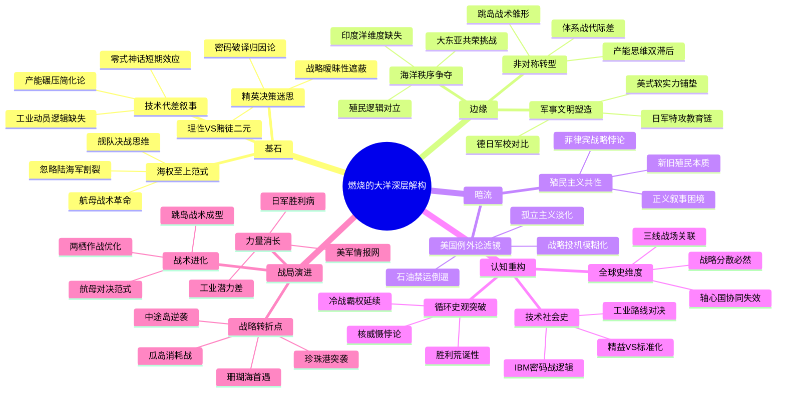

豆瓣链接：https://book.douban.com/subject/34988830/

# 深层解构

### 《燃烧的大洋》深层解码：在炮火与权谋之下，探寻被遮蔽的历史暗线

#### 一、基石：被反复锚定的核心叙事支点
1. **「海权决定论」的现代性演绎**  
   作者以马汉海权理论继承者的姿态，将太平洋战争简化为「制海权争夺」的经典范式。从珍珠港突袭的「舰队决战思维」到中途岛「航母战术革命」，全书始终以舰艇吨位、航线规划、战术操演为叙事骨架。这种对「海权至上」的执念，本质上是对19世纪马汉理论的当代呼应——即便航空母舰已取代战列舰成为核心战力，作者仍不自觉地用「大洋棋盘」的传统视角切割历史。  
   *例证*：书中对山本五十六「舰队决战」战略的渲染，实则暗含对「海权必须通过会战决胜」的路径依赖，却轻描淡写日本陆海军战略割裂这一关键事实。

2. **「精英决策史观」的双向塑造**  
   作者既塑造罗斯福、尼米兹等「理性决策者」形象，也刻画山本五十六、南云忠一等「赌徒式将领」。这种二元对立背后，是对「历史由少数人推动」的深信不疑。书中对「胜利病」（日军因连胜而轻敌）的批判，实质是在强调精英阶层对「理性边界」的认知能力——仿佛只要决策层保持清醒，战争走向就能被精准操控。  
   *矛盾点*：当描述美军破译密码的「魔术计划」时，作者将其归功于情报部门的专业能力，却未深究美国在1941年前后「故意示弱」的战略暧昧性（如部分史料显示罗斯福可能预知珍珠港袭击）。

3. **「技术决定论」的隐性渗透**  
   从零式战机的技术优势到「埃塞克斯」级航母的产能碾压，书中频繁用「技术代差」解释战局转折。这种叙事策略既符合现代读者对「工业文明战胜军国主义」的认知预期，也悄然回避了更复杂的社会动员逻辑——例如，日本在战争初期的「技术神话」本质上是「以战养战」掠夺资源的短期效应，而非真正的工业实力体现。

#### 二、边缘：那些照亮历史褶皱的思想微光
1. **「海洋意识形态」的文明冲突伏笔**  
   书中引用日本学者小牧实繁「所有海洋都是日本海」的狂言，看似是批判军国主义的夜郎自大，实则揭示了一个被忽视的维度：近代以来「海洋秩序」的解释权争夺。当日本试图以「大东亚共荣圈」重构海洋霸权时，本质是对西方主导的威斯特伐利亚体系的挑战。这种文明层面的对抗，在书中仅作为「疯狂言论」一闪而过，却暗示着太平洋战争更深层的文明冲突属性。  
   *延伸思考*：若将视角转向同时期的印度洋战场，能发现英国、荷兰等老牌殖民帝国与日本在「海洋控制逻辑」上的根本对立——前者靠贸易网络，后者靠军事征服。

2. **「军事教育」的隐性战争动员**  
   序章中引用罗斯福对军校「培养战士而非学者」的定位，以及对社交礼仪、法语学习的强调，暴露出一个关键事实：现代战争的胜负不仅在战场，更在「军事文明」的塑造。美军军官的「外交官式素养」，本质是其全球战略的软实力铺垫；而日军飞行员的「神风特攻」，则是另一种极端军事教育的产物。作者虽未展开论述，却无意中揭示了「战争机器」的底层建构逻辑——当军事教育沦为意识形态工具时，战术创新终将被体制缺陷吞噬。  
   *对比视角*：同期德国军校对「技术官僚」的培养，与美苏侧重「政治委员」制度的军事教育，共同构成20世纪战争的多元面相。

3. **「非对称战争」的早期形态**  
   书中将瓜达尔卡纳尔岛战役定义为「消耗战」，却忽略其「非对称」本质：日军以传统陆战思维争夺岛屿，美军则依托海空优势实施「跳岛战术」。这种代际战术差异，预示了现代战争从「阵地战」向「体系战」的转型。若深入挖掘，可发现中途岛战役后日军的被动，本质是工业产能与战略思维双重落后的结果——这为后续「潜艇破交战」「原子武器终结战争」埋下逻辑伏笔。

#### 三、暗流：被海平面遮蔽的历史潜流
1. **「美国例外论」的叙事滤镜**  
   作者默认「美国参战是正义转折」的前提，却淡化1941年前美国的「孤立主义」与「战略投机」。例如，1939年《中立法案》修订后，美国仍通过「租借法案」向同盟国输血，本质是在测试介入战争的成本收益比。书中对「珍珠港受害者」形象的强化，有意无意地模糊了美国在日美矛盾激化中的责任（如石油禁运对日本战争决策的倒逼）。  
   *史料补充*：日本战时文件显示，山本五十六曾多次反对对美开战，其核心顾虑是「美国工业潜力不可战胜」，但军部少壮派的「下克上」传统最终绑架国家决策——这种体制性缺陷，在书中被简化为「个人赌性」。

2. **「殖民主义」的自我指涉困境**  
   当作者批判日本「以战养战」的资源掠夺时，却回避美国在太平洋的殖民历史。例如，菲律宾作为美国殖民地，其战略地位的重要性并不亚于日本对东南亚的需求。书中将美军描绘为「解放者」，实则掩盖了「新殖民主义」与「旧殖民主义」的本质共性——两者都是对海洋资源支配权的争夺。这种叙事矛盾，暴露了西方史学界对「帝国遗产」的集体无意识。  
   *反事实假设*：若日本在中途岛获胜并巩固「大东亚共荣圈」，其统治模式是否会演变为另一种殖民体系？书中对「正义/邪恶」的简单二分，消解了这种复杂历史可能性的探讨空间。

#### 四、解码者的启示：超越「燃烧的大洋」的三重维度
1. **从「战役史」到「全球史」**  
   书中虽聚焦太平洋，但1941-1942年正是德军横扫欧洲、北非战场胶着、中国战场相持的关键期。将中途岛战役置于「轴心国全球战略协同失效」的背景下（如德日未能会师印度洋），会发现其胜利不仅是战术成功，更是轴心国战略分散的必然结果。

2. **从「国家叙事」到「技术-社会史」**  
   零式战机的神话与陨落，本质是日本航空工业「精益生产」与美国「标准化量产」的路线对决；密码战的背后，是IBM打孔机技术与日本「紫密」机械逻辑的较量。这些技术-社会互动关系，揭示了战争胜负的深层肌理。

3. **从「线性进步」到「循环逻辑」**  
   书中暗含「民主制度终将战胜专制」的进步史观，但1945年后的冷战格局证明，胜利一方的制度同样可能滋生新的霸权逻辑。太平洋战争的「正义叙事」，在核武器阴影下呈现出荒诞的循环——人类从未因胜利而远离战争，只是学会了更高效地毁灭。

### 写在最后：当我们凝视「燃烧的大洋」时，我们在凝视什么？
这本书是一面棱镜，既折射出太平洋战争的火光，也映照着西方史学的认知边界。它提醒我们：所有历史书写都是「选择性记忆」，真正的解码需要穿透文字表层，在「基石」中寻找逻辑裂痕，在「边缘」处捕捉思想飞絮，在「暗流」里打捞被沉没的叙事。或许，比「理解历史」更重要的，是理解「我们为何如此理解历史」——这才是每一次深度阅读的终极启蒙。

# 章节内容
### 序章
在珍珠港事件前夕，美国夏威夷珍珠港看似一片祥和，士兵们过着规律的军营生活，然而部分军官已察觉到战争的阴影逼近。日本方面则在紧锣密鼓地筹备对珍珠港的突袭计划，山本五十六等将领精心布局。此章节关键在于描绘出双方在战前截然不同的状态，美国的大意与日本的蓄谋已久形成鲜明对比，这种状态的差异成为珍珠港事件爆发以及后续战争走向的重要背景因素，也让读者初步感受到战争即将爆发前的微妙氛围。
### 第一章
珍珠港事件爆发于 1941 年 12 月 7 日清晨。日本航空母舰舰载机群如乌云般突然降临珍珠港上空，毫无防备的美军战舰成了活靶子。美军多艘主力战舰如亚利桑那号战列舰被炸弹击中后瞬间爆炸沉没，内华达号试图突围也遭受重创。珍珠港内瞬间火光冲天，浓烟滚滚，众多官兵在袭击中丧生或受伤。作者详细描述了日军攻击的路线、战术以及美军的混乱应对，突出珍珠港事件的突然性和毁灭性，它不仅使美军太平洋舰队遭受重创，更直接将美国卷入二战，极大地改变了美日双方乃至整个世界的战争格局，开启了太平洋战争的残酷篇章。
### 第二章
日军在珍珠港得手后，趁势在太平洋地区展开大规模扩张行动。在东南亚战场，日军迅速对马来亚发起进攻，凭借其训练有素的军队和先进的战术，英军节节败退。新加坡作为英国在东南亚的重要据点，尽管号称坚不可摧，但在日军的猛烈攻击下也很快沦陷。日军一路势如破竹，占领了多个岛屿和地区，所到之处升起太阳旗，其“胜利病”开始在军队中蔓延。作者通过描述日军的进攻路线、战斗过程以及占领地区的情况，展现出日军在战争初期的强大军事力量和战略野心，给盟军在太平洋地区的防御带来了巨大压力，使盟军陷入极为被动的局面。
### 第三章
珍珠港事件后，日本计划进一步巩固在东南亚和太平洋的占领区，同时企图寻找机会歼灭美军在太平洋的残余主力舰队，以实现其在该地区的绝对控制。美国则在遭受重创后开始深刻反思并重新调整战略。美军一方面加强本土到夏威夷等地区的防御力量，另一方面积极收集情报，试图找出日军的战略弱点以便反击。此章节重点阐述了美日双方在这一时期的战略规划和决策过程，双方的战略布局犹如棋盘上的对弈，每一步都影响着战争的走向，体现出双方在战略层面的深思熟虑和针锋相对，也预示着后续更加激烈的军事冲突即将爆发。
### 第四章
日军将进攻矛头指向菲律宾。在强大的军事攻势下，美军及菲律宾军队难以抵挡，被迫不断向后撤退。巴丹半岛成为双方争夺的焦点，美军和菲律宾军队在艰苦的条件下坚守，但最终还是因寡不敌众而沦陷。科雷希多岛随后也遭到日军猛烈攻击，岛上的美军在弹尽粮绝后无奈投降。此章节详细描述了日军在菲律宾的进攻节奏、战斗场景以及美菲联军的抵抗过程，突出日军进攻的猛烈和美军在菲律宾防御作战的艰难处境，反映出战争初期日军在东南亚战场的绝对军事优势，以及美军在菲律宾战场上的惨重损失和面临的巨大困境。
### 第五章
珊瑚海海战是美日航母舰队首次大规模正面交锋。双方均派出了航母编队，战斗在珊瑚海海域激烈展开。日军试图通过此次海战夺取珊瑚海的制海权，进而为进一步进攻澳大利亚创造条件。美军则识破了日军的意图并进行顽强抵抗。在战斗中，双方的舰载机你来我往，对敌方舰艇展开攻击。日军虽然击沉了美军一艘航母，但自身也损失了一艘航母及众多飞机，并且未能达成战略目标，未能按计划进攻莫尔兹比港。作者着重强调此次海战的重要意义，它打破了日军在太平洋战场上不可战胜的神话，证明了美军有能力在航母对决中与日军抗衡，双方在此次海战中的战术得失和装备表现对后续的航母作战产生了深远影响，成为太平洋战争的一个重要转折点。
### 第六章
中途岛战役前，日军精心策划了一场大规模的军事行动，企图诱使美军航母舰队出击，然后一举将其歼灭。日军联合舰队倾巢而出，制定了复杂而周密的作战计划。然而，美军情报部门成功破译了日军的密码，掌握了日军的部分作战计划，包括进攻中途岛的时间、兵力部署等关键信息。美军则根据这些情报迅速调整战略，在中途岛周边海域设下埋伏。此章节重点在于展现双方在情报战中的巨大差距，美军如何通过情报优势提前知晓日军的行动并进行针对性部署，而日军却对美军已掌握其计划浑然不知，这种情报上的不对等为中途岛战役的最终结果埋下了伏笔，也凸显了情报在现代战争中的关键作用和决定性影响。
### 第七章
中途岛战役爆发，战斗异常激烈。美军按照预先的计划，利用中途岛的地理优势和情报优势，对日军航母舰队进行了突然袭击。日军航母舰队在毫无防备的情况下陷入混乱，四艘参战航母先后被美军舰载机击中，燃起熊熊大火并最终沉没，日军还损失了大量经验丰富的飞行员。作者通过生动细致的描写，如美军俯冲轰炸机的攻击角度、日军航母上的爆炸场景等，突出美军以弱胜强的关键因素，包括情报准确、指挥果断、飞行员的英勇作战以及一定的运气成分等。同时也展现了日军在遭受攻击后的慌乱和无力回天的惨状，此役成为太平洋战争的重大转折点，美军成功扭转了战略劣势，从被动防御转为主动进攻，极大地鼓舞了盟军的士气，也让日军在太平洋战场上的战略布局全面陷入被动。
### 第八章
中途岛战役失败后，日军内部陷入混乱和互相推诿责任的局面。山本五十六等将领试图掩盖失败的真相，以维护军队的士气和自身的威望。但失败的阴影笼罩着整个日军，军队士气遭受重创，士兵们开始对战争的前景产生怀疑。原本宏伟的战略计划被迫大幅调整，日军在太平洋地区的扩张势头被有效遏制。此章节揭示了日军在失败后的内部体制弊端和心态变化，从侧面体现出中途岛战役对日军的沉重打击，不仅仅是军事力量上的损失，更引发了日军在指挥、士气、战略规划等多方面的内部危机，为日军后续在太平洋战争中的败退埋下了隐患。
### 第九章
美军在中途岛战役取得决定性胜利后，迅速调整战略并展开反攻行动。美军将目光投向了瓜达尔卡纳尔岛，计划以此为突破口，在南太平洋地区逐步夺回主动权。美军加强了在该地区的军事部署，集结了大量的兵力、战舰和飞机。同时，美军还积极与澳大利亚等盟军协同作战，建立起了一条稳固的补给线。此章节强调美军在取得关键胜利后的积极进取姿态，通过一系列军事行动巩固优势，进一步扩大战果，使太平洋战争局势开始向有利于盟军的方向发展，美军逐渐掌握了战争的主动权，为后续在太平洋战场上的全面反攻奠定了坚实基础。
### 第十章
美军登陆瓜达尔卡纳尔岛后，与日军展开了激烈的争夺。岛上的丛林环境恶劣，双方士兵不仅要面对敌人的攻击，还要克服疾病、饥饿等困难。在岛上战斗的同时，双方在周边海域也进行了多次海战。日军试图通过海上封锁和增援来夺回岛屿控制权，美军则坚决抵抗并不断加强海上力量。此章关键在于展现战役的残酷性和复杂性，双方都投入了大量的兵力和资源，每一寸土地、每一片海域都成为了争夺的焦点，战斗过程异常激烈，双方的伤亡都较为惨重，这些战斗为后续战役的发展奠定了基础，也凸显了瓜达尔卡纳尔岛战役在太平洋战争中的重要战略地位。
### 第十一章
瓜达尔卡纳尔岛战役进入后期，美军逐渐占据上风。美军通过不断的增援和调整战术，在岛上的战斗中逐渐取得优势，日军的补给线被美军切断，岛上的日军陷入绝境，士兵们面临着饥饿、疾病和美军的攻击，战斗力大幅下降。最终，日军被迫撤离瓜达尔卡纳尔岛。作者详细叙述了美军在战斗中的顽强表现和战略决策的正确性，如美军对日军补给线的有效打击、对岛上日军的逐步围剿等。同时也反映出日军在战争中的困境和无奈，此役使美军在太平洋战场上进一步巩固了优势，加速了日军在太平洋地区的败退，成为太平洋战争走向的又一重要转折点。
### 第十二章
瓜达尔卡纳尔岛战役结束后，太平洋战场局势发生了显著变化。美军在取得胜利后继续在太平洋地区推进，逐步收复被日军占领的岛屿，日军则被迫收缩防线，从进攻转为防御。双方在战略、战术和装备等方面都进行了不断的调整。美军在战略上更加注重岛屿跳越战术，以减少伤亡并加快推进速度；在战术上不断优化两栖作战和空中打击的配合；在装备上则加大了新型战舰、飞机等武器的研发和生产。日军则在防御中试图寻找机会进行反击，但已难以改变整体的劣势局面。此章节强调战争局势的动态变化，美军通过一系列胜利不断积累优势，日军则陷入被动防御，双方的战略调整和军事行动为后续战争走向和最终结局奠定了基础，体现出战争发展的趋势性和必然性。
### 尾声
对太平洋战争最初六个月进行全面总结回顾。从珍珠港事件日军的突然袭击，使美军遭受重创并卷入战争，到珊瑚海海战双方的初次航母对决，再到中途岛战役美军的扭转乾坤以及瓜达尔卡纳尔岛战役美军的巩固优势。这期间战争局势风云变幻，美军从初期的慌乱、失利到逐步调整战略、集结力量并最终扭转战局，日军则从战争初期的盛极一时、扩张迅猛到中途岛战役后的内部混乱、士气低落，再到瓜达尔卡纳尔岛战役后的败退收缩。作者通过总结这些关键战役的过程、结果和影响，深刻剖析了战争对美日双方在军事力量、战略规划、军队士气等多方面的深远影响，以及这些战役如何改变了美日双方的战略态势并最终影响了整个世界格局，揭示了战争中情报、战略、战术、装备以及士兵战斗意志等各种因素相互交织、相互作用的复杂关系，展现出太平洋战争初期的波澜壮阔与残酷无情。 