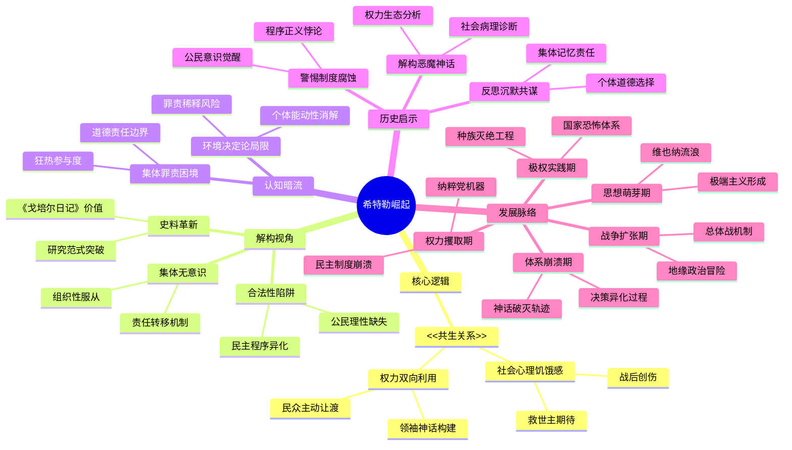

豆瓣链接：https://book.douban.com/subject/30140243/

# 深层解构

### 一、基石：共生关系——希特勒崛起的核心逻辑
作者伊恩·克肖在书中反复强调的核心信念是：希特勒的崛起并非仅仅源于其个人的“恶魔特质”，更关键的是他与德国社会之间形成的“共生关系”。这一关系包含两个紧密相连的层面：
- **社会心理的“饥饿感”**：一战结束后，德国面临割地赔款的屈辱、经济的全面崩溃以及魏玛民主制度的脆弱，整个社会陷入深深的绝望，迫切渴望出现一位“民族拯救者”。正如书中所述，希特勒的那套简陋却具有内在逻辑性的理论，恰好为民众对现实的不满提供了一个“合理”的解释框架，让他们误以为找到了摆脱困境的出路。
- **权力的“双向利用”**：希特勒巧妙地利用了民众的这种期待，将自己塑造成“救世主”的形象；而民众则在潜意识里主动“选择”忽视希特勒的极端思想，心甘情愿地将权力托付给他，期望他能带领德国走出低谷。这种看似“主动迎合”与“被动接受”的关系，实则是一种相互依存、相互强化的共生状态，成为希特勒能够登上权力巅峰并维持统治的根本原因。

### 二、边缘：被轻描淡写的“平庸之恶”
书中有一些看似轻描淡写的内容，却隐藏着极具启发性的洞见：
- **“合法性”的致命吸引力**：希特勒是通过合法的政治程序成为德国总理的，这一事实深刻地揭示了“合法性”在极权统治形成过程中的巨大迷惑性。它表明，即使是在民主制度下，民众也可能因为对现实的不满而盲目地将权力赋予一个极具危险性的政治人物，从而为极权统治打开方便之门。
- **“为元首工作”的集体无意识**：书中多次提到德国民众“主动为元首工作”的现象，这反映出在特定的社会环境下，个体很容易放弃独立思考，将自己的行为责任归咎于“集体意志”或“领袖指示”。这种集体无意识不仅为希特勒的暴行提供了社会基础，也让我们深刻认识到，在任何社会中，保持个体的独立判断和责任意识是多么重要。
- **史料运用的“颠覆”**：作者首次利用《戈培尔日记》等一手资料进行研究，这一做法实际上颠覆了传统传记“就事论事”的写作模式。它启示我们，在历史研究中，新史料的发现和运用往往能为我们提供全新的视角，帮助我们更深入地理解历史人物和事件。

### 三、暗流：未被正视的“集体罪责”假设
在全书的论证过程中，存在一个未被明确阐述但却至关重要的前提假设：
- **“环境决定论”的潜在偏向**：作者过于强调社会环境对希特勒崛起的决定作用，在一定程度上弱化了个体的主观能动性。虽然社会环境确实为希特勒的崛起提供了土壤，但希特勒本人的极端思想、权谋手段以及他身边核心集团的推波助澜同样不可忽视。这种“环境决定论”的倾向，可能会在无意中减轻人们对希特勒及其追随者个人罪责的审视。
- **“德国民众责任”的回避**：书中虽然提到民众对希特勒的支持是其崛起的重要因素，但对于民众在希特勒政权实施暴行过程中应承担的责任，却没有进行深入的探讨。这就引发了一个值得深思的问题：当整个社会陷入集体狂热时，普通民众是否应该为自己的盲目追随负责？这种回避实际上反映了历史研究中一个普遍存在的困境——如何在宏观的社会分析与个体的道德责任之间找到平衡。

### 四、给读者的三把钥匙
- **打破“恶魔神话”**：不要仅仅将希特勒视为一个天生的“怪物”，而应从他与社会的互动关系中去理解他的崛起。这样可以帮助我们认识到，极权主义的产生往往有其复杂的社会根源，而不仅仅是个别“恶魔”的产物。
- **警惕“合法性陷阱”**：在民主社会中，要时刻保持对政治权力的警惕，不要被“合法性”的表象所迷惑。真正的民主需要公民具备独立思考和批判性思维的能力，能够对政治人物和政策进行理性的审视和判断。
- **追问“沉默的共谋”**：思考在类似的历史情境中，我们每个人可能扮演的角色。当社会出现极端思潮时，我们是选择盲目追随，还是保持独立思考，勇敢地表达不同意见？这种追问可以帮助我们在现实生活中更好地坚守自己的道德底线，避免成为“平庸之恶”的参与者。

通过对这本书的深层解码，我们可以发现，它不仅仅是一部关于希特勒个人的传记，更是一部关于权力、社会与人性的深刻剖析。正如马克思所说：“人们创造自己的历史，但他们并不是随心所欲地创造。”希特勒的故事提醒我们，每个时代的“历史创造”都离不开特定的社会土壤，而我们的责任就是在理解历史的基础上，警惕那些可能导致灾难的社会心理和权力逻辑，避免历史的悲剧再次重演。

# 章节内容

第一阶段: 早期岁月与思想形成 (Ch 1-3)
      幻想破灭 (Ch 1)
        艺术梦想失败
        与专横父亲的冲突
        克肖论点: **充满挫败感的青春期**, 而非自我描绘的英雄叙事
      维也纳时期 (Ch 2)
        潦倒生活加剧怨恨
        吸收泛日耳曼主义与反犹思想
        克肖论点: **极端世界观的关键形成期**, 是思想的杂食动物
      一战的影响 (Ch 3)
        战争提供归属感与意义
        德国战败催生背后一刀神话
        克肖论点: **从欣喜到怨恨的剧变**, 成为投身政治的直接动力
第二阶段: 政治崛起与夺权之路 (Ch 4-9)
      啤酒馆煽动者 (Ch 4-5)
        核心武器: 无与伦比的演讲才能
        建立冲锋队(SA): 宣传与恐怖相结合
        啤酒馆政变: **失败但赢得全国性声望**
        狱中反思: 确立合法夺权路线
      重建与突破 (Ch 6-8)
        确立领袖原则(Führerprinzip), 打造个人独裁
        精准利用1929年经济危机造成的社会恐慌
        双重策略: 表面合法与街头暴力并行
        1932年成为国会第一大党, 突破成功
      篡权 (Ch 9)
        合法的革命: **利用法律程序摧毁民主**
        国会纵火案 -> 签署《保护人民和国家法令》, 中止公民权利
        通过《授权法》, 标志魏玛共和国正式死亡
第三阶段: 巩固独裁与备战 (Ch 10-15)
      独裁者的形成 (Ch 10)
        长刀之夜: 清洗冲锋队, 换取国防军支持
        兴登堡去世, 合并总统与总理职位, 成为元首
      为元首工作 (Ch 11-12)
        克肖核心理论: **纳粹体制的运作模式**
        官员揣摩元首意志, 竞相激进
        导致制度性混乱与政策的不断激进化
      无休止的激进与扩张 (Ch 13-15)
        对内: 四年计划使经济完全转向战争准备
        对外: 撕毁凡尔赛条约(进驻莱茵兰)、吞并奥地利、慕尼黑协定
        反犹政策升级: 《纽伦堡法案》 -> **水晶之夜, 大屠杀的关键转折点**
        1939年预言: 公开提出灭绝欧洲犹太人
第四阶段: 战争 - 巅峰、转折与灭绝 (Ch 16-22)
      走向战争 (Ch 16)
        吞并捷克斯洛伐克, **绥靖政策彻底破产**
        误判英法决心, 悍然入侵波兰, 引发二战
      歼灭战的开启 (Ch 17-19)
        入侵苏联(巴巴罗萨): 意识形态驱动的世界观战争
        《政委令》等命令授权军队实施暴行
        T4行动(安乐死): 工业化屠杀的预演与技术准备
        别动队(Einsatzgruppen)**开始系统性屠杀**
      转折点 (Ch 20-22)
        美国参战, 战争全球化
        **最终解决方案: 在万湖会议上被系统化、官僚化**
        斯大林格勒战役: 德军灾难性失败, **战争的根本转折点**
第五阶段: 崩溃与灭亡 (Ch 23-28 & 尾声)
      困兽犹斗 (Ch 23-24)
        军事上节节败退, 种族灭绝疯狂加速
        宣传总体战, **将希望寄托于奇迹武器**
      最后的疯狂 (Ch 25-26)
        7月20日刺杀案失败, 引发大清洗, 彻底摧毁内部反对力量
        阿登战役: **最后的豪赌与失败**
        退守地堡, 指挥幽灵部队, 完全脱离现实
      灭亡 (Ch 27-28)
        最后的日子: 充满对背叛的执念与对犹太人的仇恨
        《政治遗嘱》: **毫无悔意, 将一切归罪于人**
        自杀身亡, 第三帝国随之迅速灰飞烟灭
      克肖的核心论点 (尾声)
        **==希特勒是空洞的容器, 被时代负面情绪填满==**
        其魅力型权力需要不断成功来维持, 必然导向自我毁灭
        警示: **一个现代文明国家是如何陷入野蛮的**

### **第一章 幻想破灭**

本章聚焦于希特勒的出身、家庭背景以及童年和青少年时期的经历，克肖旨在探讨这些早期经历如何塑造了希特勒的性格和世界观，但最终强调的是，**希特勒的童年虽然并非充满创伤，但却是一个充满幻想并最终走向破灭的过程，这为他日后的极端思想埋下了伏笔**。

克肖首先描述了希特勒的家庭环境，他的父亲阿洛伊斯是一个脾气暴躁、专横的奥地利海关官员，与儿子阿道夫的关系紧张。阿洛伊斯希望儿子能成为一名公务员，但年轻的希特勒却对此毫无兴趣，反而梦想成为一名艺术家。这种父子间的冲突，在克肖看来，是希特勒早期反叛精神的体现。与父亲的紧张关系形成对比的是，希特勒与母亲克拉拉的感情非常深厚。克肖认为，这种对母亲的依恋，在一定程度上影响了希特勒的情感发展，使他在成年后难以与他人建立亲密关系。

在教育方面，希特勒在学校表现平平，对绝大多数科目都缺乏兴趣，唯独对历史和地理情有独钟，尤其是那些能够激发他德意志民族自豪感的内容。克肖指出，**希特勒在学校的平庸表现，并非因为他智力低下，而是源于他对权威的蔑视和对自己艺术天赋的过度自信**。这种自负，使得他在离开学校时，并未具备任何实用的技能和知识。

本章的核心论点在于，**希特勒的早年生活，并非像他后来在《我的奋斗》中所描绘的那样，是一个充满苦难和早期政治觉醒的英雄叙事**。相反，克肖认为，希特勒的青少年时期，是一个沉浸在瓦格纳歌剧、德意志神话和个人艺术幻想中的时期。他鄙视按部就班的学校教育和父亲为他规划的职业道路，幻想自己能够成为一名伟大的艺术家。然而，现实却是残酷的。1907年和1908年，他两次被维也纳艺术学院拒之门外，这对他的自尊心是沉重的打击。母亲的去世，更让他失去了最后的精神支柱。

最终，克肖在本章中得出的结论是，希特勒的童年和青少年时期，是一个充满幻想并最终破灭的过程。家庭的冲突、学业的失败以及艺术梦想的破灭，共同塑造了一个充满挫败感、自命不凡、蔑视权威、沉溺于幻想的年轻人。**这种强烈的挫败感和对现实的憎恨，为他日后在维也纳的潦倒生活和极端思想的形成，提供了肥沃的土壤**。

### **第二章 辍学**

本章详细描述了希特勒在维也纳的五年（1908-1913）流浪生活，克肖的核心论点是，**这段时期是希特勒世界观和政治思想形成的关键阶段，正是在维也纳的“大熔炉”中，他从一个失意的艺术家，转变为一个充满怨恨、初步形成极端反犹主义和种族主义思想的政治激进分子**。

克肖首先描绘了希特勒在维也纳的窘迫生活。在母亲去世后，希特勒失去了家庭的经济支持，他靠着微薄的孤儿抚恤金和偶尔出售画作的收入勉强度日，时常露宿街头，住在廉价的男子宿舍里。克肖强调，**这种潦倒的生活，加剧了希特勒的挫败感和对社会的憎恨**。他将自己的失败归咎于外部世界，而不是反思自身的问题。他看不起体力劳动者，认为自己与他们不同，是一个怀才不遇的“艺术家”。

正是在这种充满怨恨和挫败感的心理状态下，希特勒开始大量接触维也纳流行的各种政治思想。克肖详细分析了当时维也纳的政治氛围：一个多民族、多文化的哈布斯堡王朝的首都，充满了各种民族主义、反犹主义、社会达尔文主义和民粹主义思想。希特勒像海绵一样吸收着这些思想，尤其是泛日耳曼主义者乔治·冯·舍纳勒和维也纳市长、反犹主义者卡尔·卢格的思想，对他影响深远。

克肖认为，**希特勒的反犹主义正是在维也纳时期系统形成的**。他开始将犹太人视为一切社会问题的根源，认为他们是艺术界的堕落者、新闻界的操控者、马克思主义的煽动者和资本主义的剥削者。这种偏执的看法，为他提供了一个简单的、非黑即白的解释世界的方式，并将他个人的失败，转化为一种“雅利安人”对抗“犹太人”的宏大叙事。

此外，希特勒对议会民主制度的蔑视也在此一时期形成。他认为议会是软弱、腐败和低效的，无法解决德意志民族面临的生存问题。相反，他开始崇拜一种**“领袖原则”**，即相信一个具有超凡魅力的领袖，能够带领人民走出困境。

克肖在本章中强调，**希特勒并非一个深刻的思想家，而是一个思想的“杂食动物”**。他并没有独创任何思想，而是将当时流行的各种极端思想，进行了一种庸俗化、简单化的杂糅，形成了他自己的一套世界观。这套世界观的核心，就是**种族斗争**和**对犹太人的刻骨仇恨**。

总而言之，第二章“辍学”的核心在于揭示维也纳时期对希特勒的决定性影响。克肖认为，正是在这段时间里，希特勒完成了从一个充满个人幻想的艺术家，到抱持极端政治和社会观点的激进分子的转变。他的个人挫败感与当时维也纳流行的极端思想相结合，最终形成了他日后政治生涯的思想基础。

### **第三章 欣喜与怨恨**

本章聚焦于第一次世界大战对希特勒的深刻影响，以及战后的混乱局势如何将他推向政治舞台。克肖的核心论点是，**战争为无所事事的希特勒提供了人生的“意义”和“归属感”，而德国的战败和随之而来的《凡尔赛条约》，则将他的欣喜彻底转变为一种刻骨的怨恨和复仇的欲望，这种强烈的情感最终成为他投身政治的直接动力**。

战争爆发之初，希特勒表现出极大的热情。克肖描绘了一个在慕尼黑王宫广场上，与众人一同欢庆战争来临的希特勒。对于这个在维也纳一事无成的“失败者”来说，战争是一个摆脱个人困境、投身于一项宏大事业的机会。他志愿加入了巴伐利亚步兵团，奔赴西线战场。克肖认为，**军队生活为希特勒提供了他一直渴望的结构、纪律和同志情谊**。他不再是一个孤立的个体，而是一个伟大集体中的一员。在战场上，他表现得相当勇敢，曾两次获得铁十字勋章，这让他获得了前所未有的认可和荣誉感。

然而，克肖也指出，希特勒在军队中仍然是一个不合群的人。他不喜欢和战友们讨论女人和家庭，而是常常发表一些关于政治和战争的长篇大论，这让他在军队中显得有些古怪。尽管如此，战争的经历，尤其是前线的残酷和同志间的生死情谊，**极大地强化了他的德意志民族主义情感和对国家的忠诚**。

本章的转折点是德国的战败。1918年10月，希特勒因毒气袭击而暂时失明，住进了医院。正是在医院里，他听到了德国投降的消息。克肖生动地描述了这一刻对希特勒的巨大冲击。他感到“天旋地转”，认为这是“闻所未闻的无耻行径”。**德国的战败，对他而言，不仅仅是一场军事上的失败，更是一种人格上的侮辱和信仰的崩塌**。

克肖的核心论点在于，**希特勒将德国的战败归咎于“背后一刀”**。他坚信，英勇的德军并非在战场上被击败，而是被国内的“叛徒”——即他所认为的犹太人、马克思主义者和民主派政治家——出卖了。这种阴谋论，为他提供了一个简单而又充满煽动性的解释。紧随其后的《凡尔赛条约》，以其苛刻的条款，更是激起了他强烈的复仇情绪。

战后，希特勒回到了慕尼黑，一个充满政治动荡和暴力冲突的城市。巴伐利亚苏维埃共和国的短暂存在，以及随之而来的右翼反革命，都让他亲眼目睹了政治权力的争夺。正是在这种混乱的环境中，仍然留在军队中的希特勒，被任命为一名**“教育官员”**，负责向士兵们灌输反布尔什维克和民族主义的思想。这个角色，让他第一次有机会公开演讲，并发现自己在这方面的惊人天赋。

总而言之，第三章“欣喜与怨恨”的核心在于阐明，**战争与战败是希特勒人生的决定性转折点**。战争让他找到了人生的目标和归属感，而战败则让他充满了怨恨和复仇的欲望。克肖认为，正是这种由欣喜到怨恨的剧烈情感转变，以及战后德国的混乱局势，最终将希特勒从一个无名小卒，推上了通往政治权力的道路。

### **第四章 啤酒馆煽动者**

本章详细描述了希特勒早期在慕尼黑的政治活动，特别是他如何加入并改造德国工人党（DAP），并最终成为纳粹党的核心人物。克肖的核心论点是，**希特勒并非纳粹党的创建者，但他以其无与伦比的演讲才能和政治投机本能，迅速抓住了这个微不足道的小团体，并将其打造成为一个以他个人为绝对核心的、充满活力的政治工具**。

克肖首先描绘了战后慕尼黑的政治生态：一个充满了各种右翼、民族主义和反犹主义小团体的温床。正是在这种背景下，希特勒受军队指派，去调查一个名为“德国工人党”的小团体。在一次集会上，他情不自禁地站起来，用极具煽动性的语言，驳斥了一位主张巴伐利亚独立的发言者。他的这次即兴演讲，给德国工人党的领导人留下了深刻印象，并邀请他加入。

克肖强调，**希特勒最初的加入，是带有机会主义色彩的**。他看到了这个小团体可以成为他施展政治抱负的平台。他迅速展现出自己在组织和宣传方面的才能。他设计的党旗、党的名称（国家社会主义德国工人党，即纳粹党），以及“希特勒万岁”的口号，都极具视觉冲击力和煽动性。他将党的集会，从原来几十人的小圈子，发展到数千人参加的、充满戏剧化仪式感的群众大会。

本章的核心在于对希特勒**“啤酒馆煽动者”**角色的分析。克肖认为，希特勒的演讲，是他吸引追随者的最主要武器。他的演讲内容，其实并无新意，无非是重复着那些在维也纳时期就已形成的思想：**对《凡尔赛条约》的控诉、对“背后一刀”的愤慨、对魏玛共和国的攻击、对马克思主义的仇视，以及最核心的——对犹太人的恶毒攻击**。

然而，克肖指出，**希特勒演讲的成功，不在于“说什么”，而在于“怎么说”**。他能够敏锐地捕捉到听众的情绪，用简单、粗暴、充满感情的语言，将复杂的社会问题，简化为非黑即白的斗争。他时而愤怒，时而悲情，时而充满希望，将自己塑造成一个为德国人民代言的“先知”和“救世主”。在啤酒馆那种烟雾缭绕、酒精刺激的环境中，他的演讲具有一种催眠般的效果，能够将听众的怨恨、恐惧和希望，凝聚成一股强大的政治力量。

克肖还分析了希特勒如何利用暴力来为政治服务。他组建了**冲锋队（SA）**，这支由退伍军人、失业者和流氓组成的准军事组织，负责在集会上维持秩序、保护希特勒，并用暴力手段攻击和恐吓政治对手。这种**“宣传与恐怖”**相结合的策略，成为纳粹党早期发展的重要特征。

在本章的最后，克肖总结道，到1923年，希特勒已经不再是一个简单的“啤酒馆煽动者”，他已经成功地将自己塑造成了巴伐利亚右翼政治运动的领袖人物。他利用了战后德国人民普遍存在的幻灭感和对秩序的渴望，通过他极具煽动性的演讲和对暴力的熟练运用，将一个无名小党，变成了一股不可忽视的政治力量。**他不再是为党服务的工具，相反，党已经成为了他实现个人权力意志的工具**。

### **第五章 “鼓手”**

本章聚焦于1923年的啤酒馆政变及其失败，以及这次事件对希特勒和纳粹党未来发展的深远影响。克肖的核心论点是，**啤酒馆政变的失败，虽然在短期内是希特勒政治生涯的一次重大挫折，但从长远来看，却让他吸取了至关重要的教训，并为他赢得了全国性的声誉，使他从一个地方性的“鼓手”，转变为一个在全国范围内具有影响力的民族主义领袖**。

克肖首先描述了1923年德国，特别是巴伐利亚的政治危机。法国和比利时军队占领鲁尔区，引发了德国的恶性通货膨胀，社会秩序濒临崩溃。在巴伐利亚，右翼势力蠢蠢欲动，企图推翻魏玛共和国。希特勒认为，夺取政权的时机已经成熟。他将自己视为这场“民族革命”的**“鼓手”**，一个唤醒民众、激励领袖采取行动的角色。

1923年11月8日晚，希特勒带领冲锋队，冲进了慕尼黑的一家啤酒馆，当时巴伐利亚的三位最高领导人正在那里集会。他用手枪向天花板开了一枪，宣布“民族革命”已经开始。在武力的胁迫下，他迫使这三位领导人同意与他合作，向柏林进军。克肖指出，**希特勒的行动，充满了戏剧性和冒险性，但他严重高估了自己的影响力，也误判了形势**。他以为自己能够像墨索里尼“向罗马进军”一样，不流血地夺取权力。

然而，政变很快就失去了控制。被希特勒释放的巴伐利亚领导人，立即调动军队和警察，准备镇压叛乱。第二天，当希特勒和他的追随者在慕尼黑街头游行时，遭到了警察的开枪射击，政变在几分钟内就被粉碎了。希特勒在混乱中逃脱，但两天后被捕。

克肖认为，**啤酒馆政变的失败，是希特勒政治幼稚病的体现**。他过于相信自己的煽动能力和个人魅力，以为单凭一场充满激情的演讲和一次突然袭击，就能颠覆国家政权。

然而，本章的重点在于分析这次失败如何转化为希特勒的**政治资本**。在随后的审判中，希特勒巧妙地将法庭变成了自己的政治舞台。他拒绝为自己的行为辩护，反而慷慨激昂地陈述自己的政治理念，将自己塑造成一个为德国民族利益而奋斗的爱国者。他宣称，**“历史将宣判我们无罪”**。这次审判，通过媒体的报道，使希特勒的名字第一次传遍了全德国，甚至在国际上也有了一定的知名度。他不再是慕尼黑啤酒馆里的那个无名小卒，而是一个敢于挑战魏玛共和国的“英雄”。

在兰茨贝格监狱服刑期间，希特勒过着相当舒适的生活，他有充足的时间来反思自己的失败。正是在狱中，他口述了《我的奋斗》的第一卷。克肖强调，**《我的奋斗》不仅仅是一本自传，更是希特勒对其世界观的系统阐述，和他对未来政治策略的规划**。他从中得出的最重要教训是：**不能再通过暴力革命的方式来夺取权力，而必须通过“合法”的途径，即利用魏玛共和国的民主制度，从内部来摧毁它**。

总而言之，第五章“鼓手”的核心在于阐明啤酒馆政变的双重意义。克肖认为，这次失败的政变，既是希特勒早期政治生涯的终点，也是他走向成熟的起点。**它让希特勒从一个单纯的街头煽动者，转变为一个更加狡猾、更具战略眼光的政治家**。他虽然暂时失去了自由，但却赢得了声望，并确立了未来“合法夺权”的政治路线，这为他日后的东山再起，奠定了坚实的基础。

### **第六章 领袖出世**

本章探讨了希特勒在1925年至1929年期间，如何重建纳粹党，并逐步确立自己作为党内无可争议的“领袖”（Führer）地位的过程。克肖的核心论点是，**在魏玛共和国经济相对稳定的“黄金时期”，纳粹党的政治影响力虽然在全国范围内非常有限，但希特勒却利用这段时间，成功地将纳粹党从一个松散的、充满内斗的政治团体，改造成为一个高度集权、完全听命于他个人的“领袖党”，从而为日后利用经济危机实现政治突破，做好了组织上的准备**。

希特勒于1924年底出狱后，面临的是一个四分五裂的纳粹党。在他入狱期间，党内各派系争斗不休，一些地方领导人，如北德的格雷戈尔·施特拉塞，甚至试图将纳粹党引向一条更偏向“社会主义”的道路，这与希特勒的理念格格不入。

克肖详细描述了希特勒如何通过一系列的政治手腕，重新夺回并巩固了自己在党内的领导权。他首先利用自己作为“啤酒馆政变英雄”的声望，召集旧部，宣布重建纳粹党。然后，在1926年的班贝格会议上，他与施特拉塞等党内左派分子进行了决定性的摊牌。克肖认为，**希特勒在这次会议上，并非通过理论辩论，而是通过他强大的个人威望和演讲魅力，压制了对手**。他重申了党的反犹主义、反马克思主义和民族主义的核心纲领，并明确表示，党的路线将完全由他一个人来决定。

这次会议是**“领袖原则”（Führerprinzip）**在纳粹党内正式确立的标志。克肖强调，**“领袖原则”是纳粹党组织结构的核心，它意味着党内的一切权力，都自上而下地源于领袖，而下级对上级必须无条件服从**。这种准军事化的组织形式，取代了传统政党的民主议事程序，使得纳粹党能够高效地执行领袖的意志。

在确立了个人独裁地位后，希特勒开始在全国范围内建立党的组织架构。他将德国划分为不同的“大区”（Gau），并任命忠于自己的亲信担任大区长官。他还创建了一系列附属组织，如希特勒青年团、纳粹学生联盟、纳粹妇女联盟等，试图将纳粹主义的触角，伸向德国社会的各个角落。

然而，克肖也指出，在1920年代中后期的“斯特莱斯曼时代”，德国经济复苏，社会矛盾缓和，政治局势相对稳定。在这样的宏观背景下，纳粹党这种极端政党，很难获得大多数选民的支持。在1928年的国会选举中，纳粹党只获得了2.6%的选票，遭遇惨败。

尽管在选举上屡屡失败，但克肖认为，**希特勒并未因此而气馁，他将这段时期视为一个积蓄力量的阶段**。他坚信，魏玛共和国的稳定只是暂时的，一旦经济危机来临，就是纳粹党的机会。因此，他致力于打造一个**“全能的政治宣传机器”**。他本人不知疲倦地在全国各地发表演讲，党的宣传部门，在戈培尔的领导下，也开始运用各种现代化的宣传手段，如海报、传单、电影等，来塑造希特勒的“领袖”形象。

总而言之，第六章“领袖出世”的核心在于分析，在纳粹党发展的“低谷期”，希特勒如何成功地完成了党内的集权。克肖的观点是，**这一时期对纳粹党的未来至关重要，因为它完成了组织上的准备**。一个以“领袖原则”为核心、高度集权、拥有强大宣传机器的纳粹党，已经严阵以待，只等着外部危机（即1929年的世界经济大萧条）的到来，便可以迅速崛起，成为一股颠覆魏玛共和国的强大力量。

### **第七章 掌控“运动”**

本章深入分析了在1929年世界经济大萧条爆发后，纳粹党如何抓住历史机遇，迅速从一个边缘小党，发展成为德国政治舞台上一股举足轻重的力量。克肖的核心论点是，**经济危机本身并不必然导致纳粹党的崛起，而是希特勒和他领导下的纳粹运动，以其独特的组织形式、宣传策略和意识形态，成功地利用了危机所造成的社会恐慌、政治瘫痪和民众的普遍不满，从而实现了政治上的突破**。

克肖首先描绘了1929年华尔街股灾引发的世界经济大萧条对德国的毁灭性打击。失业率飙升，中小企业纷纷破产，农民陷入绝境，中产阶级多年的积蓄化为乌有。整个德国社会，陷入了一种**“普遍的恐惧和绝望”**之中。魏玛共和国的执政联盟，在应对危机时束手无策，内部分歧严重，导致政府频繁更迭，议会民主制度陷入瘫痪。

正是在这种背景下，希特勒和他领导的纳粹“运动”（Bewegung）脱颖而出。克肖强调，**纳粹党将自己塑造成一个超越党派利益、充满活力和决心的“民族共同体”，以此来区别于那些在危机中显得软弱无能的传统政党**。

本章的核心在于分析纳粹党成功的几个关键因素：

**第一，无所不包的宣传攻势**。在戈培尔的操纵下，纳粹党发动了一场前所未有的宣传战。他们将一切问题的根源，都归咎于“万恶的《凡尔赛条约》”、“腐败的魏玛体系”、“犹太人的阴谋”和“马克思主义的威胁”。这种简单而又极具煽动性的口号，为处于迷茫和恐惧中的民众，提供了一个发泄不满的出口和一个易于理解的“敌人”。

**第二，对希特勒“领袖”形象的精心塑造**。希特勒被宣传成一个超凡脱俗、不为个人私利、一心为德国人民服务的“救世主”。他乘坐飞机在全国各地进行旋风式的巡回演讲，这种被称为**“希特勒飞越德国”**的宣传活动，在当时是前所未有的，极大地强化了他作为“民族希望”的形象。克肖认为，**希特勒的个人魅力，或者说他所扮演的那个“领袖”角色，是纳粹运动凝聚力的核心**。

**第三，对不同社会群体的精准动员**。纳粹党并非一个单纯的工人或中产阶级政党，它试图吸引所有对现状不满的德国人。他们向农民承诺解决债务问题，向失业工人承诺提供工作，向中产阶级承诺恢复社会秩序和民族尊严，向大企业家承诺打击共产主义。克肖指出，**纳粹党的意识形态具有一种“杂烩”的特性，其承诺常常是模糊和自相矛盾的，但这恰恰是它能够吸引不同社会阶层的原因**。

**第四，对暴力的有效运用**。冲锋队（SA）的规模急剧扩大，他们通过街头游行、集会和与政治对手（主要是共产党人）的暴力冲突，来展示纳粹党的力量和决心，制造一种“只有纳粹才能恢复秩序”的假象。

在这些因素的共同作用下，纳粹党在1930年的国会选举中，取得了惊人的成功，一跃成为国会第二大党。克肖认为，**这次选举是纳粹党从一个边缘运动，转变为一个真正的群众性政党的转折点**。

总而言之，第七章“掌控‘运动’”的核心在于阐明，**希特勒和纳粹党是如何将一场经济危机，转化为一场政治胜利的**。克肖的结论是，纳粹党的成功，并非历史的必然，而是他们主动“掌控”和利用危机的结果。他们以其独特的政治风格——**一个以“领袖”为核心、充满活力、善于宣传、不择手段的政治运动**——成功地摧毁了德国民众对民主制度的最后一点信心，并将自己塑造成了唯一的“出路”。

### **第八章 突破**

本章详细记述了1930年至1932年间，纳粹党如何在德国政治危机不断加深的背景下，进一步扩大其政治影响，并最终在选举中达到顶峰，为希特勒上台执政铺平了道路。克肖的核心论点是，**在魏玛共和国民主制度濒临崩溃的最后阶段，希特勒巧妙地在“合法”夺权的策略和街头暴力革命的压力之间维持平衡，利用传统右翼精英的误判和民众对强人政治的渴望，最终实现了决定性的政治突破**。

在1930年选举取得巨大成功后，纳粹党成为了魏玛政坛一股不可忽视的力量。然而，希特勒拒绝了加入联合政府的邀请，他坚持**“要么全有，要么全无”**的立场，即他只接受由他本人来担任总理。克肖认为，这是一种高风险但极其精明的政治赌博。希特勒深知，一旦加入联合政府，纳粹党就必须为政府的失败政策承担责任，这将削弱其作为“反对派”的吸引力。

本章的核心在于分析希特勒在这一时期采取的**“双重策略”**：

**一方面，他极力在公开场合将自己和纳粹党塑造成一个“合法”的、可以信赖的政治力量**。他向军方、工业界和保守派精英保证，他上台后将尊重私有财产，重建国防军，并坚决反对共产主义。他试图打消这些传统精英对纳粹运动中“社会主义”和“革命”倾向的疑虑。1932年的总统选举，是这一策略的集中体现。希特勒虽然最终败给了兴登堡，但他在竞选中获得了超过三分之一的选票，这充分展示了他强大的群众号召力，并使他成为一个不容忽视的政治人物。

**另一方面，他默许甚至鼓励冲锋队（SA）在街头持续制造暴力和混乱**。冲锋队的规模此时已经膨胀到数十万人，他们与共产党人的街头械斗愈演愈烈，使得德国社会几乎陷入内战的边缘。克肖指出，**这种“可控的混乱”，恰恰是希特勒所需要的**。它一方面恐吓了政治对手，另一方面也向饱受动荡之苦的德国民众和统治精英传递了一个信息：**只有希特勒才能恢复秩序**。

1932年是德国政治危机最深重的一年，政府垮台，国会两次解散重选。在7月份的选举中，纳粹党获得了37.4%的选票，成为国会第一大党。这是纳粹党在自由选举中取得的最好成绩。克肖认为，**这一结果标志着纳粹党已经达到了其群众动员能力的极限，也意味着希特勒离总理宝座只有一步之遥**。

然而，年迈的兴登堡总统对这个来自奥地利的“下士”充满鄙视和不信任，他再次拒绝任命希特勒为总理。这让纳粹党内部出现了动摇，一些人开始怀疑希特勒的“合法”路线是否走得通。在11月份的再次选举中，纳粹党的得票率出现下滑，党内也因资金枯竭和路线之争而陷入危机。

正当纳粹党似乎开始走下坡路时，传统右翼精英的**致命误判**，给了希特勒最后的机会。以巴本和施莱谢尔为代表的保守派政客，试图利用希特勒和他的群众运动来建立一个威权主义的右翼政府，但他们又想把希特勒本人排除在最高权力之外。他们天真地认为，自己可以“控制”和“利用”希特勒。

总而言之，第八章“突破”的核心在于描绘魏玛共和国末日景象中，各派政治力量的殊死搏斗。克肖的观点是，**希特勒的成功，固然源于他高超的政治手腕和纳粹运动的强大动员能力，但同样也离不开他的对手们——无论是共和国的捍卫者还是企图埋葬共和国的保守派精英——所犯下的一系列灾难性错误**。正是这些因素的合力，最终为希特勒的“合法夺权”，打开了最后的大门。

### **第九章 篡权**

本章详细叙述了1933年1月30日希特勒被任命为德国总理，以及随后几个月里，他如何迅速巩固权力，彻底摧毁魏玛共和国的民主制度，建立起纳粹独裁统治的过程。克肖的核心论点是，**希特勒并非通过一场轰轰烈烈的革命，而是通过一系列精心策划、伪装在“合法”外衣下的政治操作，完成了对国家权力的篡夺（Machtergreifung），这个过程的速度和彻底性，超出了所有人的预料，包括那些将他扶上台的保守派盟友**。

克肖首先揭示了希特勒上台的幕后交易。在前总理施莱谢尔的政府垮台后，以巴本为首的一批保守派政客，出于对施莱谢尔的怨恨和对自身政治利益的考量，最终说服了兴登堡总统任命希特勒为总理。他们天真地认为，通过在新内阁中占据多数席位，并将希特勒“框”在一个由他们主导的联合政府中，就可以控制住他和他的纳粹运动。克肖一针见血地指出，**这是魏玛共和国历史上最致命的误判**。

希特勒上台后，立即开始了他系统性的篡权行动。克肖将其分为几个关键步骤：

**第一，国会纵火案及其后果**。1933年2月27日，德国国会大厦发生火灾。纳粹党立即宣称这是共产党人策划的暴动信号。尽管真相至今仍有争议，但希特勒和戈培尔巧妙地利用了这一事件，制造了一场全国性的恐慌。第二天，希特勒就说服兴登堡总统签署了**《保护人民和国家法令》**。克肖强调，**这个法令是纳粹建立独裁统治的法律基石**。它以“保护国家安全”为名，中止了魏玛宪法中关于人身自由、言论自由、集会自由等所有基本公民权利。这为纳粹随后大规模逮捕政治对手（主要是共产党人和社会民主党人），提供了“合法”依据。

**第二，三月选举和《授权法》**。在镇压了左翼政党之后，希特勒举行了新的国会选举。尽管纳粹党利用其掌控的国家机器进行恐吓和宣传，但他们仍然没有获得绝对多数的选票。为了获得不受国会约束的绝对权力，希特勒向国会提出了**《授权法》**（Ermächtigungsgesetz），该法案要求国会将立法权完全授予政府（即希特勒内阁），为期四年。为了获得通过该法案所需的三分之二多数，希特勒一方面用冲锋队包围国会，进行武力威吓，另一方面则向天主教中央党作出虚假承诺，骗取了他们的支持。1933年3月23日，《授权法》获得通过。克肖认为，**《授权法》的通过，标志着魏玛共和国的正式死亡和希特勒独裁统治的法律确立**。

**第三，一体化（Gleichschaltung）**。在获得了绝对权力之后，纳粹开始对德国社会生活的方方面面进行“一体化”改造。他们解散了所有的工会，代之以“德国劳工阵线”；取缔了除纳粹党以外的所有政党，宣布德国进入“一党专政”时期；控制了所有的媒体、广播和文化机构。各州政府的权力也被剥夺，整个德国变成了一个高度中央集权的国家。

克肖在本章中反复强调，**希特勒的篡权过程，并非一场混乱的暴力革命，而是一场“合法的革命”**。他每一步都小心翼翼地利用、扭曲甚至创造法律，来为自己的独裁行为披上合法的外衣。这种策略，极大地麻痹了德国的民众和精英阶层，使得反对力量在法律和程序的迷宫中被逐一瓦解。

总而言之，第九章“篡权”的核心在于揭示，希特勒是如何在短短几个月内，就将一个民主共和国，转变为一个极权主义国家的。克肖的结论是，**希特勒的成功，在于他将政治上的狡诈、法律上的伪装和毫不留情的暴力，完美地结合在了一起**。而那些曾经以为可以利用他的保守派政治家，最终发现自己引狼入室，不仅被剥夺了权力，也为德国的灾难铺平了道路。

### **第十章 独裁者的形成**

本章聚焦于1933年至1934年间，希特勒如何进一步巩固其个人独裁地位，并最终通过“长刀之夜”的血腥清洗和将总统与总理职位合二为一，彻底完成了从总理到“元首”的转变。克肖的核心论点是，**这一时期，希特勒不仅在制度上确立了独裁，更重要的是，他通过一系列的政治和暴力手段，解决了党内外的潜在威胁，从而塑造了一种权力高度个人化、不受任何传统约束的“元首式”统治**。

在1933年通过《授权法》后，希特勒虽然掌握了政府的绝对权力，但他的统治仍然面临两大潜在挑战：**一是党内的挑战，特别是来自冲锋队（SA）及其领导人恩斯特·罗姆的挑战；二是来自国家传统权力机构，特别是国防军和年迈的兴登堡总统的制约**。

克肖详细分析了冲锋队的问题。此时的冲锋队已经发展成为一个拥有数百万成员的庞大组织，他们中的许多人，信奉纳粹运动中更具“革命性”和“社会主义”色彩的理念。罗姆希望将冲锋队打造成一支新的“人民军队”，以取代传统的国防军，并推动所谓的“第二次革命”，对德国的资本主义经济结构进行彻底改造。这种主张，不仅威胁到了希特勒与国防军和工业界精英的联盟，也挑战了希特勒本人的最高权威。

与此同时，国防军对冲锋队的坐大感到极度不安，他们向希特勒明确表示，军队无法容忍一个“党内军队”的存在。而病重的兴登堡总统，也对冲锋队的无法无天感到厌恶，并暗示如果局势失控，他可能会宣布戒严，将权力移交给军队。

面对来自党内和军方的双重压力，希特勒最终选择了与国防军结盟，清洗冲锋队。克肖认为，**这个决定，充分体现了希特勒冷酷的政治实用主义**。他意识到，要实现自己未来的扩张主义目标，必须得到专业化的国防军的支持，而冲锋队这支“街头霸王”队伍，已经从革命的工具，变成了巩固权力的障碍。

1934年6月30日，希特勒发动了代号为“蜂鸟行动”的清洗，即**“长刀之夜”**。在党卫队（SS）和盖世太保的执行下，罗姆和数百名冲锋队高级领导人，以及一些希特勒的旧日政敌（如前总理施莱谢尔），未经审判就被直接处决。克肖强调，**“长刀之夜”是纳粹政权本质的一次赤裸裸的暴露**。它向全德国，乃至全世界表明，希特勒的权力是绝对的，不受任何法律和道德的约束，他可以为了政治需要，随时消灭任何人，甚至是自己昔日的战友。

血腥的清洗，却得到了国防军和德国大部分民众的喝彩。他们认为，希特勒果断地清除了“革命的极端分子”，恢复了“秩序和稳定”。国防军随后向希特勒宣誓效忠。

1934年8月2日，兴登堡总统去世。希特勒立即采取行动，通过一项新的法律，将总统和总理的职位合二为一，创立了一个全新的职位——**“元首兼帝国总理”**（Führer und Reichskanzler）。紧接着，所有国防军官兵，都必须向希特勒**个人**宣誓效忠，而不再是向宪法或国家宣誓。

总而言之，第十章“独裁者的形成”的核心在于阐明，希特勒是如何通过“长刀之夜”的血腥清洗，一举解决了党内和军方的双重挑战，并最终完成了其个人权力的神化。克肖的结论是，**到1934年8月，希特勒已经不再是一个传统意义上的独裁者，他已经成为了一个集党、国家、军队最高权力于一身的“元首”**。他的意志，就是法律。这种高度个人化的、不受任何制约的权力结构，为第三帝国未来走向无休止的激进和灾难性的战争，奠定了制度基础。

### **第十一章 大权独揽**

本章描述了1934年至1936年间，希特勒在完全巩固国内独裁统治之后，如何开始将他的意志强加于德国的社会、经济和外交政策之上，并取得了一系列惊人的成功。克肖的核心论点是，**这一时期，希特勒的个人威望和权力达到了前所未有的高度，他不仅在内政上启动了庞大的重整军备计划，还在外交上成功地撕毁了《凡尔赛条约》的束缚，每一步冒险的成功，都进一步强化了“元首神话”，使得整个德国都在“为元首工作”的氛围中，朝着他设定的目标狂奔**。

在国内政策方面，克肖的核心分析是**“为元首工作”（Working towards the Führer）**这一概念。希特勒本人，并非一个勤勉的行政管理者，他厌恶日常的文书工作，常常以一种混乱和即兴的方式下达模糊的指令。然而，第三帝国的政治体系，却在这种看似混乱的状态下高效运转。克肖认为，原因在于，纳粹政权的各个机构和官员，都在揣摩“元首的意图”，并竞相以最激进的方式来执行这些他们所理解的“意图”，以期获得领袖的青睐。**这种自下而上的激进化，是纳粹政权自我驱动、不断走向极端的重要机制**。

在这种机制的驱动下，第三帝国启动了庞大的**重整军备**和公共工程计划。克肖指出，希特勒的经济政策，其首要乃至唯一的目标，就是**为战争做准备**。修建高速公路、发展汽车工业、大规模生产武器装备，这些措施在短期内确实有效地解决了失业问题，创造了“经济奇迹”的假象，从而为希特勒赢得了广泛的民众支持。但克肖强调，**这种以军事为导向的经济，是不可持续的，它必然会走向对外扩张和掠夺**。

在社会和文化领域，“一体化”继续深化。戈培尔的宣传机器，无孔不入地向民众灌输纳粹意识形态，塑造对元首的个人崇拜。党卫队和盖世太保的恐怖统治，则系统性地镇压任何形式的异议。而针对犹太人的迫害，也在这一时期升级。1935年出台的**《纽伦堡法案》**，是这一进程的标志性事件。克肖认为，《纽伦堡法案》以法律的形式，剥夺了犹太人的德国公民身份，禁止他们与“雅利安人”通婚，将种族歧视制度化、法律化，**这是通往大屠杀道路上一个关键的、不可逆转的步骤**。

在外交政策上，本章的重点是希特勒如何通过一系列大胆的赌博，打破了凡尔赛体系的束缚。他首先宣布德国退出裁军会议和国际联盟，然后公开恢复征兵制，重建德国空军。这些行动，都公然违反了《凡尔赛条约》。然而，英法等西方大国，由于各自内部的问题和对战争的恐惧，采取了**绥靖政策**，只是口头上提出了抗议，并未采取任何实质性的行动。

克肖认为，**西方大国的软弱，极大地助长了希特勒的冒险主义**。他从中得出的结论是，他可以继续大胆地挑战国际秩序，而不会受到惩罚。这一时期的顶点，是1936年3月，希特勒下令德军**进驻莱茵兰非军事区**。这是他上台以来最大的一次外交赌博。克肖描述道，连希特勒自己和他的将军们，都对这次行动感到极度紧张，因为当时的德军还很弱小，如果法国出兵干预，德军将不得不耻辱地撤退。然而，法国最终没有行动。

总而言之，第十一章“大权独揽”的核心在于展示，一个在国内已无人能制的独裁者，如何开始将其不受约束的意志，推向国际舞台。克肖的结论是，**到1936年，希特勒已经取得了内政外交上的全面胜利**。他不仅成为了德国人民眼中“带来面包和工作”的“救星”，也成为了一个成功洗刷民族耻辱的“英雄”。每一次的成功，都让他更加相信自己的“天命”，也让整个德国更加狂热地追随他，走向那条由他规划好的、通往战争与毁灭的道路。

### **第十二章 为元首工作**

本章进一步深化了克肖关于第三帝国统治结构的核心理论——**“为元首工作”（Working towards the Führer）**，并详细阐述了在这种独特的权力结构下，纳粹政权的内部运作机制、政策制定过程以及其固有的混乱和激进倾向。克肖的核心论点是，**第三帝国并非一个高效运转的、铁板一块的极权主义机器，而是一个充满了机构重叠、权力斗争和个人野心的“封建无政府状态”，其唯一的凝聚力来自于对元首希特勒个人意志的绝对忠诚和揣摩，而正是这种“为元首工作”的竞争，驱动着整个政权不断走向自我激化和极端**。

克肖首先描绘了希特勒本人的执政风格。他是一个**“非典型的独裁者”**，懒散、不规律，对制度化的政府程序毫无兴趣。他常常在自己的山间别墅“贝格霍夫”里度过漫长的时间，远离柏林的政治中心。他的决策过程，往往是冲动和即兴的，常常是在与亲信的闲聊和漫谈中，突然宣布一项重大决定。他很少发布书面命令，更喜欢口头下达模糊的指示。

这种领袖的“缺席”和指令的“模糊性”，并没有导致政权的瘫痪。相反，克肖指出，它创造了一种独特的政治动力。纳粹政权的各个部门和个人——从戈林、戈培尔、希姆莱这样的高层巨头，到地方上的小官员——都在拼命地**“揣摩元首的意图”**。他们每个人都声称自己最了解元首的真实想法，并试图通过采取比竞争对手更激进、更符合“元首精神”的行动，来获得希特勒的注意和奖赏。

克肖用纳粹政权内部的权力斗争，来具体说明这一理论。例如，在经济领域，沙赫特代表的传统经济官僚，与戈林代表的、旨在加速重整军备的“四年计划”机构，存在着尖锐的矛盾。在警察和安全系统内部，希姆莱领导的党卫队，则不断地侵蚀和吞并传统的内政部门的权力。**这种混乱的、多头并治的结构，是纳粹政权的常态**。

**“为元首工作”的机制，必然导致政策的不断激进化**。克肖以反犹政策为例。希特勒本人可能只是设定了一个模糊的目标，即“将犹太人从德国社会中清除出去”。但如何实现这个目标，则引发了党内各个机构的激烈竞争。一些人主张通过立法和行政手段，逐步剥夺犹太人的财产和权利；另一些人，如戈培尔和地方上的激进分子，则倾向于采取更直接的暴力行动，如组织抵制犹-太人商店的活动，或煽动地方性的骚乱。每一方都试图向希特勒证明，自己的方法才是最有效、最符合“元首意志”的。**这种竞争的结果，就是反犹政策的螺旋式升级，最终走向了无人预设，但又在这种结构下合乎逻辑的终点——大屠杀**。

克肖认为，**希特勒在这种结构中，扮演了一个“终极仲裁者”的角色**。他乐于看到下属之间的竞争和冲突，因为这不仅可以防止任何人坐大，挑战他的权威，还可以让他从各种激进的方案中，选择那个他认为最可行的。他的权威，在这种混乱的权力斗争中，反而得到了加强。

总而言之，第十二章“为元首工作”是理解克肖《希特勒传》思想精髓的关键一章。他提出的并非一个简单的“强人独裁”模型，而是一个更为复杂和深刻的结构性分析。克肖的结论是，**第三帝国的恐怖和罪行，不仅仅是希特勒个人邪恶意志的产物，也是这种独特的、围绕着“元首神话”运转的权力结构所必然导致的结果**。正是这种“为元首工作”的内在动力，使得整个第三帝国，像一架失控的战车，在没有明确蓝图的情况下，自发地、不断加速地冲向了自我毁灭的深渊。

### **第十三章 无休止的激进**

本章描述了1936年至1938年初，第三帝国在内政和外交上如何进入一个“无休止的激进”阶段，其核心特征是重整军备的全面加速、社会控制的日益收紧以及对外扩张步伐的明显加快。克肖的核心论点是，**在国内权力已臻于顶峰、外部约束又被证明无效之后，希特勒的个人意志和意识形态开始毫无阻碍地主导德国的国策，而“为元首工作”的体制，则将他的模糊意图，转化为具体而又日益激进的行动，推动德国朝着战争和种族灭绝的方向大步迈进**。

在经济领域，本章的焦点是**戈林的“四年计划”**。克肖指出，到了1936年，由沙赫特主导的、较为温和的经济复苏政策，已经无法满足希特勒疯狂的扩军备战需求。德国面临着外汇短缺和原料不足的严重问题。希特勒的解决方案，不是放缓扩军的步伐，而是加倍下注。他任命戈林为“四年计划”全权总负责人，其核心任务，就是**在四年内，使德国的经济和军队都处于“可以战争”的状态**。这意味着，德国的经济要彻底转向自给自足的“战时经济”，一切都要为即将到来的战争服务。克肖认为，**“四年计划”的确立，标志着德国经济已经走上了一条不归路，它使得未来的对外侵略和掠夺，成为了解决其自身经济困境的唯一出路**。

在社会层面，激进化体现在对社会的全面军事化和对“人民共同体”内部“敌人”的清洗。**希特勒青年团**的地位得到空前加强，几乎所有德国青少年都被强制加入，接受军事化的训练和纳粹思想的灌输。与此同时，**希姆莱的党卫队帝国**急剧扩张，其权力渗透到社会的每一个角落。盖世太保和集中营系统，不仅被用来对付政治反对派，也开始被用来关押所谓的“社会不良分子”，如同性恋者、耶和华见证人、惯犯和“懒汉”，任何不符合纳"粹"标准的人，都可能被视为“人民公敌”而遭到迫害。

在反犹政策上，“无休止的激进”也表现得淋漓尽致。对犹太企业的“雅利安化”（即强制剥夺和转让）进程加快，越来越多的犹太人被排除在公共生活之外，生活陷入绝境。克肖强调，**这种不断加码的迫害，是在为未来更极端的措施做准备，它使得德国社会对犹太人的苦难，变得日益麻木和漠然**。

在外交上，希特勒的自信心在成功进驻莱茵兰后极度膨胀。他开始更明确地规划其未来的侵略蓝图。本章的一个关键事件，是1937年11月5日的**“霍斯巴赫备忘录”**。在这份记录了希特勒与军方高层秘密会议内容的文件中，希特勒首次明确地阐述了他关于为德意志民族夺取“生存空间”（Lebensraum）的计划，并指出，解决问题的时机最晚不能迟于1943-1945年，而第一个目标，将是奥地利和捷克斯洛伐克。

克肖认为，**“霍斯巴赫备忘录”是希特勒从模糊的扩张意图，转向具体战争规划的一个重要标志**。尽管当时在场的一些高级将领，如陆军总司令弗里奇和国防部长勃洛姆堡，对希特勒的冒险计划表示了疑虑，但这并没有动摇希特勒的决心。不久之后，他就利用一桩桃色丑闻和一桩凭空捏造的指控，将这两位持重谨慎的军方高层撤职，并亲自兼任武装部队总司令。

总而言之，第十三章“无休止的激进”描绘了一幅第三帝国在各个领域全面加速冲向战争的图景。克肖的结论是，**到1938年初，德国国内任何能够对希特勒的冒险政策起到哪怕是些微牵制作用的力量——无论是经济界的审慎派、国防军的保守派，还是外交部的传统官僚——都已经被清除或边缘化**。希特勒的个人意志，已经完全凌驾于国家之上。“为元首工作”的体制，确保了他的每一个疯狂念头，都将被以最快的速度、最激进的方式付诸实施。德国这辆战车，正在加速冲向悬崖。

### **第十四章 扩张**

本章聚焦于1938年这一关键年份，详细描述了希特勒如何通过一系列大胆而又狡诈的外交和军事讹诈，成功地吞并了奥地利和捷克斯洛伐克的苏台德地区，从而极大地改变了欧洲的战略格局。克肖的核心论点是，**希特勒在这一系列行动中，展现了其高超的政治机会主义和对对手心理的精准把握，而英法等西方大国所奉行的绥靖政策，则一次又一次地助长了他的野心，使其误以为可以通过不流血的“闪电外交”来不断实现其扩张目标，从而将欧洲不可逆转地推向了战争的边缘**。

本章的第一个重大事件是**吞并奥地利（Anschluss）**。克肖指出，吞并自己的祖国奥地利，是希特勒长久以来的梦想。1938年初，他抓住奥地利纳粹党制造事端的机会，向奥地利总理许士尼格施加了巨大压力，迫使其任命纳粹分子进入内阁。当许士尼格试图通过举行全民公投来挽救奥地利独立时，希特勒立即以武力相威胁，迫使其下台，并命令德军进驻奥地利。克肖强调，**这次行动在军事上毫无风险，但在政治上却是一次巨大的赌博**，因为它公然挑战了《凡尔赛条约》和《圣日耳曼条约》。然而，意大利的墨索里尼表示支持，而英法则仅仅提出了软弱无力的抗议。德军进入维也纳时，受到了当地民众狂热的欢迎，这极大地满足了希特勒的虚荣心，也进一步巩固了他在德国国内的“元首神话”。

吞并奥地利的轻易成功，极大地刺激了希特勒的野心，他立即将目光转向了下一个目标——**捷克斯洛伐克**。捷克斯洛伐克是一个拥有强大军事力量和坚固防御工事的民主国家，并且与法国和苏联签有互助条约。希特勒的借口，是居住在捷克斯洛伐克苏台德地区的德意志少数民族的“民族自决”问题。

克肖详细剖析了**慕尼黑危机**的全过程。希特勒指示苏台德地区的纳粹党不断制造事端，同时在德国国内发动大规模的宣传攻势，将捷克斯洛伐克描绘成一个压迫德意志人的“残暴国家”。他公开威胁要用武力解决问题。面对战争的威胁，英国首相**张伯伦**，这位绥靖政策最主要的奉行者，三次飞往德国与希特勒会晤，试图通过外交途径解决危机。

克肖认为，**张伯伦的绥靖政策，是基于一种对希特勒的根本性误判**。他以为希特勒是一个可以理性谈判的传统政治家，其诉求仅仅是收复失地的民族主义，他没有认识到希特勒的最终目标是统治整个欧洲，并且其本质是非理性的、充满意识形态偏见的。

最终，在1938年9月的**慕尼黑会议**上，英国、法国、德国和意大利四国领导人，在没有捷克斯洛伐克代表在场的情况下，决定将苏台德地区割让给德国。张伯伦回到伦敦时，挥舞着与希特勒签署的一纸协定，宣称他带回了“我们时代的和平”。克肖尖锐地指出，**这并非和平，而是投降**。慕尼黑协定，不仅出卖了一个主权国家，更向希特勒传递了一个致命的信号：**只要他以战争相威胁，英法就会退缩**。

希特勒本人，对慕尼黑协定其实并不满意。他原本是希望通过一场“小规模的战争”来摧毁捷克斯洛伐克，而不仅仅是获得苏台德地区。他私下里抱怨说，“那些家伙（指英法领导人）剥夺了我进军布拉格的乐趣”。

总而言之，第十四章“扩张”的核心在于揭示1938年的一系列事件如何将欧洲推向了战争的深渊。克肖的结论是，**希特勒的每一次成功，都让他更加鄙视西方的“懦弱”，更加相信自己“天命所归”**。而绥靖政策，非但没能满足希特勒的胃口，反而让他变得更加贪婪和肆无忌惮。慕尼黑协定所带来的短暂和平，实际上是以未来更大规模的战争为代价的。希特勒此时已经确信，他可以通过不断地讹诈来肢解欧洲，而无需付出真正的战争代价。这种致命的错觉，将在下一年把他和整个世界拖入灾难。

### **第十五章 大屠杀的标志**

本章聚焦于1938年末至1939年初，纳粹政权对犹太人的迫害如何急剧升级，其标志性事件是1938年11月的“水晶之夜”（Kristallnacht）。克肖的核心论点是，**“水晶之夜”不仅是一次自发的、大规模的暴力狂潮，更是一个关键的转折点，它标志着纳粹的反犹政策，从之前的立法排斥和经济掠夺，进入了一个全新的、以暴力驱逐和肉体摧残为特征的阶段，并为日后“最终解决方案”的酝酿，提供了心理上和组织上的准备**。

克肖首先描述了“水晶之夜”的导火索：一名犹太青年在巴黎刺杀了一名德国外交官，以抗议其家人被从德国驱逐出境的遭遇。戈培尔抓住这一事件，在纳粹党纪念啤酒馆政变15周年的集会上，发表了极具煽动性的演讲，暗示“人民的怒火”应该得到释放。随后，一场由纳粹党组织策划、由冲锋队员和希特勒青年团成员为主力、裹挟着部分普通民众参与的，针对全德国犹太人的大规模暴力袭击，在11月9日晚至10日凌晨全面爆发。

克肖生动地描绘了“水晶之夜”的恐怖景象：成千上万的犹太教堂被焚烧，犹太人的商店和住所被打砸抢掠，无数犹太人遭到公开的殴打和羞辱，近百人被杀害，约三万名犹太男性被逮捕并送往集中营。克肖强调，**这场暴行，彻底撕下了纳粹政权“合法”排犹的伪装，将其野蛮和残暴的本质，赤裸裸地暴露在世人面前**。

然而，本章的更深层次分析在于“水晶之夜”的**后果和意义**。

**第一，它使得纳粹的反犹政策，从“无序”走向了“有序”的掠夺和驱逐**。暴行发生后，戈林等纳粹高层，并非因为其不人道而感到不安，而是因为它造成的巨大经济损失和不良国际影响而感到恼怒。他们迅速将反犹政策的控制权，从戈培尔和地方党棍手中，收归到国家官僚机构，特别是戈林本人领导的“四年计划”和希姆莱的党卫队手中。紧接着，一系列更为严酷的法令出台：犹太人被处以10亿马克的“罚款”，以“赔偿”他们自己遭受的损失；所有犹太企业被强制“雅利安化”；犹太人被禁止进入剧院、电影院等一切公共场所，并被逐步隔离在“犹太人居住区”。克肖认为，**这标志着对犹太人的迫害，进入了一个更加系统化、官僚化的新阶段**。

**第二，它极大地加速了将犹太人“清除出德国”的进程**。在“水晶之夜”之后，纳粹政权的目标变得非常明确，那就是用一切手段，迫使犹太人离开德国。希姆莱和海德里希领导下的党卫队，建立了“犹太人移民中央办公室”，以一种工业化的流水线方式，处理犹太人的离境事宜，当然，前提是榨干他们所有的财产。

**第三，也是最重要的一点，它预示了未来的大屠杀**。在1939年1月30日，希特勒在国会发表演讲时，发出了一个极其凶恶的**“预言”**：“如果国际金融界的犹太人，再一次成功地把世界各国拖入一场世界大战，那么结果将不是地球的布尔什维克化和犹太人因此取得胜利，而是**犹太种族在欧洲的灭绝**（Vernichtung）！”克肖强调，**这不仅仅是口头上的威胁，而是希特勒真实意图的一次明确表达**。虽然在1939年初，具体的灭绝计划尚未形成，但“灭绝”这个概念，已经牢固地植根于希特勒和纳粹核心领导层的思想之中。他们已经将犹太人的命运，与未来的战争紧密地捆绑在了一起。

总而言之，第十五章“大屠杀的标志”的核心在于论证，“水晶之夜”是通往奥斯维辛道路上的一个关键里程碑。克肖的结论是，**这次事件之后，纳粹的反犹政策，已经越过了一个不可逆转的临界点**。暴力和掠夺被制度化，驱逐和隔离成为国策，而“灭绝”的思想，也已经被公开提出。当战争最终爆发时，这个在“水晶之-夜”中被点燃的、充满仇恨和暴力的导火索，终将被引爆，带来一场人类历史上前所未有的浩劫。

### **第十六章 铤而走险**

本章详细叙述了1939年3月至9月1日期间，希特勒如何一步步地、不可逆转地将欧洲拖入第二次世界大战的深渊。克肖的核心论点是，**在慕尼黑协定的“成功”之后，希特勒已经完全被自己的“天才”和“天命”所迷惑，他误判了形势，低估了英法两国在波兰问题上捍卫其底线的决心，最终以一种近乎梦游般的状态，铤而走险，点燃了世界大战的战火，而这原本并非他1939年的计划**。

克肖首先描述了1939年3月，希特勒对**捷克斯洛伐克残余部分**的悍然吞并。他以惯用的武力威胁和政治讹诈手段，迫使捷克总统哈恰同意将自己的国家置于德国的“保护”之下，德军随之进驻布拉格。克肖强调，**这次行动与吞并苏台德地区有着本质的不同**。它不再是以“民族自决”为借口，而是赤裸裸的侵略，彻底暴露了希特勒的野心绝不止于收复失地。这一事件，也**彻底宣告了绥靖政策的破产**，使得张伯伦等西方政治家终于认识到，希特勒是不可信任的，他的野心是无限的。

作为回应，英法两国迅速向希特勒的下一个可能目标——**波兰**——提供了安全保证，宣称如果波兰的独立受到威胁，他们将提供一切可能的援助。克肖认为，**希特勒完全没有把这个警告当回事**。他认为这只不过是英法两国又一次的虚张声势。他已经下定决心要“解决”波兰问题，夺回但泽和“波兰走廊”。他轻蔑地对他的将军们说：“我会在你们面前煮好一锅魔鬼汤，让他们喝下去。”

本章的核心在于分析希特勒在战争边缘的**一系列致命误判**：

**第一，他严重低估了英法的决心**。他沉浸在自己过去一系列不流血胜利的经验中，无法相信这些“懦弱”的民主国家，会为了遥远的波兰而与他开战。他相信，只要行动够快，造成既成事实，他们最终还是会退缩。

**第二，他高估了自己作为外交“天才”的能力**。他试图通过各种外交手腕来分化英法同盟，孤立波兰，但都以失败告终。他甚至一度寄希望于能够与英国达成某种协议，让英国默许他处置波兰，以换取他对大英帝国的“保证”，这完全是一厢情愿的幻想。

**第三，他将苏联视为可以利用的工具，而没有看到其长远的危险**。为了避免两线作战，并确保能够毫无顾忌地进攻波兰，希特勒做出了一个令全世界震惊的决定：与他的意识形态死敌——斯大林的苏联——签订互不侵犯条约。1939年8月23日，**《苏德互不侵犯条约》**在莫斯科签订，其秘密附加议定书，则瓜分了波兰和东欧其他国家。克肖认为，**对于希特勒而言，这纯粹是一个战术性的、犬儒主义的举动**。他以为这下可以彻底吓住英法，让他们放弃对波兰的承诺。

然而，事与愿违。《苏德条约》虽然震惊了世界，但并没有动摇英法支持波兰的立场。当希特勒得知英波正式签订互助同盟条约，以及他的盟友墨索里尼表示意大利尚未准备好参战时，他一度感到震惊和犹豫，推迟了原定于8月26日的进攻。但这种犹豫是短暂的。在戈林、里宾特洛甫等人的怂恿下，他很快又恢复了自信。

1939年9月1日凌晨，德军正式入侵波兰。希特勒坚信，英法不会采取实际行动。然而，两天后，英国和法国正式向德国宣战。克肖描绘了当希特勒接到最后通牒时的情景，他显得“目瞪口呆”，然后转向里宾特洛甫，愤怒地问道：“现在怎么办？”

总而言之，第十六章“铤而走险”的核心在于揭示，**希特勒是如何因为一系列的傲慢、误判和机会主义，最终将自己拖入了一场他当时并不想打、也未完全准备好的世界大战**。克肖的结论是，这场战争的爆发，并非希特勒深思熟虑的战略规划的结果，而更像是一场赌博的失控。这个一直以来都靠着讹诈和虚张声势取胜的赌徒，这一次终于玩脱了。他虽然轻易地击败了波兰，但却将德国拖入了一场他无法控制其规模和结局的全球性冲突之中。

### **第十七章 合法的野蛮主义**

本章聚焦于波兰战役期间及其后，纳粹政权在被占领的波兰领土上所推行的极其残酷的种族政策，以及在德国国内开始实施的“安乐死”计划。克肖的核心论点是，**战争的爆发，为纳粹政权将其最极端的意识形态付诸实践，提供了一个不受任何法律和道德约束的“理想环境”，从而开启了一场“合法的野蛮主义”（legalized barbarism）的浩劫，其目标是按照种族主义的标准，对欧洲的人口进行重塑，而这一切，都是在“为元首工作”的机制下，由下级揣摩和执行希特勒的模糊意图而展开的**。

克肖首先描述了对波兰的征服。德军以“闪电战”的方式，在几周内就击溃了波兰军队。然而，本章的重点，并非军事行动，而是紧随其后的**占领政策**。波兰被瓜分为几个部分：西部的大片领土被直接并入德国；中部地区则成立了一个由汉斯·弗兰克管辖的“总督府”。

在被并入德国的西部地区，纳粹开始实施一项疯狂的**“种族清洗”**计划。数十万的波兰人、犹太人和知识分子，被从家园中暴力驱逐，他们的财产被没收，然后被强制迁徙到“总督府”地区。取而代-之的，是来自德国本土或其他地区的“德意志人”。克肖指出，**这场大规模的人口置换，其组织之混乱、手段之残忍，是前所未有的**。它是由希姆莱领导的党卫队系统，在“巩固德意志民族性”的口号下，与其他纳粹机构（如地方大区长官）争相“为元首工作”的结果。

在“总督府”地区，政策更为野蛮。希特勒对弗兰克下达的指令是，要将这里变成一个“德意志的劳工营”，波兰的民族精英，包括神职人员、贵族、知识分子和艺术家，都要被系统性地消灭，以确保波兰民族永远无法复兴。与此同时，波兰的犹太人，被强制迁徙到几个主要城市，并被隔离在拥挤、肮脏的**“隔都”（Ghetto）**之中。克肖强调，**建立隔都，在当时并非一个明确的、通往灭绝的步骤，而更像是一个临时的、充满矛盾的措施**。纳粹领导层对于如何“处置”这数百万的犹太人，尚无明确计划。然而，隔都内极其恶劣的生活条件，导致了大规模的饥饿和疾病，使得死亡率急剧攀升。**隔都，实际上成为了一个“缓慢灭绝”的工具**。

与此同时，在德国国内，一场更为隐秘的屠杀正在进行。从1939年秋天开始，纳粹政权启动了代号为**“T4行动”**的所谓**“安乐死”计划**。该计划的目标，是系统性地杀害那些被认为是“没有生存价值的生命”的德国人，主要是精神病患者和身体残疾者。克肖指出，**这个计划，是纳粹种族优生学思想的直接产物**。希特勒亲自授权，但命令是口头的，而非书面的。执行者是来自总理府和医疗系统的一批官僚和医生。他们以一种工业化的、流水线的方式，在专门设立的六个“杀人中心”，用一氧化碳毒气，杀害了超过七万名德国公民。

克肖认为，**“T4行动”在大屠杀的历史中，具有极其重要的意义**。**第一，它开创了用毒气进行大规模、系统化杀人的先例；第二，它培养了一批执行屠杀的技术官僚和“专家”，这些人后来大多被派往东欧，成为了“最终解决方案”的骨干；第三，它测试了德国社会对国家组织的谋杀行为的反应**。尽管后来由于教会的抗议，该计划在1941年被正式叫停，但它实际上转入了地下，并以更分散的方式继续进行。

总而言之，第十七章“合法的野蛮主义”的核心在于揭示，**战争如何成为了纳粹激进意识形态的催化剂和实验室**。克肖的结论是，在波兰的种族清洗、隔都的建立以及德国国内的“安乐死”计划中，可以看到未来更大规模种族灭绝的雏形。这一切，都是在没有希特勒明确书面命令的情况下，由下级官员和机构在“为元首工作”的框架下，竞相激进的结果。**野蛮，一旦被法律和国家机器所“合法化”，其所能释放的破坏力，将是无穷无尽的**。

### **第十八章 登峰造极**

本章聚焦于1940年春季和初夏，希特勒在军事上取得的一系列令人炫目的胜利，特别是对法国的征服，以及这些胜利如何将他的个人声望和权力推向了前所未有的顶峰。克肖的核心论点是，**对法国的速胜，不仅是一场军事上的杰作，更是一次巨大的政治和心理胜利，它似乎印证了希特勒作为“有史以来最伟大的统帅”的“天才”神话，使得德国国内几乎所有人都对他顶礼膜拜，同时也让他自己更加坚信，他可以凭借自己的意志，重塑整个欧洲的版图，从而为接下来更大胆、更具灾难性的决策——即入侵苏联——铺平了道路**。

在征服波兰之后，西线战场进入了长达数月的“假战”或“静坐战”时期。英法两国虽然已经宣战，但并未采取任何有效的军事行动。克肖指出，希特勒最初对如何打破西线的僵局，并无明确计划。然而，正是在这个时候，他采纳了由军事天才曼施坦因提出的、一个极其大胆而又充满风险的作战计划——**“黄色方案”**。该计划的核心，是放弃传统的、类似一战的“施里芬计划”的翻版，而是将装甲部队的主力，集中起来，穿越被认为是无法通行的阿登山区，从背后包抄和分割在比利时和法国北部的主力盟军。

克肖强调，**希特勒对这一计划的支持，本身就是一场巨大的赌博**。许多德军高级将领对此表示怀疑，但希特勒却力排众议，因为这个计划的冒险性和突然性，非常符合他的胃口。

1940年5月10日，德军发动西线攻势。战争的进程，超出了所有人的想象。德军的装甲部队，像一把锋利的镰刀，在几天之内就切断了盟军的防线，将英法联军主力包围在敦刻尔克地区。随后，在**敦刻尔克大撤退**中，尽管英军成功地将三十多万军队撤回了英国，但却丢失了所有的重装备。克肖分析了希特勒在此期间下令装甲部队暂停前进的决定，他认为，这并非像一些人所说的，是希特勒有意放走英军，而更多是出于军事上的谨慎（担心装甲部队损失过大）和戈林关于空军可以解决一切的吹嘘。

在盟军主力溃败后，法军的抵抗迅速瓦解。6月14日，德军进入巴黎。几天后，法国投降。希特勒选择在1918年德国签署投降书的同一节贡比涅森林的火车车厢里，接受法国的投降。克肖生动地描绘了这一幕，**对于希特勒而言，这是他个人复仇欲望的最高满足，是洗刷《凡尔赛条约》耻辱的巅峰时刻**。

对法国的胜利，在德国国内引发了山呼海啸般的崇拜。克肖写道，**即便是那些曾经对希特勒持怀疑态度的德国人，此刻也被这前所未有的胜利所折服**。将军们称赞他的“军事天才”，普通民众则将他视为神明。**“元首神话”**，在这一刻达到了其顶点。希特勒本人，也完全沉浸在这种个人权力的无限膨胀感之中。他开始相信，自己不仅是一个政治家，更是一个超越了亚历山大、凯撒和拿破仑的伟大军事统帅。

然而，在这胜利的巅峰，也埋下了失败的种子。英国，在丘吉尔的领导下，拒绝了希特勒的和谈建议，决心继续战斗。这意味着，战争并未结束。而希特勒，在被胜利冲昏了头脑之后，开始将目光投向东方。他认为，击败英国的最好方式，就是**摧毁英国在欧洲大陆上最后一个潜在的盟友——苏联**。

总而言之，第十八章“登峰造极”的核心在于描绘希特勒个人权力和声望达到顶点的辉煌时刻，以及这辉煌背后所隐藏的巨大危险。克肖的结论是，**1940年夏天的胜利，是希特勒政治生涯的转折点，也是第三帝国命运的转折点**。它使得希特勒的自信，演变成了极度的傲慢和自负。他开始相信自己的判断力是绝对正确的，不再听取任何不同意见。在这种心理状态下，他即将做出他一生中**最致命的决定**——入侵苏联，而这个决定，将直接把他和他的帝国，带上毁灭之路。

### **第十九章 “歼灭战”的图谋**

本章聚焦于1940年夏至1941年春，希特勒在未能迫使英国屈服后，如何将战略重心转向东方，并最终制定了入侵苏联的“巴巴罗萨计划”。克肖的核心论点是，**入侵苏联的决定，并非一个简单的军事战略选择，而是希特勒根深蒂固的意识形态——即夺取“生存空间”（Lebensraum）和摧毁“犹太-布尔什维主义”——的最终体现。这场即将到来的战争，从一开始就被定性为一场与传统战争截然不同的、史无前例的“世界观战争”和“歼灭战”（Vernichtungskrieg）**。

在征服法国后，希特勒面临着一个战略困境：如何结束与英国的战争。他首先尝试了空战，即**“不列颠之战”**，企图通过摧毁英国皇家空军，来为登陆英国本土的“海狮计划”做准备。然而，德国空军在付出了惨重损失后，并未能取得制空权。克肖指出，**不列颠之战的失败，是希特勒遭遇的第一次重大军事挫折**，它表明，单凭空军是无法让英国屈服的。

正是在这种背景下，希特勒的目光，越来越多地转向了东方。他一直认为，苏联是英国在欧洲大陆上“最后的希望”。他有一种独特的逻辑：**只要击垮了苏联，英国就会失去最后的盟友，从而被迫求和**。但克肖强调，这只是一个表面的、战术性的理由。更深层次的、起决定性作用的，是希特勒的**意识形态执念**。

克肖详细剖析了希特勒做出入侵苏联决定的思想根源。早在《我的奋斗》中，希特勒就明确提出，德意志民族的未来，在于夺取东方的“生存空间”。他认为，广袤的俄罗斯土地，是为德意志民族准备的殖民地，而居住在这片土地上的斯拉夫人，则是应该被奴役或清除的“劣等民族”。同时，他将苏联的共产主义政权，视为“国际犹太人”阴谋的中心。因此，**进攻苏联，既是地缘政治的扩张，也是一场种族主义和意识形态的“圣战”**。

从1940年7月起，希特勒开始向他的将军们透露入侵苏联的意图。德国国防军总参谋部，随之开始制定详细的作战计划，即**“巴巴罗萨计划”**。该计划的核心，是在几周到几个月的时间内，通过一场迅猛的“闪电战”，在苏联广袤的领土上，围歼其主力部队，摧毁其国家。克肖指出，**德国的军事领导层，普遍对苏联的军事实力，抱有一种极大的轻蔑**。他们相信，苏联这个“泥足巨人”，一推就倒。

本章的核心在于阐明，这场即将到-来的战争，从一开始就被赋予了**“歼灭战”**的性质。希特勒向他的将军们明确表示，**这将是一场“两种世界观的对决”，必须以“最严酷的手段”来进行**。这意味着，传统的战争法则，将不再适用。

为此，一系列臭名昭著的命令被起草和下达：

*   **《政委令》（Kommissarbefehl）**：要求德军在抓到苏联红军的政治委员后，立即就地枪决。
*   **关于在“巴巴罗萨”作战地区实施军事管辖权的法令**：该法令规定，德国士兵对于苏联平民犯下的罪行，将免受军事法庭的追究，并授权德军可以对任何有“嫌疑”的平民，采取“集体报复措施”。

克肖认为，**这些命令，实际上是为德军在东线即将犯下的无数战争罪行，提供了“合法的”授权**。它们将整个苏联的人民，都置于了法律保护之外。

与此同时，针对犹太人的政策，也与入侵苏联的计划紧密地联系在一起。希姆莱和海德里希领导的党卫队，开始组建**“别动队”（Einsatzgruppen）**，其任务是跟随在作战部队之后，“处理”后方地区的安全问题，而其真正的、未明言的目标，就是**系统性地屠杀犹太人**和其他被认为是“敌对分子”的人。

总而言之，第十九章“‘歼灭战’的图谋”的核心在于揭示，入侵苏联的计划，是如何从酝酿到最终成型的。克肖的结论是，**“巴巴罗萨计划”不仅仅是一个军事行动计划，更是一个集侵略、征服、奴役和种族灭绝于一体的、可怕的意识形态蓝图**。希特勒和他手下的军事和党卫队领导人，在战争尚未开始之前，就已经为一场史无前例的野蛮暴行，做好了充分的心理、组织和法律上的准备。这场战争，从一开始，就注定是一场毁灭性的灾难。

### **第二十章 大决战**

本章详细描述了1941年6月22日德国入侵苏联的“巴巴罗萨行动”的初期阶段，以及这场“大决战”如何迅速演变为一场规模和残酷程度都远超所有人想象的浩劫。克肖的核心论点是，**德军在战争初期取得的巨大战术性胜利，掩盖了其战略上的根本性缺陷，并进一步助长了希特勒的傲慢和误判。与此同时，这场从一开始就被定性为“歼灭战”的战争，迅速将纳粹的种族灭绝意识形态，转化为东欧大地上血淋淋的现实，开启了系统性大屠杀的序幕**。

1941年6月22日，德军兵分三路，对苏联发动了突然袭击。在战争的最初几周里，德军势如破竹，取得了令人难以置信的胜利。苏联空军在地面上就被摧毁，数百万红军士兵在明斯克、斯摩棱斯克等地的巨大包围圈中被俘。克肖描绘了希特勒在听到这些捷报时的狂喜状态。他得意地宣称：“我们只需要踹开门，整个腐朽的建筑就会轰然倒塌。” 他和他的将军们，都普遍认为，战争在几个月内，甚至几周内就会结束。

然而，在这辉煌的胜利背后，克肖指出了德军战略上的**几个致命问题**：

*   **目标不明确**：德军的三个集团军群，分别指向列宁格勒、莫斯科和乌克兰，缺乏一个明确的、压倒一切的战略重心。希特勒本人，在究竟是应该优先夺取具有政治象征意义的莫斯科，还是应该优先夺取具有经济价值的乌克兰和高加索油田的问题上，摇摆不定。
*   **低估了苏联的抵抗意志和动员能力**：尽管损失惨重，但苏联红军并没有像德军预期的那样崩溃。他们不断地投入新的部队，进行顽强的抵抗。苏联广袤的领土、恶劣的道路和气候条件，也极大地消耗了德军的后勤和机械化部队。
*   **后勤补给的噩梦**：随着战线的不断延伸，德军的补给线变得异常脆弱，这严重制约了其装甲部队的突进速度。

本章的核心，在于揭示**“歼-灭战”的真实面目**。紧随在作战部队之后的是党卫队的**“别动队”**，他们与国防军和地方警察部队相配合，开始对犹太人进行系统性的大规模屠杀。克肖描述道，屠杀最初的目标，主要是犹太男性中的“知识分子”和“游击队员”，但很快就扩大到所有的犹-太男性，并最终在夏末秋初，演变为对整个犹太社区——包括妇女和儿童——的无差别屠杀。**这些屠杀，通常是以极其野蛮和公开的方式，在城镇外的壕沟边进行的枪杀**。

与此同时，数百万的**苏联战俘**，也面临着悲惨的命运。纳粹政权将他们视为“劣等种族”和布尔什维克主义的载体，根本不把他们当人看待。他们被关押在露天的、极其简陋的战俘营里，没有食物，没有医疗，任由其自生自灭。在战争的头几个月里，就有数十万甚至上百万的苏联战俘，因饥饿、疾病和虐待而死亡。克肖强调，**对苏联战俘的蓄意虐杀，是纳粹种族灭绝政策的一个重要组成部分，其受害者数量极为庞大**。

在战争的进程中，希特勒的指挥也变得越来越刚愎自用。1941年夏末，他做出了一个**极具争议且后果严重的决定**：不顾总参谋部大多数将军的反对，下令将中央集团军群的装甲部队，从莫斯科方向，调往南方，去合围基辅地区的苏军。虽然这次行动，从战术上看，是德军取得的又一次巨大胜利（俘虏了超过六十万苏军），但克肖认为，**它在战略上，却是一个灾难性的错误**。因为它耽误了进攻莫斯科的宝贵时间，使得德军在秋季的泥泞和冬季的严寒到来之前，无法攻占苏联首都。

总而言之，第二十章“大决战”描绘了一幅充满矛盾的图景：一方面是德军在战场上取得的空前胜利，另一方面则是其战略上的深层危机和在后方犯下的滔天罪行。克肖的结论是，**1941年的夏天，是第三帝国命运的真正决战时刻**。希特勒的胜利，让他和他领导下的德国，更加深地陷入了自己发动的这场“歼灭战”的泥潭之中。而当冬季来临，德军在莫斯科城下遭遇惨败时，这场他以为已经赢定的“大决战”，才刚刚露出其真正的、残酷而又漫长的面目。

### **第二十一章 实现“预言”**

本章聚焦于1941年秋冬季至1942年初，随着对苏战争的僵持和美国正式参战，纳粹政权如何将其反犹政策，从零散的大规模屠杀，升级为一项旨在灭绝全欧洲犹太人的、系统化的“最终解决方案”（Endlösung）。克肖的核心论点是，**“最终解决方案”的决策过程，并非源于希特勒在某个特定时间点下达的一道明确命令，而是在战争陷入困境、种族仇恨不断升级的背景下，由下级揣摩和迎合“元首意志”而逐步形成的，其标志性事件是1942年1月的万湖会议。希特勒本人，则通过发表煽动性言论，为这一进程提供了关键的推动和“合法性”授权，从而“实现”了他在1939年所做的那个关于“灭绝欧洲犹太人”的“预言”**。

克肖首先描述了德军在东线遭遇的逆转。当1941年12月初，德军精疲力竭地推进到莫斯科城下时，苏军发动了大规模的反攻。在严酷的寒冬中，准备不足的德军遭遇了惨败，被迫全线后撤。这是德军在陆地上的第一次重大失败，它**彻底粉碎了“闪电战”能够在几个月内征服苏联的神话**。希特勒对此的反应，是将失败归咎于将军们的“懦弱”，他撤换了包括陆军总司令在内的大批高级将领，并亲自兼任陆军总司令。克肖认为，**这一举动，标志着希特勒的军事指挥，从此变得更加脱离现实、更加依赖于他个人的“意志力”**。

几乎在德军兵败莫斯科的同时，另一个改变世界格局的事件发生了：**日本偷袭珍珠港，美国正式参战**。希特勒对此的反应，是欣喜若狂。他认为，美国的参战，可以牵制英国，并希望日本能够从东面攻击苏联。他毫不犹豫地向美国宣战。克肖指出，这是一个**灾难性的战略错误**，它使得这场欧洲战争，真正演变为一场全球战争，德国将要面对的，是一个工业和经济实力远超自己的强大对手。

正是在这种战争全球化、东线战局恶化的背景下，对犹太人的灭绝政策，进入了最后决策阶段。克肖详细分析了这一决策的形成过程：

*   **问题的“积压”**：随着德军在东线的推进，数百万的犹太人落入其控制之下。原先设想的将他们驱逐到“乌拉尔山以东”或“马达加斯加”的计划，在战争陷入僵局后，都已变得不切实际。如何“处理”这些犹太人，成为了一个摆在纳粹领导层面前的“紧迫问题”。
*   **屠杀的“常态化”**：在东线，别动队的枪杀行动已经持续了数月，屠杀了数十万人。这种大规模的暴力，使得杀戮本身，在执行者眼中，变得“正常”和“理所当然”。
*   **寻找更“高效”的杀人方法**：枪杀被认为效率低下、消耗人力、且对士兵的心理造成不良影响。纳粹开始试验更“人道”（对执行者而言）和“工业化”的杀人方式。在波兰的**海乌姆诺（Chelmno）灭绝营**，党卫队从1941年12月开始，首次使用**移动的毒气车**，来系统性地屠杀犹太人。

1942年1月20日，在柏林郊外的万湖别墅，莱因哈德·海德里希召集了纳粹德国政府各部门的中层官员，举行了一次会议，即**万湖会议**。克肖强调，**这次会议的目的，不是为了“决定”是否要灭绝犹太人——这个决定在更高层（即希特勒和希姆莱）已经做出——而是为了协调各个政府部门，如何以最高效的方式，来组织和实施这场遍及全欧洲的大屠杀**。会议讨论了如何定义犹太人、如何将他们从欧洲各国运输到东部的灭绝营，以及如何利用他们的劳动力等技术性问题。与会者们，以一种冷静、专业的官僚口吻，讨论着一场规模达千万人的种族灭绝。

克肖认为，**万湖会议是“为元首工作”机制的典型体现**。海德里希和其他与会者，是在没有希特勒书面命令的情况下，主动地、系统地将“元首”关于“灭绝犹太人”的模糊“预言”，转化为一个具体的、可操作的政府计划。

总而言之，第二十一章“实现‘预言’”的核心在于，将“最终解决方案”的决策，置于1941年末的战争和政治大背景之下进行考察。克肖的结论是，**全球战争的爆发和对苏战争的失利，非但没有让纳粹的种族政策有所收敛，反而极大地刺激和加速了其走向最极端的灭绝阶段**。当希特勒感到在军事上无法迅速取胜时，他便转而在意识形态的战场上——即对他所谓的“犹太敌人”的战争中——寻求“胜利”。万湖会议，正是这场意识形态战争的后勤协调会，它标志着人类历史上最黑暗的一页，即将以工业化的规模，被书写下来。

### **第二十二章 孤注一掷**

本章聚焦于1942年，这是第二次世界大战的决定性转折之年。克肖的核心论点是，**在经历了莫斯科城下的惨败之后，希特勒拒绝接受现实，反而变得更加固执和非理性。他将其全部的希望，寄托在一次孤注一掷的豪赌——即1942年夏季在东线南方发动的攻势——之上。这场攻势的最终目标是夺取高加索的油田，并彻底摧毁苏联的战争潜力。然而，这次行动从一开始就充满了战略上的矛盾和希特勒本人的瞎指挥，其最终在斯大林格勒的灾难性失败，不仅耗尽了德军的精锐力量，也从根本上决定了第三帝国在军事上的最终命运**。

克肖首先描述了1942年初东线的局势。德军虽然在冬季的防御战中稳住了战线，避免了全线崩溃，但损失极其惨重。德军已经无力在整个东线发动全面进攻。因此，总参谋部制定了代号为**“蓝色方案”**的作战计划，主张集中兵力，在东线南段发动一次有限目标的攻势，以夺取高加索的油田为主要目的。

然而，希特勒在批准这一计划时，又一次犯了**致命的错误**。他既想要高加索的石油，又想攻占以斯大林命名的城市——**斯大林格勒**，以获得宣传上的胜利。于是，他将原本集中的南方集团军群，一分为二，A集团军群向高加索方向进攻，B集团军群则负责夺取斯大林格勒并掩护A集团军群的侧翼。克肖尖锐地指出，**这种兵力分散的做法，使得两个方向上的德军都无法形成绝对的优势，为日后的失败埋下了伏笔**。

在攻势的初期，德军再次取得了一些进展。然而，当德军第六集团军抵达斯大林格勒城下时，他们陷入了一场噩梦般的**巷战**。苏联军民利用城市的废墟，进行了寸土必争的、极其顽强的抵抗。这场战斗，变成了“老鼠战争”，德军的闪电战优势荡然无存，双方都在为每一栋建筑、每一条街道，付出惨重的伤亡。

与此同时，在北非战场，隆美尔的非洲军团在阿拉曼战役中被蒙哥马利击败，盟军随后又在法属北非成功登陆（“火炬行动”）。这意味着，德国在另一条战线上，也遭遇了决定性的失败。

本章的核心，是**斯大林格勒战役的悲剧**。1942年11月，苏军发动了代号为“天王星行动”的大规模反攻，他们没有直接攻击斯大林格勒城内的德军，而是从其薄弱的侧翼——由罗马尼亚和意大利等仆从国军队防守的地段——实施了突破，并在几天之内，就将整个德国第六集团军，连同其司令保卢斯将军在内，约三十万人，完整地包围在斯大林格勒地区。

面对这一灾难性的局面，德军总参谋部的一些将领，恳求希特勒允许第六集团军突围。然而，希特勒**严令禁止突围**。他听信了空军司令戈林的吹牛，以为可以通过空运，来为被围的第六集团军提供足够的补给。克肖指出，这是一个完全脱离现实的幻想。空运的规模，远远无法满足几十万大军的需求。

希特勒将斯大林格勒，变成了一个**“要塞”**和**“意志的象征”**。他要求第六集团军战斗到最后一人，以体现德意志军人“不可战胜”的精神。他甚至将保卢斯提升为元帅，因为历史上从未有德国元帅投降。然而，在1943年2月初，在弹尽粮绝、饥寒交迫的绝境中，保卢斯和幸存的九万多名德军士兵，最终还是选择了投降。

总而言之，第二十二章“孤注一掷”的核心在于分析1942年德军在军事上的全面溃败，特别是斯大林格勒战役的决定性意义。克肖的结论是，**斯大林格勒的失败，是希特勒个人军事指挥破产的顶点**。他的固执、非理性和对现实的无视，直接导致了德国最精锐的第六集团军的全军覆没。这一失败，不仅是军事上的，也是心理上的。它彻底打破了德军不可战胜的神话，使得德国人民第一次真切地感受到了战争的寒意。从斯大林格勒开始，第三帝国的命运，已经不再是如何取胜，而是如何走向灭亡。

### **第二十三章 困兽犹斗**

本章描述了从斯大林格勒惨败之后到1943年底，第三帝国如何在军事上彻底转入战略防御，同时在内部加紧压榨和动员，并以前所未有的规模和效率，推进其种族灭绝计划。克肖的核心论点是，**尽管军事上的失败已经不可逆转，但希特勒和他领导下的政权，却表现出一种“困兽犹斗”的姿态。他们一方面试图通过“总体战”来延缓失败，另一方面则疯狂地加速实施大屠杀，似乎是要在自己最终灭亡之前，完成其最核心的意识形态目标——灭绝欧洲的犹太人**。

斯大林格勒的失败，在德国国内造成了巨大的震动。克肖指出，这是德国民众第一次普遍地对战争前景感到悲观和怀疑。为了重新鼓舞士气和应对日益恶化的战局，宣传部长戈培尔在1943年2月发表了其著名的**“总体战”（Total War）**演说。他声称，德国将动员其全部的人力、物力和财力，来进行一场殊死的搏斗。克肖认为，**“总体战”的口号，在很大程度上是一种宣传姿态**。虽然纳粹政权确实进一步加强了对经济和社会的控制，但其效率远非宣传中所说的那样高。德国的战争经济，直到阿尔伯特·施佩尔出任军备部长后，才开始真正发挥其潜力，但此时已经为时已晚。

在军事上，德军在1943年夏天，发动了其在东线的最后一次大规模主动进攻——**库尔斯克战役**。这场人类历史上规模最大的坦克战，以德军的惨败而告终。克肖指出，**库尔斯克战役的失败，标志着德军在东线彻底丧失了战略主动权**，从此只能进行节节败退的防御作战。与此同时，盟军在西西里登陆，导致了意大利墨索里尼政权的垮台，这使得德国不得不在南线开辟一个新的战场，其战略处境雪上加霜。

本章的核心，是分析在这种**军事上日薄西山**的背景下，**种族灭绝机器**如何以前所未有的速度和规模运转。克肖强调，**军事上的失败，非但没有让大屠杀有所放缓，反而成为了其加速的催化剂**。

*   **灭绝营的“工业化”运作**：在波兰的**奥斯维辛-比克瑙、特雷布林卡、索比堡、贝尔赛克**等灭绝营，屠杀达到了顶峰。党卫队以一种冷酷的、工业化的流水线方式，对从欧洲各地用火车运来的犹太人，进行筛选、毒杀和焚烧。克肖详细描述了奥斯维辛的恐怖运作机制，它既是一个庞大的奴隶劳动中心，也是一个高效的杀人工厂。
*   **隔都的“清场”**：波兰和苏联境内的主要犹太人隔都，在1943年被逐一“清场”。最著名的反抗，是**华沙隔都起义**。尽管起义者在毫无希望的情况下，进行了英勇的抵抗，但最终还是被德军残酷镇压。克肖认为，华沙隔都起义虽然在军事上失败了，但它在道义上，是对纳粹“犹太人温顺地走向屠宰场”的宣传的有力反击。
*   **大屠杀的欧洲化**：随着德军控制了越来越多的欧洲地区（如在墨索里尼倒台后占领了意大利北部），以及在仆从国的协助下，大屠杀的范围从东欧，扩大到了几乎整个欧洲大陆。来自法国、荷兰、比利时、希腊、意大利等国的犹-太人，被成批地运往东部的灭绝营。

克肖在本章中提出了一个深刻的悖论：**为什么在德国急需劳动力和运输能力来进行“总体战”的时候，纳粹政权却要将宝贵的资源，投入到这场毫无军事和经济效益的大屠杀之中？**他的回答是，**对于希特勒和纳粹核心信徒而言，对犹太人的战争，与对同盟国的战争，是同等重要，甚至是更为根本的**。在他们扭曲的世界观里，灭绝犹太人，本身就是一场“胜利”。

总而言之，第二十三章“困兽犹斗”描绘了一幅第三帝国在1943年走向深渊的图景。克肖的结论是，**军事上的节节败退，与种族灭绝的疯狂加速，是同一枚硬币的两面**。这个由希特勒创造的政权，在其最后的挣扎中，彻底暴露了其反人类的、虚无主义的本质。它不再是为了任何现实的政治或军事目标而战，而是在为实现其最黑暗的意识形态幻想而战，即便这意味着将整个德国，乃至整个欧洲，都拖入毁灭的深渊。

### **第二十四章 梦想奇迹**

本章描述了从1943年底到1944年7月20日 assassination attempt 之前，第三帝国在东西两线战场上节节败退，以及希特勒本人如何日益脱离现实，将希望寄托在虚无缥缈的“奇迹”之上。克肖的核心论点是，**随着战局的急剧恶化，希特勒的军事指挥变得越来越僵化和非理性，他严禁任何弹-性防御和战略性撤退，坚持“战斗到最后一人”的焦土政策。与此同时，他将摆脱困境的希望，寄托在两个虚幻的“奇迹”上：一是盟军阵线的政治分裂，二是德国正在研发的“神奇武器”（Wunderwaffen）**。

在东线，苏军在取得库尔斯克战役的胜利后，发动了一系列猛烈的攻势，不断向西推进，收复了大片失地。在西线，盟军对德国城市的战略轰炸，规模和强度都在不断升级，将汉堡、柏林等城市，变成了人间地狱。克肖指出，**尽管盟军的轰炸给德国民众带来了巨大的苦难，但在纳粹的恐怖统治和戈培尔的严密宣传下，它并没有能够摧毁德国人的抵抗意志**。

面对两线作战的巨大压力，德国的军事领导层，如曼施坦因等元帅，多次恳求希特勒，允许他们采取更灵活的防御策略，在必要时进行战略性撤退，以缩短战线，保存有生力量。然而，**希特勒一概予以拒绝**。克肖分析道，这背后有几个原因：

*   **意识形态的偏执**：希特勒认为，土地就是“生存空间”，寸土都不能放弃。任何撤退，都是意志薄弱和失败主义的表现。
*   **政治上的考量**：他担心任何大规模的撤退，都会动摇德国民众和仆从国的信心，导致整个体系的崩溃。
*   **对1918年“背后一刀”的心理创伤**：他决心绝不重蹈德意志第二帝国的覆辙，要将战争进行到底。

因此，希特勒的命令，永远是**“坚守阵地”**。这种僵化的指挥，导致了德军一次又一次地被苏军分割包围，造成了大量不必要的惨重损失。

在现实的军事手段已无法挽回败局的情况下，希特勒开始将希望寄托在**“奇迹”**上。

**第一个奇迹，是政治上的**。他反复向身边的人念叨，只要德国坚持下去，由不同意识形态国家组成的“不自然的”盟军同盟（主要是指西方资本主义国家和苏联）终将破裂。他常常以18世纪的普鲁士国王腓特烈大帝为例，后者在七年战争中，也曾面临绝境，但最终因为俄国女皇的突然去世和俄国退出战争而奇迹般地得救。克肖指出，**这种对历史的机械类比，是希特勒脱离现实、一厢情愿的典型表现**。

**第二个奇迹，是技术上的**。他将巨大的希望，寄托在德国正在研发的一系列**“神奇武器”**上，主要是指V-1飞弹和V-2火箭。他相信，这些能够直接攻击伦敦的“复仇武器”，能够摧毁英国的士气，迫使他们退出战争。此外，他还对喷气式战斗机、新型潜艇等武器抱有幻想。克肖认为，**希特勒对这些“神奇武器”的过度迷信，反映了他试图用技术上的“捷径”，来弥补战略上巨大劣势的徒劳心态**。尽管这些武器在技术上确实是领先的，但它们投入战场的时间太晚，数量也太少，根本无法改变战争的宏观进程。

1944年6月6日，盟军在**诺曼底成功登陆**，开辟了欧洲的第二战场。这是对希特勒的又一次沉重打击，他关于“大西洋壁垒”坚不可摧的牛皮，被彻底戳破。紧接着，在6月下旬，苏军在东线发动了代号为**“巴格拉季昂行动”**的大规模攻势，德军中央集团军群几乎被全歼，这是德军在整个战争中遭受的最惨重的单次失败。

总而言之，第二十四章“梦想奇迹”描绘了第三帝国在军事上走向总崩溃前夕的景象。克肖的结论是，**此时的希特勒，已经完全生活在他自己的幻想世界里**。他拒绝接受任何坏消息，听不进任何不同意见，将灾难性的失败，归咎于将军们的“背叛”和“无能”。他用对“奇迹”的虚假希望，来麻痹自己和德国人民。然而，现实是残酷的，东西两线的溃败，已经使得第三帝国的末日，清晰可见。而正是这种绝望的处境，最终促使一小部分德国军官，下定决心，要用最极端的方式——刺杀希特勒——来结束这场灾难。

### **第二十五章 恶魔的运气**

本章聚焦于1944年7月20日由克劳斯·冯·施陶芬贝格上校等人实施的、旨在刺杀希特勒并推翻纳粹政权的密谋行动。克肖的核心论点是，**这次刺杀行动的失败，固然有其偶然和技术上的因素，但更深层次的原因，在于密谋者们在道义上的觉醒过晚、在组织上的准备不足，以及他们始终未能摆脱普鲁士军官团传统的服从和荣誉观念的束缚。而希特勒从这场刺杀中幸免于难，则被他自己和纳粹宣传机器，描绘成是“天意”的证明，是一次“恶魔般的运气”，这进一步强化了他的自大和非理性，并导致了一场极其残酷的、针对任何潜在反对者的血腥清洗**。

克肖首先分析了**密谋集团的构成和动机**。他们并非一群从一开始就反对纳粹的革命者，而主要是由一些出身普鲁士贵族和军官世家的保守派人士、军官和外交官组成。在战争初期，他们中的许多人，甚至对希特勒取得的“成就”表示欢迎。然而，随着战争的拖延、德军在东线犯下的滔天罪行，以及德国本土日益临近的毁灭，他们的良知和爱国心被唤醒。他们认识到，**只有除掉希特勒，才能将德国从彻底的毁灭中拯救出来**。

然而，克肖也指出了密谋集团的**内在弱点**：

*   **行动迟缓**：他们酝酿了很长时间，错过了许多更好的时机。
*   **目标不一**：对于刺杀希特勒之后，德国应该走向何方，他们内部并没有完全统一的意见。
*   **道德上的困境**：作为军官，他们曾向希特勒个人宣誓效忠。“背叛”和“违抗命令”的观念，让他们在心理上备受煎熬。
*   **与民众的脱节**：他们是一小群精英，没有能够发动群众的基础。

7月20日，施陶芬贝格在位于东普鲁士的“狼穴”大本营里，将一个装有炸弹的公文包，放在了希特勒身边的会议桌下。然而，一系列**偶然因素**导致了刺杀的失败：由于天气炎热，会议从坚固的地下室，转移到了地面上的木板房，这大大减弱了爆炸的威力；在爆炸前，有人无意中将那个公文包，挪到了一个厚重的橡木桌腿后面，桌腿挡住了致命的冲击波。

结果，希特勒只是受了点轻伤。克肖生动地描述了希特勒从废墟中走出来时的情景，他毫发无损，这让他自己也相信，**是“天意”保护了他**，让他去完成“伟大的使命”。

刺杀失败后，在柏林的政变行动，也因为通讯不畅、命令混乱和许多关键将领的犹豫不决而迅速瓦解。许多军官在得知希特勒未死的消息后，立即倒戈，镇压自己的同志。

本章的核心，在于分析**刺杀失败后的血腥报复**。希特勒下令，要进行一场“毫不留情”的清洗。在希姆莱和卡尔滕布伦纳的指挥下，盖世太保逮捕了数千人，其中许多人与密谋毫无关系，只是因为有“反动”嫌疑。许多密谋的核心成员，被处以极刑，一些人甚至被用钢琴弦缓慢吊死，行刑过程还被拍成电影，供希特勒观看。克肖强调，**这场清洗的残酷程度，反映了希特勒政权在末日来临前的疯狂和恐惧**。它彻底摧毁了德国传统军官团的独立精神和任何潜在的内部反抗力量。

与此同时，大屠杀的机器，也在继续其疯狂的运转。1944年春夏，纳粹以惊人的速度，将数十万**匈牙利犹太人**运往奥斯维辛进行屠杀。这是大屠杀中最骇人听闻的一幕。克肖将这两件事——刺杀行动和对匈牙利犹太人的屠杀——并置在一起，意在说明，**当一小部分德国人在试图拯救国家荣誉的时候，这个国家机器本身，却正在犯下其历史上最丑陋的罪行**。

总而言之，第二十五章“恶魔的运气”的核心在于，通过对7月20日事件的深入剖析，来探讨第三帝国体制内部的反抗及其局限性。克肖的结论是，**刺杀的失败，使得希特勒最后的、仅有的一点人性约束，也荡然无存**。他变得更加多疑、残暴，完全被自己的“天命”所迷惑。而德国，也因此失去了最后一个通过内部变革来结束战争、避免彻底毁灭的机会，只能在“元首”的带领下，走向最后的、毫无意义的毁灭。

### **第二十六章 无路可逃**

本章描述了从1944年夏末到1945年初，第三帝国在军事上如何走向总崩溃，以及希特勒本人如何在他位于柏林总理府地下的“元首地堡”中，日益与世隔绝，指挥着一场早已不复存在的战争。克肖的核心论点是，**随着东西两线盟军的不断逼近，德国的败局已定，任何理性的观察者都已看得清清楚楚。然而，希特勒却拒绝接受现实，他将军事上的失败，完全归咎于将领们的“背叛”和“无能”，并坚持要求德国人民进行毫无希望的“最后决战”。他的世界，已经缩小到地堡里的地图室，他的战争，也变成了一场在地图上调动幽灵部队的“图上作业”**。

在西线，继诺曼底登陆之后，盟军在“市场花园行动”中虽遭遇挫折，但总体上仍在稳步向德国本土推进。在东线，苏军的攻势更为迅猛，他们已经越过德国旧有的边界，进入了东普鲁士，并对德国平民犯下了残酷的暴行。这反过来又被戈培尔的宣传机器所利用，用来恐吓德国人民，让他们相信，投降就意味着被布尔什维克主义者毁灭，从而激励他们继续战斗。

面对这种四面楚歌的绝境，希特勒在1944年底，策划并动员了德国最后的预备队，发动了其在西线的最后一次大规模反攻——**阿登战役（又称“突出部战役”）**。克肖认为，**这次行动，是希特勒非理性赌博心态的又一次集中体现**。他希望通过在阿登山区复制1940年的辉煌，一举击溃并分割英美盟军，迫使他们单独媾和，然后他就可以集中力量对付东线的苏联。

这是一个完全脱离现实的疯狂计划。德军此时的实力，早已今非昔比，缺乏燃料，更没有制空权。尽管在战役初期，德军利用恶劣天气和盟军的麻痹，取得了一些战术上的突然性，但一旦天气转好，盟军强大的空中力量，就迅速扭转了战局。阿登战役最终以德军的惨败而告终，它耗尽了德军在西线最后的机动力量和装甲预备队，为盟军接下来渡过莱茵河、深入德国腹地，彻底敞开了大门。

本章的核心，是对**希特勒末日心态**的描绘。他大部分时间都生活在阴暗潮湿的“元首地堡”里，身体状况急剧恶化，背也驼了，手也抖了，完全变成了一个衰老而又病态的偏执狂。他每天的“工作”，就是在地图前，对着那些早已被歼灭或根本不存在的部队，下达进攻和坚守的命令。他完全听不进任何坏消息，任何试图向他报告真实情况的将领，都会被他斥为“失败主义者”和“叛徒”。

**他的思想，完全被一种社会达尔文主义的冷酷逻辑所主导**。他反复向身边的人表示，如果德国人民在这场斗争中失败了，那就证明他们是“弱小的民族”，不配生存在这个世界上，理应被淘汰。他认为，德国人民没有能够实现他为他们设定的“伟大目标”，因此，他们应该与他一同毁灭。

正是在这种心态的驱使下，他下达了一系列**“焦土”命令**，要求德军在撤退时，摧毁德国境内一切的工业、交通和民生设施，不给盟军留下任何有价值的东西，也断绝德国人民未来的生路。幸运的是，军备部长施佩尔等人，冒着生命危险，在很大程度上抵制和破坏了这些疯狂的命令，为战后德国的重建，保留了一线生机。

总而言之，第二十六章“无路可逃”描绘了一幅第三帝国及其独裁者走向末路的悲惨景象。克肖的结论是，**此时的希特勒，已经不再是一个政治家或军事家，而是一个被自己的意识形态和失败的怒火所吞噬的、一心寻求毁灭的恶魔**。他所追求的，不再是胜利，而是与他自己、他的敌人，以及他认为“背叛”了他的德国人民，同归于尽。德国，已经“无路可-逃”，只能被他拖着，走向最后的深渊。

### **第二十七章 走向深渊**

本章详细记录了从1945年初到4月下旬，第三帝国分崩离析的最后时刻，以及希特勒在柏林地堡中度过的最后一段岁月。克肖的核心论点是，**在军事和政治现实已经彻底崩溃的情况下，希特勒的世界观也随之坍塌，他将所有的失败，都归咎于他人的“背叛”，并以一种近乎戏剧化的姿态，在精心布置的舞台——即“元首地堡”——中，导演了自己和他的政权的最终毁灭。他的末日，并非英雄式的悲剧，而是一场充满自怜、怨恨和虚无主义的丑陋表演**。

1945年初，盟军从东西两面，以不可阻挡之势，向德国心脏地带推进。在东线，苏军发动了维斯瓦河-奥得河攻势，以惊人的速度，推进到距柏林仅几十公里的地方。在西线，盟军渡过了莱茵河，德国西部的工业区鲁尔区被包围，数十万德军投降。德国的城市，在持续的战略轰炸下，早已化为一片废墟。

然而，在地堡中，希特勒仍然拒绝接受现实。克肖描绘了一个与世隔绝的、病态的地下世界。在这里，希特勒继续在地图上调兵遣将，他寄希望于**所谓的“施坦纳部队”**能够从柏林北部发动反攻，解救首都。然而，这支部队早已名存实亡。当他最终得知施坦纳无法执行命令时，他第一次当着所有人的面，彻底情绪崩溃。他承认战争已经失败，但他将责任，全部推给了他的将军们。

本章的核心，是对希特勒**最后几天心理状态**的深入剖析。克肖认为，希特勒的世界，最终坍缩为他最核心的意识形态执念：**对“背叛”的偏执和对“犹太人”的刻骨仇恨**。

*   **对“背叛”的执念**：他认为，他之所以失败，不是因为他的决策错误，而是因为他从一开始就被一群“懦弱”、“腐败”和“不忠”的将军所包围。当他得知他最信任的两个副手——戈林和希姆莱——都在他背后试图与盟军联系并夺取权力时，他的这种“被背叛”的感觉达到了顶点。他下令逮捕戈林，并宣布开除希姆莱的一切职务，认为这是对他个人最沉重的打击。
*   **对犹太人的仇恨**：在他最后的日子里，他反复念叨的，仍然是关于“国际犹太人”的阴谋。他认为，这场战争，从头到尾，都是犹太人挑起的，而他自己，则是那个反抗犹太“世界公敌”的“先知”。

在苏军的炮火已经可以清晰听见的情况下，地堡里的生活，呈现出一种光怪陆离的末日景象。一方面是希特勒的军事会议和不切实际的命令，另一方面则是秘书、军官们在角落里举行的酗酒派对，人们在绝望中寻求最后的放纵。

在生命的最后时刻，希特勒做出了几个具有象征意义的举动：

*   **与爱娃·布劳恩结婚**：他和他的情妇爱娃，在地堡里举行了一个简短的婚礼。克肖认为，这既是对爱娃多年“忠诚”的一种回报，也是他试图在生命的最后，模仿一种“正常”资产阶级生活的姿态。
*   **口授《政治遗嘱》**：在这份文件中，他没有对自己发动战争、给德国和世界带来巨大灾难，进行任何反思。相反，他再一次将所有的罪责，都推给了“国际犹太人”，并敦促未来的德国领导人，要继续“无情地反抗世界毒瘤——国际犹太人”。他任命海军元帅邓尼茨为他的继承人。

总而言之，第二十七章“走向深渊”描绘了一幅令人作呕的末日图景。克肖的结论是，**希特勒的结局，与他自我塑造的“英雄”形象，毫无关系**。他没有像他要求他的士兵那样，战斗到最后一刻，也没有选择在前线阵亡。相反，他选择在一个阴暗的地堡里，以一种自怜和充满怨恨的方式，结束自己的生命。他的《政治遗-嘱》，是他留给世界的最后一份文件，它充分证明，直到生命的最后一刻，他仍然是一个被自己病态的意识形态所困住的、毫无悔意的偏执狂。

### **第二十八章 灭亡**

本章是全书的最后一章，详细记录了1945年4月30日希特勒自杀身亡，以及第三帝国最终灰飞烟灭的过程。克肖的核心论点是，**希特勒的死亡，是他整个政治生涯的逻辑终点——一个以虚无主义和彻底毁灭为核心的终结。他的自杀，并非一种承担责任的方式，而是为了逃避审判、维护其“神话”的最后一次自私的表演。而他所建立的那个看似强大无比的第三帝国，在失去了其“元首”之后，也迅速化为乌有，证明了这个政权的结构，是完全建立在对一个个体的非理性崇拜之上的**。

本章的开篇，是希特勒生命的最后一天。在得知墨索里尼被意大利游击队处决并暴尸街头的消息后，希特勒更加坚定了自己自杀的决心，他绝不容许自己的身体，落入敌人之手，成为“莫斯科马戏团的展品”。

克肖以一种冷静而又克制的笔调，重建了希特勒自杀的场景。他与地堡里的最后一批人告别，然后和刚刚成为他妻子的爱娃·布劳恩，回到了自己的房间。爱娃服用了氰化物，而希特勒则选择了对自己开枪。他们的尸体，按照希特勒生前的指示，被抬到总理府花园的一个弹坑里，浇上汽油，焚烧。克肖强调，**这种对个人痕迹的彻底抹除，是希特勒虚无主义世界观的最终体现**。他不仅要毁灭他的敌人、他的国家，最终也要毁灭他自己。

**希特勒的死，立即引发了地堡内部的崩溃**。戈培尔，这位“元首”最忠实的信徒，在毒杀了自己和妻子的六个孩子之后，也与妻子双双自杀。其余的人，则开始各自逃命。那个曾经以“领袖原则”为核心、号称要存在一千年的第三帝国，在失去了其“领袖”之后，其权力核心，在几个小时内就土崩瓦解。

克肖接着描述了**第三帝国最后的、毫无意义的几天**。根据希特勒的遗嘱，海军元帅邓尼茨成为了新的“元首”。邓尼茨的政府，其唯一的“任务”，就是尽可能地向西方盟军投降，以避免让更多的德国士兵，落入苏联人手中。1945年5月7日，德军在兰斯向西方盟军无条件投降；5月8日，在柏林向苏联和所有盟国，再次举行了投降仪式。欧洲战争，正式结束。

本章的核心，在于对**希特勒之死及其遗产的反思**。克肖认为，希特勒留给德国的，是一个**“道德、物质和文化的全面废墟”**。他发动了一场夺走数千万人生命的战争，犯下了史无前例的种族灭绝罪行，并将德国变成了一个在国际上声名扫地、在物质上满目疮痍的国家。

克肖反驳了那些试图将希特勒“神话化”或“妖魔化”的观点。他认为，**希特勒并非一个超自然的恶魔，而是一个在特定的历史条件下，由德国社会所产生和纵容的人物**。他的权力，固然来自于他个人的政治手腕和演讲才能，但更重要的，是来自于德国民众和精英阶层，将他们的希望、怨恨和偏见，投射到他身上的结果。**“元首神话”，是由千百万人的“为元首工作”所共同支撑起来的**。

因此，**希特勒的灭亡，也必然是整个德国的集体失败**。克肖在全书的结尾，没有给出简单的答案，而是留下了一个深刻的警示：一个现代的、文明的、受过良好教育的国家，是如何会在如此短的时间内，就陷入了如此野蛮的深渊。

总而言之，第二十八章“灭亡”为这部鸿篇巨制，画上了一个沉重而又发人深省的句号。克肖的结论是，**希特勒的灭亡，不仅是一个独裁者的个人终结，更是一个建立在谎言、仇恨和非理性崇拜之上的政治体制的必然崩溃**。对这段历史的反思，不仅仅是为了了解过去，更是为了警示未来，防止类似的悲剧，在任何地方重演。

### **尾声**

在本书的尾声部分，伊恩·克肖对希特勒这一历史人物及其所带来的灾难性后果，进行了最后的、总结性的反思。他旨在超越对希特勒个人品性的简单评判，而将他置于更广阔的历史和结构性背景中，以回答那个最根本的问题：**这一切是如何发生的？**

克肖重申了贯穿全书的核心论点：**理解希特勒的关键，不在于他“是什么人”，而在于他“代表了什么”，以及他如何获得了并运用了那种几乎不受任何限制的权力**。他认为，希特勒本人，作为一个个体，其实是相当平庸和乏味的，一个“空洞的容器”。然而，正是这个“容器”，被战后德国社会普遍存在的各种负面情绪——如对战败的屈辱感、对《凡尔赛条约》的怨恨、对魏玛民主的失望、对经济危机的恐惧，以及根深蒂固的民族主义和反犹主义传统——所填满。

克肖强调，**希特勒的权力，是一种“魅力型权力”（charismatic authority）**，这个概念源自社会学家马克斯·韦伯。这种权力的基础，并非来自传统的或法理的合法性，而是来自于追随者对领袖个人“超凡魅力”和“天命”的非理性信仰。希特勒的演讲，他所扮演的“救世主”角色，以及他取得的一系列惊人的（尽管是暂时的）成功，都不断地强化着这个“元首神话”。

然而，克肖进一步指出，**这种“魅力型权力”本身具有内在的不稳定性和自我毁灭的倾向**。

*   **它需要不断地通过成功来证明自己**。一旦成功停止，神话就会开始破灭。这就是为什么希特勒必须不断地发动新的、更大胆的冒险，从重整军备到吞并奥地利，再到发动世界大战。他不能停下来，因为停下来就意味着权力的终结。
*   **它必然会摧毁一切制度性的约束**。为了维护“元首”的绝对意志，所有的法律、传统和机构，都必须被削弱或摧毁。这导致了第三帝国那种“为元首工作”的、混乱而又不断激进化的权力结构。
*   **它的最终归宿是彻底的非理性**。当现实与“元首”的意志发生冲突时（如在斯大林格勒的失败），这种权力结构，无法做出理性的调整，而只会更加偏执地强调“意志”和“信仰”的力量，最终导致灾难性的自我毁灭。

克肖认为，**希特勒的统治，是现代性危机的一次极端体现**。它展示了一个现代工业国家，其先进的技术、高效的官僚系统和现代化的宣传手段，是如何能够被一种倒退的、非理性的、充满种族仇恨的意识形态所劫持，并被用来服务于一个毁灭性的目标。

最后，克肖回到了对**德国人民责任**的探讨。他避免了对德国人民进行简单的集体定罪，但也明确指出，希特勒的崛起和统治，离不开德国社会各阶层——从精英到普通民众——的广泛支持、默许和机会主义的合作。他们中的许多人，或许并不完全认同纳粹的所有极端理念，但他们被恢复民族荣誉、实现经济复苏和建立一个强大的德国的承诺所吸引，从而选择性地忽视了其政权的野蛮和不人道。

总而言之，尾声部分是克肖思想的高度凝练。他得出的最终结论是，**希特勒现象，并非德国历史的“意外”，而是其特定历史条件、社会结构和文化传统共同作用的产物**。对希特勒和第三帝国的研究，其最终目的，是作为一个永恒的警示，提醒我们警惕任何形式的个人崇拜、极端民族主义和对民主制度的侵蚀，并深刻反思在一个看似现代和文明的社会中，野蛮是如何可能被释放出来的。