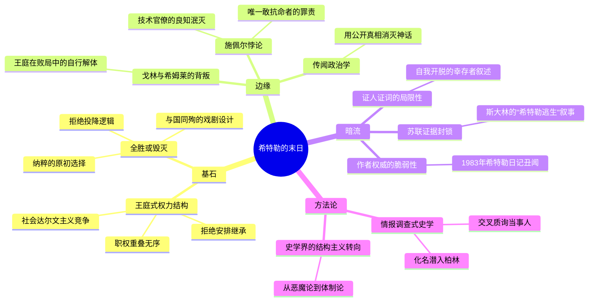

---
tags:
  - 第三帝国
  - 权力结构
  - 独裁末日
  - 柏林地堡
  - 历史考证
douban_link: https://book.douban.com/subject/35969796/
score: 5
cover: https://img3.doubanio.com/view/subject/s/public/s34267598.jpg
create_time: 2026-10-02
---

# 深层解构

### 一、基石：王庭政治——纳粹政权不是一台机器，而是一座宫廷

特雷弗-罗珀的核心论断，不是"希特勒死了"这个结论本身，而是支撑这个结论的政权解剖学：**第三帝国从来不是一个理性的、层级分明的现代国家机器，而是一座围绕独裁者运转的前现代宫廷**。

- **"王庭"而非"政府"**：希特勒厌恶日常政务，晚年深居 Berghof 山庄，靠亲信转述掌控国事。权力不再依附职位与程序，而依附于"接近元首的距离"。布格曼（Bormann）之所以权倾朝野，不因他是党秘书长，而因他是通往希特勒的唯一孔道。罗珀刻意使用"王庭"（court）这一路易十四式的词汇，将纳粹体制还原为 **廷臣政治**：内廷（布格曼）、外廷（戈培尔）、领地诸侯（希姆莱、戈林的独立王国）、弄臣（里宾特洛甫）。
- **制度化社会达尔文主义**：职位故意重叠、权限故意模糊，让诸权贵相互撕咬，最终裁决权归于"元首直觉"。这种结构在扩张期貌似高效，在败局中立刻显形为灾难——1945年4月的柏林，没有一个人能代表德国投降，因为**名义元首之外，帝国的权力结构根本没有合法的继承与决策序列**。
- **底层逻辑——全胜或毁灭**：罗珀揭示，"要么全面胜利，要么彻底毁灭"不是末日的疯狂，而是纳粹主义与生俱来的原初选择（original alternative）。1945年的焦土命令（尼禄命令）、殉葬式的死守柏林、与爱娃的婚礼和自杀，都是这一逻辑的忠实兑现。**希特勒的结局不是被逼出来的，而是被他自己精心排演出来的**——一场预先设计好的瓦格纳式终场。

一句话定义：这是一部用侦探手段完成的史学经典，它证明的不仅是希特勒之死，更是极权体制在失去扩张动能后必然坍缩为宫廷闹剧的结构性宿命。

### 二、边缘：被轻描淡写的洞见

- **背叛是王庭的自我了断**：第六章"连你也背叛了吗"最易被当作花絮阅读，实则暗藏全书最锋利的政治学判断。戈林试探继承权（4月23日电报）、希姆莱私自接触伯纳多特伯爵求和（4月28日路透社曝光），都不是道德背叛，而是宫廷体制的自然代谢——当"元首"这个权力源即将枯竭，诸侯提前改换门庭是结构必然。**独裁体制最忠诚的时刻，是它仍在胜利的时刻。**
- **施佩尔悖论——"唯一有罪的无罪者"**：后记中对施佩尔的评价是全书道德判断的巅峰。罗珀指出：满朝皆平庸钻营之徒，唯有施佩尔才智出众、敢于抗命（拒绝执行焦土令）、雄心是"建设性"的——**但正因如此，他才是纳粹德国"真正的罪犯"**。技术官僚哲学（"政治无关紧要，技术中立"）让才华与罪恶脱钩运行，这正是极权体制最危险的共谋形态：它需要的不是恶棍，而是有能力的、不问政治的执行者。
- **公开真相是对付神话的唯一武器**：罗珀写作本书的动机，是扑灭"希特勒还活着"的传说。他反复论证：掩盖证据只会制造圣物与朝圣——"你何时见过，藏起真的就能阻止人们发现假的？"这句方法论宣言超越了历史事件本身，成为一切辟谣工作的元原则：**谣言的解毒剂不是沉默，而是完整、公开、可核查的叙事**。

### 三、暗流：未被审视的认知前提

- **证人证词的自我开脱性**：本书主体证据来自1945年秋对地堡幸存者（林格、京舍、肯普卡、阿克斯曼等）的讯问，而这些人正处于战胜国羁押之下、纽伦堡审判前夜，有强烈的动机：撇清罪责、夸大元首的"疯狂"以反衬自身的"清醒"。罗珀以情报官的交叉质询技巧部分对冲了这一偏差，但**书中"希特勒完全脱离现实"的形象，可能部分是幸存者集体建构的**。后来苏联档案（牙医鉴定、颚骨残片）的逐步公开，既证实也修正了罗珀的部分细节。
- **阶级视角的滤镜**：罗珀是牛津托利派史家，笔下对纳粹新贵的描写常带旧贵族式的轻蔑——戈林的庸俗、里宾特洛甫的愚蠢被处理成"暴发户"的道德缺陷。这种文风增强了讽刺力量，但也让"王庭"比喻某种程度上是**用旧欧洲的范畴框住了现代极权的独特性**：纳粹的体制性犯罪能力，恰恰来自它对"旧精英"（国防军、工业家、司法系统）的收编，而非仅仅是对宫廷的滑稽模仿。
- **作者权威的历史反讽**：罗珀靠质疑传闻、以证据立身，却在1983年"希特勒日记"丑闻中亲手为赝品背书，令毕生声誉几近崩塌。这不减损本书价值，反而构成一个元层面的警示：**史学的可信度永远系于方法而非权威，而权威恰恰是方法最容易腐蚀的对象**。此外，斯大林坚持"希特勒逃往阿根廷"的官方口径，展示了政权如何出于政治需要（维持占领合法性、丑化西方）主动生产阴谋论——本书与苏联的博弈本身就是冷战信息战的一章。

### 四、给读者的三把钥匙

- **结构之钥**：评估任何独裁体制，别看它强盛时的效率神话，看它面对失败时的继承序列——凡是拒绝安排继承的体制，末日必然重演"地堡图景"：诸侯离散、决策瘫痪、以戏剧性毁灭代替体面退场。
- **共谋之钥**：施佩尔问题对每个专业人士都是拷问——当你以"技术中立""我只负责执行"为条件与权力合作时，你交换出去的不是中立，而是良知的定价权。
- **辟谣之钥**：对付"还活着"式的传说，最有效的方式不是压制而是穷尽式公开。罗珀用一本资料来源完整可查的书终结了西方世界的希特勒生存传说——反观苏联的封锁，反而让阴谋论多活了半个世纪。

# 章节内容

### 前言与引言（第七版前言 / 第三版引言）
交代成书背景：1945年秋罗珀受英国情报部门委托，化名"奥顿"少校潜入柏林，为粉碎"希特勒逃生西方"的政治谣言而调查其死亡真相。他在9、10月间讯问了地堡幸存者——政客、军人、秘书、司机乃至勤杂人员，包括进入过自杀现场并参与焚尸的帝国青年团领袖阿克斯曼和司机肯普卡。第三版引言记录了苏联方面对本书的态度（扣压证据、拒绝合作），并陈述了罗珀的核心方法论立场：真相公开是对付传说的唯一有效手段。

### 第一章 希特勒和他的王庭
全书的结构性铺垫。剖析第三帝国的权力拓扑：希特勒刻意不设正式继承序列、不定居首都、不主持例行内阁，以"元首意志"为唯一仲裁；其下布格曼垄断内廷、戈培尔掌宣传、希姆莱经营党卫军独立王国、戈林尸位素餐、里宾特洛甫充任弄臣。职位与权力彻底脱钩，晋升依赖宠信而非能力。罗珀断言：这不是现代官僚国家，而是一座由社会达尔文主义驱动的宫廷，其全部凝聚力只系于元首一人——这个判断为后面六章的崩塌埋下结构伏笔。

### 第二章 身陷败局的希特勒
聚焦1944年末至1945年初希特勒的身心与精神状态。军事上阿登反击失败、苏军压境；身体上左手左腿震颤加剧、佝偻早衰；精神上则遁入奇迹武器（喷气机、V武器）与"历史会重演腓特烈大帝式转机"的幻想。罗珀结合证人对每日军事会议的描述，展示一个在地图上调动已不存在的兵团、把败局归罪于全体德国人"不配"的元首。1945年1月他进驻柏林总理府地堡，焦土命令（"德国若败，便不配存活"）将"全胜或毁灭"的原初逻辑推向终点。

### 第三章 即将战败的王庭
视角从元首转向廷臣，是全书最辛辣的群像志。戈林退居上萨尔茨堡，在毒品与珍宝中自我麻痹；希姆莱一边执掌残兵，一边通过伯纳多特伯爵向西方暗送秋波；里宾特洛甫被盟友与敌人同时无视；戈培尔反而焕发"总体战"狂热，举家迁入柏林准备殉葬；施佩尔则利用军备部长职权，悄悄抵制焦土令，保存德国的战后生存能力。王庭在败局中不是团结御敌，而是各寻退路——宫廷体制的解体先于帝国的军事崩溃。

### 第四章 危机与决策
1945年4月的枢纽时刻。苏军发起柏林攻势，4月20日希特勒生日当天廷臣劝其南迁被拒；4月21-22日他经历首次公开崩溃，承认战争已败但拒绝离开柏林，宣布将与帝国首都共存亡。戈林获准前往南方"主持大局"埋下背叛伏笔；希特勒在围城中戏剧性地任命里特尔·冯·格莱姆为空军总司令（后者与女飞行员莱奇冒险飞入被围的柏林受命）。同时虚构的"施泰纳反击""文克第12集团军驰援"成为地堡军事会议的日常内容——决策系统已在想象中运转。

### 第五章 围攻地堡
地堡内部的末日生态志。苏军炮火之下，深埋地下的元首地堡维持着诡异的日常：与女秘书的午后茶会、与爱犬布隆迪的嬉戏、对婚礼细节的讨论。戈培尔携妻子玛格达和六个孩子住入地堡，夫妻已商定毒杀子女后殉葬。罗珀以证人的时间线拼出4月22日至28日的逐日记录：地面上是巷战与崩溃，地面下是平静得令人毛骨悚然的宫廷礼数——毁灭被排演成一场持续一周的仪式。

### 第六章 "连你也背叛了吗"
全书戏剧高潮。4月23日戈林电报询问可否依1941年法令继承元首全权，被希特勒解读为政变，盛怒之下剥夺其一切职务并下令逮捕（名义上还先指定其为继承人再撤职，以保全"体面"）；4月28日路透社披露希姆莱密盟消息，希特勒遭受最后一击。当夜他与爱娃·布劳恩成婚，随后口述政治遗嘱与私人遗嘱：开除戈林、希姆莱党籍，任命邓尼茨为帝国总统、戈培尔为总理——用一纸遗嘱完成对王庭的最后清算。墨索里尼被处决陈尸的消息，坚定了他"不给敌人活捉游街机会"的决心。

### 第七章 希特勒之死
1945年4月30日的死亡实录。中午与随员一一握手诀别、午餐后与爱娃退入私室，约15时30分双双自杀（希特勒手枪击颅，爱娃服毒）。林格、京舍等证人陈述焚尸过程：因汽油不足，焚毁极不完全，残骸草草掩埋于总理府花园——尸骸自此"消失"，成为此后数十年传说的温床。罗珀以多组独立证词交叉验证死亡细节，得出无可辩驳的结论：希特勒死于自杀，从未离开柏林。末尾交代地堡余波：戈培尔夫妇毒杀六名子女后自尽，布格曼、京舍等人突围，帝国总理府易主。

### 后记
罗珀的历史总清算。逐一点评王庭成员——戈林的堕落、里宾特洛甫的愚蠢、希姆莱的阴鸷——而将最重的判词留给施佩尔：满朝平庸之辈中唯一才智与勇气兼备者，恰是纳粹"技术官僚哲学"最纯正的化身，故为"政治意义上真正的罪犯"。全书结论回扣"全胜或毁灭"的原初选择：希特勒以一场精心设计的终局为自己的时代收尾，而历史学家的任务，就是用完整的真相拆掉这座神龛。

### 资料来源 / 索引
罗珀详细交代讯问证人名单、文件出处与证据链，使本书兼具情报报告与史学研究双重性质，也树立了当代调查式史学的体例标杆。

---

**阅读提示**：本书与库中《第三帝国的兴亡》《希特勒传》构成互文——夏伊勒负责全景、克肖负责崛起的社会学、罗珀负责崩塌的解剖学；三书并读，第三帝国的兴与亡各有了一个权威的透镜。罗珀开创的"王庭体制"论，也直接开启了后来"结构主义 vs 意图主义"的纳粹史学大论战（可延伸阅读克肖《碎碗论》中关于"为元首工作"的论证）。
