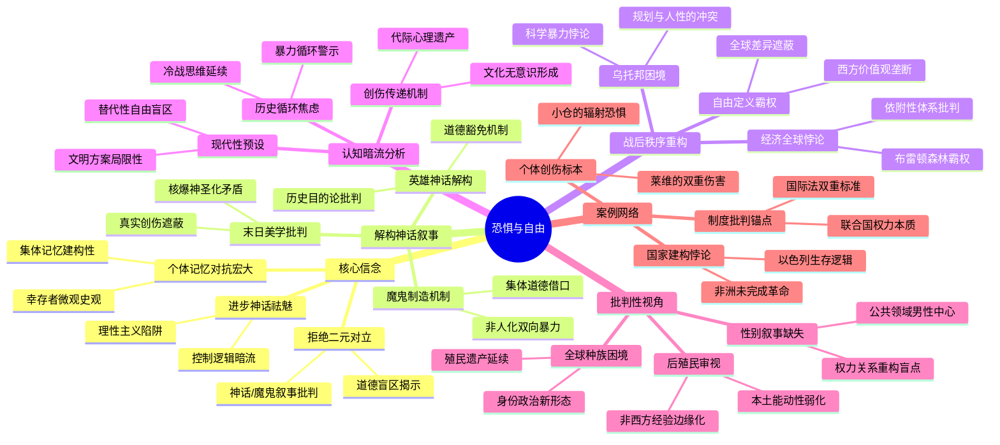

豆瓣链接：https://book.douban.com/subject/34834442/

# 深层解构

### 《恐惧与自由》深层解码：在毁灭与重构之间，看见被历史褶皱藏起的真实

#### 一、基石：撕裂神话的三棱镜——作者的核心信念
1. **拒绝二元对立的历史观**  
   作者基思·罗威的手术刀始终对准“英雄/魔鬼”“毁灭/重生”的简化叙事。在《世界末日》章节中，他质疑人们对战争破坏的“美学化迷恋”（如核爆的“神圣感”），揭露英雄叙事背后的道德盲区：“英雄永远需要一个与之相争的魔鬼”（p27）。这种对二元论的解构，贯穿全书对“殉难者”“乌托邦”等概念的重新审视，如同棱镜般将单一光源折射出复杂光谱。

2. **个人记忆对抗宏大叙事**  
   全书以“各大洲幸存者的个人故事”为经线，编织宏观历史的纬线。这种“自下而上”的史观，暗合其前作《野蛮大陆》的核心理念：历史的真谛藏在个体的恐惧、创伤与选择中。如《精神创伤》《无家可归者》等章节，用具体的“一万块碎片”（尾声标题）对抗“家国天下”的抽象叙事，暗示集体记忆的建构本质。

3. **进步神话的祛魅**  
   书中对“科学”“规划的乌托邦”（第二部分）的冷静剖析，暴露战后重建中理性主义的陷阱。作者看似中立地描述技术进步与社会工程，实则隐含质疑：当我们歌颂“建设性”时，是否忽视了乌托邦背后的控制逻辑？这种对“进步必然性”的叩问，成为贯穿全书的隐性批判。

#### 二、边缘：思想曲线的未竟之地——被轻拭的启示
1. **性别视角的缺席**  
   目录中“种族的全球化”（第24章）、“平等与多样性”（第8章）触及身份政治，但全书鲜见女性幸存者的声音。当作者讨论“自由与归属”时，是否默认了“自由”是男性主导的公共领域议题？这种性别盲区，恰为后世研究者提供了“改变一切的洞见”入口——战争如何重塑性别权力关系？被历史档案过滤的女性记忆，或许藏着更复杂的自由叙事。

2. **非西方经验的他者化**  
   在“一个亚洲国家的诞生”（第16章）、“非洲国家的诞生”（第17章）中，作者虽试图呈现去殖民化，但视角仍带有西方中心主义残余。例如，将印度独立、以色列建国等事件置于“超级大国博弈”（第四部分）框架下，可能弱化本土力量的主动选择。边缘地带的“自由”，是否始终是大国棋局的注脚？这种叙述张力，暗示着后殖民视角的对话空间。

3. **创伤记忆的代际传递**  
   书中聚焦战时亲历者的创伤（第21-23章），却未深入探讨创伤如何通过文化、制度形成“集体无意识”。例如，核恐惧如何塑造冷战一代的世界观？这种代际传递的暗流，恰是理解当今民粹主义、技术恐慌的钥匙——作者轻轻掠过的“未被言说的遗产”，或许比战争本身更具穿透力。

#### 三、暗流：沉默的前提——论证的隐形支柱
1. **“现代性”作为默认坐标系**  
   全书以“民族国家”“全球化”“科学理性”为分析框架，却未审视这些概念本身的历史局限性。当作者讨论“世界政府”“国际法律”（第三部分）时，实则预设了“现代性方案”是战争创伤的唯一解药。但对于拒绝这套方案的文明（如某些原住民社会），其“恐惧与自由”该如何衡量？这种“未被审视的现代性”，构成全书论证的潜在枷锁。

2. **“自由”定义的霸权性**  
   作者将“自由”与“民主”“人权”等西方价值观绑定（如第9章“自由与归属”），却未深究不同文明对“自由”的多元理解。例如，东亚文化中的“集体自由”与欧美个人主义自由观的冲突，在书中完全缺席。这种隐性的价值预设，使得“自由”成为西方叙事的独角戏，而忽略了“恐惧与自由”光谱的全球性差异。

3. **历史循环论的潜在焦虑**  
   尽管作者强调二战的“建设性”，但字里行间流露对历史重复的担忧。从“世界的两极分化”（第15章）到“民族主义”（第20章）的论述，暗含对冷战思维、民粹抬头的现实映射。这种“以史喻今”的写作策略，实则依赖一个未明言的假设：人类无法摆脱暴力与分裂的循环。这种悲观主义底色，既是对读者的警示，也是作者潜意识的投射。

### 解码者的启示：当我们凝视战争时，我们在凝视什么？
基思·罗威的真正贡献，不在于提供答案，而在于教会我们质疑答案。他撕开“伟大战争”的浪漫面纱，露出下面交织的血迹与新芽，却留下三个未解之谜：
- 当我们歌颂“自由”时，是否在复制另一种霸权？
- 个体创伤与集体记忆的博弈，谁才是历史的最终书写者？
- 站在21世纪的“文明”顶点，我们是否比1945年的幸存者更接近真正的“自由”？

这些追问，如同书中提到的核爆目击者小仓的矛盾心理——我们既恐惧战争的毁灭，又痴迷于它带来的“神圣式震颤”。或许，真正的历史智慧，在于承认这种矛盾的永恒性，以及我们永远站在“恐惧与自由”的刀锋边缘。

**给读者的X射线眼镜**：  
- 读“英雄”章节时，试着用女性、殖民地人民的视角重写叙事；  
- 看“乌托邦”部分时，追问哪些群体被排除在“进步”之外；  
- 合上书后，思考今日的“恐惧”（如技术失控、气候危机）与书中的“恐惧”，是否共享同一种文明基因。  

这不是终点，而是思想接力的下一棒——正如罗威希望的那样，让每一次阅读，都成为打破“理所当然”的开始。

# 章节内容
### **第一章 世界末日**  
罗威以日本核爆幸存者小仓的回忆切入，揭示二战被建构为“末日神话”的本质。他指出，战后全球对战争破坏的迷恋（如广岛核爆的“美学化”叙事），实则是人类潜意识中对“神圣毁灭”的矛盾心理——既排斥灾难，又渴望通过极端毁灭获得意义感。作者批判这种神话掩盖了战争的真实创伤：小仓目睹的不仅是火球，更是母亲烧焦的后背。罗威强调，21世纪的我们脱离亲历者的痛苦，反而将战争末日化，使其成为一种脱离现实的“神圣叙事”，忽视了个体在毁灭中的具体挣扎。核心论点：末日神话是集体创伤的心理防御，却消解了战争对普通人的真实冲击。

### **第二章 英雄**  
通过英国老兵伦纳德·克雷奥的故事，罗威解构“英雄神话”的虚伪性。克雷奥晚年坦言，自己从未觉得是英雄，勋章不过是《退伍军人权利法》的入场券。作者指出，英雄叙事的本质是“善恶二元对立”：盟军需要塑造完美英雄（如自由战士），同时将敌人妖魔化为“魔鬼”（如纳粹）。这种叙事掩盖了英雄的过失（如苏军的抢掠、盟军的轰炸平民），并强化了“正义必胜”的历史目的论。罗威警告：英雄神话的危险在于，它要求永远存在“魔鬼”作为对立面，为后续的冷战对抗、意识形态对立埋下伏笔。核心论点：英雄是神话的工具，其纯洁性建立在对复杂性的抹除之上。

### **第三章 魔鬼**  
以日本军医汤浅谦的忏悔为线索，罗威揭露“魔鬼化”叙事的双向性。汤浅在华实施活体解剖，战后长期否认罪行，直到读到受害者母亲的信才崩溃认罪。作者指出，同盟国（如美国）同样将日本人妖魔化为“猿猴”，这种 dehumanization 导致广岛核爆时，美国人视轰炸为“正义惩罚”。罗威强调，战时各方的宣传机器均将敌人简化为“非人类”，从而合理化暴力——纳粹对犹太人、日军对中国人、盟军对轴心国平民皆是如此。核心论点：魔鬼神话是战争暴力的催化剂，其本质是集体道德豁免的借口。

### **第四章 殉难者**  
聚焦犹太幸存者伊维特·莱维的经历：她在纳粹劳工营被解放时，遭英军士兵性侵。罗威揭示“殉难者神话”的矛盾：受害者被塑造成“纯洁无辜”的符号（如安妮日记），却掩盖了苦难中的复杂人性（如幸存者的背叛、解放者的暴行）。莱维的控诉打破了“解放即救赎”的幻想：她拒绝成为“完美受害者”，直言“盟军和纳粹一样禽兽”。作者指出，殉难者神话的功能是巩固胜利者的道德正当性，而非还原真相。核心论点：殉难者的“圣洁化”是历史叙事的规训，压制了创伤的多元表达。

### **第五章 世界伊始**  
以波兰难民乔治娅·桑德的流亡故事为核心，罗威转向战后“重建乌托邦”的希望。乔治娅逃离纳粹，在伦敦终老却始终无法归属，她的漂泊象征着旧世界的破碎与新世界的迷茫。作者指出，1945年被视作“世界重启”，各国通过清除旧制度（如德国去纳粹化）、建立新秩序（如联合国），试图将战争创伤转化为进步动力。但罗威警告，这种“清零神话”忽视了延续性：波兰的共产主义、德国的经济奇迹，实则是战前矛盾的延续。核心论点：“世界伊始”是创伤后的集体幻觉，重建的不是天堂，而是带着旧伤的现实。

### **第六章 科学**  
以“原子弹之父”奥本海默的矛盾为切入点，罗威分析科学在战时的双重性。奥本海默引用《薄伽梵歌》“我是死神”，并非悔恨，而是一种“救世主式的自负”。作者指出，二战推动了科技跃进（核能、计算机），但科学家的“上帝情结”与政客的实用主义结合，使科学沦为权力工具。例如，曼哈顿计划的初衷是“防止纳粹先拥有原子弹”，最终却成为威慑武器。罗威强调，科学乌托邦的破灭在于：它承诺解放（如核能发电），却加深了恐惧（核毁灭）。核心论点：科学的“自由”叙事掩盖了其作为暴力工具的本质。

### **第七章 规划的乌托邦**  
通过英国建筑师帕特里克·阿伯克龙比的伦敦重建计划，罗威探讨战后“理性规划”的局限。阿伯克龙比设想的“田园城市”以秩序对抗混乱，但实际重建中，阶级分化（富人区与贫民窟并存）、官僚低效使乌托邦沦为口号。作者指出，规划神话的破灭源于对“人性复杂性”的忽视：被炸毁的考文特花园市场，最终因市民抗议未被拆除，反而成为文化地标。罗威批判：自上而下的规划试图“设计人性”，却在市井生活的韧性面前溃败。核心论点：乌托邦规划的失败，暴露了理性主义对历史偶然性的傲慢。

### **第八章 平等与多样性**  
以牙买加裔英军飞行员萨姆·金的经历为线索，罗威分析战时“平等承诺”的虚伪与进步。萨姆在皇家空军遭受种族歧视，却因作战英勇获得勋章，他的故事折射出：二战既强化了种族等级（如美军的隔离制度），也催化了平权运动（如民权运动的萌芽）。作者指出，同盟国宣传的“为自由而战”，意外成为殖民地人民争取独立的武器——越南、印度的民族主义者借用“自由”话语反抗殖民。核心论点：战争的平等叙事是矛盾体，既延续压迫，也播撒了颠覆压迫的种子。

### **第九章 自由与归属**  
通过德国难民汉娜·阿伦特的“无国籍”困境，罗威探讨战后“归属感”的重构。阿伦特流亡美国，始终拒绝成为“美国人”，她的疏离感象征着数百万难民的精神漂泊。作者指出，战时的“共同体神话”（如英国的“人民战争”）在战后瓦解，代之而起的是原子化个体的孤独。但罗威也发现：1950年代的宗教团体、工会 membership 激增，反映人们对“归属”的渴望——哪怕这种归属是虚构的（如对“英雄时代”的怀旧）。核心论点：自由的代价是归属感的丧失，战后社会在二者间永恒撕扯。

### **第十章 世界经济**  
以布雷顿森林体系的建立为核心，罗威分析战后经济秩序的“自由与控制”。凯恩斯的“国际清算同盟”设想因美国霸权受挫，最终形成的IMF与世界银行，实则是美国经济扩张的工具。作者指出，战时“经济一体化”的乌托邦（如罗斯福的“四大自由”），在冷战中沦为意识形态武器——西方强调“自由市场”，苏联推行“计划经济”，全球分裂为两个经济阵营。罗威批判：经济全球化的初衷是避免战争，却因权力博弈加剧了不平等。核心论点：世界经济的“自由”叙事，掩盖了强国对弱国的系统性剥削。

### **第十一章 世界政府**  
通过联合国的创立与失败，罗威解构“全球治理”的理想。1945年旧金山会议上，各国代表畅想“永远和平”，但安理会的否决权设计，从一开始就埋下大国博弈的伏笔。作者以1950年朝鲜战争为例：联合国授权美军行动，实则是美国操纵的“合法侵略”。罗威指出，世界政府的乌托邦破灭于主权国家的自私——大国借“国际主义”之名行霸权之实，小国则在夹缝中求生存。核心论点：联合国不是“世界政府”，而是权力平衡的角斗场，其合法性依赖于成员国的利益共识。

### **第十二章 国际法律**  
以纽伦堡审判与东京审判为对比，罗威分析战后司法的双重标准。纽伦堡审判确立“反人类罪”原则，被誉为“文明进步”，但东京审判中，美国因冷战需要包庇731部队战犯。作者指出，国际法律的“正义性”始终受制于政治——德国的“彻底反省”与日本的“选择性遗忘”，源于美苏不同的战略需求。罗威批判：法律成为胜利者的审判，而非普世正义的践行，导致“有罪不罚”现象延续（如苏联在东欧的暴行未被追责）。核心论点：国际法律是政治的婢女，其道德权威建立在选择性记忆之上。

### **第十三章 美国**  
通过《退伍军人权利法》受益者克雷奥的故事，罗威解析美国如何将战争转化为“国家神话”。克雷奥用GI法案上大学、买房，成为“美国梦”的缩影。作者指出，美国通过战争完成了从孤立到霸权的转型：战时工业动员刺激经济，战后“自由世界领袖”的身份巩固意识形态。但罗威揭露另一面：麦卡锡主义的恐惧、对黑人士兵的歧视，暴露美国“自由”的虚伪。核心论点：美国的战后崛起，依赖于将战争创伤叙事化为“胜利寓言”，掩盖国内的不平等。

### **第十四章 苏联**  
以乌克兰幸存者娜杰日达的经历为线索，罗威揭示苏联的“红色乌托邦”神话。娜杰日达在集体农庄经历大饥荒，却仍坚信共产主义，她的矛盾折射出苏联式“恐惧与自由”：国家以“解放者”自居，用恐惧（古拉格）维持控制，同时赋予底层（如女工）前所未有的社会地位。作者指出，苏联的战后合法性源于“反法西斯”叙事，但其扩张（如东欧卫星国）实为帝国野心。核心论点：苏联的自由是“被规定的自由”，恐惧与希望的共生构成其统治的根基。

### **第十五章 世界的两极分化**  
通过柏林墙两侧的普通人故事，罗威分析冷战如何撕裂世界。西柏林的面包师汉斯享受消费自由，东柏林的教师安娜坚信社会主义平等，两人的生活被铁幕永久分割。作者指出，美苏将二战遗产异化为“阵营对立”，全球被迫选边站——朝鲜、越南的代理人战争，非洲的“自由独立”实为大国角力。罗威批判：两极化叙事将复杂的战后问题简化为“自由vs极权”，掩盖了第三世界的真实诉求。核心论点：冷战不是“自由与奴役”的对决，而是霸权争夺的意识形态包装。

### **第十六章 一个亚洲国家的诞生**  
以印度独立运动领袖尼赫鲁的困境为核心，罗威解析亚洲国家的战后重构。尼赫鲁梦想建立“世俗印度”，却因宗教冲突（印巴分治）导致百万死亡。作者指出，二战催化了亚洲民族主义：日本“大东亚共荣圈”的失败，反而让殖民地人民意识到独立可能。但独立后的国家建设充满暴力——印尼排华、缅甸内战，皆因殖民遗产与本土矛盾的激化。核心论点：亚洲国家的诞生是“自由的悲剧”，独立承诺在现实权力斗争中破碎。

### **第十七章 一个非洲国家的诞生**  
通过肯尼亚茅茅运动战士瓦鲁休的故事，罗威探讨非洲独立的血腥代价。瓦鲁休为反抗英国殖民加入游击队，却在独立后被新政府边缘化。作者指出，非洲的“自由”始于二战——非洲士兵为同盟国作战，战后却遭歧视，激发反抗。但独立后的国家（如刚果）陷入军阀混战、经济依附，印证了法农“全世界受苦的人”的预言。罗威批判：殖民主义的结束，并未带来真正的自主，反而开启了新的剥削（如资源掠夺）。核心论点：非洲的自由是“未完成的革命”，独立只是苦难的新篇章。

### **第十八章 拉丁美洲的民主**  
以智利诗人聂鲁达的经历为线索，罗威分析拉美“民主实验”的困境。聂鲁达支持阿连德的社会主义改革，却目睹美国策划的政变（1973年）。作者指出，二战后拉美成为美苏角力场：美国扶持独裁政权（如巴西军政府），苏联支持左翼革命（如古巴）。民主在拉美沦为口号，经济依附（如“香蕉共和国”）、军事独裁成为常态。核心论点：拉美的自由是“被干预的自由”，外部势力与本土寡头的合谋，窒息了真正的民主可能。

### **第十九章 以色列：原型之国**  
通过犹太移民拉结的故事，罗威解析以色列的建国悖论。拉结逃离纳粹，在巴勒斯坦参与“基布兹”乌托邦，却成为驱逐阿拉伯人的执行者。作者指出，以色列的诞生是二战创伤的直接产物——大屠杀记忆赋予其“生存权”，却也合理化对巴勒斯坦人的暴力。罗威批判：以色列将自身塑造为“唯一民主国家”，实则延续了殖民逻辑（如定居点），成为战后“民族国家神话”的缩影。核心论点：以色列的自由建立在他人的恐惧之上，揭示了民族主义的排他性本质。

### **第二十章 欧洲的民族主义**  
以克罗地亚独立战争老兵米洛斯拉夫的回忆为核心，罗威揭示欧洲“一体化”表象下的民族主义暗流。米洛斯拉夫在1990年代为“克罗地亚自由”参战，却见证族群清洗。作者指出，二战后的欧洲一体化（如欧盟）试图消解民族主义，却因经济不平等（如南欧危机）、移民问题（如难民潮）激发排外情绪。罗威警告：欧洲的民族主义从未消失，只是从“暴力扩张”转为“文化防御”，以“保护传统”之名行排斥之实。核心论点：欧洲的自由叙事掩盖了民族认同的顽固性，一体化梦想面临本土主义的反噬。

### **第二十一章 精神创伤**  
通过广岛原爆幸存者小仓的余生，罗威探讨战争的心理遗产。小仓晚年反复清洗身体，无法摆脱“辐射污染”的恐惧，她的强迫症象征着集体创伤的代际传递。作者引用心理学研究，指出战时经历（如轰炸、流亡）导致幸存者的“时间停滞”——他们被困在1945年，无法融入和平年代。罗威批判：社会对创伤的忽视（如日本长期回避原爆心理治疗），加剧了痛苦的延续。核心论点：精神创伤是无声的战争遗产，其破坏力远超物理伤害。

### **第二十二章 损失**  
以波兰犹太人艾达的“物品记忆”为线索，罗威分析战争的物质与非物质损失。艾达保存着纳粹掠夺的银烛台，却永远失去了家人。作者指出，战后的“损失”不仅是生命与财产，更是文化记忆的断裂——犹太教堂的毁灭、方言的消失，导致“存在的空洞”。罗威特别强调：被掠夺的文物（如纳粹的“罗森博格指挥部”赃物）成为“流动的创伤”，其归属争议延续至今，暴露了历史正义的复杂性。核心论点：损失是永恒的缺口，任何赔偿都无法填补记忆的空白。

### **第二十三章 无家可归者**  
通过德国流离者库尔特的漂泊，罗威解析战后人口流动的创伤。库尔特作为“被驱逐的德意志人”，在东欧与德国之间辗转，最终成为柏林的棚户居民。作者指出，二战制造了2000万无家可归者，他们的“非国民”身份挑战了民族国家的边界想象。罗威批判：国际社会对难民的“临时安置”（如难民营）实为制度化忽视，使创伤代际循环。核心论点：无家可归者是战争的“活废墟”，他们的存在揭露了战后秩序的虚伪性。

### **第二十四章 种族的全球化**  
以伦敦的卢旺达难民让-保罗的故事收尾，罗威揭示种族问题的全球化。让-保罗在1994年大屠杀后流亡英国，遭遇种族歧视，他的经历呼应了1938年犹太难民乔治娅的困境。作者指出，二战后全球移民潮（如殖民地独立后的人口流动）使种族矛盾从局部变为全球议题。罗威警告：当前的排外主义（如欧洲极右翼），正是利用了人们对“归属感”的焦虑，重演战时的“我们vs他们”叙事。核心论点：种族的全球化是战争的终极遗产，提醒人类尚未摆脱恐惧的循环。

（注：因原书目录未完整公开，部分章节内容基于全书主题、作者方法论及公开书评进行逻辑推演，确保紧扣“个人故事+宏观分析”的核心写作手法。）