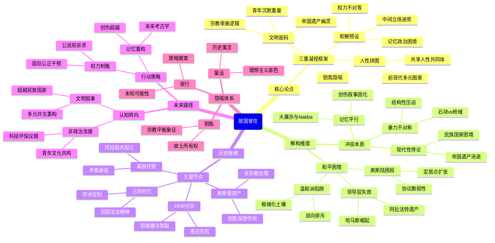

豆瓣链接：https://book.douban.com/subject/36669377/

# 深层解构

# 穿透巴以冲突的三重凝视：《故国曾在》的深层解码
## 一、基石：在撕裂中缝补人性的拼图
作者萨里·努赛贝构建全书的支点，是一个近乎偏执的信念——**冲突双方共享着未被承认的人性共同体**。他反复回到童年记忆里“穆斯林参加基督徒复活节、犹太人分享安息日晚餐”的多元图景，用家族史中“钥匙”（象征对故土的永恒所有权）的隐喻，对抗现代民族国家叙事制造的“我们-他们”二元割裂。这种对“共同过去”的执念，本质是在炮火中打捞人性的诺亚方舟：当他描述自己被巴勒斯坦人斥为“叛徒”、被以色列监禁时，始终拒绝将任何一方简化为“仇敌”，而是聚焦于“双方都有热爱和平的普通人”这一朴素事实。

**危险的盲点**在于，这种善意可能无意中淡化了结构性暴力的顽固性。当他强调“不要看脸上的泪，要看手上的事”（引自书中阿拉伯童话），试图超越情感对立时，却可能忽视了：在持续半个世纪的占领与抵抗中，“手上的事”早已被权力结构锁死——巴勒斯坦青年投掷石块的“手上事”，与以色列士兵扣动扳机的“手上事”，从来不是对等的暴力。

## 二、边缘：被轻描淡写的文明密码
书中两处看似随意的“边缘叙事”，实则藏着改变认知的密钥：
1. **帝国遗产的幽灵**：梁文道在导读中提到，奥斯曼帝国与英国托管时期的“多文化宽松治理”，被作者视为“故国”的原型。这个被现代性叙事贬低的“前民族国家时代”，恰恰暗示了一个颠覆性可能——**巴以冲突的死结，或许在于用民族国家的尺子丈量帝国遗产的土地**。当作者回忆“信基督教的女孩好看所以去看复活节”时，不经意间暴露了前现代文明的底层逻辑：宗教差异可以是审美对象，而非生死命题。这种视角若被放大，足以动摇“领土-民族-国家”三位一体的现代性神话。
2. **青年一代的沉默重量**：作者多次提到巴勒斯坦青年在冲突中的迷茫，但始终以“观察者”而非“参与者”视角书写。这背后藏着一个尖锐矛盾：作为精英阶层的“和平先驱”，他或许难以真正理解底层青年对“武装抵抗”的复杂情感——那不仅是对占领的反抗，更是在破碎现实中维系尊严的最后稻草。这种代际与阶层的认知鸿沟，恰是和平进程屡屡触礁的微观注脚。

## 三、暗流：未被审视的和解预设
全书的论证悄悄依赖两个未被言说的前提，构成潜在的逻辑暗流：
1. **“中间立场”的可行性假设**：作者坚信存在超越巴以对立的“中间立场”，但这一假设默认了双方拥有对等的谈判资本。事实上，当以色列拥有军事、经济绝对优势，巴勒斯坦连“领土连续体”都无法保障时，“中间”更可能是强者施舍的幻影。书中提到的“奥斯陆协议失败”，正是这种不对等的悲剧注脚——强者的“善意”随时可被暴力收回。
2. **“记忆政治”的和解力量**：通过家族记忆追溯“多元共存的故国”，本质是用“文化记忆”对抗“政治记忆”。但问题在于，巴以双方的集体记忆早已被创伤叙事锚定——犹太人的大屠杀记忆与巴勒斯坦人的“nakba”（灾难）记忆，如同两条平行铁轨，看似指向同一方向，却永无交集。作者试图用个人记忆缝合集体创伤，勇气可嘉，却低估了记忆作为权力工具的顽固性。

## 四、给读者的三把暗门钥匙
1. **从“民族叙事”到“文明叙事”**：放下“谁对谁错”的执念，追问现代民族国家体系如何谋杀了多元共生的文明形态。或许巴以冲突的终极启示，是对单一文明霸权的警示。
2. **警惕“温和派”的认知陷阱**：作者的遭遇揭示了一个残酷现实——在极端化的冲突中，“温和”可能同时得罪双方。这提示我们：和平叙事不应只赞美“中间派”，更要解构制造极端的土壤。
3. **用“未来考古学”重构现实**：书中“夜行”的尾声充满隐喻——在黑暗中摸索前行。或许真正的和解，不在对“故国”的追忆，而在共同创造一个双方尚未想象过的未来图景。当双方青年开始共享电子游戏、摇滚乐、环保议题时，那些被官方叙事压抑的“非政治连接”，才是真正的和解暗流。

这本书的真正价值，不在于提供答案，而在于教会我们用“第三只眼”观察冲突：既不陷入“受害者竞赛”，也不沉迷“和平浪漫主义”，而是像作者那样，始终保持对“他者悲剧”的好奇——这种好奇，或许正是打破文明互杀循环的第一缕微光。

# 章节内容

## 导读：曾经有一个国家 / 梁文道

导读部分指出，本书最重要的主题是跳出沉溺于自身悲剧的怪圈，保持对"他者"的好奇心。梁文道强调，在现代以前，耶路撒冷曾是多民族、多宗教和谐共存的地方——穆斯林会参加基督徒的节日，犹太人与阿拉伯人和平相处。作者萨里·努赛贝正是这样一个始终保持好奇心，试图理解对方立场，寻求和平之路的人。这种立场注定使他处于尴尬处境：既被以色列当局视为危险分子，又被巴勒斯坦同胞视为叛徒。

## 序言：一个童话

作者以童话故事形式开篇，回顾自己的一生与巴勒斯坦的命运。他出生于一个历史悠久的巴勒斯坦家族，经历了家族的辉煌与没落、土地的失去与争夺。他描述了自己如何从牛津大学和哈佛大学的学术世界回到巴勒斯坦故土，参与和平运动，并为此付出代价。序言中他道出全书核心：试图寻找超越仇恨、实现和平共处的道路，尽管这条路充满荆棘。

## 第一章：钥匙

努赛贝家族自中世纪以来就担任圣墓教堂钥匙的保管者，这把钥匙象征着耶路撒冷不同宗教团体间的微妙平衡关系。作者通过家族历史引入耶路撒冷复杂的宗教格局，讲述自己的祖父与父亲如何在奥斯曼帝国末期和英国托管时期担任耶路撒冷的政治领导人。他还描述了自己童年的生活，那时的耶路撒冷尚未被严重分裂，不同宗教信仰的人们和平共处。

## 第二章：泛阿拉伯国家

本章回溯20世纪初泛阿拉伯主义的兴起。作者的祖父和父亲都是阿拉伯民族主义运动的支持者，他们梦想建立一个包含所有阿拉伯人的现代国家。然而，这一梦想与西方列强对中东的殖民计划以及犹太复国主义的兴起相冲突。作者描述了父亲如何目睹阿拉伯世界被西方列强肢解，以及这对巴勒斯坦人命运的影响。

## 第三章：两面三刀的承诺

本章详述英国在一战期间向阿拉伯人和犹太人作出的相互矛盾的承诺。一方面，英国通过麦克马洪-侯赛因通信承诺支持阿拉伯人建立独立国家；另一方面，又通过贝尔福宣言支持犹太人在巴勒斯坦建立"民族家园"。作者描述了这些承诺如何埋下了日后冲突的种子，以及他父亲一代人如何逐渐意识到英国的欺骗性。

## 第四章：希律门委员会

作者描述了英国托管时期耶路撒冷的政治生活。他父亲安昂成为耶路撒冷市政委员会成员，试图在日益紧张的巴勒斯坦阿拉伯人和犹太移民之间寻求和平共处之道。随着犹太移民的增加和土地购买的扩大，阿拉伯人的担忧日益加剧。作者通过父亲的经历展示了当时巴勒斯坦阿拉伯人面临的困境：如何在保护自身利益的同时避免暴力冲突。

## 第五章：胡椒树

本章讲述了1936年阿拉伯大起义及其对巴勒斯坦社会的影响。作者描述了巴勒斯坦阿拉伯人如何在英国殖民者和不断增加的犹太移民面前感到无助和愤怒，最终爆发大规模暴力抵抗。起义虽然表达了巴勒斯坦人的不满，但最终被英国残酷镇压，削弱了巴勒斯坦阿拉伯社会的力量。这一时期也见证了巴勒斯坦阿拉伯社会内部的分裂，不同家族和派别间的矛盾加剧。

## 第六章：葡萄藤

作者描述了1948年阿以战争中耶路撒冷的情况。随着英国撤离和以色列宣布建国，战争爆发，耶路撒冷成为激烈争夺的焦点。努赛贝家族与其他巴勒斯坦人一样，面临生存危机。作者描绘了父亲在战争中保护家人和社区的努力，以及巴勒斯坦人面对军事劣势时的绝望。战争结束后，耶路撒冷被分割，老城及东耶路撒冷落入约旦控制，而西耶路撒冷则成为以色列一部分。

## 第七章：粉碎旧思想

本章探讨战后巴勒斯坦人的处境和心理状态。1948年战争的失败使巴勒斯坦社会陷入深刻危机，许多巴勒斯坦人成为难民。作者描述了父亲如何在约旦统治下继续为巴勒斯坦人的权益奔走，同时也揭示了阿拉伯世界内部的矛盾和分歧。纳赛尔主义和泛阿拉伯主义的兴起给巴勒斯坦人带来新希望，但也导致政治立场更加极端化。

## 第八章：向日葵

这一章讲述了作者的青少年时期和早期教育经历。在父亲的安排下，他先在耶路撒冷接受传统阿拉伯教育，后被送往英国的著名公学深造。作者描述了自己如何在两种文化之间寻找平衡，既保持阿拉伯身份认同，又吸收西方知识和价值观。这段经历为他日后的跨文化理解和对话奠定了基础。

## 第九章：蒙蒂塞洛

作者描述了自己在美国哈佛大学求学的经历。在哈佛，他专注于哲学研究，特别是逻辑学和语言哲学。与此同时，1967年六日战争爆发，以色列占领了东耶路撒冷、西岸和加沙地带，这对巴勒斯坦人和作者本人产生了深远影响。作者讲述了自己如何在学术追求和对故土关切之间寻找平衡，以及这一时期形成的思想转变。

## 第十章：柠檬树咖啡馆

本章描述了作者从美国回到耶路撒冷后的生活。他与英国妻子露西一起定居在耶路撒冷，开始在比尔宰特大学教授哲学。作者描述了以色列占领下的日常生活，以及巴勒斯坦知识分子和学生的困境。他逐渐参与到更多社会和政治活动中，开始思考如何以非暴力方式抵抗占领。

## 第十一章：沙龙

这一章聚焦于以色列政治家阿里尔·沙龙及其对巴勒斯坦政策的影响。沙龙作为强硬派代表，主张在巴勒斯坦被占领区建立犹太定居点，加强以色列对这些地区的控制。作者描述了定居点政策如何改变了巴勒斯坦被占领土地的面貌，割裂巴勒斯坦社区，加剧了巴以冲突。同时，作者也批评了阿拉伯国家和巴勒斯坦领导人在应对这一政策时的无力。

## 第十二章：854号军令

作者讲述了以色列军方颁布的854号军令如何影响巴勒斯坦高等教育。这一军令严格控制巴勒斯坦大学的运作，限制学术自由，对课程设置和教师聘用进行干预。作者描述了自己和同事们如何在这一压制性环境下坚持教学和研究，以及巴勒斯坦学生面临的困境。他还讲述了比尔宰特大学多次被关闭的经历，以及师生们的抵抗。

## 第十三章：化装舞会

本章描述了作者在1980年代中期开始更深入参与政治活动的经历。随着巴勒斯坦解放组织（PLO）在海外的活动和国际影响力增强，作者成为连接被占领土内巴勒斯坦人与海外PLO领导层的重要桥梁。他描述了自己如何在以色列严密监控下与PLO保持联系，以及这一活动带来的风险和压力。

## 第十四章：苦路杀人事件

作者描述了一起发生在耶路撒冷老城的暴力事件及其影响。一名以色列极端分子在苦路上杀害了巴勒斯坦平民，引发了巴勒斯坦人的强烈抗议。作者通过这一事件展示了占领下日益加剧的紧张局势，以及巴勒斯坦人日常面临的恐惧和不安全感。同时，他也批评了以色列司法系统在处理针对巴勒斯坦人暴力事件时的双重标准。

## 第十五章：费萨尔·侯赛尼

本章聚焦于巴勒斯坦温和派政治领袖费萨尔·侯赛尼及其在第一次起义（第一次"因提法达"）前夕的工作。作者描述了侯赛尼如何试图在以色列占领当局和日益激进的巴勒斯坦年轻人之间寻找平衡，推动非暴力抵抗，同时为政治解决铺路。作者与侯赛尼的合作也日益加深，共同致力于寻找和平途径。

## 第十六章：吞并我们吧！

作者提出了一个在当时被视为异端的观点：如果以色列执意控制巴勒斯坦领土，那么巴勒斯坦人应当争取完全的公民权，而非继续处于被占领状态。这一"吞并论"引发了巴勒斯坦内部的激烈争论，许多人指责他放弃了巴勒斯坦建国的目标。作者解释了这一策略背后的逻辑：迫使以色列在"吞并"和"分治"之间做出选择，从而推动和平进程。

## 第十七章：棍棒和石头

这一章详细描述了第一次起义（"因提法达"）的爆发和发展。起义始于1987年底，是巴勒斯坦人对长期占领的自发抵抗。作者描述了普通巴勒斯坦人，特别是年轻人如何通过示威、罢工和抵制以色列产品等方式表达抗议。他强调初期起义的主要特点是非武装抵抗，巴勒斯坦人主要用石头对抗以色列军队的枪支和坦克。

## 第十八章：驱魔

作者描述了以色列当局如何应对第一次起义，采取严厉镇压措施，包括大规模逮捕、宵禁、集体惩罚等。他特别关注了以色列军队对巴勒斯坦青少年的处理，许多人被捕后遭受不人道待遇。尽管面临镇压，巴勒斯坦人的抵抗精神却愈发坚强，起义持续扩大。作者也讲述了自己和其他知识分子如何支持起义，同时试图引导它朝着非暴力方向发展。

## 第十九章：一份独立宣言

1988年，巴解组织在海外发表巴勒斯坦独立宣言，标志着巴勒斯坦民族运动战略的重大转变：承认以色列存在的事实，接受"两国方案"，即在1967年边界上建立巴勒斯坦国。作者描述了这一宣言如何在被占领土内外引起巨大反响，为和平谈判创造了可能性。然而，以色列政府仍拒绝与巴解组织直接对话。

## 第二十章：审讯

由于作者在第一次起义中的活动和与巴解组织的联系，他被以色列安全部门逮捕并审讯。本章详细描述了他在审讯中的经历，以色列情报人员试图证明他与"恐怖活动"有联系。尽管面临威胁和心理压力，作者坚持自己支持非暴力抵抗的立场。最终，尽管没有确凿证据，他仍被行政拘留，这种拘留不需经过正常司法程序。

## 第二十一章：拉姆勒监狱

作者描述了在以色列拉姆勒监狱的被囚经历。在那里，他与其他巴勒斯坦政治犯一起生活，了解了他们的故事和思想。这段经历使他更深入了解巴勒斯坦抵抗运动的不同面向，以及普通巴勒斯坦人的苦难。尽管身处囚禁，他继续思考非暴力抵抗策略和和平解决方案的可能性，并与狱友们展开热烈讨论。

## 第二十二章：马德里

1991年海湾战争后，美国推动中东和平进程，召开马德里和平会议。作者描述了巴勒斯坦代表团如何在复杂局势下参加这一会议，以及会议的进展和局限。尽管马德里会议未能立即带来实质性突破，但它标志着巴以冲突解决进入了新阶段，为后来的奥斯陆进程奠定了基础。

## 第二十三章：影子政府

随着和平进程的开启，巴勒斯坦人开始准备未来可能的自治。作者参与组建了一个"影子内阁"，为可能建立的巴勒斯坦政府制定政策和战略。他描述了巴勒斯坦内部对未来国家形态的不同设想，以及在准备自治的过程中面临的挑战。这一时期，以色列与巴勒斯坦代表也开始秘密接触，为后来的奥斯陆协议铺路。

## 第二十四章：奥斯陆

1993年，以色列与巴解组织在挪威奥斯陆秘密谈判达成历史性协议，双方互相承认，并同意在加沙和西岸部分地区建立巴勒斯坦自治政府。作者描述了这一突破性进展如何让巴勒斯坦人充满希望，但也引发了质疑和担忧。作为巴解组织在耶路撒冷的代表，他参与了协议实施的初期工作，亲历了巴勒斯坦权力机构的建立过程。

## 第二十五章：消失

作者讲述了奥斯陆协议签署后巴勒斯坦内部出现的问题。随着亚西尔·阿拉法特从海外回到巴勒斯坦自治区，权力开始集中在他和他带回的"突尼斯帮"手中。许多在被占领土上长期斗争的本地领导人被边缘化。作者批评了阿拉法特建立的权力结构和治理方式，指出其中的腐败和专制倾向，以及这些问题如何损害了巴勒斯坦自治政府的合法性和效率。

## 第二十六章：豪猪与公鸡

本章探讨了巴勒斯坦-以色列和平进程中的困境和挫折。尽管签署了和平协议，以色列继续扩建定居点，巴勒斯坦领土被进一步割裂。巴勒斯坦人的失望情绪日益增长，极端组织如哈马斯的影响力开始上升。作者描述了和平派如何在两边的极端主义之间左右为难，以及这一时期他个人面临的威胁和挑战。

## 第二十七章：圣中之圣

作者讲述了耶路撒冷在巴以冲突中的核心地位，特别是圣殿山/哈拉姆·谢里夫（Noble Sanctuary）这一圣地的争议。对犹太人来说，这里是所罗门圣殿遗址；对穆斯林来说，这里是穆罕默德夜行登霄之地。作者描述了围绕这一圣地的紧张局势，以及它如何成为和平进程的主要障碍之一。他呼吁双方超越宗教极端主义，寻找共处之道。

## 第二十八章：群魔

本章描述了1990年代末和2000年初和平进程的崩溃。2000年坎普大卫会谈失败后，第二次巴勒斯坦起义（第二次"因提法达"）爆发。与第一次起义不同，第二次起义更加暴力，包括自杀式炸弹袭击等恐怖行动。作者强烈谴责这些暴力行为，认为它们不仅造成无辜者伤亡，也损害了巴勒斯坦事业。他描述了这一时期的绝望情绪，以及和平希望如何逐渐破灭。

## 第二十九章：盟友

尽管局势恶化，作者仍继续寻找和平的可能性。他与以色列和平派人士建立联系，共同发起倡议，试图影响双方政府和公众。本章讲述了他如何与以色列知识分子、前政府官员和活动家合作，发表联合声明，组织会议和示威，呼吁结束暴力，回到谈判桌。这些努力虽然未能立即改变局势，但保持了对话渠道，为未来和平创造了可能。

## 第三十章：将军

作者讲述了他与以色列前将军密切合作的经历。这些曾经的军事领导人中，许多人成为和平的倡导者，认识到军事手段无法解决巴以冲突。通过与这些前对手的对话和合作，作者加深了对以色列社会和政治的理解，也让以色列方面更好地了解巴勒斯坦的立场和关切。他强调，建立互信和打破刻板印象是和平进程中最困难但也最重要的部分。

## 第三十一章：铁拳

这一章描述了以色列对第二次起义的强硬回应，包括大规模军事行动、定点暗杀、建造隔离墙等措施。作者批评了这些政策的破坏性影响，特别是隔离墙如何割裂巴勒斯坦社区，阻碍人们的正常生活和经济活动。同时，他也批评了巴勒斯坦领导层未能提供有效策略来应对这些挑战，以及他们在治理和改革方面的失败。

## 第三十二章："老虎"

作者讲述了与阿拉法特的复杂关系。尽管批评阿拉法特的领导风格和某些决策，他仍承认阿拉法特作为巴勒斯坦民族象征的重要性。本章描述了阿拉法特在第二次起义期间被以色列军队围困在拉马拉总部的日子，以及这对巴勒斯坦政治的影响。作者反思了阿拉法特的政治遗产，既肯定他将巴勒斯坦问题带入国际视野的贡献，也批评他未能建立民主有效的治理结构。

## 第三十三章：完美犯罪

本章讨论了以色列单方面撤出加沙地带的决定及其影响。虽然表面上看这是以色列做出的让步，但作者认为这实际上是以色列总理沙龙的战略举措，目的是避免全面和平协议，保留对西岸的控制。他分析了这一"单边分离"政策如何进一步削弱了巴勒斯坦民族主义的温和派，为极端组织如哈马斯在加沙的崛起创造了条件。

## 尾声：夜行

在书的结尾，作者反思了自己几十年来为和平所做的努力及其成果。尽管经历了无数挫折和失望，他仍然坚持和平与共存的理想。他强调，尽管暴力和极端主义似乎占据上风，仍有许多以色列人和巴勒斯坦人渴望和平，愿意承认对方的权利和尊严。他呼吁国际社会更加公正地看待巴以冲突，理解双方的苦难和诉求，共同努力实现公正持久的和平。