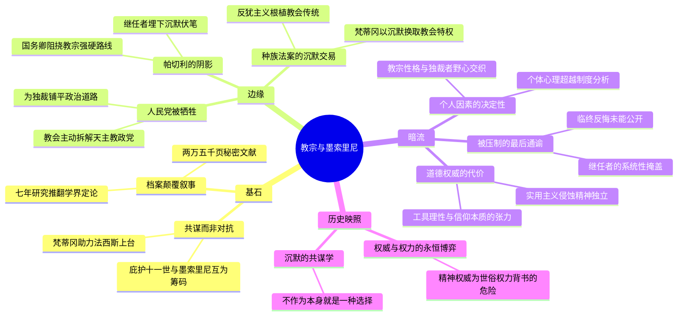

---
tags:
  - 梵蒂冈与法西斯
  - 庇护十一世
  - 权力共谋
  - 宗教与政治
  - 二战前史
douban_link: https://book.douban.com/subject/30226265/
score: 5
cover: https://img9.doubanio.com/view/subject/s/public/s29752277.jpg
create_time: 2026-08-09
---

# 深层解构

### 一、基石：共谋而非对抗——档案颠覆叙事

大卫·科泽的核心信念，藏在他对两万五千页梵蒂冈秘密档案的执念里。

- **以"共谋"取代"对抗"叙事**

长期以来，罗马教廷精心维护着一个英雄叙事：从战前起，天主教会便英勇反抗法西斯党，庇护十一世及其继任者庇护十二世皆是与墨索里尼为敌的道德楷模。科泽利用梵蒂冈2006年开放的秘密档案，历时七年研究，彻底颠覆了这一既定观点。他的核心论断是：**"梵蒂冈在使法西斯政权成为可能并维持其执政方面，发挥了核心作用。"** 教会与法西斯的关系不是被动容忍，而是主动共谋——庇护十一世借助法西斯力量抵抗共产主义和现代世俗化浪潮，墨索里尼则凭借教宗的祝福提升政权合法性，进而掌控意大利。

- **互为筹码的权力交易**

底层逻辑是两个"绝对权威"的利益交换：**一个忧心教会权威衰落的精神领袖，需要一个能压制世俗化浪潮的政治强人；一个野心勃勃的独裁者，需要一个能为政权赋予神圣光环的道德权威。** 这种交换不是偶然的权宜之计，而是持续十余年的系统性合作——从1922年两人几乎同时掌权，到1939年庇护十一世临终前的决裂，贯穿了整个法西斯崛起的关键时期。科泽揭示的深层逻辑是：**当精神权威与世俗权力结盟时，双方都以为自己在利用对方，实则是共同被权力的逻辑裹挟，最终改变数百万人的命运。**

### 二、边缘：被轻描淡写的洞见

1. **人民党的牺牲——教会亲手拆解自己的政治屏障**

书中一个被忽视但极具冲击力的细节：意大利天主教会本有自己的政党——人民党（Partito Popolare），它是法西斯崛起初期最大的政治障碍之一。然而，庇护十一世为了与墨索里尼达成交易，主动迫使人民党创始人斯图尔佐神父辞去党魁职务，实质上瓦解了唯一能在议会制衡法西斯的政治力量。**教会的逻辑是：不能容忍一个"不听话"的天主教政党成为自己与独裁者交易的障碍。** 这揭示了一个比"教会被迫与法西斯合作"更深刻的真相：教会是主动清除民主政治力量，为独裁铺路的积极参与者。科泽指出，庇护十一世可能在墨索里尼权力摇摇欲坠的关键时刻起到了关键的支撑作用。

2. **帕切利的阴影——继任者如何系统性地埋葬真相**

书中最重要的配角是时任梵蒂冈国务卿、后来的庇护十二世——欧金尼奥·帕切利。科泽揭示，帕切利始终是教廷内部阻止庇护十一世对法西斯和纳粹采取强硬路线的关键人物。当晚年庇护十一世日益后悔与墨索里尼的结盟，甚至命令美国耶稣会士拉法热起草一份谴责种族主义的通谕时，帕切利等人成功地将这份"隐藏的通谕"在教宗死后压下不发。**科泽的叙事暗示：庇护十二世在二战期间的"沉默"，并非临时策略，而是一条从1930年代就开始铺设的路线——系统性优先维护与独裁政权的关系，而非为受害者发声。** 这一洞见将"庇护十二世沉默"的争论从二战时期前推至整个1930年代。

3. **种族法案的沉默交易——反犹主义的教会根源**

1938年意大利颁布种族法案，将犹太人贬为二等公民。科泽揭示了一个令人不安的事实：**"教会非但没有反对将犹太人视为二等公民的对待，反而为墨索里尼提供了采取此类严苛措施的有力论据。"** 梵蒂冈与墨索里尼达成秘密协议——教会不对种族法案提出公开批评，交换条件是改善天主教组织的待遇。科泽追溯了《天主教文明》（La Civiltà Cattolica）等耶稣会刊物中长期存在的反犹言论，指出这些"教义性"的反犹主义为后来的种族法案提供了思想土壤。**反犹主义不是从纳粹输入意大利的外来物，而是根植于教会传统的本土产物。**

### 三、暗流：未被审视的认知前提

1. **"道德权威"的代价——实用主义如何侵蚀精神独立**

科泽的叙事隐含一个未被充分讨论的前提：**当一个声称代表超越性真理的机构，选择以实用主义方式参与世俗政治交易时，它付出的最大代价不是某次具体的妥协，而是"道德权威"本身的可信度。** 庇护十一世以为自己在"借力打力"——用法西斯对抗共产主义和世俗化——但每一次妥协都在侵蚀教会声称的精神独立性。当教宗最终意识到自己被利用时（"墨索里尼是多么卑鄙的叛徒！"），为时已晚。这一悖论对今天所有试图与权力结盟的精神/道德机构都是永恒警示。

2. **个人因素的决定性——制度分析的局限**

科泽的叙事高度依赖个人传记——庇护十一世的暴烈脾气、墨索里尼的表演型人格、帕切利的谨慎圆滑、塔基·文图里神父的双面间谍角色。这带来一个隐含问题：**历史走向在多大程度上是由制度结构决定，又在多大程度上由关键人物的性格缺陷和心理执念塑造？** 科泽的叙事倾向于后者——如果庇护十一世不是如此固执且独断，如果帕切利不是如此谨慎到怯懦，历史是否可能不同？但这也可能低估了制度性因素：梵蒂冈的官僚结构、教廷的反共意识形态、天主教会与犹太人长期的历史张力，这些结构性因素不会因为换一个教宗就消失。

3. **被压制的最后通谕——"未发生的历史"之追问**

庇护十一世临终前试图发表的反种族主义通谕，被继任者系统性压制。科泽在这里触及了一个历史哲学的核心问题：**我们评价一个机构时，应该依据它"做了什么"，还是依据它"几乎做了什么但最终没做"？** 如果那份通谕被发表，天主教会与反犹主义的历史关系是否会不同？二战的进程是否会改变？这种"反事实历史"的追问虽然没有确定答案，但它揭示了一个深刻的机制：**制度性的沉默不是一次决定，而是一系列"不做决定"的累积——每一次选择"不发声"，都在为下一次沉默创造先例。**

### 四、金句与精华解读

> **"于我而言，只要是没有组织的群众，就不过是羊群而已。"**
> ——墨索里尼论群众操控

**解读：** 这段话揭示了法西斯主义的民众观——群众不是需要被说服的理性主体，而是需要被"雕刻"的原料。墨索里尼自比雕塑家，群众是手中之蜡。**这与教会的信众观存在令人不安的亲缘性：两者都倾向于将"信众/群众"视为需要引导而非需要对话的对象。** 这种共享的"俯视性视角"，正是教会与法西斯能够合作的深层心理基础。

> **"那个唯一真正的极权组织，不是法西斯国家或法西斯党，而是罗马天主教会。"**
> ——庇护十一世晚年的领悟

**解读：** 这是庇护十一世在经历十余年合作后的苦涩总结。他意识到自己参与扶植的，不过是世俗版的天主教会——一个以绝对服从为原则的等级制组织。**这句话既是自我批判，也是无意间的制度自白：教会的组织模式本身就是"极权"的原型。** 科泽将这句话放在叙事的关键位置，暗示法西斯与教会的亲缘性不仅是利益交换，更是组织逻辑的同构。

> **"墨索里尼是多么卑鄙的叛徒！" / "所有时代中最有害的教宗。"**
> ——庇护十一世与墨索里尼彼此的最后评价

**解读：** 两个曾经的"盟友"最终以互相指责收场——教宗骂独裁者是叛徒，独裁者骂教宗是最有害的。**这种相互的"背叛感"恰恰说明：双方从一开始就没有真正信任过对方，所谓"结盟"不过是各怀鬼胎的相互利用。** 历史不会因为当事人的最终反悔而改变——十余年的合作已经完成了它对数百万人的改变。

### 结语：权威与权力的永恒博弈

《教宗与墨索里尼》的终极价值，不在于为一段历史翻案，而在于揭示一个超越时代的警示：**当精神权威选择为世俗权力背书——无论出于何种"合理"的理由（对抗共同敌人、维护自身利益、防止更大灾难）——它最终都会被权力的逻辑吞噬。** 庇护十一世以为自己在"借力"，实则被"借力"反噬；墨索里尼以为自己在"利用"教宗，实则为一个自己无法完全控制的道德庞然大物赋予了合法性。科泽用两万五千页档案证明的，不是一个阴谋论，而是一个比阴谋更可怕的事实：**有时候，改变数百万人的命运不需要阴谋，只需要一系列"合理"的沉默和不作为。**

# 章节内容

### 序言

科泽在序言中交代了本书的核心方法论：利用梵蒂冈2006年开放的庇护十一世时期秘密档案，结合意大利、法国、英国、美国和德国的外交文件、日记和回忆录，历时七年研究，呈现两位20世纪早期最有权势的人物之间的共谋故事。他明确指出，长期以来学界和公众普遍认为罗马教廷英勇反抗法西斯，庇护十一世及其继任者被塑造成与墨索里尼为敌的英雄，而新档案材料彻底颠覆了这一叙事。科泽强调，这不仅是一个关于教宗与独裁者的故事，更是一个关于权力、信仰和沉默如何共同塑造历史灾难的故事。

### 第一部分：教宗与独裁者

**第一章 新任教宗**
1922年，阿契尔·拉蒂当选为庇护十一世。他此前是梵蒂冈图书馆馆长，学术气质浓厚，却在当选后展现出强烈的权威意志和暴烈脾气。他坚持独自用餐，要求兄弟姐妹以"圣座"称呼他，令周围人恐惧。科泽描绘了一个矛盾的人物形象：学者出身却崇尚绝对权威，对教会尊严有近乎偏执的执着，同时深深忧虑教会在现代世俗化浪潮中的权威衰落。这些特质为他日后与墨索里尼的结盟埋下性格基础。

**第二章 进军罗马**
同年，墨索里尼率法西斯黑衫军"进军罗马"，意大利国王被迫任命其为总理。科泽追溯了墨索里尼的出身——左翼铁匠之子、前社会主义报纸编辑，因一战立场与社会主义决裂后创建法西斯运动。墨索里尼的上台并非军事征服，而是一场精心编排的政治戏剧。值得注意的是，希特勒在1920年代将墨索里尼视为榜样，办公室中放着他的半身像。科泽指出，俄国革命令欧洲恐惧共产主义蔓延，为法西斯与教会提供了第一个"共同敌人"。

**第三章 命运攸关的结盟**
墨索里尼上台后立即展开争取教会支持的攻势。他在首次议会演说中宣称法西斯社会将以教会为精神核心，随后采取一系列具体行动：在公共学校、法庭和医院放置十字架；将侮辱神职人员定为犯罪；在学校设置天主教必修课；由国家支付神父薪金。这些举措对意大利而言是革命性的——此前的统一战争恰恰是以削弱教会权力为代价的。墨索里尼以实际利益向教会示好，为后来的《拉特兰条约》铺路。

**第四章 天生教宗**
科泽深入刻画庇护十一世对法西斯的态度。教宗并非天真地信任墨索里尼——他清楚独裁者的反教权过往和投机本质——但他判断教会更需要法西斯来对抗三大威胁：共产主义、世俗自由主义和共济会。庇护十一世开始系统性地与墨索里尼建立默契，同时对教会内部"不合作"的声音进行压制。他的权威主义性格使他倾向于相信，任何能为教会恢复权威的强人都是"天意所遣"。

**第五章 置之死地而后生**
本章聚焦天主教会内部最大的政治力量——人民党及其创始人斯图尔佐神父。人民党在议会中是制衡法西斯的关键力量，但庇护十一世为与墨索里尼达成交易，迫使斯图尔佐辞职，实质上瓦解了天主教自己的政党。科泽指出，这一决定可能是教廷为法西斯独裁铺平道路的最关键一步——在墨索里尼权力可能动摇的关键时刻，教会亲手拆除了最大的政治障碍。

**第六章 独裁统治**
墨索里尼巩固独裁权力，取缔反对党，建立一言堂。科泽展示教会在这一过程中扮演的角色——教会媒体为法西斯唱赞歌，教宗的沉默被视为默许。墨索里尼开始秘密与梵蒂冈谈判条约，以正式解决"罗马问题"——自1870年意大利统一以来教廷与意大利国家的领土争端。庇护十一世看到了通过条约恢复教会部分世俗权力的机会，愿意为此付出政治代价。

**第七章 刺客、孌童者与间谍**
本章展现了教会与法西斯合作中最阴暗的一面。科泽揭示墨索里尼在梵蒂冈高层布置了间谍网络，同时利用教会内部的性丑闻作为要挟筹码。耶稣会士塔基·文图里充当了教宗与独裁者之间的秘密信使，其角色之复杂令人联想到间谍小说。科泽还揭示了一个令人不安的细节：梵蒂冈曾帮助法西斯政权掩盖某些丑闻，以维护教会形象。这一章以"真实版《达芬奇密码》"的权谋再现，展示了政治与宗教勾结的地下世界。

**第八章 《拉特兰条约》**
1929年签署的《拉特兰条约》是教宗与独裁者合作的最高峰。条约使天主教成为意大利国教，教会获得巨额财政补偿，梵蒂冈城国获得独立主权地位。庇护十一世欣喜地称墨索里尼为"天意所遣之人"。科泽指出，条约的象征意义远大于实际利益——它不仅解决了罗马问题，更为法西斯政权赋予了教会背书的道德合法性。此后，法西斯集会常以弥撒开场，教堂和大教堂成为法西斯仪式的重要道具。

### 第二部分：共同的敌人

**第九章 救世主**
科泽描绘1930年代初教会与法西斯合作的"蜜月期"。庇护十一世将墨索里尼视为抵御共产主义和世俗化的"救世主"，教会高层普遍对法西斯持好感。教宗的影响力被法西斯宣传机器利用——墨索里尼善于将教宗的每一次"赞许"转化为政权合法性的证明。然而，裂痕也在悄然出现：庇护十一世对法西斯对青年组织的垄断感到不满，教会与国家争夺对意大利人精神生活的控制权。

**第十章 步步紧逼**
随着法西斯权力巩固，墨索里尼开始收紧对教会活动的限制。法西斯青年组织与天主教青年团争夺成员，教会感到自身影响力被蚕食。庇护十一世多次通过使节向墨索里尼表达不满，但后者往往以敷衍回应。科泽揭示，教宗的脾气在这一时期日益暴躁，他开始意识到法西斯的"感恩"不过是权宜之计，但此时已难以全身而退。

**第十一章 土生子归来**
本章聚焦意大利驻梵蒂冈大使切萨雷·德·韦基——科泽称其"傲慢、狭隘、愚蠢"——在教廷与法西斯之间扮演的尴尬角色。德·韦基是法西斯老党员，同时又是虔诚的天主教徒，其双重身份反映了法西斯与教会关系的内在矛盾。科泽通过这一人物展示，双方的合作始终在相互猜忌中进行，任何一方的过度举动都可能引发危机。

**第十二章 帕切利苦苦支撑**
1930年，欧金尼奥·帕切利被任命为梵蒂冈国务卿，成为教廷第二号人物。科泽深入刻画了帕切利的性格——谨慎、圆滑、极度重视外交礼仪、害怕冲突。当庇护十一世的暴脾气引发教廷与法西斯的摩擦时，帕切利总是充当"灭火器"，努力维护合作关系。科泽暗示，帕切利的"维稳"心态实际上系统地压制了教宗日益增长的对法西斯的不满，为日后庇护十二世的"沉默"路线埋下伏笔。

**第十三章 墨索里尼永远正确**
本章以墨索里尼对群众的操控哲学为核心。科泽引用墨索里尼对路德维希的谈话——"只要是没有组织的群众，就不过是羊群""群众就如我手中的蜡""只有信念才能移动山峦，理性办不到"——揭示法西斯主义的民众观：群众不是需要被说服的理性主体，而是需要被"雕塑"的原料。这一章同时展示了教会的信众观与法西斯的群众观之间令人不安的亲缘性——两者都倾向于将"信众/群众"视为需要引导而非对话的对象。

**第十四章 新教敌人与犹太人**
墨索里尼利用新教徒与天主教之间的矛盾，同时开始将反犹主义作为政治工具。科泽追溯了《天主教文明》等耶稣会刊物中长期存在的反犹言论——这些言论不是纳粹输入的，而是根植于天主教传统的本土产物。教会刊物中的反犹论述为后来的种族法案提供了思想基础。科泽揭示，教会非但没有反对反犹主义，反而在无意（或有意）中为其提供了"教义性"的合法性。

**第十五章 希特勒、墨索里尼与教宗**
希特勒上台后，庇护十一世面临新的困境。一方面，他对纳粹的异端思想和宗教迫害深感忧虑；另一方面，他不愿破坏与墨索里尼的关系，也不愿将教会推入与纳粹的直接对抗。科泽描绘了教宗在三方博弈中的犹豫不决——他既想谴责纳粹对天主教会的不公，又害怕激怒墨索里尼和希特勒。这种犹豫成为教会"沉默"传统的又一个源头。

**第十六章 逾越雷池**
墨索里尼入侵埃塞俄比亚，庇护十一世虽内心反对这场不义之战，但最终选择沉默。科泽指出，教宗的沉默不是出于无知，而是出于"维护与法西斯关系"的考量——这成为教会为政治利益牺牲道德立场的又一个例证。教会媒体甚至为意大利的"文明使命"辩护，将侵略战争包装为传播基督教文明的事业。

**第十七章 共同的敌人**
随着希特勒与墨索里尼结成"柏林-罗马轴心"，庇护十一世越来越担忧法西斯与纳粹的合作将把教会推向更深的道德困境。教宗开始将纳粹视为比法西斯更危险的威胁——不仅因为纳粹的种族主义与天主教教义冲突，更因为纳粹的异端思想可能从根本上瓦解基督教文明。科泽展示教宗在"共同敌人"（共产主义）之外的"新敌人"（纳粹主义）面前，其战略思维的转变。

**第十八章 光荣之梦**
庇护十一世晚年开始反思自己与法西斯的整个合作历程。科泽描绘了一个日益孤独、愤怒和后悔的教宗——他意识到自己扶植的政权正在与纳粹一起将欧洲拖向深渊。教宗开始准备更直接地表达不满，但身体日益衰弱，而身边的帕切利等人则在系统性地"缓冲"他的每一次强硬冲动。

### 第三部分：墨索里尼、希特勒与犹太人

**第十九章 讨伐希特勒**
1937年，教宗发布《极度关切》（Mit brennender Sorge）通谕，公开批评纳粹政府对天主教会的迫害。这是教宗首次如此公开地谴责一个主权政府的宗教政策。通谕在德国各教堂的棕枝主日宣读，引起巨大震动。希特勒大为恼火，下令关闭天主教出版机构，并威胁披露神父的性丑闻作为报复。科泽指出，尽管通谕措辞已有所缓和，但它标志着庇护十一世对纳粹态度的转折。然而，值得注意的是，这份通谕主要针对纳粹对天主教会的迫害，而非针对种族主义本身。

**第二十章 领袖万岁！**
希特勒访问意大利，墨索里尼大肆铺张。庇护十一世选择离开罗马以示抗议，但这一象征性举动并未阻止法西斯为希特勒举行盛大欢迎仪式。科泽描绘了教宗在权力仪式面前的无力感——他的"抗议"被法西斯宣传机器轻松化解。这一章同时展示了墨索里尼如何在教宗与希特勒之间寻找平衡：他需要向希特勒展示意德同盟的坚固，同时需要维持教会的"配合"。

**第二十一章 希特勒访问罗马**
本章详细描写希特勒访罗马期间教宗的反应。庇护十一世关闭梵蒂冈博物馆和圣彼得大教堂以示抗议，但这一举动的象征意义远大于实际影响。科泽指出，教宗越来越意识到自己被边缘化——法西斯与纳粹的合作正在改变欧洲权力格局，而教会的影响力在悄然流失。教宗开始考虑更激进的行动。

**第二十二章 惊人的任务**
庇护十一世秘密委托美国耶稣会士约翰·拉法热起草一份谴责种族主义和反犹主义的通谕。这是教宗在生命最后阶段试图"翻盘"的关键举措——他希望以一份强有力的通谕，公开谴责种族主义，为教会与法西斯的合作画上道德句号。科泽详细追溯了拉法热的起草过程和教宗的反复修改，展示了一个老人在生命尽头的道德焦虑和紧迫感。

**第二十三章 秘密协议**
科泽揭示梵蒂冈与墨索里尼之间关于种族法案的秘密协议——教会不对意大利1938年的反犹种族法案提出公开批评，交换条件是改善天主教组织的待遇。这一"交易"是教廷道德妥协的最低点之一。科泽指出，教会非但没有为被迫害的犹太人发声，反而以他们的苦难为筹码，换取自身机构利益的保障。

**第二十四章 种族法案**
1938年意大利颁布种族法案，将犹太人贬为二等公民。科泽详细记录了教会的反应——帕切利主导的梵蒂冈选择"沉默"策略，仅在涉及"混血婚姻"和"皈依犹太人"等直接影响教会权限的领域进行有限交涉。科泽追溯了教会反犹主义传统的深层根源：耶稣会刊物《天主教文明》长期发表的反犹言论，为种族法案提供了思想基础。教会不是被迫沉默，而是在很大程度上同意法案的精神。

**第二十五章 最后的战役**
庇护十一世在生命最后几个月全力以赴，试图发表反种族主义通谕，并在准备对意大利主教团的讲话中公开谴责法西斯和纳粹的种族政策。他宣称"精神上我们都是闪米特人"。科泽描绘了一个在生命尽头终于决定不顾一切表达道德立场的教宗——但他的身体正在迅速衰竭，而身边的人（尤其是帕切利）则在拖延和"缓冲"他的每一次行动。

**第二十六章 相信国王**
庇护十一世开始考虑是否应通过意大利国王来制衡墨索里尼——这是他对法西斯彻底失望的表现。教宗意识到自己十余年的"合作"未能改变法西斯的本质，反而为独裁者提供了道德掩护。他开始将希望寄托在非合作的途径上，但为时已晚。

**第二十七章 死得正好**
1939年2月10日，庇护十一世去世，距他计划发表反种族主义通谕和讲话仅数日之遥。科泽暗示，教宗的"及时死亡"为教会高层解决了一个巨大难题——如果通谕发表，教会与法西斯的关系将面临不可挽回的破裂。帕切利等人迅速行动，将通谕压下不发，并系统性地消除教宗最后意图的痕迹。本章标题"死得正好"既是讽刺，也是历史悲剧的注脚。

**第二十八章 乌云消散**
庇护十二世（帕切利）继位后，迅速修复与墨索里尼的关系。新教宗摒弃了庇护十一世晚年的对抗路线，恢复"合作"基调。科泽指出，帕切利的选择不是偶然——他从来就不认同庇护十一世的"激进"倾向，一直认为维护与法西斯的关系比对抗更重要。这一选择为二战期间教会对犹太人大屠杀的"沉默"奠定了基础。

**第二十九章 奔向灾难**
科泽以1939年9月二战爆发为全书终点。十余年的教会-法西斯合作，最终将欧洲推向战争深渊。庇护十一世的临终反悔未能改变历史——他的继任者选择了更彻底的沉默，而他与墨索里尼的共谋已经完成了对欧洲政治格局的塑造。科泽以沉重笔调收束全书：这段历史的真正教训不是"教会应该更早反抗"，而是"当精神权威选择为权力背书时，沉默的共谋比公开的暴行更危险"。

### 后记

科泽在后记中讨论了本书的研究方法论和史料价值，强调梵蒂冈档案的开放为重新审视这段历史提供了前所未有的机会。他也讨论了本书引发的争议——梵蒂冈对"共谋"叙事的抵制，以及部分学者对科泽"过度强调个人因素"的批评。科泽承认，意大利学者如法托里尼、瓜斯科和萨莱此前已利用梵蒂冈档案对教会与法西斯关系进行过研究，但他认为自己的贡献在于将这些发现整合为一个连贯的"共谋"叙事。他同时指出，这段历史对理解二战期间教会"沉默"的深层机制至关重要——沉默不是从庇护十二世开始的，而是从庇护十一世与墨索里尼的整个合作过程中系统性地养成的。
