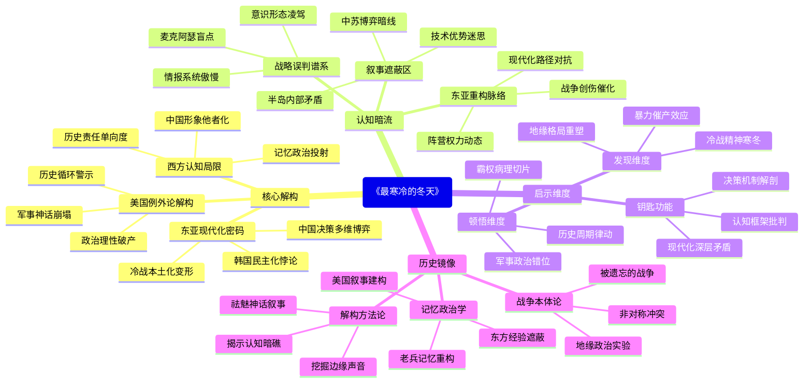

豆瓣链接：https://book.douban.com/subject/27102845/

# 深层解构

### 《最寒冷的冬天》深层解码：冰山下的三重历史镜像

#### 一、基石：被解构的"美国例外论"
作者大卫·哈伯斯塔姆用40年酝酿、10年写作构建起对朝鲜战争的"去神话化"叙事，其核心支点是对美国战后霸权逻辑的系统性质疑：
- **军事神话的崩塌**：以麦克阿瑟为符号，揭露美军"不可战胜"光环下的战略盲目。书中详细解剖仁川登陆的战术成功与政治误判的悖论——麦克阿瑟赌性背后是对中国战略决心的误读，正如目录中"威克岛会晤与威洛比的误判"揭示的情报傲慢（P289）。这种对"天才将领"的祛魅，直指美国军事决策机制的封闭性。
- **政治理性的破产**：通过杜鲁门政府内部决策撕裂（如"台湾问题的政治学"章节，P175），暴露冷战意识形态如何凌驾于现实利益。当凯南的"历史决定论"（P199）与尼采的强硬路线碰撞，书中暗示美国的朝鲜战争本质是意识形态输出与地缘现实的剧烈冲突，而这种冲突至今仍在东亚投下阴影。
- **历史循环的警示**：将朝鲜战争与越南战争、伊拉克战争并置（作者未完成的"三次战争"计划），暗喻美国始终未走出"以民主之名制造泥潭"的怪圈。书中对长津湖战役的惨烈描写（P345），不仅是战役记录，更是对"技术优势万能论"的鞭挞。

#### 二、边缘：被轻拭的东亚现代化密码
哈伯斯塔姆的笔触偶尔扫过战场之外，却意外触碰到改变东亚命运的隐秘线索：
- **韩国民主化的悖论**：书中564页看似闲笔的"现代化副产品"论，揭示了一个残酷现实——朝鲜战争的创伤记忆，竟成为韩国社会转型的催化剂。当作者写道"中产阶级才是示威运动的真正推手"，实则暗示威权体制下经济发展与政治压抑的必然冲突，这种洞见超越了战争史范畴，直指现代化进程的深层矛盾。
- **中国决策的另一半真相**："一个半人支持出兵"的表述（P301）背后，隐藏着作者未深入展开的中苏博弈逻辑。毛泽东力排众议的背后，不仅是地缘安全考量，更是新生政权争取国际话语权的破局之战。书中对"斯大林、毛泽东与彭德怀"三角关系的简略提及（P293），实则指向社会主义阵营内部的权力动态，这为理解后来的中苏分裂埋下伏笔。
- **冷战意识形态的东方变体**：金日成的革命历程（P85）与李承晚的统治困境（P83）对比，暴露出美苏冷战思维在东亚的本土化变形。作者虽未明言，却暗示朝鲜半岛的分裂本质是两种现代化路径的对抗，而这种对抗的遗产至今仍在塑造半岛局势。

#### 三、暗流：西方视角的认知牢笼
作为"美国记者之父"，哈伯斯塔姆的叙事始终笼罩在一层未被审视的认知迷雾中：
- **中国形象的他者化**：书中对志愿军的描写虽不乏战术尊重（如"待君入瓮"的精妙布局，P341），但"人海战术"等表述仍隐含西方中心主义视角。当作者感叹"三十万美军在鸭绿江畔虎视眈眈"时（P301），无意中忽略了中国面对"联合国军"逼近国境线时的生存焦虑，这种视角差折射出冷战叙事的深层裂痕。
- **历史责任的单向度**：全书聚焦美国决策失误，却对李承晚政权的合法性危机（P83）、金日成政权的内部动员机制等着墨较少。这种选择性聚焦，使得"半岛困局"的成因偏向"美国错误论"，而模糊了朝鲜半岛内部历史矛盾的复杂性，陷入"美国中心"的解释陷阱。
- **记忆政治的当下投射**：书中强调"被遗忘的战争"（P399），实则反映21世纪初美国学界对"反恐战争"的反思潮。哈伯斯塔姆将朝鲜战争塑造为"战略失误范本"，某种程度上是为批判小布什政府的伊拉克政策提供历史镜鉴，这种现实关怀虽加深了书的思想深度，却也可能让历史解释染上当代政治的色彩。

#### 四、给读者的三把钥匙
- **顿悟**：这本书表面写战争，实则是一部大国决策的"病理切片"。当麦克阿瑟在听证会上哀叹"老兵永不死，只是渐凋零"（P421），实则是美国霸权光环褪色的隐喻——所有妄图以军事手段解决政治问题的行为，最终都会在历史长河中凋零。
- **惊喜**：跳出战场看半岛，会发现朝鲜战争是东亚现代化的"暴力催产素"。韩国的经济腾飞、中国的国际定位重塑、日本的战后复兴（书中未详述却可推导），都与这场战争紧密相关。战争的"寒冷"孕育了东亚的"热发展"，这是最残酷的历史吊诡。
- **发现**：哈伯斯塔姆没意识到，他笔下的"最寒冷的冬天"不仅是地理气候，更是冷战思维的精神寒冬。当我们今天审视半岛问题时，或许该超越"谁对谁错"的二元判断，去追问：半个世纪前冻结半岛的意识形态坚冰，何时才能在真正的历史理解中融化？

#### 结语：冰面下的思想潜流
阅读这本书，不应止步于战争细节的猎奇，而要看见冰层下涌动的三重洋流：对美国霸权的理性批判、对东亚命运的意外烛照、对冷战思维的无意识继承。哈伯斯塔姆用记者的敏锐捕捉到历史的浪花，却也被时代的迷雾遮蔽了部分真相。而这正是阅读的价值——在作者的"所言"与"未言"之间，在"已知"与"不可知"（P433结语）之间，我们得以触摸到更真实的历史体温，也为理解今日之世界，找到一块重要的思想拼图。

# 章节内容

作者简介:
大卫·哈伯斯塔姆(1934-2007)是美国著名资深记者,被称为"记者之父"。他先后在《纽约时报》和《哈泼斯》杂志任职,1964年因报道越战而获普利策奖。他是20世纪非虚构类最著名的作家之一,创作了二十多部关于战争史、媒体史、民权运动史等主题的畅销书。《最寒冷的冬天》是哈伯斯塔姆构思40多年、耗时10余年创作的关于朝鲜战争的生命之作,被视为他的代表作之一。

创作背景:
朝鲜战争于1950年6月爆发,持续了3年。当时美国新任总统杜鲁门决定出兵支持韩国,并任命麦克阿瑟为联合国军总司令。然而,战事陷入胶着,美军屡次受挫,最终双方不得不在三八线附近停战。此战对美国政治、外交、军事都产生了深远影响。哈伯斯塔姆一生都在关注这场战争,试图全面剖析其历史意义。他于2007年在采访途中不幸遇难,未能完成自己的心愿。

----

# 《最寒冷的冬天》读书笔记

## 序言：棕色的记忆

哈伯斯塔姆在序言中回顾了自己与朝鲜战争的联系。他提到这场战争是美国在冷战时期的第一场重大战争，却成为美国人最不愿提起的一段历史。作者怀着对历史的敬畏之心，通过大量采访亲历者，试图还原那场发生在半个多世纪前的战争真相。他指出，朝鲜战争是一场"被遗忘的战争"，但其对美国及世界格局的影响却极为深远。

## 第一章：云山惊兆：中国人民志愿军入朝

本章详细描述了云山伏击战，这是美军首次与中国人民志愿军交锋的重要战役。1950年10月底，志愿军秘密入朝后在云山地区设下伏击，给毫无防备的美军造成了重创。美军高层对中国军队入朝的情报视而不见，麦克阿瑟的傲慢与战略盲点导致美军在首次遭遇战中遭遇惨败。作者通过生动的细节描写，展现了美军士兵面对突如其来的中国军队时的恐慌与震惊，以及这场伏击战如何成为整个朝鲜战争转折点的前奏。

## 第二章：愁云惨雾：朝鲜人民军南下

本章探讨了朝鲜战争爆发的背景。金日成在苏联支持下发动南侵，而麦克阿瑟则因轻视朝鲜战场而准备不足。作者对李承晚和金日成的政治生涯进行了梳理，分析了二战后朝鲜半岛南北方力量对比的不平衡——"南弱北强"的局面。南北朝鲜在政治、军事和经济上的巨大差距，以及美国对亚洲局势的战略误判，都为朝鲜战争的爆发埋下了伏笔。金日成坚定的共产主义信念与李承晚的右翼专制统治形成鲜明对比，这种意识形态的对立加剧了半岛的紧张局势。

## 第三章：战争升级 华盛顿介入

杜鲁门政府在朝鲜战争爆发后迅速决定出兵干预，麦克阿瑟被任命为联合国军总司令。本章详细描述了麦克阿瑟的性格特点和战略思想，指出他的傲慢自负既是其成功的关键，也是导致后来失败的根本原因。作者通过对麦克阿瑟家庭背景和成长经历的分析，揭示了他"心比天高"的性格形成原因。初期战局对美军不利，朝鲜人民军一路向南推进，麦克阿瑟与华盛顿的指挥关系也开始出现裂痕，这为后来的军政冲突埋下了伏笔。

## 第四章：洲际政治：复杂的多边关系

本章分析了朝鲜战争背后复杂的国际政治关系。美国两党政治的内斗使朝鲜战争成为政治工具；凯南的遏制政策与尼采思想的对比展现了美国外交政策的哲学基础；杜鲁门从密苏里州小政客到总统的政治历程也影响了他的决策风格。作者还深入分析了台湾问题的政治学，以及围绕"谁丢了中国"这一问题的美国国内政治斗争。这些复杂的多边关系使朝鲜战争远超出一场地区性冲突的范畴，成为冷战格局中的关键一环。

## 第五章：孤注一掷：朝鲜人民军挺进釜山

本章集中描述了朝鲜人民军在战争初期的一路南下，直至洛东江战役。面对装备精良的朝鲜人民军，美军节节败退，被迫退守釜山一隅。作者通过具体战例和详实数据，展现了美军初入朝鲜战场时的困境和朝鲜人民军作战能力之强。决战洛东江的激烈程度和残酷性，以及美军在这一战役中的表现，都被作者生动地呈现出来。这场战役是美军在朝鲜战场上的生死存亡之战，其结果直接影响了战争的后续发展。

## 第六章：扭转乾坤：麦克阿瑟仁川登陆

麦克阿瑟力排众议，策划并实施了仁川登陆作战，成功扭转了朝鲜战场的不利局面。作者详细描述了登陆前的准备过程、登陆作战的实施以及攻克汉城的经过。仁川登陆被视为麦克阿瑟军事生涯中最辉煌的一页，但其冒险性和麦克阿瑟在规划过程中表现出的个人独断专行的特点也为后来的战略失误埋下了隐患。此外，作者还分析了台湾问题在此时对美国战略的影响，以及麦克阿瑟对台湾问题的立场如何加剧了他与华盛顿之间的矛盾。

## 第七章：跨越三八线，向北挺进

联合国军在仁川登陆成功后，面临是否跨越三八线的重大抉择。尽管中国多次通过外交渠道发出警告，麦克阿瑟仍然决定向北推进至鸭绿江。本章详细分析了中苏朝三国在面对这一局势时的内部讨论和决策过程，特别是斯大林、毛泽东与彭德怀之间的战略考量。麦克阿瑟在威克岛会晤中对杜鲁门的误导，以及美军情报部门对中国出兵可能性的误判，都成为战局急转直下的关键因素。与此同时，美国国内政治中麦卡锡主义的兴起也为美军"冲向鸭绿江"的决策提供了推动力。

## 第八章：志愿军猛击：长津湖与军隅里美军溃退

本章是全书的核心部分，详细描述了中国人民志愿军对美军发起的首次大规模攻势。作者用大量篇幅记录了清川江战役、军隅里之战以及长津湖战役的惨烈过程。冰天雪地中，志愿军以"人海战术"和夜间作战打得美军措手不及。特别是美国陆战第1师在长津湖地区的突围战，成为美军历史上最艰难的撤退之一。作者分析了这些失败的责任归属，并介绍了李奇微接替阿尔蒙德担任美第10军团司令后如何重整旗鼓的过程。这一章通过大量细节和亲历者证言，真实再现了朝鲜战争中最惨烈的一个冬天。

## 第九章：战争转折：双联隧道、原州和砥平里两军激战

本章记述了1951年初志愿军发动的第三次战役及美军的反击。彭德怀对后勤补给的忧虑开始显现，志愿军的进攻势头逐渐减弱。"双联隧道"伏击战、原州之战和砥平里保卫战成为这一阶段的关键战役。特别是美军第23团在砥平里的顽强坚守，以及弗里曼与麦吉这两位美军指挥官的表现，成为战局转折的重要因素。柯罗姆贝茨救援队的英勇行动也被作者详细记录。这些战役标志着朝鲜战争进入相持阶段，双方都认识到全面胜利几乎不可能实现，战争目标开始转向有利的停战条件。

## 第十章：将帅失和：麦克阿瑟的去职风波

麦克阿瑟与杜鲁门之间的矛盾在1951年春达到顶点。本章详细描述了麦克阿瑟如何通过公开发表与白宫政策相悖的言论"逼宫"，以及杜鲁门最终决定解除麦克阿瑟职务的过程。作者还记录了随后举行的麦克阿瑟听证会，以及这一事件对美国政治和军事关系的深远影响。麦克阿瑟回国后受到英雄般的欢迎，但他的政治影响力很快消退，最终黯然退场。这一事件不仅确立了美国文官对军队的绝对控制，也标志着朝鲜战争进入了新的阶段。

## 第十一章：战争后果 结局与未来

最后一章探讨了朝鲜战争的结局及其长远影响。战争最终以停战协议告终，双方回到了起点——三八线附近。作者反思了这场战争的意义，指出它既不是美国的胜利，也不是彻底的失败，而是一场消耗巨大却难以定义成败的冲突。朝鲜战争改变了美国的外交政策和军事战略，推动了美国军事工业复合体的形成，也永久性地改变了东亚地区的地缘政治格局。作者在尾声部分表达了对参战老兵的敬意，呼吁人们铭记这场"被遗忘的战争"及其教训。

## 后记：遥远的战争，不灭的记忆

在后记中，哈伯斯塔姆分享了写作本书的感受和动机。他提到了自己与众多老兵的交流，以及如何通过这些一手资料还原历史真相的过程。作者认为，尽管朝鲜战争已经过去半个多世纪，但它对今天的世界仍有深远影响，从中汲取教训对理解当代国际关系仍然具有重要意义。他对在极端环境下依然坚守人性尊严的士兵们表达了崇高敬意，认为记录他们的故事是对历史最好的致敬。