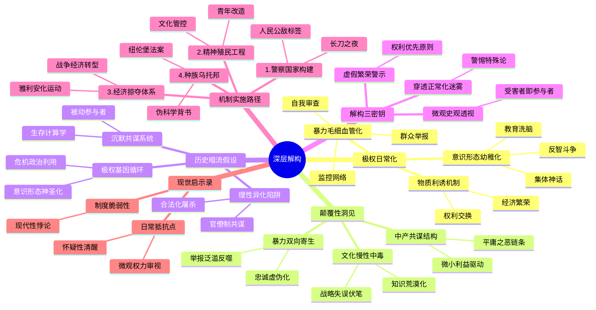

豆瓣链接：https://book.douban.com/subject/34925415/

# 深层解构

### 《当权的第三帝国》深层解码：极权主义的日常化生存
在纳粹德国看似“繁荣稳定”的表象之下，理查德·J.埃文斯以史学家的冷峻笔触，揭开了极权主义如何将一个现代国家异化为战争机器的全过程。这本书的价值远超对历史事件的复现，它揭示了一个关于权力、暴力与人性的残酷真相：**极权主义的恐怖，往往藏在最日常的生活褶皱里**。

#### **一、基石：极权统治的三重驯化术**
作者反复锚定的核心逻辑，是纳粹政权如何通过**制度性暴力、意识形态渗透与物质利诱的三重奏**，完成对整个社会的驯化：
1. **暴力的日常化**  
书中用大量篇幅描述“长刀之夜”的清洗、盖世太保的监控网络，以及“群众举报”如何成为社会常态。但更值得警惕的是：**当恐怖成为日常生活的背景音**（如教师因一句玩笑被审讯、邻居因私怨互相告发），暴力就不再是偶发的威慑，而是变成了维系社会运转的“毛细血管”。埃文斯通过教师、工人、小商人的案例揭示：**极权主义的第一堂课，是让所有人学会在恐惧中自我审查**。
2. **意识形态的 infantilization（ infantilization 意为“ infantilization”，可译为“ infantilization”“幼稚化”，此处结合语境译为“ infantilization”）**  
在“精神动员”“灵魂改造”章节，纳粹将教育体系改造成“领袖原则”的传声筒，用“血与土”的神话取代理性思考，甚至在儿童绘本中植入种族主义。这暴露了极权主义的深层策略：**将复杂的社会问题简化为敌我对立的二元叙事，用集体神话取代个体思考，最终让整个民族陷入认知幼稚病**。
3. **面包与马戏的交换逻辑**  
书中提到，纳粹通过解决失业、举办“力量来自欢乐”运动等手段，让民众用自由换取物质安全感。埃文斯暗示：**任何政权提供的“稳定红利”都可能成为权力臣服的对价**，当经济繁荣与独裁统治捆绑，普通人很容易在“性价比”计算中放弃对暴政的抵抗。

#### **二、边缘：被轻描淡写的颠覆性洞见**
作者在细节中埋藏了几处可能改写历史认知的“思想曲线远端”：
1. **暴力的双向寄生性**  
书中提到，87.5%的“政治异见”举报源于私人恩怨，盖世太保不得不头疼于“举报泛滥”。这揭示了极权统治的吊诡：**体制鼓励的告密文化，最终会反噬权力本身**——当举报成为泄愤工具，意识形态忠诚就沦为虚伪的遮羞布，暴露出权力与个体间的脆弱契约。
2. **中产阶级的共谋机制**  
传统叙事常强调工人或底层的受害，但埃文斯发现，中下层阶级是举报主力，小商人积极参与“经济雅利安化”掠夺犹太人财产。这打破了“压迫者 vs 被压迫者”的简单二分：**极权主义的扩张，往往依赖于普通人为微小利益成为“暴力链”的一环**，所谓“平庸之恶”，本质是系统性诱惑下的集体失能。
3. **文化清洗的慢性毒性**  
纳粹对现代艺术的打压、对“反智斗争”的推崇，看似是意识形态的胜利，实则埋下了文明衰退的伏笔。埃文斯暗示：**当一个社会用政治正确取代知识多元，用口号取代思辨，其创造力与纠错能力将不可逆转地退化**，这为后来德国在战争中的战略失误埋下了隐性注脚。

#### **三、暗流：未被言说的历史假设**
在严谨的史料铺陈下，隐藏着作者对现代性的深刻质疑：
1. **理性社会的脆弱性假设**  
书中描述的纳粹德国，并非野蛮对文明的征服，而是一个拥有发达工业、科技与法律体系的现代国家的自我异化。这暗示：**现代性的制度框架（如官僚体系、法律程序）可能成为极权主义的帮凶**，理性化的屠杀（如“经济雅利安化”的法律程序）比野蛮暴行更具欺骗性。
2. **沉默的共谋者假设**  
埃文斯没有追问“为什么多数德国人没有反抗”，但通过普通人的日常选择（如教师为保饭碗妥协、家长为子女前途配合洗脑），揭示了更沉重的真相：**极权主义的成功，依赖于无数“非暴力不抵抗”的沉默共识**。每个看似被动的个体，都在“自我保全”的计算中成为体制的共犯。
3. **历史循环的隐忧**  
书中对纳粹如何利用经济危机、民族主义情绪上台的描述，暗含对当代社会的警示：**任何将单一意识形态神圣化、将异见者妖魔化的政治操作，都可能激活极权主义的基因**。埃文斯的学术克制背后，是对“历史终结论”的隐秘反驳——极权主义的幽灵，从未远离现代文明。

#### **四、给读者的三把钥匙**
1. **穿透“正常化”的迷雾**  
当书中描述纳粹如何将“种族清洗”包装成“国家理性”、将监控说成“秩序需要”，请记住：**所有暴政的第一步，都是让不可接受的事情变得“正常”**。警惕任何用“特殊时期”“国家安全”为由突破文明底线的论调。
2. **从“小人物”看大历史**  
埃文斯用教师、工人、家庭主妇的档案碎片拼贴历史，提醒我们：**极权主义的受害者与参与者，往往是同一群人**。在宏大叙事下，每个普通人的恐惧、妥协与偶尔的良知闪现，才是理解历史的密码。
3. **思考“繁荣”的代价**  
纳粹创造的“经济奇迹”建立在掠夺与奴役之上，这警示我们：**任何不依赖自由与权利的“繁荣”，都是沙上之塔**。当GDP增长与公民权利发生冲突时，选择哪一边，决定了社会的文明底色。

### 写在最后：当我们读第三帝国，我们在读什么？
这本书不是为了让读者感叹“历史多么遥远”，而是为了追问：**在我们的时代，是否存在着第三帝国的精神胚胎？** 埃文斯用1008页的实证研究证明：极权主义不是历史的偶然，而是权力不受约束的必然可能。真正的阅读顿悟，应当是在书中看到人类本性的幽微——那些对确定性的渴望、对异己的排斥、对微小利益的追逐，如何在特定制度下，汇聚成吞噬文明的狂潮。

**阅读这本书的终极意义，是学会在日常中辨认极权主义的胎动，在每个“习以为常”的瞬间，保持一丝怀疑的清醒**。毕竟，阻止历史重演的最好方式，不是诅咒过去的黑暗，而是成为照亮当下的微光。

# 章节内容
### 第一章 警察国家
 - **“长刀之夜”**：1934年6月30日晚，希特勒发动“长刀之夜”行动，铲除了冲锋队领导层等政敌，巩固了自身权力，这一事件是纳粹内部权力斗争的体现，也展示了希特勒不择手段维护统治的决心。
 - **镇压与反抗**：纳粹政权对共产党和社会民主党等政治对手进行残酷镇压，通过《授权法案》等取消公民自由权利，建立集中营关押政治犯。同时，也有一些零星反抗，但都被纳粹暴力镇压。
 - **“人民公敌”**：纳粹将政治对手、犹太人、残疾人等群体定义为“人民公敌”，进行迫害和歧视，剥夺他们的权利，为后续的种族清洗等暴行埋下伏笔。
 - **恐怖手腕**：盖世太保等秘密警察机构权力膨胀，依靠线人网络和群众举报监控民众，对所谓“恶意中伤”政府等行为进行惩处，工人阶级受到的惩罚更为严重，纳粹借此营造恐怖统治氛围，压制社会不同声音。

### 第二章 精神动员
 - **启蒙人民**：纳粹宣传机构试图控制民众思想，通过大规模集会、广播、电影等多种媒体手段传播纳粹意识形态，宣传希特勒的领袖形象和纳粹理念，让民众盲目崇拜希特勒，接受纳粹思想体系，以达到思想统一的目的。
 - **为德国而写作**：纳粹对文化领域进行严格管控，作家、艺术家等文化工作者面临巨大压力，必须遵循纳粹的政治和种族理念进行创作，作品内容要符合纳粹宣传需求，歌颂德国和纳粹政权，否则将面临审查和迫害。
 - **视角问题**：纳粹宣传强调德国的种族优越性和历史使命，从纳粹的狭隘视角解读世界历史和国际关系，为侵略扩张等政策寻找借口，扭曲民众对世界的认知，使其认同纳粹的对外政策。
 - **从不协到协和**：尽管纳粹宣传存在诸多矛盾和虚假之处，但通过持续不断的宣传轰炸，一定程度上在民众中营造了对纳粹政权的认同感和凝聚力，使民众在表面上呈现出支持纳粹政权的态度，实现了纳粹政权所期望的社会控制。

### 第三章 灵魂改造
 - **信仰问题**：纳粹试图用自身的意识形态取代传统宗教信仰，提出“纳粹主义即宗教”等观念，与天主教会等传统宗教机构产生冲突，削弱宗教在民众精神生活中的影响力，将民众的信仰引导向对纳粹政权的绝对忠诚。
 - **天主教徒和异教徒**：纳粹政权对天主教徒进行打压，限制教会活动，迫害神职人员，试图将天主教纳入纳粹控制之下；同时，对新教徒等其他宗教群体也进行干预和改造，使其符合纳粹的种族和政治理念，打破宗教多元性，构建纳粹主导的精神世界。
 - **青年就是未来**：纳粹高度重视对青年的教育和洗脑，通过学校教育、希特勒青年团等组织，向青少年灌输纳粹思想，培养他们对纳粹政权的忠诚和对种族主义理念的认同，使青年成为纳粹政权未来的支持者和执行者，为其长期统治奠定基础。
 - **“反智斗争”**：纳粹推行反智主义政策，贬低学术自由和知识追求，强调实用性和服从性教育，将教育体系纳入为纳粹政权服务的轨道，培养出符合纳粹需要的、缺乏独立思考能力的民众，破坏了德国原本的学术传统和知识创新环境。

### 第四章 繁荣和掠夺
 - **“战胜失业”**：纳粹政府采取一系列措施应对失业问题，包括公共工程建设、军事扩张相关产业发展等，短期内使德国失业率大幅下降，经济呈现出复苏景象，但这种繁荣是建立在战争准备和对民众思想控制基础上的，并非可持续的健康发展模式。
 - **商业、政治和战争**：纳粹政权将经济与政治紧密结合，控制企业发展，要求企业遵循纳粹的种族和政治理念，为战争经济服务；大型企业在纳粹经济体系中获得一定利益，但也受到严格监管，纳粹通过这种方式将经济资源集中用于战争准备，使德国经济逐渐向战争经济转型。
 - **经济的雅利安化”**：纳粹推行“雅利安化”政策，剥夺犹太人的财产和企业，将其转移到所谓“雅利安人”手中，这种经济掠夺行为不仅使犹太人遭受巨大经济损失，也严重破坏了德国正常的经济秩序，造成资源浪费和社会不公。
 - **分赃”**：纳粹党内官员和亲信在经济掠夺过程中中饱私囊，通过控制企业、获取资源分配权等方式获取巨额财富，导致腐败现象滋生，进一步加剧了社会矛盾，而民众在表面繁荣下并未真正受益，反而为纳粹的战争冒险买单。

### 第五章 建立人民共同体
 - **血与土”**：纳粹宣扬“血与土”的种族主义理念，强调日耳曼种族的纯洁性和与土地的紧密联系，鼓励日耳曼人在东欧等地进行殖民扩张，以获取更多“生存空间”，这种理念成为纳粹对外侵略的理论依据之一，激发了日耳曼人的民族主义情绪，同时也为对其他民族的侵略和迫害提供了借口。
 - **中产阶级的命运”**：纳粹政权的经济政策对中产阶级产生了复杂影响，部分中产阶级在经济复苏中受益，但随着纳粹经济控制的加强和战争准备的推进，中产阶级面临经济自由受限、通货膨胀等问题，其社会地位和经济状况逐渐受到侵蚀，最终被纳入纳粹的战争经济体系，失去了原有的独立性。
 - **驯服无产阶级”**：纳粹通过建立德国劳工阵线等组织，控制工人运动，取代传统工会，对工人阶级进行思想灌输和组织管理，承诺提高工人福利以换取工人对政权的支持，但工人阶级在纳粹统治下失去了真正的政治和经济权利，成为纳粹战争经济的劳动力工具，被牢牢束缚在纳粹政权体系内。
 - **承诺与现实”**：纳粹宣传中向民众承诺建立一个公平、繁荣的“人民共同体”，但实际上，社会阶层差距依然存在，少数特权阶层享受利益，普通民众在战争准备中承受沉重负担，纳粹政权通过宣传掩盖社会矛盾，随着战争的进行，民众逐渐发现承诺与现实之间的巨大差距，但为时已晚。

### 第六章 走向种族乌托邦
 - **以科学精神的名义”**：纳粹利用伪科学理论为种族主义政策辩护，声称日耳曼种族在生物学上具有优越性，其他种族则是劣等的，这种所谓的“科学”依据被用于支持种族隔离、绝育和屠杀等暴行，歪曲科学精神，将科学沦为纳粹种族主义的工具，误导民众对种族问题的认知。
 - **纽伦堡法案”**：1935年通过的纽伦堡法案剥夺了犹太人的公民权，严格限制犹太人与日耳曼人之间的婚姻和性关系，从法律上确立了对犹太人的歧视和迫害，标志着纳粹种族主义政策的系统化和制度化，进一步将犹太人推向社会边缘，为后续的种族灭绝行动奠定了法律基础。
 - **“犹太人必须滚出欧洲”**：纳粹不断强化反犹宣传，煽动民众对犹太人的仇恨情绪，推动犹太人移民国外，但随着战争爆发，移民途径受阻，纳粹开始采取更激进的措施迫害犹太人，试图将犹太人从欧洲彻底清除，这种极端的种族主义理念导致了惨绝人寰的大屠杀悲剧。
 - **碎玻璃之夜”**：1938年11月9日的“碎玻璃之夜”事件是纳粹对犹太人有组织的暴力袭击，大量犹太商店、教堂被破坏，犹太人遭受人身攻击和逮捕，这一事件是纳粹反犹政策的升级，预示着对犹太人的迫害进入更加暴力和残酷的阶段，也向全世界展示了纳粹政权的极端残暴。

### 第七章 通向战争之路
 - **从弱小到强大”**：纳粹掌权后，通过秘密重整军备、发展军事工业等手段，迅速提升德国的军事力量，违反《凡尔赛和约》的限制，在短时间内使德国从一战后的军事弱国转变为军事强国，为对外侵略扩张创造了条件，打破了欧洲的军事平衡，引发了国际局势的紧张。
 - **建立大德意志”**：纳粹以建立“大德意志”为目标，逐步吞并奥地利和捷克斯洛伐克的部分地区，通过政治操纵、军事威胁等手段实现领土扩张，这种侵略行为得到了部分德国民众的支持，进一步激发了纳粹的扩张野心，也加剧了与英法等国的矛盾，使欧洲局势日益紧张。
 - **强取捷克斯洛伐克”**：1938年，纳粹通过慕尼黑协定等手段，迫使英法等国让步，吞并了捷克斯洛伐克的苏台德地区，随后全面占领捷克斯洛伐克，这一事件充分暴露了英法的绥靖政策，也使纳粹德国在欧洲的势力进一步扩张，增强了希特勒的信心，加速了战争的到来。
 - **进军东方”**：纳粹德国将侵略目标指向东方，计划进攻苏联，以获取更多的资源和“生存空间”，在战争准备过程中，纳粹进一步加强国内控制，动员民众支持战争，随着德国入侵波兰，第二次世界大战全面爆发，德国踏上了一条战争不归路，最终给德国和世界带来了巨大的灾难。