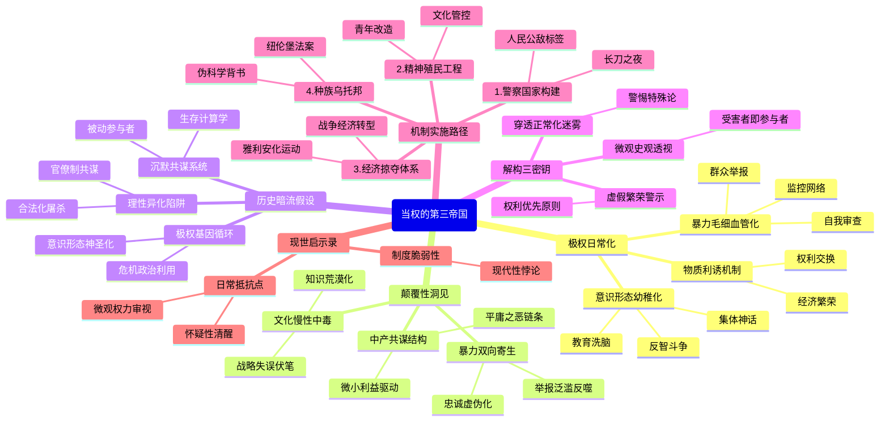

豆瓣链接：https://book.douban.com/subject/34925415/

# 深层解构

### 《当权的第三帝国》深层解码：极权主义的日常化生存
在纳粹德国看似“繁荣稳定”的表象之下，理查德·J.埃文斯以史学家的冷峻笔触，揭开了极权主义如何将一个现代国家异化为战争机器的全过程。这本书的价值远超对历史事件的复现，它揭示了一个关于权力、暴力与人性的残酷真相：**极权主义的恐怖，往往藏在最日常的生活褶皱里**。

#### **一、基石：极权统治的三重驯化术**
作者反复锚定的核心逻辑，是纳粹政权如何通过**制度性暴力、意识形态渗透与物质利诱的三重奏**，完成对整个社会的驯化：
1. **暴力的日常化**  
书中用大量篇幅描述“长刀之夜”的清洗、盖世太保的监控网络，以及“群众举报”如何成为社会常态。但更值得警惕的是：**当恐怖成为日常生活的背景音**（如教师因一句玩笑被审讯、邻居因私怨互相告发），暴力就不再是偶发的威慑，而是变成了维系社会运转的“毛细血管”。埃文斯通过教师、工人、小商人的案例揭示：**极权主义的第一堂课，是让所有人学会在恐惧中自我审查**。
2. **意识形态的 infantilization（ infantilization 意为“ infantilization”，可译为“ infantilization”“幼稚化”，此处结合语境译为“ infantilization”）**  
在“精神动员”“灵魂改造”章节，纳粹将教育体系改造成“领袖原则”的传声筒，用“血与土”的神话取代理性思考，甚至在儿童绘本中植入种族主义。这暴露了极权主义的深层策略：**将复杂的社会问题简化为敌我对立的二元叙事，用集体神话取代个体思考，最终让整个民族陷入认知幼稚病**。
3. **面包与马戏的交换逻辑**  
书中提到，纳粹通过解决失业、举办“力量来自欢乐”运动等手段，让民众用自由换取物质安全感。埃文斯暗示：**任何政权提供的“稳定红利”都可能成为权力臣服的对价**，当经济繁荣与独裁统治捆绑，普通人很容易在“性价比”计算中放弃对暴政的抵抗。

#### **二、边缘：被轻描淡写的颠覆性洞见**
作者在细节中埋藏了几处可能改写历史认知的“思想曲线远端”：
1. **暴力的双向寄生性**  
书中提到，87.5%的“政治异见”举报源于私人恩怨，盖世太保不得不头疼于“举报泛滥”。这揭示了极权统治的吊诡：**体制鼓励的告密文化，最终会反噬权力本身**——当举报成为泄愤工具，意识形态忠诚就沦为虚伪的遮羞布，暴露出权力与个体间的脆弱契约。
2. **中产阶级的共谋机制**  
传统叙事常强调工人或底层的受害，但埃文斯发现，中下层阶级是举报主力，小商人积极参与“经济雅利安化”掠夺犹太人财产。这打破了“压迫者 vs 被压迫者”的简单二分：**极权主义的扩张，往往依赖于普通人为微小利益成为“暴力链”的一环**，所谓“平庸之恶”，本质是系统性诱惑下的集体失能。
3. **文化清洗的慢性毒性**  
纳粹对现代艺术的打压、对“反智斗争”的推崇，看似是意识形态的胜利，实则埋下了文明衰退的伏笔。埃文斯暗示：**当一个社会用政治正确取代知识多元，用口号取代思辨，其创造力与纠错能力将不可逆转地退化**，这为后来德国在战争中的战略失误埋下了隐性注脚。

#### **三、暗流：未被言说的历史假设**
在严谨的史料铺陈下，隐藏着作者对现代性的深刻质疑：
1. **理性社会的脆弱性假设**  
书中描述的纳粹德国，并非野蛮对文明的征服，而是一个拥有发达工业、科技与法律体系的现代国家的自我异化。这暗示：**现代性的制度框架（如官僚体系、法律程序）可能成为极权主义的帮凶**，理性化的屠杀（如“经济雅利安化”的法律程序）比野蛮暴行更具欺骗性。
2. **沉默的共谋者假设**  
埃文斯没有追问“为什么多数德国人没有反抗”，但通过普通人的日常选择（如教师为保饭碗妥协、家长为子女前途配合洗脑），揭示了更沉重的真相：**极权主义的成功，依赖于无数“非暴力不抵抗”的沉默共识**。每个看似被动的个体，都在“自我保全”的计算中成为体制的共犯。
3. **历史循环的隐忧**  
书中对纳粹如何利用经济危机、民族主义情绪上台的描述，暗含对当代社会的警示：**任何将单一意识形态神圣化、将异见者妖魔化的政治操作，都可能激活极权主义的基因**。埃文斯的学术克制背后，是对“历史终结论”的隐秘反驳——极权主义的幽灵，从未远离现代文明。

#### **四、给读者的三把钥匙**
1. **穿透“正常化”的迷雾**  
当书中描述纳粹如何将“种族清洗”包装成“国家理性”、将监控说成“秩序需要”，请记住：**所有暴政的第一步，都是让不可接受的事情变得“正常”**。警惕任何用“特殊时期”“国家安全”为由突破文明底线的论调。
2. **从“小人物”看大历史**  
埃文斯用教师、工人、家庭主妇的档案碎片拼贴历史，提醒我们：**极权主义的受害者与参与者，往往是同一群人**。在宏大叙事下，每个普通人的恐惧、妥协与偶尔的良知闪现，才是理解历史的密码。
3. **思考“繁荣”的代价**  
纳粹创造的“经济奇迹”建立在掠夺与奴役之上，这警示我们：**任何不依赖自由与权利的“繁荣”，都是沙上之塔**。当GDP增长与公民权利发生冲突时，选择哪一边，决定了社会的文明底色。

### 写在最后：当我们读第三帝国，我们在读什么？
这本书不是为了让读者感叹“历史多么遥远”，而是为了追问：**在我们的时代，是否存在着第三帝国的精神胚胎？** 埃文斯用1008页的实证研究证明：极权主义不是历史的偶然，而是权力不受约束的必然可能。真正的阅读顿悟，应当是在书中看到人类本性的幽微——那些对确定性的渴望、对异己的排斥、对微小利益的追逐，如何在特定制度下，汇聚成吞噬文明的狂潮。

**阅读这本书的终极意义，是学会在日常中辨认极权主义的胎动，在每个“习以为常”的瞬间，保持一丝怀疑的清醒**。毕竟，阻止历史重演的最好方式，不是诅咒过去的黑暗，而是成为照亮当下的微光。

# 章节内容
### 第三帝国的到来

### 第一章：警察国家

**第一节：长刀之夜**

理查德·J·埃文斯在本章开篇详细叙述了1934年6月30日发生的“长刀之夜”事件。他认为，**这次血腥清洗是纳粹政权从革命运动彻底转向极权国家的关键节点**。埃文斯指出，此时的冲锋队及其领导人恩斯特·罗姆，代表着纳粹运动中持续存在的“二次革命”诉求，他们希望兑现反资本主义的承诺，并让冲锋队取代国防军成为国家的主要军事力量。这种诉求对希特勒与德国军队、商业巨头等传统精英阶层的联盟构成了直接威胁。因此，希特勒选择以极端暴力的方式解决这个问题。埃文斯的核心论点是，通过这次清洗，希特勒不仅消灭了党内的潜在对手，更重要的是向德国社会，特别是国防军，发出了一个明确信号：**法律和程序将不再是其行使权力的障碍，国家元首的意志便是最高法律**。此举为党卫队的崛起铺平了道路，也标志着一个以恐怖和非法暴力为基础的警察国家正式确立。

**第二节：镇压与反抗**

在“长刀之夜”之后，埃文斯详细阐述了纳粹镇压机器的系统化构建过程。**他认为，第三帝国的警察国家并非一个协调一致的整体，而是一个由不同机构（如盖世太保、党卫队、保安处等）构成的、充满内部竞争和权力斗争的复合体**。尽管如此，它们在镇压异议、维护政权方面的目标是完全一致的。希姆莱和海德里希领导下的党卫队系统逐渐取得了主导地位，将警察力量从传统的维持公共秩序的工具，转变为一个主动出击、预防性地消灭“国家敌人”的意识形态工具。埃文斯通过分析社会民主党和共产党的地下抵抗活动指出，尽管存在着勇敢的反抗，但由于镇压机器的残酷高效和民众的普遍顺从，这些抵抗大多是零星的、分散的，未能对政权构成实质性威胁。

**第三节：“人民公敌”**

本节聚焦于纳粹政权如何通过法律和司法系统来定义和迫害所谓的“人民公敌”。埃文斯的核心观点是，**纳粹并非简单地废除法律，而是将其彻底“纳粹化”，使之成为服务于种族主义和政治压迫的工具**。他详细分析了“人民法院”的设立，这个法外之地专门审判“叛国罪”，其判决完全服务于政治需要。此外，纳粹还通过颁布新的法律，如《反社会寄生虫法》，极大地扩展了“犯罪”的定义，将同性恋者、惯犯、流浪汉、耶和华见证人等群体都囊括进“人民公敌”的范畴。埃文斯认为，这种做法的根本目的，在于通过清除所有不符合其意识形态规范的“异类”，来构建一个同质化的、“纯洁的”民族共同体。监狱和早期集中营的条件急剧恶化，反映出政权对待这些“公敌”的残酷性。

**第四节：恐怖手腕**

埃文斯在本节中深入探讨了纳粹恐怖统治的日常运作机制。**他强调，盖世太保的无所不能很大程度上是一种“神话”，其人力有限，其高效运作极度依赖于普通民众的告密和举报**。这种“自下而上”的参与，是纳粹恐怖能够渗透到社会最末梢的关键。作者指出，告密行为的动机是复杂的，既有出于意识形态的狂热，也有大量的个人恩怨、嫉妒和利益驱动。这种普遍的监视和不信任氛围，有效地瓦解了社会内部的团结，使人们陷入原子化的孤立状态，从而更容易被控制。埃文斯认为，集中营在这一时期也完成了其角色的转变，从最初主要关押政治犯的场所，演变为一个系统性地囚禁、虐待和消灭所有“种族和生物学意义上低等的人”的恐怖系统。

### 第二章：精神动员

**第一节：启蒙人民**

本章转而探讨纳粹如何通过宣传来控制思想和舆论。埃文斯认为，**戈培尔领导下的宣传部是纳粹政权最重要的支柱之一，其核心任务是进行一场全面的“精神动员”，以确保民众不仅服从，而且从内心认同纳粹主义**。他详细描述了纳粹如何娴熟地运用当时最先进的媒介手段，特别是广播和电影。通过推广廉价的“人民收音机”，纳粹成功地将希特勒的声音和官方的宣传直接送入千家万户，使其成为日常生活中无所不在的存在。纽伦堡党代会等精心策划的大型集会，以及《意志的胜利》等宣传片，则通过宏大的场面和仪式感，营造出一种民族团结和国家复兴的迷人幻象。埃文斯指出，戈培尔的宣传策略并非简单的说教，而是善于将政治信息融入娱乐和日常生活中，从而达到潜移默化的洗脑效果。

**第二节：为德国而写作**

本节聚焦于纳粹对新闻和文学领域的控制。埃文斯的核心观点是，**纳粹政权通过“一体化”政策，彻底摧毁了德国曾经充满活力的媒体和出版业，使其完全沦为政治宣传的喉舌**。他通过分析《法兰克福报》等著名报纸的遭遇，揭示了纳粹如何通过强制合并、控制新闻来源、审查稿件等手段，扼杀了新闻自由。在文学领域，大批有才华的作家被迫流亡，他们的作品被焚烧和查禁。取而代之的，是那些宣扬“血与土”、英雄主义和民族主义思想的平庸之作。埃文斯通过作家鲁道夫·迪岑等人的个人经历，生动地展现了知识分子在独裁统治下面临的艰难抉择：是同流合污、保持沉默，还是冒着巨大风险进行抗争。

**第三节：视角问题**

本节将视线转向视觉艺术和建筑领域。埃文斯认为，**纳粹在艺术领域的清洗和改造，集中体现了其意识形态的复古和反现代倾向**。希特勒本人对现代派艺术怀有极度的厌恶，他将其斥为“堕落的艺术”，认为是犹太-布尔什维克主义精神污染的产物。纳粹政权因此发起了大规模的运动，将现代艺术品从博物馆中清除，并举办“堕落艺术展”加以羞辱。与此同时，他们推崇一种以阿尔诺·布雷克尔的雕塑为代表的、模仿古典风格的“新古典主义”艺术，其特点是人物形象高大、肌肉发达，充满了英雄气概，旨在表现雅利安人种的“优越性”。在建筑领域，希特勒的宏伟计划则旨在通过巨大的纪念碑式建筑，来展现第三帝国的“永恒”和“伟大”，从而在视觉上压倒个体，使其感受到国家的绝对权威。

**第四节：从不协到协和**

本节探讨纳粹对音乐领域的控制，并对纳粹的文化政策进行了总结。埃文斯指出，**纳粹在音乐领域的审查和控制，相比其他艺术领域，表现出更多的矛盾和不确定性**。一方面，他们极力推崇瓦格纳等被认为是体现了“德意志精神”的古典音乐家；另一方面，他们又严厉打压勋伯格等现代派作曲家，并查禁被视为“黑人文化污染”的爵士乐。然而，埃文斯通过理查德·施特劳斯等人的案例表明，纳粹在实践中常常会因为个人偏好或政治需要而做出妥协。他总结道，尽管纳粹的文化宣传试图塑造一个整齐划一、和谐一致的德国，但其内部充满了矛盾、竞争和效率低下的问题。**宣传的成功，更多地在于强化而非创造民众既有的偏见和价值观**。它或许没能让所有德国人都变成狂热的纳粹分子，但在很大程度上成功地消除了公开的异议，营造了一种万马齐喑的社会氛围。

### 第三章：**灵魂改造**

**第一节：信仰问题**

本章深入探讨纳粹政权与德国宗教世界之间的复杂关系。埃文斯开篇便指出，**纳粹主义本身作为一种准宗教的世俗意识形态，必然与传统的基督教信仰发生冲突**。纳粹试图用对希特勒的个人崇拜和对“民族共同体”的信仰，来取代上帝和教会的位置。然而，希特勒在掌权初期采取了相对谨慎的策略，他深知基督教在德国社会根深蒂固的影响力，因此试图对教会进行拉拢和控制，而非直接对抗。本节详细描述了纳粹如何扶植“德意志基督徒”运动，试图将新教教会“纳粹化”，使其教义与种族主义意识形态相融合。这一举动引发了教会内部的分裂，以马丁·尼莫勒等人为代表的“认信教会”奋起反抗，坚持基督教信仰的独立性，从而拉开了纳粹与教会之间长期而复杂的斗争序幕。

**第二节：天主教徒和异教徒**

本节聚焦于纳粹与天主教会以及其他宗教派别的关系。埃文斯的核心观点是，**尽管纳粹在1933年与梵蒂冈签订了《政教协定》以稳定局势，但其最终目标始终是削弱乃至根除天主教在德国社会的影响力**。天主教会作为一个拥有跨国组织和独立权威的机构，被纳粹视为构建极权统治的一大障碍。因此，在短暂的缓和之后，纳粹便开始通过各种手段打压天主教会，包括关闭天主教学校、解散其附属组织、没收教会财产，并以各种捏造的罪名（如“道德败坏”）对神职人员进行政治迫害。与此同时，纳粹政权内部也存在着一股强大的“异教”潮流，以希姆莱和罗森博格为代表的极端分子，试图复兴所谓的“古代日耳曼信仰”，彻底取代基督教。埃文斯认为，这种内部的宗教混乱状态，恰恰反映了纳粹意识形态的混杂本质。

**第三节：青年就是未来**

本节重点分析了纳粹如何通过控制教育和青年组织来塑造下一代德国人。埃文斯认为，**对青年的全面控制，是纳粹实现其“千年帝国”梦想的核心环节**。纳粹政权通过解散所有其他青年团体，将希特勒青年团确立为唯一的官方青年组织，并最终实行强制入团。希特勒青年团通过组织行军、野营、体育竞赛和军事演练等活动，向青少年灌输绝对服从、纪律至上、崇尚暴力和种族优越感的思想，旨在将他们培养成忠于元首、随时准备为国牺牲的“新人类”。在教育领域，纳粹对教师队伍进行了政治清洗，并重新编写了所有科目的教材，使其充满了纳粹的意识形态宣传。历史被歪曲为日耳曼种族的英雄史诗，生物学则被用来“证明”雅利安人种的优越性和犹太人的“劣等性”。

**第四节：“反智斗争”**

埃文斯在本节中探讨了纳粹政权对德国高等教育和知识界的摧残。**他将纳粹的政策总结为一场彻底的“反智斗争”，其目标是摧毁批判性思维和学术自由，代之以僵化的意识形态教条**。大学的自治权被剥夺，大批犹太裔和持不同政见的教授被驱逐，其中包括许多诺贝尔奖得主和世界顶尖的学者，这导致了德国科学和人文学术水平的灾难性下降。学生们的学术生活被政治活动和准军事训练所占据，传统的学生社团被纳粹学生联盟所取代。埃文斯认为，这场“反智斗争”的后果是极其深远的。它不仅使德国的学术和科技发展陷入停滞，更重要的是，它成功地培养出了一代在思想上盲从、在道德上麻木的“技术官僚”，这些人日后成为了执行纳粹种族灭绝等恐怖政策的高效工具。

### 第四章：繁荣和掠夺

**第一节：“战胜失业”**

本章聚焦于第三帝国的经济政策。埃文斯首先分析了纳粹上台后最引以为傲的“经济奇迹”——迅速消除失业。他认为，**纳粹所谓的“战胜失业”，在很大程度上是建立在一系列短期措施、统计操纵和大规模公共开支之上的，而其核心驱动力是为战争做准备**。他详细拆解了纳粹的各项政策，包括兴建高速公路、鼓励汽车工业发展等。然而，他指出，这些措施对经济的实际贡献被大大夸大了。真正吸收大量劳动力的，是1935年开始实施的强制兵役制度和大规模的重整军备计划。此外，纳粹还通过将女性和犹太人排除出劳动力市场等方式，人为地压低了失业率的统计数据。埃文斯强调，这种以军事开支为导向的经济复苏是不可持续的，它将德国经济牢牢地绑在了通往战争的战车上。

**第二节：商业、政治和战争**

本节深入探讨了纳粹政权与德国工商界之间的关系。埃文斯的核心观点是，**纳粹并非一个反资本主义的政党，它与大企业的关系是复杂的、相互利用的**。一方面，纳粹政权通过解散工会、压制工人权利，为企业主创造了极为有利的经营环境。许多大公司，如法本公司、克虏伯公司等，都从纳粹的重整军备订单中大发横财，并积极参与到政权的运作之中。另一方面，纳粹也加强了对经济的控制，通过“四年计划”等措施，强制企业为服务于战争准备的总体目标。戈林取代了更为稳健的沙赫特，成为经济领域的独裁者，这标志着经济政策彻底转向服务于军事扩张。埃文斯认为，**这种政商结合的模式，最终导致了德国经济的军事化，私营企业的利益与纳粹的战争目标被紧密地捆绑在一起**。

**第三节：经济的雅利安化**

本节聚焦于纳粹对犹太人经济权利的系统性剥夺，即所谓的“雅利安化”。埃文斯将这一过程描述为**一场由国家主导的、有计划的、分阶段的公然抢劫**。他详细叙述了“雅利安化”的步骤：从最初的抵制犹太商店，到后来通过各种歧视性法令和行政压力，迫使犹太人以极低的价格“出售”他们的企业、商店和财产。这些被掠夺的资产，往往落入了那些与纳粹党关系密切的“老党员”或德国大公司手中。埃文斯强调，“雅利安化”不仅是出于意识形态的狂热，更是纳粹进行财富再分配、收买人心和解决财政困难的重要手段。这一过程不仅摧毁了犹太人在德国的经济基础，也为后续的种族隔离和肉体消灭铺平了道路。

**第四节：分赃**

在最后一节中，埃文斯揭示了纳粹政权内部的腐败问题。他认为，**与对外宣传的廉洁形象截然相反，第三帝国从上到下都充满了系统性的腐败和以权谋私**。“雅利安化”过程中对犹太财产的掠夺，只是这场大规模分赃的冰山一角。纳粹党的高官们，从希特勒、戈林到地方的党政官员，都利用职权大肆敛财，过着奢华的生活。埃文斯指出，这种腐败是纳粹统治模式的内在特征。它通过提供物质利益和特权，将政权的各级官员捆绑成一个紧密的“利益共同体”，从而确保了他们对政权的忠诚。**对犹太人和其他“敌人”的掠夺，实际上成为了一种收买和奖励“自己人”的机制，是维持其统治的重要润滑剂**。这种制度化的腐败，彻底戳穿了纳粹所宣扬的“为民族无私奉献”的谎言。

### 第五章：建立人民共同体

**第一节：血与土**

本节探讨了纳粹政权对德国农民和农村社会的政策。埃文斯指出，**纳粹意识形态的核心之一是“血与土”的信条，即认为纯洁的雅利安农民是德意志民族的根基和种族活力的源泉**。基于这种理念，农业部长达雷推行了《农场继承法》，旨在保护中小农场不被分割，并将其世代捆绑在土地上。然而，埃文斯的核心论点是，**这些政策在现实中大多适得其反，非但没能实现其田园牧歌式的理想，反而加剧了农村的困境**。该法律剥夺了农民自由处置财产的权利，并导致非继承人子女大量流向城市，加剧了农村劳动力的短缺。同时，国家对食品价格的严格控制，也损害了农民的经济利益。尽管纳粹在宣传上极力美化农民生活，但其政策的僵化和官僚主义，使得农村的现实与宣传的图景之间存在着巨大的鸿沟。

**第二节：中产阶级的命运**

本节分析了纳粹政权与德国中产阶级的关系。中产阶级是纳粹在崛起过程中最重要的支持者之一，他们期望新政权能够恢复经济秩序、抑制大资本和工会的力量，并保护他们的社会地位。埃文斯认为，**纳粹上台后，在一定程度上兑现了对中产阶级的某些承诺，但其根本目标是服务于重整军备和战争准备，这与中产阶级的长远利益是相悖的**。例如，政权虽然打击了大型百货公司以保护小店主，但效果有限；手工业者虽然获得了一些扶持，但很快就被纳入服务于战争经济的轨道。总的来说，中产阶级在纳粹统治下经历了一个复杂的过程：他们从早期的混乱和恐怖中获得了秩序感，但同时也逐渐丧失了经济上的独立性和政治上的发言权，最终被整合进庞大的战争机器之中。

**第三节：驯服无产阶级**

本节聚焦于纳粹如何对待其曾经最主要的敌人——德国的工人阶级。埃文斯的核心观点是，**纳粹通过“胡萝卜加大棒”的策略，成功地“驯服”了德国的工人阶级，消除了其潜在的反抗能力**。“大棒”是显而易见的：纳粹在夺权后立即摧毁了强大的工会和工人政党，并将所有工人强制纳入由纳粹控制的“德意志劳工阵线”。这个组织名义上代表工人利益，实际上是剥夺工人罢工权利、压低工资、并对工人进行全面监控的工具。而“胡萝卜”则体现在两个方面：一是通过重整军备确实地解决了失业问题；二是通过“欢乐创造力量”等组织，为工人提供前所未有的廉价度假、旅游和文娱活动。埃文斯认为，**这种将严密控制与物质收买相结合的方式，有效地瓦解了工人的阶级认同，代之以虚假的“民族共同体”归属感**。

**第四节：承诺与现实**

在本章的最后一节，埃文斯对纳粹“人民共同体”的理念进行了总结性批判。他认为，**所谓的“人民共同体”（Volksgemeinschaft）是一个强大而诱人的政治神话，但它在现实中从未真正实现过**。纳粹所承诺的打破阶级壁垒、实现社会平等的“民族共同体”，实际上是一个充满歧视、不公和内部矛盾的社会。它通过系统性地排除和迫害犹太人等“异类”来界定其边界。而在共同体内部，旧有的社会阶层和经济不平等不仅依然存在，甚至在某些方面有所加剧。纳粹政权所做的，并非是真正地消弭阶级差异，而是用一套民族主义和种族主义的意识形态话语将其掩盖起来。**“人民共同体”的真正作用，是作为一种社会控制和动员的工具，它以团结和归属感的承诺为诱饵，最终将整个德国社会引向了服务于战争和种族灭绝的毁灭性道路**。

### 第六章：走向种族乌托邦

**第一节：以科学精神的名义**

本章转入纳粹种族政策的核心。埃文斯开篇即指出，**纳粹的种族主义并非单纯的偏见，而是试图以当时的优生学和种族卫生学等“科学”理论作为其合法性基础**。他认为，这种将政治问题“科学化”和“医学化”的做法，是纳粹政策中最具毁灭性的特征之一。本节详细描述了纳粹如何推行《遗传病后代防治法》，对数十万被认为是患有遗传性疾病的人（如精神分裂症、遗传性失明或耳聋、酗酒等）进行强制绝育。埃文斯强调，这些政策的受害者远不止是病人，还包括了许多仅仅被认为是“反社会”或“懒惰”的人。**这一政策的核心论点是，国家有权为了“民族的健康”和“种族的纯洁”，而剥夺个体的基本繁衍权利，这标志着纳粹政权在践踏人权和生命尊严的道路上迈出了关键一步**，并为后续更大规模的屠杀提供了理论和实践的“准备”。

**第二节：纽伦堡法案**

本节聚焦于1935年颁布的《纽伦堡法案》，埃文斯将其视为**纳粹将反犹主义从街头暴力和零散的歧视，转变为系统性、法律化种族隔离的决定性转折点**。该法案主要包括两部分：《帝国公民法》和《德意志血统和荣誉保护法》。前者将德国居民划分为拥有完全政治权利的“帝国公民”（仅限德意志血统者）和没有公民权的“国民”；后者则严禁犹太人与“德意志血统”的公民结婚或发生性关系。埃文斯认为，这些法律的真正目的，在于通过立法的方式，在法律上将犹太人彻底排除出德国社会，并为进一步的迫害提供依据。**《纽伦堡法案》的颁布，标志着犹太人的法律地位被彻底摧毁，他们被正式定义为德国的“异类”，为日后将其视为可以被任意处置的“物体”埋下了伏笔**。

**第三节：“犹太人必须滚出欧洲”**

在《纽伦堡法案》之后，纳粹对犹太人的迫害进入了一个新的阶段。本节描述了从1935年到1938年间，纳粹政权如何通过日益加剧的社会、经济和政治压力，试图迫使犹太人离开德国。埃文斯指出，这一时期的政策充满了矛盾和混乱。一方面，纳粹政权通过各种手段没收犹太人的财产，使他们难以支付高昂的“移民税”，从而阻碍了他们出境。另一方面，又不断地通过暴力和歧视，将他们的生活空间压缩到极致。**埃文斯的核心观点是，此时纳粹政权对于“犹太人问题”的“最终解决方案”尚无明确计划，其政策在“驱逐”和“掠夺”之间摇摆不定**。然而，这种不断升级的迫害，已经使得犹太人在德国的生存变得岌岌可危。

**第四节：碎玻璃之夜**

本节详细叙述了1938年11月9日至10日发生的“水晶之夜”（或称“碎玻璃之夜”）。埃文斯认为，**这次由国家策划和纵容的大规模暴力 pogrom，是纳粹对犹太人政策从法律歧视和经济掠夺，转向公开、全面的暴力攻击的标志**。事件的导火索是一名犹太青年在巴黎刺杀了一名德国外交官，但纳粹政权早已在等待一个发动大规模迫害的借口。在戈培尔的煽动下，纳粹冲锋队和狂热的民众在全国范围内焚烧犹太教堂、捣毁犹太人商店、并肆意殴打和杀害犹太人。埃文斯强调，“水晶之夜”不仅是一场野蛮的暴力狂欢，更是一次精心策划的政治行动。**它彻底摧毁了犹太社群在德国存在的最后一点安全感和物质基础，并开启了将犹太人大规模送往集中营的阶段，是通往大屠杀之路上的一个不归点**。事件之后，犹太人还被处以巨额“罚款”，为其所遭受的破坏“赔偿”，这充分暴露了纳粹政权的无耻和残暴。

### 第七章：通往战争之路

**第一节：从弱小到强大**

理查德·J·埃文斯在本节中详细论述了希特勒在上台初期（1933-1936年）如何通过一系列精明而大胆的外交手腕，成功地将德国从一个受《凡尔赛条约》束缚的弱国，转变为欧洲舞台上一个不容忽视的军事和政治力量。埃文斯的核心论点是，**希特勒的外交政策是一场精心策划的“和平伪装”，其所有行动都服务于一个最终目标：为未来的战争做准备**。他首先以争取“平等权利”为名，宣布退出国际联盟和裁军会议，从而摆脱了国际社会的束缚。随后，他与波兰签订互不侵犯条约，这一举动既麻痹了国际社会，又成功分化了法国在东欧的同盟体系。在这些和平烟幕的掩护下，德国秘密开始了大规模的重整军备。本节的高潮是1936年德军进驻莱茵兰非军事区。埃文斯认为，**这是希特勒的一场巨大政治赌博，其成功极大地巩固了他在国内，特别是对持怀疑态度的军方高层的绝对权威，并让他从此更加坚信自己“直觉”的正确性**。英法的无所作为，标志着绥靖政策的正式登场，也让德国彻底打破了凡尔赛体系的枷锁，从弱小迈向了强大。

**第二节：建立大德意志**

本节聚焦于1938年3月德国对奥地利的吞并（Anschluss），埃文斯将其视为纳粹外交政策从修正主义转向公然扩张侵略的决定性一步。作者认为，吞并奥地利是实现希特勒在《我的奋斗》中早已规划好的、建立一个囊括所有德意志民族的“大德意志帝国”宏伟蓝图的开端。埃文斯详细揭示了这一过程并非纳粹宣传中所描绘的“和平回归”，而是一场**结合了政治讹诈、武力恫吓和内部颠覆的强行吞并**。希特勒通过威胁和欺骗，迫使奥地利政府屈服，并利用奥地利纳粹党作为内应，最终制造出德军是应邀进入奥地利“维持秩序”的假象。埃文斯强调，奥地利民众，特别是维也纳民众在德军进入后所表现出的狂热欢迎，以及随之爆发的对犹太人自发而残酷的迫害，**向纳粹政权展示了其种族主义政策在“新领土”上拥有深厚的民意基础，也为日后在其他地区推行更为激进的种族清洗政策提供了“信心”**。这次吞并极大地增强了德国的经济实力和战略地位，使其完成了对捷克斯洛伐克的三面包围。

**第三节：强取捷克斯洛伐克**

本节详细叙述了1938年围绕苏台德地区问题而展开的捷克斯洛伐克危机，以及最终导致这一民主国家被肢解的《慕尼黑协定》。埃文斯的核心观点是，**希特勒并非真的关心苏台德德意志人的权益，而是蓄意利用民族问题作为借口，其真实目的是彻底摧毁他所鄙视的、作为中欧民主堡垒和法国盟友的捷克斯洛伐克**。他通过扶植苏台德地区的纳粹组织不断制造事端，将欧洲推向战争边缘。面对希特勒的战争威胁，英法两国选择了绥靖政策。埃文斯对《慕尼黑协定》给予了极其负面的评价，他认为**这并非是带来了“我们时代的和平”，而是绥靖政策的耻辱顶峰，它向希特勒证明了西方民主国家为了避免战争可以牺牲他国利益，从而极大地助长了其侵略野心**。希特勒本人甚至对慕尼黑协定剥夺了他发动一场“小规模战争”来检验德军实力的机会而感到不满。1939年3月，德军公然占领捷克全境，彻底撕毁了协定，也让全世界看清了希特勒的真实意图绝非仅仅是统一德意志民族。

**第四节：进军东方**

在本章的最后一节，埃文斯阐述了通往第二次世界大战爆发的最后阶段。他认为，在彻底吞并捷克斯洛伐克之后，希特勒的下一个目标必然是波兰，因为**发动一场指向东方的种族战争，以夺取“生存空间”（Lebensraum），是纳粹意识形态最核心、最不可动摇的目标**。为了扫清发动战争的最大障碍，希特勒做出了一个震惊世界的决定：与意识形态上的死敌苏联签订《苏德互不侵犯条约》。埃文斯指出，**这份条约是国际关系史上最犬儒主义的协议之一，其秘密条款实际上是两个独裁国家瓜分波兰和东欧的肮脏交易**。这份条约为希特勒入侵波兰解除了后顾之忧，让他错误地判断英法会像在慕尼黑时一样再次退缩。当德国于1939年9月1日入侵波兰，而英法两国最终履行其承诺对德宣战时，希特勒虽然感到些许意外，但其发动战争的决心已无法逆转。埃文斯总结道，这场战争的到来，绝非偶然，而是纳粹政权从建立之初就注定的、其整个政治、种族和意识形态逻辑的必然归宿。