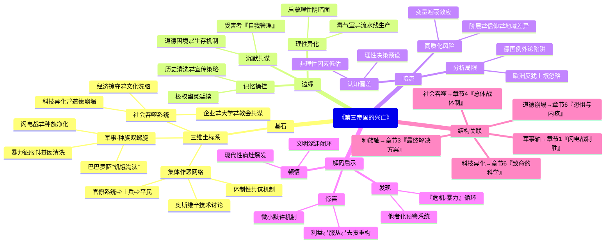

豆瓣链接：https://book.douban.com/subject/35134992/

# 深层解构

### 基石：全景解构极权的三维坐标系
1. **军事-种族双螺旋结构** 
    - 作者以战争推进为时间轴，构建起“闪电战征服”与“种族净化”相互缠绕的叙事框架。从波兰战役的军事胜利直接引出“新种族秩序”的建立，到斯大林格勒战役的失败与犹太人大屠杀的加速同步呈现，揭示出纳粹将军事扩张视为种族生存空间争夺的本质逻辑。这种“枪杆子+种族论”的双驱动模型，解构了“单纯军事帝国”的表面认知，暴露出极权体制的核心信念——**暴力征服与基因清洗是维持统治的一体两面**。
    - 例如，书中提到巴巴罗萨行动不仅是军事冒险，更是“消灭斯拉夫劣等民族、为雅利安人腾出生存空间”的种族圣战，后勤计划中甚至包含对占领区人口实施“饥饿淘汰”的详细方案，印证了军事目标与种族灭绝的深度绑定。
2. **去英雄化的集体作恶史观** 
    - 埃文斯拒绝将第三帝国简化为“希特勒个人传记”，而是通过呈现从高官（如装备部长施佩尔、波兰总督弗兰克）到普通士兵、党卫军成员的多元视角，构建起“无主角的恶之网络”。书中引用大量官僚系统的会议记录、士兵家书、盖世太保监控报告，证明纳粹暴行并非“少数疯子的独裁”，而是**整个体制从决策层到执行层的共谋结果**。
    - 如对奥斯维辛集中营的描写，既剖析希姆莱的“净化理论”，也记录普通看守在日记中对屠杀流程的技术讨论，甚至提到当地居民对集中营招工的积极响应，打破了“自上而下强迫作恶”的简单叙事，揭示出极权体制如何将个体嵌入系统化暴力的链条。
3. **总体战的社会吞噬逻辑** 
    - 作者突破传统军事史框架，将经济掠夺（如“四年计划”对占领区资源的榨取）、文化洗脑（纳粹宣传对艺术、媒体的全面控制）、科技异化（V-2火箭研发中的奴隶劳工使用）纳入“总体战”范畴，提出**战争不仅是军事对抗，更是对整个社会资源、道德、人性的全面吞噬**。
    - 书中指出，德国企业（如法本公司）在集中营劳工使用中主动与纳粹合作，大学科研机构参与“优生学”实验，教会对屠杀保持沉默，证明极权体制通过“战争必要性”的叙事，将整个社会体系转化为战争机器的零部件，个体在“集体生存”的名义下放弃道德判断。

### 边缘：被轻拭的思想火花
1. **受害者的沉默共谋** 
    - 书中提到部分德国民众对纳粹暴行存在“知情的冷漠”，但未深入探讨受害者群体内部的复杂反应。例如，犹太隔离区中部分人被迫参与纳粹组织的“自我管理”，甚至协助维持秩序，这种“ Survival Mechanism（生存机制）”与道德困境的交织，暗示了极权统治下受害者与加害者界限的模糊性，为理解大屠杀的复杂性提供了新视角。
2. **科技理性的异化悖论** 
    - 作者虽提到纳粹将现代科技（如毒气室、流水线屠杀）用于大规模杀戮，但未展开讨论“理性化屠杀”的哲学隐喻——当科学技术脱离人文伦理，是否必然成为极权的帮凶？奥斯维辛中“技术官僚式屠杀”（如霍斯用图表记录毒气效率）与现代企业管理逻辑的相似性，暗示了启蒙理性的阴暗面，为反思现代性提供了历史镜鉴。
3. **记忆政治的未来阴影** 
    - 书中结尾提到战后德国对历史的反思，但未触及“记忆控制”在当代的延续性。例如，纳粹曾通过焚烧书籍、篡改教材实施“历史清洗”，这种对集体记忆的操控术，在后世某些政权的宣传策略中仍能看到影子，警示我们极权主义的幽灵从未完全消散。

### 暗流：未被审视的思维河床
1. **“德国例外论”的潜在预设** 
    - 作者在分析纳粹崛起时，侧重德国历史传统（如普鲁士军国主义、反犹主义）的影响，但可能忽视了欧洲整体反犹主义土壤对纳粹的催化作用。将纳粹罪行归因于“德国特殊道路”，某种程度上淡化了整个西方文明在种族主义、殖民主义中的共谋责任，陷入“德国例外”的解释陷阱。
2. **“理性决策”的认知偏差** 
    - 书中频繁使用“希特勒的野心”“希姆莱的意识形态”等表述，隐含着“纳粹高层是理性决策者”的假设。但近年研究表明，纳粹决策常受意识形态幻觉（如“犹太人阴谋论”）、内部权力斗争干扰，具有强烈的非理性特征。埃文斯的“结构化分析”可能低估了非理性因素（如希特勒的偏执狂人格）对历史进程的决定性作用。
3. **“普通人”概念的同质化陷阱** 
    - 作者强调“普通人”的战时经历，但“普通人”内部存在显著差异：工人与资产阶级对战争的体验不同，基督徒与非基督徒对种族政策的态度有别，甚至不同地区的德国人对纳粹的支持度也存在地域差异。将“普通人”作为单一分析单元，可能掩盖了社会阶层、宗教信仰、地域文化等变量对个体选择的复杂影响。

### 解码者的启示
- **顿悟**：这本书真正在说——极权主义不是历史的偶然，而是现代性病灶的集中爆发。当军事扩张、种族优越论、科技理性、社会动员形成闭环，任何文明都可能滑向深渊。
- **惊喜**：如果换个角度看——抛开“善恶二元论”，从经济利益（如企业对廉价劳工的需求）、认知心理学（群体服从机制）、组织行为学（官僚系统的去责任化）重新解读纳粹，会发现恶行的滋生往往始于日常选择的“微小默许”。
- **发现**：作者可能没意识到——他对“德国道德体系崩溃”的分析，无意中揭示了极权统治的终极武器：通过制造“集体生存危机”的想象（如“犹太人要毁灭德国”），将屠杀异化为“自卫战争”，让民众在恐惧中自愿交出道德底线。这种“危机-暴力”的循环逻辑，至今仍在某些语境中回响。

**阅读的真正价值**，不在于记住纳粹的暴行清单，而在于学会在和平年代识别极权的萌芽——当某个群体被系统性“他者化”，当暴力被包装成“必要之恶”，当异议被污名化为“破坏团结”，我们就站在了历史的十字路口。埃文斯的手术刀不仅解剖过去，更指向每个读者的良知：在雪崩时，没有一片雪花是无辜的，但首先，我们要学会识别雪花何时开始结冰。

# 章节内容

### 第一章：披着人皮的野兽
- **闪电战制胜**：德国凭借闪电战战术在战争初期取得巨大优势，波兰、丹麦、挪威、荷兰、比利时和法国等国迅速沦陷，德军的快速推进和高效作战给欧洲带来巨大冲击。
- **新的种族秩序**：纳粹妄图建立新种族秩序，将犹太人、斯拉夫人等视为“劣等民族”，这种极端思想为后续种族灭绝政策埋下伏笔，反映出纳粹扭曲的价值观和世界观。
- **“恐怖的暴民”**：德国入侵波兰期间，党卫队特别行动队和国防军对波兰人实施暴行，包括抢劫、强奸和屠杀，暴露出战争中人性的丑恶与纳粹的残暴。
- **“不配活着”**：纳粹对精神病人和残疾儿童实施安乐死计划，以“净化”种族为借口进行屠杀，这是纳粹优生政策的极端体现，也显示出纳粹对生命的漠视。

### 第二章：战争的命运
- **“上天的安排”**：德国在战争初期的胜利使纳粹认为是“上天的安排”，助长其侵略野心，希特勒妄图建立全球霸权，这种盲目自信推动战争进一步扩大。
- **“病态的野心”**：斯大林误判德国入侵时间，导致苏联初期准备不足。希特勒发动巴巴罗萨行动入侵苏联，德军初期进展顺利，此行动是战争的关键转折点，展现出希特勒的战略决策和苏联面临的严峻挑战。
- **巴巴罗萨行动**：德军深入苏联境内，但冬季来临使德军遭遇困境，苏联的抵抗和严寒天气阻碍德军进攻，战争局势开始发生变化，体现出自然环境和顽强抵抗对战争走向的影响。
- **沿着拿破仑的足迹**：德军在苏联的推进路线与拿破仑相似，战争的走向和结果也有相似之处，暗示了德军可能面临的失败命运，从历史对比角度分析战争局势。

### 第三章：“最终解决方案”
- **“毫无怜悯”**：纳粹在波兰等地建立集中营，开始对犹太人等群体进行迫害，手段残忍，毫无人性，集中营成为死亡和苦难的象征。
- **发动种族灭绝**：万湖会议确定对犹太人的“最终解决方案”，大规模屠杀计划展开，纳粹采用多种方式进行灭绝行动，这是人类历史上最黑暗的一页，揭示出纳粹的种族主义极端性和反人类本质。
- **万湖会议**：会议明确了种族灭绝的组织和实施细节，纳粹各级官员参与其中，标志着种族灭绝政策的系统化和官方化，反映出纳粹政权的集体罪恶。
- **“待宰羔羊”**：犹太人在种族灭绝行动中毫无反抗之力，被运往集中营杀害，他们的遭遇是人类历史上的巨大悲剧，引发对人性、道德和战争罪行的深刻思考。

### 第四章：新秩序
- **战争命脉**：纳粹在占领区掠夺资源，奴役劳动力，为战争机器提供支持，占领区人民遭受巨大苦难，这是纳粹战争经济的重要组成部分，体现出其对被占领地区的残酷剥削。
- **“命如草芥”**：纳粹在占领区的统治导致当地人民生活困苦，生命安全无法保障，纳粹的残暴统治引发民众的恐惧和反抗，反映出被占领区人民的悲惨境遇和不屈精神。
- **臣服于纳粹政权**：部分占领区建立傀儡政权，与纳粹合作，但也有抵抗力量出现，不同势力的选择和斗争影响着当地局势，展示出复杂的政治局势和人性的多面性。
- **总体战**：随着战争推进，纳粹加强对德国本土的控制，实行总体战体制，动员全社会资源，德国社会在战争压力下发生巨大变化，包括经济、社会和文化等方面，体现出战争对社会的全面影响。

### 第五章：“终结的开端”
- **硝烟弥漫的德国**：盟军对德国本土的轰炸使德国城市遭受重创，平民伤亡惨重，基础设施毁坏，德国民众开始体验到战争的残酷，这是纳粹发动战争的恶果，也反映出战争对平民的巨大伤害。
- **漫长的撤退**：德军在各战场逐渐陷入劣势，开始漫长撤退，战争局势对德国越来越不利，军事失败的迹象日益明显，标志着纳粹扩张的终结和失败的开始。
- **“厄运降临”**：战争对德国经济造成毁灭性打击，物资匮乏，通货膨胀，德国社会陷入混乱，民众生活水平急剧下降，经济崩溃加速了纳粹政权的衰落。
- **新的“挣扎时期”**：纳粹政权在困境中挣扎，试图通过各种手段维持统治，但内部矛盾加剧，面临内忧外患，其灭亡已不可避免，显示出纳粹政权的垂死挣扎和必然覆灭的命运。

### 第六章：德国的道德体系
- **恐惧与内疚**：纳粹统治下，德国人经历恐惧和内疚，部分人参与暴行，部分人虽未直接参与但选择沉默，战争对德国人的道德观念产生严重冲击，引发对个人在极权统治下道德责任的思考。
- **毁灭的文化**：纳粹对文化进行控制和破坏，许多文化遗产和艺术品受损，文化领域遭受重创，反映出纳粹对文化的破坏和对人类文明的践踏。
- **致命的科学**：纳粹在科学领域推行种族主义理论，进行不人道实验，科学家面临道德困境，这是科学与政治、道德冲突的典型案例，警示人们科学应遵循伦理道德。
- **抵抗**：德国国内存在抵抗力量，但面临巨大困难和危险，他们的反抗精神体现了人性的光辉，也表明即使在极权统治下，仍有正义力量存在。

### 第七章：倾覆
- **“最后的希望”**：纳粹寄希望于新型武器扭转战局，但未能成功，战争局势已无法挽回，反映出纳粹的垂死挣扎和幻想破灭。
- **“与全世界同归于尽”**：希特勒下令破坏德国基础设施，实施焦土政策，给德国带来更大破坏，显示出他的疯狂和极端，不顾德国人民的死活。
- **最后的战败**：盟军逼近柏林，希特勒自杀，德国最终战败投降，纳粹政权垮台，标志着第三帝国的覆灭，正义最终战胜邪恶。
- **余波**：战后德国面临审判、重建等诸多问题，纳粹罪行引发全球反思，对德国和世界产生深远影响，促使人们思考战争、和平、人权和道德等问题，以避免类似悲剧再次发生。