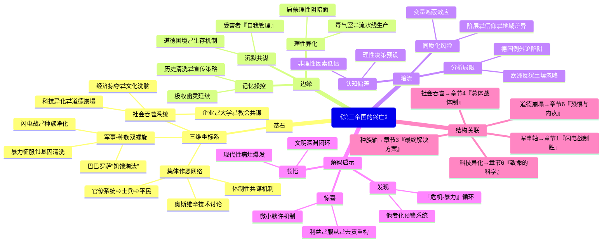

豆瓣链接：https://book.douban.com/subject/35134992/

# 深层解构

### 基石：全景解构极权的三维坐标系
1. **军事-种族双螺旋结构** 
    - 作者以战争推进为时间轴，构建起“闪电战征服”与“种族净化”相互缠绕的叙事框架。从波兰战役的军事胜利直接引出“新种族秩序”的建立，到斯大林格勒战役的失败与犹太人大屠杀的加速同步呈现，揭示出纳粹将军事扩张视为种族生存空间争夺的本质逻辑。这种“枪杆子+种族论”的双驱动模型，解构了“单纯军事帝国”的表面认知，暴露出极权体制的核心信念——**暴力征服与基因清洗是维持统治的一体两面**。
    - 例如，书中提到巴巴罗萨行动不仅是军事冒险，更是“消灭斯拉夫劣等民族、为雅利安人腾出生存空间”的种族圣战，后勤计划中甚至包含对占领区人口实施“饥饿淘汰”的详细方案，印证了军事目标与种族灭绝的深度绑定。
2. **去英雄化的集体作恶史观** 
    - 埃文斯拒绝将第三帝国简化为“希特勒个人传记”，而是通过呈现从高官（如装备部长施佩尔、波兰总督弗兰克）到普通士兵、党卫军成员的多元视角，构建起“无主角的恶之网络”。书中引用大量官僚系统的会议记录、士兵家书、盖世太保监控报告，证明纳粹暴行并非“少数疯子的独裁”，而是**整个体制从决策层到执行层的共谋结果**。
    - 如对奥斯维辛集中营的描写，既剖析希姆莱的“净化理论”，也记录普通看守在日记中对屠杀流程的技术讨论，甚至提到当地居民对集中营招工的积极响应，打破了“自上而下强迫作恶”的简单叙事，揭示出极权体制如何将个体嵌入系统化暴力的链条。
3. **总体战的社会吞噬逻辑** 
    - 作者突破传统军事史框架，将经济掠夺（如“四年计划”对占领区资源的榨取）、文化洗脑（纳粹宣传对艺术、媒体的全面控制）、科技异化（V-2火箭研发中的奴隶劳工使用）纳入“总体战”范畴，提出**战争不仅是军事对抗，更是对整个社会资源、道德、人性的全面吞噬**。
    - 书中指出，德国企业（如法本公司）在集中营劳工使用中主动与纳粹合作，大学科研机构参与“优生学”实验，教会对屠杀保持沉默，证明极权体制通过“战争必要性”的叙事，将整个社会体系转化为战争机器的零部件，个体在“集体生存”的名义下放弃道德判断。

### 边缘：被轻拭的思想火花
1. **受害者的沉默共谋** 
    - 书中提到部分德国民众对纳粹暴行存在“知情的冷漠”，但未深入探讨受害者群体内部的复杂反应。例如，犹太隔离区中部分人被迫参与纳粹组织的“自我管理”，甚至协助维持秩序，这种“ Survival Mechanism（生存机制）”与道德困境的交织，暗示了极权统治下受害者与加害者界限的模糊性，为理解大屠杀的复杂性提供了新视角。
2. **科技理性的异化悖论** 
    - 作者虽提到纳粹将现代科技（如毒气室、流水线屠杀）用于大规模杀戮，但未展开讨论“理性化屠杀”的哲学隐喻——当科学技术脱离人文伦理，是否必然成为极权的帮凶？奥斯维辛中“技术官僚式屠杀”（如霍斯用图表记录毒气效率）与现代企业管理逻辑的相似性，暗示了启蒙理性的阴暗面，为反思现代性提供了历史镜鉴。
3. **记忆政治的未来阴影** 
    - 书中结尾提到战后德国对历史的反思，但未触及“记忆控制”在当代的延续性。例如，纳粹曾通过焚烧书籍、篡改教材实施“历史清洗”，这种对集体记忆的操控术，在后世某些政权的宣传策略中仍能看到影子，警示我们极权主义的幽灵从未完全消散。

### 暗流：未被审视的思维河床
1. **“德国例外论”的潜在预设** 
    - 作者在分析纳粹崛起时，侧重德国历史传统（如普鲁士军国主义、反犹主义）的影响，但可能忽视了欧洲整体反犹主义土壤对纳粹的催化作用。将纳粹罪行归因于“德国特殊道路”，某种程度上淡化了整个西方文明在种族主义、殖民主义中的共谋责任，陷入“德国例外”的解释陷阱。
2. **“理性决策”的认知偏差** 
    - 书中频繁使用“希特勒的野心”“希姆莱的意识形态”等表述，隐含着“纳粹高层是理性决策者”的假设。但近年研究表明，纳粹决策常受意识形态幻觉（如“犹太人阴谋论”）、内部权力斗争干扰，具有强烈的非理性特征。埃文斯的“结构化分析”可能低估了非理性因素（如希特勒的偏执狂人格）对历史进程的决定性作用。
3. **“普通人”概念的同质化陷阱** 
    - 作者强调“普通人”的战时经历，但“普通人”内部存在显著差异：工人与资产阶级对战争的体验不同，基督徒与非基督徒对种族政策的态度有别，甚至不同地区的德国人对纳粹的支持度也存在地域差异。将“普通人”作为单一分析单元，可能掩盖了社会阶层、宗教信仰、地域文化等变量对个体选择的复杂影响。

### 解码者的启示
- **顿悟**：这本书真正在说——极权主义不是历史的偶然，而是现代性病灶的集中爆发。当军事扩张、种族优越论、科技理性、社会动员形成闭环，任何文明都可能滑向深渊。
- **惊喜**：如果换个角度看——抛开“善恶二元论”，从经济利益（如企业对廉价劳工的需求）、认知心理学（群体服从机制）、组织行为学（官僚系统的去责任化）重新解读纳粹，会发现恶行的滋生往往始于日常选择的“微小默许”。
- **发现**：作者可能没意识到——他对“德国道德体系崩溃”的分析，无意中揭示了极权统治的终极武器：通过制造“集体生存危机”的想象（如“犹太人要毁灭德国”），将屠杀异化为“自卫战争”，让民众在恐惧中自愿交出道德底线。这种“危机-暴力”的循环逻辑，至今仍在某些语境中回响。

**阅读的真正价值**，不在于记住纳粹的暴行清单，而在于学会在和平年代识别极权的萌芽——当某个群体被系统性“他者化”，当暴力被包装成“必要之恶”，当异议被污名化为“破坏团结”，我们就站在了历史的十字路口。埃文斯的手术刀不仅解剖过去，更指向每个读者的良知：在雪崩时，没有一片雪花是无辜的，但首先，我们要学会识别雪花何时开始结冰。

# 章节内容

好的，我将根据您提供的《战时的第三帝国》的详细章节目录，逐一进行内容总结。

---

### 第一章 披着人皮的野兽

#### **第一节 闪电战制胜**
本节聚焦于第二次世界大战初期的军事层面，即德国在波兰和西欧战场上取得的惊人胜利。埃文斯指出，所谓的“闪电战”并非一种事先规划周详、理论完备的革命性军事学说，而更多是德军在实战中结合新技术（如俯冲轰炸机和集中使用的坦克）与传统军事思想（如运动战和包围战）的即兴发挥和大胆应用。**作者的核心论点是，德军的胜利在很大程度上归功于其对手在战略、战术和心理上的准备不足。** 他详细描述了德军如何利用速度和奇袭，迅速撕裂波兰的防线，并在西线通过奇袭阿登森林，绕过固若金汤的马奇诺防线，一举击溃了当时号称“世界第一陆军”的法国。埃文斯强调，这种胜利给德国国内带来了巨大的震撼和虚假的自信，希特勒的个人声望达到了顶峰，许多原本对战争持怀疑态度的德国人也开始相信“元首”的英明和德军的不可战胜。然而，埃文斯也暗示，**这种看似辉煌的胜利充满了偶然性，并掩盖了德国在长期战争潜力上的根本性弱点，为日后的失败埋下了伏笔。**

#### **第二节 新的种族秩序**
在军事胜利的背景下，本节将重心转向纳粹意识形态的实践，特别是在被征服的波兰。埃文斯认为，对波兰的占领从一开始就不是传统的军事占领，而是一场旨在建立“新的种族秩序”的社会与种族革命。**其核心主张是，纳粹在波兰的所作所为，是其“生存空间”理论和种族主义世界观的第一次大规模、系统性的实验。** 德国将波兰领土一分为二：一部分直接并入德国，进行“德意志化”；另一部分则设立“总督府”，由汉斯·弗兰克管辖，将其变为一个巨大的原材料供应地和奴役劳动力的蓄水池。埃文斯详细描述了纳粹如何系统性地摧毁波兰的民族精英——屠杀教授、神职人员、贵族和知识分子，旨在彻底消灭波兰的文化和民族认同。同时，针对犹太人的迫害也迅速升级，他们被强制佩戴标记、财产被没收，并被赶入拥挤、肮脏的隔都（Ghetto）。**埃文斯强调，在波兰建立的这套种族隔离和压迫体系，为后来在整个欧洲实施更大规模的种族灭绝提供了组织和心理上的准备。**

#### **第三节 “恐怖的暴民”**
本节深入剖析了在波兰实施“新秩序”的具体执行者及其暴行。埃文斯挑战了长期以来将战争罪行完全归咎于党卫军和盖世太保的“清白国防军”神话。他指出，**在波兰的恐怖统治是多个纳粹机构，包括国防军、党卫军特别行动队（Einsatzgruppen）以及德国警察部队协同作用的结果。** 标题“恐怖的暴民”不仅指那些狂热的纳粹分子，也指许多被卷入其中的普通德国人。埃文斯通过引用大量的官方文件和士兵的家书，揭示了普通士兵如何迅速地接受了纳粹的种族主义宣传，将波兰人和犹太人“非人化”，从而毫无心理障碍地参与到抢劫、虐待和屠杀之中。他详细记述了别动队跟随德军，对犹太人和波兰精英进行的系统性枪决。**作者认为，这种由国家机器主导的、弥漫在占领区的暴力，其特点是既有高度组织的计划性，又带有大量临时的、野蛮的“狂欢式”暴行，它彻底摧毁了当地的社会结构和法治，创造了一个可以为所欲为的“无主之地”。**

#### **第四节 “不配活着”**
本节将视线从对外征服转向德国国内，探讨了纳粹种族主义意识形态在本土的极端实践——即针对残疾人的“T-4行动”（安乐死计划）。埃文斯的核心观点是，**这场在战争掩护下秘密进行的国内屠杀，是纳粹“种族卫生”理念的逻辑延伸，并且是后来对犹太人进行工业化大屠杀的技术和人员预演。** “不配活着”（Lebensunwertes Leben）是纳粹用来形容那些他们认为因身体或精神残疾而“毫无价值”、拖累国家的人的术语。埃文斯详细叙述了该计划的组织过程：由医生和官僚组成的委员会通过审查病历来决定病人的生死，然后将他们送往特定的“疗养院”，用一氧化碳毒气进行杀害。他还提到了焚尸炉的运用，以掩盖屠杀的规模。**埃文斯强调，T-4行动的关键意义在于，它首次在德国本土实现了由国家主导的、以毒气为手段的系统性谋杀，并培养了一批熟悉流程、心理麻木的执行者，这些人后来大多被派往东欧的灭绝营，成为了“最终解决方案”的骨干。**

---

### 第二章 战争的命运

#### **第一节 “上天的安排”**
本节探讨了1940年击败法国后，希特勒个人威望和纳粹政权在国内达到的巅峰状态。埃文斯认为，对法国的速胜被纳粹宣传机器塑造成了一个历史性的奇迹，是“元首”天才领导和“上天安排”的证明。**希特勒本人也愈发相信自己是天选之人，负有改变世界历史的使命，这种日益增长的自负和妄想，深刻地影响了他后续的战略决策。** 在国内，战争的胜利带来了短暂的物质利益（来自被占领国的掠夺品）和巨大的民族自豪感，暂时掩盖了战争对社会资源的消耗。民众对希特勒的崇拜达到了前所未有的高度，任何形式的怀疑或反对声音都被淹没在胜利的狂热之中。埃文斯指出，**这种建立在军事冒险成功之上的个人崇拜，使得纳粹政权的决策机制变得极度僵化和个人化，为未来灾难性的错误判断，特别是入侵苏联的决定，铺平了道路。**

#### **第二节 “病态的野心”**
本节深入分析了希特勒决定入侵苏联背后的动机和意识形态根源。埃文斯认为，这一决定并非单纯的军事考量，而是纳粹意识形态核心目标的体现。**他将希特勒的野心描述为“病态的”，因为它混合了对“生存空间”（Lebensraum）的执着追求、对“犹太-布尔什维克主义”的极端仇恨，以及对斯拉夫民族的种族蔑视。** 希特勒相信，只有征服苏联广阔的土地，才能为德意志民族提供足够的资源和空间，建立一个可以主宰世界的千年帝国。埃文斯详细阐述了纳粹高层如何将这场即将到来的战争定义为一场“世界观的战争”和“灭绝之战”（Vernichtungskrieg）。这意味着，战争的目标不仅是摧毁苏联的军事和政治力量，更是要从肉体上消灭其意识形态的载体——犹太人和共产党人，并计划性地饿死数千万斯拉夫平民，以便为德国移民腾出空间。**这种将军事征服与种族灭绝合二为一的战争构想，是人类历史上前所未有的，也注定了东线战场的空前残酷性。**

#### **第三节 巴巴罗萨行动**
本节详细叙述了1941年6月22日“巴巴罗萨行动”的发起及其初期的进展。埃文斯描绘了德军在行动初期取得的巨大成功：数百万苏军被俘虏，大片领土被占领，德军装甲矛头直指列宁格勒、莫斯科和基辅。他分析了德军成功的原因，包括战术上的突然性、苏军在斯大林大清洗后指挥体系的僵化，以及战备上的严重不足。然而，埃文斯的核心观点是，**德军从一开始就严重低估了苏联的三个关键因素：广阔的地理空间、恶劣的自然环境以及苏联人民的抵抗潜力。** 随着战线的拉长，德军的后勤补给变得异常困难。此外，纳粹在占领区推行的极端残暴政策，非但没能瓦解苏联人的抵抗，反而激起了他们同仇敌忾的保卫战。**埃文斯强调，尽管初期胜利辉煌，但“巴巴罗萨行动”未能实现在冬季来临前击败苏联的速战速决目标，这标志着其战略上的初始失败。**

#### **第四节 沿着拿破仑的足迹**
本节聚焦于1941年秋冬季节，德军在莫斯科城下的失败，并将其与1812年拿破仑的命运进行对比。埃文斯认为，**莫斯科战役的失败是第三帝国在军事上的第一个重大转折点，它彻底粉碎了德国“闪电战”不可战胜的神话。** 随着严冬的降临，装备和后勤都未对冬季作战做任何准备的德军陷入了灾难。士兵们在严寒中冻死，坦克和车辆无法启动，补给线几乎中断。与此同时，苏军在朱可夫的指挥下，投入了来自西伯利亚的生力军，发动了强大的反击。埃文斯详细描述了希特勒在危机面前的反应：他罢免了包括古德里安在内的多名高级将领，并亲自接管陆军总指挥权，严令部队“寸土不让”。**作者认为，希特勒这一僵硬的、不顾现实的命令虽然在短期内避免了战线的全面崩溃，但却为日后德军更具灾难性的失败（如斯大林格勒）开创了先例。** 莫斯科城下的失败，让德国第一次真切地感受到了战争的残酷和失败的可能。

---

### 第三章 “最终解决方案”

#### **第一节 “毫无怜悯”**
本节深入探讨了在入侵苏联之后，针对犹太人的屠杀是如何急剧升级的。埃文斯的核心观点是，**东线战场的“灭绝之战”为系统性地屠杀犹太人提供了前所未有的“机会”和“合法性”。** 随着德军的推进，由党卫军领导的四支“别动队”紧随其后，他们的核心任务就是消灭所有被视为“敌人”的分子，首当其冲的便是犹太人。埃文斯以冷静而详尽的笔触，描述了这些行刑队如何在国防军的默许甚至协助下，在立陶宛、拉脱维亚、乌克兰和白俄罗斯等地，对成千上万的犹太男女老幼进行大规模的露天枪决。他强调，这些屠杀行为被纳粹宣传描绘成是“清洗”和“治安”行动。**“毫无怜悯”不仅是上级的命令，也成为了许多普通执行者内化的行为准则，他们在意识形态的驱动和战争环境的野蛮化影响下，犯下了滔天罪行。**

#### **第二节 发动种族灭绝**
本节分析了纳粹政权从零散的大规模枪决转向更有组织、更“工业化”的种族灭绝的过程。埃文斯认为，这一转变是出于多方面的原因。**首先，面对面的枪决被认为效率低下，且对行刑者的心理造成了巨大负担；其次，随着战争的进行，纳粹高层灭绝所有欧洲犹太人的决心变得愈发坚定。** 因此，他们开始寻求一种更“干净”、更“非人格化”的屠杀方法。本节详细描述了最初的毒气实验，包括使用密闭的卡车（毒气车）和在一些集中营建立的早期毒气室。海乌姆诺（Chelmno）成为第一个专门使用毒气进行系统性灭绝的营地。**埃文斯强调，这一阶段标志着大屠杀从“野蛮”的屠杀，开始向一种由官僚和技术专家主导的“理性”化灭绝过程转变，其恐怖程度也因此达到了新的高度。**

#### **第三节 万湖会议**
本节聚焦于1942年1月20日召开的万湖会议。埃文斯驳斥了那种认为“最终解决方案”是在此次会议上才“决定”的流行观点。他提出的核心论点是，**万湖会议的真正目的并非“决策”，而是“协调”。** 此时，大规模屠杀已经开始，会议的召集者莱因哈德·海德里希旨在确保纳粹国家机器的各个部门——从外交部、司法部到交通运输部——都能在这一庞大的种族灭绝计划中步调一致，明确分工，高效合作。会议记录显示，与会者用一种冷静、官僚的语言，讨论了如何将全欧洲约1100万犹太人“梳理”一遍，然后运往东方进行“处理”。**埃文斯认为，万湖会议是纳粹官僚体系深度参与大屠杀的决定性证据，它标志着种族灭绝已经成为一项得到整个国家机器支持的、优先级别最高的“国家工程”。**

#### **第四节 “待宰羔羊”**
本节将视角转向大屠杀的受害者，并探讨了犹太人为何没有进行更广泛、更有效的抵抗。埃文斯首先驳斥了那种认为犹太人“像羔羊一样束手就擒”的简单化指责。他强调，**在当时的环境下，有效的抵抗几乎是不可能的。** 犹太人被系统性地剥夺了武器、财富、社会联系和信息来源，他们面对的是一个组织严密、武装到牙齿的强大国家机器。纳粹采取了欺骗性的策略，谎称是将他们“重新安置”到东方的劳动营，这使得许多人在最后一刻前都抱有幻想。此外，集体惩罚的威胁（一人反抗，全家或整个社区遭殃）也极大地限制了抵抗的意愿。尽管如此，埃文斯还是详细记述了在一些隔都（如华沙隔都起义）和灭绝营（如索比堡和特雷布林卡的起义）中爆发的英勇抵抗。**他认为，这些虽然最终失败的起义，展现了人类在最绝望境地下维护尊严的勇气，但终究无法改变力量对比悬殊的悲剧性现实。**

---

### 第四章 新秩序

#### **第一节 战争命脉**
本节剖析了纳粹德国的战争经济，特别是其对被占领欧洲的系统性掠夺。埃文斯的核心观点是，**第三帝国的战争机器并非建立在高效的内部经济管理之上，而是高度依赖于对整个欧洲的无情压榨和剥削。** 他详细描述了德国如何通过不平等的汇率、强制性的“占领费”、直接的物资征用以及对工厂和农场的控制，将被占领国变成了服务于其战争目的的经济殖民地。法国的工业、乌克兰的粮食、罗马尼亚的石油源源不断地被运往德国。**埃文斯认为，这种掠夺性经济在短期内维持了德国的战争能力，并一度让德国本土民众免受战争带来的严重物质匮乏，但从长远来看，它摧毁了欧洲的经济，激起了普遍的反抗，是一种不可持续的模式。**

#### **第二节 “命如草芥”**
本节聚焦于纳粹战争经济中最黑暗的一环：对外国劳工和战俘的强制劳动。随着战争的进行，德国劳动力严重短缺，纳粹政权便开始大规模地从被占领区，特别是东欧，掳掠劳动力。埃文斯指出，**这套强制劳动体系是纳粹种族等级制度的直接体现。** 来自西欧的劳工待遇相对较好，而来自波兰和苏联的“东方劳工”（Ostarbeiter）则被视为劣等民族，他们的“命如草芥”。数百万男女被强行带到德国，在极其恶劣的条件下为德国的军工企业、农场甚至家庭工作。他们食不果腹，衣不蔽体，居住在拥挤的营房，遭受残酷的虐待和歧视。苏联战俘的境遇最为悲惨，由于纳粹拒绝遵守《日内瓦公约》，数百万苏联战俘因饥饿、疾病和虐待而死亡。**埃文斯强调，这些被奴役者的苦难和生命，是支撑阿尔伯特·施佩尔所创造的“军备奇迹”的真正代价。**

#### **第三节 臣服于纳粹政权**
本节探讨了纳粹在被占领的欧洲地区建立的复杂多样的统治模式，以及与当地合作者（collaboration）的关系。埃文斯认为，**纳粹的统治并非铁板一块，而是根据不同地区的种族划分和战略价值，采取了不同的策略。** 在西欧和北欧，纳粹倾向于扶植本地的合作主义政权，如法国的维希政府和挪威的吉斯林政府，以维持表面上的“秩序”。而在东欧，特别是波兰和苏联的部分地区，则是赤裸裸的军事和种族殖民。埃文斯深入分析了“合作”的复杂动机，它既可能源于意识形态的认同（法西斯主义者），也可能出于机会主义、自保，甚至是希望通过与德国人合作来对抗另一个敌人（如苏联）。**他强调，合作者的存在，使得纳粹的统治得以深入到被占领社会的毛细血管，但也造成了这些国家内部深刻的分裂和仇恨，其影响在战后持续了很长时间。**

#### **第四节 总体战**
本节将视线转回德国国内，分析了在斯大林格勒失败后，戈培尔宣布实行“总体战”（Total War）对德国社会的影响。埃文斯的核心观点是，**所谓的“总体战”动员，在很大程度上是一场宣传运动，其在现实中遇到的阻力和产生的效率远比宣传的要低。** 尽管政府关闭了非必要的商业和服务，号召女性加入劳动大军，并进一步加强了对经济的控制，但其效果受到了多重因素的制约。纳粹意识形态中对女性“回归家庭”的宣传与动员其工作的需求本身就存在矛盾；官僚体系的混乱和内部权力斗争依然严重；许多民众也通过各种方式规避动员。**埃文斯认为，“总体战”的真正影响更多体现在心理层面和社会控制上。** 它标志着纳粹政权承认战争已进入生死存亡的阶段，并以此为借口，对社会生活进行了更全面的渗透和监控，任何的懈怠和不满都被视为“叛国”。

---

### 第五章 “终结的开端”

#### **第一节 硝烟弥漫的德国**
本节生动地描绘了盟军对德国本土的战略轰炸所带来的毁灭性后果。埃文斯的核心论点是，**战略轰炸虽然未能像其策划者所期望的那样彻底摧毁德国的工业生产或引发民众起义，但它从根本上改变了德国的战争体验，将前线的恐怖带回了后方。** 他以汉堡、柏林和德累斯顿等城市为例，详细描述了“火焰风暴”如何将城市夷为平地，造成数十万平民死亡。防空洞里的窒息、在废墟中求生成为德国民众的日常。这种持续的、无差别的空袭，极大地打击了民众的士气，粉碎了戈林关于“德国领空安全”的承诺。**埃文斯指出，轰炸使得德国社会日益原子化，人们的关注点从对政权的忠诚转向了最基本的生存问题。虽然公开的反抗并未发生，但民众对纳粹的宣传日益麻木，对战争的结局也愈发悲观。**

#### **第二节 漫长的撤退**
本节叙述了从1943年到1944年底，德军在各个战场上节节败退的过程。在东线，库尔斯克战役的失败标志着德军彻底失去了战略主动权，苏军以压倒性的优势发动了一系列强大的攻势，不断向西推进。在南线，盟军在意大利登陆，导致墨索里尼政权垮台，德军被迫在意大利半岛进行艰苦的防御战。而在西线，1944年6月的诺曼底登陆，成功开辟了第二战场，使德国陷入了两面夹击的绝境。**埃文斯强调，在这一过程中，希特勒的军事指挥变得愈发僵化和不切实际，他反复下达“不许后退”的命令，导致大量德军精锐被合围歼灭。** 德军虽然在战术层面仍能进行顽强的抵抗，但在战略上已经完全无力回天。**这场漫长的、血腥的撤退，耗尽了德国最后的人力和物力资源。**

#### **第三节 “厄运降临”**
本节聚焦于1944年7月20日刺杀希特勒的密谋事件。埃文斯将此次事件视为德国传统精英（特别是国防军中的一部分军官）与纳粹政权之间矛盾的总爆发。他详细叙述了以施陶芬贝格上校为核心的密谋集团的动机和计划。**他们认为希特勒正将德国带向彻底毁灭的深渊，只有除掉他，才能与盟军进行谈判，从而挽救国家。** 埃文斯分析了政变失败的原因，包括炸弹威力不足、通讯联络不畅以及许多关键将领的犹豫不决。**他认为，这次事件的失败产生了灾难性的后果：它给了希特勒和希姆莱清洗军队的绝佳借口，数千人被逮捕、处决，党卫军的权力急剧膨胀，对国防军的控制达到了前所未有的程度。** 这场失败的政变，扑灭了从内部终结战争的最后希望，使得德国只能在纳粹的疯狂挟持下，走向彻底的毁灭。

#### **第四节 新的“挣扎时期”**
本节描述了7·20事件之后，直到1944年底，纳粹政权在绝望中进行的最后挣扎。埃文斯认为，**政变的失败反而让纳粹的核心分子变得更加狂热和极端，他们试图通过强化恐怖统治和发动最后的军事冒险来扭转败局。** 希姆莱被任命为后备军总司令，戈培尔被任命为“总体战全权代表”，他们共同发起了一场旨在榨干社会最后一点潜力的运动。希特勒青年团的少年和上了年纪的“人民冲锋队”成员被武装起来，送往前线。在军事上，希特勒孤注一掷地发动了阿登反击战（突出部战役），希望能复制1940年的奇迹，分割盟军并迫使其议和。**埃文斯指出，这次反击虽然在初期取得了一些战术成功，但它耗尽了德军最后的装甲预备队和燃料，从战略上加速了西线的崩溃。** 这个“新的挣扎时期”，是第三帝国在坠入深渊前，一场由意识形态驱动的、不计后果的疯狂痉挛。

---

### 第六章 德国的道德体系

#### **第一节 恐惧与内疚**
本节深入德国社会的内部，探讨在战争的最后阶段，普通德国人的道德和心理状态。埃文斯指出，**德国社会被一种复杂的、矛盾的情绪所笼罩：一方面是对盟军和苏军报复的极度恐惧，另一方面则是对自身罪行或沉默的、难以言说的内疚感。** 戈培尔的宣传机器极力渲染布尔什维克和盟军的“暴行”，特别是针对妇女的强奸和对平民的屠杀，这种宣传在很大程度上成功地激起了民众的恐惧，促使他们继续抵抗。然而，埃文斯也通过日记、信件等史料揭示，许多德国人对自己国家在占领区犯下的罪行并非一无所知。从前线归来的士兵、流传的各种信息，都让他们隐约知道发生了可怕的事情。**这种知道与沉默之间的张力，形成了一种集体的道德困境，大多数人选择用“我们不知情”或“我们只是在服从命令”来自我辩解，这种心态在战后很长一段时间内都影响着德国社会。**

#### **第二节 毁灭的文化**
本节分析了战争，特别是战略轰炸和最后的本土防御战，对德国文化和知识界的摧毁。埃文斯认为，**第三帝国的覆灭不仅是军事和政治的，也是一场深刻的文化浩劫。** 无数的图书馆、博物馆、剧院和历史建筑在轰炸中化为灰烬，这不仅是物质的损失，更是德国数百年文化传承的断裂。在意识形态层面，纳粹在12年间对德国文化的改造和毒害，使得战后的德国面临着一个“零点时刻”（Stunde Null），需要从一片废墟上重建自己的文化认同。埃文斯也探讨了知识分子和艺术家在战争中的处境，他们中的一些人选择流亡，一些人选择“内部流亡”（沉默和退隐），还有一些人则积极地为纳粹政权服务。**作者强调，这场战争最终导向了一种“毁灭的文化”，即纳粹政*权在末日来临时，宁愿将整个国家的文化遗产一同拖入毁灭，也不愿其落入敌人之手，这体现了其深刻的反文明本质。**

#### **第三节 致命的科学**
本节将矛头指向了德国科学界和医学界在纳粹政权中的共谋角色。埃文斯的核心观点是，**德国的科学和医学界并非被动地被纳粹利用，而是有相当一部分成员积极地、主动地参与到了纳粹的种族主义和灭绝计划之中，从而使其“科学”沦为“致命的科学”。** 他详细揭露了德国医生是如何深度参与T-4安乐死计划和对集中营囚犯进行残酷的人体实验的。这些实验由知名的研究机构和大学支持，旨在服务于战争（如测试低温和高海拔对人体的影响）或验证种族主义的伪科学理论。人类学家、生物学家和遗传学家为纳粹的种族法律提供了“科学依据”。**埃文斯认为，这一现象揭示了现代科学在缺乏人道主义和道德约束的情况下，可能被滥用为服务于最野蛮目的的工具。德国科学界的堕落，是第三帝国整体道德崩溃的一个重要组成部分。**

#### **第四节 抵抗**
本节全面评估了德国国内反对纳粹政权的各种形式的抵抗运动。埃文斯首先强调，**在纳粹的严密监控和残酷镇压下，形成大规模、有组织的抵抗运动是极其困难的，因此德国的抵抗运动呈现出分散、多样但规模普遍较小的特点。** 他分析了不同群体的抵抗：有像“白玫瑰”小组那样的学生，出于人道主义和良知散发传单；有像“红色管弦乐队”那样的左翼团体，从事间谍活动；有以贝克和戈德勒为核心的保守派精英，策划了7·20政变；还有像朋霍费尔那样的少数神职人员，从信仰出发进行抗争。此外，他还提到了更广泛的、日常的“不合作”行为，如收听敌台、私藏犹太人或发表不满言论。**埃文斯认为，尽管这些抵抗行动大多以失败告终，且未能动摇纳粹的统治，但它们的存在本身就具有重要的道德象征意义，表明并非所有德国人都屈服于纳粹，人性的光辉和道德的勇气在最黑暗的时代也未曾完全熄灭。**

---

### 第七章 倾覆

#### **第一节 “最后的希望”**
本节描述了1945年初，第三帝国在军事上彻底土崩瓦解前，纳粹高层仍然抱有的不切实际的幻想。埃文斯指出，**希特勒和他的核心圈子，如戈培尔，仍然寄希望于出现“奇迹”来扭转战局。** 他们的“最后的希望”主要基于两个方面：一是期待盟军和苏联之间会因为政治分歧而爆发冲突，从而导致反希特勒同盟的破裂，德国可以借机与西方或东方单独媾和。罗斯福总统的去世一度让他们欣喜若狂，希望能重演腓特烈大帝在七年战争中的“勃兰登堡王室的奇迹”。二是寄望于所谓的“神奇武器”（Wunderwaffen），如V-2火箭和喷气式战斗机，能够从技术上改变战争的进程。**埃文斯认为，这些“希望”完全脱离了军事和政治现实，反映了纳粹领导层在末日来临之际，已经陷入了一种非理性的、基于神话和妄想的思维模式。**

#### **第二节 “与全世界同归于尽”**
本节聚焦于纳粹政权在最后时刻所展现出的彻底的虚无主义和毁灭欲望。当所有的希望都破灭后，希特勒的逻辑转变为：**如果德意志民族无法赢得这场生存斗争，那么它就不配继续存在，必须与他一同毁灭。** 1945年3月19日，他发布了臭名昭著的“尼禄敕令”（Nero Decree），命令德军在撤退时摧毁德国境内一切的工业、交通、通讯和民生设施，不给敌人留下任何有价值的东西。埃文斯强调，**这一命令充分暴露了希特勒对其宣称热爱的德国人民的极端蔑视，以及纳粹主义意识形态最终极的反社会和反人类本质。** 虽然由于施佩尔等人的暗中抵制，该命令并未被完全执行，但它清晰地表明，纳粹政权的最终目标不是建设，而是与全世界同归于尽的彻底毁灭。

#### **第三节 最后的战败**
本节以宏大的叙事，描绘了第三帝国在军事上的最后覆灭，特别是柏林战役。随着苏军从东面、盟军从西面攻入德国心脏地带，德国的防御体系全面崩溃。埃文斯生动地刻画了柏林最后几周的地狱景象：由老人和孩子组成的“人民冲锋队”被驱使着进行毫无希望的巷战；城市在苏军的猛烈炮火下变为一片废墟；平民在饥饿、恐惧和暴力中挣扎求生。在地堡中，希特勒完全与世隔绝，在地图上指挥着早已不复存在的军队。**作者将希特勒的最后时刻——与爱娃·布劳恩的婚礼和随后的自杀——描绘成一场精心设计的、试图将自己塑造成悲剧英雄的最后政治表演。** 随着希特勒的死亡和柏林守军的投降，第三帝国在军事上宣告了终结。

#### **第四节 余波**
在全书的最后一节，埃文斯探讨了第三帝国覆灭后留下的直接后果和长远影响。**他首先描绘了一片物质和道德的废墟：德国城市被摧毁，数百万人死亡，数千万人流离失所，整个欧洲的经济和社会结构遭到重创。** 紧接着的是对纳粹战犯的清算（纽伦堡审判）和在德国推行的“去纳粹化”进程。埃文斯也触及了战争给普通德国人带来的创伤，包括战败的屈辱、对未来的迷茫以及如何面对自己国家犯下的滔天罪行这一沉重的道德负担。**他总结道，第三帝国的历史是一个关于现代文明如何可能在极端意识形态的驱动下走向彻底野蛮的警示录。它所留下的“余波”，不仅塑造了战后德国和欧洲的政治格局，也成为了人类集体记忆中一个永远无法愈合的伤口，不断提醒后人警惕仇恨、非理性和极权主义的危险。**