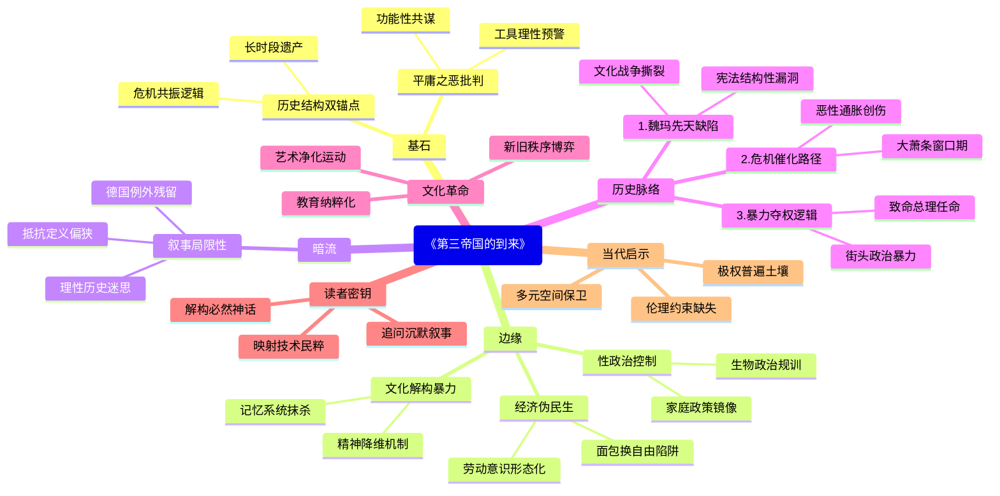

豆瓣链接：https://book.douban.com/subject/34928222/

# 深层解构

以下从“基石”“边缘”“暗流”三个维度，为你深度解码《第三帝国的到来》，揭示文本背后的思想脉络与潜在议题：

### **一、基石：作者构建认知的核心支点**
#### 1. **历史决定论与结构分析的双重锚点**
   - **核心逻辑**：作者拒绝将纳粹崛起归因于“德意志民族性”或“希特勒个人魅力”这类简化解释，转而以**长时段历史结构**（如一战创伤、《凡尔赛条约》的羞辱、魏玛体制缺陷）和**经济社会危机链**（恶性通胀、大萧条、阶级撕裂）为分析框架。其核心信念是：**极权主义的滋生是多重历史遗产与现实危机共振的结果**，而非单一变量的产物。
   - **论证重心**：通过魏玛共和国时期“文化战争”（传统精英与现代思潮的对抗）、“适者生存”社会达尔文主义的流行、纳粹党对底层民粹情绪的操纵等案例，证明**民主制度的崩塌往往始于社会共识的碎片化**，而经济灾难会加速极端主义的“合法性”建构。

#### 2. **对“平庸之恶”的隐性批判**
   - **核心叩问**：书中反复追问“反对者为何未能阻止纳粹”，答案并非简单归咎于“怯懦”或“愚昧”。作者通过公务员系统的纳粹化、司法体系对暴政的配合、普通民众对镇压的默许等细节，揭示**极权主义的成功依赖于整个社会的“功能性共谋”**——从知识分子到小商人，从官僚到家庭主妇，都在恐惧、利益计算或“从众亢奋”中成为体制的齿轮。
   - **警示逻辑**：作者认为，纳粹的恐怖统治并非“异类”，而是**现代性工具理性与民粹动员结合的产物**。这种对“系统性作恶”的剖析，实质是对所有现代社会的预警：当技术官僚体系与群众运动脱钩于伦理约束时，任何国家都可能滑向深渊。

### **二、边缘：被轻拂却重塑认知的思想微光**
#### 1. **性政治与极权控制的隐秘关联**
   - **文本细节**：书中提到纳粹通过《恢复专业公务员法》清洗“非雅利安”公务员，同时以“保护人民和国家”为名打击同性恋、妓女，将性法律改革运动污蔑为“堕落”。这些举措看似边缘，实则暴露**极权主义对“生物政治”的掌控欲**——通过规训身体、生殖权和家庭结构，塑造“纯粹民族共同体”的想象。
   - **延伸思考**：这种对“性道德”的暴力干预，与同时期苏联的“家庭政策”形成镜像。它暗示：**任何以“集体理想”名义对私人领域的入侵，都是极权化的前兆**。

#### 2. **“一体化”进程中的文化解构**
   - **文本表述**：作者用“社会被简化成大众，再重构为纳粹组织”描述“一体化”（Gleichschaltung），但未深入其文化破坏力。事实上，纳粹对艺术、教育、媒体的“净化”（如焚烧“非日耳曼”书籍、强制音乐家改宗雅利安血统），本质是**对多元文化记忆的系统性抹杀**，试图将德国人的精神世界降维为单一的“元首意志”。
   - **现实映射**：这种文化极权主义的遗产提醒我们：当某种“主流价值观”以暴力排斥异质思想时，文明的弹性便已消失。

#### 3. **经济政策的“伪民生”本质**
   - **文本矛盾**：作者肯定纳粹通过“农场援助”计划解决失业问题，却隐晦指出其本质是**强迫劳动与意识形态灌输的结合**（失业青年在田间接受纳粹思想洗脑）。这暴露了极权政权的惯用话术：用短期民生改善掩盖权力扩张的本质，使民众在“面包换自由”的交易中逐渐丧失批判能力。

### **三、暗流：论证中未被审视的前提假设**
#### 1. **对“理性历史”的过度信任**
   - **隐含假设**：作者认为通过详实史料可还原纳粹崛起的“客观进程”，并从中提炼普适性教训。但历史书写本身具有选择性——书中对魏玛时期左翼运动的内部分裂、工人阶级对纳粹的复杂态度着墨较少，可能无意中强化了“纳粹崛起不可避免”的决定论视角，低估了历史进程中的偶然变量（如1932年兴登堡若不任命希特勒为总理，结局是否不同？）。

#### 2. **“德国例外论”的微妙残留**
   - **潜在矛盾**：尽管作者强调纳粹崛起的“非独特性”，但其分析仍围绕德国特有的历史遗产（如“德意志独特性”神话、普鲁士军国主义传统）展开，对同期欧洲其他国家的极权主义萌芽（如意大利法西斯、西班牙长枪党）缺乏对比。这可能导致读者误以为“德国路径”具有特殊性，而忽视极权主义在现代社会的普遍土壤（如民粹主义、经济危机、媒体操控）。

#### 3. **对“抵抗”的单一化想象**
   - **论证盲区**：书中将反对者分为“主动抵抗者”（如刺杀希特勒的施陶芬贝格）和“被动屈服者”，但忽略了**灰色地带的生存智慧**——例如，部分知识分子通过翻译、学术研究保留异质思想，普通民众用谣言、讽刺诗消解纳粹意识形态。这些“日常抵抗”虽未直接颠覆政权，却证明极权控制从不是绝对的。作者对“抵抗”的定义过于严苛，可能弱化了人性在高压下的韧性。

### **四、给读者的三把钥匙：如何穿透文本，抵达更深层的思考？**
1. **追问“未被讲述的故事”**：  
   书中提到“纳粹瓦解了性法律改革运动”，可对比同时期德国女性主义者的命运，思考极权主义对进步社会运动的绞杀逻辑。  
2. **用“当代视角”反照历史**：  
   当书中描述纳粹通过媒体操控“万众一心的亢奋感”时，联想现代社会的信息茧房与民粹动员，思考技术时代极权主义的新形态。  
3. **警惕“历史必然性”的陷阱**：  
   纳粹崛起的“不可避免”叙事，可能让读者忽视个体选择的力量。试着假设：如果你是1930年代的德国公务员，面对《恢复专业公务员法》，会选择抵抗、妥协，还是投机？这种“代入式思考”能打破历史的疏离感，直视人性的复杂。

### **结语：真正的镜鉴，在于看见历史的“复数性”**
埃文斯的价值，在于用严谨的史料撕开了“纳粹神话”的面纱，但这本书的终极意义，是提醒我们：**历史不是供人背诵的因果链，而是一面棱镜，折射出人类社会的无数种可能**。当我们在书中看到经济危机如何催化仇恨、技术官僚如何沦为暴政工具、群体心理如何被操纵时，真正需要解码的，不是过去的“答案”，而是当下的“问题”——我们是否正在重复某些危险的逻辑？我们的社会，是否为“多元”预留了足够的生存空间？

阅读此书，不妨带着这样的追问：**在作者大声宣告的“警惕极权”之外，那些被他轻轻带过的“边缘人群”“偶然事件”“沉默多数”，或许藏着阻止历史重演的真正密码**。

# 章节内容
## 第三帝国的到来

### 第一章：历史遗产

**第一节：德意志的独特性**

理查德·J. 埃文斯在本书的开篇便明确指出，要理解纳粹主义的崛起，必须回溯到19世纪德国的历史根源，特别是俾斯麦时代。埃文斯的核心论点是，**纳粹主义的出现并非德国历史的必然结果，但德国独特的历史进程为纳粹的上台提供了土壤**。 他追溯了普鲁士在德意志统一过程中的主导地位，以及俾斯麦作为“铁血宰相”所留下的政治遗产。俾斯麦通过强权的“自上而下”的改革，统一了德意志，但同时也塑造了一个强调军事主义、威权主义，并对议会民主缺乏信任的政治文化。书中提到，俾斯麦的统治风格，以及他对天主教徒、社会主义者等“帝国敌人”的打压，为后来将某些群体视为“公敌”的政治操作埋下了伏笔。埃文斯认为，这种对强人政治的崇拜和对国家权力的绝对信赖，使得德国社会在面对未来的危机时，更容易倾向于选择一个独裁者来“恢复秩序”。

**第二节：宣扬仇恨**

本节重点阐述了19世纪末德国社会中日益增长的种族主义和反犹主义思想。埃文斯认为，**反犹主义在德意志第二帝国时期虽然在政治上处于边缘地位，但其思想根源已经深深植入社会文化之中**。 他详细描述了各种右翼极端民族主义团体和“泛德意志联盟”等组织的形成，这些组织宣扬德意志民族的优越性，并鼓吹种族纯洁。作者指出，这些思想的传播，与当时的社会达尔文主义思潮相结合，催生了一种“优胜劣汰”的残酷逻辑。书中通过赫尔曼·阿尔瓦特等人物的例子，说明了反犹主义如何被政治投机分子利用，以煽动民众情绪、获取政治资本。 埃文斯强调，这种将犹太人描绘成德国社会问题的根源的论调，为纳粹后来的种族迫害政策提供了思想基础。

**第三节：1914年的精神**

本节探讨了第一次世界大战对德国社会心态的深远影响。埃文斯指出，1914年战争爆发时，德国社会曾出现过一种短暂的“民族团结”的幻象，即所谓的“八月精神”。然而，他认为，**这种“精神”很快被战争的残酷现实所粉碎，但其所激发的极端民族主义情绪却长久地留存下来**。战争的经历，特别是对前线士兵而言，强化了他们对暴力、牺牲和绝对服从的认同感。埃文斯认为，这种在战壕中形成的“同志情谊”，以及对软弱的文官政府的鄙视，为后来冲锋队等准军事组织的出现提供了温床。

**第四节：陷入混乱**

本节聚焦于第一次世界大战的结束和魏玛共和国的诞生。埃文斯的核心观点是，**德国的战败，以及随之而来的《凡尔赛条约》，在德国民众心中种下了屈辱和仇恨的种子**。 他详细描述了战败后德国国内的混乱局面，包括此起彼伏的革命和反革命运动。作者特别提到了“背后一刀”的传说——即认为德国军队并未在战场上被击败，而是被国内的社会主义者、犹太人等“叛徒”出卖的阴谋论。埃文斯认为，这一传说极大地削弱了新生的魏玛共和国的合法性，并为右翼极端势力提供了攻击民主制度的有力武器。

### 第二章：民主之殇

**第一节：魏玛的弱点**

埃文斯在本节中深入剖析了魏玛共和国与生俱来的结构性缺陷。他认为，**魏玛共和国之所以最终走向失败，一个关键原因在于它从未获得德国社会各阶层的广泛认同和支持**。 共和国的政治精英，从社会民主党人到中右翼的政治家，虽然致力于建立一个民主国家，但他们始终面临着来自左右两翼极端势力的夹击。作者指出，魏玛宪法本身虽然在当时被誉为典范，但其比例代表制的选举制度导致了议会中政党林立，难以形成稳定的执政多数。 此外，司法、军队和文官系统等旧帝国的官僚机构，对民主制度普遍抱有敌意，这使得共和国的法令常常难以得到有效执行。

**第二节：大通胀**

本节聚焦于1923年的恶性通货膨胀对德国社会的毁灭性打击。埃文斯强调，**这场经济灾难不仅摧毁了德国中产阶级的储蓄，更严重动摇了他们对民主制度的信心**。 他生动地描绘了通胀期间普通德国人的生活困境：物价飞涨，货币贬值，社会秩序濒临崩溃。作者认为，这场危机加剧了社会的两极分化，使得越来越多的人开始寻求激进的解决方案。虽然魏玛政府最终通过货币改革稳住了局势，但通胀的创伤记忆深刻地烙印在德国人的心中，使得他们在日后面对大萧条时，更容易对政府产生不信任感。

**第三节：文化战争**

本节探讨了魏玛时期德国社会在文化领域的激烈冲突。埃文斯指出，魏玛时代是一个充满创造力和实验精神的时期，柏林成为了欧洲的文化中心之一。然而，**这种前卫、开放的文化也引发了传统保守势力的强烈反弹，他们将其视为道德沦丧和民族精神堕落的象征**。作者描述了当时在艺术、戏剧、电影等领域出现的各种新思潮和新风格，以及它们与传统价值观之间的尖锐对立。这场“文化战争”使得德国社会在身份认同上陷入了更深的分裂。

**第四节：适者与不适者**

本节主要探讨了优生学和种族卫生等思想在魏玛德国的兴起和传播。埃文斯认为，**这些打着“科学”旗号的理论，为后来纳粹的种族清洗和灭绝政策提供了理论依据**。他指出，当时许多科学家和医生都接受了社会达尔文主义的观点，认为应该通过各种手段来“净化”德意志民族，淘汰所谓的“不适者”，如残疾人、精神病患者等。这些思想在当时的德国社会具有相当大的吸引力，并逐渐渗透到公共卫生政策和社会福利体系之中。

### 第三章：纳粹主义的兴起

**第一节：波希米亚式革命者**

本节聚焦于纳粹运动早期的核心人物，特别是希特勒本人。埃文斯将早期的纳粹分子描绘成一群在社会上感到失意和被边缘化的“局外人”。他认为，**希特勒之所以能够吸引这群人，在于他为他们提供了一种归属感和虚假的使命感**。 希特勒本人作为一个在维也纳度过落魄青年时期的“艺术家”，他的思想深受当时流行的反犹主义和种族主义思潮的影响。作者详细描述了希特勒如何将个人的怨恨和野心，转化为一种具有煽动性的政治纲领。

**第二节：啤酒馆暴动**

本节详细叙述了1923年希特勒在慕尼黑发动的“啤酒馆暴动”。埃文斯认为，**这次失败的政变虽然在短期内使纳粹运动遭受重挫，但从长远来看，却成为了一个重要的转折点**。暴动的失败，以及希特勒在审判中的表现，使他从一个地方性的小人物，一跃成为全德国右翼极端势力瞩目的“英雄”。作者指出，希特勒在狱中口述的《我的奋斗》，系统地阐述了他的政治思想和野心，为纳粹党的重建和发展奠定了理论基础。

**第三节：卷土重来**

本节描述了纳粹党在1924年至1929年之间的重建和发展。埃文斯指出，**在魏玛共和国相对稳定的“黄金时期”，纳粹党一度陷入低谷，但他们利用这段时间调整策略，为日后的崛起做好了准备**。希特勒在出狱后，决定放弃暴力革命的方式，转而通过“合法”的选举途径来夺取政权。纳粹党开始在全国范围内建立组织，发展党员，并积极参与地方选举。

**第四节：使命感的来源**

本节深入探讨了纳粹意识形态的核心组成部分。埃文斯认为，**纳粹主义的吸引力，在于它成功地将各种不同的思想元素——民族主义、种族主义、反犹主义、反共主义、社会达尔文主义等——融合成一个看似连贯的整体**。 这种意识形态为德国民众提供了一个简单明了的世界观，将所有的问题都归咎于“敌人”（特别是犹太人），并许诺通过建立一个强大的“民族共同体”来解决一切问题。作者特别强调了纳粹宣传在塑造和传播这种“使命感”方面所起的关键作用。

### 第四章：通往权力之路

**第一节：大萧条**

埃文斯在本节中强调，**1929年爆发的全球经济危机，是纳粹党能够迅速崛起的最直接原因**。 大萧条对德国经济造成了毁灭性的打击，失业率飙升，社会矛盾急剧恶化。作者认为，这场危机彻底摧毁了德国民众对魏玛民主制度仅存的一点信心。在绝望和恐惧之中，越来越多的人开始将希望寄托于像纳粹党这样的极端政治力量。

**第二节：民主制度的危机**

本节描述了大萧条如何导致魏玛民主制度的彻底瘫痪。埃文斯指出，**面对经济危机，德国的主流政党束手无策，无法达成有效的共识**。 议会民主名存实亡，政府越来越依赖总统的紧急状态法令来维持统治。这种“总统内阁”的出现，为希特勒后来通过“合法”手段攫取独裁权力铺平了道路。

**第三节：暴力的胜利**

本节聚焦于魏玛末期德国街头政治暴力的急剧升级。埃文斯认为，**纳粹党之所以能够最终胜出，很大程度上得益于其下属的准军事组织——冲锋队——在街头斗争中所取得的“胜利”**。冲锋队通过暴力手段打压政治对手（特别是共产党人），制造混乱，并向民众展示纳粹党是唯一能够“恢复秩序”的力量。作者指出，当时的政府和司法系统对右翼暴力行为的纵容，也是导致局势失控的重要原因。

**第四节：致命的决策**

本节详细叙述了1933年初希特勒被任命为德国总理的经过。埃文斯的核心观点是，**希特勒的上台并非历史的必然，而是一系列错误的政治算计和决策的结果**。 当时的德国保守派精英，如总统兴登堡及其周围的顾问，错误地认为他们可以利用希特勒来达到自己的政治目的，并相信自己能够控制住他。作者认为，这个“致命的决策”，最终将德国和整个世界推向了灾难的深渊。

### 第五章：建立第三帝国

**第一节：恐怖开始了**

本节描述了希特勒上台后，纳粹党如何迅速地展开政治恐怖。埃文斯指出，**纳粹夺权后立即开始系统性地镇压所有政治反对派，其核心手段就是暴力和恐吓**。冲锋队和党卫队被赋予了“辅助警察”的身份，他们肆意逮捕、殴打甚至杀害共产党人、社会民主党人以及其他任何被视为“敌人”的人。作者强调，这种恐怖统治的目的，就是要制造一种普遍的恐惧氛围，从而彻底摧毁任何反抗的可能。

**第二节：国会纵火案**

本节聚焦于1933年2月的“国会纵火案”。埃文斯认为，**无论这起案件的真相如何，纳粹党都成功地利用了它，并将其作为废除公民基本权利、建立一党独裁的借口**。 纵火案发生后，希特勒立即说服兴登堡总统签署了《保护人民和国家法令》，该法令中止了魏玛宪法中关于人身自由、言论自由、集会自由等关键条款。这为纳粹进行大规模的政治迫害提供了“合法”依据。

**第三节：民主政体被摧毁**

本节详细叙述了纳粹党如何通过《授权法》彻底摧毁了德国的民主制度。埃文斯指出，**《授权法》的通过，标志着德国议会民主的正式终结**。该法案将立法权从议会手中转移到了希特勒政府手中，从而使希特勒获得了不受任何限制的独裁权力。作者描述了纳粹如何通过威逼利诱等手段，迫使议会中的非纳粹党派议员投票支持该法案。

**第四节：德国的一体化进程**

本节描述了纳粹党在夺取政权后，如何通过“一体化”（Gleichschaltung）政策，将德国社会的方方面面都纳入其控制之下。埃文斯认为，**“一体化”是一个自上而下和自下而上相结合的过程**。一方面，纳粹政权通过立法和行政命令，解散了工会、取缔了除纳粹党以外的所有政党，并控制了各级地方政府。另一方面，社会各界的许多组织和个人，也出于投机、恐惧或狂热，主动地向纳粹政权靠拢。

### 第六章：希特勒的文化革命

**第一节：不和谐音符**

本节描述了纳粹上台后对德国文化艺术领域的清洗。埃文斯指出，**纳粹的文化政策，其核心就是要消除所有与纳粹意识形态不符的“不和谐音符”**。许多在魏玛时期享有盛誉的艺术家、作家和音乐家，因为他们的犹太人身份，或者因为他们的作品被认为是“堕落的”，而遭到驱逐和迫害。

**第二节：艺术的净化**

本节详细描述了纳粹如何试图建立一种所谓的“德意志艺术”。埃文斯认为，**纳粹所推崇的艺术，是一种僵化、保守、服务于政治宣传的工具**。他们举办“堕落艺术展”，将现代派的艺术作品斥为垃圾，并推崇那些歌颂英雄主义、田园风光和种族纯洁的写实主义作品。作者指出，这种对艺术的“净化”，实际上是对文化创造力的扼杀。

**第三节：“打倒非日耳曼精神”**

本节聚焦于1933年5月的焚书事件。埃文斯认为，**焚烧那些被认为是“非德意志精神”的书籍，是纳粹文化革命的一个高潮，也是其野蛮本质的集中体现**。 这场由德国大学生和教授们积极参与的运动，象征着德国知识界的彻底沉沦。作者强调，焚书事件向全世界发出了一个明确的信号：在纳粹统治下的德国，思想自由已经死亡。

**第四节：一场“摧毁旧秩序的革命”？**

在本书的最后一节，埃文斯对纳粹夺权是否构成一场“革命”进行了探讨。他认为，**如果从社会结构的角度来看，纳粹的上台或许算不上一场彻底的革命，因为它在很大程度上保留了原有的社会和经济秩序。但如果从文化和精神层面来看，纳粹主义无疑是一场激进的“文化革命”**。 它彻底颠覆了启蒙运动以来的核心价值观——理性、人道和个人自由，并试图用一种基于种族、暴力和仇恨的野蛮意识形态取而代之。埃文斯在全书的结尾强调，理解第三帝国的到来，就是要理解一个现代、文明的社会，是如何一步步地走向了野蛮和毁灭的深渊。