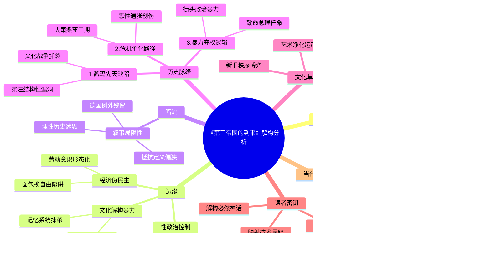

豆瓣链接：https://book.douban.com/subject/34928222/

# 深层解构

以下从“基石”“边缘”“暗流”三个维度，为你深度解码《第三帝国的到来》，揭示文本背后的思想脉络与潜在议题：

### **一、基石：作者构建认知的核心支点**
#### 1. **历史决定论与结构分析的双重锚点**
   - **核心逻辑**：作者拒绝将纳粹崛起归因于“德意志民族性”或“希特勒个人魅力”这类简化解释，转而以**长时段历史结构**（如一战创伤、《凡尔赛条约》的羞辱、魏玛体制缺陷）和**经济社会危机链**（恶性通胀、大萧条、阶级撕裂）为分析框架。其核心信念是：**极权主义的滋生是多重历史遗产与现实危机共振的结果**，而非单一变量的产物。
   - **论证重心**：通过魏玛共和国时期“文化战争”（传统精英与现代思潮的对抗）、“适者生存”社会达尔文主义的流行、纳粹党对底层民粹情绪的操纵等案例，证明**民主制度的崩塌往往始于社会共识的碎片化**，而经济灾难会加速极端主义的“合法性”建构。

#### 2. **对“平庸之恶”的隐性批判**
   - **核心叩问**：书中反复追问“反对者为何未能阻止纳粹”，答案并非简单归咎于“怯懦”或“愚昧”。作者通过公务员系统的纳粹化、司法体系对暴政的配合、普通民众对镇压的默许等细节，揭示**极权主义的成功依赖于整个社会的“功能性共谋”**——从知识分子到小商人，从官僚到家庭主妇，都在恐惧、利益计算或“从众亢奋”中成为体制的齿轮。
   - **警示逻辑**：作者认为，纳粹的恐怖统治并非“异类”，而是**现代性工具理性与民粹动员结合的产物**。这种对“系统性作恶”的剖析，实质是对所有现代社会的预警：当技术官僚体系与群众运动脱钩于伦理约束时，任何国家都可能滑向深渊。

### **二、边缘：被轻拂却重塑认知的思想微光**
#### 1. **性政治与极权控制的隐秘关联**
   - **文本细节**：书中提到纳粹通过《恢复专业公务员法》清洗“非雅利安”公务员，同时以“保护人民和国家”为名打击同性恋、妓女，将性法律改革运动污蔑为“堕落”。这些举措看似边缘，实则暴露**极权主义对“生物政治”的掌控欲**——通过规训身体、生殖权和家庭结构，塑造“纯粹民族共同体”的想象。
   - **延伸思考**：这种对“性道德”的暴力干预，与同时期苏联的“家庭政策”形成镜像。它暗示：**任何以“集体理想”名义对私人领域的入侵，都是极权化的前兆**。

#### 2. **“一体化”进程中的文化解构**
   - **文本表述**：作者用“社会被简化成大众，再重构为纳粹组织”描述“一体化”（Gleichschaltung），但未深入其文化破坏力。事实上，纳粹对艺术、教育、媒体的“净化”（如焚烧“非日耳曼”书籍、强制音乐家改宗雅利安血统），本质是**对多元文化记忆的系统性抹杀**，试图将德国人的精神世界降维为单一的“元首意志”。
   - **现实映射**：这种文化极权主义的遗产提醒我们：当某种“主流价值观”以暴力排斥异质思想时，文明的弹性便已消失。

#### 3. **经济政策的“伪民生”本质**
   - **文本矛盾**：作者肯定纳粹通过“农场援助”计划解决失业问题，却隐晦指出其本质是**强迫劳动与意识形态灌输的结合**（失业青年在田间接受纳粹思想洗脑）。这暴露了极权政权的惯用话术：用短期民生改善掩盖权力扩张的本质，使民众在“面包换自由”的交易中逐渐丧失批判能力。

### **三、暗流：论证中未被审视的前提假设**
#### 1. **对“理性历史”的过度信任**
   - **隐含假设**：作者认为通过详实史料可还原纳粹崛起的“客观进程”，并从中提炼普适性教训。但历史书写本身具有选择性——书中对魏玛时期左翼运动的内部分裂、工人阶级对纳粹的复杂态度着墨较少，可能无意中强化了“纳粹崛起不可避免”的决定论视角，低估了历史进程中的偶然变量（如1932年兴登堡若不任命希特勒为总理，结局是否不同？）。

#### 2. **“德国例外论”的微妙残留**
   - **潜在矛盾**：尽管作者强调纳粹崛起的“非独特性”，但其分析仍围绕德国特有的历史遗产（如“德意志独特性”神话、普鲁士军国主义传统）展开，对同期欧洲其他国家的极权主义萌芽（如意大利法西斯、西班牙长枪党）缺乏对比。这可能导致读者误以为“德国路径”具有特殊性，而忽视极权主义在现代社会的普遍土壤（如民粹主义、经济危机、媒体操控）。

#### 3. **对“抵抗”的单一化想象**
   - **论证盲区**：书中将反对者分为“主动抵抗者”（如刺杀希特勒的施陶芬贝格）和“被动屈服者”，但忽略了**灰色地带的生存智慧**——例如，部分知识分子通过翻译、学术研究保留异质思想，普通民众用谣言、讽刺诗消解纳粹意识形态。这些“日常抵抗”虽未直接颠覆政权，却证明极权控制从不是绝对的。作者对“抵抗”的定义过于严苛，可能弱化了人性在高压下的韧性。

### **四、给读者的三把钥匙：如何穿透文本，抵达更深层的思考？**
1. **追问“未被讲述的故事”**：  
   书中提到“纳粹瓦解了性法律改革运动”，可对比同时期德国女性主义者的命运，思考极权主义对进步社会运动的绞杀逻辑。  
2. **用“当代视角”反照历史**：  
   当书中描述纳粹通过媒体操控“万众一心的亢奋感”时，联想现代社会的信息茧房与民粹动员，思考技术时代极权主义的新形态。  
3. **警惕“历史必然性”的陷阱**：  
   纳粹崛起的“不可避免”叙事，可能让读者忽视个体选择的力量。试着假设：如果你是1930年代的德国公务员，面对《恢复专业公务员法》，会选择抵抗、妥协，还是投机？这种“代入式思考”能打破历史的疏离感，直视人性的复杂。

### **结语：真正的镜鉴，在于看见历史的“复数性”**
埃文斯的价值，在于用严谨的史料撕开了“纳粹神话”的面纱，但这本书的终极意义，是提醒我们：**历史不是供人背诵的因果链，而是一面棱镜，折射出人类社会的无数种可能**。当我们在书中看到经济危机如何催化仇恨、技术官僚如何沦为暴政工具、群体心理如何被操纵时，真正需要解码的，不是过去的“答案”，而是当下的“问题”——我们是否正在重复某些危险的逻辑？我们的社会，是否为“多元”预留了足够的生存空间？

阅读此书，不妨带着这样的追问：**在作者大声宣告的“警惕极权”之外，那些被他轻轻带过的“边缘人群”“偶然事件”“沉默多数”，或许藏着阻止历史重演的真正密码**。

# 章节内容
### 第一章：历史遗产
 - **德意志的独特性**：德国在一战前经济强大，反犹主义边缘。但长期政治分裂，各邦国独立性强，1871年统一后仍保留地方主义，民族主义发展独特，且历史上长期存在对权威服从等传统，这些因素影响德国走向。
 - **宣扬仇恨**：中世纪起基督教反犹主义存在，后经济、种族等因素使反犹主义在德国文化中有一定地位，虽战前不主导政治，但为纳粹反犹提供思想基础。
 - **1914年的精神**：一战爆发初期德国民众爱国热情高涨，各阶层支持战争，期望胜利，然而战争持久化带来经济破坏、社会矛盾，民众幻想破灭，引发政治动荡，德国最终战败。
 - **陷入混乱**：一战德国战败后，皇帝退位，建立魏玛共和国。但面临诸多问题，如《凡尔赛条约》带来的领土、军事、经济困境，民众对“背后一刀”说法的相信，政治上左右翼极端势力兴起，局势动荡不安。

### 第二章：民主之殇
 - **魏玛的弱点**：魏玛共和国宪法设计存在缺陷，比例代表制使政党众多、联合政府不稳定，总统权力过大。同时，政治文化方面，民众对民主共和缺乏深度认同，习惯威权统治，旧精英阶层敌视新政权，社会经济危机削弱民众对民主的信心。
 - **大通胀**：一战后德国经济受创，为支付赔款大量印钞引发恶性通货膨胀。后果严重，中产阶级储蓄化为乌有，社会贫富差距急剧扩大，民众对政府失去信任，社会矛盾尖锐，为极端政治势力崛起提供土壤。
 - **文化战争**：魏玛时期文化领域现代主义兴起，与传统价值观冲突。保守派视新文化为堕落，发起文化抵制。政治与文化交织，文化分歧演变为政治斗争，加剧社会分裂，不同群体间敌意加深，使社会氛围更紧张。
 - **适者与不适者**：社会达尔文主义影响下，魏玛时期对“适者”“不适者”定义引发争议。优生学受关注，“种族卫生”概念流行，残疾、精神病患者等被视为社会负担，绝育计划讨论增多，反映社会价值观扭曲，为纳粹种族政策埋下隐患。

### 第三章：纳粹主义的兴起
 - **波希米亚式革命者**：纳粹党早期由边缘群体构成，希特勒是核心人物。他一战经历、反犹思想等影响纳粹意识形态。纳粹党早期在慕尼黑活动，宣传极端思想，希特勒通过演讲、宣传吸引追随者，纳粹党逐渐发展，但此时在政治舞台上仍属边缘力量。
 - **啤酒馆暴动**：1923年，纳粹党趁德国政治经济危机发动啤酒馆暴动，企图夺权。失败后希特勒被捕，在狱中写下《我的奋斗》，进一步阐述其极端思想，包括种族主义、扩张主义等，虽暴动失败，但纳粹党获得一定知名度。
 - **卷土重来**：希特勒出狱后，纳粹党在20年代后期借经济困境、民众对魏玛共和国不满及有效宣传策略卷土重来。通过建立准军事组织、控制媒体、举办大规模集会等扩大影响，在地方选举中得票率上升，党员人数增多，成为重要政治力量。
 - **使命感的来源**：纳粹主义思想来源复杂，融合极端民族主义、种族主义、反犹主义、社会达尔文主义等。其种族主义理论核心是雅利安人优越，反犹主义极端，将犹太人视为敌人，这些思想为纳粹党行动提供依据，煽动民众情绪，凝聚支持者。

### 第四章：通往权力之路
 - **大萧条**：1929年经济危机重创德国，失业率飙升，工业生产大幅下降，金融体系崩溃。民众生活困苦，对魏玛共和国政府不满加剧，社会矛盾尖锐，为纳粹党崛起提供绝佳机会，民众渴望激进变革，纳粹党支持率大增。
 - **民主制度的危机**：经济危机下，魏玛共和国政府应对无力，总统兴登堡权力扩大，开始通过紧急法令统治。议会政治瘫痪，政党间无法有效合作，政府频繁更迭，民众对民主制度信心丧失，转而支持极端势力，德国民主制度面临严重危机。
 - **暴力的胜利**：纳粹党利用冲锋队等准军事组织，在街头与对手展开暴力冲突，扰乱社会秩序，制造恐慌。政府和其他政党对纳粹暴力行为态度软弱，未能有效制止，使纳粹党通过暴力手段打击对手，扩大影响力，破坏民主制度根基。
 - **致命的决策**：1933年，希特勒被兴登堡任命为总理，组成联合政府。纳粹党虽未在选举中获绝对多数，但通过政治手段控制政府关键职位。之后通过国会纵火案等事件，打压共产党等反对势力，为建立独裁统治奠定基础，德国走向纳粹独裁不可避免。

### 第五章：建立第三帝国
 - **恐怖开始了**：希特勒掌权后，立即建立秘密警察组织盖世太保，镇压政治反对派、异见人士、犹太人等群体。通过任意逮捕、监禁、酷刑等手段，在全国营造恐怖氛围，民众人人自危，不敢公开反对纳粹政权，纳粹恐怖统治开始。
 - **国会纵火案**：1933年国会大厦被烧，纳粹党嫁祸共产党，借机颁布《国会纵火法令》，暂停公民自由权利，大规模逮捕共产党员及其他政治对手，进一步巩固权力，打击反对势力，使纳粹党在政治上占据绝对优势。
 - **民主政体被摧毁**：纳粹党通过一系列手段，如取缔反对党、控制议会、修改宪法等，将德国转变为一党独裁国家。建立集中营关押政治犯，加强对社会各方面控制，魏玛共和国民主制度被彻底摧毁，德国进入纳粹独裁统治时期。
 - **德国的一体化进程**：纳粹党通过“一体化”政策，将德国社会各方面纳入纳粹控制体系。在政府机构中清除非纳粹人员，实现公务员纳粹化；控制各州政府，剥夺地方自治权；控制媒体、文化、教育等领域，向民众灌输纳粹思想，使德国社会全面纳粹化。

### 第六章：希特勒的文化革命
 - **不和谐音符**：纳粹掌权初期，文化领域存在不和谐因素。部分艺术家、作家等反对纳粹文化政策，试图坚守创作自由，但他们面临纳粹迫害，作品被禁，本人被监禁或流亡，不过他们的抵抗也显示出纳粹文化统治的非绝对性。
 - **艺术的净化**：纳粹推行文化革命，定义“堕落艺术”，包括现代主义艺术等，从博物馆、画廊清除此类作品，举办“堕落艺术”展览进行批判。同时推广符合纳粹意识形态的“健康”艺术，如表现种族纯洁、英雄主义等主题的作品，试图重塑德国文化。
 - **“打倒非日耳曼精神”**：纳粹在教育领域推行改革，清除所谓“非日耳曼”元素，强调种族教育，向学生灌输纳粹思想。在大学，驱逐犹太教授等“非日耳曼”学者，控制学术研究，使教育成为纳粹意识形态传播工具，培养顺从的新一代。
 - **一场“摧毁旧秩序的革命”？**：纳粹文化革命虽在一定程度上改变德国文化面貌，但也面临诸多问题。其文化政策存在矛盾，实际执行中遇到各种困难，如民众对现代文化仍有需求，文化界存在抵制暗流等。纳粹文化革命是其建立极权统治的重要部分，但未能完全实现其目标，德国文化在高压下仍保留部分复杂性。