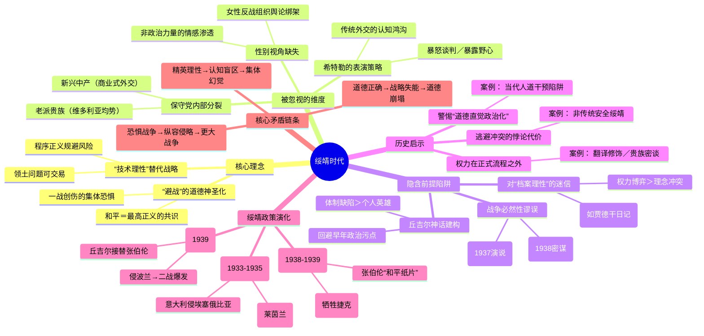

豆瓣链接：https://book.douban.com/subject/36769934/

# 深层解构

### 《绥靖时代》深层解码：当“避战”成为集体幻觉

#### 一、基石：被反复锚定的核心信念
**1. 和平主义的道德正确性**  
作者将“不要重蹈覆辙”的一战创伤作为绥靖政策的逻辑起点，强调整个欧洲对战争的集体恐惧如何转化为外交惰性。这种叙事反复强化一个信念：**避免战争本身就是最高道德**，甚至超越对侵略本质的判断。例如，书中描述张伯伦在慕尼黑会议后挥舞“和平协议”时，民众的欢呼被解读为“时代共识的胜利”，而非对现实威胁的误判。

**2. 精英决策的局限性**  
作者通过大量档案揭示，英国外交精英（如哈利法克斯、汉德逊）的决策常基于“技术官僚式理性”——用谈判技巧替代战略判断，将希特勒的扩张视为“可交易的领土问题”。这种思维的基石是：**外交是一门可以通过程序正义规避风险的技术，而非需要道德勇气的政治抉择**。典型案例是1938年对苏台德区的“理性权衡”，将地缘让步包装为“危机管理”。

#### 二、边缘：被轻掠而过的思想锐角
**1. 保守党的内战：绅士政治的崩塌**  
书中提到“贵族派与造反派”的冲突（如洛西恩勋爵与丘吉尔的对立），但未深入挖掘保守党内部的代际裂痕：老派贵族仍信奉“欧洲均势”传统，而张伯伦代表的新兴中产阶级精英试图用“商业式外交”维持和平。这种分裂本质上是**维多利亚价值观与现代政治现实的碰撞**，最终导致绥靖政策成为党内妥协的产物，而非战略共识。

**2. 女性视角的缺席：和平运动的另一面**  
作者聚焦男性政治家，却忽略了英国反战运动中女性的关键作用（如国际妇女争取和平与自由联盟）。这些组织通过舆论造势将“避战”神圣化，间接绑架了政府决策。这暗示：**看似理性的外交政策，可能被非政治力量的情感动员所左右**，而性别视角的缺失让我们低估了和平主义的社会渗透力。

**3. 希特勒的“表演性外交”**  
书中多次提到希特勒在谈判中的“戏剧化策略”（如在贝希特斯加登的暴怒表演），但未将其视为一种**政治传播手段**。纳粹利用媒体塑造“弱势谈判者”形象（如《我的奋斗》刻意暴露“扩张野心”作为谈判烟雾弹），而英国精英误将表演当成本质，折射出**传统外交对现代极权主义话术的认知鸿沟**。

#### 三、暗流：未被审视的论证前提
**1. 必然性假设的陷阱：“通往战争的唯一道路”**  
作者将绥靖政策的失败归因于“时代局限性”，隐含假设：在1930年代的国际格局下，战争不可避免。但这一前提忽略了两个变量：  
- **德国国内抵抗力量**：1938年卡纳里斯等人的反希特勒密谋，若英国给予实质支持，可能改变进程；  
- **美国孤立主义的松动**：1937年罗斯福“检疫隔离”演说已释放干预信号，英国若更早联美，或可形成威慑。  
这种“事后合理化”叙事，可能淡化了关键人物（如张伯伦）的主观选择责任。

**2. 对“理性决策”的迷信**  
书中频繁使用“愿望思维外交”批判绥靖派，但自身仍陷入**“档案理性主义”陷阱**——依赖官方文件和精英言论，默认这些记录能完整反映历史动机。事实上，许多外交官的私人日记（如贾德干）显示，他们明知希特勒不可信，却因仕途考量选择沉默。这揭示：**历史书写常高估“理念冲突”，低估“权力博弈”对政策的塑造**。

**3. 丘吉尔神话的背面**  
作者将丘吉尔塑造为“清醒的少数派”，却回避其早年政治污点（如对印度独立的强硬立场）。这种对比叙事暗含**“英雄史观”的隐形预设**：历史由少数伟人的选择推动，而忽略体制性缺陷（如英国情报机构对纳粹军工的误判、殖民地资源的牵制）才是绥靖政策的真正土壤。

#### 四、给读者的三把钥匙
**1. 当“正确”成为错误：警惕道德直觉的政治化**  
绥靖政策的悲剧在于，“避免战争”的道德正确掩盖了战略愚蠢。今日启示：**任何政治选择若只诉诸情感共识，而缺乏对现实力量的清醒评估，终将走向反面**。如当代某些“人道主义干预”，是否重蹈了“用善良动机制造灾难”的覆辙？

**2. 档案的盲点：历史是“被记录的权力”**  
书中大量引用内阁会议记录，但这些文件多经事后修饰。真正的历史暗线可能藏在“未被记录的瞬间”——比如张伯伦与希特勒会面时，翻译官对语气的微妙处理，或贵族社交圈里的非正式情报传递。这提示：**权力的真相往往存在于正式流程之外**。

**3. 绥靖的幽灵：恐惧如何制造新恐惧**  
英国因恐惧一战重演而纵容侵略，最终引发更大战争。这种“以妥协求安全”的悖论，在当代国际关系中依然上演（如对某些非传统安全威胁的绥靖）。作者未明说的真相是：**逃避冲突的代价，可能比直面冲突更昂贵**，而勇气本身就是一种战略资源。

#### 结语：在后视镜里照见未来
《绥靖时代》的真正价值，不在于重复“绥靖误国”的旧结论，而在于揭示：**每个时代都有自己的“希特勒”，每个群体都有自己的“张伯伦”**。当我们用“愚蠢”“短视”批判历史人物时，不妨自问：在信息过载、共识脆弱的今天，我们是否也在以“理性”之名，重复着对现实威胁的逃避？毕竟，所有历史的后视镜，最终照见的都是当下的选择。

# 章节内容
### 《绥靖时代——希特勒、张伯伦、丘吉尔与通往战争之路》内容总结

#### **前言 “不要重蹈覆辙!”**
作者蒂姆·布弗里在开篇即定下全书的基调：**一战的惨痛记忆是理解1930年代英国绥靖政策的核心。** “不要重蹈覆辙”这句口号深植于英国乃至整个欧洲的国民心中，战争带来的巨大创伤——超过七十万英国士兵阵亡，几乎每个家庭都蒙受损失——使得避免再次发生大规模冲突成为压倒一切的普遍愿望。 布弗里指出，这种对战争的恐惧和厌恶，并非懦弱，而是一种可以被理解的、人道的普遍情绪。它深刻影响了英国的政治家和社会舆论，为张伯伦后来所推行的绥靖政策铺平了道路。 作者认为，若不理解这种深切的和平渴望，就无法公正地评判那个时代的决策者。同时，布弗里也明确指出，本书的目的在于探究，这种原本意在维护和平的真诚愿望，是如何一步步地、具有悲剧性地，将英国和世界引向了另一场更具毁灭性的战争。 他强调，这段历史并非简单的伟人与罪人的故事，而是由众多人物的作为与不作为、决策与误判共同塑造的复杂过程。

#### **序幕 暴风雨来袭**
本章节描绘了1933年1月30日希特勒被任命为德国总理时的欧洲图景，标志着一场政治风暴的来临。布弗里将此事件定位为整个绥靖时代的开端，一个决定欧洲未来命运的关键节点。 作者通过生动的叙事，展现了当时英国政界的反应。许多人对希特勒及其纳粹党的真实面目缺乏清醒的认识，甚至抱有幻想。他们倾向于认为，希特勒的上台或许只是德国国内政治的暂时现象，其激进的言论更多是为了迎合国内民众的“政治作秀”。 布弗里在此章中确立了他叙事的一个核心论点：**英国决策层从一开始就存在着对纳粹政权本质的“灾难性误解”。** 他描绘了一种普遍的“英国式天真”，即相信通过传统的、理性的外交手段可以约束和引导希特勒。 同时，丘吉尔作为少数的“反叛者”，从早期就发出了警告，但他被主流政坛视为好战分子而被边缘化。 这一序幕为全书的悲剧性叙事奠定了基础，揭示了英国在应对纳粹威胁之初的犹豫不决、信息误判和内部分歧，这些都为日后绥靖政策的形成埋下了伏笔。

#### **第一章 希特勒的实践**
本章聚焦于希特勒上台初期的内外政策，以及英国对其初步行动的反应。布弗里详细描述了希特勒如何迅速巩固权力，解散其他政党，建立独裁统治，并开始重整军备，这些行动公然违背了《凡尔赛条约》。 作者的核心论点是，**希特勒从一开始就清晰地展示了他的侵略意图和颠覆国际秩序的决心，但英国方面却未能给予应有的重视。** 英国政府的反应是矛盾和犹豫的。一方面，他们对德国的重整军备感到不安；另一方面，许多英国政治精英认为《凡尔赛条约》对德国过于苛刻，因此希特勒的某些要求具有一定的“合理性”。 这种矛盾心态导致了英国对希特勒早期违约行为的容忍。布弗里引用了大量当时的外交文件和个人日记，生动地再现了英国外交官和政治家们的讨论，他们普遍希望通过谈判和安抚来避免冲突。 作者认为，这一阶段是绥靖政策的萌芽期，英国错失了在纳粹尚不稳固时进行遏制的最佳时机。**未能洞察希特勒政权的真实性质，是英国政策制定者在此期间犯下的“最根本的失败”。**

#### **第二章 “我歌颂武器和那个男人”**
本章深入探讨了1930年代中期，英国社会特别是上层阶级中存在的亲德、甚至崇拜希特勒的情绪。 标题引自一首赞美诗，形象地概括了当时部分英国精英对纳粹德国及其元首的迷恋。布弗里通过对大量书信、日记和回忆录的分析，揭示了一个令人不安的现象：许多英国贵族、商人和政客被纳粹德国所展现的“秩序”、“活力”和反共立场深深吸引。 他们前往德国旅行，参加纽伦堡党代会，与希特勒等纳粹高层会面，并带回了极其正面的印象。 布弗里认为，**这种来自英国精英阶层的同情和支持，不仅向希特勒传递了错误的信号，也严重削弱了英国国内对纳粹采取强硬立场的政治意愿。** 他详细描述了如洛锡安侯爵、伦敦德里侯爵等人作为“业余外交官”的活动，他们真心相信自己能够通过私人关系增进英德理解，从而维护和平。 但作者尖锐地指出，这些人往往被纳粹的宣传所蒙蔽，**他们的善意和天真成为了被希特勒巧妙利用的工具**，加深了英国政府对希特勒可以通过“讲道理”来约束的幻想。

#### **第三章 与希特勒饮茶**
本章详细叙述了英国政要与希特勒之间一系列重要的早期会面，旨在探讨双方在外交舞台上的初步交锋与误判。布弗里着重描绘了英国外交大臣哈利法克斯等人与希特勒的会谈场景。作者的核心观点是，**这些会面非但没有让英国决策者看清希特勒的真实意图，反而加深了他们可以与之达成“君子协定”的错觉。** 希特勒在这些会谈中展现出高超的表演技巧，他时而咆哮，时而温文尔雅，声称自己是和平的爱好者，其目标仅限于收回德国的合法权利。 布弗里指出，英国的政治家们习惯于传统的欧洲外交模式，他们用自己的思维方式去揣度希特勒，认为他的侵略性言论背后是可以通过谈判解决的实际诉求。他们未能理解，希特勒的最终目标并非修正《凡尔赛条约》，而是要彻底摧毁它并主宰欧洲。 本章通过对会谈细节的重构，生动地展现了两种完全不同政治逻辑的碰撞。**英国人的理性、克制和对妥协的重视，在希特勒充满意识形态狂热和无限野心的“世界观”面前显得苍白无力。** 这是一场注定会失败的对话。

#### **第四章 阿比西尼亚乱局**
本章将视线转向意大利入侵阿比西尼亚（今埃塞俄比亚）的事件，分析了这场危机如何暴露了国际联盟的软弱，并进一步助长了独裁者的野心。布弗里认为，**英国和法国在阿比西尼亚危机中的绥靖政策，是针对希特勒绥靖的前奏和“实战演练”。** 面对墨索里尼的公然侵略，英法两国虽然口头上予以谴责，并推动国联实施了一些不痛不痒的经济制裁，但并未采取真正有效的措施，如石油禁运，来阻止意大利。这背后的核心考量是，他们希望拉拢墨索里尼以共同对抗日益强大的德国，不愿因此事将其彻底推向希特勒的怀抱。 然而，作者明确指出，这种策略是灾难性的。它不仅未能阻止意大利，反而向希特勒清晰地表明：**侵略行为不会遭到实质性的抵抗，国际秩序的维护者缺乏采取行动的决心。** 这次事件严重打击了集体安全的理念，也让希特勒看穿了英法的虚弱。他意识到，只要时机和借口得当，他同样可以放手行动。阿比西尼亚的乱局，最终不仅没有分化德意，反而促成了“罗马-柏林轴心”的形成。

#### **第五章 越过莱茵河**
本章节聚焦于1936年3月希特勒命令德军进入莱茵非军事区的重大事件。布弗里将此举描述为希特勒“最大的一次赌博”，也是绥靖政策发展过程中的一个关键转折点。 作者的核心论点是，**这是制止希特勒的最后一次黄金机会，但英法的无所作为彻底摧毁了《洛迦诺公约》的根基，并极大地增强了希特勒的个人威望和政治地位。** 当时，德国的军事实力尚不强大，如果法国出兵干预，德军将被迫撤退，希特勒的政权甚至可能因此垮台。然而，法国政府在没有英国明确支持的情况下不敢单独行动。而英国方面，从政府到民众普遍存在一种情绪，即“德国人只是回到了自己的后花园”，认为这并不值得冒一场战争的风险。 布弗里严厉批评了这种短视，他认为英国未能认识到此举的战略意义：它不仅违反了条约，更彻底改变了欧洲的军事平衡，使得法国失去了协防东欧盟友的地理屏障。希特勒兵行险着却大获全胜，这让他更加确信自己的判断力超乎常人，而西方民主国家则是可以被轻易恫吓的“小蠕虫”。

#### **第六章 王国的防御**
本章探讨了在德国重整军备和侵略性日益显露的背景下，英国国内关于国防和重整军备的激烈辩论。 布弗里指出，尽管丘吉尔等少数派大声疾呼，要求加速重整军备以应对德国威胁，但英国政府的行动却异常迟缓。 作者深入分析了其中的复杂原因。首先是财政上的巨大压力，作为财政大臣的张伯伦坚信，**庞大的军备开支会摧毁英国的经济，而经济的崩溃本身就是一种战败。** 他倾向于将有限的资源投入到他认为更具威慑力的空军上，而非庞大的陆军。其次，国内和平主义情绪依然高涨，任何大规模的军备扩张都会面临巨大的政治阻力。 此外，政府内部也存在战略分歧：究竟是应该准备一支能够再次干预欧洲大陆的远征军，还是应专注于帝国防御？布弗里认为，**张伯伦和当时的主流观点，是将“威慑”与“外交”视为替代而非互补的工具。** 他们相信通过外交谈判可以避免战争，因此不愿也认为没有必要进行一场全面的、代价高昂的军备竞赛。这种对财政的担忧和对外交手段的过度自信，导致英国的备战严重滞后，从而在后来的危机中失去了强有力的后盾。

#### **第七章 希特勒的仙境**
本章描绘了1936年柏林奥运会前后，纳粹德国通过精心策划的宣传，向世界呈现出的一个繁荣、有序、爱好和平的假象，作者将之讽刺地称为“希特勒的仙境”。 布弗里详细记述了大量前往德国的英国访客，包括政客、贵族、运动员和普通游客，如何被奥运会的盛大场面和德国民众的热情所迷惑。 作者认为，**纳粹成功地利用奥运会作为一场公关胜利，暂时掩盖了其政权在国内的残暴统治和在国外的军事野心。** 许多英国人回国后，成为了纳粹德国的义务宣传员，他们声称在德国没有看到任何压迫的迹象，反而赞扬其高效的社会组织和民众的精神面貌。这种看法进一步加深了英国社会对纳粹的误解和幻想。布弗里强调，这种“眼见为实”的肤浅观察，完全忽略了隐藏在表面之下的恐怖本质，例如对犹太人的迫害和集中营的存在。**这种普遍的、天真的乐观情绪，为绥靖政策提供了广泛的社会土壤**，使得丘吉尔等人的警告显得更加刺耳和不合时宜。本章深刻揭示了极权主义宣传的欺骗性，以及西方民主社会在面对这种精心构建的“仙境”时的脆弱性。

#### **第八章 张伯伦登场**
1937年5月，内维尔·张伯伦接替斯坦利·鲍德温成为英国首相，本章聚焦于他的上台以及他为英国外交政策带来的新变化。布弗里对张伯伦的刻画是复杂而深刻的。他并非一个愚蠢或懦弱的人，相反，他精力充沛、意志坚定，并且怀有通过个人努力缔造和平的真诚信念。 作者的关键论点在于，**张伯伦的悲剧源于他的“知识分子的自负”，他极度相信自己的判断力和说服能力，并由此推行了一种高度个人化的、“福音派式的”绥靖外交。** 张伯伦认为前任政府在对德政策上过于被动和消极，他决心采取主动，亲自与独裁者们谈判，解决欧洲的争端。 他对外交部和专业外交官充满不信任，更倾向于通过非官方渠道和密使来推行自己的政策。 布弗里通过分析张伯伦的私人信件，特别是写给他姐妹的信，揭示了他内心的想法：他视自己为唯一能够拯救欧洲于战火的英雄，并将丘吉尔等反对者视为和平的破坏者。这种强烈的使命感和刚愎自用的性格，使他**“将自己的心智禁锢在自己的错觉中”**，听不进任何与他观点相悖的意见，并最终将英国带上了一条无法回头的绥"

#### **第九章 猎取和平**
本章详细描述了张伯伦上任后，为实现其与德、意和解的宏大计划所展开的一系列外交行动，作者将其形容为一场充满幻想的“猎取和平”之旅。布弗里集中分析了张伯伦绕过外交部，试图与墨索里尼达成协议，并向希特勒释放善意的努力。 这一时期的关键事件是哈利法克斯勋爵访问德国，并与希特勒会面。作者指出，**张伯伦及其核心圈子（被布弗里称为“绥靖福音派”）坚信，只要满足德国在奥地利、捷克斯洛伐克和但泽等地的“合理”诉求，就能换取希特勒在欧洲其他地方的安分。** 这是一种致命的误判。他们将希特勒的野心理解为传统的、有限的领土要求，而没有看到其背后旨在颠覆整个欧洲秩序的种族主义意识形态和无限扩张的欲望。 布弗里在这一章中，将张伯LEN的主动外交描绘为一种充满一厢情愿的“愿望思维”。他详细叙述了张伯伦如何无视外交部的警告，以及来自德国国内反对派的消息，这些消息都明确指出希特勒是不可信任的。**张伯伦对于和平的渴望，演变成了一种不顾事实的固执**，他一心追猎那个名为“和平”的幻影，却忽视了脚下通往战争的陷阱。

#### **第十章 “圆顶礼帽回来了！”**
本章的标题具有象征意义，“圆顶礼帽”代表着以张伯伦为首的、致力于通过谈判解决争端的英国传统政治家。 本章主要探讨了1938年初，英国政坛内部因对意、德政策的分歧而引发的重大裂痕，其高潮是外交大臣安东尼·艾登的辞职。布弗里认为，**艾登的离去，标志着绥靖政策在英国政府内部的最后一道重要障碍被清除。** 艾登虽然也支持与独裁者对话，但他坚持谈判必须基于实力和相互尊重，反对在没有得到对方任何实质性让步的情况下单方面示好。他对于张伯伦绕过他与墨索里尼进行秘密接触的做法尤其不满，认为这损害了英国的信誉，只会让独裁者觉得英国软弱可欺。张伯伦则认为艾登过于僵化，阻碍了他灵活主动的和平计划。两人的冲突最终以艾登的辞职告终，哈利法克斯勋爵接任外交大臣，他完全是张伯伦政策的忠实执行者。作者强调，**这一事件之后，张伯伦的绥靖外交几乎不再受到任何有力的内部制约**，他的个人意志得以更彻底地贯彻。丘吉尔等反对派的声音虽然依旧存在，但在议会中仍是少数。一个由首相主导的、几乎不受挑战的绥靖时代正式开启。

#### **第十一章 抢夺奥地利**
本章聚焦于1938年3月，希特勒悍然吞并奥地利的“德奥合并”（Anschluss）事件。布弗里将此事件视为对张伯伦绥靖政策的第一次沉重打击，也是对其幻想的一次无情戳穿。 尽管英国政府早就预料到德奥合并的可能性，但事件的发生方式——赤裸裸的武力威胁和军事入侵——仍然让伦敦感到震惊。作者的核心观点是，**英国的无所作为，不仅仅是因为军事上无力干预，更深层次的原因在于其政策的根本性缺陷：即相信希特勒会遵守某种外交规则。** 面对希特勒的野蛮行径，张伯伦在议会的演讲中虽然表示了谴责，但核心信息却是英国不会为此采取行动。他的逻辑是，既然无法阻止，不如接受现实，继续寻求与德国的全面和解。 布弗里尖锐地指出，这种反应在希特勒看来，无异于默许和纵容。**每一次成功的侵略，都让德国的战略地位得到加强，而英法的威信则受到进一步削弱。** 奥地利的陷落，使得捷克斯洛伐克直接暴露在德国的军事威胁之下，为其后来的危机埋下了伏笔。作者认为，尽管民意调查显示英国公众在此事件后开始转向强硬，但张伯伦政府却未能抓住这一时机调整政策，反而更加坚定地走向了绥靖的道路。

#### **第十二章 柏林的最后一趟火车**
本章描绘了德奥合并后，欧洲日益紧张的氛围，以及德国国内少数反对希特勒的势力试图向英国传递警告的绝望努力。 “柏林的最后一趟火车”象征着和平的最后机会正在迅速消失。布弗里详细叙述了德国军方和外交部的一些反纳粹人士，如卡尔·戈德勒和冯·克莱斯特，如何冒着生命危险，通过秘密渠道向伦敦传递情报，警告希特勒即将对捷克斯洛伐克动手，并恳求英国采取强硬立场，以便他们能够发动政变推翻希特勒。 然而，作者痛心地指出，**张伯伦及其核心圈子对这些来自德国抵抗运动的警告持怀疑甚至完全不信任的态度。** 他们认为这可能是德国情报部门的诡计，或者即便这些人是真诚的，他们也高估了自己的能力。张伯LEN更相信自己与希特勒的直接沟通，而非这些“阴谋家”的言辞。布弗里认为，**这是绥靖政策中最具争议和悲剧性的方面之一：拒绝与希特勒的内部敌人合作。** 这种拒绝，部分源于对德国人根深蒂固的不信任，但更主要的是张伯伦的固执，他不愿意相信自己一心想要与之谈判的对象，是一个在国内也面临着颠覆威胁的恶棍。这种误判，最终导致了和平的希望被彻底断送。

#### **第十三章 贵族派与造反派**
本章深入剖析了1938年夏天，围绕捷克斯洛伐克危机，英国政坛内部的分裂与斗争。 “贵族派”指的是以张伯伦、哈利法克斯为核心，以及支持他们的众多保守党议员和上层社会人士，他们坚定地推行绥靖政策。 “造反派”则是以丘吉尔为首，包括安东尼·艾登、达夫·库珀等少数敢于公开挑战政府政策的议员。 布弗里生动地再现了议会、私人俱乐部和乡村别墅中的激烈辩论。他指出，**这场斗争不仅是外交政策的路线之争，更是对国家荣誉、道德责任和未来命运两种截然不同看法的对决。** 贵族派认为，为了一个“遥远的国度”和“我们一无所知的人民”（张伯伦语）而冒战争风险是愚蠢的，他们真心相信通过割让苏台德地区可以满足希特勒最后的领土要求，从而换取“我们时代的和平”。 而造反派则坚信，**这不是简单的领土纠纷，而是一个关乎国际法则和道德底线的原则问题。他们认为，对希特勒的任何让步都只会助长其更大的野心，** 今天的退让将导致明天更大规模的战争。 布弗里通过引用大量第一手资料，展现了丘吉尔等人在当时所处的孤立和艰难的境地，他们的警告被视为危言耸听，而支持绥靖的论调则占据了舆论的主流。

#### **第十四章 一个遥远的国度**
本章的标题取自张伯伦在1938年9月27日广播讲话中的一句名言，他称捷克斯洛伐克争端是“一个遥远的国度里，我们一无所知的人民之间的争吵”。 这句话集中体现了绥靖政策的核心逻辑和道德困境，布弗里对此进行了深刻的剖析。作者认为，**这句话并非仅仅是地理上的描述，更反映了英国决策者在心理上和战略上对中欧事务的隔阂与漠视。** 张伯伦和他的支持者们认为，英国的根本利益在于帝国和海洋，而不是中欧的陆地边界。他们无法也不愿理解捷克斯洛伐克作为一个民主国家对于欧洲力量平衡的战略重要性。 布弗里详细描述了张伯伦政府如何一步步地向捷克政府施压，迫使其接受希特勒的要求。他认为，这种做法不仅背叛了一个盟友，更在道义上让英国蒙羞。**将一个主权国家的命运拱手让给侵略者，仅仅是为了换取自身短暂的安宁，这暴露了绥靖政策在道德上的破产。** 作者还指出，张伯伦的这番话虽然在短期内赢得了许多渴望和平的英国民众的共鸣，但也激起了丘吉尔等人的强烈愤慨，他们认为这是对英国国际责任的无耻背弃。这一章，布弗里将焦点对准了绥靖政策的道德层面，批判其自私和短视的本质。

#### **第十五章 危机爆发**
本章详细记录了1938年9月慕尼黑危机全面爆发的过程，从希特勒在纽伦堡党代会上发出战争叫嚣，到张伯伦决定亲自飞往德国与希特勒会面的戏剧性时刻。布弗里以其新闻记者般的敏锐笔触，生动地再现了那段令人窒息的紧张日子。 他描述了欧洲如何一步步滑向战争边缘：德国陈兵边境，捷克斯洛伐克进行总动员，英法两国陷入了恐慌和犹豫。 作者的核心论点是，**面对希特勒赤裸裸的战争讹诈，张伯伦选择的不是联合法国和苏联进行威慑，而是将自己定位为唯一的和平使者，孤注一掷地进行个人外交。** 他三次飞往德国——贝尔希特斯加登、戈德斯贝格和慕尼黑——试图满足希特勒不断加码的要求。 布弗里认为，张伯伦的这种做法，虽然在当时被许多人誉为勇敢之举，但实际上正中希特勒下怀。**它将一场关乎国际法则和欧洲安全的集体危机，变成了一场由英国首相恳求德国元首施舍和平的个人表演。** 这不仅削弱了英法的联盟地位，也让希特勒得以完全掌控了危机的节奏和走向。张伯伦每退一步，希特勒就前进一步，危机的主动权完全落入了独裁者手中。

#### **第十六章 濒临边缘**
本章聚焦于戈德斯贝格会谈的破裂与慕尼黑会议召开前夕，欧洲濒临战争的最后时刻。在戈德斯贝格，希特勒在前次会谈的基础上提出了更加苛刻的要求，几乎等同于最后通牒，这让张伯伦也感到震惊和羞辱。 一时间，战争似乎已不可避免。布弗里细致地描述了当时英国国内的景象：政府分发防毒面具，民众挖掘防空洞，伦敦的公园里出现了高射炮阵地。 然而，作者的关键论点是，**即使在战争看似一触即发的时刻，张伯伦和哈利法克斯等绥靖派的核心信念依然没有动摇：他们最恐惧的不是希特勒，而是战争本身。** 他们无法接受为了捷克斯洛伐克而让英国卷入一场血腥冲突。因此，当墨索里尼出面提议召开四方会议时，张伯伦毫不犹豫地抓住了这根“救命稻草”。布弗里认为，**这一刻充分暴露了绥靖派的底线——即不惜一切代价避免战争，哪怕是以牺牲他国主权和自身长远战略利益为代价。** 丘吉尔等人虽然仍在疾呼抵抗，但他们的声音被淹没在对和平的狂热祈求之中。最终，避免战争的愿望压倒了对正义和安全的考量，通往慕尼黑的道路被打通了。

#### **第十七章 一张纸**
本章的标题，指的是张伯伦从慕尼黑带回的那份由他和希特勒共同签署的、声称“保证两国永不交战”的联合声明。 本章详细叙述了慕尼黑会议的屈辱过程及其直接后果。在会议上，英法两国完全接受了希特勒的条件，将捷克斯洛伐克的苏台德地区割让给德国，而捷克代表甚至不被允许参与讨论，只能在门外等候判决。 布弗里严厉地批判了这场交易，他认为，**慕尼黑协定是绥靖政策的顶峰，也是其在道德和战略上最彻底的失败。** 它不仅摧毁了捷克斯洛伐克这个中欧唯一的民主堡垒，更向斯大林传递了一个明确的信息：西方国家愿意牺牲任何小国来换取自身安全，并且会试图将德国的侵略矛头引向东方。这为日后苏德互不侵犯条约的签订埋下了伏笔。作者着重描绘了张伯伦回到伦敦后，手持那“一张纸”向欢呼的人群宣布他带来了“我们时代的和平”时的场景。 **这种虚假的胜利感和短暂的宽慰，与丘吉尔“我们蒙受了奇耻大辱，但这并不能换来和平”的悲观预言形成了鲜明对比。** 布弗里认为，这张纸所代表的，不是和平的保障，而是一厢情愿的自我欺骗。

#### **第十八章 我们时代的和平**
本章深入分析了慕尼黑协定签署后，英国国内和社会各界的复杂反应，以及“我们时代的和平”这一口号背后的虚幻与脆弱。 张伯伦从慕尼黑归来时，受到了英雄般的欢迎，绝大多数英国民众因为战争得以避免而欣喜若狂。 布弗里指出，**这种短暂的集体性狂欢，掩盖了深刻的道德不安和对未来的忧虑。** 随着最初的兴奋退去，越来越多的英国人开始感到羞耻和怀疑。他们意识到，这份和平是以牺牲一个小国的自由为代价换来的，而且希特勒的承诺也并不可靠。作者引用了大量的日记和报刊评论，展示了公众情绪从狂热到冷静，再到幻灭的转变过程。他认为，**慕尼黑协定并没有真正解决任何问题，它只是将战争推迟了，并且是在对侵略者更有利的条件下推迟了。** 德国不仅获得了苏台德地区的工业和防御工事，更在心理上完全占据了上风。希特勒私下里嘲笑张伯伦等西方政治家是“可以被轻易打发掉的小人物”。本章通过对“我们时代的和平”这一口号的解构，深刻揭示了绥靖政策的虚伪性和自欺性。

#### **第十九章 遭到背弃的张伯LEN**
本章的标题一语双关，既指捷克斯洛伐克被张伯伦所背弃，也预示着张伯伦本人很快也将被他所信任的希特勒所背弃。本章的核心事件是1939年3月，希特勒撕毁慕尼黑协定，悍然出兵吞并了捷克斯洛伐克的剩余部分——波希米亚和摩拉维亚。 布弗里认为，**这是对张伯伦个人和整个绥靖政策的致命一击，它无可辩驳地证明了希特勒的野心是无限的，其承诺是毫无价值的。** 张伯伦感到自己遭到了个人的羞辱和政治上的背叛，他的整个对德政策的基础瞬间崩塌。在公众和议会的巨大压力下，他被迫发表了措辞强硬的讲话，谴责希特勒的背信弃义。作者强调，**这一事件是英国对德政策的根本性转折点。** 从此，绥靖政策在名义上已经死亡。张伯伦政府开始采取更为强硬的姿态，最具体的表现就是向波兰提供安全保证，承诺若波兰遭到侵略，英国将予以军事援助。然而，布弗里也指出，这种转变是被迫的、迟缓的，并且英国当时仍然缺乏足够的力量来兑现其承诺。希特勒的这次行动，虽然打醒了张伯LEN，但也把他逼到了一个除了战争已别无选择的角落。

#### **第二十章 威慑独裁者**
在希特勒吞并整个捷克斯洛伐克之后，英国的外交政策发生了180度大转弯。本章聚焦于英国试图构建一个针对德国的“和平阵线”或威慑联盟的努力，但作者布弗里对这一努力的评价是“太少，也太晚了”。 英国向波兰、罗马尼亚、希腊等国提供了安全保证。然而，布弗里指出，**这些保证在没有强大军事实力作为后盾的情况下显得苍白无力，更像是一种姿态而非有效的威慑。** 本章最重要的部分是关于英、法与苏联的结盟谈判。作者认为，**未能与苏联达成有效的反纳粹同盟，是西方外交在1939年夏天最大的失败。** 张伯伦对共产主义和斯大林的根深蒂固的不信任，使得谈判充满了犹豫、拖延和猜忌。 英国派往莫斯科的谈判代表级别低、授权不足，这让苏联方面感到自己没有被认真对待。与此同时，希特勒却在积极地向斯大林暗送秋波。布弗里认为，张伯伦政府对苏联的意识形态偏见，以及波兰等东欧国家对苏联红军过境的恐惧，共同导致了这一历史性的错失。最终，一个本可以有效威慑希特勒的强大联盟未能形成。

#### **第二十一章 最后一季**
本章描绘了1939年夏天，从春季的虚假希望到8月底战争阴云密布的最后几个月，欧洲度过了一个充满矛盾和不祥预感的“最后一季”。 一方面，英国公众享受着和平时期的最后一个夏天，板球赛照常进行，人们照常度假。但另一方面，战争的威胁感无处不在，征兵制已经实施，后备军人被动员。布弗里通过这种日常生活的描述，与山雨欲来的政治紧张局势形成鲜明对比，营造出一种末日前的平静氛围。作者在本章中重点叙述了英、法、苏三方谈判的最终破裂，以及苏德互不侵犯条约的签订。**《苏德互不侵犯条约》的签订，是西方外交的彻底失败，它为希特勒入侵波兰扫清了最后的障碍。** 消息传来，伦敦和巴黎陷入了震惊和绝望。张伯伦的威慑政策彻底破产。他写信给希特勒，试图做最后的和平努力，但此时的希特勒已经确信英法不会为了波兰而战，或者即使他们宣战，也无法采取有效的军事行动。**和平的幻想至此已完全破灭，战争的倒计时正式开始。**

#### **第二十二章 最终时刻**
本章以极具戏剧性的节奏，详细记录了1939年9月1日德国入侵波兰后，到9月3日英国对德宣战前的最后几十个小时。布弗里生动地再现了英国下议院里的紧张气氛和政治博弈。 德国入侵波兰后，全世界都在等待英国的反应。然而，张伯伦政府在最初的反应中仍然显得犹豫不决，他向希特勒发出了最后通牒，但并没有立即宣战，这引起了议会的普遍愤怒。 很多议员怀疑他是否还想进行又一次“慕尼黑式”的妥协。作者的核心论点是，**即使在最后一刻，张伯伦的内心深处依然对战争感到恐惧和抗拒，但这一次，政治现实和公众舆论的压力让他别无选择。** 在议会强烈的逼宫下，特别是来自保守党后排议员的巨大压力，迫使张伯伦政府最终下定了决心。9月3日上午，英国的最后通牒到期，张伯伦通过广播向全国宣布，英国已处于对德战争状态。布弗里通过对这一过程的细致描绘，展现了绥靖政策的最终终结——不是因为其主导者幡然醒悟，而是在无可挽回的现实面前，被国内外的巨大压力所推动，最终被迫放弃。

#### **第二十三章 绥靖的鬼魂**
战争爆发了，但真正的战斗却迟迟没有打响，这段时期被称为“假战”或“静坐战”。本章探讨了在这段看似平静的时期里，“绥靖的鬼魂”如何继续影响着英国的战略和政治。 布弗里指出，尽管已经宣战，但张伯LEN政府似乎仍然没有一个清晰的战争计划。他们寄希望于通过经济封锁来拖垮德国，避免在西线发生大规模的陆地冲突，这实质上是**绥靖心态在战争初期的延续——一种对直接军事对抗的本能回避。** 作者认为，这种消极的战争策略，不仅给了德国消化波兰、准备下一步行动的时间，也让英国国内外的士气受到影响。与此同时，关于和平的传言和试探依然不绝于耳。哈利法クス等一些绥靖派人物，仍然在私下里考虑与德国达成妥协和平的可能性。**“绥靖的鬼魂”并未因宣战而散去，它依然萦绕在唐宁街10号，影响着战争的进行方式。** 丘吉尔虽然进入了战时内阁，担任海军大臣，但他渴望采取更积极、更具进攻性的行动，却处处受到掣肘。这“假战”的八个月，是绥靖时代最后的余音。

#### **第二十四章 张伯伦的垮台**
本章详细叙述了1940年春，随着德军在挪威战役中取得胜利，以及随后对法国和低地国家的闪电战发动，张伯伦的政治声望如何一落千丈，并最终被迫辞职。 挪威战役的失败，彻底暴露了张伯伦政府在战争领导上的无能和犹豫不决。在下议院，一场关于挪威战局的辩论演变成了对张伯伦整个战争指导方针的不信任投票，即著名的“挪威辩论”。 布弗里生动地描绘了这场充满戏剧性的辩论，许多保守党议员倒戈，投票反对自己的政府。利奥·艾默里引用克伦威尔的话对张伯伦喊出：“看在上帝的份上，走吧！”，成为了压垮骆驼的最后一根稻草。作者的核心论点是，**张伯伦的垮台，并非仅仅因为一次军事失利，而是他多年来所奉行的绥靖政策及其后果的总清算。** 人们最终意识到，这位曾经被誉为“和平缔造者”的首相，无法领导国家打赢一场他极力想要避免的战争。**他的个人悲剧在于，他所具备的品质——固执、自信、对和平的执着——在和平时期或许是优点，但在战争时期却成了致命的弱点。**

#### **第二十五章 绥靖的背水一战**
本章叙述了张伯伦下台后，丘吉尔组阁过程中的最后一场政治斗争，可以视为绥靖派势力的最后一次反扑，即“绥靖的背水一战”。 在丘吉尔刚刚就任首相，德军闪击西欧、法国濒临崩溃的危急时刻，战时内阁内部爆发了激烈的争论。 外交大臣哈利法克斯勋爵认为，英国应通过意大利作为中间人，向希特勒探寻和平条件，以避免英国遭受彻底的毁灭。 这实质上是绥靖逻辑的最后一次抬头。布弗里将这一时刻描绘为英国现代史上最危险的瞬间之一。他详细记述了丘吉尔如何坚决地抵制了这种投降主义的诱惑。丘吉尔的论点是，**一旦开始与希特勒谈判，英国的抵抗意志就会瓦解，最终只会沦为德国的附庸国。** 他坚信，唯有战斗到底，才能为英国赢得生存和最终的胜利。最终，丘吉尔说服了战时内阁，拒绝了任何形式的妥协。布弗里认为，**这才是绥靖主义在英国政治中真正的终结点。** 丘吉尔的钢铁意志，最终战胜了盘旋在英国上空的绥靖幽灵，为不列颠的生存和最终的反攻确立了不可动摇的基石。