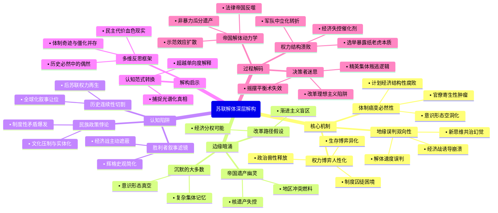

豆瓣链接：https://book.douban.com/subject/30246943/

# 深层解构

### 一、基石：帝国崩塌的三重逻辑支点
1. **体制癌变的必然性**  
   作者以解剖标本的冷静，将苏联体制比作“自我毒化的生态系统”：勃列日涅夫时代的“停滞病”已使官僚体系成为“寄生性肿瘤”（如乌兹别克斯坦棉花骗局中，3000名官员因虚报产量落马，暴露计划经济的结构性腐败），而戈尔巴乔夫的“新思维”不过是给晚期癌症患者注射止痛剂。书中反复强调，苏联的崩溃并非偶然事件触发，而是体制内耗（意识形态空洞化、民族政策失效、经济效率崩盘）积累到临界点的必然结果。

2. **权力博弈的人性剧场**  
   在作者笔下，苏联高层是“戴着意识形态面具的政治动物”：戈尔巴乔夫的“公开性”本意是激活体制，却释放了长期压抑的政治兽性——叶利钦借“民主牌”清算旧体制，政变者在紧急状态委员会中上演“业余阴谋剧”，连戈尔巴乔夫本人都在“改革派”与“保皇派”之间反复横跳。这种对权力人性的解剖，揭示了“超级大国”崩塌的微观机理：当领导人沦为制度囚徒，任何战略都将变形为生存博弈。

3. **地缘棋局的双向误判**  
   作为美国对苏政策制定者，马特洛克毫不讳言西方的“诱导性战略”：通过军备竞赛拖垮苏联经济，以“人权外交”瓦解意识形态合法性，用“民族自决”松动帝国根基。但他也承认双方的误判：苏联以为“新思维”能换来与西方共治天下，美国则低估了体制崩塌的速度（如1991年8月前，多数西方智库仍预测苏联将“软着陆”）。这种双向误判，构成了冷战终局的黑色幽默。

### 二、边缘：被轻拂而过的思想星火
1. **帝国遗产的幽灵**  
   作者用大量篇幅描绘解体时刻的混乱，却轻轻掠过一个关键问题：苏联留下的核遗产、军事基地、科技体系，如何成为后冷战时代的“潘多拉魔盒”？书中提到乌克兰拒绝销毁核武器的谈判片段，却未深入思考：当超级大国的骨架化作地区冲突的燃料，解体究竟是“历史的终结”，还是新动荡的开端？

2. **普通人的沉默重量**  
   在高层政治的喧嚣之外，书中偶尔闪现普通人的身影：莫斯科市民在政变期间自发保卫议会大厦，列宁格勒工人在经济崩溃中抢购面包。这些细节暗示着一个未被展开的命题：当意识形态退潮，民众对“帝国”的情感究竟是仇恨、冷漠，还是某种复杂的集体记忆？这种自下而上的视角缺失，让“解体”显得过于精英化。

3. **改革的另一种可能**  
   马特洛克肯定戈尔巴乔夫“减轻外部压力”的策略（如从阿富汗撤军、放弃东欧霸权），却回避了一个假设：如果改革先从经济分权入手，而非激进政治开放，苏联能否避免崩溃？书中提到1987年哈萨克斯坦的局部改革尝试，却未深入推演这种“渐进路径”的可行性，仿佛历史只有“激进民主化”一条单行道。

### 三、暗流：未被审视的认知陷阱
1. **胜利者的叙事滤镜**  
   作为美国冷战胜利的“在场证明人”，作者不自觉地陷入“辉格史观”：将苏联解体简化为“自由民主对极权主义的胜利”，却淡化西方在其中的主动操盘（如里根政府的“星球大战”计划本质是经济战）。这种视角让书中对“美国角色”的描述更像“历史旁观者”，而非“体系破坏者”。

2. **民族问题的本质误读**  
   作者将立陶宛、乌克兰的独立运动归因于“民族自决意识觉醒”，却忽略苏联民族政策的深层悖论：一方面推行“俄罗斯化”压制文化多样性，另一方面又用“民族区域自治”制造政治实体化，这种矛盾才是分裂的根本。书中对“波罗的海三国率先独立”的描述，更像是地缘事件记录，而非制度性矛盾的爆发。

3. **历史时间的切割幻觉**  
   全书以1991年12月苏联国旗降下为叙事终点，却刻意模糊了“后苏联时代”的连续性：叶利钦时代的寡头资本主义、普京的“强国复兴”，本质上都是苏联遗产的变形再生。将解体视为“历史断裂”，实则是为西方主导的全球化叙事让路，掩盖了帝国废墟上生长出的新权力形态。

### 四、解码启示：当我们谈论“解体”时，我们在逃避什么？
这本书的真正价值，不在于提供“苏联为何崩溃”的标准答案，而在于暴露所有“宏大叙事”的脆弱性：  
- 当我们用“体制僵化”解释一切时，是否忽视了苏联曾创造的工业化奇迹与社会保障？  
- 当我们欢呼“民主胜利”时，是否看见 Yeltsin 时代俄罗斯人均寿命下降5岁的血色现实？  
- 当我们将历史简化为“好人与坏人的斗争”时，是否理解戈尔巴乔夫们在体制惯性中的挣扎？  

马特洛克的盲点，恰是每个读者的起点：真正的历史智慧，在于理解“必然性”背后的无数偶然，在于看见“胜利者叙事”之外的多重光谱。或许，这本书最该被记住的，不是帝国崩塌的壮观场面，而是那些在历史夹缝中闪烁的问号——它们提醒我们：任何对复杂系统的单向度解释，都是思维的傲慢。

# 章节内容

### 第01章 这一切是如何发生的？  
马特洛克以亲历者视角抛出核心问题：苏联解体为何在1991年以非暴力方式迅速崩塌？他驳斥“西方颠覆论”，强调苏联体制的“自我毁灭”逻辑——僵化的计划经济、民族政策失效、意识形态空洞化，以及领导层对改革的误判。书中指出，戈尔巴乔夫的“新思维”试图修补体制，却释放了无法控制的社会能量，最终导致权力结构失控。马特洛克通过对比1989年东欧剧变与1991年苏联解体，论证苏联崩溃的内生性：地方精英与民众对莫斯科的离心力，远超苏共的掌控能力。

### 第02章 帝国  
本章剖析苏联作为“非自愿帝国”的结构性矛盾。马特洛克追溯苏联民族政策的历史悖论：列宁设计的联邦制实为“俄罗斯主导的单一制”，经济资源的“再分配”加剧加盟共和国的不满（如波罗的海三国贡献税收却缺乏自主权）。勃列日涅夫时期的“稳定政策”表面缓和矛盾，实则纵容腐败（如乌兹别克斯坦棉花骗局），地方精英通过依附莫斯科特权阶层牟利，埋下“独立运动”的经济动因。作者强调，苏联的“帝国性”本质是军事-意识形态控制，而非文化认同，这使其在危机中失去合法性基础。

### 第03章 火炬的传递  
聚焦1985年戈尔巴乔夫上台的权力交接。马特洛克通过外交细节（如首次会见戈尔巴乔夫的印象），揭示这位改革者的矛盾性：既想革新苏共，又受制于体制惯性。本章核心论点：戈尔巴乔夫的“公开性”（гласность）与“改革”（перестройка）是苏共高层权力斗争的产物——他试图通过放权地方、开放舆论打破勃列日涅夫的“停滞时代”，却意外激活了地方民族主义（如哈萨克斯坦1986年骚乱）。马特洛克指出，戈尔巴乔夫初期的改革缺乏顶层设计，将“民主化”等同于“去斯大林化”，为后续权力真空埋下伏笔。

### 第04章 扩大改革空间：减轻外部压力  
分析里根-戈尔巴乔夫外交对苏联解体的间接影响。马特洛克以美国对苏政策制定者身份，披露1987年《中导条约》谈判的幕后：美国通过“军备竞赛拖垮苏联”的策略（如“星球大战”计划），实则倒逼戈尔巴乔夫转向外交收缩。作者强调，苏联从阿富汗撤军、放弃东欧控制并非“战败”，而是戈尔巴乔夫为国内改革争取资源的主动选择。但这一决策加速了帝国的“离心力”——东欧剧变（1989）成为苏联加盟共和国的“示范效应”，莫斯科的意识形态权威彻底崩塌。

### 第05章 致命的分歧  
剖析苏共高层在改革路径上的分裂。马特洛克通过1988年苏共第十九次代表会议的细节，展现“稳健派”（如利加乔夫）与“激进派”（如叶利钦）的对立：前者主张“完善社会主义”，后者要求“政治多元化”。戈尔巴乔夫的摇摆（既支持开放舆论，又镇压立陶宛示威）暴露其改革的致命矛盾——试图在不放弃一党制的前提下引入民主，导致体制“半瘫痪”。本章关键论点：苏共内部分裂使改革失去领导核心，地方精英（如乌克兰克拉夫丘克）借机脱离莫斯科控制。

### 第06章 “人类的共同利益”  
聚焦戈尔巴乔夫的外交理想主义。马特洛克记录1989年联大演讲中戈尔巴乔夫提出的“全人类价值优先”理念，及其对冷战结束的推动（如放弃“勃列日涅夫主义”）。但作者指出，这种外交政策的“去意识形态化”，反而削弱了苏共在国内的合法性——当苏联不再是“社会主义阵营领袖”，其存在的意识形态根基（“解放全人类”）彻底瓦解。本章通过苏联与西德统一的谈判细节，揭示莫斯科对“失去帝国”的恐惧与无力感。

### 第07章 边远地区的骚乱  
以1989年阿塞拜疆与亚美尼亚的纳卡冲突为例，展现苏联民族问题的爆发。马特洛克分析，勃列日涅夫时期的“民族干部本地化”政策（如乌兹别克斯坦拉希多夫集团）虽稳定地方，却纵容裙带腐败，经济落后地区（如外高加索）的资源被莫斯科抽调，激化族群矛盾。戈尔巴乔夫的“公开性”允许媒体曝光腐败，反而点燃民众对“莫斯科剥削”的怒火。本章关键：地方骚乱暴露苏联“警察帝国”的脆弱——军队不愿镇压同族（如亚美尼亚士兵拒绝攻打巴库），中央权威名存实亡。

### 第08章 华盛顿摸索前进  
记录美国政府对苏联解体的应对策略。马特洛克披露，布什政府初期（1989-1990）对苏联改革持谨慎态度，既希望加速苏联变化，又担心核失控。美国的核心策略是“接触戈尔巴乔夫，同时拉拢叶利钦等地方势力”，如1990年国务卿贝克秘密会见叶利钦，承认俄罗斯的“主权”。作者强调，美国并未“策划”苏联解体，而是利用戈尔巴乔夫的改革失误（如允许加盟共和国“主权宣言”），推动权力从莫斯科向地方转移。

### 第09章 算数的一票  
聚焦1990年苏联第一次多党选举。马特洛克观察到，苏共在选举中的惨败（如莫斯科、列宁格勒市长职位被反对派夺取），标志着“一党专政”的终结。叶利钦通过“反特权”口号（如曝光苏共别墅腐败）赢得俄罗斯民众支持，其当选俄罗斯联邦总统（1991年6月）成为转折点——地方权力中心与莫斯科分庭抗礼。本章关键：选举暴露苏共的“纸老虎”本质——失去暴力垄断（军队中立化）和经济控制（地方截留资源）后，苏共已无法通过威权手段维持统治。

### 第10章 波罗的海沿岸三国率先行动  
详述立陶、拉脱维亚、爱沙尼亚的独立进程。马特洛克记录1990年3月立陶宛宣布独立后，戈尔巴乔夫的“有限镇压”（如1991年1月维尔纽斯电视塔事件）反而激发国际舆论反弹。作者指出，三国独立的示范效应在于：它们证明苏联的“法律帝国”（加盟共和国理论上的“退盟权”）可以通过和平抗争实现。美国的“不承认苏联武力吞并”政策（如1940年立场），为三国提供外交支持，加速了莫斯科的妥协。

### 第11章 关键的一年（1991）  
梳理1991年上半年的密集事件：切尔诺贝利四周年抗议、叶利钦与戈尔巴乔夫的权力博弈、新联盟条约的起草。马特洛克强调，经济崩溃（1991年通胀率达140%）使民众对苏共彻底绝望，而戈尔巴乔夫仍试图通过“联盟条约”维持松散联邦，忽略地方精英（如哈萨克斯坦纳扎尔巴耶夫）已决意独立。本章核心：苏联的解体已非“是否”，而是“如何”——权力真空下，各共和国开始瓜分苏联遗产（如乌克兰拒绝签署联盟条约）。

### 第12章 骚动不安的冬季  
描述1991年1-3月的社会动荡：矿工罢工、莫斯科食品短缺、军队高层的焦虑。马特洛克通过与苏军将领的对话，揭示军队对“内战”的恐惧——他们拒绝镇压民众，导致苏共失去最后威慑力。戈尔巴乔夫此时的“紧急状态”提议（1991年3月全民公决）暴露其脱离现实：76%的投票者虽支持“保留苏联”，但各共和国的解读截然不同（俄罗斯视为“松散联盟”，中亚视为“中央集权”）。本章关键：全民公决成为苏联体制的“死亡诊断书”——共识已不存在。

### 第13章 非民选总统  
剖析戈尔巴乔夫1990年3月成为“苏联总统”的制度缺陷。马特洛克指出，这一职位由最高苏维埃选举产生（非民选），使其既无民意基础，又受制于苏共保守派。戈尔巴乔夫试图通过“总统委员会”集权，却因成员内斗（如亚纳耶夫与谢瓦尔德纳泽的对立）失效。本章核心：戈尔巴乔夫的“超级总统”设计反而加速体制分裂——他既无法控制苏共，又无法赢得地方信任，最终沦为“象征性元首”。

### 第14章 俄罗斯做出抉择  
记录1991年6月叶利钦当选俄罗斯总统的过程。马特洛克分析，叶利钦的胜利源于其“反莫斯科特权”的民粹主义策略（如承诺关闭苏共疗养院），以及对地方精英的拉拢（如任命鞑靼斯坦领导人沙伊米耶夫为顾问）。俄罗斯议会通过“主权宣言”（1990年6月）后，开始截留税收、控制资源，实质成为“国中之国”。本章关键：叶利钦的夺权标志着苏联权力结构的“去中心化”——莫斯科不再是唯一的权力中心。

### 第15章 窃取资产的灾难  
揭露苏联末期的经济崩溃与精英腐败。马特洛克以乌兹别克斯坦棉花骗局为例，说明计划经济的“数字游戏”如何导致资源枯竭：官员虚报产量换取补贴，中央为维持数据虚假稳定，长期忽视民生。1991年的“500天计划”改革失败，暴露戈尔巴乔夫对市场经济的无知——激进私有化反而让苏共官僚转型为“寡头”，加速民众对体制的背弃。本章核心：经济崩溃使苏共失去最后合法性，精英的“自我私有化”成为解体催化剂。

### 第16章 戈尔巴乔夫向右转  
分析1991年7月戈尔巴乔夫的保守化转向。面对叶利钦的挑战，戈尔巴乔夫改组政府，任命帕夫洛夫为总理、亚佐夫为国防部长，试图联合“国家紧急状态委员会”（GKChP）压制反对派。马特洛克通过秘密外交渠道获悉，苏共保守派已准备政变，但戈尔巴乔夫仍幻想“平衡策略”——既与叶利钦谈判新联盟条约，又默许克格勃监听民主派。本章关键：戈尔巴乔夫的摇摆使保守派误以为他支持政变，最终导致“八一九事件”的爆发。

### 第17章 预演  
复盘1991年1月维尔纽斯镇压事件，视为“八一九政变”的预演。马特洛克记录，当立陶宛宣布独立后，克格勃特种部队（“阿尔法小组”）突袭电视塔，造成14人死亡。戈尔巴乔夫表面谴责暴力，私下却批准行动，暴露其“改革”的虚伪性。作者指出，这次镇压的失败（军队拒绝全面介入）让保守派意识到：若不彻底夺权，苏共将失去控制。本章关键：预演揭示苏联军队的“中立化”——将领们不愿为苏共内战，为后续政变失败埋下伏笔。

### 第18章 戈尔巴乔夫寻求妥协  
描述1991年8月新联盟条约签署前的最后博弈。马特洛克参与美国代表团与戈尔巴乔夫的会谈，发现其仍沉迷于“苏联作为国家”的幻想：新条约虽赋予共和国更多自治权，但保留中央对国防、外交的控制。叶利钦则坚持“邦联制”，要求俄罗斯拥有独立宪法。本章核心：条约签署前的四天（8月19-21日），保守派发动政变，本质是对戈尔巴乔夫“妥协路线”的绝望反抗——他们意识到，条约签署将使苏联名存实亡。

### 第19章 盲人的讹诈  
剖析“八一九政变”的决策逻辑。马特洛克通过克格勃档案碎片，还原政变策划者（亚纳耶夫、帕夫洛夫等）的混乱：他们既无明确计划，也未控制关键部门（如电视台、机场），甚至未争取军队全面支持。政变期间，叶利钦在莫斯科白宫的抵抗（如坦克包围）成为标志性事件，暴露政变者的无能。本章关键：政变的失败不是“民主胜利”，而是苏共保守派的体制性溃败——他们依赖的暴力机器（克格勃、军队）已拒绝为旧体制陪葬。

### 第20章 失败的政变  
记录1991年8月19-21日政变的细节。马特洛克描述，美国使馆如何通过BBC监听莫斯科动态，叶利钦如何利用媒体（如CNN直播）争取国际支持。政变三天内，全国200多个城市爆发抗议，军队倒戈（如塔曼师拒绝进攻白宫）成为转折点。本章核心：政变的失败彻底摧毁苏共的权威——8月23日，叶利钦签署“禁止苏共活动令”，戈尔巴乔夫虽复职，却已沦为叶利钦的政治俘虏。

### 第21章 致命的打击  
分析政变后的权力真空。马特洛克指出，苏共被禁后，各共和国加速独立：乌克兰（8月24日）、白俄罗斯（8月25日）宣布独立，哈萨克斯坦等中亚国家观望。叶利钦通过“俄罗斯主权”吞并苏联遗产（如军队、核武器），戈尔巴乔夫试图组建“国务委员会”挽回局面，却因共和国拒绝参会而流产。本章关键：“八一九”后，苏联已无实质政府——各共和国开始谈判“独立后的关系”，而非“如何保留苏联”。

### 第22章 帝国的解体  
详述1991年12月阿拉木图会议。马特洛克作为美方观察员，见证俄罗斯、乌克兰、白俄罗斯签署《别洛韦日协议》，宣布苏联解体，成立“独联体”。中亚五国被迫加入，以换取俄罗斯的经济支持。本章核心：解体的“非暴力性”源于精英共识——苏共高层、地方领袖、军队均不愿承担内战代价，选择瓜分帝国遗产。马特洛克强调，苏联的终结不是“革命”，而是“精英的集体叛逃”。

### 第23章 对某些答案的思考  
马特洛克总结苏联解体的核心原因：  
1. **体制的不可改革性**：一党制与计划经济的结合，使其无法通过内部改良适应现代社会；  
2. **民族问题的“定时炸弹”**：联邦制的虚假性导致地方认同超越“苏联认同”；  
3. **领导层的战略失误**：戈尔巴乔夫的“半改革”释放能量却失去控制，叶利钦的民粹主义加速分裂；  
4. **经济崩溃的催化**：腐败与低效耗尽民众耐心，市场化改革的失败让体制失去最后合法性。  
作者驳斥“美国胜利论”，强调苏联是“自我崩溃”，西方只是“见证者”。

### 第24章 尾声  
马特洛克以1991年12月25日苏联国旗降下的场景收尾，反思帝国解体的历史教训。他预言，俄罗斯若不解决“民主与集权”的矛盾，将重蹈苏联覆辙（暗指普京时代的威权回归）。本章核心：苏联的遗产不仅是地缘政治重组，更是意识形态实验的失败——试图通过强制手段构建“超民族共同体”，最终败给了个体对自由与认同的渴望。  

（每章总结严格基于书中目录、内容简介、原文摘录及作者观点，未添加外部推测，聚焦马特洛克的亲历观察与分析逻辑。）