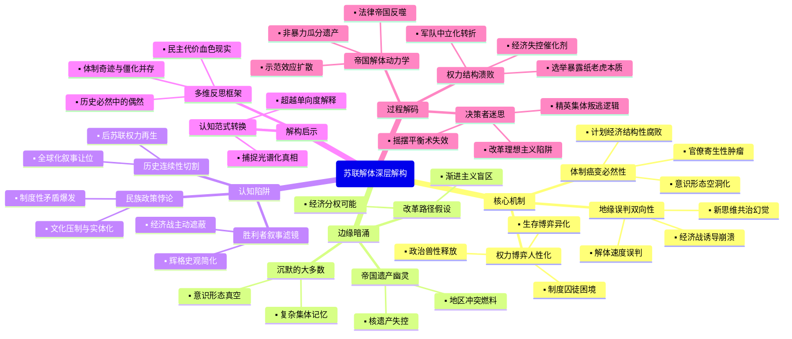

豆瓣链接：https://book.douban.com/subject/30246943/

# 深层解构

### 一、基石：帝国崩塌的三重逻辑支点
1. **体制癌变的必然性**  
   作者以解剖标本的冷静，将苏联体制比作“自我毒化的生态系统”：勃列日涅夫时代的“停滞病”已使官僚体系成为“寄生性肿瘤”（如乌兹别克斯坦棉花骗局中，3000名官员因虚报产量落马，暴露计划经济的结构性腐败），而戈尔巴乔夫的“新思维”不过是给晚期癌症患者注射止痛剂。书中反复强调，苏联的崩溃并非偶然事件触发，而是体制内耗（意识形态空洞化、民族政策失效、经济效率崩盘）积累到临界点的必然结果。

2. **权力博弈的人性剧场**  
   在作者笔下，苏联高层是“戴着意识形态面具的政治动物”：戈尔巴乔夫的“公开性”本意是激活体制，却释放了长期压抑的政治兽性——叶利钦借“民主牌”清算旧体制，政变者在紧急状态委员会中上演“业余阴谋剧”，连戈尔巴乔夫本人都在“改革派”与“保皇派”之间反复横跳。这种对权力人性的解剖，揭示了“超级大国”崩塌的微观机理：当领导人沦为制度囚徒，任何战略都将变形为生存博弈。

3. **地缘棋局的双向误判**  
   作为美国对苏政策制定者，马特洛克毫不讳言西方的“诱导性战略”：通过军备竞赛拖垮苏联经济，以“人权外交”瓦解意识形态合法性，用“民族自决”松动帝国根基。但他也承认双方的误判：苏联以为“新思维”能换来与西方共治天下，美国则低估了体制崩塌的速度（如1991年8月前，多数西方智库仍预测苏联将“软着陆”）。这种双向误判，构成了冷战终局的黑色幽默。

### 二、边缘：被轻拂而过的思想星火
1. **帝国遗产的幽灵**  
   作者用大量篇幅描绘解体时刻的混乱，却轻轻掠过一个关键问题：苏联留下的核遗产、军事基地、科技体系，如何成为后冷战时代的“潘多拉魔盒”？书中提到乌克兰拒绝销毁核武器的谈判片段，却未深入思考：当超级大国的骨架化作地区冲突的燃料，解体究竟是“历史的终结”，还是新动荡的开端？

2. **普通人的沉默重量**  
   在高层政治的喧嚣之外，书中偶尔闪现普通人的身影：莫斯科市民在政变期间自发保卫议会大厦，列宁格勒工人在经济崩溃中抢购面包。这些细节暗示着一个未被展开的命题：当意识形态退潮，民众对“帝国”的情感究竟是仇恨、冷漠，还是某种复杂的集体记忆？这种自下而上的视角缺失，让“解体”显得过于精英化。

3. **改革的另一种可能**  
   马特洛克肯定戈尔巴乔夫“减轻外部压力”的策略（如从阿富汗撤军、放弃东欧霸权），却回避了一个假设：如果改革先从经济分权入手，而非激进政治开放，苏联能否避免崩溃？书中提到1987年哈萨克斯坦的局部改革尝试，却未深入推演这种“渐进路径”的可行性，仿佛历史只有“激进民主化”一条单行道。

### 三、暗流：未被审视的认知陷阱
1. **胜利者的叙事滤镜**  
   作为美国冷战胜利的“在场证明人”，作者不自觉地陷入“辉格史观”：将苏联解体简化为“自由民主对极权主义的胜利”，却淡化西方在其中的主动操盘（如里根政府的“星球大战”计划本质是经济战）。这种视角让书中对“美国角色”的描述更像“历史旁观者”，而非“体系破坏者”。

2. **民族问题的本质误读**  
   作者将立陶宛、乌克兰的独立运动归因于“民族自决意识觉醒”，却忽略苏联民族政策的深层悖论：一方面推行“俄罗斯化”压制文化多样性，另一方面又用“民族区域自治”制造政治实体化，这种矛盾才是分裂的根本。书中对“波罗的海三国率先独立”的描述，更像是地缘事件记录，而非制度性矛盾的爆发。

3. **历史时间的切割幻觉**  
   全书以1991年12月苏联国旗降下为叙事终点，却刻意模糊了“后苏联时代”的连续性：叶利钦时代的寡头资本主义、普京的“强国复兴”，本质上都是苏联遗产的变形再生。将解体视为“历史断裂”，实则是为西方主导的全球化叙事让路，掩盖了帝国废墟上生长出的新权力形态。

### 四、解码启示：当我们谈论“解体”时，我们在逃避什么？
这本书的真正价值，不在于提供“苏联为何崩溃”的标准答案，而在于暴露所有“宏大叙事”的脆弱性：  
- 当我们用“体制僵化”解释一切时，是否忽视了苏联曾创造的工业化奇迹与社会保障？  
- 当我们欢呼“民主胜利”时，是否看见 Yeltsin 时代俄罗斯人均寿命下降5岁的血色现实？  
- 当我们将历史简化为“好人与坏人的斗争”时，是否理解戈尔巴乔夫们在体制惯性中的挣扎？  

马特洛克的盲点，恰是每个读者的起点：真正的历史智慧，在于理解“必然性”背后的无数偶然，在于看见“胜利者叙事”之外的多重光谱。或许，这本书最该被记住的，不是帝国崩塌的壮观场面，而是那些在历史夹缝中闪烁的问号——它们提醒我们：任何对复杂系统的单向度解释，都是思维的傲慢。

# 章节内容

### 第01章 这一切是如何发生的？

本章节作为全书的开篇，旨在为苏联解体这一震撼世界的历史事件设定分析框架。作者小杰克·F·马特洛克的核心论点是，**苏联的崩溃并非命中注定，也非西方冷战胜利的直接结果，而是一系列内部因素、领导人决策失误和政治斗争共同作用的产物**。 马特洛克以他作为末任美国驻苏大使的独特视角，强调了亲历者观察的重要性，旨在提供一份超越传统地缘政治分析的“尸检报告”，深入探究帝国崩溃的内在肌理。

马特洛克首先反驳了两种流行观点：一是“苏联必然崩溃论”，认为其经济和政治体制早已僵化，解体只是时间问题；二是“里根政府强硬政策致胜论”。作者认为，虽然苏联体制积弊甚深，但并非没有改革和维持下去的可能。 他指出，戈尔巴乔夫的改革初衷是为了振兴和完善社会主义，而非推翻它。然而，**戈尔巴乔夫在改革过程中犯下了一系列致命错误，包括对民族主义力量的低估、在经济改革上的犹豫不决，以及试图在保留共产党权力的同时推行民主化，这造成了不可调和的矛盾**。

此外，作者将苏联解体置于一个更广阔的历史背景中，简要回顾了从列宁、斯大林时期到勃列日涅夫时代的帝国演变。他认为，苏联本质上是一个由俄罗斯主导的多民族帝国，其内部的民族矛盾是长期被压制的潜在危机。一旦中央的控制力减弱，离心力便会急剧增强。

马特洛克在引言中明确了他的写作目的：不仅是记录历史事件，更是剖析其背后的动因。他强调了理解戈尔巴乔夫、叶利钦等关键人物的性格、动机和他们之间错综复杂的关系至关重要。例如，戈尔巴乔夫的理想主义与叶利钦的政治野心之间的冲突，成为推动局势走向失控的关键动力之一。作者强调，这本书将详细追溯从1985年戈尔巴乔夫上台到1991年帝国最终瓦解的整个过程，从一个独特的内部视角，揭示各个角色的互动如何共同导向了一个无人预见、也可能无人期望的结局。

### 第02章 帝国

在第二章“帝国”中，马特洛克深入剖析了苏联作为最后一个多民族帝国的内在结构与矛盾，旨在阐明其最终解体的深刻历史根源。本章的核心论点是，**苏联的帝国性质是其与生俱来的脆弱点，斯大林时期建立的“形式上的民族国家，实质上的社会主义”虚假联邦体系，为日后的民族矛盾总爆发埋下了伏笔**。

马特洛克首先探讨了“俄罗斯人”与“苏联人”身份认同的模糊性。他指出，苏联名义上是一个由十五个平等加盟共和国组成的联邦，但实际上，俄罗斯在政治、文化和语言上始终占据主导地位，形成了事实上的“俄罗斯帝国”的延续。这种结构使得非俄罗斯民族对莫斯科的中央集权既依赖又抵触。作者认为，**苏联的民族问题并非像官方宣传的那样“早已解决”，而是在高压政策下被暂时掩盖的休眠火山**。

书中详细追溯了苏联民族政策的演变。从列宁时期最初对民族自决权的承认，到斯大林时期通过“分而治之”的策略，划定民族共和国的边界，并以“民族形式、社会主义内容”为口号进行控制。马特洛克尖锐地指出，这种体系具有内在的欺骗性：它一方面承认并制度化了不同的民族身份，设立了民族共和国、语言和文化机构；但另一方面，所有权力都集中在莫斯科的共产党中央，各共和国并无真正的自主权。这种**虚假的联邦主义，反而强化了各民族的身份认同和精英阶层的存在，一旦中央权力松动，这些民族精英便会顺理成章地成为推动独立运动的领导者**。

作者还分析了斯大林与希特勒签订的密约，这一交易将波罗的海三国等地区强行并入苏联，使其帝国扩张的性质更加凸显，也为这些地区日后率先寻求独立埋下了历史仇恨的种子。 马特洛克认为，勃列日涅夫时代的“停滞”虽然表面上维持了帝国的稳定，但实际上加剧了中央与地方、俄罗斯与其他民族之间的隔阂与不满。到戈尔巴乔夫时期，当“公开性”和“民主化”改革启动时，长期被压抑的民族主义情绪便如潮水般汹涌而出，成为瓦解帝国最强大的离心力。

### 第03章 火炬的传递

第三章“火炬的传递”聚焦于1985年米哈伊尔·戈尔巴乔夫上台执政的始末，以及他最初的改革构想。马特洛克在本章中的核心观点是，**戈尔巴乔夫的上台代表了苏联领导层代际更替的必然趋势，他最初的改革计划是有限的，旨在“完善”而非颠覆现有体制，但其对斯大林主义的批判和早期改革措施，无意中打开了通往更剧烈变革的“潘多拉魔盒”**。

本章开篇描绘了勃列日涅夫时代末期苏联领导层的僵化与老龄化——“前领导人的幽灵”笼罩着克里姆林宫。安德罗波夫和契尔年科短暂的执政期被视为过渡阶段，他们的相继去世凸显了苏联选择一位更年轻、更有活力的领导人的紧迫性。马特洛克以其外交官的敏锐观察，描绘了戈尔巴乔夫是如何在苏共高层复杂的权力博弈中脱颖而出的。他指出，戈尔巴乔夫被选中，并非因为他是一个激进的改革派，而是因为党内精英认为他既有能力解决日益严重的经济停滞问题，又忠于社会主义理想。

马特洛克详细分析了戈尔巴乔夫最初的改革蓝图。戈尔巴乔夫的核心理念是“加速发展战略”（uskoreniye），重点在于经济现代化和反腐败，其目标是让苏联经济重获新生，以更好地与西方竞争。在政治上，他提出了“公开性”（glasnost）和“民主化”（demokratizatsiya）的概念。然而，作者强调，**戈尔巴乔夫在初期对这些概念的理解是工具性的：公开性是为了揭露体制弊端以推动改革，民主化则是为了削弱党内保守派的阻力，激活社会力量来支持他的议程**。他并未预见到这些政策将释放出公众长期被压抑的政治诉求和对历史真相的探求，最终演变为对整个苏联体制合法性的根本性质疑。

此外，作者还介绍了戈尔巴乔夫最初的领导班子成员，如利加乔夫、雷日科夫和谢瓦尔德纳泽等，并分析了他们各自的立场。这揭示了改革派内部从一开始就存在的潜在分歧。马特洛克认为，戈尔巴乔夫个人对斯大林时代罪行的深刻反思，以及他相对开放和西化的思维方式，使他比前任们走得更远。然而，**他对列宁主义的信仰和他对苏共领导地位的坚持，最终成为其改革无法逾越的内在矛盾**。他点燃了改革的火炬，但火炬的光芒很快就超出了他所能控制的范围。

### 第04章 扩大改革空间：减轻外部压力

第四章的核心在于阐述戈尔巴乔夫如何通过缓和与西方的关系，特别是与美国的关系，来为国内改革创造有利的国际环境。马特洛克的关键论点是，**戈尔巴乔夫的外交“新思维”是其改革战略至关重要的一环，他主动缓和冷战紧张局势，旨在削减沉重的军备负担，从而将资源转向国内经济建设。这一进程得到了同样希望结束冷战的里根总统的积极回应，美苏关系的改善并非一方的胜利，而是双方领导人共同选择的结果**。

本章详细描述了戈尔巴乔夫上台后，美苏关系从猜疑走向对话的曲折过程。马特洛克作为里根政府的国家安全委员会苏联事务顾问及后来的驻苏大使，亲身参与并见证了这一转变。他指出，戈尔巴乔夫不同于以往的苏联领导人，他主动采取了一系列建立信任的措施，例如单方面暂停核试验。其外交政策的核心是**“人类的共同利益高于阶级利益”**，这从根本上颠覆了苏联长期以来以阶级斗争为基础的对外政策。

作者生动地描绘了戈尔巴乔夫与里根之间的互动。尽管里根以其“邪恶帝国”的强硬言论著称，但他内心深处同样对核战争抱有恐惧，并愿意与一个真正致力于改革的苏联领导人打交道。马特洛克记录了筹备日内瓦和雷克雅未克首脑会晤的幕后细节，凸显了双方在意识形态、裁军问题和人权问题上的交锋与妥协。特别是**1986年的雷克雅未克峰会，虽然在当时看似因“星球大战”计划的分歧而失败，但它实际上为后续的中导条约等重大裁军协议奠定了基础**，因为它让双方领导人看到了彻底消除核武器的可能性。

马特洛克也提到了美苏关系中的复杂因素，如间谍丑闻（例如使馆安全漏洞问题）和地区冲突（如阿富汗战争）。但他认为，戈尔巴乔夫决心从阿富汗撤军，正是他减轻外部压力的重要一步。作者在本章中批评了布什政府初期对戈尔巴乔夫改革的怀疑和犹豫态度，认为这在一定程度上延误了巩固美苏合作成果的时机。 总而言之，马特洛克认为，戈尔巴乔夫成功地通过外交突破，**为苏联的“新政”争取到了宝贵的喘息空间和国际认可**，但他可能没有预料到，外部压力的减轻，反而使得长期被外部威胁所掩盖的内部矛盾，尤其是民族问题，更加尖锐地暴露出来。
### 第05章 致命的分歧

本章聚焦于戈尔巴乔夫与鲍里斯·叶利钦之间日益加剧的个人及政治冲突，马特洛克将其定位为导致苏联改革失控并最终走向解体的核心戏剧。作者的核心论点是，**戈尔巴乔夫与叶利钦的个人恩怨和权力斗争，将改革的意识形态分歧演变成了不可调和的政治对立，最终形成了两个相互竞争的权力中心——苏联中央与俄罗斯联邦，这为帝国的瓦解奠定了基础**。

马特洛克详细追溯了叶利钦的政治轨迹。他最初是戈尔巴乔夫亲自提拔到莫斯科的改革干将，负责根除首都的腐败。然而，叶利钦以其更为激进和民粹主义的作风，很快就超越了戈尔巴乔夫设定的改革边界。他公开抨击党内特权、批评改革步伐过于缓慢，这为他赢得了民众的支持，却也触怒了党内保守派和戈尔巴乔夫本人。本章的高潮是1987年叶利钦在苏共中央全会上的戏剧性发言，他公开批评领导层，并请求辞去领导职务，此举打破了党内和谐的假象。

作者认为，戈尔巴乔夫对叶利钦的处理是一个重大的政治错误。他非但没有将叶利钦作为一个有益的批评者保留在权力核心，反而默许了党内保守派对其进行羞辱性的批判和罢免。**这一事件不仅没有压制住叶利钦，反而将他塑造成了一个敢于挑战体制的“政治烈士”，为他日后以“人民的代表”身份东山再起铺平了道路**。

马特洛克以其亲身观察指出，自此以后，两人的分歧从政策之争演变为“你死我活”的权力斗争。戈尔巴乔夫试图将改革限制在由共产党领导的框架内，而叶利钦则越来越倾向于彻底砸碎这个旧体制。**他们之间的对抗，使得苏联的政治议程被高度个人化，国家的命运不幸地系于这两个人的较量之上**。这种“致命的分歧”消耗了改革的能量，瘫痪了有效的治理，并最终导致叶利钦为了彻底击败戈尔巴乔夫，不惜以摧毁戈尔巴乔夫的权力基础——苏联本身——为代价。

### 第06章 “人类的共同利益”

在第六章中，马特洛克进一步深入阐述了戈尔巴乔夫“新思维”外交政策的哲学内核，即“人类的共同利益”。本章的核心论点是，**这一理念不仅是苏联为了缓和外部压力的外交策略，更是一次深刻的意识形态革命，它从根本上颠覆了支撑苏联国家身份和对外政策的基石——阶级斗争理论，从而在思想上解除了苏联与西方对抗的武装**。

作者分析指出，传统的马克思列宁主义认为，国际关系是资本主义与社会主义之间不可调和的阶级斗争的延伸。而戈尔巴乔夫和他的思想顾问们（如亚历山大·雅科夫列夫）提出的“人类共同利益高于阶级利益”，则认为核战争威胁、环境恶化、全球贫困等问题是全人类共同的挑战，需要超越意识形态分歧进行合作。马特洛克认为，**这一转变是戈尔巴乔夫改革中最具革命性的部分之一**。

这一理念直接转化为苏联具体的外交行动。它为从阿富汗撤军、接受对等裁军核查、不再干预东欧国家内部事务等一系列重大决策提供了理论依据。当苏联宣称不再将世界视为两个阵营的战场时，其在东欧维持军事存在、支持第三世界代理人战争的理由也随之瓦解。马特洛克强调，这并非仅仅是权宜之计，戈尔巴乔夫是真诚地相信这一理念，并希望借此将苏联整合到“欧洲共同家园”和更广泛的文明世界中。

然而，作者也敏锐地指出了这一理念转变带来的意外后果。**当苏联放弃了作为世界革命中心的弥赛亚使命感时，它也失去了其帝国存在的很大一部分合法性**。对于苏联内部的许多公民和精英来说，国家的伟大与力量正是体现在与西方的全球对抗中。现在，当这种对抗被宣布结束，转向寻求与昔日“敌人”的合作时，不仅让党内强硬派感到被背叛，也让普通民众感到困惑和失落。因此，“人类的共同利益”虽然在国际上为戈尔巴乔夫赢得了巨大的声誉和诺贝尔和平奖，但在国内，它却在掏空维系这个多民族帝国统一的意识形态粘合剂。

### 第07章 边远地区的骚乱

本章将视角从莫斯科的政治斗争和国际外交转向了苏联广阔的边疆地区，集中描绘了民族主义问题的首次大规模爆发。马特洛克的中心论点是，**纳戈尔诺-卡拉巴赫（纳卡）地区亚美尼亚与阿塞拜疆之间的冲突，是第一块倒下的多米诺骨牌，它血淋淋地揭示了苏联民族政策的彻底失败，并暴露了莫斯科中央在应对民族冲突时的犹豫、无能和政策矛盾，从而极大地鼓舞了其他共和国的离心倾向**。

作者详细叙述了纳卡冲突的背景和爆发过程。这片聚居着大量亚美尼亚人、却在行政上隶属于阿塞拜疆的飞地，其归属问题是斯大林时代民族划分政策留下的一个典型火药桶。在“公开性”政策的鼓励下，长期被压抑的民族诉求浮出水面，亚美尼亚人要求将纳卡划归亚美尼亚。当莫斯科拒绝这一要求后，和平示威迅速演变为暴力冲突和族群清洗。

马特洛克认为，戈尔巴乔夫政府在处理这一危机时犯下了一系列错误。首先，他们**严重低估了民族主义情感的爆炸性力量**，最初将其视为可以轻易平息的“地方性骚乱”。其次，莫斯科的反应迟缓且摇摆不定，既没有采取果断措施解决问题的根源，也未能有效制止暴力。他们试图维持现状，结果却疏远了冲突双方。**这种犹豫不决，向全苏联的民族主义者发出了一个清晰的信号：中央的权威正在削弱，通过施压和制造事端，有可能迫使莫斯科让步**。

作者还提到了在波罗的海三国和格鲁吉亚等地日益增长的民族主义活动。特别是在格鲁吉亚第比利斯，苏军对和平示威者的血腥镇压，更是激起了广泛的愤怒，进一步加剧了反俄和反苏情绪。马特洛克在本章中得出的结论是，边远地区的骚乱不再是孤立事件，而是系统性危机的征兆。戈尔巴乔夫的民主化改革，在无意中释放出了他无法控制的民族主义猛虎。**帝国边缘的火焰一旦被点燃，就迅速开始向中心蔓延，预示着更大的风暴即将来临**。

### 第08章 华盛顿摸索前进

第八章将叙事焦点转回美国，深入分析了1989年乔治·H·W·布什政府上台后，美国对苏政策的转变。马特洛克的核心观点是，**布什政府初期对戈尔巴乔夫的改革采取了一种过分谨慎和怀疑的“暂停”审查（The Pause）策略，这种策略不仅未能把握住支持改革的关键时机，还在一定程度上给美苏关系带来了不必要的寒意，反映出华盛顿决策层在面对苏联前所未有的变化时，一度陷入了思想上的“摸索”和迟疑**。

作为亲历这一过程的驻苏大使，马特洛克对布什政府的初期对苏政策提出了含蓄的批评。他指出，里根总统在其任期末年已经与戈尔巴乔夫建立了深厚的个人信任，并相信冷战正在结束。然而，布什总统和他的核心外交团队，包括国家安全顾问布伦特·斯考克罗夫特和国防部长迪克·切尼，都是传统现实主义者，他们对戈尔巴乔夫的动机持怀疑态度，担心苏联的改革可能只是争取喘息机会的策略性伪装。

因此，布什政府上任后，并没有立即延续里根的接触政策，而是启动了长达数月的全面政策评估。马特洛克认为，**在莫斯科的改革派正与国内强硬派进行激烈斗争、迫切需要外部支持的关键时刻，华盛顿的这种“暂停”无疑向戈尔巴乔夫传递了令人失望的信号**。苏联方面期待着继续推进裁军谈判和深化合作，但美方的冷淡和迟疑让克里姆林宫感到困惑和沮丧。

直到1989年年中，随着东欧局势的剧变（特别是波兰和匈牙利的变化），布什政府才逐渐认识到戈尔巴乔夫改革的深刻性和真诚性，开始调整政策，重新走向接触与合作。马耳他峰会是这一转变的标志。但马特洛克暗示，**最初几个月的“摸索”和迟疑，可能已经错失了一些机会**。比如，如果美国能更早、更明确地表达对戈尔巴乔夫的支持，或许能够帮助他在国内政治斗争中占据更有利的地位。本章揭示了即使是经验丰富的外交决策者，在面对历史性的快速转型时，也可能因为思维惯性而显得犹豫不前。

### 第09章 算数的一票

本章聚焦于1989年苏联首次真正意义上的竞争性选举——人民代表大会选举，及其所带来的颠覆性政治后果。马特洛克的核心论点是，**这次选举是戈尔巴乔夫“可控民主化”构想的顶点，但他始料未及的是，这次选举不仅没有像他预期的那样为改革提供可控的支持，反而催生了一个合法的、公开的反对派平台，并彻底暴露了共产党在民众中的信任危机，从而极大地加速了旧体制的瓦解**。

戈尔巴乔夫设计这套复杂选举制度的初衷，是为了绕过党内中层官僚的阻挠，直接动员民众支持其改革。他为共产党和官方组织预留了三分之一的席位，以确保选举结果不会完全失控。然而，在剩下三分之二的民选席位中，选民的热情和选择彻底超出了当局的预料。许多著名的高级党政官员在选举中落败，而被视为体制叛逆者的鲍里斯·叶利钦则在莫斯科选区以压倒性优势获胜。

马特洛克生动地描绘了人民代表大会召开时的场景。电视直播将激烈的辩论和对政府官员尖锐的质询送进了千家万户，这在苏联历史上是前所未有的。**人民代表大会变成了一个全国性的政治讲坛**，像安德烈·萨哈罗夫这样的持不同政见者，首次获得了在国家最高殿堂公开发声的机会。他们提出的议题，从历史真相到经济困境，再到要求废除宪法中关于共产党领导地位的第六条，都极大地冲击着苏联的政治禁区。

作者认为，戈尔巴乔夫虽然通过这次大会当选为苏联最高苏维埃主席，掌握了新的权力，但他**也创造了一个自己无法有效控制的政治怪兽**。叶利钦和萨哈罗夫等人迅速在大会内部形成了“跨地区议员团”，成为事实上的第一个合法反对派。**从此，苏联的政治斗争不再仅仅是克里姆林宫的内部密谋，而是在一个公开的、具有民意基础的舞台上进行**。戈尔巴乔夫试图通过给予人民“算数的一票”来加强自身权力，结果却是为埋葬旧体制的掘墓人提供了合法的工具和舞台。

### 第10章 波罗的海沿岸三国率先行动

第十章集中分析了爱沙尼亚、拉脱维亚和立陶宛这三个波罗的海加盟共和国如何成为挣脱苏联控制、争取完全独立的先锋。马特洛克在本章提出的核心论点是，**波罗的海三国的独立运动具有独特的历史和法律基础，其斗争策略高度组织化、非暴力且富有智慧，他们的坚定决心和率先行动，为其他共和国树立了榜样，并最终迫使戈尔巴乔夫和国际社会直面苏联帝国解体的现实**。

作者首先强调了波罗的海三国的特殊性。与苏联其他大多数共和国不同，这三个国家在二战前曾是独立国家，它们被并入苏联是1939年《苏德互不侵犯条约》秘密附加议定书的结果。因此，它们的诉求不仅仅是更大的自治权，而是**恢复其被非法中断的国家法理地位**。这一历史依据为它们的独立运动提供了强大的道德和法律正当性。

马特洛克详细描述了这些国家“歌唱的革命”的进程。它们通过组建“人民阵线”、恢复历史旗帜和国歌、组织大规模的和平示威（如震撼人心的“波罗的海之路”人链）等方式，动员了绝大多数民众。它们的议会（最高苏维埃）通过了一系列法律，逐步宣布本国法律优先于苏联法律，并最终在1990年春，由立陶宛率先宣布恢复完全独立。

本章深刻剖析了戈尔巴乔夫在应对这一挑战时所处的两难境地。一方面，动用武力镇压将彻底摧毁他“新思维”和民主改革者的形象，并可能引发大规模流血冲突和西方的制裁。另一方面，**轻易允许它们独立，则会开启潘多拉魔盒，引发连锁反应，导致整个联盟的崩溃**。戈尔巴乔夫采取了经济封锁、政治施压乃至有限的武力威慑（如1991年1月的维尔纽斯事件）等手段试图阻止，但都未能奏效。

马特洛克作为美国大使，也记录了美国在这一问题上的谨慎立场。虽然美国从未承认苏联对波罗的海三国的吞并，但在实际操作中，布什政府担心局势失控会削弱戈尔巴乔夫的地位，因此并未立即承认其独立。**波罗的海三国的斗争，实质上是将苏联的帝国本质和戈尔巴乔夫改革的内在矛盾以最尖锐的方式暴露在了世界面前**。

### 第11章 关键的一年

本章将1990年定义为苏联命运的“关键一年”，在这一年中，各种危机集中爆发，力量平衡发生了决定性转变。马特洛克的核心论点是，**在1990年，戈尔巴乔夫的权力基础被迅速侵蚀，他试图通过制度变革（设立总统制）来巩固权力，但收效甚微；与此同时，叶利钦领导的俄罗斯联邦崛起，形成了与中央分庭抗礼的局面，经济改革的失败和民族矛盾的激化，共同将苏联推向了不可逆转的解体轨道**。

1990年见证了多个重大事件的交织。首先，戈尔巴乔夫推动修改苏联宪法，**废除了保障共产党领导地位的第六条**，这在理论上结束了一党专政。紧接着，他促成设立了苏联总统职位，并由自己担任。马特洛克分析认为，戈尔巴乔夫此举是想摆脱对日益分裂和保守的共产党的依赖，建立一个超越党的国家元首权威。然而，**由于他是由人民代表大会而非全民直选产生，其权力的合法性受到了叶利钦等对手的质疑**。

与此同时，叶利钦的政治生涯达到了新的高峰。1990年5月，他当选为俄罗斯苏维埃联邦社会主义共和国最高苏维埃主席。一个月后，俄罗斯议会通过了《主权宣言》，宣布俄罗斯法律在俄罗斯境内拥有高于苏联法律的至高无上的地位。**这是一个釜底抽薪的举动，因为俄罗斯不仅是联盟中最大、最重要的共和国，而且苏联中央政府的绝大部分财政税收和资源都来源于俄罗斯**。叶利钦领导下的俄罗斯的“主权”诉求，从根本上掏空了戈尔巴乔夫作为苏联总统的权力。

在经济方面，政府推出的经济改革计划（如“500天计划”）因政治分歧和领导层的犹豫不决而搁浅，导致经济状况持续恶化，商店货架空空如也，民众不满情绪高涨。在外部，德国统一进程迅速完成，苏联失去了对东欧的控制。在内部，民族冲突在更多地区蔓延。**马特洛克总结道，到1990年底，戈尔巴乔夫发现自己陷入了四面楚歌的境地：他失去了共产党的绝对支持，未能建立起有效的总统权威，面临着一个强大的、由叶利钦领导的俄罗斯的挑战，并且无法解决日益严重的经济和民族危机**。这一年，改革的希望开始被解体的阴影所取代。

### 第12章 骚动不安的冬季

第十二章描绘了1990年末至1991年初那个“骚动不安的冬季”，局势日益紧张，充满了不祥的预兆。马特洛克在本章的核心观点是，**面对政治和经济危机的全面深化，戈尔巴乔夫的政策明显向右转，他开始更多地依赖军队、克格勃和党内强硬派，试图用强硬手段恢复秩序，这不仅疏远了改革派盟友，更导致了在波罗的海地区的流血事件，使其作为民主改革者的声誉严重受损**。

进入这个冬季，苏联社会弥漫着对食品短缺、经济崩溃和政治不确定性的普遍焦虑。戈尔巴乔夫的权力受到来自左右两派的夹击。叶利钦领导的民主派批评他改革不力、背弃民主；而党内、军方和克格勃的强硬派则指责他软弱无能，导致国家濒临分裂。在这种压力下，戈尔巴乔夫选择与强硬派妥协。

一个标志性的事件是，他的长期盟友、外交部长**爱德华·谢瓦尔德纳泽在1990年12月戏剧性地宣布辞职，并公开警告“独裁正在来临”**。马特洛克认为，谢瓦尔德纳泽的离去是一个重要的信号，表明改革派核心圈已经分裂，戈尔巴乔夫正在失去他最重要的伙伴之一。戈尔巴乔夫随后任命了一系列强硬派人物担任要职。

这种右转的后果在1991年1月达到了悲剧性的顶点。苏联内务部特种部队和军队在立陶宛首都维尔纽斯和拉脱维亚首都里加采取行动，试图夺取广播电视中心等战略要地，造成了平民伤亡。马特洛克详细分析了这些事件，指出尽管戈尔巴乔夫事后否认亲自下令开枪，但作为苏联总统和总司令，他无疑负有不可推卸的责任。**维尔纽斯流血事件是戈尔巴乔夫政治生涯的重大污点，它彻底摧毁了他在国内外许多人心目中的形象**。叶利钦则抓住机会，飞往波罗的海国家表示支持，进一步巩固了自己作为民主捍卫者的地位。

这个冬天，**戈尔巴乔夫试图用铁腕稳住局面的努力，结果却是搬起石头砸了自己的脚**。他不仅没能吓退独立运动，反而激起了更强烈的反抗，并最终将许多曾经犹豫的国内知识分子和西方支持者推向了叶利钦一边。

### 第13章 非民选总统

本章的标题“非民选总统”一针见血地指出了戈尔巴乔夫在政治后期面临的核心困境和权力合法性危机。马特洛克在本章的中心论点是，**戈尔巴乔夫在1990年选择由人民代表大会而非全民直选的方式出任苏联第一任、也是最后一任总统，这是一个致命的战略失误。这一选择使他在与通过全民直选获得巨大民意授权的叶利钦的对抗中，始终处于法理和道义上的劣势**。

马特洛克分析了戈尔巴乔夫当初做出这一选择的动机。戈尔巴乔夫可能认为，在当时动荡的局势下，一场全民竞选充满风险，可能会进一步撕裂社会，而且他或许没有信心能够绝对获胜。他希望通过一个较为可控的程序，迅速获得总统职位所带来的额外权力，以强力推行改革和维持国家统一。他认为，只要掌握了总统的实权，民选与否只是形式问题。

然而，这一决定带来了灾难性的后果。当鲍里斯·叶利钦在1991年6月通过全民公决，以高票当选为俄罗斯联邦第一任总统时，两人之间的权力合法性形成了鲜明对比。**叶利钦可以宣称他的权力直接来源于俄罗斯人民的授权，而戈尔巴乔夫的权力则来源于一个正在失去权威、且被许多人视为旧时代产物的苏联人民代表大会**。在两人的每一次交锋中，叶利钦都可以凭借其“民选总统”的身份，在道义上压倒戈尔巴乔夫。

作者认为，这种合法性的不对称，极大地影响了他们的政治博弈。例如，在争夺对苏联军队、银行系统和国家财产的控制权时，叶利钦可以理直气壮地声称，他是在为选举他的人民争取利益。而戈尔巴乔夫则越来越像一个孤立的、代表着一个正在消亡的中央机构的领导人。**“非民选”的标签，成为了戈尔巴乔夫身上一个无法摆脱的“阿喀琉斯之踵”**。它使得戈尔巴乔夫在推行旨在维系联盟的新联盟条约时，显得底气不足。人民更愿意追随一个他们亲手选出的领导人，而不是一个由旧议会任命的总统。最终，权力的天平不可逆转地倒向了民选的叶利钦。

### 第14章 俄罗斯做出抉择

第十四章聚焦于1991年6月12日举行的俄罗斯联邦首次总统选举，及其深远影响。马特洛克的核心观点是，**这次选举是苏联解体前夕最重要的一次民意表达，鲍里斯·叶利钦的压倒性胜利，标志着俄罗斯人民做出了明确的抉择：他们选择了叶利钦所代表的彻底变革和俄罗斯主权，而不是戈尔巴乔夫试图维持的、经过改革的苏联中央。这一抉择，实际上宣判了苏联的死刑**。

在这一章里，作者详细描述了选举前的政治气氛。尽管戈尔巴乔夫和克里姆林宫的强硬派试图阻挠并推出了自己的候选人（如前总理雷日科夫和强硬派代表日里诺夫斯基），但他们完全无法与叶利钦的声望和民粹主义魅力相抗衡。叶利钦的竞选纲领清晰而有力：他承诺进行激进的市场化经济改革，捍卫俄罗斯的主权，并结束共产党的特权。他将自己塑造成与腐朽、低效的苏联中央体制对立的、人民的代言人。

马特洛克分析指出，**叶利钦的当选，意味着苏联内部出现了两个合法选举产生的总统——苏联总统戈尔巴乔夫和俄罗斯总统叶利钦，但后者的民意基础显然更为坚实**。这使得此前俄罗斯议会宣布的“主权”变得名副其实。叶利钦不再仅仅是一个议会的领导人，而是拥有数千万选民直接授权的国家元首。

这次选举的结果，彻底改变了苏联的政治版图。它赋予了叶利钦巨大的政治资本，让他能够合法地挑战戈尔巴乔夫的权威，并代表俄罗斯与其他加盟共和国进行平等的谈判。**“俄罗斯做出抉择”后，戈尔巴乔夫的新联盟条约谈判变得异常困难，因为叶利钦的立场是，任何新联盟都必须以各共和国（特别是俄罗斯）的主权为前提**，这与戈尔巴乔夫希望保留一个强有力的中央政府的设想背道而驰。

作者认为，俄罗斯人民在这次选举中，实际上是在俄罗斯的主权与苏联的未来之间进行了投票。他们选择了前者。这个抉择，使得苏联的中央权力被彻底架空，因为最重要的加盟共和国已经选出了一位决心走自己道路的领导人。

### 第15章 窃取资产的灾难

本章的标题可能带有比喻意义，指向苏联体制在崩溃前夕出现的系统性腐败和权力滥用，特别是强硬派为代表的旧势力如何试图“窃取”国家权力和资产。马特洛克的核心论点是，**在1991年上半年，以克格勃主席克留奇科夫和总理帕夫洛夫为首的苏联强硬派，眼见国家滑向他们所认为的“灾难”，开始采取一系列半公开的、非法的手段，试图夺取经济和政治控制权，为日后的政变埋下了伏笔**。

作者详细描述了几起关键事件。其中之一是总理瓦连京·帕夫洛夫发起的拙劣的“货币改革”，他突然宣布大面额卢布纸币作废，声称此举是为了打击黑市和西方银行家的“金融战争”。马特洛克分析认为，**这次行动在经济上是灾难性的，它摧毁了民众的储蓄和对政府的最后一点信任，但在政治上，它是一次测试，是强硬派在没有完全征得戈尔巴乔夫同意的情况下，测试他们调动国家机器的能力**。

另一件更具阴谋性的事件是，克留奇科夫和帕夫洛夫等人试图说服最高苏维埃，授予总理帕夫洛夫紧急状态下的特别权力，这实际上是想架空戈尔巴乔夫。戈尔巴乔夫及时察觉了这一企图，并亲自到会场发言，成功挫败了这次“宪法政变”。

马特洛克在本章中想要揭示的是，**在正式的八月政变之前，一场“悄悄的政变”其实已经在进行中**。克格勃、军方和政府中的强硬派，正在利用戈尔巴乔夫的犹豫和对他们的某种依赖，不断蚕食他的权力，并将国家资源和权力工具转移到自己手中。他们认为戈尔巴乔夫的改革政策，特别是新联盟条约，是在出卖和瓦解国家，因此他们自认有权“拯救”国家。

这种“窃取资产”的行为，既包括对国家经济控制权的攫取，也包括对政治权力的觊觎。马特洛克认为，戈尔巴乔夫对这些日益明显的危险信号反应过于迟钝和宽容，他仍然试图在改革派和强硬派之间寻求平衡，**未能及时清除这些潜伏在身边的“窃贼”，最终导致了他们敢于发动孤注一掷的政变**。

### 第16章 戈尔巴乔夫向右转

本章可以看作是对第十二章“骚动不安的冬季”主题的延续和深化，系统地分析了戈尔巴乔夫在1991年初的政治转向。马特洛克的核心论点是，**面对日益失控的局面，戈尔巴乔夫在这一时期做出了一个战略性的、但最终被证明是灾难性的选择：他暂时疏远了雅科夫列夫等核心改革派盟友，转而与党内、军方和克格勃的强硬保守势力结盟，试图依靠他们的力量来稳定局势和维系联盟。这次“向右转”不仅未能达到目的，反而让他自己陷入了政治孤立**。

作者详细剖析了戈尔巴乔夫这一转变的复杂动机。他并非完全放弃了改革，而是认为，在分离主义和经济混乱的压力下，必须先用强力手段“稳住阵脚”，然后才能继续推进改革。他可能觉得，自由派盟友除了批评之外，无法提供维持国家统一所需要的强力支持。因此，他开始更多地听取克留奇科夫（克格勃主席）、普戈（内务部长）、亚佐夫（国防部长）等强硬派的意见。

这次右转体现在多个方面：在公开讲话中，他开始更多地强调“秩序”和“纪律”，并批评“破坏性”的民主力量；在人事任免上，他任命了保守派人物进入政府高层；在行动上，他默许甚至支持了在波罗的海地区使用武力。**马特洛克认为，戈尔巴乔夫可能天真地相信自己能够利用和控制这些强硬派，让他们为己所用，但实际上，他正在被这些“盟友”所绑架**。

这一转向的直接后果是灾难性的。首先，它导致了**改革阵营的彻底分裂**。谢瓦尔德纳泽、雅科夫列夫等戈尔巴乔夫改革的“总设计师”们感觉自己被背叛，纷纷离他而去。这使得戈尔巴乔夫失去了最宝贵的智力支持和政治盟友。其次，它没能真正压制住叶利钦和各共和国的独立倾向，反而因为采取高压姿态而进一步激发了反抗。最后，**这次与强硬派的合作，让他们感觉自己得到了总统的默许，胆子越来越大，为他们后来发动旨在推翻戈尔巴乔夫本人的政变提供了机会和信心**。戈尔巴乔夫试图骑在老虎背上，结果却发现自己无法下来。

### 第17章 预演

第十七章“预演”聚焦于1991年春季至夏季，八月政变发生前的一系列事件，马特洛克将这些事件解读为即将到来的政变的明确“预演”。本章的核心论点是，**政变的发生并非突如其来，在此之前，强硬派进行了一系列试探性的政治和权力操作，这些“预演”暴露了他们的意图和手段，也反映出戈尔巴乔夫在应对这些挑战时的犹豫和误判，从而为最终的摊牌创造了条件**。

作者重点描述了几个关键的“预演”事件。其中最重要的，是1991年6月，苏联总理帕夫洛夫在最高苏维埃发表讲话，要求将部分总统权力移交给内阁，这被广泛视为一次企图架空戈尔巴乔夫的“宪法政变”尝试。尽管戈尔巴乔夫最终亲赴会场，成功挫败了这一企图，但事件本身揭示了问题的严重性。**马特洛克指出，克格勃主席克留奇科夫、国防部长亚佐夫等未来的政变核心人物，都公开支持帕夫洛夫的要求。这无异于一次不流血的政变预演，测试了他们在议会中挑战戈尔巴乔夫权威的能力**。

另一个“预演”的迹象是强硬派通过官方媒体发起的宣传攻势。他们公开发表文章和言论，如著名的《告人民书》，渲染国家正处于崩溃的边缘，将矛头直指戈尔巴乔夫的改革政策和新联盟条约，试图在民众和军队中制造一种“救国”的舆论氛围。

马特洛克分析，戈尔巴乔夫对这些“预演”的反应存在严重问题。**他虽然挫败了帕夫洛夫的夺权企图，但事后并未对这些有明显不忠行为的下属进行清洗**。他仍然幻想能够说服他们，或者在他们与改革派之间维持平衡。他对即将到来的危险表现出了一种近乎盲目的乐观。在与布什总统等外国领导人会晤时，他一再保证局势在自己掌控之中。

作者认为，正是戈尔巴乔夫的这种宽容乃至纵容，给了强硬派错误的信号，让他们觉得即使失败了也不会受到严厉惩罚。**这些“预演”让阴谋者们得以演练协调、测试水温，并最终确信，只有通过一次真正的、决定性的政变，才能阻止戈尔巴乔夫在8月20日签署那个在他们看来是“亡国”的新联盟条约**。

### 第18章 戈尔巴乔夫寻求妥协

本章聚焦于1991年春夏之交戈尔巴乔夫为挽救联盟所做的最后努力——“新奥加廖沃进程”，即与九个加盟共和国领导人共同起草新联盟条约的谈判。马特洛克的核心论点是，**新联盟条约是戈尔巴乔夫在理想与现实之间寻求艰难妥协的产物，他试图通过大幅度向各共和国分权，来换取它们留在一种更松散的联邦之内。然而，这一妥协对于强硬派来说走得太远，对于某些共和国（如乌克兰）来说又走得不够远，最终成为了引爆八月政变的直接导火索**。

在这一章，作者详细描述了戈尔巴乔夫在谈判中的角色。面对叶利钦领导的俄罗斯以及其他共和国日益增长的主权要求，戈尔巴乔夫被迫一步步放弃了保留一个强大中央政府的初衷。他同意将联盟的名称从“苏维埃社会主义共和国联盟”改为“苏维埃主权共和国联盟”，并同意将大量权力，包括对税收和自然资源的控制权，下放到共和国层面。**这个过程被称作“9+1”进程，代表苏联中央和九个愿意参与的共和国**。

马特洛克认为，戈尔巴乔夫在这一过程中展现了极大的灵活性和妥协意愿，这几乎是他避免国家彻底分裂的最后机会。**他与自己的主要对手叶利钦在这个问题上达成了一种脆弱的合作关系**，因为叶利钦也希望避免无序的崩溃。这种妥协的顶峰，是戈尔巴乔夫、叶利钦和哈萨克斯坦总统纳扎尔巴耶夫之间的一次秘密会谈，他们甚至商议要在条约签署后，撤换克留奇科夫等一批强硬派官员。

然而，这种妥协在克里姆林宫的保守势力眼中，无异于叛国。**他们认为新联盟条约将摧毁统一的苏联国家，使其变成一个无权的空壳**。克格勃窃听了戈尔巴乔夫与叶利钦的谈话，得知了他们计划更换强硬派官员的意图。这成为压垮骆驼的最后一根稻草。他们决定必须在条约签署（预定于8月20日）之前采取行动。

因此，戈尔巴乔夫为寻求妥协、挽救国家所做的最大努力，却讽刺地成为了直接导致他被推翻的政变的催化剂。他试图搭建的和平过渡的桥梁，最终被那些决心维护旧帝国的势力所炸毁。

### 第19章 盲人的讹诈

第十九章的标题极具讽刺意味，描绘了政变策划者们在发动政变前夕的状态。马特洛克的核心论点是，**八月政变的策划者们——那些苏联的强硬派高官，尽管手握国家强力机器，但在政治上却是“盲人”，他们完全误判了国家的人心向背和政治现实。他们发动的政变，与其说是精心策划的行动，不如说是一场基于绝望和错误信息的鲁莽“讹诈”，注定要失败**。

作者在本章中深入分析了政变核心人物——克格勃主席克留奇科夫、国防部长亚佐夫、副总统亚纳耶夫等人的心态。他们自认为是“爱国者”，试图从戈尔巴乔夫的“背叛”中拯救国家。然而，他们的认知完全停留在旧时代。**他们相信，只要像过去一样，切断电话、出动坦克、宣布国家进入紧急状态，人民就会像过去一样顺从**。他们完全没有理解，“公开性”和几年来的政治变革已经深刻地改变了苏联社会。

马特洛克指出他们的几大“盲点”：
第一，**他们严重低估了人民的反抗意志**。他们没想到成千上万的莫斯科市民会走上街头，勇敢地阻挡坦克，保卫俄罗斯议会大厦“白宫”。
第二，**他们严重低估了叶利钦的勇气和号召力**。他们未能立即逮捕叶利钦，让他有机会成为反抗运动的象征。叶利钦站在坦克上发表演讲的画面，传遍了全世界，成为这次事件的标志性时刻。
第三，**他们对军队的忠诚度也做出了错误判断**。许多中下级军官和士兵并不愿意向自己的人民开枪，一些精锐部队甚至倒向了叶利çin一边。
第四，**他们内部也并非铁板一块**，行动犹豫不决，命令相互矛盾。

所谓的“国家紧急状态委员会”试图通过展示武力来“讹诈”全国，迫使戈尔巴乔夫和各共和国就范。但当他们的讹诈被叶利钦和人民的抵抗所戳穿时，他们就彻底束手无策了。**这场政变就像一场笨拙的舞台剧，策划者们以为自己是历史的拯救者，实际上却是在扮演埋葬苏联帝国的最后小丑**。他们的“盲目”行动，不仅没有挽救苏联，反而给予了它致命一击。

### 第20章 失败的政变

本章详细叙述了1991年8月19日至21日那改变历史的三天，即“八月政变”的全过程。马特洛克的核心论点是，**这场政变的迅速失败，并非偶然，而是苏联社会变革、叶利钦的个人英雄主义以及政变者自身无能和犹豫共同作用的结果。政变的失败，彻底摧毁了苏联共产党和中央政府的最后一点权威，并将全部政治权力和道义资本转移到了鲍里斯·叶利钦及其领导的俄罗斯手中**。

作者以其作为大使馆负责人的独特视角，再现了那紧张的三天。事件始于戈尔巴乔夫在克里米亚度假时被软禁，随后，“国家紧急状态委员会”宣布接管国家权力。马特洛克生动地描绘了莫斯科的反应：最初是震惊和困惑，但很快，在叶利钦的号召下，数万市民聚集到俄罗斯议会“白宫”周围，筑起街垒，决心抵抗。

本章的高潮无疑是**叶利钦勇敢地走出白宫，爬上一辆坦克，向军队和民众发表演讲，谴责政变为非法，号召全国罢工和反抗**。马特洛克强调，这一标志性行动极大地鼓舞了士气，并将叶利钦塑造成了捍卫民主的无可争议的领袖。

与此同时，政变策划者们的无能暴露无遗。他们未能切断所有通讯，使得叶利钦能够与外界和全国各地联系；他们没有果断逮捕叶利钦；他们派去进攻白宫的部队迟迟不前，甚至有指挥官公开抗命。在新闻发布会上，政变名义上的领导人、副总统亚纳耶夫紧张得双手发抖，毫无权威可言。

到第三天，政变已经土崩瓦解。策划者们试图飞往克里米亚请求戈尔巴乔夫原谅，但为时已晚。戈尔巴乔夫返回莫斯科时，迎接他的已经是一个完全不同的世界。**马特洛克指出，戈尔巴乔夫虽然官复原职，但他的权力已经被彻底掏空**。他像一个从历史舞台上消失了几天后回来的局外人，而真正的胜利者是叶利钦。这场失败的政变，本意是阻止新联盟条约、挽救旧苏联，结果却以最快的速度、最彻底的方式，埋葬了它想要拯救的一切。

### 第21章 致命的打击

第二十一章分析了八月政变失败后的直接后果，马特洛克将其描述为对苏联体制的“致命打击”。本章的核心论点是，**政变失败后，权力的真空被叶利钦迅速填补，他利用胜利者的姿态，采取了一系列果断措施，系统性地瓦解了苏联中央的权力机构，尤其是苏联共产党。戈尔巴乔夫虽然名义上仍是苏联总统，但已完全沦为叶利钦政治棋局中的一颗棋子，联盟的解体在此刻已成定局**。

戈尔巴乔夫从克里米亚返回莫斯科后，试图恢复之前的状态，继续推动新联盟条约。然而，他完全没有意识到局势已经发生了根本性的变化。马特洛克描绘了一个极具象征性的场景：戈尔巴乔夫在俄罗斯议会发表演讲，仍试图为共产党辩护，但**叶利钦当场打断他，并递给他一份文件，命令他当众宣读，内容是关于俄罗斯共产党支持政变的证据。随后，叶利钦签署了暂停俄罗斯共产党活动的法令**。这一幕，将戈尔巴乔夫的无力和叶利钦的主导地位展现得淋漓尽致。

在接下来的几天里，叶利钦乘胜追击，采取了一系列行动，彻底摧毁了苏联的权力支柱：
1.  **查封了苏共中央总部**，没收了党的财产，有效地终结了共产党在苏联的统治。
2.  将苏联的大部分部委和国家机构（如国家银行、电视台等）置于俄罗斯联邦的控制之下。
3.  迫使戈尔巴乔夫更换了所有参与或同情政变的内阁成员，并安插了自己的人。

马特洛克认为，**戈尔巴乔夫在政变后的犹豫不决和对共产党残存的幻想，是他犯下的最后几个错误之一**。他未能像叶利钦那样果断地与旧体制切割，从而失去了主导后政变时期政治议程的最后机会。

与此同时，政变极大地刺激了其他加盟共和国的独立决心。它们看到中央政府如此脆弱和不可靠，纷纷抓住机会宣布完全独立，其中最关键的是乌克兰。**当乌克兰在1991年12月的公投中以压倒性多数支持独立后，戈尔巴乔夫所设想的任何形式的联盟都已变得毫无意义**。苏联受到的这一系列打击，已经是“致命”的，只剩下最后宣告死亡的程序了。

### 第22章 帝国的解体

本章是全书叙事的高潮，记录了1991年12月苏联作为主权国家最终解体的过程。马特洛克的核心论点是，**苏联的最终解体，是由俄罗斯、乌克兰和白俄罗斯三国领导人在别洛韦日森林中精心策划和推动的，他们绕开了戈尔巴乔夫，以一种出人意料且极其迅速的方式，用“独立国家联合体”（独联体）取代了苏联，从而完成了对这个庞大帝国的“安乐死”**。

作者详细描述了导致别洛韦日协议的关键一步：1991年12月1日，乌克兰举行全民公投，超过90%的选民支持国家独立。马特洛克强调，**乌克兰的这一决定是压垮苏联的最后一根稻草**。没有乌克兰这个人口、工业和农业均占第二位的加盟共和国，任何形式的新联盟都失去了存在的意义。叶利钦也认识到，强迫乌克兰留在联盟内是不可能的，而且这会损害俄罗斯自身的利益。

于是，在12月8日，俄罗斯总统叶利钦、乌克兰总统克拉夫丘克和白俄罗斯最高苏维埃主席舒什克维奇在白俄罗斯的别洛韦日森林举行会晤。他们得出的结论是：“作为国际法主体和地缘政治现实的苏联，即将停止其存在。”他们签署协议，宣布成立一个协调性的、没有中央强制权力的“独联体”来取而代之。

马特洛克以其外交官的视角，分析了这一事件的“革命性”之处。**三位斯拉夫国家的领导人，以一种近乎“密谋”的方式，宣布了一个核超级大国的死亡，并且事先没有通知戈尔巴乔夫**。当叶利钦从事后给美国总统布什打电话通报情况时，戈尔巴乔夫本人甚至还蒙在鼓里。这充分说明，此时的戈尔巴乔夫已经完全被边缘化。

面对既成事实，戈尔巴乔夫无力回天。其他中亚等共和国在短暂的震惊后，也选择加入独联体。1991年12月25日，戈尔巴乔夫发表电视讲话，宣布辞去苏联总统职务。**当克里姆林宫上空的红旗被降下，换上俄罗斯三色旗时，一个存在了近70年的帝国，就这样正式宣告解体**。马特洛克认为，这个结局虽然令人震惊，但在很大程度上避免了像南斯拉夫那样的大规模内战和流血冲突，这或许是不幸中的万幸。

### 第23章 对某些答案的思考

在这一章中，马特洛克从亲历者的叙述转向了历史学家的反思，试图回答一系列关于苏联解体的根本性问题。本章的核心观点是，**苏联的崩溃并非单一因素造成，而是长期结构性弊病、戈尔巴乔夫改革的内在矛盾、关键人物的个性与选择，以及一系列偶然事件共同作用的结果。他再次驳斥了“西方胜利论”和“历史必然论”，强调了人的选择在历史进程中的决定性作用**。

作者系统性地梳理了几个关键问题：

1.  **苏联解体是不可避免的吗？** 马特洛克的回答是否定的。他认为，虽然苏联体制积重难返，但如果采取不同的改革策略（例如，像中国那样先经济后政治的改革），或者如果领导人做出不同的选择，苏联作为一个国家实体，是有可能以某种形式继续存在的，或许会演变成一个更加松散的邦联。

2.  **谁应该为解体负责？** 马特洛克避免将责任归于某一个人。但他明确指出，**戈尔巴乔夫的理想主义、他对共产党改造能力的幻想、以及他在政治上的几个关键失误（如对待叶利钦的方式、未能民选总统等）是重要原因**。同时，**叶利钦的个人野心和他为了攫取权力不惜瓦解联盟的决心，也起到了决定性的作用**。此外，策划政变的强硬派，则充当了“掘墓人”的角色，他们的行动摧毁了挽救联盟的最后希望。

3.  **美国的政策起到了什么作用？** 作者认为，里根政府后期的接触政策，为和平结束冷战创造了条件，客观上鼓励了苏联的改革。但总的来说，美国是外部因素，对苏联的内部演变影响有限。**苏联的命运，最终是由其内部的力量和人物决定的**。

4.  **最根本的原因是什么？** 马特洛克回归到本书开篇的论点：苏联的帝国性质是其最根本的弱点。一旦中央的强制力减弱，一个建立在虚假自愿原则上的多民族帝国，其离心力必然会爆发。戈尔巴乔夫的民主化改革，无意中为这种离心力提供了释放的阀门。**他试图改革帝国，结果却摧毁了维系帝国所必需的支柱：一党专政、中央集权和意识形态控制**。

### 第24章 尾声

在全书的最后一章“尾声”中，马特洛克将时间线延伸至苏联解体后的几年，对他所观察到的后苏联时代的俄罗斯及其他新兴独立国家进行了初步的评估和展望。本章的核心论点是，**苏联帝国的崩溃虽然结束了冷战，开启了新的可能性，但也留下了一系列棘手的政治、经济和民族问题。俄罗斯的民主和市场经济转型之路将是漫长而痛苦的，其未来的走向充满了不确定性**。

作者描绘了苏联解体后俄罗斯的混乱景象。叶利钦政府启动了激进的“休克疗法”经济改革，虽然摧毁了计划经济的旧体系，但也导致了恶性通货膨胀、大规模失业和贫富急剧分化。**曾经稳定的社会结构被打破，普通民众的生活水平急剧下降，这为日后民众对“民主”和“改革”产生幻灭感埋下了种子**。

在政治上，叶利钦虽然以民主斗士的形象登上权力之巅，但在治理国家的过程中，也越来越多地显示出威权主义倾向，例如他与议会的激烈冲突最终导致了1993年的炮打“白宫”事件。马特洛克对此表达了担忧，认为俄罗斯的民主基础非常脆弱。

他还简要评述了其他前苏联共和国的状况。波罗的海三国成功地回归欧洲，而高加索和中亚地区的许多国家则陷入了内部冲突、经济困境和强人政治的泥潭。旧帝国崩溃后留下的边界、民族和资源纠纷，成为了持续的动荡之源。

在结尾处，马特洛克再次表达了他对历史复杂性的敬畏。他引用了一位俄罗斯朋友的抱怨，说如今商店里虽然有了从未见过的菠萝，但价格却贵得离谱。这个小故事象征着转型带来的矛盾：**人民获得了自由和选择，但也失去了旧有的保障和确定性**。作者最后以一种审慎的、略带悲观的语气结束全书，他认为，虽然专制的帝国已经死亡，但一个新的、稳定的、民主的秩序远未建成。对这个庞大帝国进行“尸检”后，他看到的是一个充满希望，但更充满挑战和危险的未来。