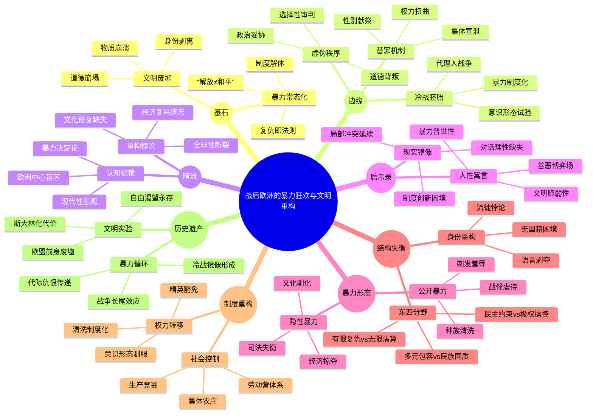

豆瓣链接：https://book.douban.com/subject/26354440/

# 深层解构

### 基石：暴力狂欢下的文明废墟
作者的核心信念如同一条坚韧的锁链，贯穿于全书的论述之中，那便是：二战后的欧洲并非是从战争到和平的简单过渡阶段，而是陷入了一场规模宏大的暴力狂欢，以往被视作文明象征的各种制度，如法律、道德和秩序等，在这场狂欢中如同脆弱的玻璃般支离破碎。从法国街头对所谓“通敌妇女”进行的剃发羞辱仪式，到东欧地区残酷的种族清洗；从希腊内战中各方势力的血腥混战，再到德国战俘营里人性的扭曲沉沦，作者以大量详实的史料为依据，不断向读者强调着一个令人震撼的事实：战争所引发的暴力，就像一个挣脱了束缚的恶魔，在欧洲大陆上肆意游荡，而复仇则成为了当时社会的通行法则。这种对“战后暴力常态化”的深刻认知，彻底打破了人们心中“解放即和平”的美好幻想，将欧洲文明在战争废墟中所面临的残酷现实，毫无保留地展现在了读者面前。

### 边缘：被忽视的文明裂缝
在书中，有一些看似轻描淡写的表述，实则蕴含着能够颠覆传统认知的强大力量。
- **西欧宽容的虚伪面纱**：当作者在书中写下“西欧宽容，东欧不宽容”这一对比时，实际上是在向读者揭示一个被长期掩盖的真相。在西欧，所谓的“宽容”很大程度上只是一种表面现象。例如，法国在战后对纳粹 collaborators（通敌者）的审判，存在着明显的选择性和政治操控，许多真正的战争罪犯因为各种利益关系而逃脱了应有的惩罚。这种“宽容”的背后，是战后西欧各国为了快速实现社会稳定和经济复苏，而不得不采取的一种妥协策略，本质上是对历史正义的一种背叛。
- **性别暴力的替罪羊机制**：书中关于“剃光妇女头发作为替罪羊”的描述，不仅仅是一个关于复仇的故事，更揭示了一种深刻的社会心理机制。在战后那种混乱无序的社会状态下，人们急需寻找一个宣泄集体情绪的出口，而女性往往成为了这种情绪宣泄的无辜受害者。这种将女性身体作为“道德祭坛”的现象，反映出在暴力狂欢的社会氛围中，性别权力结构被进一步扭曲，女性成为了男权社会维持秩序的牺牲品。
- **冷战秩序的暴力胚胎**：作者在书中对东欧“丛林兄弟”反抗运动的描述，看似只是对局部地区冲突的记录，实则暗示了冷战秩序的暴力起源。在美苏两大阵营的对峙下，东欧成为了意识形态的试验场，各种政治势力为了争夺权力，不惜借助暴力手段来巩固自己的统治。这种暴力统治模式，不仅为冷战的长期对峙奠定了基础，也为后来东欧地区的政治动荡埋下了隐患。

### 暗流：未被审视的历史假设
在作者看似客观中立的历史叙述背后，隐藏着一些尚未被明确审视的前提假设，这些假设如同隐藏在海平面下的冰山，虽然没有直接浮出水面，但却深刻地影响着全书的论述逻辑。
- **“欧洲中心论”的隐形枷锁**：尽管作者在书中描绘了欧洲大陆的种种混乱与暴力，但在潜意识里仍然是以欧洲为中心来构建历史叙事的。这种“欧洲中心论”的视角，使得作者在一定程度上忽视了二战对全球其他地区的深远影响，例如亚洲、非洲和拉丁美洲等地区在战后所经历的殖民体系崩溃、民族独立运动等重大历史事件。事实上，二战后的世界秩序重构是一个全球性的进程，欧洲的命运与其他地区的发展紧密相连，而这种全球性的视角在书中并没有得到充分的体现。
- **“暴力决定论”的思维局限**：作者过于强调暴力在战后欧洲历史发展中的作用，将其视为推动历史进程的主要动力，这种“暴力决定论”的思维模式，在一定程度上忽视了经济、文化、意识形态等其他因素对历史发展的综合影响。例如，战后欧洲的经济重建计划（如马歇尔计划）、文化复兴运动以及人们对和平的渴望等因素，都在不同程度上对欧洲的历史发展产生了重要作用。如果仅仅从暴力的角度来解读战后欧洲的历史，就如同只看到了冰山的一角，无法全面、客观地把握历史的全貌。
- **“现代性破产”的悲观预设**：书中对欧洲文明在战后所面临的道德沦丧和秩序崩塌的描述，暗含着一种对现代性的悲观预设，即认为现代文明在战争的冲击下已经彻底破产。然而，这种预设忽略了现代性本身所具有的自我修复和更新能力。事实上，战后欧洲通过建立一系列的国际组织（如欧盟）、完善社会保障制度、推动文化多元化等方式，逐渐实现了从暴力到和平、从混乱到秩序的转变，展现了现代文明在困境中自我救赎的力量。

### 读者启示录
- **顿悟**：这本书实际上并非仅仅是一部关于战后欧洲历史的记录，它更像是一部关于人性的深刻寓言。在战争的废墟上，我们看到的不仅仅是欧洲文明的崩塌，更是人性中贪婪、仇恨、恐惧等阴暗面的集中爆发。而所谓的文明重建，本质上是人类与自身阴暗面不断斗争的过程。
- **惊喜**：当我们打破对西欧“文明典范”的固有认知，会发现暴力的种子在任何社会都有可能生根发芽。这种认知的转变，能够让我们以更加清醒和客观的态度去审视历史和现实，不再盲目地崇拜所谓的“文明优越论”。
- **发现**：作者可能没有意识到，书中所描述的战后欧洲的混乱与暴力，实际上为我们提供了一面反观现代社会的镜子。在当今世界，各种局部冲突、种族矛盾、社会不公等问题依然存在，而战后欧洲的历史经验告诉我们，仅仅依靠武力和暴力手段，永远无法实现真正的和平与稳定。只有通过对话、包容、制度建设和文化创新，才能在人类文明的废墟上重建起更加美好的未来。

# 章节内容
### **第一章 破败**  
罗威以战后欧洲的物理废墟为切入点，指出战争不仅摧毁了城市（如华沙85%建筑被毁），更瓦解了社会运转的基础设施——交通瘫痪、电力中断、医疗系统崩溃。作者强调，这种“破败”不仅是物质的，更是制度的：警察机构瘫痪导致犯罪失控，地方政府消失使基层治理真空。通过波兰农民用德军坦克残骸炼铁、维也纳市民拆毁教堂取建材等案例，揭示欧洲人在生存本能下对文明符号的践踏。核心论点：战后初期的欧洲不是“重建起点”，而是“文明倒退的深渊”，物质崩溃与制度失效互为因果，催生了丛林法则。

### **第二章 离丧**  
聚焦战争对人口的撕裂：欧洲死亡4000万人，其中平民占比超60%。罗威通过匈牙利家庭在苏军强奸潮中被迫目睹妻女受辱、荷兰母亲在饥荒中为换面包送走孩子等案例，揭示“离丧”不仅是生命消逝，更是家庭关系的暴力重构。特别指出，东欧因纳粹和苏军的双重蹂躏，创伤更具叠加性——乌克兰村庄中，10%的女性遭遇系统性强奸，幸存者需在集体沉默中苟活。作者驳斥“战争创伤统一论”，强调不同地区的创伤记忆因施暴者身份（德军、苏军、游击队）而割裂，为后续复仇埋下伏笔。

### **第三章 流徙**  
以1945年的“欧洲大迁徙”为核心，记录4000万流民的生存图景：东线德军战俘徒步返乡，日均死亡2000人；西欧“无国籍者”（如法国阿尔及利亚劳工）被遣返时遭歧视；东欧犹太难民在复国前被困“过渡营”，遭遇波兰村民的二次暴力。罗威特别分析“流徙的悖论”：纳粹“种族秩序”的崩溃反而释放了更野蛮的人口流动，匈牙利德裔被驱赶时，行李中仅允许携带10公斤物品，沿途遭捷克暴民抢劫。核心观点：流徙不仅是地理迁移，更是身份的彻底剥离——当人们失去房屋、证件、语言，“欧洲公民”的概念在1945年荡然无存。

### **第四章 饥荒**  
通过数据与个体叙事结合，揭露战后欧洲的粮食危机：1945年荷兰“饥饿之冬”饿死2.2万人，德国儿童平均身高下降10厘米，希腊农村出现人食马尸的记载。罗威驳斥“饥荒仅属东欧”的偏见，指出西欧同样深陷危机——比利时黑市面包价格是战前400倍，巴黎市民靠煮食郁金香球茎充饥。更关键的是，饥荒激化了社会矛盾：农民囤粮导致城市暴动，救济粮分配成为政治筹码（如意大利共产党以食物换选票）。作者断言：饥饿不仅是经济问题，更是点燃复仇与清洗的“燃料”。

### **第五章 堕落**  
剖析战后道德秩序的崩塌：黑市横行（柏林美军士兵用香烟换少女肉体）、司法瘫痪（法国法院1945年积压80万宗案件）、性暴力常态化（苏军在东普鲁士实施“解放强奸”，受害者超200万）。罗威特别关注“协作式堕落”——挪威市民为获取食物，主动向德军士兵提供情报；匈牙利医生为换药品，参与纳粹人体实验。核心论点：战争将“生存”凌驾于一切道德之上，欧洲人在“受害者”与“加害者”的模糊边界中，集体陷入道德虚无主义，这种堕落为后续的政治暴力提供了社会土壤。

### **第六章 希望**  
在绝望中捕捉微光：瑞典的儿童福利制度、瑞士的难民收容所、丹麦的合作社运动，展现局部重建的可能。罗威强调，“希望”并非源于高层规划，而是基层自发——意大利南部农民组织土地联盟，波兰教师在废墟中重建学校，维也纳爱乐乐团在炸弹坑里举办音乐会。特别指出，这种希望带有强烈的地域性：西欧因马歇尔计划迅速复苏，东欧则因苏联控制陷入停滞。作者警示：1945-1947年的短暂希望期，恰是东西欧裂痕固化的关键，“重建”从一开始就被政治化。

### **第七章 乱象**  
总结第一部的核心：战争遗产不是线性的“破坏-重建”，而是持续的混乱循环。通过希腊游击队抢劫粮车、德国“狼人”组织袭杀盟军、法国抵抗组织私设监狱等案例，揭示战后初年的欧洲本质是“多场内战的叠加”。罗威驳斥“冷战起点1947年”的传统叙事，指出1945年的乱象已埋下东西对抗的种子——当苏军在罗马尼亚扶持共产党，英军在希腊镇压左派，欧洲已沦为“代理人战场”。本章为后续“复仇”“清洗”“内战”三部分奠定逻辑基础：混乱从未结束，只是暴力的形式在演变。

### **第八章 嗜血**  
罗威揭示战后欧洲复仇浪潮的普遍性与失控性，指出其本质是“暴力的民主化”：普通人绕过法律，以私刑处决、肢解甚至食人的极端方式宣泄仇恨。东线苏军士兵将复仇视为“对德军暴行的正当回应”，在东普鲁士割下德军战俘的生殖器；西线法国抵抗组织设立“简易法庭”，仅1944-1945年就处决2.5万通敌者，远超战时德军处决人数。作者强调，复仇的“正当性”因阵营而异——西欧盟军试图约束复仇（如禁止虐待德军战俘），但东欧苏联放任甚至鼓励报复，导致匈牙利、罗马尼亚等地出现“复仇狂欢”。核心论点：复仇并非简单的“正义伸张”，而是战争暴力的惯性延续，其混乱程度远超战时有组织的屠杀，暴露了欧洲文明底线的崩塌。

### **第九章 解放营地**  
聚焦集中营幸存者的复仇行为与心理创伤。罗威通过贝尔根-贝尔森集中营的案例，展现幸存者对前看守的私刑处决——波兰囚犯用汤匙挖掉党卫军眼睛，犹太幸存者强迫看守吞食粪便。盟军初期对这类暴力采取默许态度，美军甚至允许达豪幸存者殴打看守致死。但作者也指出矛盾：部分幸存者拒绝复仇，如丹麦犹太人组织“犹太人委员会”阻止对丹麦籍纳粹的私刑，试图以法律审判重建秩序。核心观点：解放营地成为复仇的“实验室”，这里的暴力既是对极端苦难的宣泄，也预示了战后司法体系面临的挑战——当常规法律无法处理反人类罪行时，以暴制暴成为无奈选择。

### **第十章 有限复仇：奴工**  
讨论战后对奴役者的“有限报复”，主要集中于西欧相对克制的司法清算。法国政府设立“全国甄别委员会”，审判16万涉嫌奴役劳工的通敌者，但仅1.6万人被定罪，且刑罚多为缓刑或罚款。作者认为，这种“有限性”源于现实妥协：法国经济依赖前工厂主恢复生产，政府不得不对曾使用奴工的企业主网开一面。英国对本土纳粹同情者的审判同样乏力，1945年《敌侨法案》仅关押500人，且多数次年获释。核心论点：西欧的“有限复仇”本质是政治精英对稳定的优先考量，法律成为平衡复仇情绪与重建需求的工具，却牺牲了底层受害者的正义诉求。

### **第十一章 德国战俘**  
对比东西欧对德军战俘的不同待遇，揭示意识形态对复仇的影响。在西欧，120万德军战俘被编入“劳动营”，虽受虐待（如法国让战俘清理雷场，死亡率12%），但基本符合《日内瓦公约》；而在东欧，苏军将300万德军战俘送往西伯利亚劳改营，年均死亡率达27%，乌克兰游击队甚至公开处决德军伤兵。罗威特别指出，苏联将战俘视为“活体资源”——通过折磨德国工程师获取V-2导弹技术，强迫女战俘（如德国护士）充当性奴。核心观点：对德军战俘的处置成为东西欧分野的缩影，西欧试图以“再教育”消解仇恨，东欧则将复仇与资源掠夺、政治威慑结合，为冷战阵营对立埋下伏笔。

### **第十二章 无限复仇：东欧**  
深入东欧“无限制复仇”的极端案例，尤其是针对德裔平民的暴力。1945年苏军在柯尼斯堡（今加里宁格勒）实施“三日屠城”，强奸率达60%，男性平民被强迫用牙齿咬断德军战友的手指；波兰“复仇小分队”在驱逐德裔时，故意让儿童目睹父母被处决，再将孩子扔进矿井。作者强调，这种暴力被官方默许甚至制度化——南斯拉夫共产党将“复仇”作为动员手段，要求每个村庄必须处决至少10名德裔居民。核心论点：东欧的复仇已超越个体仇恨，成为政权重建的“清洗工具”，通过系统性暴力清除异质人口，为后续社会主义阵营的同质化铺路，是“种族清洗”的前奏。

### **第十三章 内部敌人**  
转向各国内部对“通敌者”的清算，揭示复仇的“自我净化”性质。法国“剃发羞辱”事件中，2万名与德军有染的女性被公开剃光头、游街，其子女被剥夺公民权；挪威设立“特别法庭”，将1.2万名通敌者流放到北极圈，任其在严寒中自生自灭。罗威指出，这类清算常针对弱势者——荷兰对底层通敌者（如为德军做饭的女仆）处以重刑，却放过高层合作官员（如前市长）。核心观点：对“内部敌人”的复仇本质是社会集体罪责的转移，通过惩罚边缘群体，主流社会得以逃避对自身“灰色协作”的反思，这种选择性正义加剧了战后社会的分裂。

### **第十四章 报复妇孺**  
聚焦对女性及儿童的特殊报复，以法国女演员阿尔莱蒂的审判为典型，分析性别化复仇的象征意义。作者揭示，对“与敌通奸”女性的剃发、殴打，实质是对“国家贞操”的仪式化修复——比利时小城沙勒罗瓦在一天内剃光500名女性头发，市政当局声称此举“净化了民族血脉”。对儿童的报复更隐蔽：德国儿童在波兰被强制改学俄语，匈牙利“通敌者子女”被禁止进入大学，这种“血统惩罚”违背国际法却被广泛接受。核心论点：针对妇孺的暴力是复仇的“软目标选择”，既满足了社会宣泄需求，又避免了对真正掌权者的挑战，暴露了复仇的怯懦与虚伪。

### **第十五章 复仇动机**  
总结复仇的多重驱动因素，驳斥“单一正义论”。罗威提出三层动机：生存层面（如希腊农民因德军抢走最后一头牛而复仇）、意识形态（如南斯拉夫共产党借复仇巩固政权）、心理补偿（如荷兰幸存者通过虐待德裔战俘缓解噩梦）。特别强调“模仿效应”——当德军在战时实施种族灭绝，其受害者在战后自然接受“以牙还牙”的逻辑，形成暴力的代际传递。核心观点：复仇是战争遗留的“道德病毒”，其复杂性远超“善与恶”的二元对立，本质是整个欧洲在文明崩溃后，对秩序重建的绝望性尝试。

### **第十六章 战时选择**  
罗威追溯二战期间欧洲各国对纳粹种族政策的“合作性选择”，揭示这些选择如何为战后种族清洗埋下伏笔。他指出，东欧国家（如匈牙利、罗马尼亚）在战时主动参与对犹太人的驱逐与屠杀，本质是借纳粹势力实现“民族净化”——1941年乌克兰民族主义者配合德军屠杀20万犹太人，战后却声称自己是“苏联受害者”，试图将罪行归咎于外部势力。作者强调，这种“选择性记忆”导致战后清洗的逻辑扭曲：曾协助纳粹的匈牙利箭十字党成员，转而以“反苏英雄”身份加入对德裔的驱逐，将种族仇恨从犹太人转向德国人。核心论点：战时各国对种族政策的“实用主义选择”，使战后清洗成为对历史矛盾的暴力清算，而非真正的正义追求，本质是用新的种族暴力掩盖旧的协作罪责。

### **第十七章 犹太难民**  
聚焦战后犹太幸存者的艰难处境，罗威揭示欧洲对犹太人的排斥如何延续甚至加剧。1945年，约15万犹太难民被困在德国“流离失所者营地”，遭遇波兰、匈牙利等地的反犹暴力——1946年基尔切夫 pogrom 中，42名犹太人被波兰暴民活活烧死，而波兰政府竟称“死者是德国间谍”。作者指出，犹太难民的困境不仅是物质匮乏，更是身份认同的彻底崩塌：他们被剥夺故国公民权（如罗马尼亚取消1941年前的犹太国籍），又因以色列尚未建国而无家可归。国际社会的冷漠（如英国拒绝开放巴勒斯坦移民配额）迫使犹太人最终通过“布里查”地下组织武装迁徙，奠定以色列建国的难民基础。核心观点：战后欧洲对犹太人的系统性排斥，本质是对纳粹种族灭绝的“隐性共谋”，迫使犹太人彻底离开欧洲，完成了历史上最大规模的犹太离散。

### **第十八章 乌克兰与波兰之种族清洗**  
详细描述1945-1947年波乌边境的双向种族清洗，罗威指出这是战后欧洲最系统化的人口交换之一。波兰政府以“边界调整”为名，将500万乌克兰人（含加利西亚希腊天主教徒）驱逐至苏联乌克兰，同时将100万波兰人从苏联控制的西乌克兰迁回。驱逐过程充满暴力：乌克兰游击队（UPA）袭击波兰移民列车，波兰军队则焚烧乌克兰村庄，强迫居民在寒冬徒步迁徙，死亡率达15%。作者强调，这场清洗被两国政府包装为“民族统一工程”——波兰通过《维斯瓦河行动》消灭境内乌克兰族，苏联则借“人口同质化”巩固对西乌克兰的控制。核心论点：波乌种族清洗是“地缘政治与种族意识形态的双重产物”，以“安全需要”为名，完成了对多民族混居地带的暴力清零，为现代东欧单一民族国家的形成奠定血腥基础。

### **第十九章 驱逐德裔**  
聚焦战后对德裔的大规模驱逐，罗威揭示这是欧洲历史上最大规模的“合法暴力”。根据1945年波茨坦会议决议，捷克、波兰、匈牙利等国将1200万德裔平民驱逐至德国，过程中充斥抢劫、强奸与屠杀——捷克“贝奈斯法令”允许没收德裔财产，苏台德地区的德裔儿童被强迫饮用汽油致死，匈牙利边境士兵将德裔家庭驱入雷区。作者特别指出，驱逐的“制度化”体现在细节：东普鲁士的德裔仅允许携带“150公斤行李+10马克”，西里西亚的德裔妇女被集体剃光头，作为“纳粹帮凶”的象征。核心观点：对德裔的驱逐本质是“胜利者的种族清洗”，表面遵循国际协议，实则是东欧国家借战后秩序重建，彻底清除历史上的德意志影响，为社会主义阵营的“同质化改造”扫清障碍。

### **第二十章 欧洲缩影：南斯拉夫**  
以南斯拉夫为例，展现多民族国家在战后如何沦为种族清洗的实验室。罗威指出，铁托的共产党政权为巩固统治，放任克罗地亚乌斯塔沙与塞尔维亚切特尼克的互相屠杀——1945年5月，5万名克罗地亚难民在“流血 oath”行动中被塞族军队集体处决，尸体投入多瑙河。更致命的是意识形态与种族仇恨的结合：斯洛文尼亚共产党以“阶级敌人”名义清洗意大利裔地主，马其顿政府将阿尔巴尼亚族视为“土耳其间谍”进行驱逐。作者强调，南斯拉夫的悲剧在于“用新的暴力循环取代旧的帝国秩序”，铁托的“兄弟团结”口号下，是对各民族文化认同的系统性摧毁。核心观点：南斯拉夫的种族清洗是整个欧洲战后困境的缩影——当多民族共存的旧框架被战争击碎，各国选择用“单一民族国家”的暴力重构，而非真正的多元包容。

### **第二十一章 西欧宽容，东欧不宽容**  
对比东西欧在处理少数族裔问题上的分野，罗威揭示背后的政治逻辑差异。在西欧，法国允许阿尔及利亚移民留居（尽管存在歧视），比利时给予瓦隆人与弗拉芒人文化自治，荷兰设立专门机构帮助德裔儿童重返社会。这种“相对宽容”源于民主制度的约束——1946年法国宪法明确禁止基于种族的歧视，迫使政府限制地方对德裔的暴力。而在东欧，苏联模式要求“民族同质化”：保加利亚驱逐12万土耳其人，罗马尼亚将匈牙利族强制迁入集体农庄，借口是“防止间谍渗透”。作者强调，这种差异并非“文明程度”之分，而是政权性质的产物：西欧需要通过多元包容稳定社会，东欧则依赖种族清洗巩固极权统治。核心观点：东西欧在少数族裔政策上的对立，本质是两种政治体制（民主vs极权）在战后秩序重建中的不同选择，直接塑造了冷战欧洲的社会形态。

### **第二十二章 混战**  
总结战后欧洲内战的普遍性，罗威提出“多场内战叠加”理论：1945-1949年的欧洲并非单一和平过渡期，而是二战的“暴力长尾”。希腊君主派与共产党的游击战（1944-1949）导致30万人死亡，意大利“红色旅”与右翼“黑衫军”在北部工业区持续火拼，法国“马基”抵抗组织转型为地方武装，控制马赛的黑市交易。作者特别指出，这些内战的共同点是“意识形态化的暴力平民化”——希腊游击队处决支持君主制的村民，意大利右翼焚烧左翼工会据点，双方都以“革命”或“反恐”名义实施无差别屠杀。核心论点：战后内战是战时抵抗运动的恶性延续，当国家机器失效，各政治势力通过暴力争夺基层控制权，使欧洲陷入“国家权威真空下的野蛮竞争”。

### **第二十三章 法国与意大利之政治暴力**  
深入分析西欧两大国的政治暴力，罗威揭示民主制度下的“合法暴力”与“隐性清洗”。在法国，1944-1945年的“净化运动”表面通过司法程序审判通敌者，实则充满政治操控——戴高乐政府赦免70%的维希官员，却重判底层合作者（如为德军洗衣的妇女），暴露“精英豁免”原则。意大利的“红色恐怖”与“黑色恐怖”则体现阶级对立：北部工人占领工厂时处决厂主，南部地主武装屠杀农民协会成员，1947年“都灵血周”中，12名左翼示威者被警察当场射杀。作者强调，两国的政治暴力本质是“战后权力重组的阵痛”——法国通过清洗巩固戴高乐派权威，意大利则因共产党的强势（1946年获30%选票）引发右翼反扑，为北约与华约的阵营划分提供了国内土壤。

### **第二十四章 希腊内战**  
将希腊内战定义为“冷战的第一场热战”，罗威揭示其双重属性：既是国内左右派的权力斗争，也是美苏对抗的预演。1946年，希腊共产党领导的“希腊人民解放军”控制北部山区，得到南斯拉夫与保加利亚支持，而政府军依赖英军装备与美国资金（1947年杜鲁门主义首次实践）。双方均实施恐怖政策：共产党处决3万名“阶级敌人”，政府军则在“焦土行动”中摧毁1500个村庄，导致50万平民流离失所。作者特别指出，希腊内战的转折点是1948年铁托与斯大林决裂——失去南斯拉夫支援的希共迅速溃败，预示了东欧共产党对苏联的绝对依赖。核心观点：希腊内战不仅决定了希腊的政治走向，更标志着欧洲正式进入“两大阵营代理人战争”的时代，战后初年的混乱至此被纳入冷战秩序。

### **第二十五章 反客为主：罗马尼亚**  
剖析罗马尼亚如何从“德国盟友”转变为“苏联卫星国”，罗威揭示极权政权的建立逻辑。1945年，苏联红军扶持的罗马尼亚共产党通过“清洗-恐吓-渗透”三步曲掌权：首先处决5000名前铁卫团成员，再将10万“资产阶级”投入多瑙河劳工营（死亡率40%），最后通过“土地改革”剥夺地主财产，制造对新政权的经济依赖。作者强调，这种“反客为主”的关键是利用民众对旧政权的不满——国王米哈伊一世的退位演说中，民众高呼“我们要苏联式的生活”，却不知迎来的是更严酷的极权统治。核心论点：罗马尼亚的案例证明，战后东欧政权更迭并非“解放”，而是“征服者的权力让渡”，苏联通过支持本地共产党，将战时的军事占领转化为制度化控制，开启了东欧的“斯大林化”进程。

### **第二十六章 驯服东欧**  
总结苏联对东欧的系统性改造，罗威指出这是“军事占领+意识形态清洗+经济殖民”的组合拳。在波兰，统一工人党处决15000名“民族主义游击队”（如“家乡军”），并将教会财产收归国有；在匈牙利，拉科西政权制造“拉伊克冤案”，处决3000名“铁托分子”，建立恐怖统治；经济上，经互会要求东欧各国为苏联提供廉价原材料（如保加利亚90%的烟草出口苏联），导致本地工业崩溃。作者特别强调“文化驯服”的重要性——捷克斯洛伐克的学校禁用德语教材，保加利亚强制推行西里尔字母，试图从语言文化层面根除“西方影响”。核心观点：苏联对东欧的“驯服”本质是建立“帝国式的卫星体系”，通过暴力清除异见、摧毁传统精英阶层，将东欧变为莫斯科的经济附庸与意识形态殖民地，完成了对欧洲大陆的地缘政治切割。

### **第二十七章 “丛林兄弟”之反抗**  
关注波罗的海三国（爱沙尼亚、拉脱维亚、立陶宛）的游击反抗运动，罗威揭示苏联控制下的“非正规战争”。1945-1953年，约5万名“丛林兄弟”战士在森林中坚持抵抗，采取伏击苏军运输队、破坏铁路、暗杀苏维埃官员等手段，爱沙尼亚的“狼人”组织甚至发行地下报纸《晨星》。作者指出，这些反抗者的悲剧在于孤立无援——西方盟国默认苏联对波罗的海的控制，当地民众因恐惧报复而不敢支持游击队，导致1950年代后反抗逐渐平息。核心观点：“丛林兄弟”的抗争是东欧对苏联统治的首次大规模武装抵制，虽因实力悬殊失败，却成为冷战期间“欧洲未被解放国家”的象征，证明即使在最严酷的极权统治下，民间对自由的渴望从未熄灭。

### **第二十八章 冷战镜像**  
对比东西欧在战后十年的分野，罗威构建“冷战镜像”理论：西欧通过马歇尔计划（1948-1952年获130亿美元援助）重建福利国家（如英国NHS），东欧则在经互会框架下建立计划经济（匈牙利1949年工业国有化率达98%）；西欧形成多元政党制（如德国基督教民主联盟），东欧则确立一党专政（波兰统一工人党党员数1949年激增400%）；更深刻的是社会心态的分裂——西柏林市民在废墟中举办摇滚音乐会，东柏林工人却在“生产竞赛”中被强制加班。作者强调，这种“镜像”并非天然对立，而是战后初年各国对混乱的不同回应：西欧选择用资本主义+民主制度化解矛盾，东欧选择用社会主义+极权主义压制矛盾，本质是两种秩序重建路径的竞争。核心观点：冷战的“铁幕”并非突然降下，而是从1945年的复仇、清洗、内战中逐渐凝结，欧洲的分裂早在追求稳定的不同选择中埋下伏笔。

### **结语**  
罗威在结语中重申核心观点：1945-1949年的“野蛮大陆”并非欧洲的“例外状态”，而是理解现代欧洲的钥匙。战后的暴力（复仇、清洗、内战）本质是对战争遗留问题的“外科手术式解决”——用新的流血试图终结旧的仇恨，却在东西欧分别催生了两种稳定：西欧通过民主协商与经济整合走向联合，东欧通过极权控制与意识形态统一实现稳定。作者警示，今日欧洲的繁荣建立在对这段历史的选择性记忆上——当我们歌颂“欧盟奇迹”时，不应忘记其前身是充满血腥的废墟，而唯有正视“野蛮”的过去，才能避免文明再次崩塌。核心结论：二战后的欧洲重建，本质是“在暴力中寻找秩序”的实验，其成功与失败共同塑造了今日的欧洲格局，而这段历史的真正遗产，是对人性之恶与制度韧性的永恒反思。