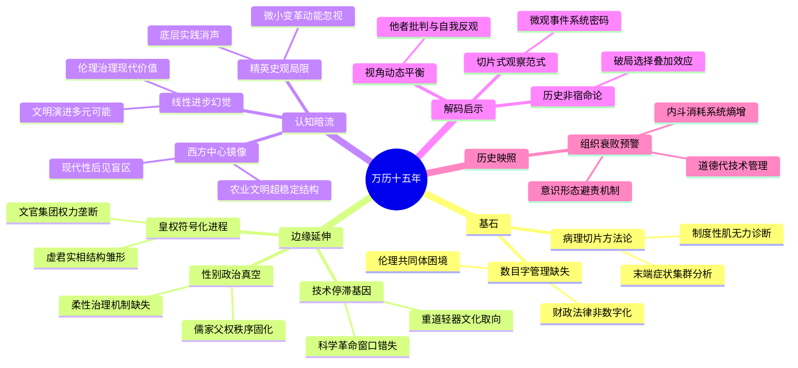

豆瓣链接：https://book.douban.com/subject/1041482/

# 深层解构

### 一、基石：大历史观下的“病理切片”思维
黄仁宇的核心信念，藏在他对“末端小节”的偏执关注里。  
- **以“元症状”解构帝国慢性病**  
他拒绝把明朝灭亡归咎于某个人（如万历）或某事件（如萨尔浒之战），而是将1587年作为“病理切片”——万历怠政、申时行调和术、张居正改革遗产、海瑞的道德困境、戚继光的军事孤立、李贽的思想撕裂，这些“症状”共同指向一个根本矛盾：**当庞大帝国依赖道德伦理代替技术官僚体系，用四书五经的模糊哲学管理千万平方公里的复杂社会时，必然陷入“制度性肌无力”**。  
- **“数目字管理”的隐性呼唤**  
书中反复强调“法律缺乏创造性”“税收实物化”“缺乏统一商业规则”，本质是在批判中国传统治理的“非数字化”——无法用精确的财政、法律、军事数据实现现代国家的理性运转。这构成黄仁宇史观的底层逻辑：**中国近代史的困境，始于前现代帝国未能完成从“伦理共同体”到“技术共同体”的转型**。

### 二、边缘：被轻描淡写的思想爆破点
1. **皇权“符号化”的现代性隐喻**  
书中提到弘治皇帝需“央求”大臣免朝、万历早期受制于张居正/冯保，暗示明朝皇权已从“绝对权力”退化为“象征性权威”。这与传统“君主专制顶峰”的认知相悖，实则揭示：**当文官集团通过科举制度垄断治理权，皇权被迫退居道德神坛，形成“虚君实相”的雏形**。这种结构若遭遇外部挑战（如明末边患），极易因权威真空导致系统崩溃——这恰为近代“君主立宪”的历史伏笔，却被黄仁宇轻轻放过。  

2. **女性缺席的政治暗线**  
全书唯一女性角色是郑氏贵妃，其与王氏的储位之争被视为“政治斗争契机”。但更深层的问题是：**在儒家伦理构建的帝国秩序中，女性被彻底排除在权力话语之外，连后宫干政都只能以“枕头风”的畸形形式存在**。这种性别盲区，折射出传统治理的全面父权化——而当帝国需要柔性平衡时（如万历后期的君臣僵局），缺乏任何女性视角的政治体系，只会在刚性对抗中走向碎裂。  

3. **技术停滞的文化基因**  
书中提到“宗旨善良不能补助技术之不及”，但未深挖：**儒家“重道轻器”的价值取向，如何将数学、工程、商业视为“奇技淫巧”，导致中国错失与欧洲同步的科学革命窗口期**。当伽利略在比萨斜塔做实验时（1589年，万历十七年），中国士人正埋首八股，这种文化选择的分野，比政治制度更深刻地决定了文明走向。

### 三、暗流：未被审视的认知前提
1. **“西方中心论”的镜像陷阱**  
黄仁宇的“大历史观”暗含对比坐标系：西欧在1587年走向民族国家与海洋扩张，中国却在“以道德代法律”中循环。这种二元对立虽有助于揭示问题，却可能忽略：**中国传统治理的“非技术化”，曾在农业文明阶段实现超稳定结构（如唐宋的繁荣），其缺陷是在工业文明冲击下才被放大**。将明朝直接对标文艺复兴后的欧洲，某种程度上是用“现代性后见之明”苛责前现代文明。  

2. **精英史观的无意识延续**  
书中聚焦皇帝、首辅、名将、思想家，却鲜见平民视角——占人口90%的农民、手工业者、商人，在“大历史”中沦为沉默的背景板。这暴露了传统史学的共同局限：**当我们用“关键人物/事件”构建历史逻辑时，可能忽略了真正推动社会变革的，往往是底层缓慢积累的微小实践（如江南纺织业的资本主义萌芽）**。黄仁宇批判了细节的琐碎，却又陷入了“大人物决定论”的另一种琐碎。  

3. **线性进步观的历史幻觉**  
“大历史观”预设了一个隐含目的：中国必须走向西方定义的“现代性”。但历史是否必然指向“数目字管理”？当今天我们反思数字化治理的异化（如算法专制），或许该追问：**明朝的“伦理治理”是否完全没有现代价值？其强调社会和谐、抑制资本过度扩张的理念，可否成为反思现代性的思想资源？** 黄仁宇的手术刀切开了病灶，却未想象另一种文明演进的可能性。

### 四、解码启示：当我们重读《万历十五年》时，究竟在重读什么？
- **对“宏大叙事”的再解构**：不是记住“1587年是明朝转折点”，而是学会用“病理切片”思维观察任何时代——那些看似无关紧要的“小事”，往往藏着社会系统的真正密码。  
- **对“历史必然性”的警惕**：黄仁宇用“大历史”揭示了明朝的结构性困局，但我们更要看到：每个困局中都存在破局可能（如张居正改革曾短暂激活体制）。历史不是宿命，而是无数选择的合谋。  
- **对“他者视角”的自觉**：作为美籍华裔学者，黄仁宇的“西方眼+中国心”视角既带来洞见（如对制度缺陷的批判），也带来盲区（如文化主体性的缺失）。这种张力提醒我们：**真正的历史理解，需要在“他者批判”与“自我反观”之间保持动态平衡**。

### 结语：穿透历史的X射线，照见当下的影子
《万历十五年》的终极价值，不在于给明朝开死亡诊断书，而在于为所有庞大系统敲响警钟：**当一个组织（国家/企业/任何共同体）陷入“用道德口号代替制度创新”“用意识形态回避技术问题”“用精英内斗消耗系统能量”时，1587年的故事就会不断重演**。黄仁宇没说的是：历史的“大”，从来不是时间尺度的大，而是对人性与制度洞察的深——这种洞察，让我们在阅读明朝时，照见了所有时代的镜子。

# 章节内容
### 自序
黄仁宇先生开篇便点明以万历十五年（1587 年）为叙述核心的缘由，此年在历史长河中看似平淡无奇，却如平静海面下的暗涌，蕴含着足以撬动整个明朝社会架构的诸多矛盾因子。他秉持“大历史观”，这种观念超脱于传统历史叙述的微观事件罗列，试图从宏观层面，跨越时间与空间的局限，深入剖析明代政治、经济、军事、文化等各个维度的内在联系与发展脉络。例如，他提到过去的历史著作往往侧重于帝王将相的个人事迹或单一历史事件的记载，而他则要挖掘出这些表象背后隐藏的社会结构与历史趋势。通过对这一年的深度解读，旨在让读者犹如透过管中窥豹的小孔，却能领略明代历史全貌，进而理解现代中国的发展根基与演进路径，从历史的得失中汲取经验教训，以更好地把握当下与未来。

### 第一章 万历皇帝
万历皇帝朱翊钧登基之时，年仅九岁，朝政大权旁落于内阁首辅张居正与司礼监掌印太监冯保之手。在这一时期，张居正凭借卓越的政治才能与强大的政治手腕，推行了一系列大刀阔斧的改革举措，如财政上的“一条鞭法”，极大地改善了明朝的财政状况，使得国家在万历初期呈现出一片中兴繁荣之象。张居正不仅在政治经济领域掌控全局，还对年幼的皇帝进行严格的教育与管束，要求皇帝遵循儒家礼仪规范，刻苦学习政务知识。然而，这种过度的掌控在张居正死后引发了强烈的反弹。万历皇帝亲政后，在立储问题上与文官集团产生了不可调和的矛盾。按照明朝的祖制与文官集团所秉持的儒家正统观念，皇位继承人应遵循嫡长子继承制，而万历皇帝却偏爱郑贵妃所生的三子朱常洵，意图立其为太子。这一想法遭到了文官集团的坚决抵制，他们以各种方式向皇帝施压，如大规模的联名上奏、朝堂上的据理力争等。万历皇帝在这场长达数年的立储之争中逐渐意识到，自己虽贵为天子，却无法随心所欲地决定自己的家事，更难以突破文官集团所构建的强大政治与道德舆论网。在极度的挫败感之下，万历皇帝开始对朝政采取消极怠工的态度，减少上朝次数，对大臣们的奏疏也常常留中不发，朝廷内部的党派纷争也因立储问题的僵持而日益激烈，各方势力围绕着这一核心矛盾展开了复杂的政治博弈，严重削弱了明朝政府的行政效率与决策能力。

### 第二章 首辅申时行
申时行在张居正之后继任内阁首辅之位，他深刻洞察到皇帝与文官集团之间矛盾的尖锐性与复杂性。与张居正的强势改革风格不同，申时行试图以一种更为温和、迂回的方式来维持朝廷的稳定与平衡，他所推行的“恕道”理念，旨在倡导各方相互包容、妥协。例如，在处理政务时，他不像张居正那样雷厉风行地推行自己的政策主张，而是注重协调各方利益关系，尽量避免激化矛盾。然而，在立储这一关键问题上，申时行却陷入了极为尴尬的困境。他一方面深知皇帝的心意，试图在一定程度上维护皇帝的颜面与意愿；另一方面，他又无法忽视文官集团的强烈反对声音以及儒家传统观念的巨大影响力。他曾多次在皇帝与文官集团之间进行斡旋沟通，但均未能取得实质性的成果。如他曾委婉地向皇帝进言，希望皇帝能够考虑文官集团的意见，同时也向文官集团传达皇帝的苦衷，但这种骑墙的做法既未能让皇帝满意，也未能获得文官集团的信任。最终，在立储问题久拖不决、朝廷内部矛盾日益尖锐的情况下，申时行因无法有效平衡各方利益而被迫辞职。这一事件充分展现了明朝政治体制中内阁首辅这一角色的艰难处境，他们既要承担治理国家的重任，又要在皇权与文官集团的权力博弈中小心翼翼地行走，稍有不慎便会陷入万劫不复之地。

### 第三章 世间已无张居正
张居正生前，凭借着皇帝的高度信任与自身的非凡魄力，在明朝的政治舞台上独领风骚。他大力推行改革，在政治方面，通过考成法加强中央集权，对各级官员进行严格考核，使得政令得以有效执行，官场风气在一定程度上得到整肃；在经济领域，“一条鞭法”的实施简化了税收制度，促进了商品经济的发展，增加了国家财政收入；在军事上，任用戚继光等名将加强边防建设，有效抵御了外敌入侵。例如，在推行考成法时，张居正规定各级官员必须在规定时间内完成政务任务，并定期进行考核检查，对于未能按时完成任务的官员进行严厉惩处，这使得官场中推诿扯皮的现象大大减少。然而，张居正的权力高度集中也引发了诸多弊端。他在生活上奢华无度，出行时的仪仗规格远超其身份地位所应有的标准，这种行为引起了众多官员与士人的不满。同时，他在改革过程中独断专行，对反对者毫不留情地打压，树敌众多。在他死后，被曾经的政敌抓住把柄，遭到大规模的清算。他所推行的改革措施，由于触动了太多既得利益集团的利益，且在推行过程中过于依赖个人权威，缺乏制度性的保障，在他死后大多被废除。这一过程深刻地反映出明朝政治的复杂性，改革者在缺乏有效制度支撑与广泛社会共识的情况下，往往难以实现长远的改革目标，且容易在政治斗争中成为牺牲品。

### 第四章 活着的祖宗
在明朝独特的政治体制与文化氛围下，皇帝虽然在名义上拥有至高无上的权力，但实际上却受到祖制与文官集团的多重制约，逐渐沦为一种礼仪象征。例如，皇帝的日常起居、言行举止都必须严格遵循祖制的规定，从祭祀典礼到朝会仪式，每一个环节都有繁琐的礼仪规范需要遵循。万历皇帝在立储问题上的抗争便是一个典型案例。他试图打破传统的嫡长子继承制，立自己喜爱的儿子为太子，但这一行为遭到了文官集团的强烈抵制。文官集团以祖制和儒家经典为依据，认为立储之事关乎国家根本，必须遵循正统原则。他们通过大规模的舆论攻势，如朝堂上的谏言、民间的舆论引导等方式，向皇帝施加巨大压力。万历皇帝在这场斗争中深刻体会到自己的无力感，他发现自己的任何决策都难以突破文官集团所构建的强大道德与政治框架。即使他贵为天子，也无法在违背文官集团意愿的情况下顺利推行自己的想法。这种皇权受限的现象进一步加剧了他对朝政的消极态度，他开始以消极怠工的方式来表达自己对这种政治体制的不满与无奈，而这也使得明朝政治体制中的矛盾更加激化，朝廷内部的政治生态逐渐恶化，成为明朝政治走向衰落的一个重要转折点。

### 第五章 海瑞——古怪的模范官僚
海瑞，作为明朝清官的典型代表，一生都严格遵循儒家的道德规范，将廉洁奉公、公正执法视为自己的为官准则。在地方施政过程中，他致力于打击豪强地主，为百姓伸张正义。例如，在他任职地方官时，曾坚决打击当地的恶霸势力，不顾这些恶霸背后的权贵关系，依法严惩他们的不法行为，使得当地百姓的生活得到一定程度的改善。他在生活上极为简朴，甚至到了苛刻的程度，穿粗布衣服，吃简单饭菜，这种清廉的作风在当时的官场中显得格格不入。然而，海瑞的这种刚正不阿的性格与行事风格却使他在官场中陷入孤立无援的境地。他不懂得官场中的人情世故与潜规则，在处理政务时往往过于直接、强硬，不考虑同僚的利益与感受。例如，他曾向上司提出一些过于严苛的廉政要求，使得上司对他颇为不满。他的这种理想主义的施政方式在现实政治环境中难以长期推行，虽然他赢得了百姓的爱戴与赞誉，但在官场同僚眼中，他却是一个“古怪”的存在，这也导致他的仕途充满坎坷，多次被贬谪或被闲置，难以在更大范围内施展自己的政治抱负，反映出当时道德观念与现实政治之间存在着巨大的冲突，理想主义官僚在复杂的官场环境中面临着重重困境。

### 第六章 戚继光——孤独的将领
戚继光在明朝军事史上占据着极为重要的地位，他凭借着卓越的军事才能与敏锐的军事洞察力，在抵御外敌入侵方面取得了一系列令人瞩目的成就。面对明朝军队当时存在的诸多弊端，如军队纪律涣散、战斗力低下、军事装备落后等问题，他进行了大刀阔斧的军事改革。他创建了“戚家军”，通过严格的军事训练，使士兵们具备了高度的纪律性与强大的战斗力。例如，他制定了详细的训练计划，包括体能训练、战术演练、兵器使用等方面，要求士兵们严格遵守。在抗倭战争中，“戚家军”凭借着鸳鸯阵等独特的战术，多次击败倭寇，为保卫沿海地区的百姓生命财产安全立下了汗马功劳。在平定北方边疆的蒙古部落侵扰时，他也展现出了出色的军事指挥才能，修筑长城，加强边防防御体系，有效地遏制了蒙古骑兵的南下。然而，戚继光的军事成就离不开张居正的支持。在明朝重文轻武的政治格局下，武将的地位相对低下，军事行动往往受到文官集团的制约。张居正在世时，能够为戚继光提供政治庇护与资源支持，使得他的军事改革与军事行动得以顺利开展。但张居正死后，戚继光失去了政治靠山，在文官集团的政治斗争中逐渐失势。他被调往远离军事前线的地区任职，最终在郁郁寡欢中度过余生。这一经历深刻地反映出明朝军事制度的腐朽与弊端，武将在文官主导的政治体制下难以充分发挥自己的军事才能，国家的军事建设与国防安全也因此受到严重的阻碍。

### 第七章 李贽——自相冲突的哲学家
李贽是明朝思想界一位极具反叛精神的思想家，他对传统的儒家思想提出了大胆的质疑与挑战。他倡导个性解放，反对儒家思想中对人性的压抑与束缚，认为人应该追求自己的真实欲望与个性发展。例如，他在著作中提出“穿衣吃饭，即是人伦物理”的观点，强调物质生活与人性需求的合理性，这与传统儒家强调的“存天理，灭人欲”的观念形成了鲜明的对比。他还对封建礼教的一些繁文缛节进行了批判，认为这些礼教规范在一定程度上限制了人的自由与创造力。然而，李贽又无法完全摆脱传统思想的束缚，他的思想体系中仍然保留着许多儒家思想的元素。他虽然批判封建礼教，但又对一些儒家经典人物表示尊重；他倡导个性解放，但在行为举止上仍难以完全突破传统道德规范的限制。这种思想上的矛盾使他在当时的社会中引起了极大的争议。他的著作被视为异端邪说，遭到官方的查禁，他本人也最终被捕入狱，并在狱中自杀。李贽的遭遇充分展现了明朝思想界新旧观念的激烈碰撞与冲突，传统思想在当时仍然占据着统治地位，具有强大的影响力，而新兴的思想观念在突破传统束缚的过程中面临着巨大的压力与阻力。 