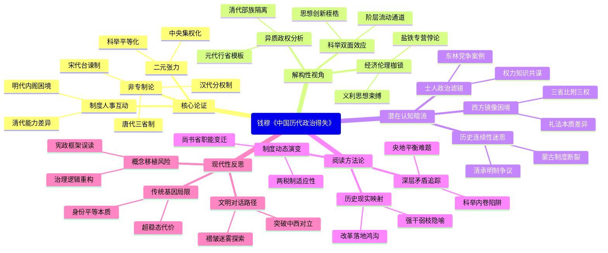

豆瓣链接：https://book.douban.com/subject/30206893/

# 深层解构

### 一、基石：被反复擦拭的青铜镜——钱穆的核心论证支点
1. **「传统政治非专制论」的历史祛魅**  
   钱穆以「汉唐宋明清」五代政治制度为解剖标本，反复驳斥「中国两千年专制黑暗」的单线史观。他通过汉代「皇室与政府分离」（如宰相统领的外朝与皇帝的内廷分权）、唐代三省六部制的权力制衡（中书草拟、门下审核、尚书执行）、宋代台谏制度对皇权的规训等具体制度，证明传统政治存在「理性化治理架构」，而非简单的皇权独裁。  
   **潜台词**：现代中国人对传统的批判需先「理解之同情」，而非以西方宪政为唯一尺度做价值裁判。

2. **「制度-人事」双螺旋模型**  
   书中贯穿「制度必须与人事相配合」的核心命题。钱穆指出，明代废丞相设内阁，初衷是加强皇权，但因缺乏制度性制衡，导致宦官专权；清代军机处看似集权，实则因皇帝个人能力差异（如康乾与嘉道的对比）而效能悬殊。  
   **现实投射**：暗批辛亥革命后「重制度轻人事」的改革误区——照搬西方制度却忽视文化土壤与执行主体，终将沦为条文游戏。

3. **「历史趋势的二元张力」**  
   钱穆提炼出传统政治的两大趋势：  
   - **向上的平等化**：从汉代察举制打破贵族垄断，到唐代科举制推动社会流动，再到宋代「平铺社会」消解门阀，他强调中国早于西方实现「政治参与权的普遍化」。  
   - **向下的集权化**：从汉刺史监察地方到清督抚成为朝廷附庸，中央对地方的控制逐层收紧，导致「地方政治日趋衰落」。  
   **矛盾性**：这两种趋势看似悖论，实则共同构成传统政治的「稳态结构」——用平等化吸纳社会精英，以集权化维持国家统一，但也埋下近代地方活力枯竭的伏笔。

### 二、边缘：思想光谱的衍射光——被轻拂而过的颠覆性洞见
1. **「部族政权」的特殊病理**  
   钱穆将元清定义为「部族政权」（与汉唐宋明的「士人政权」相对），指出其本质是「少数族群对多数族群的军事统治」。他轻描淡写地提到清代「各禁区」制度（如东北不准汉人开垦、台湾限制移民），却未深入挖掘：这种「防范式统治」如何塑造了中国政治中的「猜疑链」传统？它与现代民族国家的建构逻辑存在何种根本冲突？  
   **启示**：传统政治的「正常态」与「变态」（部族政权）之分，或许隐含对「中华性」的重新定义——当统治集团以「非我族类」的心态治国时，制度理性会退化为权术博弈。

2. **「经济制度的道德枷锁」**  
   书中对汉代「限田令」、唐代「租庸调制」、明代「一条鞭法」的分析，侧重制度设计的合理性，却较少提及：儒家「重义轻利」思想如何束缚了经济制度的创新空间？比如，宋代商业发达却未能催生资本主义，是否与士大夫阶层对「资本集聚」的道德警惕（如王安石变法被斥为「与民争利」）有关？  
   **暗门**：传统政治的「节制资本」政策，既是防止贫富分化的良政，也是阻碍社会转型的枷锁，这种「义利之辨」的深层矛盾，至今仍在影响中国的改革路径。

3. **「考试社会的双面刃」**  
   钱穆盛赞科举制打破阶级固化，却对其「八股取士」的僵化一笔带过。试想：当「万般皆下品，唯有读书高」成为全民共识，技术发明、商业创新等「非正统价值」如何获得生存空间？这种「智力资源的体制性吸附」，是否为近代中国科技落后埋下伏笔？  
   **颠覆视角**：科举制不仅是「平等的阶梯」，更是「思想的囚笼」，它将精英的创造力导向伦理阐释，而非自然探索与制度创新。

### 三、暗流：冰层下的潜流——未被审视的论证前提
1. **「士人政治的道德滤镜」**  
   钱穆默认「士大夫集团代表公共理性」，但忽略了：当士人阶层与皇权形成「共生关系」（如明代内阁首辅需依附皇权才能推行改革），其「为民请命」的理想常沦为党争工具。东林党与齐楚浙党的混战、清末清流误国的教训，都暗示「士人政治」未必等于「良治」。  
   **陷阱**：过度美化「士大夫精神」，可能掩盖传统政治中「权力-知识」的合谋本质，忽视对制度性监督机制的需求。

2. **「历史连续性的假设」**  
   书中以「汉唐宋明清」为线性叙事，隐含「中国政治文明一脉相承」的前提。但蒙古灭宋、清军入关等「断裂性事件」，是否已深刻改变了传统政治的基因？比如，元代「废尚书省、设行省制」的军事化治理模式，可能为明清集权提供了异质模板，而非简单的「制度延续」。  
   **质疑**：将元清纳入「传统政治」的连续谱系，是否淡化了「征服王朝」对中原制度的扭曲性改造？这涉及「中国史」的主体性界定问题。

3. **「西方参照系的隐形支配」**  
   钱穆虽反对用「专制」标签否定传统，但论证中仍不自觉以西方为镜像——如用「三权分立」比附唐代三省制，用「地方自治」对照汉代郡县制。这种「比附论证」的危险在于：可能将中国政治的独特逻辑（如「礼治」与「法治」的差异）纳入西方理论框架，导致本质性误读。  
   **反思**：真正的文化自觉，或许需要跳出「中西优劣」的二元对立，在更具包容性的文明尺度下重新理解传统。

### 四、给读者的三把钥匙：如何穿透文字的岩层
1. **读「制度」不如读「变奏」**  
   不要止步于各朝代制度的「静态图谱」，而要观察制度如何因人事（如帝王能力、官僚集团博弈）而变形。比如，同样是尚书省，汉代是执行机构，唐代成为政务中枢，明代则被内阁架空——这种「制度的弹性」，才是理解传统政治活力与局限的关键。

2. **读「得失」不如读「困境」**  
   钱穆的「得失」判断常服务于「传统政治可改良」的论点，但更值得追问的是那些「无解困境」：  
   - 如何平衡中央集权与地方活力？（汉代刺史从监察官变为地方官，最终形成割据）  
   - 如何既吸纳社会精英又防止阶层固化？（科举制后期沦为智力内卷）  
   这些困境的现代转化，或许比「借鉴某朝某制」更具现实意义。

3. **读「历史」不如读「隐喻」**  
   书中处处可见对现代中国的隐喻：  
   - 宋代「强干弱枝」导致边防疲弱，恰似民国中央与地方的博弈；  
   - 清代「部族政权」的防范思维，影射近代民族国家建构的认同危机；  
   - 「制度与人事」的辩证，直指当下改革中「顶层设计」与「执行落地」的鸿沟。  
   钱穆的真正价值，不在于提供历史答案，而在于开启「以古喻今」的思维训练。

### 五、作者未说的真话：传统政治的现代性悖论
钱穆毕生致力于证明：中国传统政治蕴含「可欲的现代性因子」（如平等精神、治理理性）。但他回避了一个根本矛盾：传统政治的「合理性」恰恰建立在「非现代」的基础上——  
   - 它的「平等」是科举制下的「身份平等」，而非公民权利平等；  
   - 它的「制衡」是皇权对相权的权术平衡，而非权力分立的宪政原则；  
   - 它的「稳定」是通过压制社会活力达成的超稳态，而非动态平衡的现代治理。  

这种「传统的现代性」与「现代的传统性」的张力，或许才是我们重读此书的真正起点：当我们在传统中寻找现代性资源时，是否正在进行一场危险的概念移植？而当我们彻底否定传统时，又是否失去了理解中国政治深层逻辑的密码？

**终极顿悟**：《中国历代政治得失》不是一部「制度史」，而是一位文化守夜人的独白——他在现代性浪潮中举着烛火，试图照亮传统政治的复杂面相，既防止它被妖魔化，也警告不要将其浪漫化。真正的阅读，应是接过这盏烛火，继续照亮那些尚未被看清的历史褶皱与现实迷雾。

# 章节内容
### 第一讲汉代
- **内容总结**：
    - **汉代政府组织**：皇室与政府有一定区分，如皇帝与宰相职权划分明确。中央政府组织架构中，三公（丞相、太尉、御史大夫）分别掌管行政、军事、监察等重要事务，九卿则负责皇室及国家的各项具体事务，分工细致。地方上实行郡县制，郡县官员由中央任命，在中央与地方关系上，初期郡县对中央负责，有效执行中央政令，但后期地方豪强势力渐长，对中央统治产生威胁。例如，东汉末年各地豪强拥兵自重，形成割据局面，中央对地方的控制力大幅削弱。
    - **汉代选举制度**：主要为察举制，地方长官依据品德和才能向中央举荐人才，科目包括孝廉、茂才等。汉武帝时确立的察举制，为国家选拔了大量人才，如董仲舒就是通过察举进入仕途，他的思想对汉代及后世政治文化产生深远影响。然而到东汉后期，察举制逐渐被门阀士族操控，他们互相举荐，形成利益集团，导致阶层固化，普通百姓晋升之路受阻。
    - **汉代经济制度**：实行田租轻、口赋重的赋税政策，田租三十税一，相对较轻，旨在鼓励农业生产；而口赋则对儿童及成年人征收，负担较重。盐铁专营方面，汉武帝时期将盐铁收归国家经营，国家财政收入得以增加，如桑弘羊主导的盐铁专营政策，有效充实了国库，为汉武帝时期大规模的军事行动提供了经济支持。但也在一定程度上抑制了民间商业的活力，一些盐铁商人的利益受到冲击。
    - **汉代兵役制度**：采用兵农合一的方式，全国皆兵。男子在二十三岁开始服兵役，兵役种类有中央卫兵、边疆戍卒、地方国民兵等。例如，在汉武帝对匈奴的战争中，大量的地方国民兵被征调，为战争提供了充足的兵源。但长期战争导致兵源损耗严重，后期土地兼并使大量农民失去土地，兵源素质和数量都难以保障，影响了国家军事力量和社会稳定。
    - **汉制得失检讨**：汉代制度设计初期适应当时社会，如初期的政府组织架构有效地管理了庞大帝国，选举制度选拔出不少贤才，经济制度促进农业发展，兵役制度保障军事安全。但后期出现诸多弊端，地方势力膨胀、选举制度被破坏、经济上土地兼并加剧、军事上兵源问题突出等，最终导致汉代走向衰落。
- **读书笔记**：
    - 汉代政治制度构建了中国古代政治制度的基本框架，如政府组织架构的设置为后世提供了借鉴。三公九卿制的分工协作模式在一定时期内保证了行政效率。
    - 选举制度体现了当时对人才选拔的重视，但后期察举制被门阀士族操控，导致阶层固化，这警示制度在执行过程中需不断完善监督机制。如东汉末年“举秀才，不知书；察孝廉，父别居”的现象，就是察举制被破坏的写照。
    - 经济制度中的盐铁专营反映了国家对重要资源的控制，对财政收入有积极意义，但也可能影响民间经济活力。像一些中小盐铁商人因无法与国家专营竞争而破产。
    - 兵役制度在初期能保障国家军事需求，但后期也暴露出兵源素质参差不齐等问题，显示制度需根据时代发展调整。例如，后期农民因贫困无法接受军事训练，导致军队战斗力下降。

### 第二讲唐代
- **内容总结**：
    - **唐代政府组织**：相权三分，中书省负责决策、门下省负责审议、尚书省负责执行，三省职权明确划分，有政事堂作为决策机构，遇有大事由三省长官共同商议决策。尚书省下设六部（吏、户、礼、兵、刑、工），分别掌管不同政务。地方为州县制，后因疆域扩大等原因，设观察使与节度使，初期节度使主要负责军事防御，后来权力逐渐膨胀，集军事、行政、财政等大权于一身。例如安禄山身兼范阳、平卢、河东三镇节度使，最终发动安史之乱，使唐朝由盛转衰。
    - **唐代考试制度**：由魏晋南北朝九品中正制发展而来，唐代科举制更加公平、开放，考生来源广泛，不论出身贵贱均可参加考试。考试科目众多，有明经、进士等科，其中进士科难度较大且地位重要。如王维、白居易等都是通过进士科进入仕途，科举制为庶族子弟提供晋升通道，打破了门阀士族对官场的垄断。
    - **唐代经济制度**：前期实行租庸调制，以均田制为基础，成年男子每年向官府缴纳定量的谷物（租）、绢或布（庸）、服徭役（调），这种制度在一定程度上保障了农民的生产时间，促进了农业经济发展。后期因均田制遭到破坏，改为两税制，按土地和财产多少征税，同时有账籍制度用于管理户籍和赋税，但两税制实施过程中，由于地方官吏腐败等原因，出现了税赋不均等问题。
    - **唐代兵役制度**：前期府兵制兵农合一，士兵平时务农，农闲训练，战时出征，国家无需负担大量军费开支。府兵由各地折冲府管理，全国有众多折冲府分布。但随着土地兼并加剧，均田制破坏，府兵制失去基础，后期募兵制兴起，国家招募士兵并承担军费，募兵制虽解决了兵源问题，但导致军队与将领关系紧密，容易形成地方军事势力，如藩镇的私兵。
    - **唐代制度综述**：总结唐代制度在前期推动了社会繁荣发展，如贞观之治、开元盛世时期，政治清明、经济繁荣、文化昌盛。但后期因各种因素走向衰落，制度演变反映了社会政治、经济、军事等多方面的变化，安史之乱后藩镇割据、宦官专权、朋党之争等问题不断出现，使唐朝政治陷入混乱，经济衰退，最终灭亡。
- **读书笔记**：
    - 唐代三省六部制将相权分割，体现了权力制衡思想，有利于决策的科学性，但后期宦官专权和藩镇割据破坏了这种平衡，表明制度的有效运行需良好的政治环境。例如唐中后期宦官掌握神策军军权，可废立皇帝，而藩镇势力不听中央号令，相互攻伐。
    - 科举制是唐代制度的一大亮点，促进了社会阶层流动和文化繁荣，但也存在考试内容局限等问题，如进士科重诗赋，对实用治国才能考查不足，为后世科举改革提供了思考方向。
    - 经济制度中租庸调制到两税制的转变，是适应社会经济发展的结果，但两税制实施过程中也出现了一些弊端，如税赋不均等，说明制度变革需兼顾公平与效率。一些大地主通过隐瞒土地财产少交税，而农民却负担沉重。
    - 兵役制度的变化与国家政治军事形势紧密相连，府兵制的瓦解和募兵制的兴起对唐朝国运产生了重大影响，显示军事制度需与时俱进。府兵制瓦解后唐朝军事力量分散，募兵制又导致地方军事势力坐大。

### 第三讲宋代
- **内容总结**：
    - **宋代政府组织**：中央政府机构设置复杂，相权被进一步分割，设枢密使掌军事、三司使掌财政等，与宰相相互牵制，君权加强。谏垣职权扩大且与政府关系紧张，谏官常对宰相及政府官员进行弹劾监督。地方政府层级增多，有路、州、县等，路设转运使、提点刑狱使等多种官职，权力相对分散，地方自主性受到限制。例如，转运使负责将地方财赋转运中央，使地方财政依赖中央。
    - **宋代考试制度**：延续并发展了科举制，进一步完善了考试流程和规则，增加了殿试等环节，由皇帝亲自考核进士，提高了科举的公正性和权威性。考试内容注重儒家经典，如朱熹的理学思想对科举考试影响较大，通过科举选拔出大量文官，形成了“皇帝与士大夫共治天下”的局面，但也导致官员队伍庞大、行政效率低下等问题。
    - **宋代赋税制度**：赋税种类繁多，有田赋、商税、杂税等，征收方式复杂，农民负担较重，除了正常田赋外，还有各种附加税。同时商业税在财政收入中所占比重逐渐增加，反映了宋代商业经济的发展，如在一些商业发达的城市，商税成为重要财源，但也存在对商业过度征税影响商业发展的情况。
    - **宋代兵役制度与国防弱点**：实行募兵制，军队数量庞大，士兵由国家招募并发放军饷。但由于军队管理不善、训练不足等原因，战斗力不强。国防上存在北方边境压力大，长期受辽、金等政权威胁，军事战略被动，常以议和赔款换取和平，如澶渊之盟，虽维持了一定时期的和平，但也显示出宋代国防的薄弱。
- **读书笔记**：
    - 宋代政府组织中君权与相权的变化体现了君主专制的加强趋势，这在一定程度上影响了决策效率和政治清明，也反映了宋代统治者加强中央集权的意图。如宰相权力被分割后，决策过程繁琐，易出现推诿扯皮现象。
    - 科举制在宋代的发展使更多文人投身科举，促进了文化教育的发展，但也导致官员队伍庞大、行政效率低下等问题，说明制度发展需注重量与质的平衡。大量科举出身的官员注重文学修养，对实际政务处理能力参差不齐。
    - 赋税制度的繁杂反映了宋代财政需求的增长和经济结构的变化，然而农民负担过重不利于社会稳定和经济可持续发展，启示税收政策要合理公平。一些农民因赋税压力被迫逃亡或起义，如王小波、李顺起义。
    - 兵役制度下军队的状况影响了宋代国防实力，募兵制虽在一定程度上解决了兵源问题，但军事管理和训练等方面的不足导致国防薄弱，体现军事制度改革需全面系统。例如北宋军队在对辽、金作战中常吃败仗。

### 第四讲明代
- **内容总结**：
    - **明代的政府组织**：中央废除丞相制度，设内阁协助皇帝处理政务，内阁起初权力较小，后来随着皇帝怠政等原因，内阁权力逐渐增大，但始终不是法定的中央一级行政机构。地方省区制度有新发展，设置监司官与督抚等，监司官负责监察地方，督抚则逐渐成为地方军政大员。胥吏在基层政治中扮演重要角色，由于科举出身的官员多注重文章诗词，对政务实际操作不熟悉，胥吏便掌握了大量基层事务处理权，容易产生腐败现象。
    - **明代考试制度**：进士与翰林院制度紧密相连，考中进士后进入翰林院进一步深造，形成独特的人才培养和选拔体系，八股文成为科举考试的重要文体，要求考生按照固定格式和内容写作，对知识分子思想产生一定束缚，考生专注于四书五经的背诵和八股文写作，忽视了对实际知识和能力的培养。
    - **明代赋税制度**：赋税制度在继承前代基础上有所变革，实行一条鞭法，将田赋、徭役、杂税等合并征收银两，简化了征收手续，在一定程度上促进了商品经济发展。但后期由于土地兼并严重，大地主、官僚勾结官府隐瞒土地，导致农民赋税负担不均等问题，影响社会经济稳定，如江南地区土地兼并现象突出，大量农民失去土地成为流民。
    - **明代兵制**：卫所制是其主要兵制，士兵世袭，卫所遍布全国，军队平时屯田自给，战时出征。但后期卫所制逐渐衰败，军官侵占军田、士兵逃亡等现象严重，军事力量削弱，国家面临内忧外患，如明朝末年面对李自成起义军和后金政权的双重压力，卫所军难以有效抵抗。
- **读书笔记**：
    - 明代废除丞相制度是政治制度的重大变革，内阁制度的发展反映了皇权与相权博弈后的新平衡，但内阁权力的不稳定性也影响了政治决策和执行。例如张居正任内阁首辅时权力较大，推行改革成效显著，但他死后改革措施大多被废除。
    - 科举制度中的八股文限制了思想自由，虽有利于统一思想和选拔标准化人才，但不利于学术创新和人才多元化发展，显示考试制度对社会思想文化的深远影响。如顾炎武批判八股文“败坏人才，甚于咸阳之郊所坑者”。
    - 赋税制度中的土地兼并问题是封建社会的顽疾，在明代后期严重破坏了社会经济秩序，警示合理的土地政策和税收调节机制的重要性。像徐阶家族在江南大量兼并土地，却赋税极少。
    - 明代兵制的兴衰与国家政治、经济状况息息相关，卫所制的衰败反映出制度缺乏灵活性和适应性，军事制度需适应社会变革不断调整。卫所制后期无法适应大规模战争需求，明朝不得不招募军队，但新兵训练不足，战斗力难以保证。

### 第五讲清代
- **内容总结**：
    - **制度与法术**：区分制度与法术，指出清代政治中存在法术成分，如统治者为维护满族统治地位，采用一些权宜之计和手段，如秘密立储制度，虽然在一定程度上避免了皇子争储带来的混乱，但也反映出清代政治缺乏制度性的长远规划，影响了政治制度的健康发展。
    - **清代的部族政权**：强调清代政权的部族性质，与汉族为主的传统政权有所不同，满族贵族在政治权力中占据主导地位，重要官职多由满族人担任，这种性质影响了其政治制度和政策的制定，如在官制设置上有满汉复职等特殊规定，满官地位往往高于汉官。
    - **清代部族政权下的政府**：中央设军机处加强皇权，军机处起初只是为处理西北军务而设的临时机构，后来成为皇帝的核心决策机构，军机大臣只能跪受笔录，军国大事全由皇帝裁决。六部尚书职权变化，满尚书权重，地方政府管理有其特点，同时设有禁区，如东北等地禁止汉人进入，限制民众活动范围，目的是维护满族统治根基。
    - **部族政权下之考试制度**：考试制度在选拔人才方面有一定作用，科举考试仍然是选拔官员的重要途径，但也受到部族政权的影响，存在民族歧视等问题，如满族子弟在科举中有特殊优待，乡试、会试有专门的满族名额，而且在官职任用上，满族官员升迁往往更快。
    - **清代的统制政策**：通过多种政策加强对民众的统制，如思想文化上大兴文字狱，从康熙到乾隆时期，文字狱频繁发生，许多文人因文字触犯禁忌而获罪，严重禁锢了思想文化发展；在民族政策上对蒙古族等少数民族采取分化拉拢政策，加强对边疆地区的控制。
    - **民众的反抗运动**：由于政治压迫和社会矛盾激化，清代出现民众反抗运动，如太平天国运动，洪秀全领导农民起义，提出“无处不均匀，无人不饱暖”的口号，反映了当时农民对土地和公平的渴望，也反映了社会的不稳定和民众对不合理制度的不满，太平天国运动持续十余年，给清朝统治以沉重打击。
    - **变法与革命**：探讨了清代末期面对内忧外患时变法与革命的背景、过程和影响，甲午战争失败后，中国面临严重的民族危机，康有为、梁启超等维新派发起戊戌变法，试图通过改革挽救危局，但因触动顽固派利益而失败。之后，以孙中山为首的革命派发起辛亥革命，推翻了清王朝统治，建立了中华民国，反映了社会变革的必然性，表明传统政治制度在面临时代挑战时必须变革，否则将被淘汰。
- **读书笔记**：
    - 清代对制度与法术的区分有助于深入理解政治本质，其部族政权性质使其政治制度带有鲜明特色，如军机处的设置进一步强化了皇权专制，对中国政治发展产生了特殊影响。清代皇权高度集中，皇帝决策几乎不受制约，这在一定程度上影响了政治的活力和创新。
    - 考试制度中的民族不平等体现了清代统治的狭隘性，不利于选拔真正优秀的人才和社会的和谐发展，也反映了清代民族政策的不合理性。例如在一些重要官职上，满族官员即使才能平庸也可能占据高位，而汉族人才却难以施展抱负。
    - 统制政策在一定时期内维护了统治稳定，但从长远看阻碍了社会进步和思想解放，民众反抗运动是社会矛盾积累的必然结果，也促使人们思考政治改革的必要性。像文字狱使得知识分子不敢发表独立见解，学术文化发展停滞。
    - 清代末期的变法与革命是历史发展的必然趋势，它表明传统政治制度在面临时代挑战时必须变革，否则将被淘汰，为后世政治变革提供了经验教训。戊戌变法的失败说明改革需要强大的政治支持和社会基础，辛亥革命则开启了中国民主共和的新纪元。

### 总论
- **内容总结**：总结中国从秦到清两千年政治的主要趋势，指出中央集权逐渐加强导致地方政治衰落，地方缺乏自主性和活力，如宋代地方权力被高度分散，明代地方受中央严格控制，清代更是强化了对地方的统制。同时传统政治在一定程度上促进了社会各阶层趋向平等，如科举制使平民有机会进入仕途，打破了贵族世袭的局面，但也存在诸多问题，如政治腐败、土地兼并、思想禁锢等。未来政治制度需要不断改进，注重地方建设和平衡中央与地方关系，要建立民主、公平、科学的制度体系，以适应时代发展需求，避免重蹈历史覆辙。
- **读书笔记**：从宏观角度概括了中国历代政治的特点和发展脉络，中央集权与地方政治的关系问题是中国历史上长期存在且影响深远的重要议题，对当代政治体制改革和地方治理仍有重要的启示意义。社会平等趋势