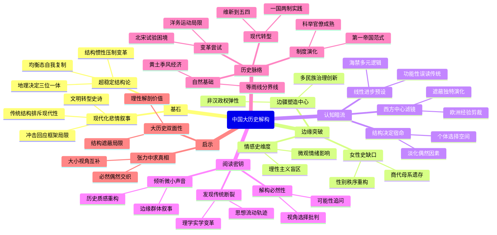

豆瓣链接：https://book.douban.com/subject/36619594/

# 深层解构

### 基石：大历史观的核心支点——"从结构看历史"的执念
黄仁宇的论证始终锚定两个核心信念：
1. **超稳定结构决定论**
他将中国历史视为"黄土文明塑造的超级共同体"，反复强调土壤、雨量、季风等地理要素如何催生"中央集权-自耕农经济-科举官僚制"的三位一体结构。这种结构如同精密齿轮，从秦汉"第一帝国"到明清"内向型王朝"，始终通过"均衡态调整"实现自我复制。书中对"兵马俑象征军事管理标准化"、"宋代活字印刷未引发变革"等论述，均服务于"结构惯性大于个体能动性"的判断。

2. **现代化悲情叙事**
在他的叙事里，中国历史的终极命题是"传统结构如何对接现代性"。从晚明"停滞的内省"到清末"自强运动的困境"，所有挫折都被解释为"超稳定结构"对契约精神、资本流动等现代要素的排斥。这种"冲击-回应"框架隐含着对"西方现代性普适性"的默认，使得全书成为一部文明转型的悲壮史诗。

### 边缘：被轻拂的思想火花——那些可能改写认知的线头
在宏大叙事的间隙，藏着几处极具颠覆性的微光：
1. **女性史的破窗**
书中惊鸿一瞥提到"商代贵族妇女地位远超后世"，却未深入。这其实撕开了一个关键缺口：所谓"传统社会结构"并非铁板一块，早期母系遗存与父权强化之间存在动态博弈。若沿此追问，或许能发现儒家伦理对性别秩序的重构过程，比"大历史"描述的更曲折。

2. **情感史的暗涌**
作者用华清池故事隐喻"人类共同情绪永存"，这暗示历史书写中被忽视的情感维度。当我们用"大结构"解释变法失败时，是否忽略了康有为的焦虑、光绪的挣扎这些微观情感如何影响历史节奏？黄仁宇的"水库隐喻"无意中提示：理性主义史观之外，还有情感动力的暗流。

3. **边疆的他者视角**
在"蒙古人插曲""满洲人作为"等章节，作者将非汉政权视为"结构扰动因素"，但未深究这些"插曲"如何重塑中原文明。事实上，元清对疆域的整合、对多民族治理的探索，可能正是传统中国"超稳定结构"保持弹性的关键，这种"边缘对中心的塑造"，是大历史观未充分展开的重要维度。

### 暗流：未被审视的认知河床——隐藏的前提与盲区
在看似客观的叙事下，流动着三条未被言明的假设：
1. **线性进步的陷阱**
将"现代化"预设为历史唯一进步方向，导致对传统文明的"功能性误读"。比如将明代"海禁"简单归为"内向保守"，却忽视朝贡体系下跨洋贸易的多元逻辑；将科举制视为"束缚创新"，却未深究它在维系文明连续性中的独特价值。这种"以今度古"的视角，容易让读者陷入"传统-现代"的二元对立思维。

2. **西方中心的滤镜**
作为接受西方史学训练的学者，黄仁宇的"大历史观"不自觉带有"用中国史验证西方理论"的倾向。当他用"数目字管理"衡量宋代经济、用"封建主义"类比周代社会时，本质上是在用欧洲经验剪裁中国现实。这种方法论背后，是"全球史=西方史延伸"的潜在认知，可能遮蔽中国文明的独特演化逻辑。

3. **结构决定的宿命论**
过分强调地理-经济结构的决定性，容易淡化历史中的偶然与创造。比如书中将戊戌变法失败归因于"新旧力量对比悬殊"，却较少讨论康梁策略的激进性、慈禧权力平衡术等偶然因素。当我们被"大结构"的必然性说服时，可能忽略了每个历史节点上，个体选择曾拥有的微妙空间。

### 给读者的三把钥匙
1. **当你看到"必然"时，追问"谁说了算"**
书中频繁使用"不得不""注定"等表述，这是结构决定论的语言标记。试着在这些地方暂停，思考：这种"必然"是事实描述，还是视角选择？有没有被结构遮蔽的其他可能性？

2. **当你读到"传统"时，寻找"断裂"**
黄仁宇擅长勾勒连续的结构，但传统本身是流动的。比如书中将"儒家正统"视为一成不变的思想基石，却未详述宋明理学对原始儒学的改造、清代实学对空谈心性的反叛。在"传统"的标签下，藏着无数次思想地震。

3. **当你沉浸"宏大"时，听听"微小"的声音**
书中压缩了具体人物的悲欢、小众群体的命运。试着用"边缘"部分的线索（如商代女性、晚明士人）展开想象：如果让这些"缺席的多数"成为叙事主角，历史会不会呈现出不同的质感？

### 最后的启示：大历史观的真正价值
黄仁宇的伟大，在于用手术刀般的理性切开历史的肌理；而他的局限，也恰在于此。阅读这本书的终极意义，不是接受"大结构"的解释，而是学会在"大"与"小"、"必然"与"偶然"、"结构"与"人"之间保持思辨的张力。当我们既能看见黄土高原上的文明年轮，也能听见西湖边一个书生女婿的叹息，或许才算真正读懂了中国大历史的复杂密码。

# 章节内容
### 为什么称为“中国大历史”？——中文版自序
黄仁宇先生开创“大历史”研究方法，以宏观视角审视中国历史。鉴于中国在150年间从封闭走向现代，影响巨大，传统历史研究尺度已不适用。他运用归纳法整合史料，构建整体框架，并与欧美史对比，力求呈现中国历史全貌，此即“中国大历史”的独特意义与价值所在。

### 第一章 西安与黄土地带
中国的黄土土质细腻，利于耕种，季候风带来丰沛雨量，黄河既滋润大地又常泛滥成灾，这三大因素促使中国形成中央集权的农业官僚体系，也是战国统一于秦的重要助力。全中国平均雨量呈定型状态，“15英寸等雨线”从东北向西南延伸，其东南雨量充足，农业发达，人口密集；西北则干旱少雨，人们逐水草而居，依赖游牧为生。这种差异导致农民与牧人长期争斗，影响着中国历史的发展进程。

### 第二章 亚圣与始皇
本章聚焦孟子（亚圣）与秦始皇。孟子主张“仁政”“民贵君轻”等儒家思想，倡导统治者以民为本，施行德治。秦始皇则统一六国，建立中央集权制度，推行郡县制、统一度量衡等措施，加强了国家的统一和管理。作者通过对比二者理念与作为，探讨儒家思想与法家实践在历史进程中的碰撞、融合及其对后世的深远影响，展现了中国古代治国思想的多元性与演变脉络。

### 第三章 土壤、风向和雨量
在自然因素方面，土壤的特性影响农业生产方式和人口分布，肥沃的土壤利于定居农耕，促使人口聚集。风向和雨量的分布不仅决定农业收成，还影响文明发展方向。例如，适宜的气候条件推动农业繁荣，进而支撑起庞大的人口和复杂的社会结构，而不稳定的气候则可能引发社会动荡。这些自然因素相互交织，强化了中央集权的必要性，因为只有强大的中央政权才能有效组织资源应对自然灾害，保障社会稳定和农业生产的持续发展。

### 第四章 兵马俑的幕后
兵马俑背后是秦朝强大国力和高度集权的体现。秦始皇陵规模宏大，兵马俑制作精良，反映出秦朝在工程组织、工艺技术、资源调配等方面的卓越能力。从政治角度看，这是秦始皇专制统治的产物，彰显其至高无上的权威；在军事上，展示了秦朝强大的军事力量和先进的军事制度；从文化层面，体现了秦朝对丧葬文化的重视以及对来世的观念。同时，修建过程耗费大量人力物力，也为秦朝的兴衰埋下伏笔。

### 第五章 第一帝国：树立楷模
秦汉时期作为第一帝国，在诸多方面树立典范。政治上，中央集权不断强化，官僚体系逐渐完善，形成了一套有效的行政管理模式。经济上，统一度量衡促进了全国范围内的经济交流与发展，重农抑商政策稳定了农业基础。文化方面，汉武帝“罢黜百家，独尊儒术”，使儒家思想成为正统，影响中国社会两千多年。这些制度和模式为后世王朝提供了借鉴，奠定了中国封建社会长期稳定发展的基础。

### 第六章 名士成为军阀
东汉末年，政治腐败，社会动荡，察举制等选官制度名存实亡，导致名士阶层崛起。他们凭借家族势力、名声威望，在地方上形成割据势力，逐渐演变为军阀。如袁绍家族“四世三公”，门生故吏遍天下。这一时期，军阀混战，社会秩序遭到严重破坏，经济衰退，百姓流离失所。但也促使地方经济、文化在一定程度上自主发展，为民族融合和文化交流创造了条件，同时加速了旧有政治制度的瓦解。

### 第七章 长期分裂的局面
三国两晋南北朝长期分裂，政权更迭频繁。政治上，士族门阀势力强大，垄断政治权力，形成独特的门阀政治。民族方面，少数民族大量内迁，与汉族相互融合，如北魏孝文帝改革促进了民族融合进程。经济上，南方经济得到开发，南北经济差距逐渐缩小。文化上，玄学兴起，佛教盛行，文学艺术繁荣发展，呈现出多元文化融合的特点。分裂局面虽带来动荡，但也为文化创新和民族融合提供了机遇，为隋唐大一统奠定了基础。

### 第八章 历史向侧面进出
在历史主流发展中，一些看似边缘的因素实则影响深远。民间文化如民俗、传说等，反映了普通民众的生活态度和价值观，丰富了中国文化内涵。地方风俗在地域差异中形成独特文化标识，影响人们的行为方式和社会关系。非主流思想流派如墨家、名家等，虽未成为主流，但在思想碰撞中推动了学术发展。这些侧面因素与主流历史相互交织，共同构成了丰富多彩的中国历史画卷，从不同角度展现了社会全貌。

### 第九章 统一的途径
隋唐实现统一，采取了一系列措施。政治上，实行三省六部制，分割相权，加强皇权，同时提高行政效率；地方推行州县制，加强中央对地方的控制。军事上，府兵制寓兵于农，减少财政负担，保证军队战斗力。文化上，科举制打破士族垄断，选拔人才，促进社会阶层流动，加强了文化认同感。统一顺应了民族融合趋势和经济发展需求，推动了中国历史进入繁荣昌盛的隋唐时代，为后世统一王朝提供了成功范例。

### 第十章 第二帝国：已有突破，但未竟事功
隋唐时期（第二帝国）取得诸多突破。政治上，科举制进一步完善，成为选拔官员的重要制度，扩大了统治基础；三省六部制运行成熟，决策更加科学。经济上，商业繁荣，城市兴起，出现了柜坊、飞钱等金融创新，丝绸之路贸易兴盛。文化上，诗歌、绘画、书法等艺术形式达到高峰，对外文化交流广泛。然而，藩镇割据威胁中央集权，土地兼并导致农民失去土地，党争消耗国家精力，这些问题最终导致帝国衰落，未能实现持续发展，但其成就与教训对后世影响深远。

### 第十一章 北宋：大胆的试验
北宋进行了一系列大胆改革尝试。政治上，通过杯酒释兵权等措施，解除武将兵权，加强中央集权；设立参知政事、枢密使、三司使分割宰相权力。经济上，王安石变法试图解决积贫积弱问题，推行青苗法、方田均税法、市易法等，促进经济发展，增加财政收入。军事上，实行更戍法，加强对军队控制，但也导致军队战斗力下降。这些试验虽有一定成效，但由于触动保守势力利益、执行过程中的问题等，最终未能从根本上改变北宋的困境，却体现了北宋统治者在面临内忧外患时积极探索国家治理模式的努力。

### 第十二章 西湖与南宋
南宋以杭州（西湖所在）为都城，偏安一隅。政治上，与金对峙，维持着相对稳定的局面。经济上，江南地区经济进一步繁荣，农业、手工业、商业高度发达，城市经济繁荣，海外贸易兴盛，成为当时世界上重要的经济中心之一。文化上，理学发展成熟，成为官方正统思想，影响深远；文学艺术如宋词、绘画等取得辉煌成就，展现出独特的时代风貌。南宋在特殊历史环境下，经济文化的发展为中国南方地区的繁荣奠定了坚实基础。

### 第十三章 蒙古人的插曲
元朝时期，蒙古人入主中原。蒙古帝国通过大规模扩张建立元朝，实行行省制，加强了中央对地方的管理，这一制度对后世影响深远。在民族政策上，实行等级制度，民族矛盾较为突出。经济上，促进了东西方贸易交流，商业繁荣，城市发展迅速。文化上，不同民族文化相互交流融合，元曲等文学形式兴起，丰富了中国文化宝库。元朝统治拓展了中国疆域，促进了民族融合和文化多元发展，但因其统治的特殊性和局限性，也存在诸多问题。

### 第十四章 明朝：一个内向和非竞争性的国家
明朝在政治上加强君主专制，废除丞相制度，设立内阁，皇权高度集中；同时设立厂卫特务机构，加强对臣民的监视。经济上，重农抑商政策严格，抑制了商业和资本主义萌芽的发展。对外政策上，实行海禁，闭关锁国，限制对外交流。这种内向和非竞争性的特点，源于封建制度后期的保守性、统治者的治国理念以及外部环境影响等因素。这导致明朝逐渐与世界发展潮流脱节，影响了中国社会的进步和发展。

### 第十五章 晚明：一个停滞但注重内省的时代
晚明政治腐败，宦官专权，党争激烈，社会矛盾激化，农民起义此起彼伏，如李自成起义最终推翻明朝统治。经济上，虽出现资本主义萌芽，但在封建制度压制下发展艰难。思想文化领域，心学盛行，注重内心反省，强调个人的主观能动性，对传统儒家思想产生冲击，一定程度上解放了思想，但在社会动荡的背景下，未能转化为推动社会变革的强大力量。晚明在政治经济上停滞不前，而思想文化领域的内省思潮反映了当时人们对社会现实的反思与探索。

### 第十六章 满洲人的作为
清朝前期，满洲人入主中原后采取了一系列统治措施。政治上，沿袭明朝制度并加以改进，设立军机处，进一步加强君主专制。民族政策方面，初期实行剃发易服等强制政策，引发民族矛盾，但后期逐渐采取满汉融合政策，促进民族关系缓和。在开疆拓土方面，巩固了多民族国家版图，如对新疆、西藏等地的有效管辖。文化上，大兴文字狱，加强思想控制，同时整理古籍，编纂《四库全书》等。满洲人的统治对中国历史产生了复杂影响，在奠定现代中国版图和民族格局方面发挥了重要作用。

### 第十七章 1800年：一个瞻前顾后的基点
1800年前后，中国处于封建社会晚期，政治上封建专制达到顶峰，政治腐败，官场黑暗。经济上，自然经济占主导地位，资本主义萌芽发展缓慢，土地兼并严重。文化上，传统文化发展成熟但逐渐僵化，思想禁锢严重。与此同时，西方列强开始崛起，世界格局发生变化，工业革命推动西方资本主义国家迅速发展，而中国却闭关自守，与世界发展趋势渐行渐远。这一时期成为中国历史发展的转折点，预示着中国面临前所未有的挑战与变革压力。

### 第十八章 从鸦片战争到自强运动
鸦片战争爆发，英国凭借坚船利炮打开中国大门。中国战败的根本原因在于政治腐败、经济落后、军事力量薄弱。此后，中国面临严重民族危机，列强侵略不断加剧。在此背景下，自强运动（洋务运动）兴起。洋务派主张学习西方先进技术，创办近代军事工业、民用企业，建立新式学堂，培养近代人才，发展近代海军。洋务运动开启了中国近代化进程，在一定程度上增强了中国的国防力量和经济实力，但由于未能触及封建制度根本，最终未能实现富国强兵目标。

### 第十九章 百日维新、民国成立和五四运动
戊戌变法（百日维新）在民族危机空前严重的背景下展开。维新派主张政治改革，实行君主立宪；经济上发展资本主义工商业；文化教育方面，提倡新学，废除八股取士。然而，由于封建顽固势力强大，维新派自身力量弱小且缺乏政治经验，变法仅持续百日便宣告失败。辛亥革命推翻了清王朝统治，建立中华民国，结束了两千多年的封建帝制，但革命果实被袁世凯窃取。五四运动爆发于巴黎和会外交失败后，青年学生成为先锋，广大群众、市民、工商人士等阶层广泛参与。五四运动推动了中国社会思想进步，传播了民主与科学思想，促进了马克思主义在中国的传播，开启了新民主主义革命序幕。

### 第二十章 现代中国及其在世界上的地位
从民国时期到新中国成立后，中国经历了巨大变革。新中国成立后，建立社会主义制度，通过社会主义改造确立了公有制的经济基础。经济建设上，经历了曲折探索，改革开放后取得举世瞩目的成就，逐步建立起社会主义市场经济体制。文化建设方面，坚持马克思主义指导地位，传承和创新传统文化，发展社会主义先进文化。中国在世界格局中的地位发生了根本性变化，从半殖民地半封建社会逐渐走向世界舞台中央，在国际事务中发挥着越来越重要的作用，中国的现代化道路为发展中国家提供了借鉴和启示。

### 第二十一章 台湾、香港与澳门
台湾、香港、澳门地区历史悠久，与内地联系紧密。近代以来，香港被英国通过不平等条约割占，澳门被葡萄牙侵占，台湾在甲午战争后被日本殖民统治。新中国成立后，始终致力于实现祖国统一。“一国两制”方针的提出，为解决港澳台问题提供了科学构想。香港、澳门回归后，保持繁荣稳定，“一国两制”实践取得成功。台湾问题是中国内政问题，两岸关系在和平发展道路上不断前进，经贸文化交流日益密切，体现了港澳台地区在祖国统一大业中的重要地位以及与内地共同发展的广阔前景。