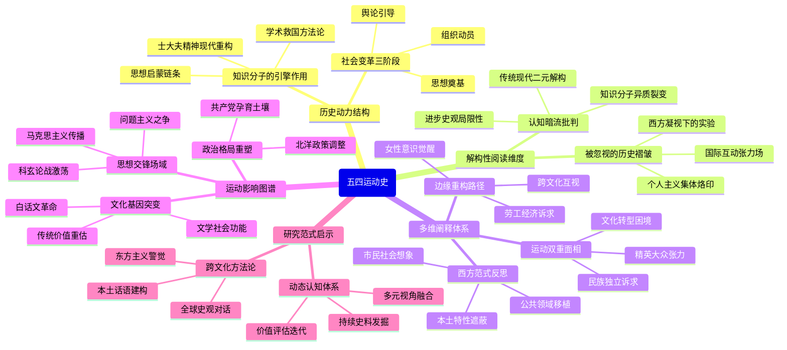

豆瓣链接：https://book.douban.com/subject/33391323/

# 深层解构

# 《五四运动史》深层解码：在历史褶皱中探寻现代中国的精神基因
## 一、基石：知识分子作为历史引擎的信念
周策纵的研究始终围绕着一个核心支点运转，即**新式知识分子是撬动中国现代化的关键杠杆**。他在书中细致入微地描绘了从1915年《新青年》创刊到1923年思想论战这一时期，以北大师生为代表的知识分子群体，如何凭借着报刊、社团以及校园等平台，将零散的思想火花汇聚成一股强大的社会变革潮流。在他的笔下，学生罢课、商人罢市和工人罢工等一系列行为，并非是自发的无序抗争，而是知识分子通过“思想启蒙—组织动员—舆论引导”这一完整链条所推动的结果。这种对知识分子“社会工程师”角色的强调，实际上源自他对中国传统“士大夫精神”的现代性重构——在传统士大夫“以天下为己任”的责任感基础上，融入了西方学术的方法论，从而形成了一种“学术救国”的独特史观。

**关键佐证**：
- 上编以“促成‘五四’运动的力量”“运动的萌芽阶段”等章节为框架，清晰地勾勒出知识分子如何通过文学革命和思想论争，为政治运动奠定了思想基础。
- 下编对“新思想与对传统的价值重估”进行了深入剖析，凸显了知识分子在打破旧文化体系和构建新文化秩序过程中的主导作用。

## 二、边缘：被轻拂而过的历史褶皱
### 1. 个人主义的“中国化变形”
周策纵在书中不经意间提到，五四运动时期的个人主义“不同于现代西方社会中个人主义的诞生”，其核心在于“个人对于社会和国家所负的责任”。这一表述看似简单，却暗示了一个重要的思想悖论：**在救亡图存的时代主题下，个人解放从一开始就被深深地烙上了集体主义的印记**。西方个人主义的发展历程是从“天赋人权”逐步走向“社会契约”，而中国的个人主义则像是被装进了“民族国家”的容器中，成为了富国强民的一种工具。这种独特的逻辑或许为后来中国现代化进程中个人与集体关系的复杂演变埋下了伏笔。

### 2. 国际语境中的“被观看”与“自我塑造”
书中专门设置了“世界主要国家对‘五四’运动的态度”这一章节，但可惜的是，内容仅仅停留在外交档案的罗列层面。实际上，这里隐藏着一个极具张力的研究方向：**当中国的知识分子在喊出“德先生”和“赛先生”的时候，他们是否意识到自己同时也成为了西方观察中国现代化的“实验样本”？** 日本对五四运动的警惕、美国传教士对学生运动的复杂态度等，这些看似边缘的内容，实则反映了中国在融入国际体系过程中的被动与主动交织的状态，也为我们理解“中国道路”的独特性提供了一个跨文化的视角。

## 三、暗流：未被审视的历史假设
### 1. “传统—现代”二元对立的认知框架
周策纵将新文化运动定义为“对传统的价值重估”，这种表述本身就暗含了一个前提假设，即传统与现代是相互对立、非此即彼的关系。然而，他忽略了一个重要的事实：像胡适、李大钊等新文化运动的倡导者，他们并非完全与传统割裂，而是在传统的基础上进行创新。例如，胡适的“整理国故”运动，实际上是试图运用现代学术方法对传统文化进行重新诠释，这一过程体现的是传统与现代的一种创造性转化，而并非简单的断裂。这种二元对立的框架虽然便于学术研究中的分析，但也在一定程度上简化了历史的复杂性。

### 2. 知识分子“同质性”的隐形预设
在书中，“新式知识分子”往往被当作一个统一的群体来对待，但实际上，这个群体内部存在着激烈的思想分歧。从1920年的“问题与主义”论战，到后来马克思主义者与自由主义者的分道扬镳，都表明知识分子群体并非是铁板一块。周策纵虽然在目录中列出了“观念与政治上的分歧”这一章节，但在具体论述中，更多地是将这种分歧视为运动的“余波”，而没有充分认识到这种分歧其实是运动内在矛盾的必然产物。这种对知识分子同质性的预设，可能导致对运动内部动力机制的分析不够深入。

### 3. “进步史观”的无意识渗透
全书整体上遵循着“启蒙—觉醒—变革”的线性叙事逻辑，这种逻辑背后是西方现代化理论所倡导的“进步史观”。然而，历史的发展并非总是沿着直线前进的，五四运动之后，中国社会经历了多次的反复和挫折。例如，20世纪30年代的复古思潮、80年代的文化热等，都表明传统与现代的博弈是一个长期而复杂的过程。周策纵的研究虽然强调了运动的历史意义，但也需要我们警惕“进步史观”可能带来的对历史多样性的遮蔽。

## 四、给读者的三把钥匙
### 1. 顿悟：五四运动的“双重面孔”
这本书表面上是在讲述一场政治运动和思想革命，但实际上，它揭示了现代中国在转型过程中的深层矛盾：**既要在国际竞争中实现民族独立，又要在文化层面完成传统的现代性转化；既要借助知识分子的精英力量，又要面对大众参与带来的社会动员难题**。周策纵通过对细节的考证，让我们看到了一个充满张力的五四运动，它既是一场破旧立新的革命，也是各种力量相互妥协的产物。

### 2. 惊喜：从“边缘”重构历史
如果我们将目光从知识分子群体转向女性、工人、农民等边缘群体，从国际反应转向跨文化的互动，就会发现五四运动是一个更加丰富多彩的历史场景。例如，当时上海工人罢工中提出的“增加工资”“改善劳动条件”等经济诉求，与学生的政治诉求相互交织，共同构成了运动的复杂性。这种从边缘视角对历史的重构，能够让我们更加全面地理解五四运动的社会基础和历史影响。

### 3. 发现：周策纵的“西方凝视”
作为海外汉学的代表人物，周策纵的研究不可避免地受到西方学术范式的影响。例如，他对“公共领域”“市民社会”等概念的运用，虽然为研究提供了新的视角，但也可能导致对中国社会特殊性的忽视。这种“西方凝视”并非是一种缺陷，而是提醒我们在阅读时要保持一种批判的意识，认识到任何历史书写都不可避免地带有时代和文化的烙印。

## 结语：在历史的缝隙中寻找未来
周策纵的《五四运动史》就像是一幅精心绘制的历史长卷，它为我们展现了现代中国的精神觉醒时刻。而我们的深层解码，就是要在这幅长卷的笔触之间，发现那些未被充分描绘的细节，思考那些未被解答的问题。当我们认识到五四运动并非是一个完美的历史起点，而是一个充满矛盾和张力的历史节点时，或许才能真正理解现代中国的复杂性和多样性。正如书中所说：“五四运动的影响是深远而复杂的，它不仅改变了中国的过去，也在塑造着中国的未来。”而我们的阅读和思考，也正是这场历史接力中的重要一棒。

# 章节内容
### 第一章：导言

周策纵首先阐明，他撰写此书秉持的是**多元史观**，注重区分亲历、听闻和传闻的史料，力求客观呈现历史。 他将“五四运动”作出广义和狭义的定义：狭义上指1919年5月4日的学生示威及由此引发的全国性抗议；广义上则是一场深刻的社会政治和思想文化革新运动，时间跨度约为1917至1921年。 作者认为，运动由两大因素激发：一是因“二十一条”和山东问题所燃起的爱国热情；二是在“**德先生（民主）**”与“**赛先生（科学）**”的旗帜下，知识分子对中国传统价值的全面重估。 运动的背景是复杂的，包括一战带来的民族资本短暂发展、科举废除后知识分子阶层的分化、军阀混战以及十月革命等国际社会主义运动的影响。

### 第二章：促成五四运动的力量（1915—1918）

本章的核心论点是，五四运动的直接促成力量，源于日本对华压迫激起的**国耻感**以及海外留学生的**改革热忱**。 作者深入分析了1915年日本向袁世凯政府提出的“二十一条”要求，这一事件被视为奇耻大辱，极大地刺激了国内的爱国情绪。周策纵指出，袁世凯政府在此期间利用了民众情绪，故意泄露谈判内容以博取国际同情和干预。同时，作者也揭示了历史的复杂性，提及孙中山领导的南京临时政府也曾为获取日本资助而计划签订有损主权的合同，部分条款甚至成为日后“二十一条”的蓝本。 此外，作者强调了留学生的作用，他们身处海外，吸收了各种西方思潮，对国内改革抱有强烈期望，成为推动变革的重要力量。

### 第三章：运动的萌芽阶段：早期的文学和思想活动（1917—1919）

本章论述了五四运动前夕的思想准备，核心是**新文化运动的兴起**。 作者认为，两大阵地奠定了运动的思想基础：一是陈独秀、胡适、李大钊等人创办的《新青年》杂志，它成为反传统、倡导新思想的主要舆论平台；二是蔡元培出任校长后的北京大学。蔡元培采取了“**思想自由，兼容并包**”的办学方针，延揽了陈独秀、胡适、鲁迅等一大批新派学者，使北大成为新思想的摇篮。 作者总结，这一阶段新知识分子的主张可概括为“德先生与赛先生”，具体包括：**反孔教、反专制、倡导民主自由与个人主义、提倡文学革命、推广白话文、主张女性解放**等。其核心思想，是尼采式的“重估一切价值”，对中国的传统伦理、社会制度和文化进行全面而猛烈的批判。

### 第四章：“五四”事件

本章详细记述了“五四”事件的直接导火索和爆发过程。作者认为，事件的根本原因是**中国在巴黎和会上的外交失败**。 一战后，国人本期望作为战胜国能收回德国在山东的权益，但列强却决定将其转交日本。更让民众愤怒的是，国内报纸披露，中国代表的失败，部分原因在于段祺瑞政府曾与日本签订密约，“**欣然同意**”了日方的要求。这一消息彻底粉碎了国人对和会的幻想，并将愤怒的矛头指向了“卖国贼”。 [1. 1] 作者分析了当时学生的特点：热心政治、有组织性、富有理想主义精神。在国耻消息刺激下，原计划于5月7日国耻纪念日的游行，被提前至5月4日。游行当天，三千多名学生在天安门集会，随后前往东交民巷使馆区请愿，并最终在曹汝霖住宅前与警察冲突，激愤之下**火烧赵家楼**并痛打了章宗祥。

### 第五章：事件的发展：学生示威与罢课

本章论述了“五四”事件后，学生如何将抗议持续升级为全国性的罢课运动。作者指出，北京政府起初的**处置失当是导致事态扩大的关键**。 事件发生后，政府内部文官派与亲日派态度不一，但最终强硬派占据上风。政府不仅拒绝了曹汝霖等人的辞职，反而发布惩戒令，并逮捕了部分学生。最具冲击性的事件是，备受敬重的北大校长**蔡元培为营救学生未果，愤而辞职**出走，此举极大地激发了社会各界的同情和学生的悲愤。为抗议政府镇压，北京学生联合会于5月19日正式发动了全市范围的**学生总罢课**，并将运动的重心转向抵制日货和唤醒民众，为更大规模的社会动员埋下了伏笔。

### 第六章：更进一步的发展：工商界及劳工界的支持

本章的论点是，**全国性的“三罢”（罢课、罢市、罢工）斗争最终迫使北洋政府让步**。 作者详细描述了运动如何从学生扩大到社会各阶层。由于政府在6月初对上街演讲的学生进行**大规模逮捕**，反而制造了一批“学生英雄”，彻底激怒了全国舆论。6月5日，上海工商界率先发起罢市，支持学生，随后工人阶级也加入罢工，运动的中心由北京转移到上海。 天津、南京等多地相继响应，形成了全国性的抗议浪潮。作者强调，商人和工人的支持给予了北洋政府致命的压力。最终，政府被迫释放全部被捕学生，并宣布**罢免曹汝霖、章宗祥、陆宗舆三人**的职务。在全国民众的压力下，中国代表团也最终**拒绝在巴黎和会上签字**，标志着五四爱国运动取得了直接的胜利。

### 第七章：新文化运动的扩展（1919—1920）

本章阐述了“五四”事件如何极大地推动了新文化运动在全国范围内的传播和深化。作者认为，事件的胜利使新知识分子声望大增，他们的思想主张获得了前所未有的关注和支持。 这一时期，**新刊物如雨后春笋般涌现**，许多旧报刊也纷纷改版，介绍新思想。同时，各种新式社团组织，如少年中国学会、新民学会等纷纷成立，成为传播新观念的重要载体。作者指出，五四之后形成了一股强大的“**偶像破坏**”浪潮，对传统文化、伦理和社会习俗的批判更加猛烈和广泛。此外，新知识分子积极投身**大众教育**，通过平民演讲、开办夜校等方式，努力将新文化、新思想向社会下层民众普及。

### 第八章：世界主要国家对五四运动的态度

本章分析了五四运动期间主要国家的反应，突显了当时复杂的国际格局对中国思想界的影响。作者周策纵指出，**日本政府自始至终持敌视态度**，不断向北洋政府施压，要求镇压学生运动，并散播运动由美国人煽动的谣言。 西方国家的态度则较为复杂，一方面，以美国驻华公使芮恩施为代表的外交官和学者对学生的爱国热情和民主诉求表示**同情与赞赏**；但另一方面，当运动触及租界利益时，上海的工部局则采取了**镇压措施**。 作者特别强调了**苏俄的吸引力**。1919年，苏俄政府发表“**加拉罕宣言**”，宣布放弃沙皇时代在中国的一切特权。这一举动与日本的压迫和西方列强的强权形成了鲜明对比，极大地赢得了中国知识分子的好感，使得社会主义思潮在中国的传播获得了空前有利的条件。

### 第九章：观念与政治上的分歧（1920—1922）

本章的核心是论述五四运动后期知识分子阵营的**思想分化与政治上的分裂**。作者指出，随着运动的深入，知识分子内部的分歧日益显现，其中最著名的是胡适与李大钊之间关于“**问题与主义**”的论战。胡适主张一点一滴地研究和解决具体“问题”，而李大钊等人则认为必须先有一个根本的“主义”作为指导。这场争论实质上反映了自由主义与社会主义两大思潮的对垒。 最终，曾作为新文化运动统一战线的知识分子群体走向分裂。“少年中国学会”等团体因政治立场不同而分道扬镳，成员们或转向国家主义（后成立中国青年党），或投身国民党，而李大钊、毛泽东等更为激进的一批人则最终选择了**共产主义**。作者引用邓中夏对左舜生所说的“**我们就在战场上再见！**”这句话，预示了此后中国两派知识分子长达数十年的悲剧性斗争。

### 第十章：社会政治的后果

本章总结了五四运动在社会和政治层面带来的深远影响。作者认为，最直接的政治后果是**促进了新型政党的形成和重组**。 学生的爱国精神和组织模式被国民党和新成立的共产党所继承，五四的思想成果也为1924年的国共合作与北伐奠定了基础。经济上，运动促进了**商人与城市工人阶级的觉醒**，他们认识到组织起来的力量，各种商会和工会组织得到发展。社会层面，最显著的成就是**女性解放**。在五四精神影响下，女子高等教育得以开创，女性就业机会增加，自由婚姻的观念得到推广，妇女参政热情也被激发。 此外，运动也推动了**教育改革**，但军阀的经费挪用让知识分子认识到，单纯的教育救国在那时是行不通的，从而促使许多人转向更直接的政治革命。

### 第十一章：文学革命

本章专门论述五四运动在文学领域的革命性成就。作者指出，这场革命的核心是**以白话文取代文言文**，以及用新的文学观念来创作。 运动前，梁启超、严复等人已开始尝试通俗文体，但真正的号角是由胡适在《新青年》上发表的《文学改良刍议》吹响的，他提出了著名的“**八不主义**”，主张文章要“言之有物”，不模仿古人，不无病呻吟，并提倡使用白话。陈独秀则激进地支持，认为这是文学的“革命”。 这场革命的成果丰硕，诞生了**现代新诗、新的散文形式和现代白话短篇小说**，其中鲁迅的《狂人日记》是划时代的杰作。运动胜利后，新文学阵营也出现分化，形成了以周作人等为代表、提倡“为人生”的**文学研究会**，和以郭沫若、郁达夫等为代表、更富浪漫主义色彩的**创造社**。

### 第十二章：新思想与对传统的价值重估

本章深入分析了新文化运动的思想内核，即**以西方近代思想为武器，对中国传统文化进行全面的价值重估**。 作者认为，旧思想的核心最终集中体现为“孔教”，而新思想则是一个庞杂的集合，包括**功利主义、自由主义、个人主义、社会主义以及达尔文主义**等，这些大多源于法国大革命后的西方思潮。在方法论上，新知识分子普遍推崇**实验主义和怀疑论**，强调以科学的、逻辑的方式来检视一切。这场价值重估运动的最高潮，体现在“**打倒孔家店**”这一激进口号上。作者特别提到了鲁迅的贡献，其小说《狂人日记》通过“吃人”的隐喻，对以儒家伦理为核心的传统文化发起了最猛烈的攻击，鲁迅也因此被誉为“中国的伏尔泰”。

### 第十三章：新思想与后来的论战

本章探讨了五四之后由新思想引发的几场重要文化论战。首先是“**疑古运动**”，以顾颉刚、钱玄同等人为代表，他们运用考据和怀疑的方法，对中国古代史籍进行重新审视，动摇了传统史观的权威。 其次是影响深远的“**非宗教运动**”，这场运动起初由教会学校禁止学生参加爱国运动引发，后演变为对一切宗教的批判，蔡元培等人组织“非宗教大同盟”，主张教育与宗教分离。  另一场重要的论战是“**东西文化论战**”。一战后，梁启超、梁漱溟等人认为西方文明已经破产，主张复兴东方文化以拯救世界；而另一些学者则坚持中国必须继续向西方学习。紧随其后的是“**科学与玄学论战**”，张君劢等人认为科学无法解决“人生观”问题，引发了关于科学的界限与价值的激烈辩论。这些论战反映了当时思想界的深刻分歧与迷茫。

### 第十四章：结论：繁多的阐释和评价

在最后一章，作者总结了后世对五四运动的各种不同评价。自由主义者将其视为**中国的文艺复兴或启蒙运动**；保守主义者则视之为**一场导致传统崩溃的浩劫**；而中国共产党则将其阐释为一场在十月革命影响下的**彻底的反帝反封建运动**。 对于运动的领导者，各派也说法不一，国民党和共产党都曾宣称自己是领导者，而自由主义者则倾向于突出胡适等人的作用。周策纵对此进行了辨析，认为运动是多方力量汇集的结果。作者本人对五四运动的最终阐释是：它是一场**根本性的、彻底的思想和社会政治变革，是中国新时代诞生的阵痛，也是西方近代史在中国的一个缩影**。他最后指出，五四之后中国自由主义者的软弱退缩，以及国民党和西方列强态度的转变，是影响后来中国发展的关键因素。