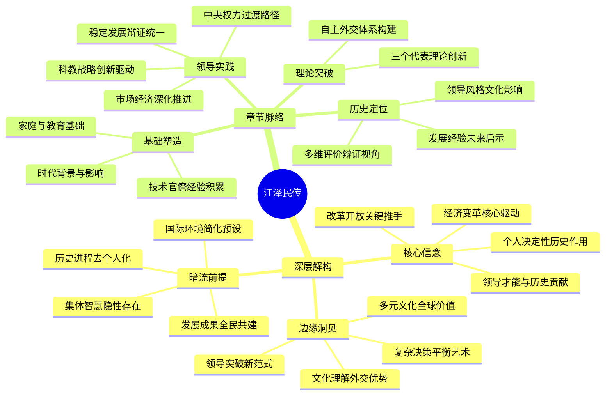

豆瓣链接：https://book.douban.com/subject/1023322/

# 深层解构
### 基石：核心信念
作者库恩的核心信念围绕着对江泽民个人能力与贡献的高度认可。他坚信江泽民凭借卓越的领导才能，带领中国在复杂的国际国内形势下实现了巨大变革。在他看来，江泽民是推动中国改革开放进程的关键人物，这种信念贯穿全书，从对江泽民参与经济特区建立、提出“社会主义市场经济”概念，到推动中国加入世界贸易组织等事件的描述中得以体现。库恩也相信个人在历史进程中能够发挥决定性作用，他将中国在江泽民时期的发展成就，很大程度上归因于江泽民个人的智慧、勇气和决心 ，强调江泽民的领导是中国从困境走向繁荣的核心驱动力。

### 边缘：可能改变一切的洞见
书中提到江泽民对语言的热爱使其对不同文化有深刻见解，这一细节虽然着墨不多，但却蕴含重要洞见。这表明文化理解在国际交往中的重要性，江泽民凭借对不同文化的理解，在外交场合展现出独特魅力，如他1997年访美在哈佛大学用英文演讲，赢得广泛喝彩，为中国外交增添助力。这启示人们，在全球化背景下，深入理解多元文化是开展有效外交、提升国家形象的重要因素。另外，书中对江泽民在面对国内改革阻力和国际压力时，如何平衡各方利益、推动改革前进的描述，为研究在复杂环境下的决策机制和领导艺术提供了生动案例，为领导者在困境中寻求突破提供新思路。 

### 暗流：未被言说的前提
作者在书中描述中国发展历程时，默认国际环境是相对稳定且可预测的，没有充分探讨当时国际形势中潜在的巨大不确定性和复杂性。实际上，20世纪末到21世纪初，国际格局处于深刻调整期，地区冲突不断、大国关系微妙变化、全球经济波动频繁，这些不稳定因素对中国的发展决策产生着重大影响。书中未深入剖析这些，可能会让读者对中国当时面临的挑战认识不足。此外，书中虽强调江泽民的领导作用，但存在将历史进程过度个人化的假设，忽略了中国共产党集体领导的力量，以及广大人民群众在改革开放和国家建设中的主体作用。中国在这一时期的发展成就是集体智慧和全体人民共同努力的结果，并非仅靠个人推动。 

# 章节内容
好的，下面是根据罗伯特·劳伦斯·库恩所著的《他改变了中国：江泽民传》一书编写的读书笔记。

## 《他改变了中国：江泽民传》读书笔记

### 第一章：引言

本章概述了江泽民所处的时代背景和他对中国产生的深远影响。作者认为，江泽民是一位具有重要历史意义的领导人，他在复杂和关键的时期引领中国实现了经济的快速发展和社会转型。本章还介绍了本书的写作目的和主要内容，旨在全面、客观地展现江泽民的生平和政治生涯。作者强调，江泽民对中国的影响是多方面的，包括经济、政治、文化和社会等各个领域，理解江泽民对于理解当代中国至关重要。

### 第二章：早年生活与教育

本章详细描述了江泽民的早年生活、家庭背景和所受教育。江泽民出生于一个知识分子家庭，从小受到良好的教育和家庭熏陶，培养了他对知识的渴望和对国家的热爱。他的求学经历，特别是在上海交通大学的电子工程专业学习，为他日后的技术官僚生涯奠定了基础。此外，本章还探讨了他的早期思想形成，以及在革命年代的个人选择和成长，这些都对他日后的政治生涯产生了重要影响。

### 第三章：技术官僚生涯

本章聚焦于江泽民在担任上海市长和市委书记期间的政绩和贡献。他在上海的工作经历展现了他的领导才能和务实作风。面对复杂的城市管理问题，他表现出卓越的组织协调能力和解决问题的能力，为上海的经济发展和社会稳定做出了重要贡献。此外，本章还分析了他在上海的工作经验如何为他日后担任国家领导人奠定了基础，以及他在上海时期所展现的政治智慧和领导风格。

### 第四章：进入中央

本章讲述了江泽民如何从上海调到中央，成为中国最高领导人的过程。这一过程并非一帆风顺，充满了挑战和机遇。在关键时刻，他凭借自身的政治智慧和各方支持，最终脱颖而出。本章还探讨了当时复杂的政治环境和权力格局，以及江泽民如何适应新的角色，建立自己的领导地位。

### 第五章：稳定压倒一切

本章分析了江泽民在担任最高领导人初期所面临的挑战，尤其是在政治和社会稳定方面。面对国内外的复杂形势，他坚持“稳定压倒一切”的原则，采取了一系列措施维护社会秩序和政治稳定。这些措施在当时具有重要的现实意义，但也存在争议。本章还探讨了稳定与发展之间的辩证关系，以及江泽民如何在两者之间寻求平衡。

### 第六章：经济改革

本章详细阐述了江泽民在经济改革方面所做的努力和贡献。他坚定不移地推进改革开放，进一步完善社会主义市场经济体制。在他的领导下，中国经济实现了持续快速发展，综合国力显著提升。本章还分析了江泽民的经济思想和改革思路，以及他对中国经济发展的长远影响。

### 第七章：科教兴国

本章着重介绍了江泽民提出的“科教兴国”战略。他高度重视科技和教育在国家发展中的作用，大力推动科技创新和教育改革。在他的倡导下，中国科技事业取得了长足进步，教育水平不断提高，为经济发展和社会进步提供了强大支撑。本章还探讨了“科教兴国”战略的实施情况和效果，以及对中国未来发展的意义。

### 第八章：三个代表

本章深入解读了江泽民提出的“三个代表”重要思想。“三个代表”是对马克思主义理论的创新和发展，为中国共产党的建设和发展提供了新的理论指导。本章分析了“三个代表”的内涵和意义，以及它对中国政治、经济、文化和社会发展的影响。同时，也探讨了对“三个代表”的各种解读和争议。

### 第九章：外交政策

本章分析了江泽民时期的中国外交政策。他奉行独立自主的和平外交政策，积极参与国际事务，努力维护国家利益和世界和平。在他的领导下，中国与世界各国的关系得到了显著改善，国际地位不断提高。本章还探讨了江泽民的外交思想和实践，以及他对中国外交的贡献。

### 第十章：个人风格与魅力

本章从个人角度描述了江泽民的性格特点、领导风格和个人魅力。他多才多艺，兴趣广泛，善于沟通，具有很强的亲和力。他的个人风格对中国政治文化产生了一定的影响。本章还通过一些生动的例子，展现了江泽民的个性和魅力。

### 第十一章：历史地位与评价

本章对江泽民的历史地位和作用进行了总结和评价。作者认为，江泽民是一位具有重要历史意义的领导人，他对中国的发展做出了重要贡献。他的功过是非需要历史地、辩证地看待。本章还探讨了对江泽民的各种评价和争议，力求全面、客观地展现他的历史形象。

### 第十二章：结论

本章是全书的总结，再次强调了江泽民对中国的影响和贡献。作者认为，江泽民是一位值得研究和纪念的领导人，他的思想和实践对中国未来的发展具有重要的借鉴意义。本章还展望了中国未来的发展前景，以及对江泽民时代的反思。

Citations:
[1] https://book.douban.com/subject/1264491/

---
来自 Perplexity 的回答: pplx.ai/share